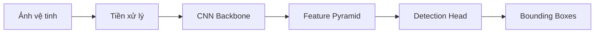

# Project Overview và Product Development Requirements (PDR)

## 1. Tổng Quan Dự Án

### 1.1. Tên và Mô Tả
- **Tên dự án:** Ứng dụng Deep Learning trong Viễn thám (Deep Learning in Remote Sensing)
- **Loại dự án:** Tài liệu nghiên cứu khoa học (Scientific Research Documentation)
- **Ngôn ngữ chính:** Tiếng Việt (với thuật ngữ kỹ thuật tiếng Anh)
- **Format:** Thesis-style documentation với 7 chương, 39 tệp Markdown

### 1.2. Mục Tiêu Nghiên Cứu
1. Tổng hợp kiến thức về Convolutional Neural Network (CNN) và Deep Learning
2. Giới thiệu phương pháp xử lý ảnh viễn tham hiện đại
3. Trình bày 2 case study thực tế:
   - Phát hiện tàu biển (Ship Detection)
   - Nhận dạng vết dầu loang (Oil Spill Detection)
4. Giới thiệu thư viện TorchGeo cho xử lý ảnh địa lý
5. Phân tích 3 cuộc thi xView Challenges (xView1, xView2, xView3)
6. Tổng hợp 15 giải pháp hàng đầu từ các cuộc thi

### 1.3. Phạm Vi Nội Dung

| Chương | Tiêu đề | Nội dung | Số file |
|--------|--------|---------|---------|
| 1 | Giới thiệu | CNN & Deep Learning foundations | 1 |
| 2 | Cơ sở lý thuyết | Kiến trúc CNN, phương pháp xử lý ảnh | 6 |
| 3 | Phát hiện tàu biển | Case study 1 với datasets | 4 |
| 4 | Phát hiện dầu loang | Case study 2 với datasets | 4 |
| 5 | TorchGeo | Implementation library & models | 5 |
| 6 | xView Challenges | 3 competitions, 15 winning solutions | 18 |
| 7 | Kết luận | Tổng kết và hướng phát triển | 1 |

---

## 2. Yêu Cầu Về Quy Trình Viết Tài Liệu

### 2.1. Phong Cách Viết Học Thuật Tiếng Việt

#### 2.1.1. Ngôn Ngữ và Tone
- **Tính chính thức:** Sử dụng ngôn ngữ học thuật trang trọng, không sử dụng thì chia sẻ cá nhân hay ngôn ngữ thân mật
- **Độ chính xác cao:** Mỗi khái niệm phải được định nghĩa rõ ràng trước khi sử dụng
- **Tránh lặp lại:** Không nhắc lại nội dung đã trình bày trong phần trước
- **Ký tự hóa:** Sử dụng ký tự, công thức toán học để biểu diễn chính xác (ví dụ: y = f(x) thay vì "hàm số")
- **Cấu trúc logic:** Mỗi đoạn phải có ý chính rõ ràng, không nhập mix ý tưởng

#### 2.1.2. Quy Tắc Từ Vựng
- **Tính nhất quán:** Sử dụng cùng một thuật ngữ học thuật cho cùng một khái niệm (ví dụ: "phân đoạn ngữ nghĩa" thay vì xen kẽ với "semantic segmentation")
- **Thống nhất tên gọi:** Lập danh sách các thuật ngữ chủ yếu và áp dụng nhất quán
- **Thuật ngữ tiếng Anh:** Giữ nguyên thuật ngữ kỹ thuật tiếng Anh phổ biến (CNN, ResNet, ROI, etc.) nếu chưa có thuật ngữ tiếng Việt thích hợp
- **Lần đầu xuất hiện:** Khi lần đầu sử dụng một thuật ngữ tiếng Anh quan trọng, cung cấp định nghĩa tiếng Việt (ví dụ: "Convolutional Neural Network (mạng nơ-ron tích chập)")

#### 2.1.3. Cấu Trúc Câu
- **Câu dài và phức tạp:** Sử dụng câu phức hợp để diễn tả ý tưởng phức tạp
- **Tránh viết tắt:** Không sử dụng viết tắt thân mật, duy trì độ chính thức
- **Chủ ngữ rõ ràng:** Luôn khai báo chủ ngữ rõ ràng, tránh câu không chủ ngữ
- **Chia dãy:** Khi liệt kê nhiều yếu tố, sử dụng dấu chấm phẩy để ngăn cách rõ

### 2.2. Quy Trình Kiểm Chứng Thông Tin

#### 2.2.1. Xác Minh Nguồn
- Tất cả dữ liệu thống kê phải có nguồn tham chiếu rõ ràng
- Khi trích dẫn kết quả từ bài báo, cung cấp thông tin chi tiết: tên tác giả, năm, tạp chí/hội nghị
- Đối với thông tin kỹ thuật, kiểm tra lại với tài liệu chính thức hoặc source code

#### 2.2.2. Loại Bỏ Trùng Lặp
- Trước khi thêm nội dung, kiểm tra xem nội dung này có xuất hiện ở chương/mục trước không
- Nếu có, tham chiếu đến phần trước thay vì lặp lại
- Sử dụng cross-reference: "Như đã trình bày ở Mục 2.1.1, ..."
- Tránh mô tả lại toàn bộ, chỉ cung cấp tóm tắt và liên kết

#### 2.2.3. Độ Sâu Kỹ Thuật
- **Đối với khái niệm cơ bản:** Cung cấp định nghĩa và các ví dụ minh họa
- **Đối với phương pháp phức tạp:** Trình bày thuật toán, công thức toán học, và diagram minh họa
- **Đối với kết quả thực nghiệm:** Cung cấp đầy đủ metric, bảng so sánh, và phân tích

#### 2.2.4. Tham Chiếu và Trích Dẫn
- Sử dụng định dạng trích dẫn: [Author, Year] hoặc "theo [Source]"
- Tạo liên kết nội bộ với cross-reference
- Danh sách tài liệu tham khảo ở cuối mỗi chương hoặc dự án

---

## 3. Tiêu Chuẩn Hình Ảnh và Diagram

### 3.1. Kích Thước và Định Dạng Hình Ảnh

#### 3.1.1. Ảnh Vệ Tinh/Ảnh Dữ Liệu
- **Chiều rộng tiêu chuẩn:** 800px (để phù hợp với chiều rộng nội dung)
- **Tỷ lệ khung hình:** Giữ nguyên tỷ lệ gốc, tối ưu hóa để đọc trên màn hình
- **Format:** PNG (cho ảnh với text/diagram), JPEG (cho ảnh vệ tinh tự nhiên)
- **DPI:** 150 DPI tối thiểu cho in ấn

#### 3.1.2. Kích Thước Hình Minh Họa Kiến Trúc
- **Diagram lớn:** 1000-1200px chiều rộng
- **Diagram vừa:** 600-800px chiều rộng
- **Diagram nhỏ (so sánh):** 400-600px chiều rộng

### 3.2. Diagram sử dụng Mermaid

#### 3.2.1. Loại Diagram Được Sử Dụng
1. **Flowchart:** Cho quy trình pipeline, thuật toán
2. **Architecture Diagram:** Cho kiến trúc mạng, hệ thống
3. **Sequence Diagram:** Cho quy trình xử lý dữ liệu
4. **Class Diagram:** Cho cấu trúc lớp (nếu cần)
5. **Timeline:** Cho lịch sử phát triển

#### 3.2.2. Quy Tắc Thiết Kế Diagram Mermaid
- **Tên rõ ràng:** Mỗi node phải có tên tiếng Việt rõ ràng hoặc tiếng Anh chính thức
- **Hướng luồng:** Luôn tuân theo hướng từ trái sang phải hoặc từ trên xuống dưới
- **Màu sắc đơn giản:** Sử dụng các màu cơ bản để phân biệt (nhập vào, xử lý, đầu ra)
- **Không quá phức tạp:** Nếu diagram có trên 15 node, tách thành nhiều diagram nhỏ hơn

#### 3.2.3. Ví Dụ Cấu Trúc Mermaid

### 3.3. Hình Ảnh AI-Generated

#### 3.3.1. Khi Sử Dụng
- Cho các diagram kiến trúc mạng phức tạp (ví dụ: 3D visualization của layers)
- Cho minh họa khái niệm trừu tượng (ví dụ: receptive fields của CNN)
- Cho so sánh trực quan giữa các phương pháp
- **KHÔNG sử dụng** cho dữ liệu thực hoặc kết quả thực nghiệm

#### 3.3.2. Prompt Template
- Mô tả chi tiết: Loại diagram, các thành phần, bố cục
- Yêu cầu style: Khoa học, chuyên nghiệp, màu sắc thích hợp
- Độ phân giải: "high resolution, 4K, suitable for academic paper"

---

## 4. Quy Trình Đảm Bảo Chất Lượng (QA)

### 4.1. Kiểm Tra Nội Dung
- **Độc lập:** Sử dụng tool kiểm tra đơn vị (spelling, grammar) tự động
- **Kiểm tra Cross-Reference:** Xác nhận mọi tham chiếu (Mục, Hình, Công thức) đều chính xác
- **Kiểm tra Terminology:** Xác nhận tất cả thuật ngữ được sử dụng nhất quán
- **Kiểm tra Duplicate Content:** Tìm nội dung bị lặp lại và loại bỏ hoặc chuyển thành cross-reference

### 4.2. Kiểm Tra Kỹ Thuật
- **Công thức toán học:** Xác nhận mọi công thức được render chính xác
- **Code snippets:** Nếu có code, kiểm tra syntax đúng
- **Links:** Xác nhận mọi liên kết nội bộ và ngoài có hiệu lực
- **Hình ảnh:** Xác nhận mọi hình được load đúng, kích thước phù hợp

### 4.3. Kiểm Tra Cấu Trúc
- **Heading hierarchy:** H1 là tiêu đề chương, H2 là mục, H3 là submục
- **Table of Contents:** Tự động sinh TOC, kiểm tra tính đầy đủ
- **Metadata:** Xác nhận mỗi file có metadata (title, date, author)

### 4.4. Quy Trình Xem Xét
1. **Tác giả:** Tự kiểm tra grammar, spelling, consistency
2. **Peer review:** Có người khác xem xét nội dung kỹ thuật
3. **Final check:** Kiểm tra lại cross-reference và formatting trước xuất bản

---

## 5. Quy Trình Phát Hành

### 5.1. Phiên Bản
- **Format:** v{major}.{minor}.{patch}
- **Major:** Cấu trúc dự án thay đổi (thêm/xóa chương)
- **Minor:** Thêm nội dung mới, cập nhật nội dung
- **Patch:** Sửa lỗi, cải thiện wording

### 5.2. Build & Deploy
- **VitePress build:** Tự động khi push lên main branch
- **GitHub Pages:** Tự động deploy qua GitHub Actions
- **DOCX export:** Manual trigger hoặc tự động via GitHub Actions
- **Release notes:** Cập nhật CHANGELOG.md với mỗi phiên bản

### 5.3. Sử Dụng Git
- Commit message: Tiếng Việt hoặc tiếng Anh rõ ràng
- Branch naming: `feature/chapter-name` hoặc `fix/issue-description`
- PR review: Ít nhất 1 reviewer trước merge

---

## 6. Danh Sách Thuật Ngữ Chính (Glossary)

### 6.1. Thuật Ngữ Cơ Bản
| Tiếng Anh | Tiếng Việt | Định nghĩa ngắn |
|-----------|-----------|-----------------|
| Convolutional Neural Network | Mạng nơ-ron tích chập | Loại mạng thần kinh chuyên dùng xử lý ảnh |
| Deep Learning | Học sâu/Deep Learning | Phần của machine learning sử dụng mạng nơ-ron sâu |
| Remote Sensing | Viễn thám | Thu thập dữ liệu địa lý từ xa (vệ tinh, drone) |
| Feature Extraction | Trích xuất đặc trưng | Quá trình tìm các đặc trưng quan trọng từ dữ liệu |
| Receptive Field | Trường nhận thức | Vùng ảnh mà một neuron "nhìn thấy" |

### 6.2. Thuật Ngữ Chuyên Ngành
| Tiếng Anh | Tiếng Việt | Lĩnh vực |
|-----------|-----------|---------|
| Object Detection | Phát hiện đối tượng | Computer Vision |
| Semantic Segmentation | Phân đoạn ngữ nghĩa | Computer Vision |
| Instance Segmentation | Phân đoạn instance | Computer Vision |
| Backbone Network | Mạng Backbone | Neural Network Architecture |
| Attention Mechanism | Cơ chế Attention | Deep Learning |
| Transfer Learning | Học chuyển giao | Machine Learning |

---

## 7. Mục Tiêu Chất Lượng Dự Án

| Chỉ Tiêu | Mục Tiêu | Phương Pháp Đánh Giá |
|---------|---------|-------------------|
| Completeness | 39 file, 7 chương hoàn thiện | Counting files, checking all sections |
| Accuracy | 100% kỹ thuật chính xác | Peer review, cross-check with sources |
| Consistency | Terminology 100%, style 100% | Automated glossary check, style guide |
| No duplication | <2% duplicate content | Plagiarism detection tools |
| Link validity | 100% links hoạt động | Automated link checker |
| Images quality | Tất cả images >=150 DPI | Manual review |

---

## 8. Lịch Sử Phiên Bản

| Phiên Bản | Ngày | Nội Dung Chính | Trạng Thái |
|-----------|------|---------------|-----------|
| v1.0.0 | 2024-12-19 | Initial documentation structure | In Progress |
| v1.1.0 | TBD | All chapters completed | Planned |
| v2.0.0 | TBD | Added DOCX export, polish writing | Planned |
