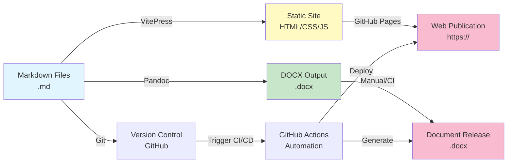
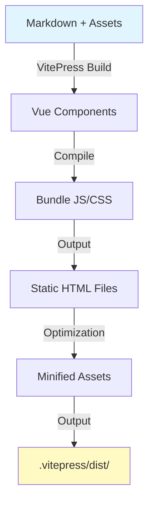
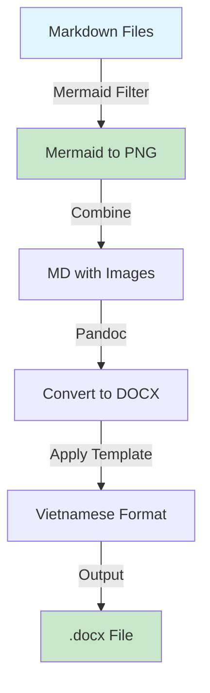
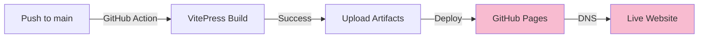
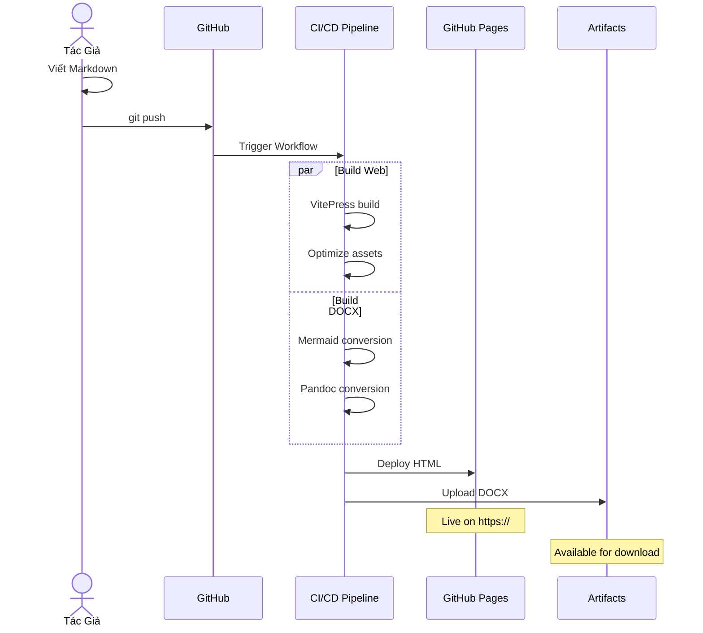
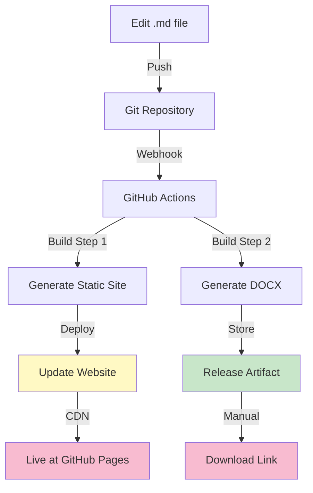
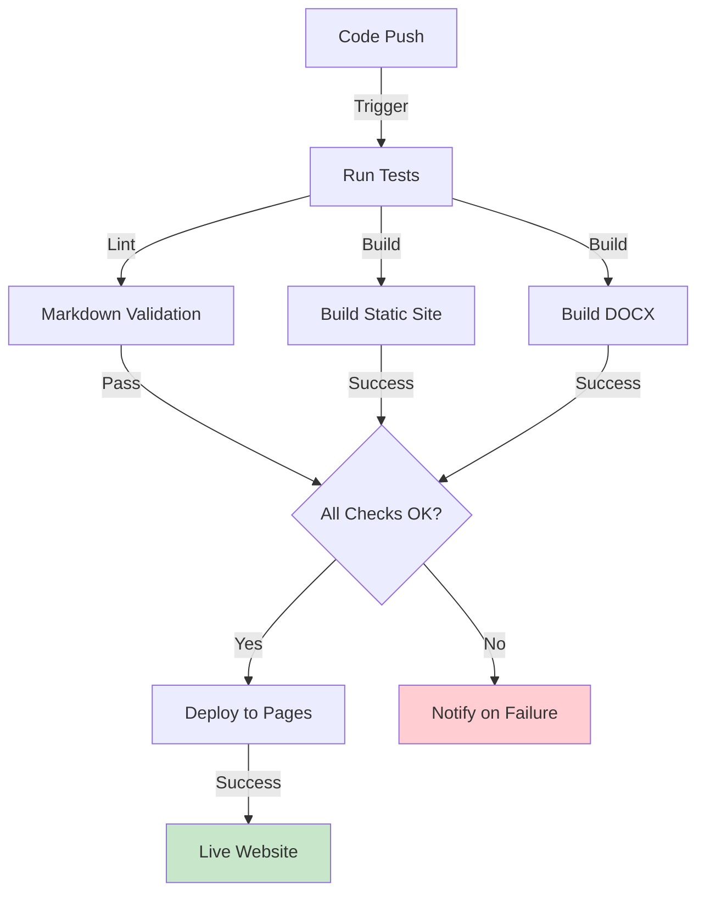
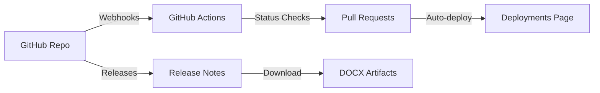

# System Architecture - Kiến Trúc Hệ Thống Phát Hành Tài Liệu

## 1. Tổng Quan Kiến Trúc

Hệ thống này quản lý quy trình từ viết tài liệu Markdown đến phát hành dưới nhiều định dạng (Web, DOCX, PDF).



---

## 2. Các Thành Phần Chính (Components)

### 2.1. Content Layer

**Markdown Files (.md)**
- Location: `/docs/chuong-*/muc-*/`
- Language: Vietnamese + English technical terms
- Format: GitHub Flavored Markdown (GFM)
- Features: Math (LaTeX), Code blocks, Mermaid diagrams, Images

**Asset Files**
- Location: `/docs/assets/images/`
- Types: PNG (diagrams), JPEG (satellite imagery)
- Organization: By challenge (xview1/, xview2/, xview3/)
- Standard size: 800px width (responsive)

**Configuration**
- Location: `/docs/.vitepress/config.mjs`
- Purpose: VitePress settings, navigation structure
- Languages: Vietnamese (vi-VN)
- Themes: Default VitePress theme + Mermaid plugin

---

### 2.2. Build Pipeline Layer

#### 2.2.1. Web Build (VitePress)



**Process:**
1. Read all `.md` files from `/docs`
2. Parse markdown with plugins:
   - `vitepress-plugin-mermaid`: Render diagrams
   - Math renderer: LaTeX equations
   - Highlight plugin: Code syntax highlighting
3. Generate HTML from markdown
4. Build Vue components for navigation/layout
5. Bundle CSS and JavaScript
6. Minify assets
7. Output to `/docs/.vitepress/dist/`

**Technologies:**
- VitePress 1.5.0+ (Vue 3 based)
- Vite build tool (fast rebuild)
- Markdown-it parser
- Mermaid.js for diagrams

**Config Location:** `/docs/.vitepress/config.mjs`

#### 2.2.2. DOCX Build (Pandoc)



**Process:**
1. Identify all markdown files in order (from VitePress sidebar config)
2. Run mermaid-filter to convert Mermaid code to PNG:
   - `mermaid-cli` generates diagram images
   - Replace mermaid blocks with image references
3. Use Pandoc to convert markdown to DOCX:
   - Custom reference template: `/templates/reference.docx`
   - Vietnamese formatting applied (font, spacing, margins)
4. Post-processing (if needed):
   - Add title page
   - Add table of contents
   - Set page numbers
5. Output DOCX file

**Technologies:**
- Pandoc 2.0+
- mermaid-filter
- @mermaid-js/mermaid-cli
- python-docx (for advanced formatting)

**Script Location:** `/scripts/build-docx.sh`

**Template Location:** `/templates/reference.docx`

---

### 2.3. Deployment Layer

#### 2.3.1. GitHub Pages Deployment



**Process:**
1. Detect push to `main` branch
2. Trigger GitHub Actions workflow
3. Install dependencies: `npm install`
4. Run build: `npm run docs:build`
5. Upload build output to GitHub Pages
6. Site goes live at: `https://tchatb.github.io/sen_doc/`

**Workflow File:** `.github/workflows/deploy.yml`

**Trigger:** Any commit to `main` branch

#### 2.3.2. DOCX Artifact Generation

**Process:**
1. Manual trigger or scheduled via Actions
2. Run build-docx script
3. Generate `.docx` file
4. Upload as artifact
5. Available for download from workflow run

**Trigger:**
- Manual dispatch (on demand)
- Optional: Scheduled (e.g., after releases)
- Optional: On pull request approval

---

## 3. Data Flow (Luồng Dữ Liệu)

### 3.1. Write-Build-Publish Flow



### 3.2. Content Change Impact



---

## 4. Cấu Hình Chi Tiết (Detailed Configuration)

### 4.1. VitePress Configuration

**File:** `/docs/.vitepress/config.mjs`

**Key Settings:**
```javascript
{
  title: 'Deep Learning trong Viễn thám',      // Website title
  description: 'Nghiên cứu ứng dụng CNN...',   // Meta description
  base: '/sen_doc/',                            // GitHub Pages base URL
  lang: 'vi-VN',                                // Language

  themeConfig: {
    nav: [                                       // Top navigation
      { text: 'Trang chủ', link: '/' },
      { text: 'Giới thiệu', link: '/chuong-01-...' },
      // ... more nav items
    ],

    sidebar: [                                   // Left sidebar navigation
      {
        text: 'Chương 1: Giới thiệu',
        items: [ /* nested items */ ]
      },
      // ... more chapters
    ],

    search: { provider: 'local' },               // Local search
    outline: { level: [2, 3], label: 'Mục lục' } // TOC
  },

  mermaid: { theme: 'default' }                 // Mermaid config
}
```

### 4.2. Build Scripts

**Development:**
```bash
npm run docs:dev      # Start dev server at http://localhost:5173
```
- Hot reload on file changes
- Fast rebuild

**Production:**
```bash
npm run docs:build    # Build for production
npm run docs:preview  # Preview built site locally
npm run build:docx    # Generate DOCX file
```

### 4.3. GitHub Actions Workflow

**File:** `.github/workflows/deploy.yml`

**Triggers:**
- Push to `main` branch
- Manual dispatch (for on-demand builds)

**Steps:**
1. Checkout repository
2. Setup Node.js
3. Install dependencies
4. Build VitePress site
5. Deploy to GitHub Pages
6. (Optional) Build DOCX
7. (Optional) Upload as artifact

---

## 5. File Organization và Naming Conventions

### 5.1. Markdown Files

**Pattern:**
```
docs/chuong-{N:02d}-{vietnamese-name}/
  muc-{M:02d}-{vietnamese-name}/
    {K:02d}-{vietnamese-name}.md
```

**Examples:**
- `chuong-01-gioi-thieu/muc-01-tong-quan/01-gioi-thieu-cnn-deep-learning.md`
- `chuong-02-co-so-ly-thuyet/muc-01-kien-truc-cnn/01-kien-truc-co-ban.md`

**Naming Rules:**
- Lowercase Vietnamese with dashes
- Chapter number: 01-07 (2 digits)
- Section number: 01-99 (2 digits)
- File number: 01-99 (2 digits)
- Avoid accented characters in filenames (but OK in content)

### 5.2. Asset Organization

```
docs/assets/
  images/
    xview1/
      image-sources.md
      README.md
      *.png, *.jpg
    xview2/
      ...
    xview3/
      ...
```

### 5.3. VitePress Output

```
docs/.vitepress/
  dist/
    index.html
    chuong-01-gioi-thieu/...
    assets/
      js/
      css/
      images/
  cache/
  config.mjs
```

---

## 6. Versioning Strategy

### 6.1. Semantic Versioning

**Format:** `v{MAJOR}.{MINOR}.{PATCH}`

**Rules:**
- **MAJOR:** Structural changes (new chapters, reorganization)
- **MINOR:** Content additions (new sections, case studies)
- **PATCH:** Bug fixes, typo corrections, formatting improvements

**Examples:**
- v1.0.0 - Initial release
- v1.1.0 - Added new section
- v1.1.1 - Fixed typos and formatting
- v2.0.0 - Major restructuring

### 6.2. Release Management

**Process:**
1. Update CHANGELOG.md
2. Update version in package.json
3. Create git tag: `git tag v1.1.0`
4. Push tag: `git push origin v1.1.0`
5. GitHub Actions creates release with DOCX artifact

**Files Modified per Release:**
- Content files (`.md`)
- package.json (version update)
- CHANGELOG.md
- Git tags

---

## 7. Quality Assurance Pipeline

### 7.1. Pre-Commit Checks (Local)

```bash
# Potential hooks (to be implemented):
- npm run lint:md      # Markdown linting
- npm run check:links  # Link validation
- npm run check:spell  # Spelling check
```

### 7.2. CI/CD Checks (GitHub Actions)



### 7.3. Manual Quality Review

- **Peer review:** 2nd person reads content before merge
- **Link verification:** Manual check of all cross-references
- **Image validation:** Verify all images display correctly
- **Browser testing:** Check in multiple browsers (Chrome, Firefox, Safari)

---

## 8. Performance Considerations

### 8.1. Build Performance

| Task | Time | Notes |
|------|------|-------|
| npm install | ~2 min | Dependencies |
| VitePress build | ~30 sec | Full rebuild |
| DOCX generation | ~2 min | Mermaid + Pandoc |
| Total CI/CD | ~5 min | Full workflow |

### 8.2. Runtime Performance

**Web:**
- Minified output: ~500KB HTML + CSS + JS
- Lazy loading: Images and heavy content
- CDN: GitHub Pages (fast CDN by default)
- Search: Local, instantaneous

**DOCX:**
- File size: ~3-5MB (with embedded images)
- Generation: One-time, not real-time

---

## 9. Disaster Recovery

### 9.1. Backup Strategy

**Daily Backups:**
- GitHub keeps all commits and branches
- No separate backup needed (GitHub is backup)

**Recovery Process:**
```bash
# Revert to previous version
git revert {commit-hash}
git push origin main

# Or checkout specific commit
git checkout {commit-hash}
git push -f origin main  # Force push if needed
```

### 9.2. Data Loss Prevention

- All changes tracked in git
- No local-only files
- Automated backup via GitHub Actions artifacts
- Manual exports of DOCX available

---

## 10. Maintenance and Monitoring

### 10.1. Regular Tasks

**Daily:**
- Monitor GitHub Pages deployment status
- Check for broken links (manual or automated)

**Weekly:**
- Review analytics (if enabled)
- Check for outdated information

**Monthly:**
- Update dependencies: `npm update`
- Security audit: `npm audit`
- Verify all external links still valid

**Quarterly:**
- Review and update documentation standards
- Optimize performance
- Update version if needed

### 10.2. Monitoring Tools

```bash
# Check for outdated packages
npm outdated

# Audit security vulnerabilities
npm audit

# Check links (future implementation)
npm run check:links

# Validate markdown
npm run lint:md
```

---

## 11. Integration Points

### 11.1. GitHub Integration



### 11.2. External Services (Optional Future)

- **Analytics:** Google Analytics or GitHub Analytics
- **Comment System:** Utterances (comments on pages)
- **Search Enhancement:** Algolia search (for large docs)
- **CDN:** Cloudflare (optional for performance)

---

## 12. Security Considerations

### 12.1. Access Control

- **Write Access:** Team members only
- **Publish Access:** Automatic (GitHub Actions)
- **Branch Protection:** `main` branch requires PR review

### 12.2. Secret Management

- **No secrets in repo:** All config in environment
- **GitHub Secrets:** Deploy keys (if needed)
- **No credentials:** Any API keys stored safely

---

## 13. Scalability Plan

### 13.1. Current Capacity

- **Content:** 39 files (~20K words)
- **Build time:** ~30 sec (web), ~2 min (DOCX)
- **Deployment:** GitHub Pages (unlimited)

### 13.2. Future Scaling

**If content grows to 100+ files:**
- Split documentation into multiple VitePress projects
- Use monorepo structure (with workspace)
- Implement server-side rendering (if needed)
- Add CDN caching layer

**If traffic increases significantly:**
- Enable GitHub Pages CDN (already included)
- Add Cloudflare for additional caching
- Implement analytics for monitoring
- Consider dedicated hosting if needed

---

## 14. Troubleshooting Guide

### 14.1. Build Failures

**VitePress build fails:**
```bash
# Clear cache
rm -rf docs/.vitepress/cache
npm run docs:build
```

**Markdown parsing errors:**
- Check for unclosed code blocks or quotes
- Validate HTML syntax in markdown

**Mermaid diagram not rendering:**
- Verify mermaid syntax
- Check for special characters that need escaping

### 14.2. Deployment Issues

**GitHub Pages not updating:**
- Check GitHub Actions status
- Verify branch protection rules don't block auto-deploy
- Clear browser cache

**DOCX generation fails:**
- Verify Pandoc installation: `pandoc --version`
- Check mermaid-cli: `mmdc --version`
- Inspect mermaid-filter logs

---

## 15. Glossary - Kiến Trúc

| Term | Giải thích |
|------|-----------|
| VitePress | Framework để build static docs site từ Markdown |
| Pandoc | Universal document converter (MD → DOCX, etc.) |
| Mermaid | Diagram library cho flowchart, sequence, etc. |
| GitHub Pages | Free static site hosting từ GitHub |
| GitHub Actions | CI/CD automation platform |
| Markdown (GFM) | GitHub Flavored Markdown format |
| Artifact | Downloadable file output từ GitHub Actions |
| Base URL | `/sen_doc/` (GitHub Pages subpath) |

---

**Last Updated:** 2024-12-19
**Architecture Version:** v1.0.0
**Status:** Production Ready
