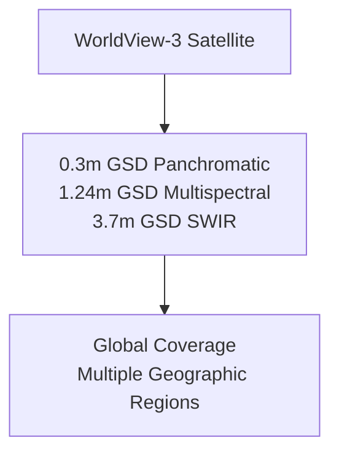
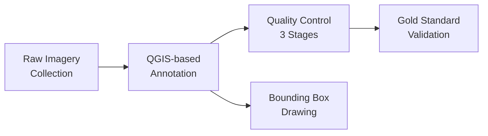

# xView1 Dataset: Phát hiện đối tượng trong ảnh vệ tinh

## Tổng quan

| Thuộc tính | Giá trị |
|-----------|-------|
| **Tên chính thức** | xView Dataset |
| **Năm phát hành** | 2018 |
| **Tổ chức** | Defense Innovation Unit (DIU), National Geospatial-Intelligence Agency (NGA) |
| **Nhiệm vụ** | Phát hiện đối tượng đa lớp |
| **Cuộc thi** | DIUx xView 2018 Detection Challenge |
| **Giải thưởng** | $100,000 |
| **Số lượng bài nộp** | 2,000+ |
| **Bài báo** | [xView: Objects in Context in Overhead Imagery (arXiv:1802.07856)](https://arxiv.org/abs/1802.07856) |

---

## Thống kê Dataset

### Thông số ảnh

| Chỉ số | Giá trị |
|--------|-------|
| **Tổng số ảnh** | 847 (tập huấn luyện) |
| **Kích thước ảnh trung bình** | 3,316 × 2,911 pixels |
| **Ground Sample Distance (GSD)** | 0.3 mét |
| **Dải phổ** | 3 băng (RGB) hoặc 8 băng đa phổ |
| **Diện tích phủ** | ~1,400 km² |
| **Nguồn vệ tinh** | WorldView-3 |

### Chú thích đối tượng

| Chỉ số | Giá trị |
|--------|-------|
| **Tổng số đối tượng** | 1,000,000+ |
| **Số lớp đối tượng** | 60 lớp chi tiết |
| **Loại chú thích** | Bounding box ngang |
| **Kích thước đối tượng nhỏ nhất** | ~3 pixels |
| **Kích thước đối tượng lớn nhất** | 100+ pixels |

---

## Phân loại lớp

### Danh mục cha (7 loại)

1. **Fixed-Wing Aircraft** (7 lớp)
2. **Passenger Vehicle** (5 lớp)
3. **Truck** (8 lớp)
4. **Railway Vehicle** (5 lớp)
5. **Maritime Vessel** (10 lớp)
6. **Engineering Vehicle** (10 lớp)
7. **Building/Facility** (15 lớp)

### Danh sách đầy đủ (60 lớp)

```
Fixed-Wing Aircraft:
├── Small Aircraft
├── Cargo Plane
├── Helicopter
├── Passenger/Cargo Plane
├── Fighter Jet
├── Bomber
└── Other Aircraft

Passenger Vehicle:
├── Small Car
├── Bus
├── Pickup Truck
├── Utility Truck
└── Van

Truck:
├── Cargo Truck
├── Truck with Box
├── Truck with Flatbed
├── Truck with Liquid Tank
├── Crane Truck
├── Railway Locomotive
├── Railway Car
└── Freight Car

Maritime Vessel:
├── Motorboat
├── Sailboat
├── Tugboat
├── Barge
├── Fishing Vessel
├── Ferry
├── Yacht
├── Container Ship
├── Oil Tanker
└── Engineering Vessel

Engineering/Construction:
├── Tower
├── Cooling Tower
├── Solar Panel
├── Storage Tank
├── Shipping Container
├── Shipping Container Lot
├── Pylon
├── Tower Crane
├── Container Crane
└── Reach Stacker

Building/Structure:
├── Damaged Building
├── Facility
├── Construction Site
├── Vehicle Lot
├── Helipad
├── Runway
├── Taxiway
└── Hangar
```

---

## Phân tích phân bố lớp

### Vấn đề mất cân bằng

| Loại lớp | Số lượng | Tỷ lệ |
|------------|----------------|------------|
| **Small Car** | 200,000-300,000 | ~25% |
| **Building** | 200,000-300,000 | ~25% |
| **Tần suất trung bình** | 1,000-50,000 | ~40% |
| **Railway Vehicle** | ~100 | <0.01% |
| **Tower** | ~100 | <0.01% |

**Thách thức chính:** Mất cân bằng lớp nghiêm trọng với tỷ lệ lên tới 3000:1 giữa lớp nhiều nhất và ít nhất.

---

## Phương pháp tạo Dataset

### 1. Thu thập ảnh



**Thông số vệ tinh:**
- **Vận hành:** Maxar Technologies (trước đây là DigitalGlobe)
- **Ngày phóng:** 13 tháng 8, 2014
- **Độ cao:** 617 km
- **Thời gian tái thăm:** <1 ngày trung bình
- **Khả năng thu thập:** 680,000 km²/ngày

### 2. Quy trình chú thích



**Quy trình từng bước:**

1. **Lựa chọn không gian địa lý**
   - Các vị trí địa lý đa dạng trên toàn cầu
   - Kết hợp môi trường đô thị, ngoại ô, công nghiệp, hàng hải
   - Nhiều loại khí hậu và địa hình

2. **Chuẩn bị tile**
   - Ảnh lớn được chia thành các tile dễ quản lý
   - Bảo toàn metadata không gian địa lý
   - Chuẩn bị ảnh đa băng (RGB + tùy chọn 8 băng)

3. **Chú thích với QGIS**
   - Người chú thích chuyên nghiệp sử dụng phần mềm QGIS
   - Vẽ bounding box theo trục xung quanh đối tượng
   - Gán nhãn lớp từ phân loại 60 lớp

4. **Kiểm soát chất lượng ba giai đoạn**
   - **Giai đoạn 1:** Xem xét chú thích ban đầu
   - **Giai đoạn 2:** Xác thực chéo giữa các người chú thích
   - **Giai đoạn 3:** Xác thực chuyên gia với mẫu tiêu chuẩn vàng

5. **Tạo tiêu chuẩn vàng**
   - Tập con ảnh với ground truth đã xác minh
   - Sử dụng cho đào tạo và xác thực người chú thích
   - Đảm bảo tính nhất quán trong nhóm chú thích

### 3. Hướng dẫn chú thích

**Quy tắc Bounding Box:**
- Bounding box chặt chẽ xung quanh phạm vi đối tượng nhìn thấy
- Bao gồm tất cả các phần nhìn thấy (loại trừ bóng)
- Xử lý che khuất: chỉ chú thích phần nhìn thấy
- Kích thước tối thiểu: đối tượng phải phân biệt được

**Gán lớp:**
- Sử dụng lớp cụ thể nhất có thể áp dụng
- Khi không chắc chắn, sử dụng danh mục cha
- Ghi lại các trường hợp mơ hồ để xem xét

---

## Thách thức Computer Vision

### Bốn vấn đề nghiên cứu

1. **Nhận dạng ở độ phân giải tối thiểu**
   - Đối tượng nhỏ chỉ 3 pixels
   - Thách thức: duy trì độ chính xác phát hiện ở độ phân giải thấp

2. **Phát hiện đối tượng đa tỷ lệ**
   - Kích thước đối tượng dao động từ 3 đến 100+ pixels
   - Cùng một ảnh chứa đối tượng ở các tỷ lệ rất khác nhau

3. **Học với mất cân bằng lớp**
   - Tỷ lệ 3000:1 giữa lớp phổ biến và lớp hiếm
   - Yêu cầu hàm loss và chiến lược lấy mẫu đặc biệt

4. **Phân loại chi tiết**
   - 80%+ lớp là chi tiết
   - Ví dụ: phân biệt máy bay chở hàng và máy bay chở khách

---

## Định dạng dữ liệu

### Cấu trúc thư mục

```
xview/
├── train/
│   ├── images/
│   │   ├── 0.tif
│   │   ├── 1.tif
│   │   └── ...
│   └── labels/
│       └── xView_train.geojson
├── val/
│   ├── images/
│   └── labels/
└── test/
    └── images/
```

### Định dạng chú thích (GeoJSON)

```json
{
  "type": "FeatureCollection",
  "features": [
    {
      "type": "Feature",
      "properties": {
        "bounds_imcoords": "xmin,ymin,xmax,ymax",
        "type_id": 11,
        "image_id": "0.tif"
      },
      "geometry": {
        "type": "Polygon",
        "coordinates": [[[x1,y1], [x2,y2], [x3,y3], [x4,y4], [x1,y1]]]
      }
    }
  ]
}
```

### Ánh xạ Class ID

| Dải ID | Danh mục |
|----------|----------|
| 11-17 | Fixed-Wing Aircraft |
| 18-23 | Passenger Vehicle |
| 24-28 | Truck |
| 29-34 | Railway Vehicle |
| 35-49 | Maritime Vessel |
| 50-59 | Engineering Vehicle |
| 60-94 | Building/Facility |

---

## So sánh với các Dataset khác

| Dataset | Số ảnh | Đối tượng | Lớp | Độ phân giải | Nhiệm vụ |
|---------|--------|---------|---------|------------|------|
| **xView** | 847 | 1M+ | 60 | 0.3m | Detection |
| DOTA | 2,806 | 188K | 15 | 0.1-0.5m | Detection |
| DIOR | 23,463 | 192K | 20 | 0.5-30m | Detection |
| COWC | 32 | 32K | 1 | 0.15m | Counting |
| NWPU VHR-10 | 800 | 3,775 | 10 | 0.5-2m | Detection |

**Ưu điểm của xView:**
- Số lượng đối tượng lớn nhất (1M+)
- Phân loại lớp đa dạng nhất (60 lớp)
- Độ phân giải cao (0.3m GSD)
- Phủ địa lý toàn cầu

---

## Sử dụng và Giấy phép

### Truy cập

- **Website:** [xviewdataset.org](https://xviewdataset.org)
- **Tải xuống:** Yêu cầu đăng ký
- **Định dạng:** Ảnh GeoTIFF + chú thích GeoJSON

### Giấy phép

xView dataset được phát hành cho mục đích nghiên cứu và giáo dục. Người dùng phải đồng ý với các điều khoản sử dụng bao gồm:
- Sử dụng cho nghiên cứu phi thương mại
- Trích dẫn đúng trong các ấn phẩm
- Không phân phối lại mà không có sự cho phép

### Trích dẫn

```bibtex
@article{lam2018xview,
  title={xView: Objects in Context in Overhead Imagery},
  author={Lam, Darius and Kuzma, Richard and McGee, Kevin and
          Dooley, Samuel and Laielli, Michael and Klaric, Matthew and
          Bulatov, Yaroslav and McCord, Brendan},
  journal={arXiv preprint arXiv:1802.07856},
  year={2018}
}
```

---

## Khuyến nghị tiền xử lý

### Cho huấn luyện

1. **Chia nhỏ ảnh (Image Tiling)**
   - Cắt thành các patch nhỏ hơn (512×512 hoặc 700×700)
   - Sử dụng overlap (80-100 pixels) để tránh hiện tượng biên

2. **Tăng cường dữ liệu (Data Augmentation)**
   - Xoay: 0°, 90°, 180°, 270°
   - Lật ngẫu nhiên (ngang/dọc)
   - Thay đổi tỷ lệ (±20%)
   - Tăng cường màu sắc (độ sáng, độ tương phản)

3. **Cân bằng lớp**
   - Lấy mẫu dưới ngẫu nhiên các lớp phổ biến
   - Lấy mẫu quá các lớp hiếm
   - Hàm loss có trọng số (khuyến nghị focal loss)

### Lỗi thường gặp

- **Bộ nhớ:** Ảnh đầy đủ quá lớn cho bộ nhớ GPU
- **Mất cân bằng:** Huấn luyện bị chi phối bởi các lớp phổ biến
- **Đối tượng nhỏ:** Dễ bỏ lỡ trong quá trình phát hiện
- **Đánh giá:** Sử dụng mean Average Precision (mAP) trên tất cả các lớp

---

## Tài nguyên

### Chính thức

- [xView Dataset Website](https://xviewdataset.org/)
- [DIU xView Challenge Series](https://www.diu.mil/ai-xview-challenge)
- [xView Paper (arXiv)](https://arxiv.org/abs/1802.07856)

### Code & Tools

- [Ultralytics xView-YOLOv3](https://github.com/ultralytics/xview-yolov3)
- [DIUx-xView Baseline](https://github.com/DIUx-xView/xView1_baseline)
- [Data Utilities](https://github.com/DIUx-xView/data_utilities)

### Tutorials

- [Ultralytics xView Dataset Guide](https://docs.ultralytics.com/datasets/detect/xview/)
- [Dataset Ninja xView 2018](https://datasetninja.com/xview)

---

*Tài liệu tạo: 2024-12-18*
*Cập nhật lần cuối: 2024-12-18*
