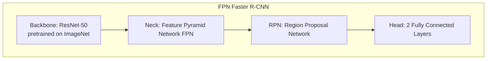
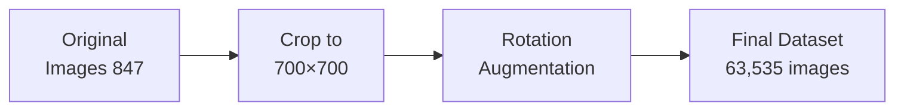
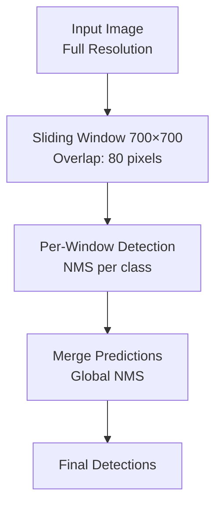

# xView1 Hạng 1: Giải pháp Reduced Focal Loss

## Tổng quan

| Thuộc tính | Giá trị |
|-----------|-------|
| **Hạng** | Hạng 1 |
| **Nhóm** | Nikolay Sergievskiy, Alexander Ponamarev |
| **Đơn vị** | Nhà nghiên cứu độc lập |
| **Điểm (Public LB)** | 31.74 mAP |
| **Điểm (Private LB)** | 29.32 mAP |
| **Bài báo** | [arXiv:1903.01347](https://arxiv.org/abs/1903.01347) |
| **Giải thưởng** | Một phần của giải thưởng $100,000 |

---

## Đổi mới chính: Reduced Focal Loss

### Vấn đề với Focal Loss chuẩn

Focal Loss chuẩn được thiết kế để xử lý mất cân bằng lớp bằng cách giảm trọng số các mẫu dễ:

```
FL(pt) = -αt(1 - pt)^γ * log(pt)
```

**Vấn đề phát hiện:** Trong các detector hai giai đoạn như Faster R-CNN, Focal Loss áp dụng cho RPN nghịch lý **giảm recall** bằng cách nhấn mạnh quá mức các mẫu âm khó với chi phí của việc phát hiện true positive.

### Giải pháp Reduced Focal Loss

Các tác giả đưa ra **cơ chế trọng số lai**:

```
RFL(pt) = {
    -αt * log(pt)                           if pt < threshold
    -αt * ((1-pt)^γ / th^γ) * log(pt)       if pt >= threshold
}
```

**Ý tưởng chính:**
- Dưới ngưỡng: trọng số không đổi (duy trì recall)
- Trên ngưỡng: trọng số focal được chia tỷ lệ (xử lý mất cân bằng lớp)
- Ngưỡng (th): siêu tham số, thường là 0.5

**Kết quả:** Cân bằng hard example mining trong khi duy trì recall proposal đầy đủ cho phân loại Fast R-CNN ở giai đoạn sau.

---

## Kiến trúc

### Framework cơ bản



### Chi tiết triển khai

| Thành phần | Cấu hình |
|-----------|---------------|
| **Framework** | PyTorch Detectron |
| **Backbone** | ResNet-50 |
| **RPN Batch Size** | 512 |
| **Head Batch Size** | 1024 |
| **FG/BG Ratio** | 0.5 |
| **Learning Rate** | 0.005 → 0.0005 (giảm dần) |
| **Training Iterations** | 300,000 |

---

## Xử lý dữ liệu

### Pipeline tiền xử lý



### Chiến lược cắt ảnh

| Tham số | Giá trị |
|-----------|-------|
| **Kích thước cắt** | 700 × 700 pixels |
| **Overlap** | 80 pixels |
| **Góc xoay** | 10°, 90°, 180°, 270° |
| **Ảnh gốc** | 846 |
| **Ảnh huấn luyện cuối** | 63,535 |

### Augmentation trực tuyến

Trong quá trình huấn luyện, các augmentation bổ sung được áp dụng:

1. **Lật ngang ngẫu nhiên**
2. **Color Jittering**
   - Độ sáng
   - Độ tương phản
   - Độ bão hòa
3. **Scale Jittering**
   - Dải: 500-900 pixels
   - Duy trì tỷ lệ khung hình

---

## Xử lý mất cân bằng lớp

### Phương pháp đa chiến lược

1. **Reduced Focal Loss** (đổi mới chính)
   - Duy trì recall của RPN
   - Giảm trọng số các mẫu dễ

2. **Lấy mẫu dưới ngẫu nhiên**
   - Loại bỏ các lớp phổ biến với xác suất P
   - Mục tiêu: Small Cars, Buildings (~200K-300K instances)
   - Hiệu quả: Cải thiện mAP cho các lớp hiếm

3. **Điều chỉnh Loss nhận biết IoU**
   - Trọng số loss theo chất lượng IoU
   - Ưu tiên các dự đoán được định vị tốt

---

## Chiến lược huấn luyện

### Huấn luyện hai giai đoạn

**Giai đoạn 1: Huấn luyện cơ bản**
```
- Iterations: 200,000
- Learning Rate: 0.005
- Batch Size: 4 images
- GPUs: 2× (data parallel)
```

**Giai đoạn 2: Fine-tuning**
```
- Iterations: 100,000
- Learning Rate: 0.0005 (giảm 10×)
- Focal Loss γ: 2.0
- Threshold (th): 0.5
```

### Yêu cầu phần cứng

| Tài nguyên | Thông số |
|----------|---------------|
| **GPUs** | 2× NVIDIA GPUs (12GB+ VRAM) |
| **Thời gian huấn luyện** | ~7 ngày |
| **Framework** | PyTorch 1.0 |

---

## Pipeline suy luận

### Kiểm thử đa tỷ lệ



### Test-Time Augmentation (TTA)

- Lật ngang
- Suy luận đa tỷ lệ (nếu bộ nhớ cho phép)
- Ensemble qua các model được augment xoay

---

## Chiến lược Ensemble

### Các biến thể Model

| Model | Backbone | Kích thước cắt | mAP |
|-------|----------|-----------|-----|
| Model 1 | ResNet-50 | 700×700 | 28.5 |
| Model 2 | ResNet-50 | 800×800 | 29.1 |
| Model 3 | ResNet-101 | 700×700 | 29.8 |
| Model 4 | ResNeXt-101 | 700×700 | 30.2 |

**Ensemble cuối cùng:** Trung bình có trọng số của 7 biến thể model
- **Public LB:** 31.74 mAP
- **Private LB:** 29.32 mAP

---

## Phân tích kết quả

### Hiệu suất theo danh mục

| Danh mục | mAP | Ghi chú |
|----------|-----|-------|
| Fixed-Wing Aircraft | Cao | Hình dạng xác định rõ |
| Maritime Vessels | Cao | Tương phản rõ ràng với nước |
| Small Vehicles | Trung bình | Thách thức kích thước nhỏ |
| Buildings | Trung bình | Ngoại hình đa dạng |
| Railway Vehicles | Thấp | Lớp rất hiếm |
| Towers | Thấp | Dữ liệu huấn luyện hạn chế |

### Cải thiện so với Baseline

| Chỉ số | Baseline | Giải pháp này | Cải thiện |
|--------|----------|---------------|-------------|
| mAP (Public) | ~15 | 31.74 | +111% |
| mAP (Private) | ~14 | 29.32 | +109% |
| Rare Class mAP | ~5 | ~18 | +260% |

---

## Bài học chính

### Điều gì hiệu quả

1. **Reduced Focal Loss** - Đóng góp mới giải quyết vấn đề recall của RPN
2. **Augmentation dữ liệu mạnh** - Xoay + cắt + màu sắc là cần thiết
3. **Undersampling** - Quan trọng cho hiệu suất lớp hiếm
4. **Ensemble lớn** - Tăng đáng kể ở bước cuối

### Điều gì không hiệu quả

1. **Focal Loss chuẩn** - Gây hại recall của RPN
2. **Không Undersampling** - Bị chi phối bởi các lớp phổ biến
3. **Kích thước cắt nhỏ** - Bỏ lỡ ngữ cảnh cho các đối tượng lớn
4. **Single Model** - Không đủ để giành chiến thắng cuộc thi

---

## Khả năng tái tạo

### Tính sẵn có của Code

Giải pháp dựa trên framework PyTorch Detectron. Các sửa đổi chính:
- Triển khai Reduced Focal Loss tùy chỉnh
- Data loader được sửa đổi cho ảnh vệ tinh
- Script suy luận ensemble

### Yêu cầu

```
pytorch >= 1.0
torchvision
pycocotools
detectron (Facebook AI Research)
opencv-python
gdal (for geotiff handling)
```

---

## Trích dẫn

```bibtex
@article{sergievskiy2019reduced,
  title={Reduced Focal Loss: 1st Place Solution to xView object
         detection in Satellite Imagery},
  author={Sergievskiy, Nikolay and Ponamarev, Alexander},
  journal={arXiv preprint arXiv:1903.01347},
  year={2019}
}
```

---

## Tài nguyên

- **Bài báo:** [arXiv:1903.01347](https://arxiv.org/abs/1903.01347)
- **Dataset:** [xviewdataset.org](https://xviewdataset.org)
- **Detectron:** [github.com/facebookresearch/Detectron](https://github.com/facebookresearch/Detectron)

---

*Tài liệu tạo: 2024-12-18*
