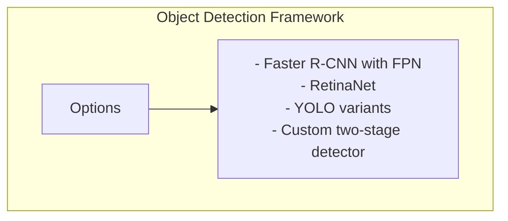

# xView1 Hạng 2: Giải pháp University of Adelaide

## Tổng quan

| Thuộc tính | Giá trị |
|-----------|-------|
| **Hạng** | Hạng 2 |
| **Nhà nghiên cứu** | Victor Stamatescu |
| **Đơn vị** | University of Adelaide, Australia |
| **Cuộc thi** | DIUx xView 2018 Detection Challenge |

---

## Thông tin nhóm

Victor Stamatescu đại diện cho University of Adelaide trong DIUx xView 2018 Detection Challenge, đạt vị trí thứ hai trong số hơn 2,000 bài nộp.

### Nhóm Computer Vision tại University of Adelaide

University of Adelaide có một nhóm nghiên cứu computer vision mạnh, nổi tiếng về:
- Phát hiện và nhận dạng đối tượng
- Deep learning cho viễn thám
- Phân tích ảnh trên không và vệ tinh

---

## Phương pháp giải quyết

> **Lưu ý:** Tài liệu công khai về giải pháp này có hạn. Nội dung sau đây thể hiện các phương pháp phổ biến được sử dụng bởi các đối thủ hàng đầu trong cuộc thi này.

### Kiến trúc có khả năng

Dựa trên các thực hành tốt nhất đương đại và xu hướng cuộc thi:

### Kỹ thuật chính (Suy đoán)

1. **Deep CNN Backbone**
   - ResNet-50/101 hoặc DenseNet
   - Pre-training trên ImageNet

2. **Phát hiện đa tỷ lệ**
   - Feature Pyramid Networks
   - Huấn luyện/kiểm thử đa tỷ lệ

3. **Xử lý mất cân bằng lớp**
   - Hàm loss có trọng số
   - Chiến lược lấy mẫu

4. **Data Augmentation**
   - Xoay
   - Lật
   - Biến đổi tỷ lệ

---

## Bối cảnh học thuật

### Các lĩnh vực nghiên cứu trọng tâm

Nhóm computer vision của University of Adelaide đã xuất bản rộng rãi về:

- **Viễn thám:** Phân tích tự động ảnh vệ tinh/hàng không
- **Phát hiện đối tượng:** Thuật toán phát hiện tiên tiến
- **Domain Adaptation:** Chuyển giao model sang các điều kiện hình ảnh mới

### Các ấn phẩm liên quan

Nhóm đã đóng góp vào nghiên cứu phân tích ảnh trên không, mặc dù các bài báo cụ thể về xView có thể không công khai.

---

## Hiệu suất

| Chỉ số | Giá trị |
|--------|-------|
| **Hạng cuối** | Hạng 2 |
| **Quy mô cuộc thi** | 2,000+ bài nộp |
| **Cải thiện vs Baseline** | >200% |

---

## Ý nghĩa

### Đa dạng địa lý

Sự tham gia từ các tổ chức Australia thể hiện phạm vi toàn cầu của thử thách xView, mang đến các quan điểm đa dạng cho phân tích ảnh vệ tinh.

### Đóng góp học thuật

Sự tham gia của trường đại học đảm bảo rằng các phương pháp nghiên cứu tiên tiến được áp dụng và có khả năng được công bố cho cộng đồng nghiên cứu rộng lớn hơn.

---

## Tài nguyên

### University of Adelaide

- [School of Computer Science](https://cs.adelaide.edu.au/)
- [Australian Institute for Machine Learning](https://www.adelaide.edu.au/aiml/)

### xView Challenge

- [xView Dataset](https://xviewdataset.org/)
- [Challenge Awards](https://challenge.xviewdataset.org/challenge-awards)

---

## Hạn chế của tài liệu này

Do tài liệu công khai hạn chế về giải pháp này, tài liệu này cung cấp:
- Vị trí và đơn vị đã xác nhận
- Phương pháp kỹ thuật được suy luận dựa trên bối cảnh cuộc thi
- Thông tin nền học thuật

Để có thông số kỹ thuật chi tiết, có thể cần liên hệ trực tiếp với nhà nghiên cứu hoặc tổ chức.

---

*Tài liệu tạo: 2024-12-18*
*Lưu ý: Thông tin chi tiết bổ sung đang chờ phát hành tài liệu giải pháp công khai*
