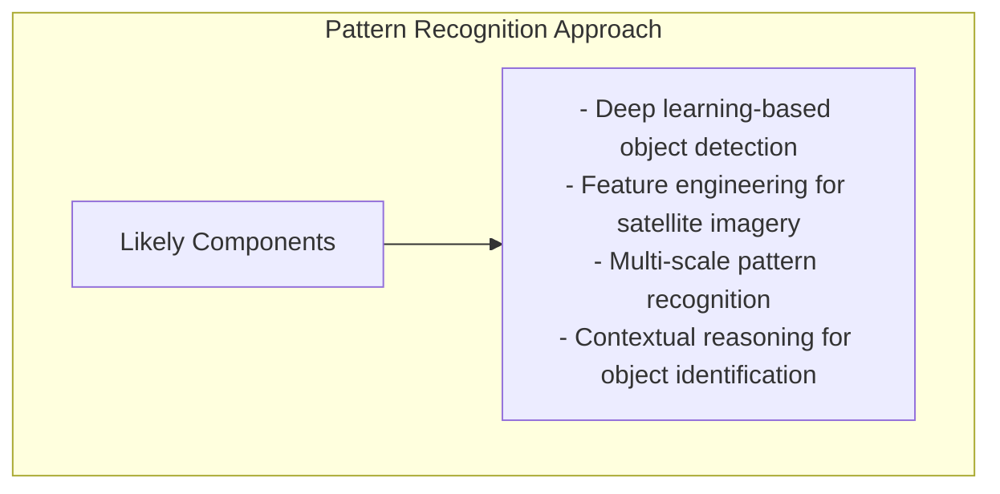

# xView1 Hạng 3: Giải pháp University of South Florida

## Tổng quan

| Thuộc tính | Giá trị |
|-----------|-------|
| **Hạng** | Hạng 3 |
| **Nhà nghiên cứu** | Sudeep Sarkar |
| **Đơn vị** | University of South Florida |
| **Cuộc thi** | DIUx xView 2018 Detection Challenge |

---

## Thông tin nhóm

### Prof. Sudeep Sarkar

Sudeep Sarkar là Giáo sư xuất sắc tại University of South Florida, nổi tiếng về nghiên cứu trong:
- Computer Vision
- Pattern Recognition
- Machine Learning
- Phân tích ảnh và video

### Nhóm nghiên cứu

USF Computer Vision Lab có kinh nghiệm sâu rộng trong:
- Nhận dạng và phát hiện đối tượng
- Phân tích giám sát video
- Nhận dạng dáng đi
- Phân tích hình dạng 3D

---

## Phương pháp giải quyết

> **Lưu ý:** Tài liệu công khai về giải pháp này có hạn. Nội dung sau đây thể hiện các phương pháp có khả năng dựa trên chuyên môn nghiên cứu của nhóm.

### Phương pháp có thể

Dựa trên nền tảng nghiên cứu của Prof. Sarkar:

### Điểm mạnh nghiên cứu chính được áp dụng

1. **Chuyên môn Pattern Recognition**
   - Nghiên cứu đã thiết lập về nhận dạng mẫu
   - Áp dụng trong bối cảnh ảnh vệ tinh

2. **Phân tích đa tỷ lệ**
   - Xử lý các đối tượng có kích thước khác nhau
   - Trích xuất đặc trưng theo cấp độ

3. **Suy luận theo ngữ cảnh**
   - Sử dụng ngữ cảnh không gian để phát hiện
   - Các mẫu đồng xuất hiện đối tượng

---

## Nền tảng học thuật

### Khoa học máy tính tại University of South Florida

Khoa CS có chương trình mạnh trong:
- Trí tuệ nhân tạo
- Computer Vision
- Machine Learning
- Data Science

### Đóng góp nghiên cứu đáng chú ý

Prof. Sarkar đã đóng góp vào:
- Tư cách thành viên IEEE Fellow
- Nhiều ấn phẩm tại các diễn đàn hàng đầu
- Bằng sáng chế về ứng dụng computer vision

---

## Hiệu suất

| Chỉ số | Giá trị |
|--------|-------|
| **Hạng cuối** | Hạng 3 |
| **Quy mô cuộc thi** | 2,000+ bài nộp |
| **Danh mục** | Tổ chức học thuật |

---

## Ý nghĩa

### Sự tham gia học thuật

Sự tham gia của trường đại học trong thử thách xView:
- Xác nhận các phương pháp nghiên cứu học thuật trên các vấn đề thực tế
- Cho phép so sánh với các giải pháp của ngành công nghiệp
- Đóng góp cho cộng đồng nghiên cứu

### Góc nhìn Pattern Recognition

Việc mang chuyên môn nhận dạng mẫu vào phân tích ảnh vệ tinh mang lại các quan điểm độc đáo ngoài các phương pháp deep learning thuần túy.

---

## Tài nguyên

### University of South Florida

- [CSE Department](https://www.usf.edu/engineering/cse/)
- [Prof. Sudeep Sarkar](https://www.usf.edu/engineering/cse/people/sarkar-sudeep.aspx)

### Nghiên cứu liên quan

- IEEE Transactions on Pattern Analysis and Machine Intelligence
- Computer Vision and Pattern Recognition conferences

---

## Hạn chế của tài liệu này

Do tài liệu công khai hạn chế:
- Chi tiết kỹ thuật được suy luận từ nền tảng nghiên cứu
- Các lựa chọn kiến trúc cụ thể chưa được xác nhận
- Chi tiết huấn luyện không có sẵn

Để có chi tiết kỹ thuật đầy đủ, khuyến nghị liên hệ trực tiếp với nhà nghiên cứu.

---

*Tài liệu tạo: 2024-12-18*
*Lưu ý: Thông tin chi tiết bổ sung đang chờ phát hành tài liệu giải pháp công khai*
