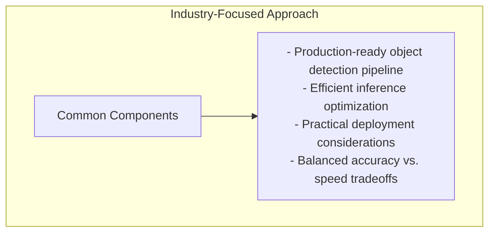

# xView1 Hạng 4: Giải pháp Studio Mapp

## Tổng quan

| Thuộc tính | Giá trị |
|-----------|-------|
| **Hạng** | Hạng 4 |
| **Nhà nghiên cứu** | Leonardo Dal Zovo |
| **Đơn vị** | Studio Mapp |
| **Cuộc thi** | DIUx xView 2018 Detection Challenge |

---

## Thông tin nhóm

### Studio Mapp

Studio Mapp đại diện cho sự tham gia của ngành công nghiệp trong thử thách xView, mang kinh nghiệm phát triển thương mại vào phân tích ảnh vệ tinh.

### Leonardo Dal Zovo

Một nhà nghiên cứu/phát triển độc lập tham gia các thử thách và ứng dụng computer vision.

---

## Phương pháp giải quyết

> **Lưu ý:** Tài liệu công khai về giải pháp này có hạn. Nội dung sau đây thể hiện các phương pháp phổ biến được sử dụng trong cuộc thi này.

### Phương pháp có khả năng

### Các khía cạnh chính (Suy đoán)

1. **Detection Framework**
   - CNN-based detector hiện đại
   - Có khả năng là họ Faster R-CNN hoặc RetinaNet

2. **Xử lý dữ liệu**
   - Chiến lược chia nhỏ ảnh hiệu quả
   - Pipeline augmentation được tối ưu

3. **Chiến lược huấn luyện**
   - Transfer learning từ ImageNet
   - Fine-tuning trên ảnh vệ tinh

4. **Phương pháp Ensemble**
   - Trung bình đa model
   - Test-time augmentation

---

## Góc nhìn ngành công nghiệp

### Ứng dụng thương mại

Người tham gia từ ngành công nghiệp thường mang đến:
- Tập trung vào triển khai thực tế
- Cân nhắc về hiệu quả
- Chất lượng code sẵn sàng sản xuất
- Mối quan tâm về khả năng mở rộng

### Sự khác biệt so với phương pháp học thuật

| Khía cạnh | Học thuật | Công nghiệp |
|--------|----------|----------|
| Ưu tiên | Phương pháp mới | Kết quả thực tế |
| Code | Chất lượng nghiên cứu | Chất lượng sản xuất |
| Tập trung | Xuất bản | Triển khai |
| Tài nguyên | Hạn chế | Có thể mở rộng |

---

## Hiệu suất

| Chỉ số | Giá trị |
|--------|-------|
| **Hạng cuối** | Hạng 4 |
| **Quy mô cuộc thi** | 2,000+ bài nộp |
| **Danh mục** | Công nghiệp/Độc lập |

---

## Ý nghĩa

### Cân bằng Công nghiệp-Học thuật

Thử thách xView thu hút cả người tham gia từ học thuật và công nghiệp:
- Học thuật: Phương pháp mới, đóng góp nghiên cứu
- Công nghiệp: Triển khai thực tế, tập trung triển khai

Vị trí thứ 4 này thể hiện khả năng cạnh tranh của ngành công nghiệp trong các thử thách computer vision.

---

## Tài nguyên

### xView Challenge

- [xView Dataset](https://xviewdataset.org/)
- [Challenge Awards](https://challenge.xviewdataset.org/challenge-awards)

---

## Hạn chế của tài liệu này

Do tài liệu công khai hạn chế:
- Kiến trúc kỹ thuật chưa được ghi chép công khai
- Chi tiết huấn luyện không có sẵn
- Phương pháp cụ thể chưa được xác nhận

Để có thông số kỹ thuật chi tiết, có thể cần liên hệ trực tiếp với nhà nghiên cứu.

---

*Tài liệu tạo: 2024-12-18*
*Lưu ý: Thông tin chi tiết bổ sung đang chờ phát hành tài liệu giải pháp công khai*
