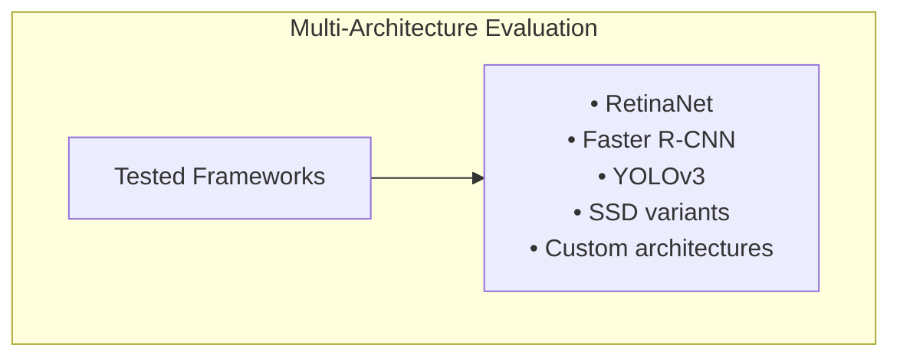
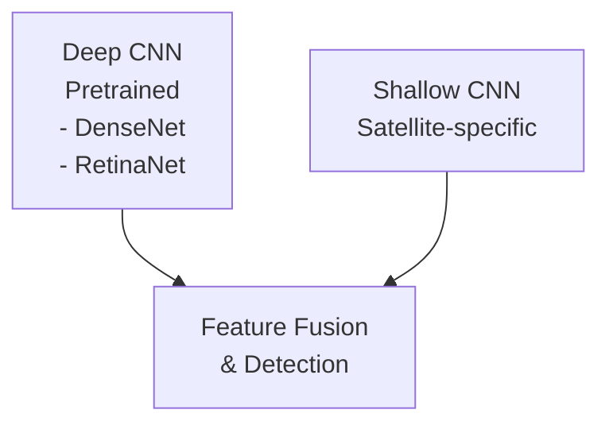

# xView1 Hạng 5: Giải pháp CMU Software Engineering Institute

## Tổng quan

| Thuộc tính | Giá trị |
|-----------|-------|
| **Hạng** | Hạng 5 |
| **Nhóm** | Ritwik Gupta, 2nd Lt. Alex Fulton, Kaylene Stocking |
| **Đơn vị** | Carnegie Mellon University SEI, USAF Institute of Technology, University of Pittsburgh |
| **Cuộc thi** | DIUx xView 2018 Detection Challenge |
| **Bài viết Blog** | [Deep Learning and Satellite Imagery: DIUx Xview Challenge](https://insights.sei.cmu.edu/blog/deep-learning-and-satellite-imagery-diux-xview-challenge/) |

---

## Thông tin nhóm

### Carnegie Mellon Software Engineering Institute (SEI)

SEI là một trung tâm nghiên cứu và phát triển được tài trợ bởi liên bang, tập trung vào:
- Thực hành tốt nhất về kỹ thuật phần mềm
- An ninh mạng
- Nghiên cứu AI và machine learning
- Ứng dụng quốc phòng

### Thành viên nhóm

1. **Ritwik Gupta** - SEI / ETC
   - Sau đó trở thành đóng góp chính cho việc tạo dataset xView2/xBD
   - Chuyên môn trong ML cho ảnh vệ tinh

2. **2nd Lt. Alex Fulton** - USAF Institute of Technology / CMU
   - Góc nhìn quân sự về phân tích vệ tinh
   - Tập trung ứng dụng quốc phòng

3. **Kaylene Stocking** - University of Pittsburgh
   - Nghiên cứu machine learning
   - Ứng dụng computer vision

---

## Phương pháp giải quyết

### Framework thực nghiệm

Nhóm đã đánh giá có hệ thống nhiều kiến trúc phát hiện:



### Kiến trúc cuối cùng: SSD Variant

Sau nhiều thử nghiệm, một biến thể SSD (Single Shot Detector) cho kết quả tốt nhất:

| Framework | mAP | Ghi chú |
|-----------|-----|-------|
| SSD Variant | Tốt nhất | Bài nộp cuối |
| YOLOv3 | Tốt | Anchor box lớn giúp ích |
| Faster R-CNN | Tốt | Baseline mạnh |
| RetinaNet | Tốt | Focal loss hiệu quả |

---

## Phương pháp kỹ thuật chính

### Trích xuất đặc trưng Dual-CNN



### Đổi mới chính

**Trích xuất đặc trưng lai:**
- **Deep CNN:** Đặc trưng đa mục đích từ các mạng pretrained trên ImageNet
- **Shallow CNN:** Đặc trưng cụ thể cho ảnh vệ tinh được học từ dữ liệu xView
- **Fusion:** Kết hợp đặc trưng để cải thiện phát hiện

---

## Chi tiết phương pháp

### Tiền xử lý dữ liệu

1. **Chia nhỏ ảnh (Image Tiling)**
   - Chia ảnh lớn thành các patch dễ quản lý
   - Overlap để xử lý các đối tượng ở biên

2. **Chuẩn hóa (Normalization)**
   - Tiền xử lý cụ thể cho vệ tinh
   - Xử lý ảnh đa băng

### Chiến lược Augmentation

- Xoay ngẫu nhiên
- Lật ngang/dọc
- Biến đổi tỷ lệ
- Color jittering

### Phát hiện về YOLOv3

Khi sử dụng YOLOv3:
- Số lượng lớn anchor box cải thiện hiệu suất
- Có lợi cho phát hiện đối tượng đa tỷ lệ
- Xử lý hiệu quả phân loại 60 lớp

---

## Bài học kinh nghiệm

### Điều gì hiệu quả

1. **Kiến trúc SSD**
   - Suy luận nhanh
   - Xử lý đa tỷ lệ tốt
   - Hiệu quả cho ảnh vệ tinh

2. **Phương pháp Dual-CNN**
   - Tận dụng các đặc trưng pretrained
   - Bắt được các mẫu đặc thù domain

3. **Thực nghiệm rộng rãi**
   - Đánh giá có hệ thống nhiều framework
   - Lựa chọn kiến trúc dựa trên dữ liệu

### Thách thức

1. **Mất cân bằng lớp**
   - Các lớp hiếm khó phát hiện
   - Yêu cầu chiến lược lấy mẫu

2. **Biến đổi tỷ lệ**
   - Đối tượng từ 3 đến 100+ pixels
   - Phát hiện đa tỷ lệ là cần thiết

3. **Tài nguyên tính toán**
   - Ảnh lớn yêu cầu bộ nhớ GPU đáng kể
   - Thời gian huấn luyện đáng kể

---

## Tác động và tiếp tục

### Tham gia xView2

Kinh nghiệm của nhóm dẫn đến tham gia vào xView2:
- Ritwik Gupta trở thành đóng góp chính cho dataset xBD
- SEI giúp thiết kế thử thách xView2
- Chuyên môn được áp dụng cho đánh giá thiệt hại tòa nhà

### Xuất bản nghiên cứu

Nhóm ghi chép kinh nghiệm của họ cho cộng đồng nghiên cứu, đóng góp vào:
- Thực hành tốt nhất cho phân tích ảnh vệ tinh
- Hiểu biết so sánh framework
- Hướng dẫn triển khai thực tế

---

## Hiệu suất

| Chỉ số | Giá trị |
|--------|-------|
| **Hạng cuối** | Hạng 5 |
| **Quy mô cuộc thi** | 2,000+ bài nộp |
| **Cải thiện vs Baseline** | >200% |

---

## Tài nguyên

### Liên kết chính thức

- [CMU SEI Blog Post](https://insights.sei.cmu.edu/blog/deep-learning-and-satellite-imagery-diux-xview-challenge/)
- [Software Engineering Institute](https://www.sei.cmu.edu/)
- [xView Dataset](https://xviewdataset.org/)

### Công việc liên quan

- xView2 Challenge và xBD Dataset (công việc tiếp theo)
- SEI AI/ML Research Portfolio

---

## Code và khả năng tái tạo

### Framework sử dụng

```
- TensorFlow / PyTorch
- Object Detection APIs
- GDAL (geospatial processing)
- OpenCV
```

### Phần cứng

- Thiết lập huấn luyện đa GPU
- VRAM đáng kể cần thiết cho ảnh đầy đủ

---

## Trích dẫn

```bibtex
@misc{sei2019xview,
  title={Deep Learning and Satellite Imagery: DIUx Xview Challenge},
  author={Gupta, Ritwik and Fulton, Alex and Stocking, Kaylene},
  howpublished={CMU SEI Blog},
  year={2019},
  url={https://insights.sei.cmu.edu/blog/deep-learning-and-satellite-imagery-diux-xview-challenge/}
}
```

---

*Tài liệu tạo: 2024-12-18*
