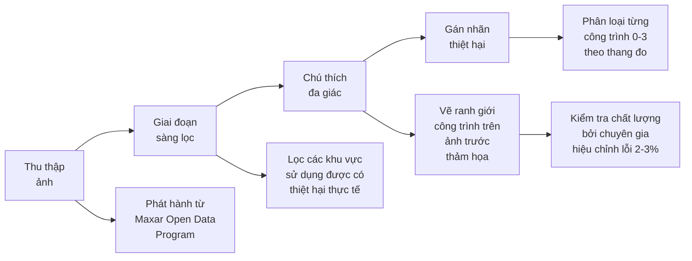

# Bộ dữ liệu xView2 (xBD): Đánh giá thiệt hại công trình

## Tổng quan

| Thuộc tính | Giá trị |
|-----------|-------|
| **Tên chính thức** | Bộ dữ liệu xBD (xView Building Damage) |
| **Năm phát hành** | 2019 |
| **Đơn vị tổ chức** | Defense Innovation Unit (DIU), Carnegie Mellon University SEI |
| **Nhiệm vụ** | Định vị công trình + Phân loại thiệt hại |
| **Cuộc thi** | xView2: Assess Building Damage Challenge |
| **Số bài nộp** | 2,000+ |
| **Bài báo** | [Creating xBD: A Dataset for Assessing Building Damage from Satellite Imagery (CVPR 2019)](https://openaccess.thecvf.com/content_CVPRW_2019/papers/cv4gc/Gupta_Creating_xBD_A_Dataset_for_Assessing_Building_Damage_from_Satellite_CVPRW_2019_paper.pdf) |

---

## Thống kê bộ dữ liệu

### Quy mô tổng thể

| Chỉ số | Giá trị |
|--------|-------|
| **Số chú thích công trình** | 850,736 đa giác |
| **Diện tích bao phủ** | 45,362 km² |
| **Tổng số ảnh** | 22,068 |
| **Kích thước ảnh** | 1024 × 1024 pixel |
| **Định dạng màu** | RGB (3-band) |
| **Sự kiện thảm họa** | 19 sự kiện |
| **Nguồn** | Maxar/DigitalGlobe Open Data Program |

### Phân chia dữ liệu

| Tập | Đa giác công trình | Số ảnh |
|-------|-------------------|--------|
| **Huấn luyện** | 632,228 | 18,336 |
| **Kiểm tra** | 109,724 | 1,866 |
| **Holdout** | 108,784 | 1,866 |
| **Tổng cộng** | 850,736 | 22,068 |

---

## Thang đo thiệt hại chung

### Phân loại bốn cấp độ

Được phát triển hợp tác với các chuyên gia ứng phó thảm họa từ NASA, FEMA, CAL FIRE và California Air National Guard.

| Cấp độ | Tên | Mô tả | Số lượng | % |
|-------|------|-------------|-------|---|
| 0 | **Không thiệt hại** | Công trình nguyên vẹn, không có thiệt hại nhìn thấy được | 313,033 | 36.8% |
| 1 | **Thiệt hại nhỏ** | Thiệt hại nhìn thấy được nhưng không ảnh hưởng cấu trúc | 36,860 | 4.3% |
| 2 | **Thiệt hại lớn** | Thiệt hại cấu trúc đáng kể | 29,904 | 3.5% |
| 3 | **Bị phá hủy** | Phá hủy hoàn toàn hoặc gần như hoàn toàn | 31,560 | 3.7% |
| - | **Chưa phân loại** | Nền (không có công trình) | ~440,000 | 51.7% |

### Chỉ báo thiệt hại trực quan

```
Cấp độ 0 (Không thiệt hại):
├── Mái nhà nguyên vẹn
├── Không có mảnh vỡ
└── Ngoại quan bình thường

Cấp độ 1 (Thiệt hại nhỏ):
├── Mái nhà hư hại < 25%
├── Mảnh vỡ nhỏ
└── Cấu trúc còn sử dụng được

Cấp độ 2 (Thiệt hại lớn):
├── Mái nhà hư hại 25-50%
├── Sụp đổ một phần
└── Cấu trúc bị ảnh hưởng

Cấp độ 3 (Bị phá hủy):
├── Mái nhà hư hại > 50%
├── Sụp đổ hoàn toàn
└── Mất mát toàn bộ
```

---

## Các thảm họa được bao phủ

### Sự kiện thảm họa (Tổng cộng 19)

| Loại thảm họa | Số sự kiện | Ví dụ |
|---------------|--------|----------|
| **Động đất** | 2 | Mexico 2017, Nepal 2015 |
| **Lũ lụt** | 4 | Midwest 2019, Bangladesh |
| **Bão nhiệt đới** | 5 | Michael, Harvey, Florence, Maria, Matthew |
| **Lốc xoáy** | 2 | Joplin, Tuscaloosa |
| **Cháy rừng** | 4 | Paradise, Woolsey, Tubbs, Santa Rosa |
| **Sóng thần** | 1 | Indonesia 2018 |
| **Núi lửa** | 1 | Guatemala Fuego |

### Phân bố địa lý

| Khu vực | Phạm vi |
|--------|----------|
| Bắc Mỹ | ~60% |
| Trung Mỹ | ~15% |
| Châu Á | ~15% |
| Khác | ~10% |

---

## Phương pháp tạo bộ dữ liệu

### Quy trình tạo dữ liệu



### Bước 1: Thu thập ảnh

**Nguồn:** Maxar/DigitalGlobe Open Data Program
- Phát hành ảnh sau các sự kiện thảm họa lớn
- Ảnh vệ tinh độ phân giải cao
- Cặp ảnh trước và sau thảm họa

**Yêu cầu:**
- Ground Sample Distance (GSD) < 0.8 mét
- Tầm nhìn rõ ràng (ít mây)
- Có thể căn chỉnh ảnh trước/sau

### Bước 2: Giai đoạn sàng lọc

Xem xét thủ công để xác định:
- Khu vực chứa thiệt hại thực tế
- Chất lượng ảnh sử dụng được
- Căn chỉnh giữa ảnh trước/sau

### Bước 3: Chú thích đa giác

**Chú thích trên ảnh trước thảm họa:**
- Vẽ ranh giới công trình dưới dạng đa giác
- Bao phủ tất cả công trình nhìn thấy
- Kiểm soát chất lượng về tính đầy đủ

**Công cụ sử dụng:**
- QGIS cho chú thích không gian địa lý
- Giao diện chú thích tùy chỉnh

### Bước 4: Phân loại thiệt hại

**Quy trình:**
1. Chồng các đa giác trước thảm họa lên ảnh sau thảm họa
2. Phân loại từng công trình sử dụng Thang đo thiệt hại chung
3. Nhiều vòng chú thích
4. Xem xét chuyên gia về tính nhất quán

### Bước 5: Kiểm soát chất lượng

**Xác thực chuyên gia:**
- NASA, FEMA, CAL FIRE, California Air National Guard
- Tỷ lệ lỗi: ~2-3% chú thích bị gán nhãn sai
- Áp dụng hiệu chỉnh có hệ thống

### Bước 6: Hiệu chỉnh căn chỉnh ảnh

**Điều chỉnh độ lệch pixel:**
- Tính toán độ lệch pixel trung bình
- Đo khoảng cách pixel giữa cạnh đa giác và mặt bên công trình
- Áp dụng hiệu chỉnh cho các vấn đề tái chiếu

---

## Nhãn bổ sung

### Yếu tố môi trường

Đối với các thảm họa liên quan, các chú thích đa giác bổ sung cho:

| Yếu tố | Loại thảm họa |
|--------|----------------|
| **Khói** | Cháy rừng |
| **Lửa** | Cháy rừng |
| **Nước lũ** | Lũ lụt, Bão nhiệt đới |
| **Dòng chảy pyroclastic** | Núi lửa |
| **Dung nham** | Núi lửa |

---

## Định dạng dữ liệu

### Cấu trúc thư mục

```
xBD/
├── train/
│   ├── images/
│   │   ├── event_name_00000_pre_disaster.png
│   │   ├── event_name_00000_post_disaster.png
│   │   └── ...
│   └── labels/
│       ├── event_name_00000_pre_disaster.json
│       ├── event_name_00000_post_disaster.json
│       └── ...
├── test/
│   ├── images/
│   └── labels/
└── hold/
    ├── images/
    └── labels/
```

### Quy ước đặt tên ảnh

```
{event_name}_{image_id}_{pre|post}_disaster.png
```

Ví dụ: `hurricane-michael_00123_post_disaster.png`

### Định dạng nhãn (JSON)

```json
{
  "features": {
    "lng_lat": [longitude, latitude],
    "xy": [
      {"wkt": "POLYGON ((x1 y1, x2 y2, ...))"}
    ]
  },
  "metadata": {
    "disaster": "hurricane-michael",
    "disaster_type": "hurricane",
    "img_name": "hurricane-michael_00123_post_disaster.png"
  },
  "properties": {
    "subtype": "residential",
    "feature_type": "building",
    "uid": "unique_building_id"
  },
  "labels": {
    "damage": "destroyed"
  }
}
```

### Giá trị nhãn thiệt hại

| Giá trị JSON | Cấp độ | Mô tả |
|------------|-------|-------------|
| "no-damage" | 0 | Nguyên vẹn |
| "minor-damage" | 1 | Thiệt hại nhỏ |
| "major-damage" | 2 | Thiệt hại lớn |
| "destroyed" | 3 | Bị phá hủy |
| "un-classified" | - | Không có công trình |

---

## Nhiệm vụ cuộc thi

### Bài toán hai giai đoạn

**Giai đoạn 1: Định vị công trình**
- Đầu vào: Ảnh trước thảm họa
- Đầu ra: Mask đa giác công trình
- Chỉ số: Điểm F1 (định vị)

**Giai đoạn 2: Phân loại thiệt hại**
- Đầu vào: Cặp ảnh trước + sau thảm họa
- Đầu ra: Mức độ thiệt hại cho từng công trình
- Chỉ số: Điểm F1 (mỗi lớp, có trọng số)

### Điểm tổng hợp

```
Điểm cuối cùng = 0.3 × F1_Định_vị + 0.7 × F1_Thiệt_hại
```

---

## Mất cân bằng lớp

### Thách thức phân bố

```
Không thiệt hại:    ████████████████████████████████████  73.5%
Thiệt hại nhỏ:      ████                                   8.6%
Thiệt hại lớn:      ████                                   7.0%
Bị phá hủy:         █████                                  7.4%
Chưa phân loại:     ███                                    3.5%
```

**Tác động:**
- Các mô hình có xu hướng dự đoán "không thiệt hại" theo mặc định
- Các lớp thiệt hại hiếm cần xử lý đặc biệt
- Trọng số lớp cần thiết trong hàm mất mát

---

## So sánh với các bộ dữ liệu khác

| Bộ dữ liệu | Công trình | Thảm họa | Cặp Trước/Sau | Cấp độ thiệt hại |
|---------|-----------|-----------|----------------|---------------|
| **xBD** | 850K | 19 | Có | 4 |
| Harvey Homes | 5K | 1 | Có | 4 |
| Tomnod | 30K | Nhiều | Không | 2 |
| OpenStreetMap | Khác nhau | N/A | Không | 0 |

**Ưu điểm của xBD:**
- Quy mô lớn nhất (850K công trình)
- Đa dạng thảm họa nhất (19 sự kiện)
- Thang đo thiệt hại chuẩn hóa
- Cặp ảnh trước/sau

---

## Sử dụng và giấy phép

### Truy cập

- **Website:** [xview2.org](https://xview2.org)
- **Tải xuống:** Yêu cầu đăng ký
- **Định dạng:** Ảnh PNG + nhãn JSON

### Giấy phép

Giấy phép Creative Commons cho phép:
- Sử dụng nghiên cứu
- Ứng dụng phi thương mại
- Yêu cầu ghi nguồn phù hợp

### Trích dẫn

```bibtex
@inproceedings{gupta2019creating,
  title={Creating xBD: A Dataset for Assessing Building Damage
         from Satellite Imagery},
  author={Gupta, Ritwik and Hosfelt, Richard and Saez, Sandra and
          Kochersberger, Kevin and Goodman, Jeff and Doshi, Jigar and
          Ber, Omer and Laielli, Michael and Klaric, Matthew and
          Mathew, Andrew and Mcgee, Kevin},
  booktitle={CVPR Workshops},
  year={2019}
}
```

---

## Khuyến nghị tiền xử lý

### Cho huấn luyện

1. **Kiến trúc Siamese**
   - Xử lý cặp trước/sau cùng nhau
   - Khuyến nghị trọng số encoder chia sẻ

2. **Tăng cường dữ liệu**
   - Không gian: xoay, lật, co giãn
   - Áp dụng nhất quán cho cặp trước/sau
   - Tăng cường màu (cẩn thận với các dấu hiệu thiệt hại)

3. **Cân bằng lớp**
   - Oversample các lớp thiệt hại (2-4×)
   - Hàm mất mát có trọng số
   - Focal loss cho mất cân bằng

### Các phương pháp phổ biến

| Phương pháp | Mô tả |
|----------|-------------|
| **Pipeline hai giai đoạn** | Định vị → Phân loại |
| **End-to-End** | Định vị + phân loại kết hợp |
| **Mạng Siamese** | Encoder chia sẻ cho trước/sau |
| **Multi-Task Learning** | Head song song cho từng nhiệm vụ |

---

## Triển khai thực tế

### Ứng dụng

Các giải pháp chiến thắng đã được triển khai cho:
- Cháy rừng California 2020
- Ứng phó bão ven biển
- Cháy rừng Úc 2019-2020

### Tác động

- Đánh giá thiệt hại nhanh hơn
- Cải thiện phân bổ tài nguyên
- Giảm gánh nặng kiểm tra thủ công

---

## Tài nguyên

### Chính thức

- [Website xView2 Challenge](https://xview2.org)
- [Bài báo xBD (CVPR 2019)](https://openaccess.thecvf.com/content_CVPRW_2019/papers/cv4gc/Gupta_Creating_xBD_A_Dataset_for_Assessing_Building_Damage_from_Satellite_CVPRW_2019_paper.pdf)
- [Chuỗi thách thức xView của DIU](https://www.diu.mil/ai-xview-challenge)

### Code & Công cụ

- [Baseline xView2](https://github.com/DIUx-xView/xView2_baseline)
- [Scoring xView2](https://github.com/DIUx-xView/xView2_scoring)
- [Giải pháp hạng 1](https://github.com/DIUx-xView/xView2_first_place)

### Dự án liên quan

- [Dự án xView2 của CMU SEI](https://www.sei.cmu.edu/projects/xview-2-challenge/)
- [NASA Applied Sciences](https://appliedsciences.nasa.gov/)

---

*Tài liệu tạo: 2024-12-18*
*Cập nhật lần cuối: 2024-12-18*
