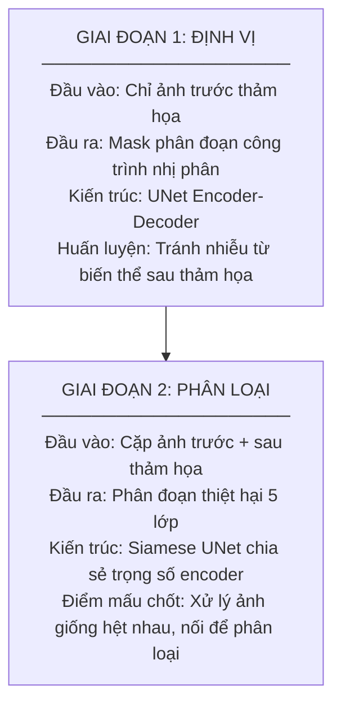
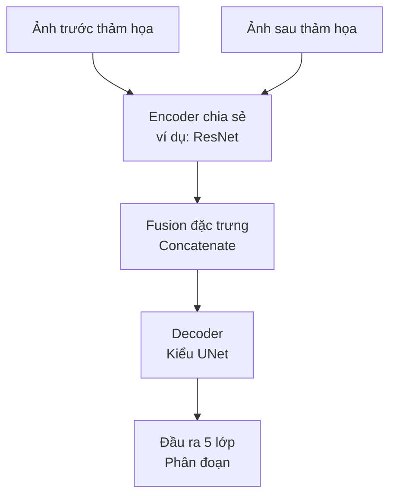
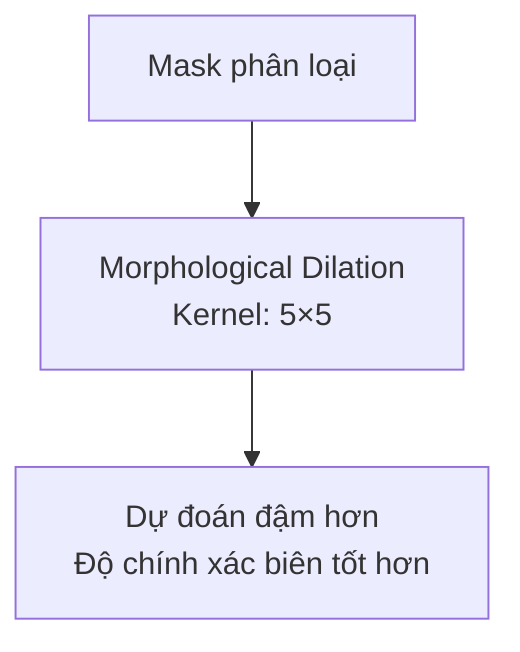

# xView2 Hạng 1: Giải pháp Siamese U-Net

## Tổng quan

| Thuộc tính | Giá trị |
|-----------|-------|
| **Hạng** | Hạng 1 |
| **Hiệu suất** | Chính xác hơn 266% so với baseline |
| **Độ chính xác đánh giá thiệt hại** | >80% |
| **GitHub** | [DIUx-xView/xView2_first_place](https://github.com/DIUx-xView/xView2_first_place) |
| **Phần cứng huấn luyện** | 2× Titan V GPUs (12GB mỗi cái) |
| **Thời gian huấn luyện** | ~7 ngày |

---

## Tổng quan kiến trúc

### Pipeline hai giai đoạn



### Chi tiết kiến trúc Siamese



---

## Kiến trúc Encoder

### Bốn Encoder được pretrain

| Encoder | Kích thước crop | Độ phức tạp | Ghi chú |
|---------|-----------|------------|-------|
| **ResNet34** | 448×448 | Thấp | Huấn luyện nhanh |
| **SE-ResNeXt50 (32×4d)** | 512×512 | Trung bình | Squeeze-Excitation |
| **SeNet154** | 608×608 | Cao | Mô hình đơn tốt nhất |
| **DPN92** | 736×736 | Cao | Dual Path Network |

### Chiến lược ghép Encoder-Crop

Encoder lớn hơn, phức tạp hơn được ghép với kích thước crop lớn hơn:
- Bắt được nhiều ngữ cảnh hơn cho các mô hình phức tạp
- Cân bằng việc sử dụng bộ nhớ GPU
- Tối ưu hóa receptive field so với khả năng

---

## Chiến lược huấn luyện

### Xử lý dữ liệu

```
Chia dữ liệu huấn luyện:
├── Train: 90%
├── Validation: 10%
└── Seed cố định qua 3 fold
```

**Lựa chọn Checkpoint:**
- Chỉ giữ checkpoint có điểm validation tốt nhất
- Early stopping dựa trên metrics validation

### Hàm mất mát

**Giai đoạn định vị:**
```
L_loc = Dice Loss + Focal Loss
```

**Giai đoạn phân loại:**
```
L_class = Dice Loss + Focal Loss + CrossEntropyLoss
```

**Trọng số lớp:**
- Hệ số CrossEntropyLoss lớn hơn
- Trọng số 2-4× cho các lớp thiệt hại (minor, major, destroyed)

### Optimizer

| Tham số | Giá trị |
|-----------|-------|
| **Optimizer** | AdamW |
| **Learning Rate** | Thay đổi theo mô hình |
| **Weight Decay** | 0.01 |
| **Scheduler** | Cosine annealing |

### Cân bằng lớp

**Chiến lược Oversampling:**
- Oversampling 2× cho các lớp thiệt hại 2-4
- Đảm bảo đại diện đầy đủ trong quá trình huấn luyện

---

## Đổi mới kỹ thuật chính

### 1. Giải quyết độ lệch Nadir

**Vấn đề:** Ảnh trước/sau chụp ở các góc nhìn khác nhau gây lệch căn chỉnh.

**Giải pháp:** Kiến trúc Siamese chia sẻ trọng số
- Xử lý ảnh trước và sau "theo cùng một cách"
- Học cách xử lý các biến thể góc cảm biến
- Bền vững với lệch căn chỉnh ảnh

### 2. Hậu xử lý hình thái học



### 3. Suy luận độ phân giải đầy đủ

- Xử lý ở độ phân giải đầy đủ 1024×1024
- Không cần chia tile cho suy luận
- Bảo tồn ngữ cảnh tốt hơn

### 4. Test-Time Augmentation (TTA)

| Augmentation | Mô tả |
|--------------|-------------|
| Gốc | Không biến đổi |
| Lật ngang | Horizontal flip |
| Lật dọc | Vertical flip |
| Xoay 180° | Kết hợp lật H+V |

**Ensemble:** Trung bình dự đoán từ tất cả 4 augmentation

---

## Yêu cầu phần cứng

### Yêu cầu tối thiểu

| Thành phần | Thông số kỹ thuật |
|-----------|---------------|
| **GPUs** | 2× NVIDIA (12GB+ VRAM mỗi cái) |
| **GPU tham chiếu** | Titan V |
| **RAM** | Khuyến nghị 32GB+ |
| **Lưu trữ** | 100GB+ cho bộ dữ liệu |

### Thời gian huấn luyện

| Giai đoạn | Thời lượng |
|-------|----------|
| **Huấn luyện định vị** | ~2-3 ngày |
| **Huấn luyện phân loại** | ~4-5 ngày |
| **Tổng cộng** | ~7 ngày |

---

## Trọng số mô hình

### Trọng số Pre-trained

Có tại: `https://vdurnov.s3.amazonaws.com/xview2_1st_weights.zip`

### Cấu trúc trọng số

```
xview2_1st_weights/
├── localization/
│   ├── resnet34_loc.pth
│   ├── seresnext50_loc.pth
│   ├── senet154_loc.pth
│   └── dpn92_loc.pth
└── classification/
    ├── resnet34_cls.pth
    ├── seresnext50_cls.pth
    ├── senet154_cls.pth
    └── dpn92_cls.pth
```

---

## Pipeline suy luận

### Quy trình từng bước

```python
# Pseudo-code cho suy luận
def predict(pre_image, post_image):
    # 1. Định vị
    loc_mask = localization_model(pre_image)

    # 2. Phân loại với TTA
    predictions = []
    for aug in [identity, h_flip, v_flip, rotate_180]:
        pre_aug = aug(pre_image)
        post_aug = aug(post_image)
        pred = classification_model(pre_aug, post_aug)
        pred = inverse_aug(pred)
        predictions.append(pred)

    # 3. Trung bình dự đoán TTA
    cls_mask = average(predictions)

    # 4. Hậu xử lý hình thái học
    cls_mask = dilate(cls_mask, kernel=5x5)

    # 5. Kết hợp với định vị
    final = combine(loc_mask, cls_mask)

    return final
```

---

## Kết quả

### Metrics hiệu suất

| Metric | Điểm |
|--------|-------|
| **Điểm tổng hợp** | Tốt nhất trong cuộc thi |
| **F1 định vị** | >0.85 |
| **F1 phân loại thiệt hại** | >0.80 |
| **So với Baseline** | Cải thiện 266% |

### Hiệu suất từng lớp

| Lớp | Điểm F1 | Ghi chú |
|-------|----------|-------|
| Không thiệt hại | Cao | Lớp đa số, dự đoán tốt |
| Thiệt hại nhỏ | Trung bình | Nhầm nhiều nhất với Không thiệt hại |
| Thiệt hại lớn | Trung bình | Nhầm với Thiệt hại nhỏ/Bị phá hủy |
| Bị phá hủy | Cao | Dấu hiệu trực quan rõ ràng |

---

## Triển khai thực tế

### Ứng dụng

Triển khai thành công cho:
- **Cháy rừng California 2020** - Đánh giá thiệt hại của CAL FIRE
- **Bão ven biển** - Điều phối ứng phó của FEMA
- **Cháy rừng Úc 2019-2020** - Bộ Quốc phòng Úc

### Tác động

- Ước tính thiệt hại ban đầu nhanh hơn
- Giảm yêu cầu kiểm tra thủ công
- Cải thiện hiệu quả phân bổ tài nguyên

---

## Sử dụng code

### Huấn luyện

```bash
# Huấn luyện định vị
python train_localization.py --config configs/resnet34_loc.yaml

# Huấn luyện phân loại
python train_classification.py --config configs/resnet34_cls.yaml
```

### Suy luận

```bash
python predict.py \
    --pre_image path/to/pre.png \
    --post_image path/to/post.png \
    --output path/to/output.png \
    --weights_dir path/to/weights/
```

---

## Dependencies

```
pytorch >= 1.4
torchvision
segmentation-models-pytorch
albumentations
opencv-python
gdal
```

---

## Bài học quan trọng

### Những gì hiệu quả

1. **Kiến trúc Siamese** - Cần thiết cho xử lý cặp trước/sau
2. **Encoder chia sẻ** - Xử lý lệch căn chỉnh một cách duyên dáng
3. **Pipeline hai giai đoạn** - Tách định vị khỏi phân loại
4. **Hậu xử lý hình thái học** - Cải thiện độ chính xác biên
5. **TTA mạnh** - Tăng hiệu suất ổn định

### Những gì không hiệu quả

1. **End-to-End một giai đoạn** - Quá phức tạp, độ chính xác thấp hơn
2. **Encoder riêng biệt** - Thất bại trong xử lý lệch căn chỉnh
3. **Kích thước crop nhỏ** - Ngữ cảnh không đủ
4. **Không có trọng số lớp** - Bị chi phối bởi lớp "không thiệt hại"

---

## Trích dẫn

```bibtex
@misc{xview2_first_place,
  title={1st Place Solution for xView2: Assess Building Damage Challenge},
  author={DIUx-xView Contributors},
  year={2019},
  howpublished={\url{https://github.com/DIUx-xView/xView2_first_place}}
}
```

---

## Tài nguyên

- **GitHub:** [DIUx-xView/xView2_first_place](https://github.com/DIUx-xView/xView2_first_place)
- **Trọng số:** [Tải S3](https://vdurnov.s3.amazonaws.com/xview2_1st_weights.zip)
- **Cuộc thi:** [xview2.org](https://xview2.org)
- **Bài báo Dataset:** [CVPR 2019](https://openaccess.thecvf.com/content_CVPRW_2019/papers/cv4gc/Gupta_Creating_xBD_A_Dataset_for_Assessing_Building_Damage_from_Satellite_CVPRW_2019_paper.pdf)

---

*Tài liệu tạo: 2024-12-18*
