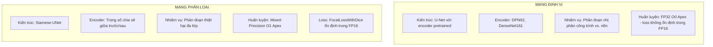
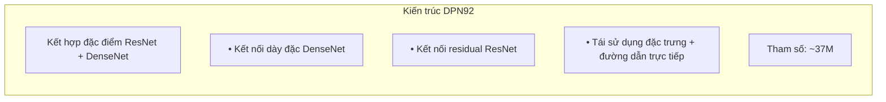
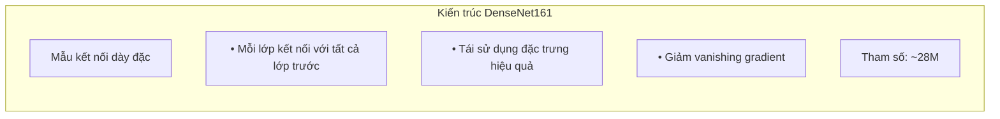
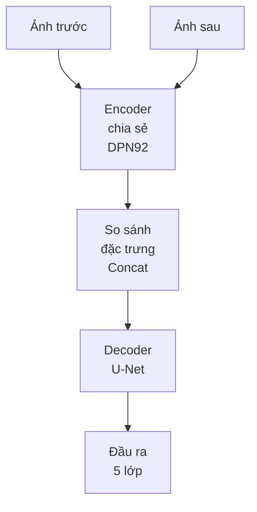

# xView2 Hạng 2: Giải pháp Selim Sefidov

## Tổng quan

| Thuộc tính | Giá trị |
|-----------|-------|
| **Hạng** | Hạng 2 |
| **Tác giả** | Selim Sefidov (selimsef) |
| **GitHub** | [DIUx-xView/xView2_second_place](https://github.com/DIUx-xView/xView2_second_place) |
| **Forked từ** | selimsef/xview2_solution |
| **Đổi mới chính** | Định vị/phân loại riêng biệt với huấn luyện mixed-precision |

---

## Tổng quan kiến trúc

### Phương pháp hai mạng



---

## Chi tiết kỹ thuật

### Mạng định vị

| Thành phần | Thông số kỹ thuật |
|-----------|---------------|
| **Kiến trúc** | U-Net (Encoder-Decoder) |
| **Tùy chọn Encoder** | DPN92, DenseNet161 |
| **Pretrained** | Trọng số ImageNet |
| **Đầu ra** | Mask nhị phân (công trình/không phải công trình) |

**Cấu hình huấn luyện:**
```python
# Huấn luyện định vị
optimizer: AdamW
precision: FP32 (Apex O0 level)
reason: "loss không ổn định trong quá trình huấn luyện với FP16"
loss: Binary Cross Entropy + Dice
```

### Mạng phân loại

| Thành phần | Thông số kỹ thuật |
|-----------|---------------|
| **Kiến trúc** | Siamese-UNet |
| **Chia sẻ trọng số** | Encoder chia sẻ cho trước/sau |
| **Đầu ra** | Phân đoạn đa lớp (5 lớp) |

**Cấu hình huấn luyện:**
```python
# Huấn luyện phân loại
optimizer: AdamW
precision: Mixed-Precision (Apex O1 level)
reason: "loss đa lớp FocalLossWithDice ổn định trong mixed precision"
loss: FocalLossWithDice
```

---

## Hàm mất mát: FocalLossWithDice

### Triển khai loss tùy chỉnh

```
FocalLossWithDice = α × FocalLoss + β × DiceLoss
```

**Thành phần:**
1. **Focal Loss** - Xử lý mất cân bằng lớp, giảm trọng số ví dụ dễ
2. **Dice Loss** - Tối ưu hóa cho sự chồng lấp phân đoạn

**Tính ổn định:**
- Chỉ Focal Loss: không ổn định trong FP16
- Kết hợp với Dice: ổn định trong mixed-precision
- Cho phép huấn luyện nhanh hơn với tối ưu O1

---

## So sánh Encoder

### DPN92 (Dual Path Network)



### DenseNet161



---

## Pipeline huấn luyện

### Huấn luyện định vị

```bash
python train_localization.py \
    --encoder dpn92 \
    --batch_size 8 \
    --epochs 50 \
    --apex_opt_level O0
```

**Cài đặt chính:**
- Sử dụng FP32 do loss không ổn định
- Huấn luyện riêng khỏi phân loại
- Tập trung vào phát hiện công trình nhị phân

### Huấn luyện phân loại

```bash
python train.py \
    --encoder dpn92 \
    --batch_size 4 \
    --epochs 100 \
    --apex_opt_level O1
```

**Cài đặt chính:**
- Mixed-precision cho tốc độ
- FocalLossWithDice cho tính ổn định
- Đầu ra đa lớp (5 cấp độ thiệt hại)

---

## Thiết kế mạng Siamese

### Luồng đặc trưng



### Tại sao chia sẻ trọng số?

1. **Nhất quán** - Cùng đặc trưng được trích xuất từ cả hai thời điểm
2. **Hiệu quả** - Ít tham số hơn để huấn luyện
3. **Căn chỉnh** - Xử lý biến thể thời gian tốt hơn
4. **Tổng quát hóa** - Học đặc trưng bất biến góc nhìn

---

## File cấu hình

### Cấu trúc cấu hình JSON

```json
{
  "model": {
    "encoder": "dpn92",
    "decoder": "unet",
    "pretrained": true
  },
  "training": {
    "batch_size": 4,
    "learning_rate": 1e-4,
    "epochs": 100,
    "apex_opt_level": "O1"
  },
  "loss": {
    "type": "FocalLossWithDice",
    "focal_alpha": 0.25,
    "focal_gamma": 2.0,
    "dice_weight": 1.0
  },
  "data": {
    "train_dir": "data/train",
    "val_dir": "data/val",
    "image_size": [512, 512]
  }
}
```

---

## Đổi mới chính

### 1. Pipeline huấn luyện riêng biệt

**Lý do:**
- Định vị và phân loại có cài đặt tối ưu khác nhau
- Định vị hưởng lợi từ độ chính xác FP32
- Phân loại ổn định với mixed-precision

### 2. Chiến lược Mixed-Precision

| Mạng | Độ chính xác | Lý do |
|---------|-----------|--------|
| Định vị | FP32 (O0) | Ổn định loss |
| Phân loại | FP16 (O1) | Tốc độ huấn luyện |

### 3. Encoder dày đặc

DPN92 và DenseNet161 cung cấp:
- Biểu diễn đặc trưng phong phú
- Luồng gradient qua kết nối dày đặc
- Tái sử dụng đặc trưng hiệu quả

---

## Mẹo huấn luyện

### Từ tác giả

1. **Định vị trước**
   - Huấn luyện mạng định vị hoàn toàn
   - Sử dụng checkpoint tốt nhất để đánh giá

2. **Phân loại chỉ trên công trình**
   - Sử dụng mask định vị để tập trung huấn luyện
   - Bỏ qua pixel nền trong loss

3. **Batch cân bằng**
   - Đảm bảo mỗi batch có ví dụ thiệt hại
   - Oversample các lớp thiệt hại thiểu số

---

## Kết quả

### Hiệu suất (Ước tính)

| Metric | Điểm |
|--------|-------|
| **Hạng tổng thể** | Hạng 2 |
| **F1 định vị** | ~0.84 |
| **F1 thiệt hại** | ~0.78 |
| **Tổng hợp** | ~0.80 |

---

## Dependencies

```
pytorch >= 1.4
apex (NVIDIA)
segmentation-models-pytorch
albumentations
opencv-python
```

### Cài đặt NVIDIA Apex

```bash
git clone https://github.com/NVIDIA/apex
cd apex
pip install -v --no-cache-dir --global-option="--cpp_ext" --global-option="--cuda_ext" ./
```

---

## Cấu trúc code

```
xview2_solution/
├── configs/
│   ├── localization_dpn92.json
│   └── classification_dpn92.json
├── train_localization.py
├── train.py (phân loại)
├── models/
│   ├── encoder.py
│   ├── decoder.py
│   └── siamese.py
├── losses/
│   └── focal_dice.py
└── utils/
    ├── data_loader.py
    └── augmentations.py
```

---

## Bài học quan trọng

### Những gì hiệu quả

1. **Mạng riêng biệt** - Cài đặt tối ưu cho từng nhiệm vụ
2. **FocalLossWithDice** - Ổn định + xử lý mất cân bằng
3. **Encoder dày đặc** - Biểu diễn đặc trưng phong phú
4. **Mixed Precision** - Huấn luyện nhanh hơn khi ổn định

### Bài học rút ra

1. **Độ chính xác quan trọng** - FP16 không phải lúc nào cũng tốt hơn
2. **Tách nhiệm vụ** - Đôi khi tốt hơn end-to-end
3. **Thiết kế Loss** - Loss kết hợp ổn định hơn

---

## Tài nguyên

- **GitHub:** [DIUx-xView/xView2_second_place](https://github.com/DIUx-xView/xView2_second_place)
- **Gốc:** [selimsef/xview2_solution](https://github.com/selimsef/xview2_solution)
- **NVIDIA Apex:** [github.com/NVIDIA/apex](https://github.com/NVIDIA/apex)

---

*Tài liệu tạo: 2024-12-18*
