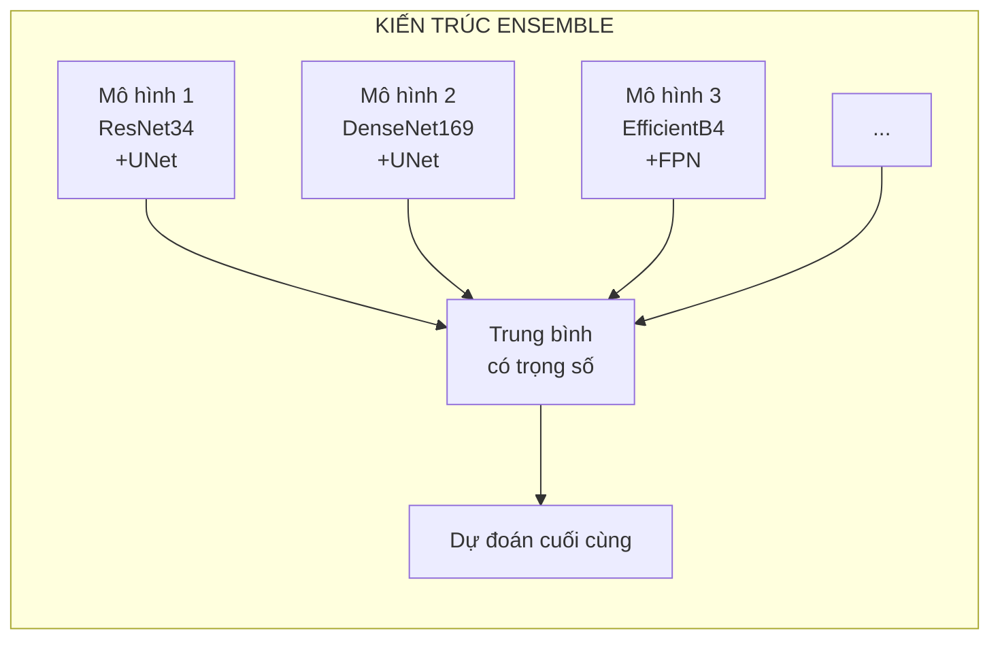
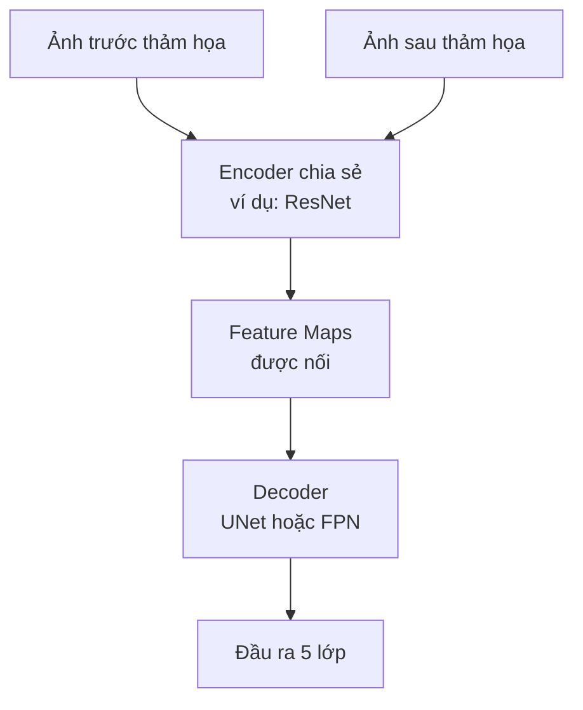
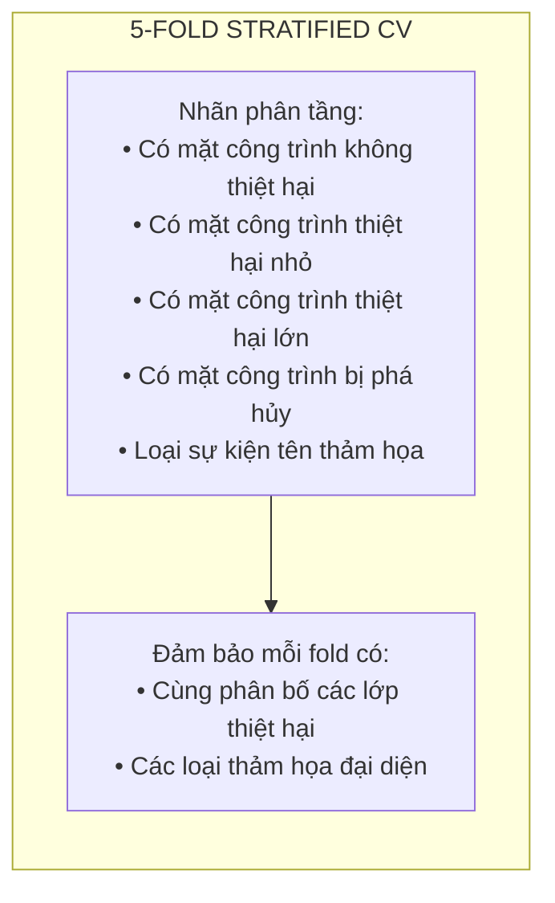
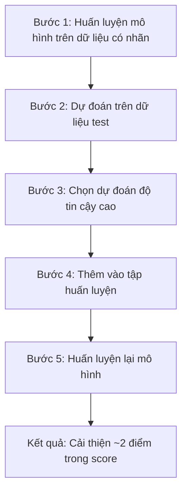

# xView2 Hạng 3: Giải pháp Eugene Khvedchenya (BloodAxe)

## Tổng quan

| Thuộc tính | Giá trị |
|-----------|-------|
| **Hạng** | Hạng 3 (Private LB) |
| **Hạng Public LB** | Hạng 2 |
| **Tác giả** | Eugene Khvedchenya (BloodAxe) |
| **Liên kết** | Độc lập / Kaggle Grandmaster |
| **Điểm (Public)** | 0.803 |
| **Điểm (Private)** | 0.805 |
| **GitHub** | [BloodAxe/xView2-Solution](https://github.com/BloodAxe/xView2-Solution) |
| **Bài báo** | [arXiv:2111.00508](https://arxiv.org/abs/2111.00508) |

---

## Hồ sơ tác giả

### Eugene Khvedchenya

- **Trạng thái Kaggle:** Grandmaster
- **Nổi tiếng về:** Liên tục xếp hạng cao trong các cuộc thi computer vision
- **Chiến thắng đáng chú ý khác:**
  - xView3 hạng 1 (2022)
  - Nhiều huy chương vàng Kaggle

---

## Tổng quan kiến trúc

### Ensemble các mô hình phân đoạn



### Kết hợp Encoder-Decoder

| Encoder | Decoder | Ghi chú |
|---------|---------|-------|
| ResNet34 | UNet | Baseline, nhanh |
| ResNet50 | UNet | Nhiều khả năng hơn |
| ResNet101 | FPN | Đặc trưng sâu |
| DenseNet169 | UNet | Kết nối dày đặc |
| DenseNet201 | FPN | Nhiều lớp hơn |
| SE-ResNeXt50 | UNet | Cơ chế attention |
| EfficientNet-B4 | FPN | Scaling hiệu quả |
| EfficientNet-B5 | UNet | Biến thể lớn hơn |

---

## Phương pháp kỹ thuật chính

### Kiến trúc Encoder chia sẻ



### Quy trình trích xuất đặc trưng

1. Trích xuất đặc trưng từ ảnh trước thảm họa
2. Trích xuất đặc trưng từ ảnh sau thảm họa (cùng encoder)
3. Nối các feature map tương ứng
4. Gửi đến decoder để phân đoạn

---

## Hàm mất mát

### Weighted Cross-Entropy

```python
class_weights = {
    'background': 1.0,      # Không phải công trình
    'no_damage': 1.0,       # Cấp độ 0
    'minor_damage': 3.0,    # Cấp độ 1
    'major_damage': 3.0,    # Cấp độ 2
    'destroyed': 3.0        # Cấp độ 3
}

loss = WeightedCrossEntropyLoss(weights=class_weights)
```

**Lý do:**
- Trọng số 3.0 cho các lớp thiệt hại (minor, major, destroyed)
- Trọng số 1.0 cho không thiệt hại và nền
- Giải quyết mất cân bằng lớp nghiêm trọng

### Tại sao Cross-Entropy (không phải Focal)?

Qua thử nghiệm:
- Weighted CE vượt trội Focal Loss cho nhiệm vụ này
- Điều chỉnh trọng số lớp cẩn thận hiệu quả hơn
- Đơn giản hơn để tối ưu

---

## Tăng cường dữ liệu

### Chiến lược tăng cường mạnh

```python
augmentations = [
    # Biến đổi không gian (áp dụng cho ảnh sau độc lập trước)
    A.ShiftScaleRotate(shift_limit=10/1024, scale_limit=0.02, rotate_limit=3),

    # Sau đó biến đổi nhất quán cho cả hai ảnh
    A.RandomRotate90(),
    A.HorizontalFlip(),
    A.VerticalFlip(),
    A.RandomGridShuffle(),

    # Tăng cường màu
    A.ColorJitter(brightness=0.1, contrast=0.1, saturation=0.1),

    # Nhiễu
    A.GaussNoise(var_limit=(10, 50)),
]
```

### Triết lý tăng cường

**Thông tin chính:** Tính bền vững với lệch căn chỉnh là quan trọng

| Biến đổi | Mục tiêu | Mục đích |
|-----------|--------|---------|
| ShiftScaleRotate | Chỉ ảnh sau | Mô phỏng lệch căn chỉnh |
| RandomRotate90 | Cả hai | Bất biến hướng |
| Flips | Cả hai | Bất biến gương |
| GridShuffle | Cả hai | Biến thể cục bộ |

---

## Chiến lược huấn luyện

### Cross-Validation 5-Fold



### Chi tiết huấn luyện

| Tham số | Giá trị |
|-----------|-------|
| **Kích thước Crop (Train)** | 512 × 512 |
| **Kích thước đầy đủ (Val)** | 1024 × 1024 |
| **Batch Size** | 8-16 (phụ thuộc encoder) |
| **Optimizer** | AdamW |
| **Learning Rate** | 1e-4 (với scheduler) |
| **Epochs** | 50-100 mỗi fold |

---

## Pseudo-Labeling

### Pseudo-Labeling một vòng



### Ngưỡng tin cậy

Chỉ bao gồm pseudo-label khi:
- Độ tin cậy dự đoán > 0.9
- Nhất quán qua ensemble mô hình

---

## Chiến lược Ensemble

### Trung bình có trọng số

```python
# Trọng số được tối ưu trên dữ liệu validation
ensemble_weights = {
    'resnet34_unet': 0.8,
    'densenet169_unet': 1.0,
    'efficientb4_fpn': 1.2,
    'seresnext50_unet': 1.1,
    # ... thêm mô hình
}

# Dự đoán ensemble
final_pred = weighted_average(predictions, weights)
```

### Lựa chọn mô hình

**Tiêu chí:**
- Điểm validation tốt nhất mỗi kiến trúc
- Đa dạng trong các họ encoder
- Mẫu lỗi bổ sung

---

## Phân tích kết quả

### Hiệu suất mô hình riêng lẻ

| Mô hình | F1 định vị | F1 thiệt hại |
|-------|-----------------|-----------|
| ResNet34 + UNet | 0.833 | 0.664 |
| DenseNet169 + UNet | 0.856 | 0.698 |
| EfficientNet-B4 + FPN | 0.879 | 0.733 |
| SE-ResNeXt50 + UNet | 0.867 | 0.712 |

### Hiệu suất Ensemble

| Metric | Điểm |
|--------|-------|
| **Public LB** | 0.803 |
| **Private LB** | 0.805 |
| **Cải thiện từ Pseudo-labeling** | +2 điểm |

---

## Bài học quan trọng

### Những gì hiệu quả

1. **Weighted Cross-Entropy** - Tốt hơn Focal Loss cho nhiệm vụ này
2. **Tăng cường mạnh** - Đặc biệt cho tính bền vững lệch căn chỉnh
3. **5-Fold CV** - Phân tầng theo thiệt hại + loại thảm họa
4. **Pseudo-Labeling** - Một vòng, tăng 2 điểm
5. **Ensemble đa dạng** - Nhiều họ encoder

### Những gì không hiệu quả

1. **Focal Loss** - CE với trọng số tốt hơn
2. **Huấn luyện End-to-End** - Hai giai đoạn (loc + class) tốt hơn
3. **Mô hình đơn** - Ensemble cần thiết cho vị trí top

---

## Framework & Công cụ

### Thư viện Catalyst

Giải pháp được xây dựng với [Catalyst](https://github.com/catalyst-team/catalyst):
- Hệ sinh thái PyTorch
- Theo dõi thí nghiệm
- Trừu tượng vòng lặp huấn luyện
- Xử lý đầu vào không chuẩn (cặp ảnh)

### Dependencies

```
pytorch >= 1.4
catalyst
segmentation-models-pytorch
albumentations
opencv-python
scikit-learn
```

---

## Công việc tiếp theo

### Bài báo NeurIPS

Giải pháp được mở rộng và công bố:
- **Tiêu đề:** "Building Damage Assessment from Satellite Imagery"
- **Địa điểm:** NeurIPS 2021 (workshop/proceedings)
- **arXiv:** [2111.00508](https://arxiv.org/abs/2111.00508)

### Tiếp tục thành công

Eugene Khvedchenya tiếp tục chiến thắng:
- **xView3 hạng 1** (2022) - Phát hiện tàu biển
- Nhiều cuộc thi Kaggle khác

---

## Tài nguyên

- **GitHub:** [BloodAxe/xView2-Solution](https://github.com/BloodAxe/xView2-Solution)
- **Bài báo:** [arXiv:2111.00508](https://arxiv.org/abs/2111.00508)
- **Blog:** [computer-vision-talks.com](https://computer-vision-talks.com/2020-01-xview2-solution-writeup/)
- **Hồ sơ Kaggle:** [bloodaxe](https://www.kaggle.com/bloodaxe)

---

*Tài liệu tạo: 2024-12-18*
