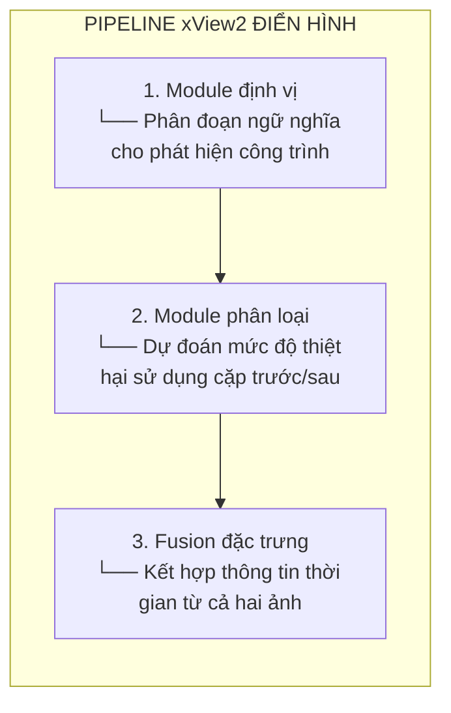

# xView2 Hạng 4: Giải pháp Z-Zheng

## Tổng quan

| Thuộc tính | Giá trị |
|-----------|-------|
| **Hạng** | Hạng 4 |
| **Tác giả** | Z-Zheng |
| **GitHub** | [DIUx-xView/xView2_fourth_place](https://github.com/DIUx-xView/xView2_fourth_place) |
| **Forked từ** | Z-Zheng/xview2_4th_solution |
| **Giấy phép** | Apache-2.0 |

---

## Cấu trúc repository

```
xview2_4th_solution/
├── app/                    # Code ứng dụng
├── configs/                # File cấu hình
├── data/                   # Tiện ích dữ liệu
├── module/                 # Module mô hình
├── train.py                # Script huấn luyện
└── README.md               # Tài liệu
```

---

## Phương pháp kỹ thuật

> **Lưu ý:** Tài liệu công khai hạn chế. Nội dung sau đại diện cho các phương pháp suy luận dựa trên cấu trúc repository và các mẫu giải pháp xView2 phổ biến.

### Kiến trúc có thể

Dựa trên các giải pháp xView2 hàng đầu, phương pháp này có khả năng bao gồm:



### Thành phần phổ biến (Suy luận)

1. **Kiến trúc Encoder-Decoder**
   - Decoder kiểu U-Net hoặc FPN
   - Encoder pretrained (ResNet, EfficientNet, v.v.)

2. **Xử lý Siamese**
   - Trọng số chia sẻ cho trích xuất đặc trưng trước/sau
   - Nối hoặc chênh lệch đặc trưng

3. **Multi-Task Learning**
   - Định vị + phân loại kết hợp
   - Hoặc pipeline hai giai đoạn

---

## Thiết kế dựa trên cấu hình

### Cấu hình mô-đun

Thư mục `configs/` gợi ý:
- Quản lý siêu tham số qua file cấu hình
- Dễ dàng tái tạo thí nghiệm
- Hỗ trợ nhiều biến thể mô hình

### Cấu trúc Config điển hình

```yaml
model:
  encoder: "resnet50"
  decoder: "unet"
  pretrained: true

training:
  batch_size: 8
  learning_rate: 0.0001
  epochs: 100

data:
  train_path: "data/train"
  val_path: "data/val"
  image_size: [512, 512]

augmentation:
  horizontal_flip: true
  vertical_flip: true
  rotate: true
```

---

## Script huấn luyện

### Tính năng train.py (Suy luận)

Dựa trên các mẫu phổ biến:

```python
# Pseudo-code cho cấu trúc script huấn luyện
def main():
    # 1. Tải cấu hình
    config = load_config(args.config)

    # 2. Thiết lập data loader
    train_loader = get_dataloader(config, 'train')
    val_loader = get_dataloader(config, 'val')

    # 3. Khởi tạo mô hình
    model = build_model(config)

    # 4. Thiết lập optimizer và scheduler
    optimizer = get_optimizer(model, config)
    scheduler = get_scheduler(optimizer, config)

    # 5. Vòng lặp huấn luyện
    for epoch in range(config.epochs):
        train_one_epoch(model, train_loader, optimizer)
        validate(model, val_loader)
        scheduler.step()
        save_checkpoint(model, epoch)
```

---

## Bối cảnh hiệu suất

### Vị trí cuộc thi

| Metric | Giá trị |
|--------|-------|
| **Hạng** | Hạng 4 |
| **Tổng số bài nộp** | 2,000+ |
| **Hiệu suất vs Baseline** | Cải thiện >200% |

### Bối cảnh Top 5

| Hạng | Đội/Tác giả | Phương pháp chính |
|------|-------------|--------------|
| 1 | Anonymous | Siamese UNet |
| 2 | Selim Sefidov | DPN92/DenseNet + Siamese |
| 3 | Eugene Khvedchenya | Ensemble + Pseudo-labeling |
| **4** | **Z-Zheng** | **Giải pháp này** |
| 5 | SI Analytics | Dual-HRNet |

---

## Kỹ thuật xView2 phổ biến

### Kỹ thuật có khả năng sử dụng

1. **Tăng cường dữ liệu**
   - Xoay, lật, co giãn
   - Jittering màu
   - Biến đổi nhất quán cho cặp trước/sau

2. **Cân bằng lớp**
   - Hàm mất mát có trọng số
   - Oversampling các lớp thiệt hại

3. **Hậu xử lý**
   - Phép toán hình thái học
   - Ngưỡng tin cậy

4. **Ensembling**
   - Trung bình nhiều mô hình
   - Test-time augmentation

---

## Khả năng tái tạo

### Yêu cầu (Suy luận)

```
pytorch >= 1.4
torchvision
segmentation-models-pytorch
albumentations
opencv-python
pyyaml
```

### Chạy huấn luyện

```bash
python train.py --config configs/default.yaml
```

---

## Thông tin chính

### Mẫu cuộc thi xView2

1. **Hai giai đoạn thắng**
   - Tách định vị khỏi phân loại
   - Tối ưu riêng lẻ

2. **Siamese cần thiết**
   - Encoder chia sẻ cho so sánh thời gian
   - Xử lý lệch căn chỉnh tốt hơn

3. **Tăng cường mạnh**
   - Bền vững với biến thể
   - Ngăn overfitting

4. **Sức mạnh Ensemble**
   - Nhiều kiến trúc
   - Trung bình có trọng số

---

## Tài nguyên

- **GitHub:** [DIUx-xView/xView2_fourth_place](https://github.com/DIUx-xView/xView2_fourth_place)
- **Cuộc thi xView2:** [xview2.org](https://xview2.org)
- **Dataset:** [Bài báo xBD](https://openaccess.thecvf.com/content_CVPRW_2019/papers/cv4gc/Gupta_Creating_xBD_A_Dataset_for_Assessing_Building_Damage_from_Satellite_CVPRW_2019_paper.pdf)

---

## Hạn chế của tài liệu này

Do tài liệu công khai hạn chế:
- Chi tiết kiến trúc cụ thể chưa được xác nhận
- Siêu tham số huấn luyện không công khai
- Đổi mới chính có thể không được ghi lại đầy đủ

Để biết thông số kỹ thuật chi tiết, xem xét code nguồn trực tiếp hoặc liên hệ tác giả.

---

*Tài liệu tạo: 2024-12-18*
*Lưu ý: Chi tiết bổ sung đang chờ phân tích code hoặc công bố của tác giả*
