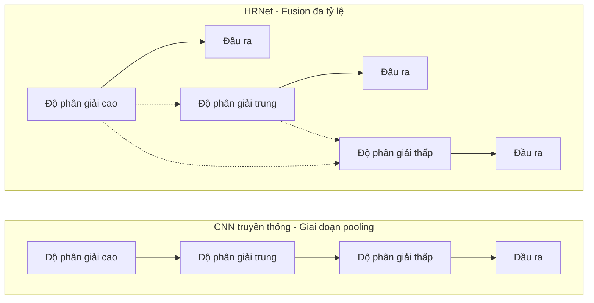
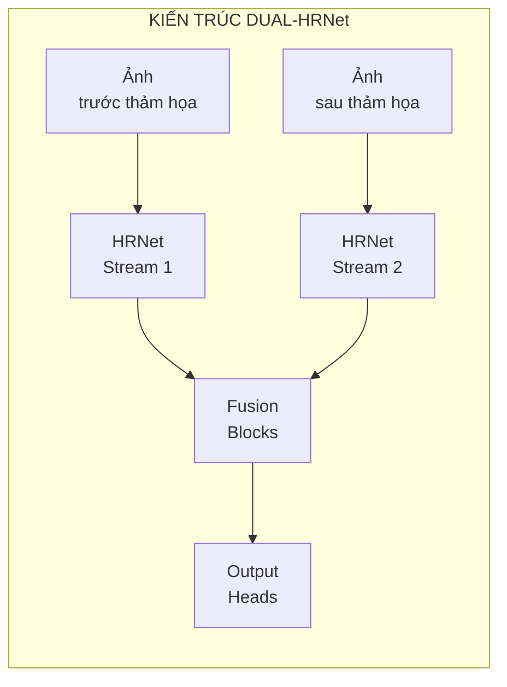
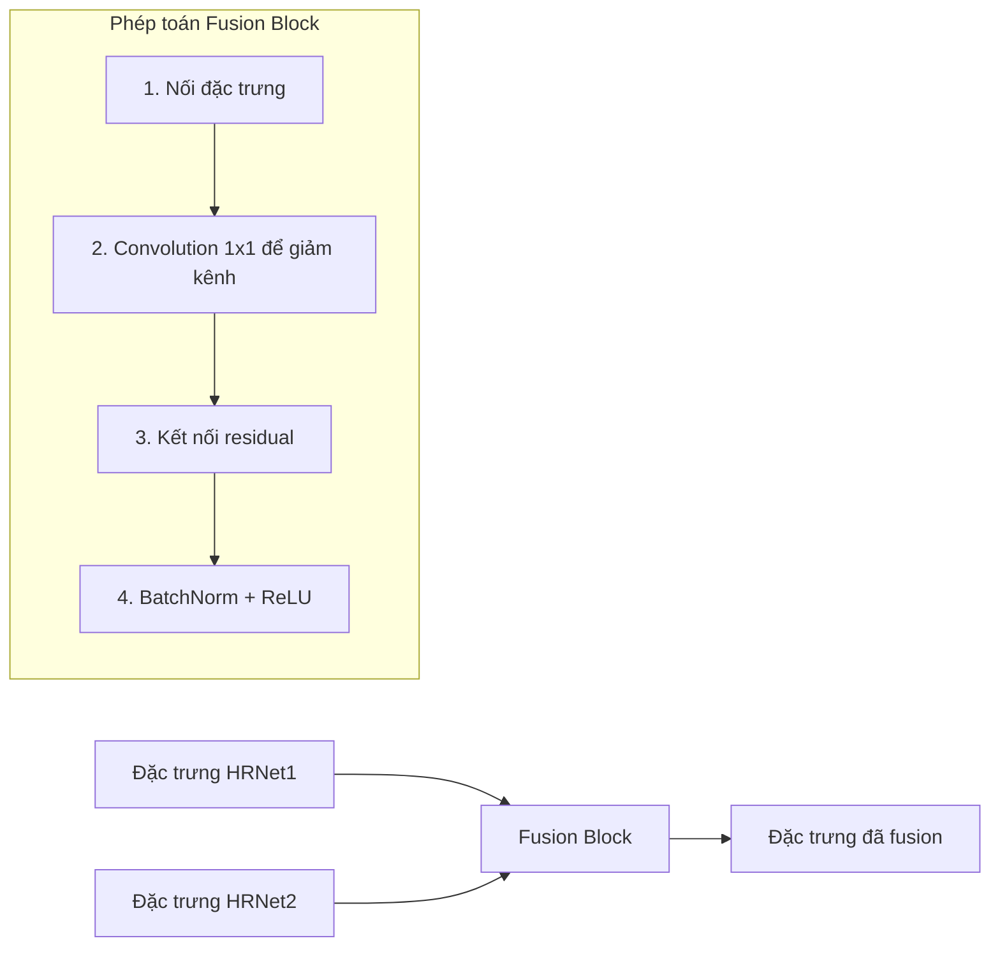
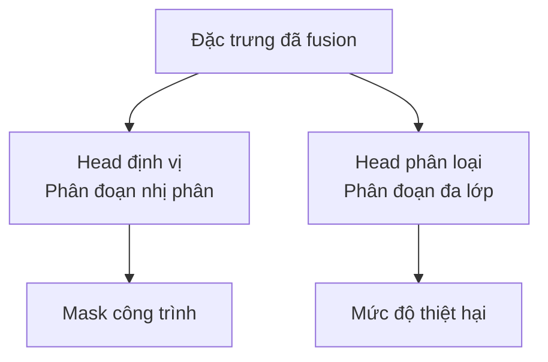
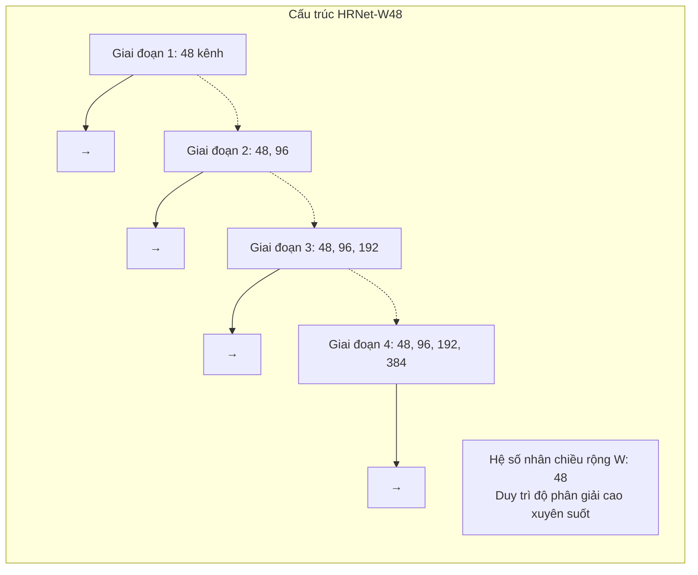

# xView2 Hạng 5: Dual-HRNet (SI Analytics)

## Tổng quan

| Thuộc tính | Giá trị |
|-----------|-------|
| **Hạng** | Hạng 5 |
| **Đội** | SI Analytics |
| **Quy mô cuộc thi** | 3,500+ người tham gia |
| **Kiến trúc** | Dual-HRNet |
| **GitHub** | [DIUx-xView/xView2_fifth_place](https://github.com/DIUx-xView/xView2_fifth_place) |
| **Giấy phép** | MIT |
| **Framework** | PyTorch 1.4 |

---

## Kiến trúc: Dual-HRNet

### Tổng quan High-Resolution Network (HRNet)

HRNet duy trì biểu diễn độ phân giải cao xuyên suốt mạng, không giống các kiến trúc truyền thống giảm mẫu dần dần.



### Thiết kế Dual-HRNet



### Thiết kế Fusion Block

Ở mỗi giai đoạn, đặc trưng từ cả hai HRNet stream được fusion:



---

## Tính năng kỹ thuật chính

### 1. Xử lý song song

Mỗi HRNet xử lý đầu vào riêng biệt:
- **Stream 1:** Ảnh trước thảm họa
- **Stream 2:** Ảnh sau thảm họa

**Ưu điểm:** Trích xuất đặc trưng chuyên dụng cho từng trạng thái thời gian

### 2. Fusion đa giai đoạn

Đặc trưng được fusion ở mỗi giai đoạn HRNet:
- Giai đoạn đầu: Đặc trưng mức thấp (cạnh, kết cấu)
- Giai đoạn giữa: Đặc trưng mức trung (phần công trình)
- Giai đoạn cuối: Đặc trưng mức cao (ngữ nghĩa công trình)

### 3. Đầu ra độ phân giải cao

HRNet duy trì độ phân giải cao xuyên suốt:
- Độ chính xác định vị tốt hơn
- Ranh giới thiệt hại chi tiết
- Chi tiết không gian được bảo tồn

---

## Cấu hình mô hình

### Cấu trúc cấu hình YAML

```yaml
model:
  type: "DualHRNet"
  backbone: "hrnet_w48"
  pretrained: true

  fusion:
    type: "concatenate"
    reduction: true

  heads:
    localization: true
    classification: true

training:
  batch_size: 4
  learning_rate: 0.001
  optimizer: "adam"

distributed:
  enabled: true
  world_size: 2
```

---

## Huấn luyện

### Hỗ trợ huấn luyện phân tán

```bash
python -m torch.distributed.launch \
    --nproc_per_node=2 \
    train.py \
    --config configs/dual_hrnet.yaml
```

### Tính năng huấn luyện

| Tính năng | Mô tả |
|---------|-------------|
| **Multi-GPU** | Huấn luyện phân tán PyTorch |
| **Mixed Precision** | Huấn luyện FP16 tùy chọn |
| **Checkpointing** | Lưu mô hình tốt nhất |
| **Logging** | Tích hợp TensorBoard |

---

## Output Heads

### Đầu ra hai nhiệm vụ



### Kiến trúc Head

| Head | Số kênh đầu ra | Activation |
|------|-----------------|------------|
| Định vị | 1 | Sigmoid |
| Phân loại | 5 | Softmax |

---

## Backbone HRNet

### Thông số HRNet-W48



### Tại sao HRNet cho thiệt hại công trình?

1. **Ranh giới chính xác:** Đặc trưng độ phân giải cao cho đường viền công trình chính xác
2. **Đa tỷ lệ:** Bắt được công trình với kích thước khác nhau
3. **Ngữ nghĩa phong phú:** Biểu diễn học mạnh mẽ
4. **Hiệu quả:** So với dilated convolution

---

## Hiệu suất

### Kết quả cuộc thi

| Metric | Giá trị |
|--------|-------|
| **Hạng** | Hạng 5 |
| **Quy mô cuộc thi** | 3,500+ người tham gia |
| **Phân loại** | Top 0.15% |

### Đặc điểm hiệu suất

**Điểm mạnh:**
- Độ chính xác định vị xuất sắc
- Phân loại thiệt hại tốt
- Hiệu suất cân bằng trên cả hai nhiệm vụ

**Ưu điểm kiến trúc:**
- Mạng đơn cho cả hai nhiệm vụ
- Chia sẻ tham số hiệu quả
- Có thể huấn luyện end-to-end

---

## Code Base

### Dựa trên HRNet Semantic Segmentation

Giải pháp xây dựng trên:
- Triển khai HRNet chính thức
- Sửa đổi tùy chỉnh cho dual-stream
- Thêm fusion block

### Cấu trúc Repository

```
xView2_fifth_place/
├── configs/
│   └── dual_hrnet.yaml
├── lib/
│   ├── models/
│   │   ├── hrnet.py
│   │   ├── dual_hrnet.py
│   │   └── fusion.py
│   ├── datasets/
│   │   └── xview2.py
│   └── core/
│       ├── criterion.py
│       └── function.py
├── tools/
│   ├── train.py
│   └── test.py
└── experiments/
```

---

## Dependencies

```
pytorch >= 1.4
torchvision
yacs
tensorboardX
opencv-python
```

### Cài đặt

```bash
git clone https://github.com/DIUx-xView/xView2_fifth_place.git
cd xView2_fifth_place
pip install -r requirements.txt
```

---

## Bài học quan trọng

### Tại sao Dual-HRNet hiệu quả

1. **Bảo tồn độ phân giải**
   - Không mất thông tin từ downsampling
   - Độ chính xác không gian tốt hơn

2. **Fusion đa tỷ lệ**
   - Bắt ngữ cảnh cục bộ và toàn cục
   - Bền vững với biến thể kích thước vật thể

3. **Stream song song**
   - Xử lý chuyên dụng mỗi thời điểm
   - Phát hiện thay đổi qua fusion

4. **Huấn luyện End-to-End**
   - Tối ưu kết hợp định vị + phân loại
   - Đơn giản mạng đơn

### So sánh với các phương pháp khác

| Phương pháp | Ưu điểm | Nhược điểm |
|----------|------|------|
| **Dual-HRNet** | Mạng đơn, độ phân giải cao | Phức tạp hơn UNet |
| Siamese UNet | Đơn giản, hiệu quả | Độ phân giải thấp hơn |
| Hai giai đoạn | Tối ưu riêng | Độ phức tạp pipeline |
| Ensemble | Độ chính xác tốt nhất | Suy luận chậm |

---

## SI Analytics

### Nền tảng công ty

SI Analytics (trước đây là SI Imaging) chuyên về:
- Phân tích ảnh vệ tinh
- Giải pháp AI không gian địa lý
- Ứng dụng viễn thám

Sự tham gia của họ mang đến chuyên môn ngành vào cuộc thi.

---

## Tài nguyên

- **GitHub:** [DIUx-xView/xView2_fifth_place](https://github.com/DIUx-xView/xView2_fifth_place)
- **Bài báo HRNet:** [Deep High-Resolution Representation Learning](https://arxiv.org/abs/1908.07919)
- **HRNet gốc:** [HRNet Semantic Segmentation](https://github.com/HRNet/HRNet-Semantic-Segmentation)
- **Cuộc thi xView2:** [xview2.org](https://xview2.org)

---

*Tài liệu tạo: 2024-12-18*
