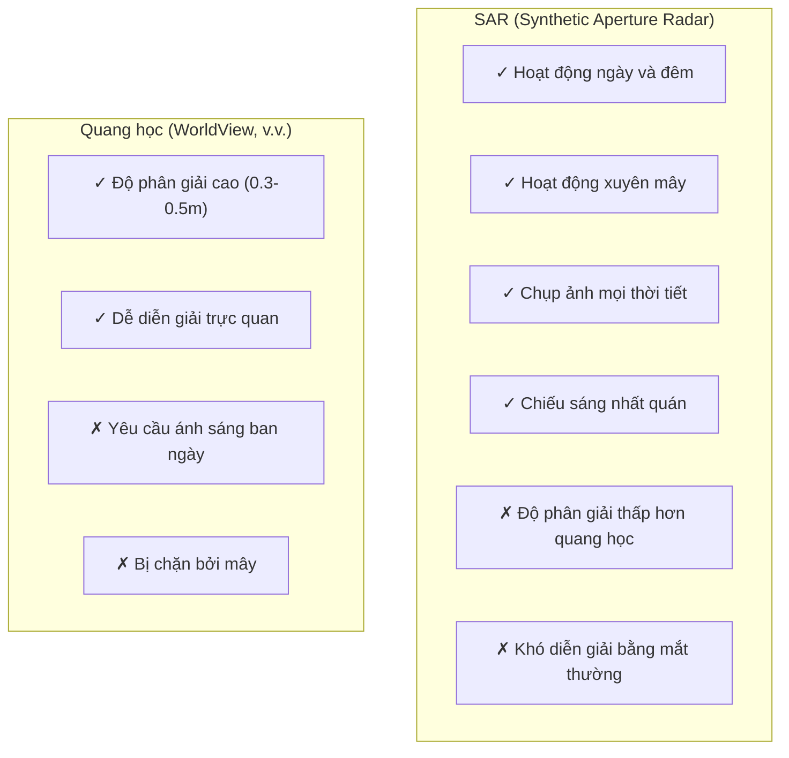
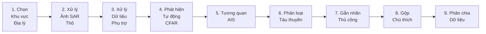

# Bộ dữ liệu xView3-SAR: Phát hiện Tàu thuyền Hàng hải

## Tổng quan

| Thuộc tính | Giá trị |
|-----------|-------|
| **Tên chính thức** | Bộ dữ liệu xView3-SAR |
| **Năm phát hành** | 2021-2022 |
| **Đơn vị tổ chức** | Defense Innovation Unit (DIU), Global Fishing Watch (GFW) |
| **Nhiệm vụ** | Phát hiện + Phân loại đối tượng hàng hải |
| **Trọng tâm** | Phát hiện tàu "tối" (đánh cá IUU) |
| **Cuộc thi** | xView3 Challenge |
| **Giải thưởng** | $150,000 |
| **Số người đăng ký** | 1,900 từ 67 quốc gia |
| **Bài báo** | [xView3-SAR: Detecting Dark Fishing Activity (NeurIPS 2022)](https://arxiv.org/abs/2206.00897) |

---

## Thống kê Bộ dữ liệu

### Quy mô

| Chỉ số | Giá trị |
|--------|-------|
| **Tổng số ảnh SAR** | 991 cảnh kích thước đầy đủ |
| **Kích thước ảnh trung bình** | 29,400 × 24,400 pixel |
| **Tổng số pixel** | 1,400 gigapixel |
| **Đối tượng hàng hải** | 243,018 được xác minh |
| **Diện tích phủ sóng** | 43.2 triệu km² |
| **Dung lượng dữ liệu** | ~1.4 TB |

### So sánh với các Bộ dữ liệu SAR khác

| Bộ dữ liệu | Số ảnh | Gigapixel | Đối tượng |
|---------|--------|------------|---------|
| **xView3-SAR** | 991 | 1,400 | 243K |
| OpenSARShip | 11,346 | ~12 | 17K |
| SSDD | 1,160 | ~0.5 | 2.5K |
| HRSID | 5,604 | ~1.5 | 16.9K |

**xView3-SAR lớn hơn 100 lần so với bộ dữ liệu phát hiện tàu SAR lớn thứ hai.**

---

## Nguồn Ảnh: Sentinel-1

### Thông số Vệ tinh

| Thông số | Giá trị |
|-----------|-------|
| **Vệ tinh** | Sentinel-1A/B |
| **Đơn vị vận hành** | European Space Agency (ESA) |
| **Thiết bị** | C-band SAR |
| **Tần số** | 5.405 GHz |
| **Phân cực** | VV và VH |
| **Độ phân giải** | 5-40 m (tùy chế độ) |
| **Thời gian tái viếng** | 6 ngày (đơn), 3 ngày (chùm) |

### Ưu điểm của SAR



---

## Các Loại Đối tượng

### Ba Lớp Chính

| Lớp | Mô tả | Số lượng |
|-------|-------------|-------|
| **Vessel** | Tàu và thuyền | Đa số |
| **Fishing Vessel** | Tàu đánh cá | Tập con |
| **Fixed Infrastructure** | Giàn khoan ngoài khơi, phao | Thiểu số |

### Thuộc tính Nhãn

Cho mỗi đối tượng được phát hiện:

| Thuộc tính | Kiểu | Mô tả |
|-----------|------|-------------|
| `is_vessel` | Boolean | Có phải tàu thuyền không (vs. cơ sở hạ tầng)? |
| `is_fishing` | Boolean | Có đang đánh cá không? |
| `vessel_length_m` | Float | Chiều dài ước tính (mét) |
| `confidence` | Categorical | Cao, Trung bình, hoặc Thấp |

---

## Phạm vi Địa lý

### Các Khu vực Được chọn

| Khu vực | Lý do |
|--------|--------|
| **North Sea** | Mật độ giao thông cao, phủ sóng AIS tốt |
| **Bay of Biscay** | Hoạt động đánh cá, tàu châu Âu |
| **Iceland** | Vùng nước lạnh, đội tàu đánh cá |
| **Adriatic Sea** | Giao thông Địa Trung Hải |
| **West Africa** | Hoạt động IUU cao, dầu khí ngoài khơi |

### Tiêu chí Lựa chọn

1. **Phủ sóng SAR Toàn diện:** Các đường quét Sentinel-1 thường xuyên
2. **Sẵn có AIS:** Dữ liệu chuẩn có độ tin cậy cao
3. **Các loại Tàu Đa dạng:** Đánh cá, hàng hóa, dầu, cơ sở hạ tầng
4. **Liên quan IUU:** Các điểm nóng đánh cá bất hợp pháp đã biết

---

## Phương pháp Tạo Bộ dữ liệu

### Quy trình 9 Bước



### Chi tiết các Bước

#### Bước 1: Lựa chọn Địa lý

Chọn các khu vực chiến lược với:
- Phủ sóng Sentinel-1 thường xuyên
- Sẵn có dữ liệu AIS/VMS tốt
- Các loại tàu đa dạng
- Hoạt động IUU liên quan

#### Bước 2: Xử lý SAR Thô

**Công cụ Sử dụng:**
- ESA Sentinel-1 Toolbox (SNAP)
- Thư viện GDAL

**Các bước Xử lý:**
1. Hiệu chỉnh quỹ đạo
2. Loại bỏ nhiễu nhiệt
3. Hiệu chuẩn phóng xạ
4. Hiệu chỉnh địa hình
5. Xuất dưới dạng GeoTIFF

#### Bước 3: Xử lý Dữ liệu Phụ trợ

**Các loại Dữ liệu:**
- Độ sâu địa hình (độ sâu nước)
- Tốc độ gió
- Chất lượng gió
- Khoảng cách đến bờ
- Phủ băng

#### Bước 4: Phát hiện CFAR

**Constant False Alarm Rate (CFAR):**
```
Cho mỗi pixel:
1. Xác định vùng bảo vệ xung quanh ô mục tiêu
2. Tính toán thống kê nền từ các ô huấn luyện
3. Đặt ngưỡng thích ứng dựa trên PFA
4. Phân loại pixel là mục tiêu hoặc nền
```

**Đầu ra:** Các ứng viên phát hiện ban đầu

#### Bước 5: Tương quan AIS

**Automatic Identification System (AIS):**
- Bắt buộc cho tàu >300 GT (quốc tế)
- Phát sóng vị trí, tốc độ, hướng đi, nhận dạng
- Khớp với phát hiện SAR theo thời gian/vị trí

**Vessel Monitoring System (VMS):**
- Bắt buộc cho tàu đánh cá
- Tương tự AIS nhưng cho nghề cá

**Quy trình Tương quan:**
1. Khớp thời gian vệt AIS với thời gian thu thập SAR
2. Khớp không gian sử dụng vị trí tàu
3. Gán thuộc tính AIS cho phát hiện đã khớp

#### Bước 6: Phân loại Tàu thuyền

Sử dụng dữ liệu AIS để xác định:
- Loại tàu (đánh cá, hàng hóa, tàu chở dầu, v.v.)
- Trạng thái hoạt động đánh cá
- Kích thước tàu

#### Bước 7: Gắn nhãn Thủ công

**Cho các đối tượng không có tương quan AIS:**
- Người gắn nhãn xem xét ảnh SAR
- Gán mức độ tin cậy
- Phân loại là tàu/cơ sở hạ tầng

**Mức độ Tin cậy:**
- **Cao:** Dấu hiệu tàu rõ ràng
- **Trung bình:** Có thể là tàu
- **Thấp:** Không chắc chắn

#### Bước 8: Gộp Chú thích

Kết hợp:
- Phát hiện tự động CFAR
- Nhãn tương quan AIS
- Chú thích thủ công

#### Bước 9: Phân chia Dữ liệu

| Phân chia | Mục đích |
|-------|---------|
| **xView3-Train** | Huấn luyện mô hình |
| **xView3-Validation** | Điều chỉnh siêu tham số |
| **xView3-Test** | Bảng xếp hạng công khai |
| **xView3-Holdout** | Đánh giá cuối cùng |

---

## Định nghĩa Dữ liệu Chuẩn

### Tiêu chí Dữ liệu Chuẩn

Một phát hiện được coi là dữ liệu chuẩn nếu:

1. **Được gắn nhãn thủ công với độ tin cậy cao/trung bình**, HOẶC
2. **Tương quan AIS độ tin cậy cao**

### Lưu ý Quan trọng

- Các cảnh huấn luyện KHÔNG được gắn nhãn toàn diện
- Hầu hết nhãn được tự động từ AIS
- "Tàu tối" (không có AIS) là thách thức phát hiện
- Thiếu nhãn là điều dự kiến trong dữ liệu huấn luyện

---

## Định dạng Dữ liệu

### Cấu trúc Thư mục

```
xview3/
├── train/
│   ├── scenes/
│   │   ├── scene_0001_vh.tif
│   │   ├── scene_0001_vv.tif
│   │   ├── scene_0001_bathymetry.tif
│   │   ├── scene_0001_wind_speed.tif
│   │   └── scene_0001_wind_quality.tif
│   └── labels/
│       └── train_labels.csv
├── validation/
│   ├── scenes/
│   └── labels/
└── test/
    └── scenes/
```

### Định dạng Nhãn (CSV)

```csv
scene_id,detect_lon,detect_lat,is_vessel,is_fishing,vessel_length_m,confidence
scene_0001,12.345,56.789,True,True,25.5,HIGH
scene_0001,12.350,56.795,True,False,150.0,MEDIUM
scene_0001,12.360,56.800,False,,,,
```

### Các Kênh Ảnh SAR

| Hậu tố File | Kênh | Mô tả |
|-------------|---------|-------------|
| `_vh.tif` | VH | Phân cực Dọc-Ngang |
| `_vv.tif` | VV | Phân cực Dọc-Dọc |
| `_bathymetry.tif` | Depth | Độ sâu nước (mét) |
| `_wind_speed.tif` | Wind | Tốc độ gió bề mặt |
| `_wind_quality.tif` | Quality | Chất lượng đo gió |

---

## Nhiệm vụ Thách thức

### Nhiệm vụ Phát hiện

**Đầu vào:** Cảnh SAR (VV, VH, dữ liệu phụ trợ)
**Đầu ra:** Danh sách tọa độ (x, y) cho mỗi đối tượng

**Chỉ số:** F1 score ở ngưỡng khoảng cách 200m

### Nhiệm vụ Phân loại

| Nhiệm vụ | Đầu ra | Chỉ số |
|------|--------|--------|
| **is_vessel** | Boolean | F1 score |
| **is_fishing** | Boolean | F1 score |
| **vessel_length** | Float (mét) | MAE |

### Điểm Tổng hợp

```
Score = w1 × F1_detection + w2 × F1_vessel + w3 × F1_fishing + w4 × (1 - length_error)
```

---

## Thách thức Đặc biệt

### 1. Nhiễu Nhãn

- Nhãn huấn luyện không đầy đủ (từ AIS)
- Một số tàu không phát sóng AIS
- Nhãn có thể không khớp với đối tượng

### 2. Mất cân bằng Lớp

```
Nền:           ████████████████████████████████████  99.99%
Đối tượng:     █                                      0.01%
```

Mỗi ảnh có ~2 đối tượng so với 89,998 pixel nền.

### 3. Chỉ có Nhãn Điểm

- Chỉ cung cấp vị trí pixel trung tâm
- Không có hộp giới hạn hoặc mặt nạ phân đoạn
- Hạn chế một số phương pháp phát hiện

### 4. Biến đổi Quy mô

- Tàu có chiều dài từ 5m đến 400m
- Thuyền đánh cá so với tàu chở dầu
- Cơ sở hạ tầng rất đa dạng

---

## Truy cập Dữ liệu

### Truy cập Dữ liệu Sentinel-1

Từ tháng 10/2023, dữ liệu Sentinel-1 có sẵn qua:
- **[Copernicus Data Space Ecosystem](https://dataspace.copernicus.eu/)**

Truy cập trước đây qua:
- Copernicus Open Access Hub (đã đóng tháng 10/2023)

### Bộ dữ liệu xView3

- **Website:** [iuu.xview.us](https://iuu.xview.us)
- **Đăng ký:** Yêu cầu để tải xuống
- **Giấy phép:** Mở cho nghiên cứu

---

## Khuyến nghị Tiền xử lý

### Chuẩn hóa SAR

```python
# Chuẩn hóa được khuyến nghị
def normalize_sar(image):
    # Cắt giá trị cực trị
    image = np.clip(image, -40, 40)
    # Chuẩn hóa sigmoid (từ giải pháp hạng 1)
    normalized = 1 / (1 + np.exp(-(image + 40) / 15))
    return normalized
```

### Chiến lược Chia Tile

| Tham số | Giá trị |
|-----------|-------|
| **Kích thước Tile** | 2048 × 2048 |
| **Độ chồng lấp** | 1536 pixel |
| **Padding** | 256 pixel |

**Lý do:** Ảnh đầy đủ quá lớn cho bộ nhớ GPU

### Tăng cường Dữ liệu

- Lật ngang
- Lật dọc
- Xoay ngẫu nhiên (giới hạn - hình học SAR nhạy cảm)
- **Không tăng cường màu sắc** (cường độ SAR có ý nghĩa)

---

## Bối cảnh Đánh cá IUU

### IUU là gì?

Đánh cá **I**llegal (Bất hợp pháp), **U**nreported (Không báo cáo), và **U**nregulated (Không quản lý):
- Đánh cá không có phép
- Đánh cá ở khu vực được bảo vệ
- Báo cáo sản lượng thấp hơn thực tế
- Bỏ qua hạn ngạch

### Tại sao SAR?

"Tàu tối" tắt AIS để tránh phát hiện. SAR có thể phát hiện chúng:
- Chụp ảnh ngày và đêm
- Khả năng mọi thời tiết
- Phủ sóng diện rộng

### Tác động

- Đánh cá IUU gây thiệt hại $10-23 tỷ hàng năm
- Đe dọa an ninh lương thực
- Phá hủy hệ sinh thái biển
- Thường liên quan đến lạm dụng lao động

---

## Trích dẫn

```bibtex
@inproceedings{paolo2022xview3,
  title={xView3-SAR: Detecting Dark Fishing Activity Using
         Synthetic Aperture Radar Imagery},
  author={Paolo, Fernando S and Lin, Tsung-Yu and Laber, Reeka
          and Shiffman, David and others},
  booktitle={NeurIPS Datasets and Benchmarks Track},
  year={2022}
}
```

---

## Tài nguyên

### Chính thức

- [xView3 Challenge Website](https://iuu.xview.us)
- [xView3 Dataset Whitepaper](https://iuu.xview.us/xview3_dataset_whitepaper.pdf)
- [NeurIPS 2022 Paper](https://arxiv.org/abs/2206.00897)

### Sentinel-1

- [Copernicus Data Space](https://dataspace.copernicus.eu/)
- [Sentinel-1 Toolbox (SNAP)](https://step.esa.int/main/toolboxes/snap/)

### Code & Tools

- [xView3 Reference Code](https://github.com/DIUx-xView/xview3-reference)
- [1st Place Solution](https://github.com/BloodAxe/xView3-The-First-Place-Solution)

### Các Tổ chức Liên quan

- [Global Fishing Watch](https://globalfishingwatch.org/)
- [Defense Innovation Unit](https://www.diu.mil/)

---

*Tài liệu tạo: 2024-12-18*
*Cập nhật lần cuối: 2024-12-18*
