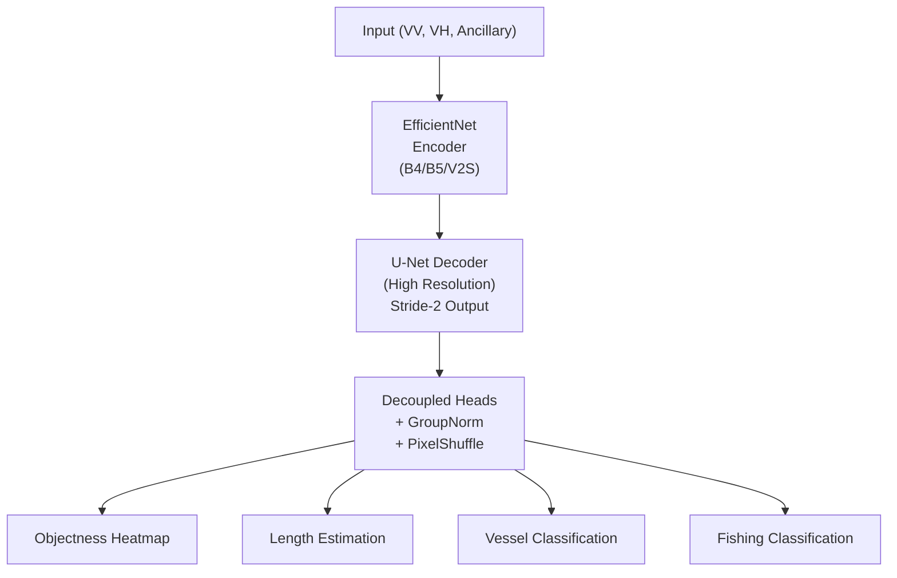
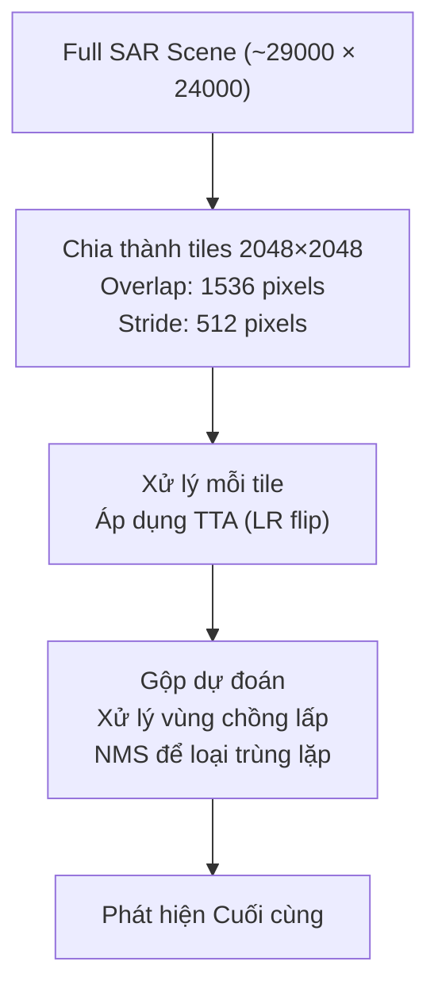
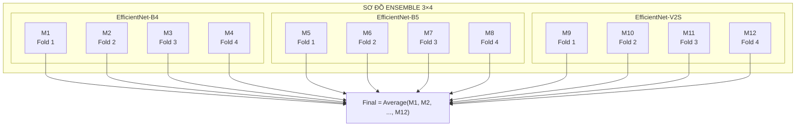

# xView3 Hạng 1: CircleNet (Eugene Khvedchenya / BloodAxe)

## Tổng quan

| Thuộc tính | Giá trị |
|-----------|-------|
| **Xếp hạng** | Hạng 1 |
| **Tác giả** | Eugene Khvedchenya (BloodAxe) |
| **Đơn vị** | Độc lập / Kaggle Grandmaster |
| **Điểm (Public LB)** | 0.603 |
| **Điểm (Holdout)** | 0.617 |
| **So với Baseline** | Cao gấp 3 lần baseline chính phủ |
| **GitHub** | [BloodAxe/xView3-The-First-Place-Solution](https://github.com/BloodAxe/xView3-The-First-Place-Solution) |

---

## Đổi mới Chính: Kiến trúc CircleNet

### Triết lý Thiết kế

CircleNet là framework encoder-decoder tùy chỉnh lấy cảm hứng từ:
- **CenterNet:** Phát hiện đối tượng như ước lượng keypoint
- **U-Net:** Decoder độ phân giải cao với skip connection

**Insight Chính:** Tối ưu hóa cho các đối tượng nhỏ, đóng gói dày đặc trong ảnh SAR.

### Tổng quan Kiến trúc



---

## Các Biến thể Backbone

### Ba Encoder EfficientNet

| Mô hình | Encoder | Kích thước Input | Tham số |
|-------|---------|------------|------------|
| Model A | EfficientNet-B4 | 2048×2048 | ~19M |
| Model B | EfficientNet-B5 | 2048×2048 | ~30M |
| Model C | EfficientNet-V2S | 2048×2048 | ~21M |

### Tại sao EfficientNet?

1. **Scaling Hiệu quả:** Cân bằng độ sâu, chiều rộng, độ phân giải
2. **Transfer Learning Mạnh:** Pretrain trên ImageNet
3. **Hiệu quả Bộ nhớ GPU:** Quan trọng cho ảnh SAR lớn

---

## Đổi mới Quan trọng: Đầu ra Độ phân giải Cao

### Stride-2 Output (vs. Stride-16 Chuẩn)

| Output Stride | Label Encoding F1 |
|---------------|-------------------|
| Stride-16 | 0.9672 |
| Stride-8 | 0.9934 |
| Stride-4 | 0.9991 |
| **Stride-2** | **0.9999** |

**Insight:** Với phát hiện dựa trên điểm, độ phân giải cao cải thiện đáng kể độ chính xác mã hóa nhãn.

### Triển khai

```python
# Cách tiếp cận chuẩn (stride-16)
feature_map = encoder(image)  # H/16, W/16

# Cách tiếp cận CircleNet (stride-2)
feature_map = encoder(image)
feature_map = decoder(feature_map)  # H/2, W/2
output = pixel_shuffle(feature_map)  # H, W (or H/2, W/2)
```

---

## Xử lý Nhiễu Nhãn

### Vấn đề: Nhãn Huấn luyện Không đầy đủ

Các cảnh huấn luyện KHÔNG được gắn nhãn toàn diện:
- Hầu hết nhãn từ tương quan AIS
- Nhiều tàu không có AIS (tàu tối)
- Thiếu chú thích là điều dự kiến

### Giải pháp 1: Label Smoothing

```python
# Áp dụng label smoothing 0.05
targets = targets * (1 - 0.05) + 0.05 / num_classes
```

**Hiệu quả:** Giảm quá tin tưởng vào các nhãn có thể không chính xác.

### Giải pháp 2: Regularization Entropy Shannon

Cho nhãn thiếu (lớp không xác định):

```python
# Entropy regularization
entropy = -p * log(p) - (1-p) * log(1-p)
loss += alpha * entropy  # Đẩy dự đoán về 0 hoặc 1
```

**Hiệu quả:** Xử lý chú thích không đầy đủ như cơ hội tự giám sát.

---

## Chuẩn hóa SAR Tùy chỉnh

### Vấn đề: Giá trị Cường độ SAR

Giá trị backscatter SAR trải rộng phạm vi động lớn với nhiều ngoại lệ.

### Giải pháp: Sigmoid Activation

```python
def normalize_sar(image):
    # Thay vì scaling tuyến tính
    # normalized = (image - min) / (max - min)  # TỆ

    # Sử dụng sigmoid cho chuẩn hóa robust
    normalized = sigmoid((image + 40) / 15)  # TỐT
    return normalized
```

**Lợi ích:**
- Xử lý ngoại lệ một cách nhẹ nhàng
- Phạm vi động nhất quán
- Bảo toàn sự khác biệt tương đối

---

## Hàm Loss

### Detection Head: Reduced Focal Loss

```python
# Bán kính mã hóa 3-pixel cố định cho objectness
focal_loss = ReducedFocalLoss(gamma=2.0, alpha=0.25)
detection_loss = focal_loss(pred_heatmap, target_heatmap)
```

### Classification Heads: Weighted BCE

```python
# Tập trung tín hiệu huấn luyện xung quanh tâm đối tượng
weight_mask = gaussian_around_objects(targets, sigma=3)
classification_loss = weighted_bce(pred, target, weight_mask)
```

### Length Estimation: L1 Loss

```python
length_loss = L1Loss(pred_length, target_length)
```

---

## Chiến lược Huấn luyện

### Sampling Cân bằng

```
Vấn đề: Vùng đông đúc chiếm ưu thế huấn luyện
Giải pháp: Cân bằng giữa các loại

Trọng số Sampling:
├── Cảnh Vessel: 1.0
├── Cảnh Fishing: 1.5 (tăng trọng số fishing)
├── Cảnh Infrastructure: 1.2
└── Cảnh Empty: 0.3 (giảm trọng số)
```

### Cấu hình Huấn luyện

| Tham số | Giá trị |
|-----------|-------|
| **Kích thước Tile** | 2048 × 2048 |
| **Batch Size** | 4 (mỗi GPU) |
| **Optimizer** | AdamW |
| **Learning Rate** | 1e-4 |
| **Epochs** | 50+ |
| **GPUs** | 4× (khuyến nghị) |

---

## Pipeline Inference

### Tiled Inference



### Test-Time Augmentation

| Loại TTA | Mô tả |
|----------|-------------|
| Original | Không biến đổi |
| LR Flip | Lật ngang trái-phải |

**Ensemble:** Trung bình dự đoán từ cả hai góc nhìn.

---

## Chiến lược Ensemble

### 12-Model Ensemble (Sơ đồ 3×4)



### Hiệu suất Mô hình Đơn lẻ

| Mô hình | CV Score | Phạm vi |
|-------|----------|-------|
| EfficientNet-B4 | 0.51-0.52 | Thấp |
| EfficientNet-B5 | 0.53-0.55 | Trung bình |
| EfficientNet-V2S | 0.55-0.62 | Cao |
| **Ensemble** | **0.617** | Tốt nhất |

---

## Kết quả

### Điểm Cuối cùng

| Chỉ số | Điểm |
|--------|-------|
| **Public Leaderboard** | 0.603 |
| **Private Holdout** | 0.617 |
| **vs Government Baseline** | Cải thiện gấp 3 lần |

### Phân tích Thành phần

| Thành phần | Đóng góp |
|-----------|--------------|
| Single model (V2S) | ~0.55 |
| + Other backbones | +0.03 |
| + Ensemble | +0.02 |
| + TTA | +0.01 |
| **Final** | **0.617** |

---

## Cấu trúc Code

```
xView3-The-First-Place-Solution/
├── configs/
│   ├── efficientnetb4_circlenet.yaml
│   ├── efficientnetb5_circlenet.yaml
│   └── efficientnetv2s_circlenet.yaml
├── xview3/
│   ├── models/
│   │   ├── circlenet.py
│   │   ├── encoders.py
│   │   └── decoders.py
│   ├── losses/
│   │   ├── focal_loss.py
│   │   └── entropy_regularization.py
│   └── data/
│       ├── dataset.py
│       └── transforms.py
├── train.py
├── predict.py
└── ensemble.py
```

---

## Dependencies

```
pytorch >= 1.9
pytorch-lightning
segmentation-models-pytorch
albumentations
tifffile
gdal
```

---

## Bài học Chính

### Điều Hiệu quả

1. **Stride-2 Output:** Quan trọng cho độ chính xác phát hiện dựa trên điểm
2. **Label Smoothing:** Xử lý nhiễu chú thích
3. **Entropy Regularization:** Tự giám sát cho nhãn thiếu
4. **Sigmoid Normalization:** Tiền xử lý SAR robust
5. **Large Ensemble:** Backbone đa dạng + fold

### Bài học Kiến trúc

1. **Dense Predictions:** Tốt hơn anchor-based cho đối tượng nhỏ
2. **High Resolution:** Đáng giá chi phí tính toán
3. **Decoupled Heads:** Tách objectness khỏi thuộc tính

---

## Hồ sơ Tác giả

### Eugene Khvedchenya

- **Kaggle:** Grandmaster (bloodaxe)
- **Chiến thắng Trước đây:** xView2 Hạng 3
- **Chuyên môn:** Computer vision, ảnh vệ tinh, thi đấu Kaggle

---

## Tài nguyên

- **GitHub:** [BloodAxe/xView3-The-First-Place-Solution](https://github.com/BloodAxe/xView3-The-First-Place-Solution)
- **Also At:** [DIUx-xView/xView3_first_place](https://github.com/DIUx-xView/xView3_first_place)
- **Kaggle Profile:** [bloodaxe](https://www.kaggle.com/bloodaxe)
- **Challenge:** [iuu.xview.us](https://iuu.xview.us)

---

*Tài liệu tạo: 2024-12-18*
