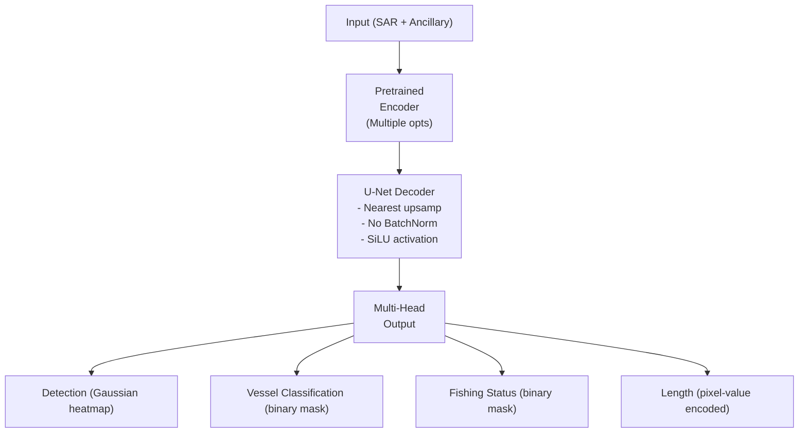

# xView3 Hạng 2: Giải pháp Selim Sefidov

## Tổng quan

| Thuộc tính | Giá trị |
|-----------|-------|
| **Xếp hạng** | Hạng 2 |
| **Tác giả** | Selim Sefidov (selimsef) |
| **Điểm (Public)** | 0.593 |
| **Điểm (Holdout)** | 0.604 |
| **GitHub** | [DIUx-xView/xView3_second_place](https://github.com/DIUx-xView/xView3_second_place) |
| **Forked From** | selimsef/xview3_solution |

---

## Tổng quan Kiến trúc

### Phương pháp Multi-Task Segmentation

**Insight Chính:**
"Phát hiện đối tượng hàng hải có thể chuyển thành bài toán phân đoạn nhị phân và hồi quy"

**Thay vì bounding box → dự đoán theo pixel:**
- Heatmap phát hiện (mật độ Gaussian)
- Mặt nạ phân loại tàu
- Mặt nạ trạng thái đánh cá
- Bản đồ ước lượng chiều dài

### Kiến trúc U-Net



---

## Tùy chọn Backbone

### Các Encoder Đã kiểm tra

| Encoder | Hiệu suất | Ghi chú |
|---------|-------------|-------|
| **EfficientNet V2 L** | Tốt nhất | Biến thể lớn |
| EfficientNet V2 M | Tốt | Biến thể trung bình |
| EfficientNet B7 | Tốt | EfficientNet chuẩn |
| NFNet L0 | Tốt | Normalizer-free |
| ResNet34 | Baseline | Nhanh, đơn giản |

### Lựa chọn Cuối cùng

EfficientNet V2 L cho hiệu suất single-model tốt nhất.

---

## Thiết kế Decoder

### Lựa chọn Thiết kế Cụ thể

```python
class UNetDecoder:
    def __init__(self):
        # Decoder U-Net chuẩn với sửa đổi cụ thể
        self.upsample = nn.Upsample(mode='nearest')  # Không phải bilinear
        self.activation = nn.SiLU()  # Không phải ReLU
        # Không có BatchNorm trong decoder
```

**Lý do Thiết kế:**
- **Nearest upsampling:** Tránh hiện tượng checkerboard
- **SiLU activation:** Mượt hơn ReLU
- **Không BatchNorm:** Ổn định decoder cho nhiệm vụ hồi quy

---

## Đầu ra Multi-Task

### Detection Head

**Đầu ra:** Bản đồ mật độ Gaussian (σ=2 pixels, phạm vi 0-255)

```python
# Tạo target phát hiện
for obj in objects:
    gaussian = create_gaussian(center=obj.center, sigma=2)
    heatmap = np.maximum(heatmap, gaussian * 255)
```

### Vessel Classification Head

**Đầu ra:** Mặt nạ tròn nhị phân (bán kính 4-pixel)

```python
# Tạo target phân loại vessel
for obj in objects:
    if obj.is_vessel:
        mask = create_circle(center=obj.center, radius=4)
        vessel_mask = np.maximum(vessel_mask, mask)
```

### Fishing Status Head

**Đầu ra:** Mặt nạ tròn nhị phân (bán kính 4-pixel)

```python
# Tạo target fishing
for obj in objects:
    if obj.is_fishing:
        mask = create_circle(center=obj.center, radius=4)
        fishing_mask = np.maximum(fishing_mask, mask)
```

### Length Estimation Head

**Đầu ra:** Chiều dài được mã hóa giá trị pixel

```python
# Mã hóa chiều dài trong giá trị pixel
for obj in objects:
    circle = create_circle(center=obj.center, radius=4)
    length_map[circle] = obj.length_meters
```

---

## Chiến lược Huấn luyện

### Vấn đề Chất lượng Dữ liệu

**Khám phá Chính:** Chú thích huấn luyện có chất lượng không đủ.

**Giải pháp:** Huấn luyện độc quyền trên dữ liệu validation:
```python
# Sử dụng validation split cho huấn luyện
# Chú thích huấn luyện quá nhiễu
train_data = xview3_validation_scenes
val_data = train_test_split(train_data, test_size=0.1)
```

### Tăng cường Dữ liệu

Tăng cường tối thiểu do đặc điểm SAR:

```python
augmentations = [
    RandomCrop(size=3584),
    RandomRotation180(),
    # KHÔNG tăng cường màu sắc (cường độ SAR có ý nghĩa)
    # KHÔNG biến đổi không gian mạnh
]
```

---

## Hàm Loss

### Detection Loss: Thresholded MSE

```python
def thresholded_mse(pred, target, threshold=0.5):
    # Reduction tổng vượt trội mean
    diff = (pred - target) ** 2
    # Áp dụng ngưỡng nếu cần
    loss = torch.sum(diff)
    return loss
```

**Phát hiện:** Thresholded MSE với sum reduction vượt trội MSE và MAE thuần.

### Length Estimation Loss

```python
def length_loss(pred, target):
    # Phản ánh trực tiếp chỉ số đánh giá
    error = torch.abs(target - pred) / target
    return error.mean()
```

---

## Tối ưu hóa Bộ nhớ

### Thách thức: File GeoTIFF Lớn

Các cảnh xView3 trung bình 29,400 × 24,400 pixel.

### Giải pháp: Memory Mapping

```python
import tifffile

# Thay vì load toàn bộ file
# image = tifffile.imread(path)  # TỆ - load tất cả vào RAM

# Sử dụng memory mapping
image = tifffile.memmap(path)  # TỐT - lazy loading
```

**Lợi ích:**
- Tránh độ phức tạp chia tile
- Cho phép kích thước crop lớn hơn
- Giảm overhead I/O

---

## Cấu hình Inference

### Chiến lược Tiling

| Tham số | Giá trị |
|-----------|-------|
| **Kích thước Tile** | 3584 × 3584 |
| **Overlap** | 704 pixel |
| **Stride** | 2880 pixel |

### Post-Processing

1. **Peak Detection:** Tìm cực đại cục bộ trong heatmap
2. **Threshold:** Giữ phát hiện trên ngưỡng tin cậy
3. **NMS:** Loại bỏ trùng lặp trong vùng chồng lấp

---

## Yêu cầu Phần cứng

| Thành phần | Thông số kỹ thuật |
|-----------|---------------|
| **GPUs** | 4× RTX A6000 |
| **VRAM** | 48GB mỗi GPU |
| **Thời gian Huấn luyện** | 9-15 giờ mỗi mô hình |
| **RAM** | 128GB+ khuyến nghị |

---

## Kết quả

### Hiệu suất

| Chỉ số | Điểm |
|--------|-------|
| **Public Test** | 0.593 |
| **Holdout Test** | 0.604 |
| **Rank** | Hạng 2 |

### So sánh với Hạng 1

| Khía cạnh | Hạng 2 | Hạng 1 |
|--------|-----------|-----------|
| **Kiến trúc** | U-Net | CircleNet |
| **Output Stride** | Chuẩn | Stride-2 |
| **Kích thước Ensemble** | Nhỏ hơn | 12 mô hình |
| **Điểm Holdout** | 0.604 | 0.617 |

---

## Bài học Chính

### Điều Hiệu quả

1. **Phương pháp Segmentation:** Chuyển phát hiện thành phân đoạn
2. **Multi-Head Output:** Head riêng biệt cho mỗi nhiệm vụ
3. **Validation-Only Training:** Tránh nhãn huấn luyện nhiễu
4. **Memory Mapping:** Cho phép crop lớn hơn
5. **Thresholded MSE:** Tốt hơn các lựa chọn khác

### Điều Không hiệu quả

1. **Dữ liệu Huấn luyện:** Quá nhiễu để huấn luyện đáng tin cậy
2. **Tăng cường Mạnh:** Làm hại các mẫu đặc thù SAR
3. **Mean Reduction:** Sum reduction tốt hơn cho mục tiêu thưa

---

## Dependencies

```
pytorch >= 1.9
tifffile
gdal
albumentations
segmentation-models-pytorch
```

---

## Cấu trúc Code

```
xview3_solution/
├── configs/
│   └── efficientnetv2l.yaml
├── models/
│   ├── unet.py
│   └── heads.py
├── data/
│   ├── dataset.py
│   └── transforms.py
├── losses/
│   └── detection_loss.py
├── train.py
└── inference.py
```

---

## Tài nguyên

- **GitHub:** [DIUx-xView/xView3_second_place](https://github.com/DIUx-xView/xView3_second_place)
- **Original:** [selimsef/xview3_solution](https://github.com/selimsef/xview3_solution)
- **Challenge:** [iuu.xview.us](https://iuu.xview.us)

---

*Tài liệu tạo: 2024-12-18*
