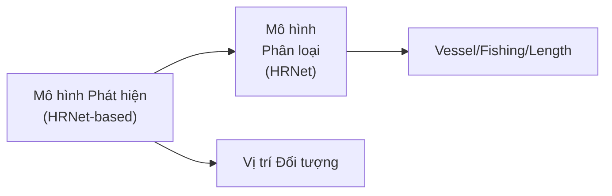
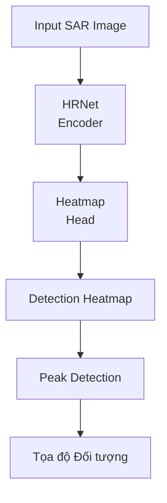
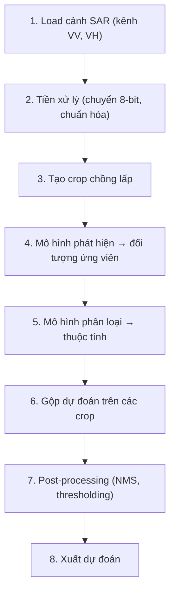

# xView3 Hạng 3: Giải pháp Tumenn

## Tổng quan

| Thuộc tính | Giá trị |
|-----------|-------|
| **Xếp hạng** | Hạng 3 |
| **Tác giả** | Tumenn |
| **GitHub** | [DIUx-xView/xView3_third_place](https://github.com/DIUx-xView/xView3_third_place) |
| **Original** | [Tumenn/xView3_3rd_place_solution](https://github.com/Tumenn/xView3_3rd_place_solution) |
| **Framework** | PyTorch 1.9.0 |
| **GPU** | RTX 3090 |

---

## Tổng quan Kiến trúc

### Phương pháp Dual-Model



### Backbone HRNet

**High-Resolution Network (HRNet):**
- Duy trì biểu diễn độ phân giải cao
- Xử lý song song đa tỷ lệ
- Mạnh cho nhiệm vụ dự đoán dày đặc

---

## Pipeline Tiền xử lý

### Chuyển đổi Ảnh

```python
# Chuyển sang định dạng 8-bit để xử lý
def convert_to_8bit(sar_image):
    # Chuẩn hóa giá trị backscatter SAR
    normalized = normalize_sar(sar_image)
    # Scale sang phạm vi 8-bit
    image_8bit = (normalized * 255).astype(np.uint8)
    return image_8bit
```

### Tạo Crop

```python
# Tạo dataset crop
def generate_crops(scene, crop_size=1024, overlap=256):
    crops = []
    for y in range(0, scene.height, crop_size - overlap):
        for x in range(0, scene.width, crop_size - overlap):
            crop = scene[y:y+crop_size, x:x+crop_size]
            crops.append(crop)
    return crops
```

---

## Mô hình Phát hiện

### Phát hiện Dựa trên Heatmap

**Phương pháp Chính:** Tạo heatmap Gaussian cho tâm đối tượng.



### Tham chiếu Docker Image

Giải pháp sử dụng: `sanxia04/heatmap:v4.1`

Gợi ý triển khai phát hiện heatmap chuyên biệt.

---

## Mô hình Phân loại

### Phân loại Vessel và Fishing

Cho mỗi đối tượng được phát hiện:
1. Trích xuất patch xung quanh phát hiện
2. Đưa vào mô hình phân loại
3. Dự đoán trạng thái vessel
4. Dự đoán trạng thái fishing
5. Ước lượng chiều dài vessel

---

## Thiết lập Huấn luyện

### Môi trường

| Thành phần | Thông số kỹ thuật |
|-----------|---------------|
| **Python** | 3.6 |
| **PyTorch** | 1.9.0 |
| **GDAL** | 3.0.2 |
| **GPU** | RTX 3090 |

### Hỗ trợ Multi-GPU

```python
# Khả năng huấn luyện song song
model = nn.DataParallel(model)
# hoặc
model = nn.parallel.DistributedDataParallel(model)
```

---

## K-Fold Validation

### Chia Dữ liệu

```python
def create_folds(scenes, n_folds=5):
    kfold = KFold(n_splits=n_folds, shuffle=True, random_state=42)
    for fold, (train_idx, val_idx) in enumerate(kfold.split(scenes)):
        train_scenes = scenes[train_idx]
        val_scenes = scenes[val_idx]
        yield train_scenes, val_scenes
```

### Chiến lược Cross-Validation

- Cross-validation 5-fold
- Phân tầng theo đặc điểm cảnh
- Ensemble trên các fold

---

## Đổi mới Kỹ thuật

### 1. Transfer Learning HRNet Pretrained

Tận dụng HRNet pretrained trên ImageNet:
- Trích xuất đặc trưng mạnh
- Khái quát hóa tốt hơn
- Hội tụ nhanh hơn

### 2. Dual-Task Learning

Mô hình riêng biệt cho:
- Phát hiện (localization)
- Phân loại (thuộc tính)

**Lý do:** Các nhiệm vụ khác nhau có thể hưởng lợi từ kiến trúc/huấn luyện khác nhau.

### 3. Tài liệu Toàn diện

Giải pháp bao gồm bài báo phương pháp chi tiết (PDF writeup).

---

## Docker Containerization

### Khả năng Tái tạo

```dockerfile
FROM pytorch/pytorch:1.9.0-cuda11.1-cudnn8-runtime

# Cài đặt dependencies
RUN pip install gdal tifffile albumentations

# Copy giải pháp
COPY . /app
WORKDIR /app

# Chạy inference
CMD ["python", "inference.py"]
```

### Docker Hub

Image build sẵn: `sanxia04/heatmap:v4.1`

---

## Pipeline Inference

### Quy trình Từng bước



---

## Kết quả

### Hiệu suất Cuộc thi

| Chỉ số | Giá trị |
|--------|-------|
| **Xếp hạng Cuối** | Hạng 3 |
| **Quy mô Cuộc thi** | 1,900 người đăng ký, 67 quốc gia |

---

## Dependencies

```
pytorch==1.9.0
gdal==3.0.2
tifffile
albumentations
opencv-python
numpy
pandas
```

### Cài đặt

```bash
pip install -r requirements.txt
# Cho GDAL
conda install -c conda-forge gdal=3.0.2
```

---

## Bài học Chính

### Tóm tắt Phương pháp

1. **Pipeline Hai giai đoạn:** Phát hiện rồi phân loại
2. **Backbone HRNet:** Mạnh cho dự đoán dày đặc
3. **Phát hiện Heatmap:** Localization đối tượng dựa Gaussian
4. **K-Fold CV:** Lựa chọn mô hình robust

### Điểm mạnh

- Thiết kế modular rõ ràng
- Phương pháp được tài liệu hóa tốt
- Khả năng tái tạo Docker
- Triển khai PyTorch chuẩn

---

## Tài nguyên

- **GitHub (DIUx):** [DIUx-xView/xView3_third_place](https://github.com/DIUx-xView/xView3_third_place)
- **GitHub (Original):** [Tumenn/xView3_3rd_place_solution](https://github.com/Tumenn/xView3_3rd_place_solution)
- **Challenge:** [iuu.xview.us](https://iuu.xview.us)
- **HRNet Paper:** [Deep High-Resolution Representation Learning](https://arxiv.org/abs/1908.07919)

---

*Tài liệu tạo: 2024-12-18*
