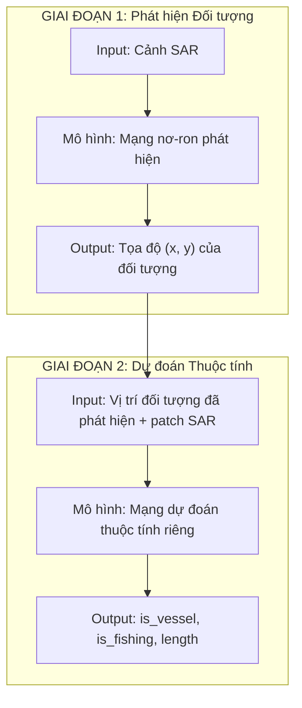
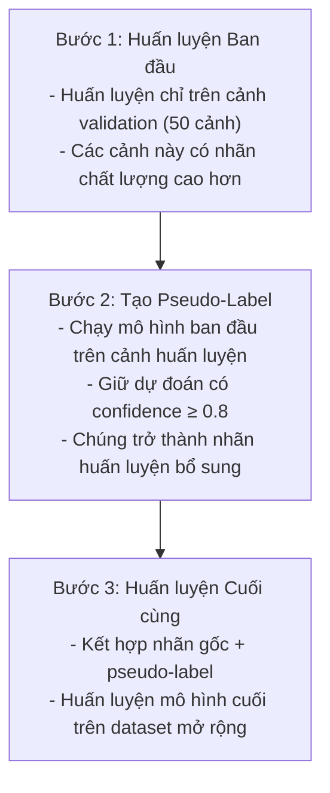
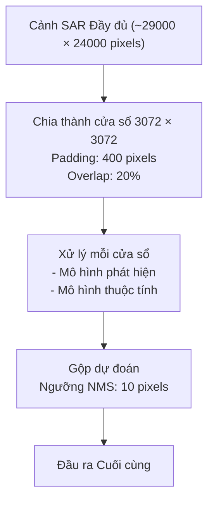
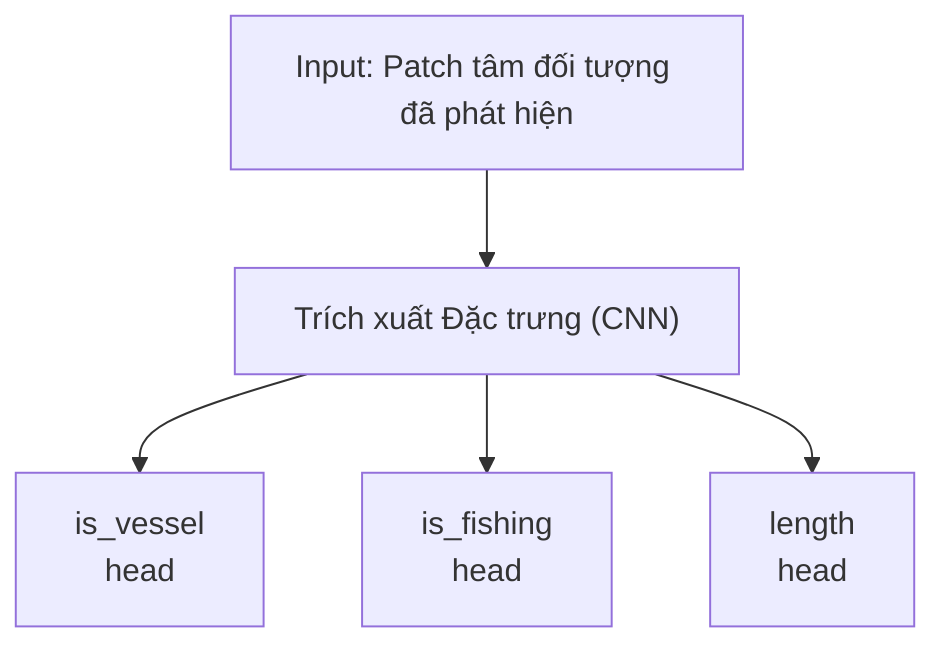

# xView3 Hạng 4: AI2 Skylight (Allen Institute for AI)

## Tổng quan

| Thuộc tính | Giá trị |
|-----------|-------|
| **Xếp hạng** | Hạng 4 |
| **Đội** | AI2 Skylight |
| **Tổ chức** | Allen Institute for AI |
| **Giải Đặc biệt** | $50,000 (Người chiến thắng có đủ điều kiện đứng đầu tại Mỹ) |
| **GitHub** | [DIUx-xView/xView3_fourth_place](https://github.com/DIUx-xView/xView3_fourth_place) |
| **Also At** | [allenai/sar_vessel_detect](https://github.com/allenai/sar_vessel_detect) |

---

## Bối cảnh Tổ chức

### Allen Institute for AI (AI2)

- **Thành lập:** 2014 bởi Paul Allen
- **Trọng tâm:** Nghiên cứu AI tác động cao vì lợi ích chung
- **Dự án Nổi bật:** Semantic Scholar, AllenNLP, AI2 Thor

### Đội Skylight

Dự án Skylight của AI2 tập trung vào:
- Nhận thức lĩnh vực hàng hải
- Phát hiện đánh cá bất hợp pháp
- Công nghệ bảo tồn
- Đối tác chính phủ

---

## Tổng quan Kiến trúc

### Phương pháp Hai giai đoạn



---

## Đổi mới Chính: Chiến lược Self-Training

### Vấn đề: Nhãn Huấn luyện Không đầy đủ

Dữ liệu huấn luyện xView3 có nhãn không đầy đủ:
- Hầu hết nhãn từ vệt AIS
- Nhiều tàu không có AIS ("tàu tối")
- Dữ liệu chuẩn thưa thớt

### Giải pháp: Self-Training Lặp



### Ngưỡng Confidence

```python
CONFIDENCE_THRESHOLD = 0.8

def generate_pseudo_labels(model, training_scenes):
    pseudo_labels = []
    for scene in training_scenes:
        predictions = model(scene)
        high_conf = predictions[predictions.confidence >= CONFIDENCE_THRESHOLD]
        pseudo_labels.extend(high_conf)
    return pseudo_labels
```

---

## Pipeline Inference

### Xử lý Multi-Window



### Tham số Xử lý

| Tham số | Giá trị |
|-----------|-------|
| **Kích thước Window** | 3072 × 3072 |
| **Padding** | 400 pixel |
| **Overlap** | 20% |
| **Ngưỡng NMS** | 10 pixel |

---

## Test-Time Augmentation

### Chiến lược TTA

```python
def predict_with_tta(model, image):
    # Dự đoán gốc
    pred_original = model(image)

    # Lật ngang
    pred_hflip = model(horizontal_flip(image))
    pred_hflip = reverse_horizontal_flip(pred_hflip)

    # Lật dọc
    pred_vflip = model(vertical_flip(image))
    pred_vflip = reverse_vertical_flip(pred_vflip)

    # Ensemble
    final_pred = average([pred_original, pred_hflip, pred_vflip])
    return final_pred
```

### Hiệu suất TTA

| Phương pháp | Cải thiện |
|--------|-------------|
| Không TTA | Baseline |
| + H/V Flips | +0.5% |

---

## Mô hình Thuộc tính Riêng biệt

### Mạng Nơ-ron Chuyên biệt

Thay vì multi-task learning, AI2 Skylight sử dụng mô hình riêng cho thuộc tính:



### Tại sao Mô hình Riêng?

1. **Linh hoạt:** Có thể tối ưu độc lập
2. **Chuyên biệt hóa:** Đặc trưng khác nhau cho nhiệm vụ khác nhau
3. **Debug:** Dễ xác định vấn đề hơn

---

## Chi tiết Triển khai

### Pipeline Dựa trên Cấu hình

```yaml
# Cấu trúc cấu hình ví dụ
preprocessing:
  window_size: 3072
  padding: 400
  overlap: 0.2

detection:
  model: "detection_model"
  threshold: 0.5

attributes:
  model: "attribute_model"

postprocessing:
  nms_threshold: 10
```

### Pipeline Python

```python
# Pipeline inference
def run_inference(scene_path, config):
    # 1. Load và tiền xử lý
    scene = load_scene(scene_path)
    windows = generate_windows(scene, config.preprocessing)

    # 2. Phát hiện
    detections = []
    for window in windows:
        det = detection_model(window)
        detections.extend(det)

    # 3. NMS
    detections = nms(detections, threshold=config.postprocessing.nms_threshold)

    # 4. Dự đoán thuộc tính
    for det in detections:
        patch = extract_patch(scene, det.center)
        det.attributes = attribute_model(patch)

    return detections
```

---

## Kết quả

### Hiệu suất Cuộc thi

| Chỉ số | Giá trị |
|--------|-------|
| **Xếp hạng Cuối** | Hạng 4 |
| **Giải Đặc biệt** | $50,000 (Đứng đầu tại Mỹ) |

### Ý nghĩa

Là người về đích cao nhất tại Mỹ đủ điều kiện nhận giải, AI2 Skylight nhận thêm $50,000 từ DIU, ghi nhận tầm quan trọng của năng lực trong nước cho nhận thức lĩnh vực hàng hải.

---

## Tác động Vận hành

### Nền tảng Skylight

Giải pháp xView3 cung cấp cho nền tảng Skylight của AI2:
- Giám sát hàng hải thời gian thực
- Truy cập đối tác chính phủ
- Ứng dụng bảo tồn
- Phát hiện đánh cá IUU

### Triển khai Thực tế

Các mô hình được sử dụng bởi:
- Cảnh sát biển
- Các cơ quan thực thi nghề cá
- Tổ chức bảo tồn

---

## Cấu trúc Code

```
xView3_fourth_place/
├── configs/
│   ├── detection.yaml
│   └── attributes.yaml
├── models/
│   ├── detection_model.py
│   └── attribute_model.py
├── preprocessing/
│   └── sar_processing.py
├── inference/
│   ├── detect.py
│   └── classify.py
├── train.py
├── predict.py
└── whitepaper.pdf  # Phương pháp chi tiết
```

---

## Whitepaper

### Tài liệu Có sẵn

Repository bao gồm `whitepaper.pdf` với:
- Giải thích phương pháp chi tiết
- Sơ đồ kiến trúc
- Quy trình huấn luyện
- Phân tích kết quả

---

## Dependencies

```
pytorch >= 1.8
torchvision
gdal
tifffile
numpy
pandas
scikit-learn
```

---

## Bài học Chính

### Điều Hiệu quả

1. **Self-Training:** Tận dụng dự đoán có độ tin cậy cao làm pseudo-label
2. **Validation-First:** Bắt đầu với dữ liệu validation sạch hơn
3. **Pipeline Hai giai đoạn:** Tách phát hiện và phân loại
4. **TTA:** Cải thiện đơn giản nhưng hiệu quả
5. **Multi-Window:** Xử lý toàn cảnh

### Cân nhắc Thực tế

- Tập trung vào triển khai vận hành
- Cân bằng độ chính xác vs. tốc độ inference
- Xử lý dữ liệu huấn luyện không đầy đủ một cách nhẹ nhàng

---

## Tài nguyên

- **GitHub (DIUx):** [DIUx-xView/xView3_fourth_place](https://github.com/DIUx-xView/xView3_fourth_place)
- **GitHub (AI2):** [allenai/sar_vessel_detect](https://github.com/allenai/sar_vessel_detect)
- **Skylight Platform:** [skylight.global](https://www.skylight.global/)
- **Allen Institute for AI:** [allenai.org](https://allenai.org/)
- **Challenge:** [iuu.xview.us](https://iuu.xview.us)

---

*Tài liệu tạo: 2024-12-18*
