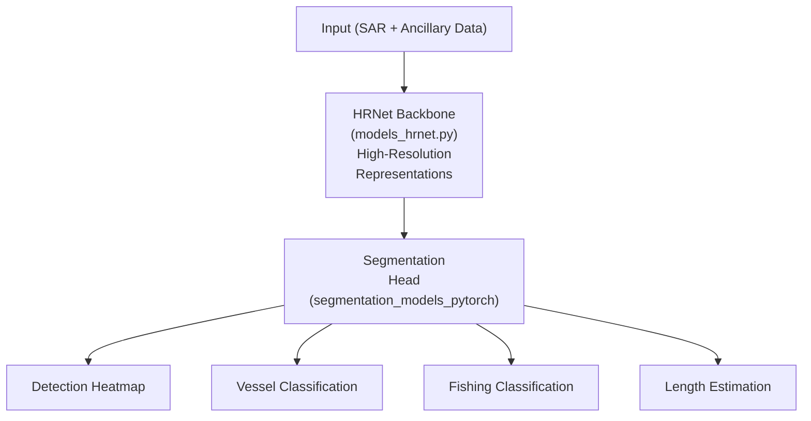

# xView3 Hạng 5: Giải pháp Kohei (smly)

## Tổng quan

| Thuộc tính | Giá trị |
|-----------|-------|
| **Xếp hạng** | Hạng 5 |
| **Tác giả** | Kohei (smly) |
| **GitHub** | [DIUx-xView/xView3_fifth_place](https://github.com/DIUx-xView/xView3_fifth_place) |
| **Docker Image** | smly/kohei-xview3:latest |
| **Phần cứng** | 2× RTX 3080 GPU |
| **Framework** | PyTorch 1.10.0 + CUDA 11.3 |

---

## Tổng quan Kiến trúc

### Phương pháp Dựa trên HRNet



---

## Các Phiên bản Mô hình

### Phát triển Lặp

Repository cho thấy nhiều phiên bản mô hình:
- `v13/` - Phiên bản sớm
- `v16/` - Phiên bản trung gian
- `v77/` - Phiên bản nâng cao

Điều này gợi ý thử nghiệm và tinh chỉnh sâu rộng.

### Lựa chọn Mô hình

Bài nộp cuối cùng có thể là ensemble các phiên bản hoạt động tốt nhất.

---

## Triển khai Kỹ thuật

### Thư viện Chính

| Thư viện | Mục đích |
|---------|---------|
| **PyTorch** | Framework deep learning |
| **segmentation_models_pytorch** | Kiến trúc phân đoạn |
| **albumentations** | Tăng cường dữ liệu |
| **tifffile** | Xử lý GeoTIFF |
| **GDAL** | Xử lý không gian địa lý |

### Triển khai HRNet

```python
# Từ models_hrnet.py
class HRNetSegmentation(nn.Module):
    def __init__(self, config):
        super().__init__()
        self.backbone = HRNet(config.hrnet)
        self.head = SegmentationHead(
            in_channels=config.hrnet.channels,
            out_channels=config.num_classes
        )

    def forward(self, x):
        features = self.backbone(x)
        output = self.head(features)
        return output
```

---

## Tăng cường Dữ liệu

### Pipeline Albumentations

```python
import albumentations as A

train_transform = A.Compose([
    A.RandomCrop(height=1024, width=1024),
    A.HorizontalFlip(p=0.5),
    A.VerticalFlip(p=0.5),
    A.RandomRotate90(p=0.5),
    # Lưu ý: Cẩn thận với tăng cường cường độ cho SAR
])
```

---

## Thiết kế Tiết kiệm Lưu trữ

### Xử lý Lưu trữ Nén

**Đổi mới Chính:** Xử lý trực tiếp từ lưu trữ nén.

```python
import tarfile

def load_scene_from_archive(archive_path, scene_id):
    with tarfile.open(archive_path, 'r:gz') as tar:
        # Trích xuất file cảnh cụ thể
        vh_file = tar.extractfile(f'{scene_id}_vh.tif')
        vv_file = tar.extractfile(f'{scene_id}_vv.tif')
        # Xử lý không cần trích xuất đầy đủ
        return load_tiff_from_buffer(vh_file), load_tiff_from_buffer(vv_file)
```

**Lợi ích:**
- Giảm yêu cầu dung lượng đĩa
- I/O nhanh hơn cho xử lý tuần tự
- Duy trì tổ chức dữ liệu

---

## Tích hợp Dữ liệu Ngoài

### Dữ liệu Bờ biển GSHHG

Giải pháp tích hợp dữ liệu Global Self-consistent Hierarchical High-resolution Geography (GSHHG):
- Ranh giới bờ biển
- Đặc trưng khoảng cách đến bờ
- Bối cảnh ven biển

```python
def compute_distance_to_shore(lat, lon, gshhg_data):
    # Tính khoảng cách đến bờ biển gần nhất
    nearest_shore = find_nearest_shoreline(lat, lon, gshhg_data)
    distance = haversine_distance(lat, lon, nearest_shore)
    return distance
```

---

## Cấu hình Phần cứng

### Thiết lập RTX 3080 Kép

| Thông số kỹ thuật | Giá trị |
|---------------|-------|
| **GPUs** | 2× RTX 3080 |
| **VRAM mỗi GPU** | 10 GB |
| **CUDA** | 11.3 |
| **Framework** | PyTorch 1.10.0 |

### Huấn luyện Multi-GPU

```python
# Thiết lập huấn luyện phân tán
model = torch.nn.parallel.DataParallel(model, device_ids=[0, 1])
```

---

## Script Huấn luyện

### train.sh

```bash
#!/bin/bash
# Script huấn luyện

export CUDA_VISIBLE_DEVICES=0,1

python train.py \
    --config configs/hrnet_v77.yaml \
    --batch_size 4 \
    --epochs 100 \
    --lr 0.001 \
    --output_dir ./checkpoints/
```

---

## Docker Containerization

### Khả năng Tái tạo

```dockerfile
FROM pytorch/pytorch:1.10.0-cuda11.3-cudnn8-runtime

# Cài đặt dependencies
RUN pip install segmentation-models-pytorch \
    albumentations tifffile gdal

# Copy giải pháp
COPY . /workspace
WORKDIR /workspace

# Lệnh inference
CMD ["python", "inference.py"]
```

### Image Build sẵn

Có sẵn trên Docker Hub: `smly/kohei-xview3:latest`

---

## Weight Được tính toán Trước

### Phân phối Weight

Weight mô hình có sẵn qua:
- Docker Hub (nhúng trong image)
- Google Drive (tải xuống riêng)

### Cấu trúc Weight

```
weights/
├── v13/
│   └── best_model.pth
├── v16/
│   └── best_model.pth
└── v77/
    └── best_model.pth
```

---

## Pipeline Inference

### Từng bước

```python
def run_inference(scene_path):
    # 1. Load cảnh
    vh, vv, ancillary = load_scene(scene_path)

    # 2. Thêm bối cảnh bờ biển
    distance_to_shore = compute_distance_to_shore(scene)

    # 3. Tiền xử lý
    input_tensor = preprocess(vh, vv, ancillary, distance_to_shore)

    # 4. Dự đoán mô hình
    predictions = model(input_tensor)

    # 5. Post-process
    detections = extract_detections(predictions)

    return detections
```

---

## Kết quả

### Hiệu suất Cuộc thi

| Chỉ số | Giá trị |
|--------|-------|
| **Xếp hạng Cuối** | Hạng 5 |
| **Quy mô Cuộc thi** | 1,900 người đăng ký |

---

## Lựa chọn Kỹ thuật Chính

### 1. Kiến trúc HRNet

**Ưu điểm cho SAR:**
- Duy trì độ phân giải cao suốt quá trình
- Mạnh cho phát hiện đối tượng nhỏ
- Fusion đặc trưng đa tỷ lệ

### 2. Dữ liệu Địa lý Ngoài

Sử dụng dữ liệu bờ biển GSHHG cung cấp:
- Bối cảnh về vị trí tàu
- Đặc trưng khoảng cách đến bờ
- Cải thiện phân loại

### 3. Phát triển Lặp

Nhiều phiên bản mô hình (v13, v16, v77) cho thấy:
- Thử nghiệm có hệ thống
- Cải thiện dần dần
- Quy trình phát triển robust

---

## Dependencies

```
pytorch==1.10.0
segmentation-models-pytorch
albumentations
tifffile
gdal
numpy
pandas
```

### Cài đặt

```bash
# Tạo environment
conda create -n xview3 python=3.8
conda activate xview3

# Cài đặt PyTorch với CUDA
pip install torch==1.10.0+cu113 -f https://download.pytorch.org/whl/cu113/torch_stable.html

# Cài đặt dependencies khác
pip install -r requirements.txt
```

---

## Cấu trúc Code

```
xView3_fifth_place/
├── configs/
│   └── hrnet_v77.yaml
├── models/
│   └── models_hrnet.py
├── data/
│   ├── dataset.py
│   └── gshhg_utils.py
├── v13/
├── v16/
├── v77/
├── train.sh
├── train.py
├── inference.py
└── requirements.txt
```

---

## Bài học Chính

### Điều Hiệu quả

1. **Kiến trúc HRNet:** Mạnh cho dự đoán dày đặc, độ phân giải cao
2. **Dữ liệu Ngoài:** Bối cảnh bờ biển GSHHG cải thiện độ chính xác
3. **Phát triển Lặp:** Nhiều phiên bản tinh chỉnh phương pháp
4. **Docker Reproducibility:** Triển khai và chia sẻ dễ dàng
5. **Xử lý Nén:** Xử lý lưu trữ hiệu quả

### Điểm mạnh Kỹ thuật

- Triển khai sạch sẽ sử dụng thư viện đã thiết lập
- Containerization toàn diện
- Thử nghiệm đa phiên bản
- Tập trung kỹ thuật thực tế

---

## Tài nguyên

- **GitHub:** [DIUx-xView/xView3_fifth_place](https://github.com/DIUx-xView/xView3_fifth_place)
- **Docker Hub:** smly/kohei-xview3:latest
- **GSHHG Data:** [ngdc.noaa.gov](https://www.ngdc.noaa.gov/mgg/shorelines/gshhs.html)
- **Challenge:** [iuu.xview.us](https://iuu.xview.us)

---

*Tài liệu tạo: 2024-12-18*
