# xView1 Hạng 5: Giải Pháp CMU SEI - Dual-CNN Feature Extraction

## Thông Tin Tổng Quan

| Thuộc Tính | Chi Tiết |
|------------|----------|
| **Hạng** | 🏆 Hạng 5 |
| **Nhóm** | Ritwik Gupta, 2nd Lt. Alex Fulton, Kaylene Stocking |
| **Đơn Vị** | Carnegie Mellon University SEI, USAF Institute of Technology, University of Pittsburgh |
| **Thử Thách** | DIUx xView 2018 Detection Challenge |
| **Blog Kỹ Thuật** | [CMU SEI Insights](https://insights.sei.cmu.edu/blog/deep-learning-and-satellite-imagery-diux-xview-challenge/) |
| **Tiền Thưởng** | $15,000 USD |
| **Tổng Bài Nộp** | 2,300+ bài từ toàn cầu |

---

## 1. Tổng Quan và Bối Cảnh

### 1.1 Carnegie Mellon Software Engineering Institute (SEI)

CMU SEI là một **Federally Funded Research and Development Center (FFRDC)** được thành lập năm 1984, chuyên về:

```mermaid
graph TB
    subgraph SEI["CMU Software Engineering Institute"]
        SE[Software Engineering<br/>Best Practices]
        CY[Cybersecurity<br/>Research]
        AI[AI/ML<br/>Applications]
        DEF[Defense<br/>Technology]
    end

    subgraph Impact["Tác Động"]
        I1[CERT Division<br/>Security Response]
        I2[Software Capability<br/>Maturity Model]
        I3[Defense AI/ML<br/>Applications]
        I4[Academic Research<br/>Publications]
    end

    SEI --> Impact
```



**SEI trong Phân Tích Ảnh Vệ Tinh:**
- **Defense applications:** Hỗ trợ DoD trong phân tích imagery intelligence
- **AI research:** Nghiên cứu ứng dụng ML cho satellite imagery
- **Collaboration:** Kết hợp expertise từ nhiều đơn vị

### 1.2 Thành Viên Nhóm

**Ritwik Gupta (SEI / Entertainment Technology Center)**
- Sau này trở thành co-author chính của **xView2/xBD dataset**
- Chuyên về ML cho satellite imagery
- Đóng góp quan trọng cho cộng đồng nghiên cứu remote sensing

**2nd Lt. Alex Fulton (USAF Institute of Technology / CMU)**
- Góc nhìn quân sự về phân tích satellite imagery
- Kết nối giữa nghiên cứu học thuật và ứng dụng quốc phòng

**Kaylene Stocking (University of Pittsburgh)**
- Nghiên cứu machine learning
- Ứng dụng computer vision

### 1.3 Tầm Quan Trọng của Giải Pháp

Giải pháp CMU SEI đáng chú ý vì:
1. **Documented publicly:** Blog post chi tiết về phương pháp
2. **Led to xView2:** Kinh nghiệm dẫn đến việc tạo xBD dataset
3. **Multi-framework comparison:** So sánh hệ thống nhiều architectures
4. **Real insights:** Chia sẻ những gì hoạt động và không hoạt động

---

## 2. Đổi Mới Kỹ Thuật Chính

### 2.1 Dual-CNN Feature Extraction Architecture

Đổi mới chính của nhóm CMU SEI là **Dual-CNN architecture** kết hợp:
- **Deep CNN:** Pretrained features từ ImageNet
- **Shallow CNN:** Domain-specific features học từ xView


*Hình 1: Các lớp đối tượng đa dạng yêu cầu kết hợp features từ nhiều nguồn*

```mermaid
flowchart TB
    subgraph Input["Input Image"]
        I[Satellite Tile<br/>512×512 RGB]
    end

    subgraph Deep["Deep CNN Branch"]
        I --> D1[DenseNet/ResNet<br/>Pretrained ImageNet]
        D1 --> D2[High-level Features<br/>2048-d]
    end

    subgraph Shallow["Shallow CNN Branch"]
        I --> S1[Custom Conv Layers<br/>3 blocks]
        S1 --> S2[Domain Features<br/>512-d]
    end

    subgraph Fusion["Feature Fusion"]
        D2 --> F[Concatenation<br/>2560-d]
        S2 --> F
        F --> FC[Fully Connected<br/>1024-d]
    end

    subgraph Detection["Detection Head"]
        FC --> CLS[Classification<br/>60 + 1 classes]
        FC --> REG[Bounding Box<br/>Regression]
    end
```



**Dual-CNN Implementation:**
```python
class DualCNNDetector(nn.Module):
    """
    Dual-CNN architecture từ CMU SEI solution.
    Kết hợp deep pretrained features với shallow domain-specific features.
    """
    def __init__(self, num_classes=60, deep_backbone='densenet169'):
        super().__init__()

        # Deep branch: pretrained on ImageNet
        if deep_backbone == 'densenet169':
            self.deep_backbone = models.densenet169(pretrained=True)
            self.deep_features = self.deep_backbone.features
            self.deep_dim = 1664
        elif deep_backbone == 'resnet101':
            backbone = models.resnet101(pretrained=True)
            self.deep_backbone = nn.Sequential(*list(backbone.children())[:-2])
            self.deep_dim = 2048

        # Shallow branch: domain-specific
        self.shallow_backbone = nn.Sequential(
            # Block 1
            nn.Conv2d(3, 64, 7, stride=2, padding=3),
            nn.BatchNorm2d(64),
            nn.ReLU(inplace=True),
            nn.MaxPool2d(3, stride=2, padding=1),

            # Block 2
            nn.Conv2d(64, 128, 3, padding=1),
            nn.BatchNorm2d(128),
            nn.ReLU(inplace=True),
            nn.Conv2d(128, 256, 3, padding=1),
            nn.BatchNorm2d(256),
            nn.ReLU(inplace=True),
            nn.MaxPool2d(2, stride=2),

            # Block 3
            nn.Conv2d(256, 512, 3, padding=1),
            nn.BatchNorm2d(512),
            nn.ReLU(inplace=True),
            nn.AdaptiveAvgPool2d((7, 7))
        )
        self.shallow_dim = 512

        # Feature fusion
        combined_dim = self.deep_dim + self.shallow_dim
        self.fusion = nn.Sequential(
            nn.Linear(combined_dim * 49, 1024),  # 7×7 = 49
            nn.ReLU(inplace=True),
            nn.Dropout(0.5),
            nn.Linear(1024, 512),
            nn.ReLU(inplace=True),
        )

        # Detection heads
        self.classifier = nn.Linear(512, num_classes + 1)  # +1 for background
        self.regressor = nn.Linear(512, 4)  # x, y, w, h

    def forward(self, x):
        batch_size = x.size(0)

        # Deep features
        deep_feat = self.deep_features(x)  # [B, 1664, 7, 7]
        deep_feat = deep_feat.view(batch_size, -1)  # [B, 1664*49]

        # Shallow features
        shallow_feat = self.shallow_backbone(x)  # [B, 512, 7, 7]
        shallow_feat = shallow_feat.view(batch_size, -1)  # [B, 512*49]

        # Combine features
        combined = torch.cat([deep_feat, shallow_feat], dim=1)
        fused = self.fusion(combined)

        # Detection outputs
        class_scores = self.classifier(fused)
        box_deltas = self.regressor(fused)

        return class_scores, box_deltas
```

### 2.2 Multi-Framework Experimental Comparison

Nhóm SEI thực hiện đánh giá có hệ thống nhiều framework:


**Framework Comparison Results (from blog):**
| Framework | mAP | Speed | Notes |
|-----------|-----|-------|-------|
| RetinaNet | Good | Medium | Focal loss helps |
| Faster R-CNN | Good | Slow | Strong baseline |
| YOLOv3 | Good | Fast | Large anchors help |
| SSD Variant | **Best** | Fast | Final submission |
| Dual-CNN | Good | Medium | Good features |

### 2.3 YOLOv3 Insights

Nhóm phát hiện rằng **số lượng anchor boxes lớn** cải thiện đáng kể hiệu suất YOLOv3:

```python
# Original YOLOv3 anchors (9 anchors)
ORIGINAL_ANCHORS = [
    (10, 13), (16, 30), (33, 23),      # small
    (30, 61), (62, 45), (59, 119),     # medium
    (116, 90), (156, 198), (373, 326)  # large
]

# CMU SEI modified anchors (nhiều hơn cho satellite)
XVIEW_ANCHORS = {
    'small': [
        (8, 8), (12, 12), (16, 16),
        (8, 16), (16, 8), (12, 24), (24, 12)
    ],
    'medium': [
        (24, 24), (32, 32), (48, 48),
        (24, 48), (48, 24), (32, 64), (64, 32)
    ],
    'large': [
        (64, 64), (96, 96), (128, 128),
        (64, 128), (128, 64), (96, 192), (192, 96)
    ]
}

class xViewYOLOv3Config:
    """
    Custom YOLOv3 config cho xView dataset.
    """
    def __init__(self):
        # Increase number of anchors per scale
        self.num_anchors = 21  # vs 9 in original

        # Anchor generation from xView statistics
        self.anchors = self._generate_anchors_from_data()

        # Adjusted detection scales
        self.scales = [32, 16, 8]  # Feature map strides

    def _generate_anchors_from_data(self):
        """
        Generate anchors using k-means clustering on xView boxes.
        """
        # Load all bounding boxes from training data
        boxes = self._load_training_boxes()

        # Cluster using k-means (k = num_anchors)
        from sklearn.cluster import KMeans
        kmeans = KMeans(n_clusters=self.num_anchors)
        kmeans.fit(boxes)

        anchors = kmeans.cluster_centers_
        return sorted(anchors, key=lambda x: x[0] * x[1])
```

### 2.4 Image Tiling Strategy

Nhóm áp dụng tiling strategy với **overlap handling** cẩn thận:

```python
class SEITilingStrategy:
    """
    Tiling strategy từ CMU SEI solution.
    Xử lý objects ở biên tile boundaries.
    """
    def __init__(self, tile_size=512, overlap=100):
        self.tile_size = tile_size
        self.overlap = overlap
        self.stride = tile_size - overlap

    def tile_image(self, image_path, annotations=None):
        """
        Chia ảnh thành tiles với overlap.
        """
        with rasterio.open(image_path) as src:
            image = src.read()  # (C, H, W)
            transform = src.transform

        c, h, w = image.shape
        tiles = []

        for y in range(0, h - self.tile_size + 1, self.stride):
            for x in range(0, w - self.tile_size + 1, self.stride):
                tile = image[:, y:y+self.tile_size, x:x+self.tile_size]

                tile_info = {
                    'image': tile,
                    'x_offset': x,
                    'y_offset': y,
                    'transform': transform
                }

                # Handle annotations at boundaries
                if annotations:
                    tile_annots = self._clip_annotations(
                        annotations, x, y, self.tile_size
                    )
                    tile_info['annotations'] = tile_annots

                tiles.append(tile_info)

        return tiles

    def _clip_annotations(self, annotations, x_off, y_off, size):
        """
        Clip annotations to tile boundaries.
        Remove boxes that are too small after clipping.
        """
        clipped = []
        for ann in annotations:
            box = ann['bbox']  # [x1, y1, x2, y2]

            # Check if box overlaps with tile
            if box[2] <= x_off or box[0] >= x_off + size:
                continue
            if box[3] <= y_off or box[1] >= y_off + size:
                continue

            # Clip to tile
            new_box = [
                max(box[0] - x_off, 0),
                max(box[1] - y_off, 0),
                min(box[2] - x_off, size),
                min(box[3] - y_off, size)
            ]

            # Check minimum size
            w = new_box[2] - new_box[0]
            h = new_box[3] - new_box[1]
            if w >= 3 and h >= 3:  # Minimum 3 pixels
                clipped.append({
                    'bbox': new_box,
                    'category_id': ann['category_id'],
                    'original_bbox': box
                })

        return clipped

    def merge_predictions(self, tile_predictions, image_shape):
        """
        Merge predictions từ các tiles.
        Handle duplicates ở overlap regions.
        """
        all_predictions = []

        for tile_pred in tile_predictions:
            x_off = tile_pred['x_offset']
            y_off = tile_pred['y_offset']

            for pred in tile_pred['predictions']:
                # Convert to image coordinates
                box = pred['bbox'].copy()
                box[0] += x_off
                box[1] += y_off
                box[2] += x_off
                box[3] += y_off

                all_predictions.append({
                    'bbox': box,
                    'score': pred['score'],
                    'category_id': pred['category_id']
                })

        # Remove duplicates using NMS per class
        final_predictions = self._class_wise_nms(all_predictions)
        return final_predictions

    def _class_wise_nms(self, predictions, iou_threshold=0.5):
        """Apply NMS per class."""
        by_class = defaultdict(list)
        for pred in predictions:
            by_class[pred['category_id']].append(pred)

        final = []
        for class_id, class_preds in by_class.items():
            boxes = torch.tensor([p['bbox'] for p in class_preds])
            scores = torch.tensor([p['score'] for p in class_preds])

            keep = torchvision.ops.nms(boxes, scores, iou_threshold)
            for idx in keep:
                final.append(class_preds[idx])

        return final
```

---

## 3. Kiến Trúc và Triển Khai

### 3.1 Overall Pipeline Architecture

```mermaid
flowchart TB
    subgraph DataPrep["Data Preparation"]
        GEO[GeoTIFF Images]
        GEO --> TILE[Tiling Module<br/>512×512 + overlap]
        TILE --> AUG[Augmentation<br/>Rotate/Flip/Scale]
        AUG --> NORM[Normalization<br/>ImageNet stats]
    end

    subgraph Models["Detection Models"]
        subgraph Ensemble["Model Ensemble"]
            M1[SSD Variant]
            M2[YOLOv3 Custom]
            M3[Dual-CNN]
        end
    end

    subgraph Inference["Inference Pipeline"]
        NORM --> Ensemble
        Ensemble --> MERGE[Prediction Merge]
        MERGE --> NMS[NMS per class]
        NMS --> FILTER[Score Threshold]
    end

    subgraph Output["Output Generation"]
        FILTER --> COORD[Coordinate Transform]
        COORD --> JSON[GeoJSON Export]
    end
```



### 3.2 SSD Variant Architecture

**Final submission sử dụng SSD variant:**

```python
class xViewSSD(nn.Module):
    """
    SSD variant tối ưu cho xView detection.
    """
    def __init__(self, num_classes=60, backbone='vgg16'):
        super().__init__()

        # VGG16 backbone với modifications
        vgg = models.vgg16(pretrained=True)
        self.features = nn.Sequential(*list(vgg.features.children()))

        # Extra feature layers cho multi-scale
        self.extras = nn.ModuleList([
            nn.Sequential(
                nn.Conv2d(512, 1024, 1),
                nn.ReLU(inplace=True),
                nn.Conv2d(1024, 1024, 3, stride=2, padding=1),
                nn.ReLU(inplace=True),
            ),
            nn.Sequential(
                nn.Conv2d(1024, 256, 1),
                nn.ReLU(inplace=True),
                nn.Conv2d(256, 512, 3, stride=2, padding=1),
                nn.ReLU(inplace=True),
            ),
            nn.Sequential(
                nn.Conv2d(512, 128, 1),
                nn.ReLU(inplace=True),
                nn.Conv2d(128, 256, 3),
                nn.ReLU(inplace=True),
            ),
            nn.Sequential(
                nn.Conv2d(256, 128, 1),
                nn.ReLU(inplace=True),
                nn.Conv2d(128, 256, 3),
                nn.ReLU(inplace=True),
            ),
        ])

        # Detection heads for each feature map
        self.num_classes = num_classes + 1  # +1 for background
        self.loc_heads = nn.ModuleList()
        self.cls_heads = nn.ModuleList()

        # Feature map configs: (channels, num_anchors)
        feature_configs = [
            (512, 6),   # From VGG conv4_3
            (1024, 6),  # From VGG conv5_3
            (1024, 6),  # Extra 1
            (512, 6),   # Extra 2
            (256, 4),   # Extra 3
            (256, 4),   # Extra 4
        ]

        for channels, num_anchors in feature_configs:
            self.loc_heads.append(
                nn.Conv2d(channels, num_anchors * 4, 3, padding=1)
            )
            self.cls_heads.append(
                nn.Conv2d(channels, num_anchors * self.num_classes, 3, padding=1)
            )

    def forward(self, x):
        feature_maps = []

        # VGG features
        for i, layer in enumerate(self.features):
            x = layer(x)
            if i == 22:  # conv4_3
                feature_maps.append(x)
            elif i == 29:  # conv5_3
                feature_maps.append(x)

        # Extra layers
        for extra in self.extras:
            x = extra(x)
            feature_maps.append(x)

        # Detection outputs
        locs = []
        confs = []

        for feat, loc_head, cls_head in zip(
            feature_maps, self.loc_heads, self.cls_heads
        ):
            locs.append(loc_head(feat).permute(0, 2, 3, 1).contiguous())
            confs.append(cls_head(feat).permute(0, 2, 3, 1).contiguous())

        locs = torch.cat([l.view(l.size(0), -1) for l in locs], dim=1)
        confs = torch.cat([c.view(c.size(0), -1) for c in confs], dim=1)

        locs = locs.view(locs.size(0), -1, 4)
        confs = confs.view(confs.size(0), -1, self.num_classes)

        return locs, confs
```

### 3.3 Training Pipeline

```python
class SEITrainingPipeline:
    """
    Complete training pipeline từ CMU SEI.
    """
    def __init__(self, config):
        self.config = config
        self.device = torch.device('cuda' if torch.cuda.is_available() else 'cpu')

        # Initialize components
        self.model = self._build_model()
        self.optimizer = self._build_optimizer()
        self.scheduler = self._build_scheduler()
        self.criterion = self._build_criterion()

        # Data loaders
        self.train_loader = self._build_data_loader('train')
        self.val_loader = self._build_data_loader('val')

    def _build_model(self):
        model = xViewSSD(
            num_classes=self.config['num_classes'],
            backbone=self.config['backbone']
        )
        return model.to(self.device)

    def _build_criterion(self):
        return MultiBoxLoss(
            num_classes=self.config['num_classes'] + 1,
            overlap_thresh=0.5,
            neg_pos_ratio=3,
            use_focal=True
        )

    def train_epoch(self, epoch):
        self.model.train()
        total_loss = 0

        pbar = tqdm(self.train_loader, desc=f'Epoch {epoch}')
        for batch_idx, (images, targets) in enumerate(pbar):
            images = images.to(self.device)
            targets = [t.to(self.device) for t in targets]

            self.optimizer.zero_grad()

            # Forward
            locs, confs = self.model(images)

            # Loss
            loss = self.criterion(locs, confs, targets)
            total_loss += loss.item()

            # Backward
            loss.backward()

            # Gradient clipping
            torch.nn.utils.clip_grad_norm_(self.model.parameters(), 10)

            self.optimizer.step()

            pbar.set_postfix({'loss': loss.item()})

        return total_loss / len(self.train_loader)

    def validate(self):
        self.model.eval()
        all_predictions = []
        all_targets = []

        with torch.no_grad():
            for images, targets in self.val_loader:
                images = images.to(self.device)

                locs, confs = self.model(images)
                predictions = self._decode_predictions(locs, confs)

                all_predictions.extend(predictions)
                all_targets.extend(targets)

        # Calculate mAP
        mAP = calculate_mAP(all_predictions, all_targets)
        return mAP
```

### 3.4 Data Augmentation Strategy

```python
class SEIAugmentation:
    """
    Augmentation pipeline từ CMU SEI.
    """
    def __init__(self, training=True):
        self.training = training

        if training:
            self.transform = A.Compose([
                # Geometric
                A.RandomRotate90(p=1.0),
                A.HorizontalFlip(p=0.5),
                A.VerticalFlip(p=0.5),

                # Scale variations (important for multi-scale objects)
                A.RandomScale(scale_limit=0.3, p=0.5),

                # Color augmentation
                A.ColorJitter(
                    brightness=0.2,
                    contrast=0.2,
                    saturation=0.2,
                    hue=0.1,
                    p=0.5
                ),

                # Noise (satellite sensor simulation)
                A.GaussNoise(var_limit=(5, 30), p=0.3),

            ], bbox_params=A.BboxParams(
                format='pascal_voc',
                label_fields=['labels']
            ))
        else:
            self.transform = None

    def __call__(self, image, boxes, labels):
        if self.transform and self.training:
            transformed = self.transform(
                image=image,
                bboxes=boxes,
                labels=labels
            )
            return (
                transformed['image'],
                transformed['bboxes'],
                transformed['labels']
            )
        return image, boxes, labels
```

---

## 4. Huấn Luyện và Tối Ưu

### 4.1 Training Configuration

```python
TRAINING_CONFIG = {
    # Model
    'backbone': 'vgg16',
    'num_classes': 60,

    # Optimizer
    'optimizer': 'SGD',
    'learning_rate': 0.001,
    'momentum': 0.9,
    'weight_decay': 5e-4,

    # Schedule
    'total_epochs': 120,
    'lr_decay_epochs': [80, 100],
    'lr_decay_factor': 0.1,

    # Batch size
    'batch_size': 32,
    'num_workers': 8,

    # Data
    'tile_size': 512,
    'overlap': 100,

    # Loss
    'neg_pos_ratio': 3,  # Hard negative mining
    'overlap_thresh': 0.5,

    # Anchors
    'anchor_scales': [0.1, 0.2, 0.4, 0.6, 0.8],
    'anchor_ratios': [0.5, 1.0, 2.0],
}
```

### 4.2 Loss Function: MultiBox Loss with Focal

```python
class MultiBoxLoss(nn.Module):
    """
    MultiBox loss với optional Focal Loss.
    """
    def __init__(self, num_classes, overlap_thresh=0.5,
                 neg_pos_ratio=3, use_focal=True, focal_gamma=2.0):
        super().__init__()
        self.num_classes = num_classes
        self.overlap_thresh = overlap_thresh
        self.neg_pos_ratio = neg_pos_ratio
        self.use_focal = use_focal
        self.focal_gamma = focal_gamma

    def forward(self, loc_preds, conf_preds, targets):
        batch_size = loc_preds.size(0)
        num_priors = loc_preds.size(1)

        # Match predictions to targets
        loc_targets = torch.zeros(batch_size, num_priors, 4)
        conf_targets = torch.zeros(batch_size, num_priors).long()

        for idx in range(batch_size):
            truths = targets[idx]['boxes']
            labels = targets[idx]['labels']

            # Match priors to ground truth
            matched = self._match(truths, labels, num_priors)
            loc_targets[idx] = matched['loc']
            conf_targets[idx] = matched['conf']

        loc_targets = loc_targets.to(loc_preds.device)
        conf_targets = conf_targets.to(conf_preds.device)

        # Localization loss (Smooth L1)
        pos_mask = conf_targets > 0
        loc_loss = F.smooth_l1_loss(
            loc_preds[pos_mask],
            loc_targets[pos_mask],
            reduction='sum'
        )

        # Classification loss (Cross Entropy or Focal)
        if self.use_focal:
            conf_loss = self._focal_loss(conf_preds, conf_targets)
        else:
            # Hard negative mining
            conf_loss = self._hard_negative_mining(
                conf_preds, conf_targets, pos_mask
            )

        # Normalize by number of positives
        num_pos = pos_mask.sum().float()
        loc_loss /= num_pos
        conf_loss /= num_pos

        return loc_loss + conf_loss

    def _focal_loss(self, inputs, targets):
        """Focal loss for classification."""
        ce_loss = F.cross_entropy(
            inputs.view(-1, self.num_classes),
            targets.view(-1),
            reduction='none'
        )

        pt = torch.exp(-ce_loss)
        focal_loss = ((1 - pt) ** self.focal_gamma) * ce_loss

        return focal_loss.sum()

    def _hard_negative_mining(self, conf_preds, conf_targets, pos_mask):
        """Hard negative mining for SSD."""
        # Get loss for all predictions
        batch_conf = conf_preds.view(-1, self.num_classes)
        loss = F.cross_entropy(batch_conf, conf_targets.view(-1), reduction='none')
        loss = loss.view(conf_targets.size())

        # Zero out positive locations
        loss[pos_mask] = 0

        # Sort negatives by loss (keep highest loss negatives)
        _, loss_idx = loss.sort(dim=1, descending=True)
        _, idx_rank = loss_idx.sort(dim=1)

        num_pos = pos_mask.sum(dim=1, keepdim=True)
        num_neg = torch.clamp(self.neg_pos_ratio * num_pos, max=pos_mask.size(1))

        neg_mask = idx_rank < num_neg.expand_as(idx_rank)

        # Final classification loss
        pos_loss = F.cross_entropy(
            conf_preds[pos_mask],
            conf_targets[pos_mask],
            reduction='sum'
        )
        neg_loss = F.cross_entropy(
            conf_preds[neg_mask],
            conf_targets[neg_mask],
            reduction='sum'
        )

        return pos_loss + neg_loss
```

### 4.3 Learning Rate Schedule

```mermaid
graph LR
    subgraph Schedule["Learning Rate Schedule"]
        S1[Epochs 1-80<br/>LR = 0.001]
        S2[Epochs 81-100<br/>LR = 0.0001]
        S3[Epochs 101-120<br/>LR = 0.00001]
    end

    S1 -->|×0.1| S2
    S2 -->|×0.1| S3
```



### 4.4 Handling Class Imbalance

```python
class ClassBalancedSampler:
    """
    Sampler để balance class distribution trong training.
    """
    def __init__(self, dataset, samples_per_class=100):
        self.dataset = dataset
        self.samples_per_class = samples_per_class

        # Count samples per class
        self.class_counts = self._count_classes()

        # Compute sampling weights
        self.weights = self._compute_weights()

    def _count_classes(self):
        counts = defaultdict(int)
        for idx in range(len(self.dataset)):
            annots = self.dataset.get_annotations(idx)
            for ann in annots:
                counts[ann['category_id']] += 1
        return counts

    def _compute_weights(self):
        weights = []
        for idx in range(len(self.dataset)):
            annots = self.dataset.get_annotations(idx)
            if len(annots) == 0:
                weight = 0.1
            else:
                # Weight based on rarest class in image
                min_count = min(
                    self.class_counts[ann['category_id']]
                    for ann in annots
                )
                weight = 1.0 / (min_count + 1)
            weights.append(weight)

        weights = np.array(weights)
        weights /= weights.sum()
        return weights

    def __iter__(self):
        indices = np.random.choice(
            len(self.dataset),
            size=len(self.dataset),
            replace=True,
            p=self.weights
        )
        return iter(indices)
```

---

## 5. Kết Quả và Phân Tích

### 5.1 Performance Summary

| Metric | Giá Trị | Ghi Chú |
|--------|---------|---------|
| **Hạng Cuối** | 🏆 Hạng 5 | Trong 2,300+ bài nộp |
| **mAP@0.5** | ~0.22 | Từ blog post |
| **Baseline Improvement** | >200% | So với DIUx baseline |
| **Total Training Time** | ~3 days | Trên multi-GPU setup |

### 5.2 Framework Comparison (from Blog)

| Framework | Pros | Cons | Final mAP |
|-----------|------|------|-----------|
| **SSD Variant** | Fast, good multi-scale | Memory intensive | **Best** |
| YOLOv3 | Very fast, large anchors help | Less accurate | Good |
| Faster R-CNN | Accurate | Slow training | Good |
| RetinaNet | Focal loss works well | Complex | Good |
| Dual-CNN | Good features | Needs more tuning | Good |

### 5.3 Key Insights from Blog

**Điều Hoạt Động:**
1. **Large anchor boxes in YOLOv3** cải thiện đáng kể hiệu suất
2. **SSD variants** cho kết quả tốt nhất overall
3. **Tiling with overlap** xử lý tốt objects ở biên
4. **Multi-scale training** quan trọng cho xView

**Điều Không Hoạt Động:**
1. **Standard anchors** không phù hợp với xView objects
2. **Small batch sizes** gây unstable training
3. **Insufficient augmentation** leading to overfitting

### 5.4 Error Analysis


---

## 6. Tái Tạo và Tài Nguyên

### 6.1 Hardware Used

| Component | Specification |
|-----------|---------------|
| GPU | Multi-GPU setup (details in blog) |
| VRAM | Significant amount needed |
| Training Time | ~3 days for full training |

### 6.2 Software Stack

```bash
# Based on blog mentions
- Python 3.6+
- TensorFlow or PyTorch
- GDAL (geospatial processing)
- OpenCV
- Object Detection APIs
```

### 6.3 Reproduction Steps

```bash
# 1. Download xView dataset
# Từ xviewdataset.org

# 2. Preprocess data
python preprocess.py --input /path/to/xview --output /path/to/processed

# 3. Train model
python train.py --config configs/ssd_xview.yaml

# 4. Evaluate
python evaluate.py --model outputs/best.pth --data /path/to/test

# 5. Generate submission
python predict.py --model outputs/best.pth --input test_images/ --output submission.json
```

### 6.4 Links and Resources

**Official Resources:**
- [CMU SEI Blog Post](https://insights.sei.cmu.edu/blog/deep-learning-and-satellite-imagery-diux-xview-challenge/)
- [Software Engineering Institute](https://www.sei.cmu.edu/)
- [xView Dataset](https://xviewdataset.org/)

**Related Work:**
- [xView2 Challenge](https://xview2.org/) - Ritwik Gupta là co-author của xBD dataset
- [xBD Paper](https://arxiv.org/abs/1911.09296)

**Frameworks:**
- [PyTorch Object Detection](https://pytorch.org/tutorials/intermediate/torchvision_tutorial.html)
- [TensorFlow Object Detection API](https://github.com/tensorflow/models/tree/master/research/object_detection)

---

## 7. Di Sản và Ảnh Hưởng

### 7.1 Đóng Góp cho xView2

Kinh nghiệm từ xView1 challenge dẫn đến:
- **Ritwik Gupta** trở thành co-author chính của **xBD dataset (xView2)**
- **CMU SEI** giúp thiết kế xView2 challenge
- Lessons learned được áp dụng vào building damage assessment

### 7.2 Research Contributions


### 7.3 Bài Học cho Cộng Đồng

Blog post của CMU SEI đóng góp:
1. **Transparent sharing** về những gì hoạt động và không hoạt động
2. **Framework comparison** hữu ích cho researchers khác
3. **Practical insights** về satellite imagery ML

---

## Trích Dẫn

```bibtex
@misc{sei2019xview,
  title={Deep Learning and Satellite Imagery: DIUx Xview Challenge},
  author={Gupta, Ritwik and Fulton, Alex and Stocking, Kaylene},
  howpublished={CMU SEI Insights Blog},
  year={2019},
  url={https://insights.sei.cmu.edu/blog/deep-learning-and-satellite-imagery-diux-xview-challenge/}
}

@inproceedings{gupta2019xbd,
  title={Creating xBD: A Dataset for Assessing Building Damage from Satellite Imagery},
  author={Gupta, Ritwik and others},
  booktitle={CVPR Workshops},
  year={2019}
}
```

---

*Tài liệu cập nhật: 2025-12-19*
*Phiên bản: 2.0 - Comprehensive documentation based on CMU SEI blog post*
