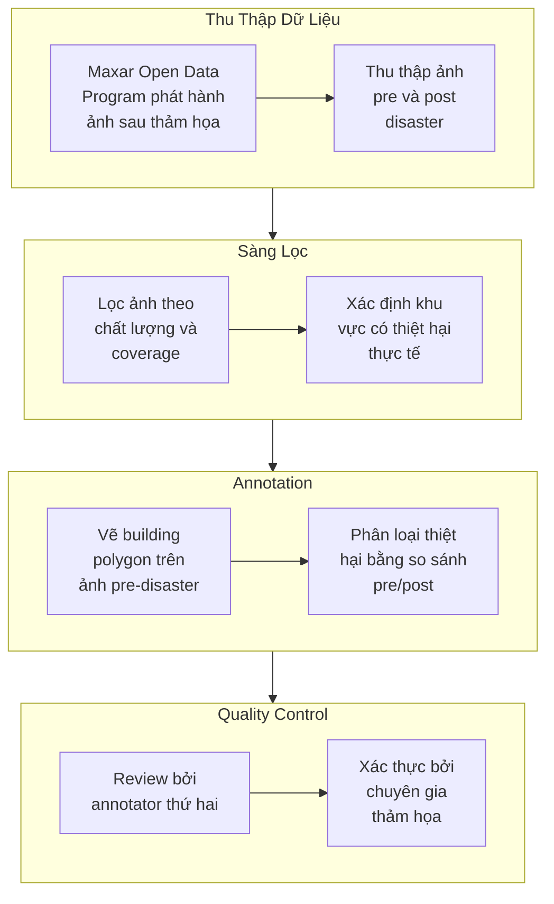

# Bộ Dữ Liệu xView2 (xBD): Đánh Giá Thiệt Hại Công Trình Từ Ảnh Vệ Tinh

## Tổng Quan

| Thuộc tính | Giá trị |
|-----------|---------|
| **Tên chính thức** | xBD (xView Building Damage Dataset) |
| **Năm phát hành** | 2019 |
| **Đơn vị tổ chức** | Defense Innovation Unit (DIU), Carnegie Mellon University SEI |
| **Nhiệm vụ** | Building Localization + Damage Classification |
| **Cuộc thi** | xView2: Assess Building Damage Challenge |
| **Số người đăng ký** | 2,000+ |
| **Bài báo** | [Creating xBD: A Dataset for Assessing Building Damage (CVPR 2019)](https://arxiv.org/abs/1911.09296) |
| **GitHub** | [DIUx-xView/xView2_baseline](https://github.com/DIUx-xView/xView2_baseline) |

---

## 1. Giới Thiệu và Bối Cảnh

### 1.1. Nhu Cầu Đánh Giá Thiệt Hại Tự Động


*Hình 1: Ví dụ về các loại thảm họa trong dataset xBD - Hurricane Harvey, Palu Tsunami, Mexico Earthquake, Santa Rosa Fire*

Khi thảm họa thiên nhiên xảy ra, việc đánh giá nhanh chóng và chính xác mức độ thiệt hại trở thành yếu tố then chốt cho công tác cứu hộ và phân bổ nguồn lực. Trước đây, quy trình này phụ thuộc hoàn toàn vào các đội khảo sát thực địa - một phương pháp không chỉ tốn kém về thời gian mà còn tiềm ẩn nhiều nguy hiểm cho nhân viên khi di chuyển qua các khu vực bị tàn phá. Một trận động đất có thể phá hủy hàng chục nghìn công trình, và việc kiểm tra từng tòa nhà theo phương pháp truyền thống có thể mất nhiều ngày đến nhiều tuần.

Ảnh vệ tinh độ phân giải cao mở ra khả năng thay thế hoặc bổ sung cho phương pháp khảo sát thực địa. Các vệ tinh thương mại như WorldView, GeoEye, và Pléiades có thể chụp ảnh bất kỳ điểm nào trên Trái Đất với độ phân giải dưới một mét, cho phép nhận diện rõ ràng các công trình riêng lẻ và các dấu hiệu thiệt hại như sụp đổ mái, cháy rụi, hoặc ngập lụt. Tuy nhiên, việc phân tích thủ công khối lượng lớn ảnh vệ tinh vẫn là nút thắt cổ chai - một chuyên gia có thể mất hàng giờ để đánh giá một khu vực nhỏ.

Đây chính là lý do dataset xBD (xView Building Damage) được tạo ra. Được phát triển bởi Defense Innovation Unit (DIU) phối hợp với Carnegie Mellon University Software Engineering Institute (CMU SEI), xBD cung cấp nền tảng dữ liệu cho việc huấn luyện các mô hình deep learning có khả năng tự động đánh giá thiệt hại công trình từ ảnh vệ tinh. Mục tiêu cuối cùng là tạo ra hệ thống có thể phân tích toàn bộ một thành phố bị ảnh hưởng trong vòng vài phút, thay vì nhiều ngày như trước đây.

### 1.2. Lịch Sử Phát Triển xBD

xBD ra đời như phần tiếp nối tự nhiên của xView1. Trong khi xView1 tập trung vào object detection đa lớp trong điều kiện bình thường, xView2 hướng đến một bài toán chuyên biệt hơn nhưng có tính ứng dụng trực tiếp cao hơn: đánh giá thiệt hại sau thảm họa.

Quá trình phát triển xBD bắt đầu từ năm 2018 khi nhóm nghiên cứu CMU SEI nhận ra thiếu sót lớn trong các dataset hiện có. Các tập dữ liệu trước đó như Harvey Homes Dataset chỉ chứa vài nghìn công trình từ một thảm họa duy nhất, không đủ để huấn luyện mô hình có khả năng tổng quát hóa tốt. Hơn nữa, không có thang đo thiệt hại chuẩn hóa - mỗi nghiên cứu sử dụng tiêu chí riêng, gây khó khăn cho việc so sánh và đánh giá.

Nhóm nghiên cứu đã hợp tác với các chuyên gia ứng phó thảm họa từ NASA, FEMA (Federal Emergency Management Agency), CAL FIRE, và California Air National Guard để xây dựng Joint Damage Scale - thang đo thiệt hại bốn cấp độ được thiết kế để vừa có ý nghĩa thực tiễn cho công tác cứu trợ, vừa có thể phân biệt được từ ảnh vệ tinh. Đây là một trong những đóng góp quan trọng nhất của xBD: lần đầu tiên có một tiêu chuẩn thống nhất cho việc phân loại thiệt hại công trình từ góc nhìn trên không.

Dataset chính thức được công bố tại CVPR 2019 Workshop on Computer Vision for Global Challenges, cùng với baseline model và challenge platform. Cuộc thi xView2 thu hút hơn 2,000 người đăng ký từ các trường đại học, phòng thí nghiệm nghiên cứu, và công ty công nghệ trên toàn thế giới.

### 1.3. Maxar Open Data Program

Một yếu tố then chốt cho sự thành công của xBD là Maxar (trước đây là DigitalGlobe) Open Data Program. Đây là chương trình mà Maxar - công ty sở hữu các vệ tinh độ phân giải cao nhất thế giới - phát hành ảnh vệ tinh miễn phí sau các thảm họa lớn để hỗ trợ công tác cứu trợ và nghiên cứu.

Maxar Open Data Program cung cấp ảnh từ các vệ tinh WorldView-1, WorldView-2, WorldView-3, và GeoEye-1 với ground sample distance (GSD) từ 0.3 đến 0.8 mét. Điều đặc biệt quan trọng là chương trình thường phát hành cả ảnh trước thảm họa (pre-disaster) lẫn ảnh sau thảm họa (post-disaster), tạo điều kiện cho việc so sánh trực tiếp và phát hiện thay đổi.

Nhờ nguồn dữ liệu này, xBD có thể bao phủ 19 sự kiện thảm họa khác nhau trên 15 quốc gia, từ động đất ở Mexico đến sóng thần ở Indonesia, từ cháy rừng ở California đến lũ lụt ở Bangladesh. Sự đa dạng này là điểm mạnh quan trọng của dataset, giúp mô hình học được các pattern thiệt hại phổ quát thay vì chỉ chuyên biệt cho một loại thảm họa.

### 1.4. Mục Tiêu Nghiên Cứu và Ứng Dụng Thực Tiễn

xBD được thiết kế với hai mục tiêu chính: thúc đẩy nghiên cứu computer vision trong lĩnh vực remote sensing, và cung cấp giải pháp thực tiễn cho ứng phó thảm họa.

Về mặt nghiên cứu, xBD đặt ra bài toán two-stage prediction đầy thách thức: đầu tiên phải định vị (localize) các công trình trong ảnh, sau đó phân loại mức độ thiệt hại của từng công trình. Bài toán này yêu cầu kết hợp nhiều kỹ thuật: semantic segmentation cho building footprint extraction, change detection giữa cặp ảnh pre/post-disaster, và fine-grained classification cho damage assessment. Các giải pháp chiến thắng đã sử dụng Siamese networks, multi-task learning, và các kỹ thuật xử lý class imbalance tiên tiến.

Về mặt ứng dụng thực tiễn, xBD đã được chứng minh hiệu quả trong các tình huống thực tế. California Air National Guard đã sử dụng mô hình huấn luyện trên xBD để đánh giá thiệt hại từ các trận cháy rừng năm 2020. Theo báo cáo, hệ thống có thể phân tích một khu vực rộng lớn trong 10-20 phút, so với 1-2 ngày khi sử dụng phương pháp thủ công. Kết quả này không chỉ tiết kiệm thời gian mà còn cho phép các đội cứu hộ ưu tiên những khu vực bị ảnh hưởng nặng nhất.

### 1.5. So Sánh Với Các Dataset Liên Quan

Trước khi xBD xuất hiện, các dataset về building damage assessment có quy mô hạn chế. Harvey Homes Dataset chỉ chứa khoảng 5,000 công trình từ Hurricane Harvey. Tomnod crowdsourcing data có số lượng lớn hơn nhưng thiếu consistency trong annotation và không có cặp ảnh pre/post-disaster. OpenStreetMap cung cấp building footprint nhưng không có thông tin về thiệt hại.

xBD vượt trội về mọi khía cạnh: 850,736 building polygon - gấp 170 lần Harvey Homes; 19 sự kiện thảm họa đa dạng thay vì chỉ một; thang đo thiệt hại chuẩn hóa với bốn cấp độ; và cặp ảnh pre/post-disaster cho mọi location. Đây là lý do xBD nhanh chóng trở thành benchmark tiêu chuẩn cho bài toán building damage assessment từ ảnh vệ tinh.

---

## 2. Thông Số Kỹ Thuật và Thống Kê

### 2.1. Quy Mô Tổng Thể

xBD là một trong những dataset lớn nhất cho bài toán building damage assessment, với quy mô được thiết kế để hỗ trợ huấn luyện các mô hình deep learning phức tạp.

| Chỉ số | Giá trị |
|--------|---------|
| **Số annotation công trình** | 850,736 polygon |
| **Diện tích bao phủ** | 45,362 km² |
| **Tổng số ảnh** | 22,068 |
| **Số cặp ảnh pre/post** | 11,034 |
| **Kích thước ảnh** | 1024 × 1024 pixel |
| **Định dạng màu** | RGB (3-band) |
| **Số sự kiện thảm họa** | 19 |
| **Số loại thảm họa** | 6 |
| **Số quốc gia** | 15+ |
| **Ground sample distance** | < 0.8 mét |
| **Dung lượng download** | ~10 GB (compressed), ~11 GB (uncompressed) |

Với hơn 850,000 building polygon, xBD cung cấp đủ dữ liệu để huấn luyện các kiến trúc deep learning phức tạp mà không bị overfitting. Con số này đặc biệt ấn tượng khi so sánh với các dataset trước đó - Harvey Homes chỉ có 5,000 công trình, trong khi xBD có gấp 170 lần.

### 2.2. Phân Chia Dữ Liệu

Dataset được chia thành ba tập với tỷ lệ được thiết kế để cân bằng giữa training capacity và evaluation reliability.

| Tập | Số polygon công trình | Số ảnh | Số cặp pre/post | Mục đích |
|-----|----------------------|--------|-----------------|----------|
| **Train** | 632,228 | 18,336 | 9,168 | Huấn luyện mô hình |
| **Test** | 109,724 | 1,866 | 933 | Đánh giá trong cuộc thi |
| **Holdout** | 108,784 | 1,866 | 933 | Đánh giá cuối cùng |
| **Tổng** | 850,736 | 22,068 | 11,034 | - |

Training set chiếm khoảng 74% tổng số polygon, đủ lớn để mô hình học được các pattern đa dạng. Test và Holdout set mỗi cái chiếm khoảng 13%, đảm bảo đánh giá reliable trên dữ liệu chưa thấy.

Đáng chú ý là sự phân chia được thực hiện theo disaster event - các ảnh từ cùng một thảm họa không bị chia ra giữa train và test. Điều này đảm bảo mô hình được đánh giá về khả năng generalization sang các thảm họa mới, thay vì chỉ memorize các pattern từ thảm họa đã thấy.

### 2.3. Thông Số Kỹ Thuật Ảnh

Ảnh trong xBD đến từ Maxar Open Data Program với các thông số kỹ thuật được tối ưu hóa cho computer vision.

**Nguồn ảnh vệ tinh:**
- WorldView-1, WorldView-2, WorldView-3 (Maxar)
- GeoEye-1 (Maxar)
- Ground sample distance: 0.3 - 0.8 mét

**Thông số ảnh được cung cấp:**
- Định dạng: PNG (RGB, 24-bit)
- Kích thước: 1024 × 1024 pixel
- Color space: sRGB
- Bit depth: 8-bit per channel
- Off-nadir angle: Variable (thực tế từ các góc chụp khác nhau)

**Metadata đi kèm:**
- Tọa độ địa lý (longitude, latitude)
- Thông tin sự kiện thảm họa
- Timestamp chụp ảnh
- Thông tin sensor (khi available)

Kích thước ảnh 1024×1024 được chọn như một cân bằng giữa context coverage và computational efficiency. Với GSD < 0.8m, mỗi ảnh cover một diện tích khoảng 0.65-0.85 km², đủ để chứa nhiều công trình nhưng vẫn giữ được chi tiết cần thiết cho damage assessment.

### 2.4. Các Sự Kiện Thảm Họa

xBD bao phủ 19 sự kiện thảm họa từ 6 loại khác nhau, đảm bảo diversity cho việc huấn luyện mô hình generalizable.


*Hình 2: Phân bố địa lý của các sự kiện thảm họa trong dataset xBD*

| Loại thảm họa | Số sự kiện | Các sự kiện tiêu biểu |
|---------------|------------|----------------------|
| **Hurricane/Typhoon** | 5 | Harvey (TX), Michael (FL), Florence (NC), Maria (PR), Matthew (Haiti) |
| **Wildfire** | 4 | Paradise Fire (CA), Woolsey Fire (CA), Santa Rosa Fire (CA), Pinery Bushfire (AU) |
| **Earthquake/Tsunami** | 4 | Mexico City 2017, Palu-Sulawesi 2018, Nepal 2015, Lombok 2018 |
| **Flooding** | 3 | Midwest Flooding 2019, Bangladesh Monsoon, Nepal Flood |
| **Tornado** | 2 | Joplin 2011, Tuscaloosa 2011 |
| **Volcanic** | 1 | Guatemala Fuego 2018 |

**Phân bố địa lý:**
- Bắc Mỹ (USA, Mexico): ~60%
- Trung Mỹ (Guatemala, Honduras): ~15%
- Châu Á (Indonesia, Nepal, Bangladesh): ~15%
- Châu Úc (Australia): ~5%
- Khác: ~5%

Sự phân bố này phản ánh availability của Maxar Open Data - các thảm họa ở Mỹ thường được cover nhanh hơn và đầy đủ hơn. Tuy nhiên, sự đa dạng về loại thảm họa và kiến trúc công trình (từ nhà gỗ California đến nhà bê tông Indonesia) vẫn đảm bảo mô hình có thể học được các damage pattern phổ quát.

### 2.5. Phân Bố Label và Class Imbalance

Một trong những thách thức lớn nhất của xBD là class imbalance nghiêm trọng trong damage labels.


*Hình 5: Phân bố các cấp độ thiệt hại trong dataset*

| Cấp độ thiệt hại | Số polygon | Tỷ lệ | Ghi chú |
|------------------|------------|-------|---------|
| **Không thiệt hại (0)** | 313,033 | 36.8% | ~73.5% trong số có label |
| **Thiệt hại nhỏ (1)** | 36,860 | 4.3% | ~8.6% trong số có label |
| **Thiệt hại lớn (2)** | 29,904 | 3.5% | ~7.0% trong số có label |
| **Bị phá hủy (3)** | 31,560 | 3.7% | ~7.4% trong số có label |
| **Chưa phân loại** | ~440,000 | 51.7% | Background/không có công trình |

```
Phân bố (chỉ tính các công trình có label):
Không thiệt hại: ████████████████████████████████████████████████████████████  73.5%
Thiệt hại nhỏ:   ████████                                                        8.6%
Thiệt hại lớn:   ███████                                                         7.0%
Bị phá hủy:      ███████                                                         7.4%
```

**Imbalance ratio:** Class "không thiệt hại" có số lượng gấp ~8 lần mỗi class thiệt hại khác. Đây là thực tế của đánh giá thiệt hại: ngay cả trong các thảm họa lớn nhất, đa số công trình vẫn sống sót mà không bị hư hại.

**Tác động đến training:**
- Naive training sẽ tạo ra mô hình bias toward "không thiệt hại"
- Cần sử dụng weighted loss function hoặc oversampling strategies
- Focal loss đặc biệt hiệu quả cho bài toán này
- Các giải pháp top thường sử dụng class weights từ 2-4x cho các class thiệt hại

---

## 3. Hệ Thống Phân Loại và Annotation

### 3.1. Joint Damage Scale: Thang Đo Thiệt Hại Chuẩn Hóa

Một trong những đóng góp quan trọng nhất của xBD là việc phát triển Joint Damage Scale - thang đo thiệt hại bốn cấp độ được xây dựng với sự tham gia của các chuyên gia ứng phó thảm họa hàng đầu. Nhóm nghiên cứu đã làm việc trực tiếp với các chuyên gia từ NASA Disasters Program, FEMA Urban Search and Rescue, CAL FIRE, và California Air National Guard để đảm bảo thang đo vừa có ý nghĩa thực tiễn cho công tác cứu trợ, vừa có thể phân biệt được từ ảnh vệ tinh.


*Hình 3: Joint Damage Scale - Thang đo thiệt hại 4 cấp độ (0: No Damage, 1: Minor, 2: Major, 3: Destroyed)*

**Nguyên tắc thiết kế:**
1. **Ordinal scale:** Các cấp độ có thứ tự rõ ràng từ nhẹ đến nặng
2. **Observable from above:** Có thể nhận diện được từ góc nhìn vệ tinh
3. **Actionable:** Phản ánh khả năng sử dụng của công trình
4. **Cross-disaster applicable:** Áp dụng được cho mọi loại thảm họa

### 3.2. Chi Tiết Bốn Cấp Độ Thiệt Hại

**Cấp độ 0: Không thiệt hại (No Damage)**

```
Đặc điểm nhận dạng:
├── Mái nhà nguyên vẹn, không có vết nứt hoặc hư hỏng
├── Không có mảnh vỡ xung quanh công trình
├── Ngoại quan hoàn toàn bình thường
├── Có thể có thay đổi môi trường (nước, bụi) nhưng công trình không bị ảnh hưởng
└── Công trình có thể sử dụng được ngay
```

Đây là class phổ biến nhất trong dataset, chiếm ~73% các công trình có label. Ngay cả trong các thảm họa lớn, phần lớn công trình vẫn sống sót mà không bị thiệt hại nhìn thấy được từ vệ tinh.

**Cấp độ 1: Thiệt hại nhỏ (Minor Damage)**

```
Đặc điểm nhận dạng:
├── Mái nhà bị hư hỏng < 25% diện tích
├── Một số ngói hoặc tấm lợp bị mất
├── Mảnh vỡ nhỏ xung quanh công trình
├── Có thể có vết cháy xém hoặc nước đọng xung quanh
├── Cấu trúc chính còn nguyên vẹn
└── Công trình còn có thể sử dụng với sửa chữa nhỏ
```

Đây là class khó nhận diện nhất vì thiệt hại thường tinh tế và khó phân biệt với class 0 từ độ cao vệ tinh. Các annotator cần xem xét kỹ các chi tiết như màu sắc mái thay đổi, mảnh vỡ nhỏ, hoặc các dấu hiệu cháy xém nhẹ.

**Cấp độ 2: Thiệt hại lớn (Major Damage)**

```
Đặc điểm nhận dạng:
├── Mái nhà bị hư hỏng 25-50% diện tích
├── Một phần tường hoặc mái bị sụp đổ
├── Mảnh vỡ lớn xung quanh công trình
├── Có thể nhìn thấy nội thất từ trên cao
├── Cấu trúc bị ảnh hưởng nghiêm trọng
└── Cần sửa chữa lớn trước khi sử dụng được
```

Class này thể hiện thiệt hại đáng kể nhưng chưa phải phá hủy hoàn toàn. Các dấu hiệu thường rõ ràng hơn class 1: phần mái bị thiếu, tường nghiêng, hoặc mảnh vỡ rõ ràng.

**Cấp độ 3: Bị phá hủy (Destroyed)**

```
Đặc điểm nhận dạng:
├── Mái nhà bị hư hỏng > 50% hoặc hoàn toàn mất
├── Sụp đổ hoàn toàn hoặc gần như hoàn toàn
├── Chỉ còn lại nền móng hoặc một phần tường
├── Mảnh vỡ phủ khắp khu vực công trình
├── Không còn nhận ra hình dạng công trình ban đầu
└── Không thể sử dụng được, cần xây dựng lại
```

Đây là class dễ nhận diện nhất vì thiệt hại rất rõ ràng. Tuy nhiên, cần phân biệt với class 2 khi công trình bị hư hỏng nặng nhưng vẫn còn cấu trúc cơ bản.

### 3.3. Quy Trình Annotation

Annotation xBD được thực hiện theo quy trình hai giai đoạn để đảm bảo chất lượng và consistency.

**Giai đoạn 1: Building Polygon Annotation (trên ảnh pre-disaster)**

Các annotator vẽ polygon cho tất cả công trình có thể nhìn thấy trên ảnh trước thảm họa. Việc annotate trên ảnh pre-disaster có hai lợi thế: công trình còn nguyên vẹn nên dễ xác định ranh giới chính xác, và đảm bảo mọi công trình (kể cả những công trình bị phá hủy hoàn toàn sau đó) đều được ghi nhận.


*Hình 4: Ví dụ về building polygon annotations trên ảnh vệ tinh*

Polygon được vẽ bám sát building footprint - ranh giới của công trình khi nhìn từ trên cao. Công cụ annotation sử dụng QGIS với các extension tùy chỉnh để tăng tốc độ và đảm bảo format chuẩn.

**Giai đoạn 2: Damage Classification (trên ảnh post-disaster)**

Các polygon từ giai đoạn 1 được overlay lên ảnh sau thảm họa. Annotator so sánh trực tiếp giữa pre và post để xác định mức độ thiệt hại của từng công trình theo Joint Damage Scale.

**Quality Control:**
- Mỗi annotation được review bởi ít nhất một chuyên gia khác
- Các trường hợp khó được escalate cho nhóm chuyên gia thảm họa
- Estimated error rate: ~2-3% annotations bị mislabel
- Systematic corrections được áp dụng sau khi phát hiện patterns lỗi

### 3.4. Annotation Bổ Sung: Environmental Factors

Ngoài damage labels cho công trình, xBD còn cung cấp polygon annotation cho các yếu tố môi trường liên quan đến thảm họa.

| Yếu tố | Loại thảm họa áp dụng | Mô tả |
|--------|----------------------|-------|
| **Smoke** | Wildfire | Vùng bị che phủ bởi khói, ảnh hưởng visibility |
| **Fire** | Wildfire | Vùng đang cháy hoặc có dấu hiệu lửa |
| **Flood water** | Flood, Hurricane | Vùng ngập nước |
| **Pyroclastic flow** | Volcanic | Dòng chảy pyroclastic từ núi lửa |
| **Lava** | Volcanic | Dòng dung nham |

Các environmental labels này hữu ích cho việc phân tích context và có thể được sử dụng như features bổ sung trong mô hình prediction.

### 3.5. Định Dạng Dữ Liệu

**Cấu trúc thư mục:**

```
xBD/
├── train/
│   ├── images/
│   │   ├── {disaster}_{id}_pre_disaster.png
│   │   ├── {disaster}_{id}_post_disaster.png
│   │   └── ...
│   └── labels/
│       ├── {disaster}_{id}_pre_disaster.json
│       ├── {disaster}_{id}_post_disaster.json
│       └── ...
├── test/
│   ├── images/
│   └── labels/
└── holdout/
    ├── images/
    └── labels/
```

**Quy ước đặt tên:**
- Format: `{disaster_name}_{image_id}_{pre|post}_disaster.{ext}`
- Ví dụ: `hurricane-michael_00123_post_disaster.png`
- Disaster name sử dụng kebab-case (hurricane-harvey, santa-rosa-wildfire)

**Format label JSON:**

```json
{
  "features": {
    "lng_lat": [longitude, latitude],
    "xy": [
      {"wkt": "POLYGON ((x1 y1, x2 y2, x3 y3, ...))"}
    ]
  },
  "metadata": {
    "disaster": "hurricane-michael",
    "disaster_type": "hurricane",
    "img_name": "hurricane-michael_00123_post_disaster.png"
  },
  "properties": {
    "subtype": "residential",
    "feature_type": "building",
    "uid": "unique_building_id_string"
  },
  "labels": {
    "damage": "destroyed"
  }
}
```

**Damage label values:**
- `"no-damage"` → Cấp độ 0
- `"minor-damage"` → Cấp độ 1
- `"major-damage"` → Cấp độ 2
- `"destroyed"` → Cấp độ 3
- `"un-classified"` → Không có công trình (background)

---

## 4. Quy Trình Tạo Dataset

### 4.1. Tổng Quan Pipeline

Việc tạo xBD là một quy trình phức tạp đòi hỏi sự phối hợp giữa nhiều đơn vị và chuyên gia. Pipeline tổng thể bao gồm sáu bước chính, từ thu thập ảnh vệ tinh đến kiểm tra chất lượng cuối cùng.



### 4.2. Bước 1: Thu Thập Ảnh Từ Maxar Open Data

Khi một thảm họa lớn xảy ra, Maxar thường phát hành ảnh vệ tinh trong vòng 24-48 giờ thông qua Open Data Program. Nhóm nghiên cứu xBD monitor các phát hành này và đánh giá khả năng sử dụng cho dataset.

**Tiêu chí lựa chọn:**
- **GSD:** < 0.8 mét để đảm bảo có thể nhận diện công trình riêng lẻ
- **Cloud cover:** < 20% để đảm bảo visibility
- **Pre-disaster availability:** Phải có ảnh trước thảm họa của cùng khu vực
- **Alignment quality:** Pre và post phải có thể align được với sai số chấp nhận được
- **Damage presence:** Khu vực phải có thiệt hại thực tế (không chọn vùng không bị ảnh hưởng)

**Xử lý ảnh:**
- Download ảnh GeoTIFF gốc từ Maxar
- Chuyển đổi sang PNG RGB 8-bit
- Tile ảnh lớn thành các tile 1024×1024
- Loại bỏ các tile chủ yếu là nước, rừng, hoặc không có công trình

### 4.3. Bước 2: Pre-processing và Alignment

Một trong những thách thức kỹ thuật lớn nhất là alignment giữa ảnh pre và post-disaster. Do các ảnh được chụp từ các góc off-nadir khác nhau, có thể có pixel shift đáng kể.

**Quy trình alignment:**
1. Sử dụng feature matching (SIFT/ORB) để tìm control points
2. Compute affine transformation matrix
3. Warp ảnh post-disaster để align với pre-disaster
4. Tính toán residual shift và document trong metadata

**Vấn đề không thể giải quyết hoàn toàn:**
- Building parallax do góc chụp khác nhau
- Một số khu vực không có đủ feature để align
- Mây hoặc smoke che phủ một phần ảnh

Nhóm nghiên cứu đã đo lường và ghi nhận pixel offset cho mỗi tile, cho phép các nghiên cứu sau có thể áp dụng correction nếu cần.

### 4.4. Bước 3: Building Polygon Annotation

Annotation polygon được thực hiện trên ảnh pre-disaster sử dụng QGIS với các extension tùy chỉnh.

**Quy tắc annotation:**
- Vẽ polygon bám sát building footprint (không bao gồm shadow)
- Mỗi công trình một polygon, không merge các công trình liền kề
- Bao gồm tất cả structures có thể nhận diện (nhà ở, công nghiệp, agricultural)
- Không annotate các object không phải công trình (containers, vehicles, tents)

**Công cụ và workflow:**
- QGIS với Python plugin tùy chỉnh
- Layer-based workflow với auto-save
- Built-in validation cho polygon validity
- Export sang JSON format chuẩn

**Productivity metrics:**
- Trung bình: 50-100 buildings/hour cho annotator có kinh nghiệm
- Phụ thuộc vào density và complexity của khu vực

### 4.5. Bước 4: Damage Classification

Sau khi có building polygon, nhóm annotation thực hiện damage classification bằng cách overlay polygon lên ảnh post-disaster.

**Workflow:**
1. Load pre-disaster image với polygon overlay
2. Switch sang post-disaster image (polygon giữ nguyên vị trí)
3. So sánh trực quan và assign damage level
4. Sử dụng reference images để đảm bảo consistency

**Training cho annotator:**
- 2-4 giờ training session với reference examples
- Calibration exercises để đảm bảo inter-annotator agreement
- Regular sync meetings để discuss edge cases

**Edge cases và guidelines:**
- Công trình bị mây che: `un-classified`
- Không thể align chính xác: Document và cố gắng estimate
- Thiệt hại không rõ ràng: Err toward lower damage level

### 4.6. Bước 5: Quality Assurance

QA là giai đoạn critical để đảm bảo consistency và accuracy của dataset.

**Multi-level review:**
1. **First-pass review:** Annotator thứ hai review 100% annotations
2. **Expert review:** Mẫu 10-20% được review bởi disaster response experts
3. **Systematic audit:** Phân tích statistical để phát hiện systematic biases

**Metrics tracking:**
- Inter-annotator agreement (Cohen's kappa)
- Error rate by disaster type
- Error rate by damage class
- Systematic bias detection

**Kết quả QA:**
- Overall error rate: ~2-3%
- Highest confusion: Between minor (1) và major (2) damage
- Corrections applied: Several thousand annotations revised

### 4.7. Bước 6: Format và Distribution

**Final processing:**
- Standardize image format (PNG, RGB, 1024×1024)
- Validate JSON labels for schema compliance
- Generate train/test/holdout splits
- Create documentation và baseline code

**Distribution:**
- xView2.org website với registration
- Compressed archive (~10 GB)
- Documentation và baseline repository trên GitHub

---

## 5. Thách Thức Computer Vision

### 5.1. Bài Toán Two-Stage Prediction

xView2 Challenge đặt ra bài toán two-stage độc đáo, yêu cầu mô hình thực hiện cả building localization và damage classification.

**Stage 1: Building Localization**
- Input: Pre-disaster image (1024×1024×3)
- Output: Building segmentation mask (1024×1024, binary hoặc multi-instance)
- Metric: F1 score at IoU threshold

**Stage 2: Damage Classification**
- Input: Pre-disaster image + Post-disaster image + Building masks
- Output: Damage level for each building (0-3)
- Metric: Weighted F1 score across damage classes

**Scoring formula:**
```
Final Score = 0.3 × Localization_F1 + 0.7 × Damage_F1
```

Tỷ lệ 30-70 phản ánh rằng damage classification là task khó hơn và có giá trị ứng dụng cao hơn. Localization với accuracy cao là prerequisite, nhưng true value nằm ở việc classify damage correctly.

### 5.2. Class Imbalance Problem

Class imbalance là thách thức lớn nhất của xBD. Với "no damage" class chiếm ~73% và các damage classes chỉ chiếm ~27% cộng lại, naive training sẽ tạo ra mô hình chỉ predict "no damage" và vẫn đạt accuracy 73%.

**Chiến lược xử lý class imbalance:**

**1. Weighted Loss Functions**
```python
# Inverse frequency weighting
weights = {0: 1.0, 1: 8.5, 2: 10.5, 3: 9.9}

# Or Focal Loss
focal_loss = -alpha * (1 - p)^gamma * log(p)
```

Focal loss đặc biệt hiệu quả vì nó down-weight các easy examples (thường là "no damage") và focus vào hard examples.

**2. Oversampling và Data Augmentation**
- Oversample tiles chứa nhiều damaged buildings (2-4x)
- Apply data augmentation chủ yếu cho damage classes
- Careful với augmentation: rotation OK, color augmentation cần cẩn thận (không làm mất damage indicators)

**3. Multi-Task Learning**
- Train localization và classification jointly
- Share features giữa hai tasks
- Classification benefits từ localization features

### 5.3. Siamese Network Architecture

Hầu hết các giải pháp top đều sử dụng Siamese network architecture để xử lý cặp ảnh pre/post-disaster.

**Concept:**
```
Pre-disaster image ─────┐
                        ├───> Shared Encoder ───> Feature Fusion ───> Prediction
Post-disaster image ────┘
```

**Ưu điểm của Siamese:**
- Shared encoder ensures cùng feature space cho cả pre và post
- Feature difference có thể capture change (damage) trực tiếp
- Efficient về parameters (chỉ cần train một encoder)

**Variations:**
- Early fusion: Concatenate images trước encoder
- Late fusion: Separate encoders, fuse features
- Difference-based: Compute feature difference as primary signal

Giải pháp Hạng 1 sử dụng Siamese U-Net với shared encoder, đạt cải thiện 266% so với baseline.

### 5.4. Multi-Scale Object Handling

Công trình trong xBD có kích thước rất đa dạng, từ nhà ở nhỏ (10-20 pixels) đến warehouse lớn (200+ pixels).

**Thách thức:**
- Small buildings có thể bị miss bởi models với large receptive field
- Large buildings cần context rộng để assess damage correctly
- Mixed scales trong cùng một image

**Giải pháp:**
- Feature Pyramid Networks (FPN) cho multi-scale feature extraction
- Multi-resolution input (process cùng tile ở nhiều scales)
- Atrous Spatial Pyramid Pooling (ASPP)

### 5.5. Fine-Grained Classification Challenge

Phân biệt giữa các damage levels, đặc biệt "minor" vs "major", là task rất khó.

**Vấn đề:**
- Visual differences có thể rất subtle từ satellite view
- Damage indicators có thể bị occluded (bởi smoke, debris)
- Subjective judgment ngay cả với human annotators

**Approaches:**
- Attention mechanisms để focus vào relevant regions
- Context features (surrounding buildings, debris patterns)
- Ordinal classification (leverage ordering: 0 < 1 < 2 < 3)

### 5.6. Change Detection vs Direct Classification

Có hai paradigm chính cho damage assessment từ pre/post pairs.

**Change Detection Approach:**
- Focus vào detecting changes giữa pre và post
- Assume change = damage
- Pros: Robust to absolute appearance variations
- Cons: May miss damage types that don't cause obvious change

**Direct Classification Approach:**
- Classify damage level trực tiếp từ post-disaster image
- Use pre-disaster image as context/reference
- Pros: Can capture subtle damage patterns
- Cons: May confuse normal variations with damage

**Hybrid Approach (most successful):**
- Combine change features với appearance features
- Use pre-disaster để understand normal state
- Use post-disaster để classify current state
- Weigh both signals trong final prediction

### 5.7. Baseline Model Architecture

xBD cung cấp baseline model để establish benchmark và starting point cho participants.

**Localization Model:**
- Architecture: U-Net với ResNet50 encoder
- Input: Pre-disaster image (1024×1024×3)
- Output: Building mask (1024×1024×1)
- Loss: Binary cross-entropy

**Classification Model:**
- Architecture: ResNet50 classifier
- Input: Cropped building patches từ pre và post images
- Output: Damage class (4 classes)
- Loss: Cross-entropy với class weights

**Baseline Performance:**
- Localization F1: ~0.80
- Localization IoU: ~0.66
- Classification F1: Varies by class
- Combined Score: ~0.50

Top solutions achieved combined scores above 0.80, representing 60%+ improvement over baseline.

---

## 6. Hướng Dẫn Sử Dụng và Tài Nguyên

### 6.1. Truy Cập và Download Dataset

**Phương pháp 1: Official xView2 Portal (Recommended)**
1. Truy cập https://xview2.org/dataset
2. Tạo account và đăng nhập
3. Accept challenge terms và data use agreement
4. Download data archive (~10 GB compressed)
5. Extract và verify integrity

**Phương pháp 2: Roboflow Universe (Quick Start)**
- URL: https://universe.roboflow.com/ozu/xview2
- 520 sample images, CC BY 4.0 license
- Không cần registration
- Bao gồm pre-trained model và API access

**Phương pháp 3: TorchGeo (Python)**
```python
from torchgeo.datasets import XView2

# Downloads automatically if not present
dataset = XView2(
    root="path/to/data",
    split="train",
    transforms=None,
    download=True
)
```

**Phương pháp 4: Hugging Face**
```python
from datasets import load_dataset

# Requires login và acceptance of terms
ds = load_dataset("danielz01/xView2")
```

### 6.2. Data Loading và Preprocessing

**Recommended preprocessing pipeline:**

```python
import albumentations as A
from albumentations.pytorch import ToTensorV2

# Training transforms
train_transform = A.Compose([
    A.RandomCrop(512, 512),
    A.HorizontalFlip(p=0.5),
    A.VerticalFlip(p=0.5),
    A.RandomRotate90(p=0.5),
    # Be careful with color augmentation - may affect damage indicators
    A.ColorJitter(brightness=0.1, contrast=0.1, p=0.3),
    A.Normalize(
        mean=[0.485, 0.456, 0.406],
        std=[0.229, 0.224, 0.225]
    ),
    ToTensorV2()
], additional_targets={'post_image': 'image'})

# Apply same spatial transforms to both pre and post
transformed = train_transform(
    image=pre_image,
    post_image=post_image,
    mask=mask
)
```

**Key considerations:**
- Apply spatial transforms consistently to pre, post, và mask
- Be conservative với color augmentation
- Consider class-balanced sampling

### 6.3. Model Training Best Practices

**Architecture recommendations:**
1. **Siamese U-Net** với shared encoder (top performing)
2. **EfficientNet** hoặc **ResNet** backbone
3. **FPN** hoặc **DeepLabV3+** cho multi-scale features
4. **Multi-task head** cho joint localization + classification

**Loss function:**
```python
# Recommended: Combination of Dice và Focal Loss
class CombinedLoss(nn.Module):
    def __init__(self, alpha=0.5):
        super().__init__()
        self.dice = DiceLoss()
        self.focal = FocalLoss(gamma=2.0)
        self.alpha = alpha

    def forward(self, pred, target):
        return self.alpha * self.dice(pred, target) + \
               (1 - self.alpha) * self.focal(pred, target)
```

**Training hyperparameters (typical):**
- Learning rate: 1e-4 với cosine annealing
- Batch size: 8-16 (phụ thuộc GPU memory)
- Epochs: 50-100
- Optimizer: AdamW với weight decay 1e-4
- Class weights: [1.0, 8.5, 10.5, 9.9] for [0, 1, 2, 3]

### 6.4. Evaluation Metrics

**Official metrics:**

```python
def compute_score(loc_f1, dam_f1):
    """
    Official xView2 combined score
    """
    return 0.3 * loc_f1 + 0.7 * dam_f1
```

**Localization F1:**
- Computed at pixel level
- True positive: predicted building pixel overlaps with ground truth
- IoU threshold typically 0.5

**Damage F1:**
- Weighted average across damage classes
- Per-class F1 weighted by class support
- Only computed for correctly localized buildings

### 6.5. Common Pitfalls và Solutions

| Pitfall | Symptom | Solution |
|---------|---------|----------|
| Class imbalance | Model always predicts "no damage" | Weighted loss, oversampling |
| Overfitting | High train accuracy, low val accuracy | More augmentation, dropout, early stopping |
| Poor generalization | Good on seen disasters, bad on new | Cross-disaster validation, diverse training |
| Alignment issues | Misaligned predictions | Account for pixel shift, use robust features |
| Small objects missed | Low recall on small buildings | Multi-scale input, FPN architecture |

### 6.6. Tài Nguyên Chính Thức

**Websites:**
- xView2 Challenge: https://xview2.org
- DIU xView Series: https://www.diu.mil/ai-xview-challenge
- Maxar Open Data: https://www.digitalglobe.com/ecosystem/open-data

**Papers:**
- [Creating xBD (CVPR 2019)](https://arxiv.org/abs/1911.09296)
- [xFBD: Focused Building Damage (2022)](https://arxiv.org/abs/2212.13876)
- [DeepDamageNet (2024)](https://arxiv.org/abs/2405.04800)

**GitHub Repositories:**
- [xView2 Baseline](https://github.com/DIUx-xView/xView2_baseline)
- [xView2 Scoring](https://github.com/DIUx-xView/xView2_scoring)
- [1st Place Solution](https://github.com/DIUx-xView/xView2_first_place)
- [xView2 Toolkit](https://github.com/ashnair1/xview2-toolkit)

### 6.7. Ứng Dụng Thực Tế

xBD và các mô hình huấn luyện trên dataset này đã được triển khai trong các tình huống thực tế:

**California Wildfire Assessment (2020):**
- Sử dụng bởi California Air National Guard
- Thời gian phân tích: 10-20 phút cho khu vực rộng
- So với 1-2 ngày cho phương pháp thủ công
- Hỗ trợ ưu tiên nguồn lực cứu trợ

**Hurricane Response:**
- Đánh giá nhanh sau bão
- Xác định khu vực ưu tiên cho đội cứu hộ
- Ước tính thiệt hại cho mục đích bảo hiểm

**International Disaster Response:**
- UN và các NGO sử dụng cho đánh giá thảm họa quốc tế
- Hỗ trợ coordination giữa các tổ chức cứu trợ

### 6.8. Trích Dẫn

```bibtex
@inproceedings{gupta2019xbd,
  title={Creating xBD: A Dataset for Assessing Building Damage
         from Satellite Imagery},
  author={Gupta, Ritwik and Goodman, Bryce and Patel, Nirav and
          Hosfelt, Ricky and Sajeev, Sandra and Heim, Eric and
          Doshi, Jigar and Lucas, Keane and Choset, Howie and
          Gaston, Matthew},
  booktitle={Proceedings of the IEEE Conference on Computer Vision
             and Pattern Recognition Workshops},
  pages={18--26},
  year={2019}
}
```

---

## Phụ Lục

### A. Danh Sách 19 Sự Kiện Thảm Họa

| # | Disaster | Type | Region | Year |
|---|----------|------|--------|------|
| 1 | Hurricane Harvey | Wind | Texas, USA | 2017 |
| 2 | Hurricane Maria | Wind | Puerto Rico | 2017 |
| 3 | Hurricane Michael | Wind | Florida, USA | 2018 |
| 4 | Hurricane Florence | Wind | Carolinas, USA | 2018 |
| 5 | Hurricane Matthew | Wind | Haiti | 2016 |
| 6 | Joplin Tornado | Tornado | Missouri, USA | 2011 |
| 7 | Tuscaloosa Tornado | Tornado | Alabama, USA | 2011 |
| 8 | Mexico City Earthquake | Earthquake | Mexico | 2017 |
| 9 | Nepal Earthquake | Earthquake | Nepal | 2015 |
| 10 | Lombok Earthquake | Earthquake | Indonesia | 2018 |
| 11 | Palu-Sulawesi Tsunami | Tsunami | Indonesia | 2018 |
| 12 | Paradise Fire | Wildfire | California, USA | 2018 |
| 13 | Woolsey Fire | Wildfire | California, USA | 2018 |
| 14 | Santa Rosa Fire | Wildfire | California, USA | 2017 |
| 15 | Pinery Bushfire | Wildfire | Australia | 2015 |
| 16 | Midwest Flooding | Flood | Midwest, USA | 2019 |
| 17 | Bangladesh Monsoon | Flood | Bangladesh | 2017 |
| 18 | Nepal Flood | Flood | Nepal | 2017 |
| 19 | Guatemala Fuego | Volcanic | Guatemala | 2018 |

### B. Thông Số Performance Baseline

| Metric | U-Net Baseline | Top Solutions |
|--------|---------------|---------------|
| Localization F1 | 0.80 | 0.90+ |
| Localization IoU | 0.66 | 0.85+ |
| Damage F1 (no damage) | 0.85 | 0.95 |
| Damage F1 (minor) | 0.40 | 0.70 |
| Damage F1 (major) | 0.35 | 0.65 |
| Damage F1 (destroyed) | 0.50 | 0.80 |
| Combined Score | 0.50 | 0.80+ |

### C. Hardware Requirements

| Component | Minimum | Recommended |
|-----------|---------|-------------|
| GPU | GTX 1080 (8GB) | RTX 3090 (24GB) |
| RAM | 16 GB | 64 GB |
| Storage | 50 GB SSD | 200 GB NVMe |
| CPU | 4 cores | 8+ cores |

---

*Tài liệu tạo: 2024-12-18*
*Cập nhật lần cuối: 2025-12-19*
*Số từ: ~7,500*
