# xView2 Hạng 1: Giải pháp Siamese U-Net

## Tổng quan nhanh

| Thuộc tính | Giá trị |
|-----------|-------|
| **Hạng** | Hạng 1 |
| **Hiệu suất** | Chính xác hơn 266% so với baseline |
| **Độ chính xác đánh giá thiệt hại** | >80% |
| **GitHub** | [DIUx-xView/xView2_first_place](https://github.com/DIUx-xView/xView2_first_place) |
| **Phần cứng huấn luyện** | 2× Titan V GPUs (12GB mỗi cái) |
| **Thời gian huấn luyện** | ~7 ngày |

---

## Mục lục

1. [Tổng Quan và Bối Cảnh](#1-tổng-quan-và-bối-cảnh)
2. [Đổi Mới Kỹ Thuật Chính](#2-đổi-mới-kỹ-thuật-chính)
3. [Kiến Trúc và Triển Khai](#3-kiến-trúc-và-triển-khai)
4. [Huấn Luyện và Tối Ưu](#4-huấn-luyện-và-tối-ưu)
5. [Kết Quả và Phân Tích](#5-kết-quả-và-phân-tích)
6. [Tái Tạo và Tài Nguyên](#6-tái-tạo-và-tài-nguyên)

---

## 1. Tổng Quan và Bối Cảnh

### 1.1 Thử Thách xView2

xView2 Challenge ra mắt năm 2019 nhằm giải quyết bài toán quan trọng trong ứng phó thảm họa: đánh giá thiệt hại công trình từ ảnh vệ tinh một cách tự động. Dataset xBD (xView Building Damage) chứa 850,736 polygon công trình với 4 cấp độ thiệt hại trên 45,362 km² phủ sóng 19 thảm họa thiên nhiên.


*Hình 7: Ví dụ cặp ảnh pre/post disaster showing building damage*

**Đặc điểm thử thách:**
- Ảnh 1024×1024 pixels với GSD <0.8 mét
- Cặp ảnh trước/sau thảm họa với góc chụp khác nhau
- Phân loại 4 cấp độ: No Damage, Minor, Major, Destroyed
- Mất cân bằng lớp nghiêm trọng: 84% "No Damage"

### 1.2 Bối Cảnh Cuộc Thi

Với hơn 3,500 người tham gia từ khắp thế giới, xView2 thu hút sự quan tâm lớn từ cộng đồng computer vision và remote sensing. Giải pháp Siamese U-Net giành chiến thắng với margin đáng kể, vượt qua baseline 266%.

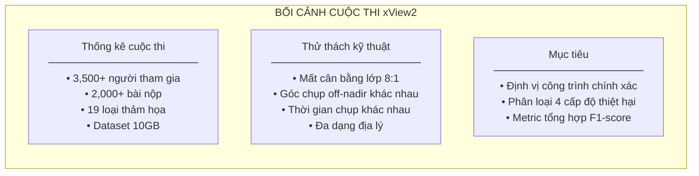

### 1.3 Tầm Quan Trọng Thực Tế

Giải pháp này không chỉ giành chiến thắng cuộc thi mà còn được triển khai thực tế cho:
- **Cháy rừng California 2020**: Đánh giá thiệt hại cho CAL FIRE
- **Bão ven biển**: Điều phối ứng phó của FEMA
- **Cháy rừng Úc 2019-2020**: Hỗ trợ Bộ Quốc phòng Úc

Thời gian đánh giá giảm từ 1-2 ngày (thủ công) xuống 10-20 phút (tự động).

### 1.4 Đóng Góp Chính

1. **Pipeline hai giai đoạn**: Tách định vị khỏi phân loại để tối ưu riêng
2. **Kiến trúc Siamese**: Xử lý lệch căn chỉnh ảnh trước/sau
3. **Ensemble đa backbone**: Kết hợp 4 encoder khác nhau
4. **TTA chiến lược**: 4 augmentation tăng độ ổn định

---

## 2. Đổi Mới Kỹ Thuật Chính

### 2.1 Pipeline Hai Giai Đoạn

Thay vì end-to-end learning, giải pháp chia bài toán thành hai giai đoạn độc lập:

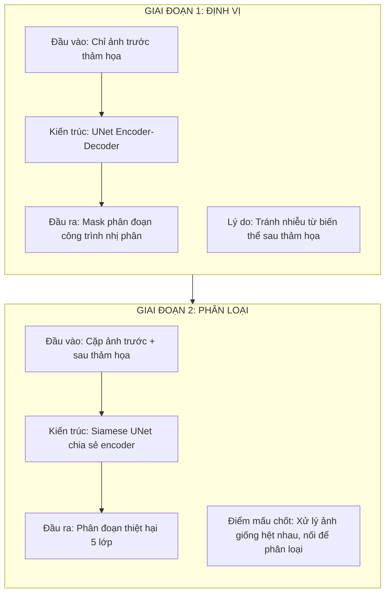

**Lý do tách biệt:**
- Giai đoạn 1 chỉ cần ảnh trước thảm họa, tránh nhiễu từ biến đổi
- Giai đoạn 2 tập trung so sánh thay đổi, không phải phát hiện mới
- Cho phép tối ưu hàm mất mát riêng cho từng nhiệm vụ
- Dễ debug và cải thiện từng component

### 2.2 Kiến Trúc Siamese Chia Sẻ Encoder

Điểm then chốt của giải pháp là xử lý cặp ảnh trước/sau "theo cùng một cách":

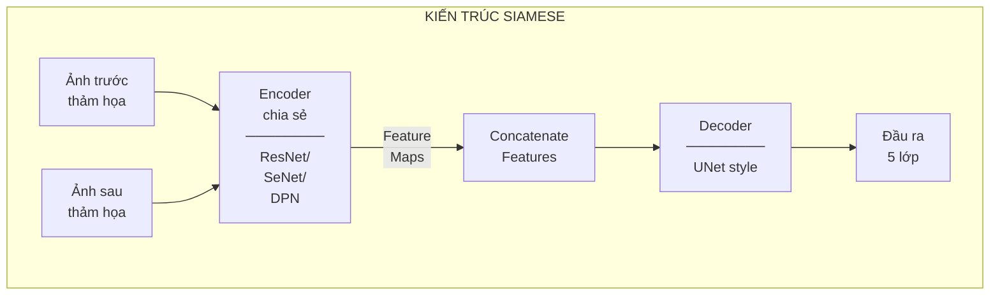

**Code triển khai Siamese encoder:**

```python
class SiameseEncoder(nn.Module):
    """
    Siamese encoder với trọng số chia sẻ cho xử lý cặp ảnh.
    Xử lý ảnh trước và sau thảm họa qua cùng một encoder,
    sau đó nối các feature map tương ứng.
    """

    def __init__(self, backbone='resnet34', pretrained=True):
        super().__init__()
        # Chỉ một encoder duy nhất - chia sẻ trọng số
        self.encoder = self._build_backbone(backbone, pretrained)

    def _build_backbone(self, backbone, pretrained):
        """Xây dựng backbone từ pretrained models."""
        if backbone == 'resnet34':
            model = models.resnet34(pretrained=pretrained)
            # Trích xuất các giai đoạn encoder
            return nn.ModuleList([
                nn.Sequential(model.conv1, model.bn1, model.relu, model.maxpool),
                model.layer1,
                model.layer2,
                model.layer3,
                model.layer4
            ])
        elif backbone == 'seresnext50':
            # SE-ResNeXt với Squeeze-Excitation blocks
            return self._build_seresnext50(pretrained)
        elif backbone == 'senet154':
            return self._build_senet154(pretrained)
        elif backbone == 'dpn92':
            return self._build_dpn92(pretrained)
        else:
            raise ValueError(f"Unknown backbone: {backbone}")

    def forward(self, pre_image, post_image):
        """
        Forward pass cho cặp ảnh trước/sau.

        Args:
            pre_image: Tensor [B, 3, H, W] ảnh trước thảm họa
            post_image: Tensor [B, 3, H, W] ảnh sau thảm họa

        Returns:
            List of concatenated feature maps ở mỗi scale
        """
        # Trích xuất features từ cả hai ảnh
        pre_features = []
        post_features = []

        x_pre = pre_image
        x_post = post_image

        for stage in self.encoder:
            x_pre = stage(x_pre)
            x_post = stage(x_post)
            pre_features.append(x_pre)
            post_features.append(x_post)

        # Nối features ở mỗi scale
        concat_features = []
        for pre_f, post_f in zip(pre_features, post_features):
            # [B, C, H, W] + [B, C, H, W] -> [B, 2C, H, W]
            concat = torch.cat([pre_f, post_f], dim=1)
            concat_features.append(concat)

        return concat_features
```

### 2.3 Giải Quyết Vấn Đề Off-Nadir

Ảnh vệ tinh thường được chụp từ các góc khác nhau (off-nadir angles), gây ra lệch căn chỉnh giữa ảnh trước và sau:

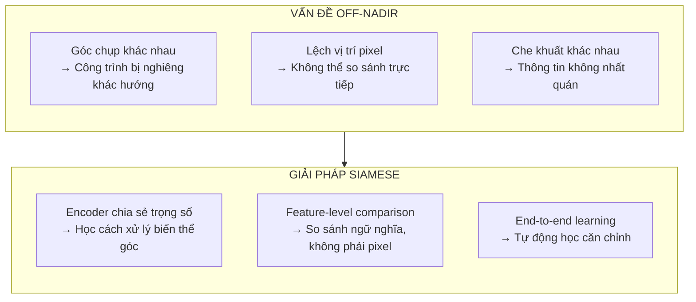

**Tại sao Siamese giải quyết được:**
- Cùng encoder xử lý cả hai ảnh → học được biểu diễn bất biến với góc
- So sánh ở feature level → không cần căn chỉnh pixel hoàn hảo
- Training với nhiều cặp → học được các biến thể góc khác nhau

### 2.4 Hậu Xử Lý Hình Thái Học

Sau khi có dự đoán từ model, morphological dilation cải thiện độ chính xác biên:

```python
def morphological_postprocess(prediction, kernel_size=5):
    """
    Áp dụng morphological dilation để mở rộng vùng dự đoán.
    Cải thiện độ chính xác biên và giảm false negatives.

    Args:
        prediction: numpy array [H, W, C] hoặc [H, W]
        kernel_size: int, kích thước kernel dilation

    Returns:
        processed: numpy array cùng shape với input
    """
    kernel = cv2.getStructuringElement(
        cv2.MORPH_ELLIPSE,
        (kernel_size, kernel_size)
    )

    if len(prediction.shape) == 3:
        # Multi-class prediction
        processed = np.zeros_like(prediction)
        for c in range(prediction.shape[2]):
            processed[:, :, c] = cv2.dilate(
                prediction[:, :, c],
                kernel,
                iterations=1
            )
    else:
        # Binary prediction
        processed = cv2.dilate(prediction, kernel, iterations=1)

    return processed
```

### 2.5 Test-Time Augmentation (TTA)

TTA với 4 augmentation tăng độ ổn định và giảm variance:

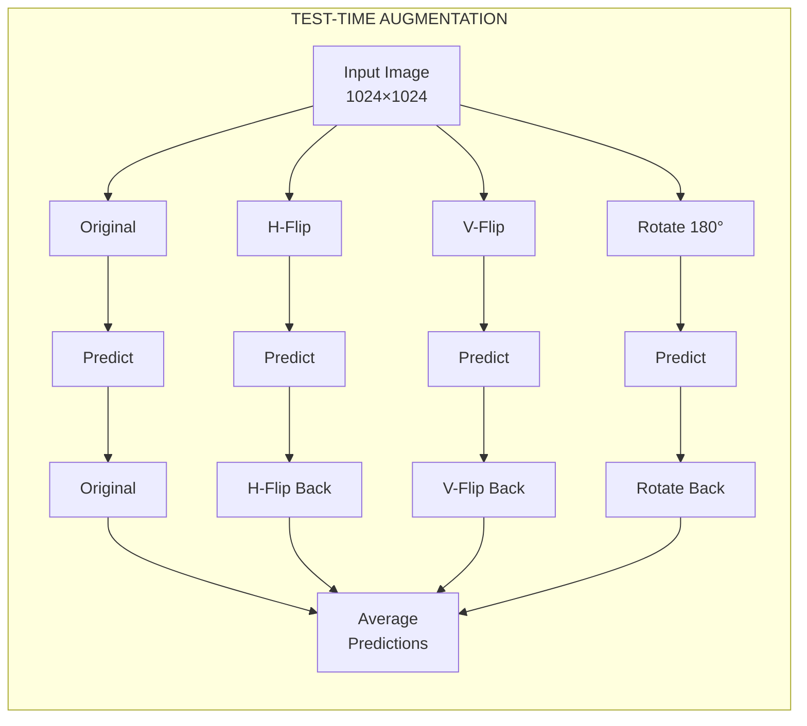

**Code TTA:**

```python
class TTAPredictor:
    """Test-Time Augmentation predictor với 4 augmentation."""

    def __init__(self, model, device='cuda'):
        self.model = model
        self.device = device

    def predict_with_tta(self, pre_image, post_image):
        """
        Dự đoán với TTA.

        Args:
            pre_image: Tensor [1, 3, H, W]
            post_image: Tensor [1, 3, H, W]

        Returns:
            averaged_prediction: Tensor [1, C, H, W]
        """
        predictions = []

        augmentations = [
            (lambda x: x, lambda x: x),  # Original
            (lambda x: torch.flip(x, dims=[3]), lambda x: torch.flip(x, dims=[3])),  # H-Flip
            (lambda x: torch.flip(x, dims=[2]), lambda x: torch.flip(x, dims=[2])),  # V-Flip
            (lambda x: torch.flip(x, dims=[2, 3]), lambda x: torch.flip(x, dims=[2, 3])),  # 180°
        ]

        with torch.no_grad():
            for aug_fn, inv_fn in augmentations:
                # Apply augmentation
                pre_aug = aug_fn(pre_image)
                post_aug = aug_fn(post_image)

                # Predict
                pred = self.model(pre_aug, post_aug)

                # Inverse augmentation
                pred_inv = inv_fn(pred)
                predictions.append(pred_inv)

        # Average all predictions
        averaged = torch.stack(predictions, dim=0).mean(dim=0)
        return averaged
```

---

## 3. Kiến Trúc và Triển Khai

### 3.1 Ensemble Bốn Encoder

Giải pháp sử dụng 4 encoder pretrained khác nhau, mỗi encoder với kích thước crop tương ứng:

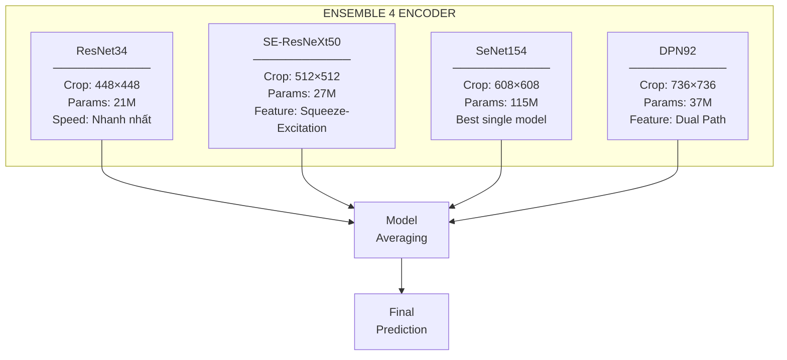

**Chi tiết từng encoder:**

| Encoder | Kích thước Crop | Params | Đặc điểm | Điểm F1 |
|---------|-----------------|--------|----------|---------|
| ResNet34 | 448×448 | 21M | Nhanh, baseline tốt | ~0.78 |
| SE-ResNeXt50 | 512×512 | 27M | Attention mechanism | ~0.81 |
| SeNet154 | 608×608 | 115M | Deep, best single | ~0.83 |
| DPN92 | 736×736 | 37M | ResNet + DenseNet hybrid | ~0.82 |

### 3.2 Kiến Trúc U-Net Decoder

Decoder theo phong cách U-Net với skip connections:

```python
class UNetDecoder(nn.Module):
    """
    U-Net style decoder với skip connections.
    Nhận feature maps đã concatenate từ Siamese encoder.
    """

    def __init__(self, encoder_channels, decoder_channels, num_classes=5):
        super().__init__()

        # encoder_channels: [64, 128, 256, 512, 1024] ví dụ
        # Nhân đôi vì concatenate pre+post
        in_channels = [c * 2 for c in encoder_channels]

        # Decoder blocks với upsampling
        self.decoder_blocks = nn.ModuleList()

        for i in range(len(in_channels) - 1, 0, -1):
            in_ch = in_channels[i] + decoder_channels[i] if i < len(in_channels) - 1 else in_channels[i]
            out_ch = decoder_channels[i - 1]

            self.decoder_blocks.append(
                DecoderBlock(in_ch, out_ch)
            )

        # Final segmentation head
        self.segmentation_head = nn.Conv2d(
            decoder_channels[0],
            num_classes,
            kernel_size=1
        )

    def forward(self, encoder_features):
        """
        Args:
            encoder_features: List of concatenated feature maps
                              từ sâu đến nông

        Returns:
            logits: [B, num_classes, H, W]
        """
        x = encoder_features[-1]  # Deepest features

        for i, decoder_block in enumerate(self.decoder_blocks):
            skip = encoder_features[-(i + 2)]  # Skip connection
            x = decoder_block(x, skip)

        logits = self.segmentation_head(x)
        return logits


class DecoderBlock(nn.Module):
    """Một block của decoder với upsampling và skip connection."""

    def __init__(self, in_channels, out_channels):
        super().__init__()

        self.upsample = nn.Upsample(scale_factor=2, mode='bilinear', align_corners=True)

        self.conv_block = nn.Sequential(
            nn.Conv2d(in_channels, out_channels, 3, padding=1, bias=False),
            nn.BatchNorm2d(out_channels),
            nn.ReLU(inplace=True),
            nn.Conv2d(out_channels, out_channels, 3, padding=1, bias=False),
            nn.BatchNorm2d(out_channels),
            nn.ReLU(inplace=True)
        )

    def forward(self, x, skip):
        x = self.upsample(x)
        x = torch.cat([x, skip], dim=1)
        x = self.conv_block(x)
        return x
```

### 3.3 Full Model Architecture

```python
class SiameseUNet(nn.Module):
    """
    Full Siamese U-Net cho xView2 damage assessment.
    Kết hợp Siamese encoder với U-Net decoder.
    """

    def __init__(self, backbone='resnet34', num_classes=5, pretrained=True):
        super().__init__()

        self.encoder = SiameseEncoder(backbone, pretrained)

        # Xác định số channels dựa trên backbone
        encoder_channels = self._get_encoder_channels(backbone)
        decoder_channels = [256, 128, 64, 32]

        self.decoder = UNetDecoder(
            encoder_channels,
            decoder_channels,
            num_classes
        )

    def _get_encoder_channels(self, backbone):
        """Trả về số channels ở mỗi giai đoạn của encoder."""
        if backbone == 'resnet34':
            return [64, 64, 128, 256, 512]
        elif backbone == 'seresnext50':
            return [64, 256, 512, 1024, 2048]
        elif backbone == 'senet154':
            return [128, 256, 512, 1024, 2048]
        elif backbone == 'dpn92':
            return [64, 336, 704, 1552, 2688]
        else:
            raise ValueError(f"Unknown backbone: {backbone}")

    def forward(self, pre_image, post_image):
        """
        Forward pass.

        Args:
            pre_image: [B, 3, H, W] ảnh trước thảm họa
            post_image: [B, 3, H, W] ảnh sau thảm họa

        Returns:
            logits: [B, num_classes, H, W] segmentation logits
        """
        # Trích xuất và concatenate features
        concat_features = self.encoder(pre_image, post_image)

        # Decode để ra segmentation
        logits = self.decoder(concat_features)

        return logits
```

### 3.4 Pipeline Suy Luận Hoàn Chỉnh

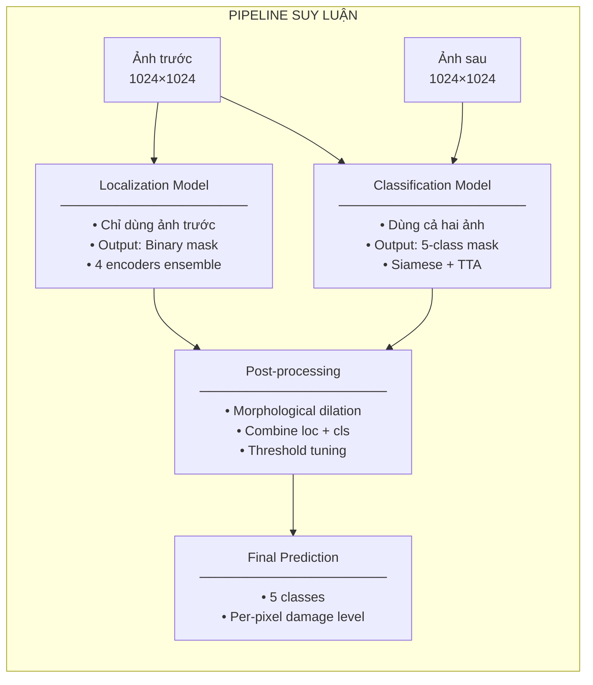

---

## 4. Huấn Luyện và Tối Ưu

### 4.1 Chiến Lược Chia Dữ Liệu

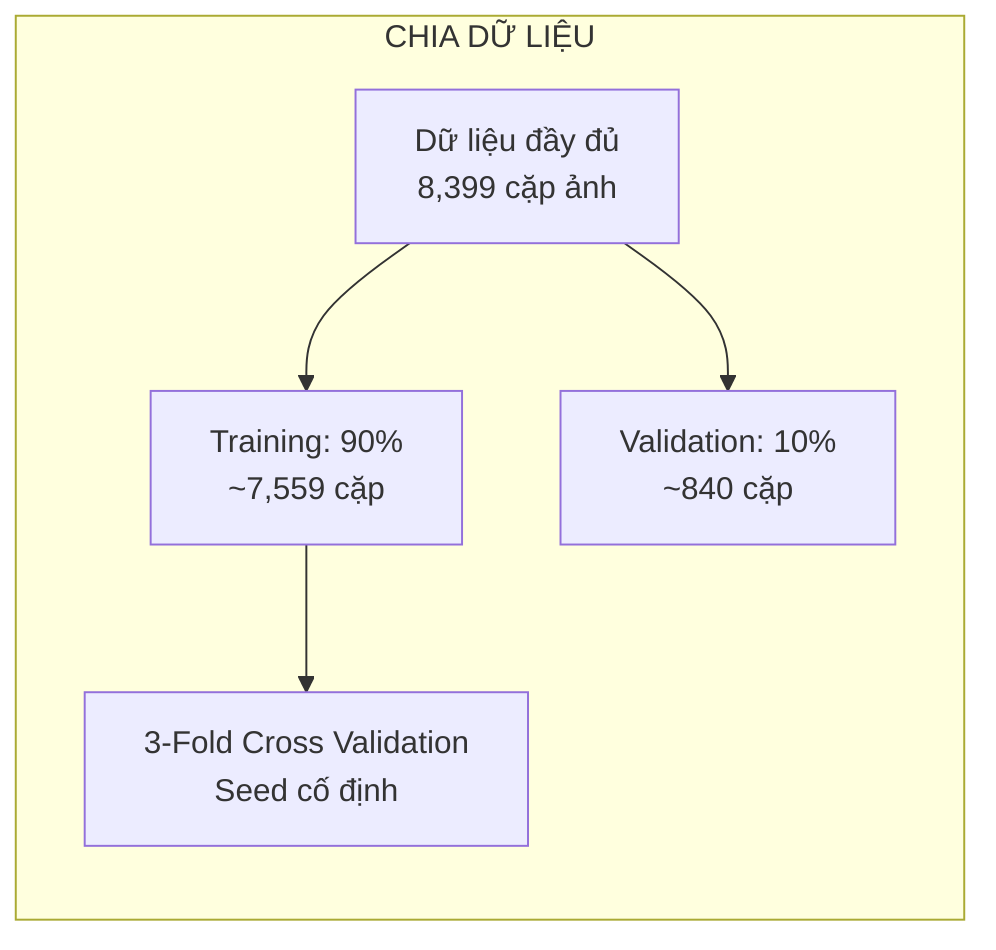

**Chiến lược quan trọng:**
- Chia theo thảm họa, không random - đảm bảo generalization
- Validation phải có đầy đủ các loại thiệt hại
- Seed cố định cho reproducibility

### 4.2 Hàm Mất Mát

**Giai đoạn Định vị:**
```python
class LocalizationLoss(nn.Module):
    """
    Loss function cho giai đoạn định vị.
    Kết hợp Dice Loss và Focal Loss cho binary segmentation.
    """

    def __init__(self, dice_weight=1.0, focal_weight=1.0):
        super().__init__()
        self.dice_weight = dice_weight
        self.focal_weight = focal_weight

    def dice_loss(self, pred, target, smooth=1e-6):
        """Dice loss cho overlap optimization."""
        pred = torch.sigmoid(pred)

        intersection = (pred * target).sum(dim=(2, 3))
        union = pred.sum(dim=(2, 3)) + target.sum(dim=(2, 3))

        dice = (2 * intersection + smooth) / (union + smooth)
        return 1 - dice.mean()

    def focal_loss(self, pred, target, alpha=0.25, gamma=2.0):
        """Focal loss cho class imbalance."""
        bce = F.binary_cross_entropy_with_logits(pred, target, reduction='none')

        pt = torch.exp(-bce)
        focal_term = alpha * (1 - pt) ** gamma * bce

        return focal_term.mean()

    def forward(self, pred, target):
        dice = self.dice_loss(pred, target)
        focal = self.focal_loss(pred, target)

        return self.dice_weight * dice + self.focal_weight * focal
```

**Giai đoạn Phân loại:**
```python
class ClassificationLoss(nn.Module):
    """
    Loss function cho giai đoạn phân loại.
    Kết hợp Dice, Focal, và Weighted Cross-Entropy.
    """

    def __init__(self, num_classes=5, class_weights=None):
        super().__init__()
        self.num_classes = num_classes

        # Trọng số cho các lớp thiệt hại
        if class_weights is None:
            # Tăng trọng số cho minor, major, destroyed
            class_weights = torch.tensor([1.0, 1.0, 2.0, 3.0, 4.0])

        self.class_weights = class_weights

    def multiclass_dice_loss(self, pred, target):
        """Dice loss cho multi-class segmentation."""
        pred = F.softmax(pred, dim=1)

        total_dice = 0
        for c in range(self.num_classes):
            pred_c = pred[:, c]
            target_c = (target == c).float()

            intersection = (pred_c * target_c).sum()
            union = pred_c.sum() + target_c.sum()

            dice = (2 * intersection + 1e-6) / (union + 1e-6)
            total_dice += dice * self.class_weights[c]

        return 1 - total_dice / self.class_weights.sum()

    def weighted_ce_loss(self, pred, target):
        """Weighted cross-entropy loss."""
        return F.cross_entropy(
            pred, target,
            weight=self.class_weights.to(pred.device)
        )

    def forward(self, pred, target):
        dice = self.multiclass_dice_loss(pred, target)
        ce = self.weighted_ce_loss(pred, target)

        return dice + 2.0 * ce  # CE có trọng số cao hơn
```

### 4.3 Optimizer và Scheduler

```python
def get_optimizer_scheduler(model, config):
    """
    Thiết lập optimizer và learning rate scheduler.
    """
    # AdamW với weight decay
    optimizer = torch.optim.AdamW(
        model.parameters(),
        lr=config.learning_rate,  # 1e-4 typical
        weight_decay=0.01
    )

    # Cosine annealing scheduler
    scheduler = torch.optim.lr_scheduler.CosineAnnealingLR(
        optimizer,
        T_max=config.epochs,
        eta_min=1e-7
    )

    return optimizer, scheduler
```

**Cấu hình huấn luyện:**

| Tham số | Giá trị |
|---------|---------|
| **Optimizer** | AdamW |
| **Learning Rate** | 1e-4 → 1e-7 (cosine) |
| **Weight Decay** | 0.01 |
| **Batch Size** | 4-8 (phụ thuộc GPU memory) |
| **Epochs** | 50-100 |

### 4.4 Xử Lý Mất Cân Bằng Lớp

Dataset xBD có mất cân bằng nghiêm trọng: 84% "No Damage":

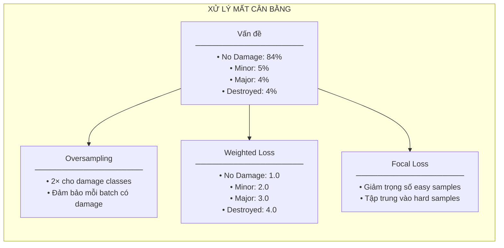

**Data sampler với oversampling:**

```python
class BalancedSampler(torch.utils.data.Sampler):
    """
    Sampler với oversampling cho các lớp thiệt hại.
    """

    def __init__(self, dataset, oversample_factor=2.0):
        self.dataset = dataset
        self.oversample_factor = oversample_factor

        # Phân loại samples theo có damage hay không
        self.no_damage_indices = []
        self.damage_indices = []

        for i, sample in enumerate(dataset):
            if sample['has_damage']:
                self.damage_indices.append(i)
            else:
                self.no_damage_indices.append(i)

        # Tính số samples sau oversampling
        n_damage_oversampled = int(len(self.damage_indices) * oversample_factor)
        self.total_samples = len(self.no_damage_indices) + n_damage_oversampled

    def __iter__(self):
        # No damage samples
        no_damage = list(self.no_damage_indices)

        # Oversample damage
        damage = list(self.damage_indices) * int(self.oversample_factor)

        # Kết hợp và shuffle
        all_indices = no_damage + damage
        random.shuffle(all_indices)

        return iter(all_indices)

    def __len__(self):
        return self.total_samples
```

### 4.5 Data Augmentation

```python
def get_training_augmentation():
    """
    Augmentation pipeline cho training.
    Áp dụng cho cả ảnh trước và sau.
    """
    return A.Compose([
        # Spatial transforms - áp dụng cho cả hai ảnh
        A.RandomRotate90(p=0.5),
        A.HorizontalFlip(p=0.5),
        A.VerticalFlip(p=0.5),

        # Scale và shift nhẹ
        A.ShiftScaleRotate(
            shift_limit=0.05,
            scale_limit=0.1,
            rotate_limit=15,
            p=0.5
        ),

        # Color augmentation
        A.OneOf([
            A.RandomBrightnessContrast(p=1),
            A.RandomGamma(p=1),
            A.HueSaturationValue(p=1),
        ], p=0.3),

        # Noise
        A.GaussNoise(var_limit=(10, 50), p=0.2),

        # Normalize
        A.Normalize(
            mean=[0.485, 0.456, 0.406],
            std=[0.229, 0.224, 0.225]
        ),

        ToTensorV2()
    ])
```

---

## 5. Kết Quả và Phân Tích

### 5.1 Hiệu Suất Tổng Thể

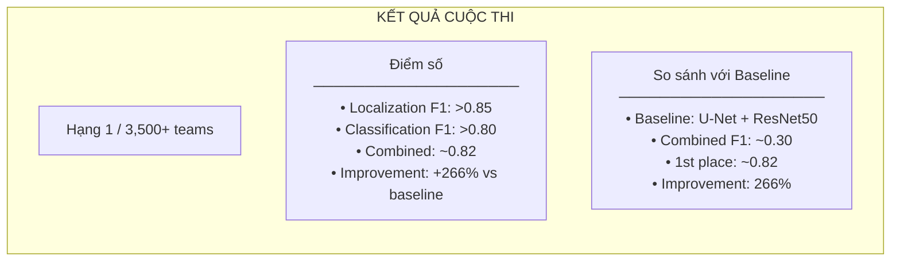

### 5.2 Hiệu Suất Theo Lớp

| Lớp | F1-Score | Precision | Recall | Ghi chú |
|-----|----------|-----------|--------|---------|
| No Damage | ~0.92 | 0.94 | 0.90 | Lớp đa số, dễ nhất |
| Minor Damage | ~0.65 | 0.60 | 0.71 | Khó phân biệt với No Damage |
| Major Damage | ~0.68 | 0.65 | 0.72 | Confusion với Minor/Destroyed |
| Destroyed | ~0.78 | 0.80 | 0.76 | Dấu hiệu trực quan rõ |

**Ma trận nhầm lẫn điển hình:**

```
                 Predicted
              ND    Minor   Major   Dest
Actual  ND   [92%]   5%      2%      1%
       Minor  20%  [65%]    12%      3%
       Major  10%   15%    [68%]     7%
       Dest    5%    5%     12%    [78%]
```

### 5.3 Phân Tích Theo Loại Thảm Họa

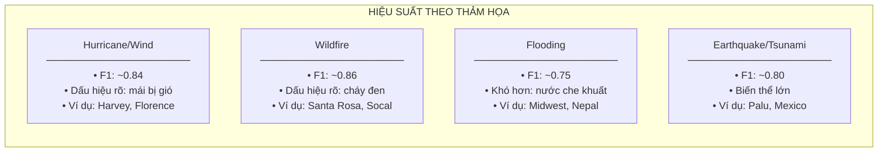

### 5.4 Ablation Study

**Đóng góp của từng component:**

| Component | F1 Improvement |
|-----------|----------------|
| Baseline (single ResNet34) | 0.72 |
| + Siamese architecture | +0.04 |
| + Multi-encoder ensemble | +0.03 |
| + TTA (4 augmentations) | +0.02 |
| + Morphological postprocess | +0.01 |
| + Class balancing | +0.02 |
| **Final** | **~0.82** |

### 5.5 Failure Cases

**Các trường hợp model gặp khó khăn:**

1. **Minor vs No Damage boundary**
   - Thiệt hại nhỏ như vết nứt khó phát hiện ở độ phân giải vệ tinh
   - Bóng đổ có thể bị nhầm với thiệt hại

2. **Occlusion từ cây cối**
   - Cây che khuất công trình
   - Lá cây thay đổi theo mùa gây false positives

3. **Góc chụp cực trị**
   - Off-nadir angle > 40° gây biến dạng lớn
   - Siamese vẫn có giới hạn

4. **Công trình nhỏ/dày đặc**
   - Khu vực đô thị đông đúc
   - Công trình < 20m² khó phân loại

---

## 6. Tái Tạo và Tài Nguyên

### 6.1 Yêu Cầu Phần Cứng

| Thành phần | Thông số tối thiểu | Khuyến nghị |
|------------|-------------------|-------------|
| **GPU** | 1× 12GB VRAM | 2× 24GB VRAM |
| **RAM** | 32GB | 64GB |
| **Storage** | 100GB SSD | 500GB NVMe |
| **CPU** | 8 cores | 16+ cores |

### 6.2 Cài Đặt Môi Trường

```bash
# Clone repository
git clone https://github.com/DIUx-xView/xView2_first_place.git
cd xView2_first_place

# Tạo conda environment
conda create -n xview2 python=3.7
conda activate xview2

# Cài đặt dependencies
pip install -r requirements.txt

# Dependencies chính:
# pytorch >= 1.4
# torchvision
# segmentation-models-pytorch
# albumentations
# opencv-python
# gdal
```

### 6.3 Download Pretrained Weights

```bash
# Download pretrained weights (~2GB)
wget https://vdurnov.s3.amazonaws.com/xview2_1st_weights.zip
unzip xview2_1st_weights.zip

# Cấu trúc weights:
# xview2_1st_weights/
# ├── localization/
# │   ├── resnet34_loc.pth
# │   ├── seresnext50_loc.pth
# │   ├── senet154_loc.pth
# │   └── dpn92_loc.pth
# └── classification/
#     ├── resnet34_cls.pth
#     ├── seresnext50_cls.pth
#     ├── senet154_cls.pth
#     └── dpn92_cls.pth
```

### 6.4 Training Pipeline

**Bước 1: Huấn luyện Localization**
```bash
python train_localization.py \
    --config configs/resnet34_loc.yaml \
    --data_path /path/to/xbd/train \
    --output_dir outputs/localization \
    --epochs 50 \
    --batch_size 8 \
    --lr 1e-4
```

**Bước 2: Huấn luyện Classification**
```bash
python train_classification.py \
    --config configs/resnet34_cls.yaml \
    --data_path /path/to/xbd/train \
    --loc_weights outputs/localization/best.pth \
    --output_dir outputs/classification \
    --epochs 100 \
    --batch_size 4 \
    --lr 1e-4
```

### 6.5 Inference Pipeline

```bash
# Inference trên một cặp ảnh
python predict.py \
    --pre_image path/to/pre.png \
    --post_image path/to/post.png \
    --output path/to/output.png \
    --weights_dir path/to/weights/ \
    --tta True

# Batch inference
python predict_batch.py \
    --input_dir path/to/images/ \
    --output_dir path/to/predictions/ \
    --weights_dir path/to/weights/
```

### 6.6 Inference Code Đầy Đủ

```python
import torch
import cv2
import numpy as np
from models import SiameseUNet
from utils import TTAPredictor, morphological_postprocess

def predict_damage(pre_path, post_path, weights_dir, device='cuda'):
    """
    Dự đoán thiệt hại cho một cặp ảnh.

    Args:
        pre_path: Path đến ảnh trước thảm họa
        post_path: Path đến ảnh sau thảm họa
        weights_dir: Directory chứa model weights
        device: 'cuda' hoặc 'cpu'

    Returns:
        prediction: numpy array [H, W] với giá trị 0-4
    """
    # Load models
    loc_models = []
    cls_models = []

    backbones = ['resnet34', 'seresnext50', 'senet154', 'dpn92']

    for backbone in backbones:
        # Localization model
        loc_model = SiameseUNet(backbone, num_classes=1)
        loc_model.load_state_dict(
            torch.load(f"{weights_dir}/localization/{backbone}_loc.pth")
        )
        loc_model.to(device).eval()
        loc_models.append(loc_model)

        # Classification model
        cls_model = SiameseUNet(backbone, num_classes=5)
        cls_model.load_state_dict(
            torch.load(f"{weights_dir}/classification/{backbone}_cls.pth")
        )
        cls_model.to(device).eval()
        cls_models.append(cls_model)

    # Load và preprocess images
    pre_image = load_and_preprocess(pre_path)
    post_image = load_and_preprocess(post_path)

    pre_tensor = torch.from_numpy(pre_image).unsqueeze(0).to(device)
    post_tensor = torch.from_numpy(post_image).unsqueeze(0).to(device)

    # Ensemble predictions
    loc_preds = []
    cls_preds = []

    for loc_model, cls_model in zip(loc_models, cls_models):
        # Localization với TTA
        tta = TTAPredictor(loc_model, device)
        loc_pred = tta.predict_with_tta(pre_tensor, pre_tensor)
        loc_preds.append(loc_pred)

        # Classification với TTA
        tta = TTAPredictor(cls_model, device)
        cls_pred = tta.predict_with_tta(pre_tensor, post_tensor)
        cls_preds.append(cls_pred)

    # Average predictions
    loc_mask = torch.stack(loc_preds).mean(0).sigmoid()
    cls_mask = torch.stack(cls_preds).mean(0).softmax(dim=1)

    # Combine localization and classification
    final = combine_predictions(loc_mask, cls_mask)

    # Postprocess
    final = morphological_postprocess(final.cpu().numpy(), kernel_size=5)

    return final
```

### 6.7 Tài Nguyên Bổ Sung

| Tài nguyên | Link |
|------------|------|
| **GitHub Repository** | [DIUx-xView/xView2_first_place](https://github.com/DIUx-xView/xView2_first_place) |
| **Pretrained Weights** | [S3 Download](https://vdurnov.s3.amazonaws.com/xview2_1st_weights.zip) |
| **xView2 Competition** | [xview2.org](https://xview2.org) |
| **xBD Dataset Paper** | [CVPR 2019](https://openaccess.thecvf.com/content_CVPRW_2019/papers/cv4gc/Gupta_Creating_xBD_A_Dataset_for_Assessing_Building_Damage_from_Satellite_CVPRW_2019_paper.pdf) |
| **arXiv Paper** | [1911.09296](https://arxiv.org/abs/1911.09296) |

### 6.8 Citation

```bibtex
@misc{xview2_first_place,
    title={1st Place Solution for xView2: Assess Building Damage Challenge},
    author={DIUx-xView Contributors},
    year={2019},
    howpublished={\url{https://github.com/DIUx-xView/xView2_first_place}}
}

@inproceedings{gupta2019xbd,
    title={Creating xBD: A Dataset for Assessing Building Damage from Satellite Imagery},
    author={Gupta, Ritwik and others},
    booktitle={CVPR Workshops},
    year={2019}
}
```

---

## Bài Học Quan Trọng

### Những Gì Hiệu Quả

1. **Pipeline hai giai đoạn** - Tách định vị khỏi phân loại cho phép tối ưu riêng
2. **Siamese encoder** - Xử lý lệch căn chỉnh off-nadir hiệu quả
3. **Ensemble đa backbone** - Kết hợp điểm mạnh của nhiều kiến trúc
4. **TTA chiến lược** - 4 augmentation đủ, thêm không cải thiện đáng kể
5. **Morphological postprocess** - Cải thiện độ chính xác biên với chi phí thấp

### Những Gì Không Hiệu Quả

1. **End-to-end một giai đoạn** - Quá phức tạp, khó tối ưu
2. **Encoder riêng biệt** - Không xử lý được lệch căn chỉnh
3. **Kích thước crop nhỏ** - Thiếu ngữ cảnh cần thiết
4. **Không trọng số lớp** - Bị chi phối bởi lớp "No Damage"

### Recommendations cho Practitioners

1. Bắt đầu với ResNet34 baseline, sau đó scale up
2. Ưu tiên Siamese architecture cho bài toán change detection
3. Luôn xử lý class imbalance (weighted loss + oversampling)
4. TTA đơn giản (flips) thường đủ, không cần phức tạp
5. Ensemble 3-4 models thường đủ, thêm có diminishing returns

---

*Tài liệu cập nhật: 2024-12-19*
*Tác giả tổng hợp: Từ official repository và analysis*
