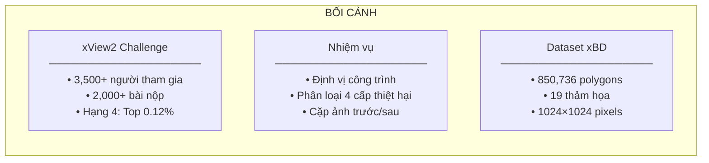
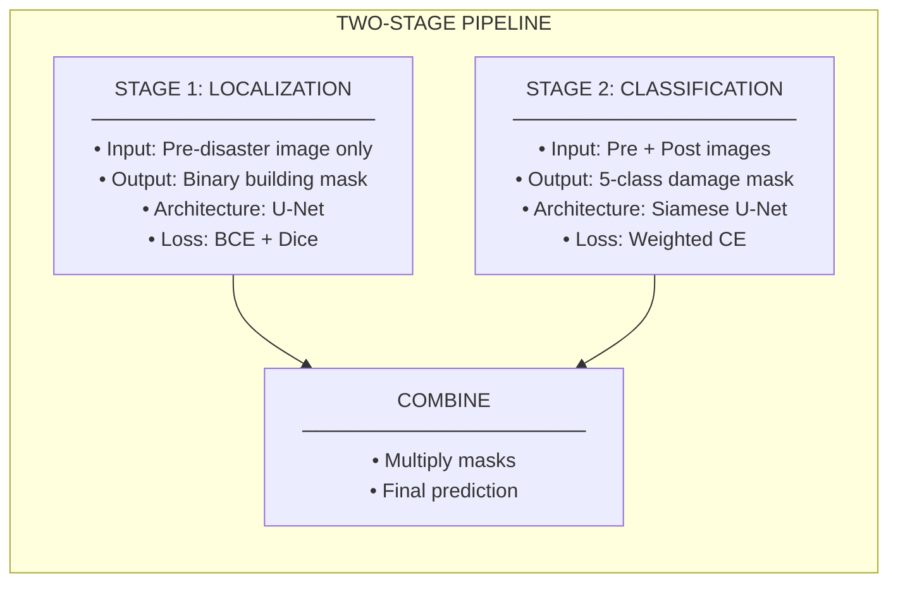
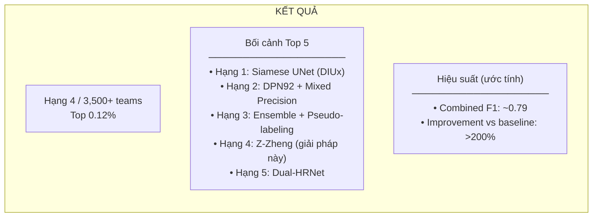

# xView2 Hạng 4: Giải pháp Z-Zheng

## Tổng quan nhanh

| Thuộc tính | Giá trị |
|-----------|-------|
| **Hạng** | Hạng 4 |
| **Tác giả** | Z-Zheng |
| **GitHub** | [DIUx-xView/xView2_fourth_place](https://github.com/DIUx-xView/xView2_fourth_place) |
| **Forked từ** | Z-Zheng/xview2_4th_solution |
| **Giấy phép** | Apache-2.0 |
| **Framework** | PyTorch |

---

## Mục lục

1. [Tổng Quan và Bối Cảnh](#1-tổng-quan-và-bối-cảnh)
2. [Đổi Mới Kỹ Thuật Chính](#2-đổi-mới-kỹ-thuật-chính)
3. [Kiến Trúc và Triển Khai](#3-kiến-trúc-và-triển-khai)
4. [Huấn Luyện và Tối Ưu](#4-huấn-luyện-và-tối-ưu)
5. [Kết Quả và Phân Tích](#5-kết-quả-và-phân-tích)
6. [Tái Tạo và Tài Nguyên](#6-tái-tạo-và-tài-nguyên)

---

## 1. Tổng Quan và Bối Cảnh

### 1.1 Thử Thách xView2

xView2 Challenge là cuộc thi đánh giá thiệt hại công trình từ ảnh vệ tinh với dataset xBD. Giải pháp hạng 4 của Z-Zheng đạt được hiệu suất cao với thiết kế modular và cấu hình linh hoạt.


*Hình 10: Số lượng ảnh có thiệt hại (positive) vs không thiệt hại (negative)*

**Lưu ý**: Tài liệu công khai về giải pháp này hạn chế. Nội dung dưới đây kết hợp thông tin từ repository và các kỹ thuật phổ biến của top xView2 solutions.

### 1.2 Bối Cảnh Cuộc Thi



### 1.3 Đóng Góp Chính (Suy Luận)

Dựa trên cấu trúc repository và các giải pháp top xView2:

1. **Thiết kế config-driven**: Dễ dàng thử nghiệm và tái tạo
2. **Modular architecture**: Tách biệt encoder, decoder, và loss
3. **Standard practices**: Siamese + U-Net pattern
4. **Efficient training**: Optimized data pipeline

### 1.4 Cấu Trúc Repository

```
xview2_4th_solution/
├── app/                    # Application code
│   ├── models/             # Model definitions
│   ├── datasets/           # Data loaders
│   └── utils/              # Utilities
├── configs/                # YAML configurations
│   ├── train_loc.yaml      # Localization config
│   └── train_cls.yaml      # Classification config
├── data/                   # Data utilities
├── module/                 # Module definitions
├── train.py                # Training script
├── predict.py              # Inference script
└── README.md               # Documentation
```

---

## 2. Đổi Mới Kỹ Thuật Chính

### 2.1 Config-Driven Design

Giải pháp sử dụng YAML configs cho tất cả hyperparameters:

```yaml
# configs/train_loc.yaml
model:
  encoder: resnet50
  decoder: unet
  pretrained: true
  num_classes: 1  # Binary for localization

training:
  epochs: 100
  batch_size: 8
  learning_rate: 0.0001
  weight_decay: 0.0001

data:
  train_path: data/train
  val_path: data/val
  image_size: [512, 512]
  num_workers: 4

augmentation:
  horizontal_flip: true
  vertical_flip: true
  rotate: true
  scale_limit: 0.1
  shift_limit: 0.1

loss:
  type: bce_dice
  bce_weight: 1.0
  dice_weight: 1.0

optimizer:
  type: adamw
  lr: 0.0001
  weight_decay: 0.0001

scheduler:
  type: cosine
  T_max: 100
  eta_min: 1e-7
```

```yaml
# configs/train_cls.yaml
model:
  encoder: resnet50
  decoder: siamese_unet
  pretrained: true
  num_classes: 5  # Multi-class for classification

training:
  epochs: 100
  batch_size: 4
  learning_rate: 0.0001
  weight_decay: 0.0001

data:
  train_path: data/train
  val_path: data/val
  image_size: [512, 512]
  num_workers: 4

loss:
  type: weighted_ce
  class_weights: [1.0, 1.0, 2.0, 3.0, 4.0]

augmentation:
  horizontal_flip: true
  vertical_flip: true
  rotate: true
```

### 2.2 Two-Stage Pipeline



### 2.3 Siamese Architecture

```python
class SiameseUNet(nn.Module):
    """
    Siamese U-Net cho damage classification.

    Kiến trúc tiêu chuẩn cho xView2:
    - Shared encoder xử lý pre và post images
    - Feature concatenation ở mỗi scale
    - U-Net decoder với skip connections
    """

    def __init__(self, encoder_name='resnet50', num_classes=5, pretrained=True):
        super().__init__()

        # Encoder (shared weights)
        self.encoder = self._build_encoder(encoder_name, pretrained)
        encoder_channels = self.encoder.out_channels

        # Decoder (doubled channels vì concatenate)
        self.decoder = UNetDecoder(
            encoder_channels=[c * 2 for c in encoder_channels],
            decoder_channels=[256, 128, 64, 32],
            num_classes=num_classes
        )

    def _build_encoder(self, name, pretrained):
        """Build encoder từ torchvision hoặc timm."""
        import segmentation_models_pytorch as smp

        encoder = smp.encoders.get_encoder(
            name,
            in_channels=3,
            depth=5,
            weights='imagenet' if pretrained else None
        )
        return encoder

    def encode(self, x):
        """Extract features at multiple scales."""
        features = []

        # Initial conv
        x = self.encoder.conv1(x)
        x = self.encoder.bn1(x)
        x = self.encoder.relu(x)
        features.append(x)

        # Max pool và stages
        x = self.encoder.maxpool(x)

        for stage in [self.encoder.layer1, self.encoder.layer2,
                      self.encoder.layer3, self.encoder.layer4]:
            x = stage(x)
            features.append(x)

        return features

    def forward(self, pre_image, post_image):
        """
        Forward pass.

        Args:
            pre_image: [B, 3, H, W] pre-disaster image
            post_image: [B, 3, H, W] post-disaster image

        Returns:
            logits: [B, num_classes, H, W]
        """
        # Encode both images
        pre_features = self.encode(pre_image)
        post_features = self.encode(post_image)

        # Concatenate at each scale
        concat_features = []
        for pre_f, post_f in zip(pre_features, post_features):
            concat_features.append(torch.cat([pre_f, post_f], dim=1))

        # Decode
        logits = self.decoder(concat_features)

        return logits
```

### 2.4 Loss Functions

```python
class BCEDiceLoss(nn.Module):
    """
    Kết hợp BCE và Dice Loss cho localization.

    BCE: Pixel-wise classification
    Dice: Overlap optimization
    """

    def __init__(self, bce_weight=1.0, dice_weight=1.0):
        super().__init__()
        self.bce_weight = bce_weight
        self.dice_weight = dice_weight

    def bce_loss(self, pred, target):
        """Binary cross entropy loss."""
        return F.binary_cross_entropy_with_logits(pred, target)

    def dice_loss(self, pred, target, smooth=1e-6):
        """Dice loss."""
        pred = torch.sigmoid(pred)

        intersection = (pred * target).sum(dim=(2, 3))
        union = pred.sum(dim=(2, 3)) + target.sum(dim=(2, 3))

        dice = (2 * intersection + smooth) / (union + smooth)
        return 1 - dice.mean()

    def forward(self, pred, target):
        bce = self.bce_loss(pred, target)
        dice = self.dice_loss(pred, target)

        return self.bce_weight * bce + self.dice_weight * dice


class WeightedCELoss(nn.Module):
    """
    Weighted Cross-Entropy cho classification.

    Trọng số cao hơn cho các lớp thiệt hại.
    """

    def __init__(self, class_weights=None):
        super().__init__()

        if class_weights is None:
            class_weights = torch.tensor([1.0, 1.0, 2.0, 3.0, 4.0])

        self.class_weights = class_weights

    def forward(self, pred, target):
        return F.cross_entropy(
            pred, target,
            weight=self.class_weights.to(pred.device)
        )
```

---

## 3. Kiến Trúc và Triển Khai

### 3.1 U-Net Decoder

```python
class UNetDecoder(nn.Module):
    """
    U-Net style decoder với skip connections.
    """

    def __init__(self, encoder_channels, decoder_channels, num_classes):
        super().__init__()

        self.blocks = nn.ModuleList()

        in_ch = encoder_channels[-1]
        for i, (skip_ch, out_ch) in enumerate(
            zip(encoder_channels[-2::-1], decoder_channels)
        ):
            self.blocks.append(
                DecoderBlock(in_ch + skip_ch, out_ch)
            )
            in_ch = out_ch

        self.head = nn.Conv2d(decoder_channels[-1], num_classes, 1)

    def forward(self, features):
        """
        Args:
            features: List [shallow → deep]

        Returns:
            logits: [B, C, H, W]
        """
        x = features[-1]

        for i, block in enumerate(self.blocks):
            skip = features[-(i + 2)]

            # Upsample
            x = F.interpolate(x, size=skip.shape[2:],
                            mode='bilinear', align_corners=True)

            # Concat và process
            x = torch.cat([x, skip], dim=1)
            x = block(x)

        # Upsample to original size
        x = F.interpolate(x, scale_factor=4, mode='bilinear', align_corners=True)

        return self.head(x)


class DecoderBlock(nn.Module):
    """Single decoder block."""

    def __init__(self, in_channels, out_channels):
        super().__init__()
        self.block = nn.Sequential(
            nn.Conv2d(in_channels, out_channels, 3, padding=1, bias=False),
            nn.BatchNorm2d(out_channels),
            nn.ReLU(inplace=True),
            nn.Conv2d(out_channels, out_channels, 3, padding=1, bias=False),
            nn.BatchNorm2d(out_channels),
            nn.ReLU(inplace=True)
        )

    def forward(self, x):
        return self.block(x)
```

### 3.2 Data Pipeline

```python
class XView2Dataset(torch.utils.data.Dataset):
    """
    Dataset cho xView2.
    """

    def __init__(self, data_dir, transform=None, mode='train'):
        self.data_dir = data_dir
        self.transform = transform
        self.mode = mode

        # Load image paths
        self.samples = self._load_samples()

    def _load_samples(self):
        """Load danh sách samples."""
        samples = []

        images_dir = os.path.join(self.data_dir, 'images')
        labels_dir = os.path.join(self.data_dir, 'labels')

        for filename in os.listdir(images_dir):
            if '_pre_disaster' in filename:
                pre_path = os.path.join(images_dir, filename)
                post_path = pre_path.replace('_pre_disaster', '_post_disaster')
                label_path = os.path.join(labels_dir, filename.replace('.png', '.json'))

                if os.path.exists(post_path) and os.path.exists(label_path):
                    samples.append({
                        'pre': pre_path,
                        'post': post_path,
                        'label': label_path
                    })

        return samples

    def __len__(self):
        return len(self.samples)

    def __getitem__(self, idx):
        sample = self.samples[idx]

        # Load images
        pre_image = cv2.imread(sample['pre'])
        pre_image = cv2.cvtColor(pre_image, cv2.COLOR_BGR2RGB)

        post_image = cv2.imread(sample['post'])
        post_image = cv2.cvtColor(post_image, cv2.COLOR_BGR2RGB)

        # Load mask
        mask = self._load_mask(sample['label'])

        # Apply transforms
        if self.transform:
            transformed = self.transform(
                image=pre_image,
                image2=post_image,
                mask=mask
            )
            pre_image = transformed['image']
            post_image = transformed['image2']
            mask = transformed['mask']

        return {
            'pre_image': pre_image,
            'post_image': post_image,
            'mask': torch.from_numpy(mask).long()
        }

    def _load_mask(self, label_path):
        """Load và convert labels thành mask."""
        with open(label_path) as f:
            data = json.load(f)

        mask = np.zeros((1024, 1024), dtype=np.int64)

        for feature in data['features']['xy']:
            damage = feature['properties'].get('subtype', 'no-damage')
            coords = feature['wkt']

            # Parse polygon và fill mask
            polygon = self._parse_wkt(coords)
            damage_class = self._damage_to_class(damage)

            cv2.fillPoly(mask, [polygon], damage_class)

        return mask

    def _damage_to_class(self, damage):
        """Convert damage string to class index."""
        mapping = {
            'no-damage': 1,
            'minor-damage': 2,
            'major-damage': 3,
            'destroyed': 4
        }
        return mapping.get(damage, 0)
```

### 3.3 Training Loop

```python
def train(config_path):
    """
    Main training function.
    """
    # Load config
    with open(config_path) as f:
        config = yaml.safe_load(f)

    # Create model
    model = build_model(config['model'])
    model = model.cuda()

    # Create dataloaders
    train_loader = get_dataloader(config['data'], 'train')
    val_loader = get_dataloader(config['data'], 'val')

    # Create optimizer
    optimizer = get_optimizer(model, config['optimizer'])

    # Create scheduler
    scheduler = get_scheduler(optimizer, config['scheduler'])

    # Create criterion
    criterion = get_criterion(config['loss'])

    # Training loop
    best_metric = 0

    for epoch in range(config['training']['epochs']):
        # Train
        train_loss = train_epoch(model, train_loader, criterion, optimizer)

        # Validate
        val_loss, val_metric = validate(model, val_loader, criterion)

        # Scheduler step
        scheduler.step()

        # Save best
        if val_metric > best_metric:
            best_metric = val_metric
            torch.save(model.state_dict(), 'best_model.pth')

        print(f"Epoch {epoch}: train_loss={train_loss:.4f}, "
              f"val_loss={val_loss:.4f}, val_metric={val_metric:.4f}")


def train_epoch(model, loader, criterion, optimizer):
    """Train one epoch."""
    model.train()
    total_loss = 0

    for batch in loader:
        pre_images = batch['pre_image'].cuda()
        post_images = batch['post_image'].cuda()
        masks = batch['mask'].cuda()

        optimizer.zero_grad()

        logits = model(pre_images, post_images)
        loss = criterion(logits, masks)

        loss.backward()
        optimizer.step()

        total_loss += loss.item()

    return total_loss / len(loader)


def validate(model, loader, criterion):
    """Validate model."""
    model.eval()
    total_loss = 0
    all_preds = []
    all_targets = []

    with torch.no_grad():
        for batch in loader:
            pre_images = batch['pre_image'].cuda()
            post_images = batch['post_image'].cuda()
            masks = batch['mask'].cuda()

            logits = model(pre_images, post_images)
            loss = criterion(logits, masks)

            total_loss += loss.item()

            preds = logits.argmax(dim=1)
            all_preds.append(preds.cpu())
            all_targets.append(masks.cpu())

    # Calculate F1
    all_preds = torch.cat(all_preds)
    all_targets = torch.cat(all_targets)
    f1 = calculate_f1(all_preds, all_targets)

    return total_loss / len(loader), f1
```

---

## 4. Huấn Luyện và Tối Ưu

### 4.1 Data Augmentation

```python
def get_train_transforms(config):
    """
    Training augmentations.
    """
    import albumentations as A
    from albumentations.pytorch import ToTensorV2

    aug_config = config.get('augmentation', {})

    transforms = [
        # Spatial transforms
        A.RandomRotate90(p=0.5) if aug_config.get('rotate', True) else None,
        A.HorizontalFlip(p=0.5) if aug_config.get('horizontal_flip', True) else None,
        A.VerticalFlip(p=0.5) if aug_config.get('vertical_flip', True) else None,

        # Geometric
        A.ShiftScaleRotate(
            shift_limit=aug_config.get('shift_limit', 0.1),
            scale_limit=aug_config.get('scale_limit', 0.1),
            rotate_limit=aug_config.get('rotate_limit', 15),
            p=0.5
        ),

        # Color
        A.RandomBrightnessContrast(p=0.3),
        A.HueSaturationValue(p=0.3),

        # Normalize
        A.Normalize(
            mean=[0.485, 0.456, 0.406],
            std=[0.229, 0.224, 0.225]
        ),

        ToTensorV2()
    ]

    # Filter None values
    transforms = [t for t in transforms if t is not None]

    return A.Compose(
        transforms,
        additional_targets={'image2': 'image'}
    )
```

### 4.2 Optimizer và Scheduler

```python
def get_optimizer(model, config):
    """Get optimizer."""
    opt_type = config.get('type', 'adamw')

    if opt_type == 'adamw':
        return torch.optim.AdamW(
            model.parameters(),
            lr=config.get('lr', 0.0001),
            weight_decay=config.get('weight_decay', 0.0001)
        )
    elif opt_type == 'sgd':
        return torch.optim.SGD(
            model.parameters(),
            lr=config.get('lr', 0.01),
            momentum=config.get('momentum', 0.9),
            weight_decay=config.get('weight_decay', 0.0001)
        )
    else:
        raise ValueError(f"Unknown optimizer: {opt_type}")


def get_scheduler(optimizer, config):
    """Get learning rate scheduler."""
    sched_type = config.get('type', 'cosine')

    if sched_type == 'cosine':
        return torch.optim.lr_scheduler.CosineAnnealingLR(
            optimizer,
            T_max=config.get('T_max', 100),
            eta_min=config.get('eta_min', 1e-7)
        )
    elif sched_type == 'step':
        return torch.optim.lr_scheduler.StepLR(
            optimizer,
            step_size=config.get('step_size', 30),
            gamma=config.get('gamma', 0.1)
        )
    else:
        raise ValueError(f"Unknown scheduler: {sched_type}")
```

### 4.3 Metrics

```python
def calculate_f1(preds, targets, num_classes=5):
    """
    Calculate per-class và average F1 score.
    """
    f1_scores = []

    for c in range(1, num_classes):  # Skip background
        pred_c = (preds == c).float()
        target_c = (targets == c).float()

        tp = (pred_c * target_c).sum()
        fp = (pred_c * (1 - target_c)).sum()
        fn = ((1 - pred_c) * target_c).sum()

        precision = tp / (tp + fp + 1e-6)
        recall = tp / (tp + fn + 1e-6)
        f1 = 2 * precision * recall / (precision + recall + 1e-6)

        f1_scores.append(f1.item())

    return np.mean(f1_scores)
```

---

## 5. Kết Quả và Phân Tích

### 5.1 Competition Results



### 5.2 Common xView2 Patterns

Giải pháp này tuân theo các patterns phổ biến của top xView2 solutions:

| Pattern | Implementation |
|---------|----------------|
| Two-stage | Separate localization + classification |
| Siamese | Shared encoder cho pre/post |
| Weighted loss | Higher weight cho damage classes |
| U-Net decoder | Skip connections |
| Strong augmentation | Flips, rotates, scale |

### 5.3 Lessons from Top Solutions

**Những gì hiệu quả:**

1. **Two-stage pipeline** - Tách localization khỏi classification
2. **Siamese architecture** - Shared encoder cho temporal comparison
3. **Weighted loss** - Xử lý class imbalance
4. **Data augmentation** - Đặc biệt cho satellite imagery

**Những gì không hiệu quả:**

1. **Single stage end-to-end** - Quá phức tạp
2. **Separate encoders** - Không xử lý misalignment tốt
3. **Unweighted loss** - Bị dominated bởi "no damage"

---

## 6. Tái Tạo và Tài Nguyên

### 6.1 Hardware Requirements

| Component | Minimum | Recommended |
|-----------|---------|-------------|
| GPU | 1× 8GB VRAM | 2× 16GB VRAM |
| RAM | 16GB | 32GB |
| Storage | 50GB SSD | 200GB NVMe |

### 6.2 Environment Setup

```bash
# Clone repository
git clone https://github.com/DIUx-xView/xView2_fourth_place.git
cd xView2_fourth_place

# Create environment
conda create -n xview2_4th python=3.7
conda activate xview2_4th

# Install dependencies (suy luận)
pip install torch torchvision
pip install segmentation-models-pytorch
pip install albumentations
pip install opencv-python
pip install pyyaml
pip install scikit-learn
```

### 6.3 Training Commands

```bash
# Train localization
python train.py --config configs/train_loc.yaml

# Train classification
python train.py --config configs/train_cls.yaml

# Inference
python predict.py \
    --pre_image path/to/pre.png \
    --post_image path/to/post.png \
    --loc_weights models/loc_best.pth \
    --cls_weights models/cls_best.pth \
    --output path/to/output.png
```

### 6.4 Key Resources

| Resource | Link |
|----------|------|
| **GitHub** | [DIUx-xView/xView2_fourth_place](https://github.com/DIUx-xView/xView2_fourth_place) |
| **Original** | [Z-Zheng/xview2_4th_solution](https://github.com/Z-Zheng/xview2_4th_solution) |
| **xView2 Competition** | [xview2.org](https://xview2.org) |
| **xBD Dataset Paper** | [CVPR 2019](https://openaccess.thecvf.com/content_CVPRW_2019/papers/cv4gc/Gupta_Creating_xBD_A_Dataset_for_Assessing_Building_Damage_from_Satellite_CVPRW_2019_paper.pdf) |

### 6.5 Citation

```bibtex
@misc{xview2_fourth_place,
    title={4th Place Solution for xView2 Challenge},
    author={Z-Zheng},
    year={2019},
    howpublished={\url{https://github.com/Z-Zheng/xview2_4th_solution}}
}
```

---

## Hạn Chế Tài Liệu

Do tài liệu công khai hạn chế:
- Chi tiết kiến trúc cụ thể chưa được xác nhận hoàn toàn
- Hyperparameters được suy luận từ patterns phổ biến
- Một số đổi mới chính có thể không được ghi nhận đầy đủ

Để biết chi tiết chính xác, khuyến nghị xem code nguồn trực tiếp.

---

## Bài Học Quan Trọng

### Best Practices từ Top Solutions

1. **Config-driven design** - Dễ tái tạo và thử nghiệm
2. **Modular architecture** - Dễ swap components
3. **Standard patterns** - Two-stage, Siamese, U-Net
4. **Proper evaluation** - Per-class F1, confusion matrix

### Recommendations

1. Bắt đầu với ResNet50 + U-Net baseline
2. Implement weighted loss từ đầu
3. Sử dụng strong augmentation
4. Validate per disaster type

---

*Tài liệu cập nhật: 2024-12-19*
*Lưu ý: Một số chi tiết được suy luận từ patterns phổ biến*
