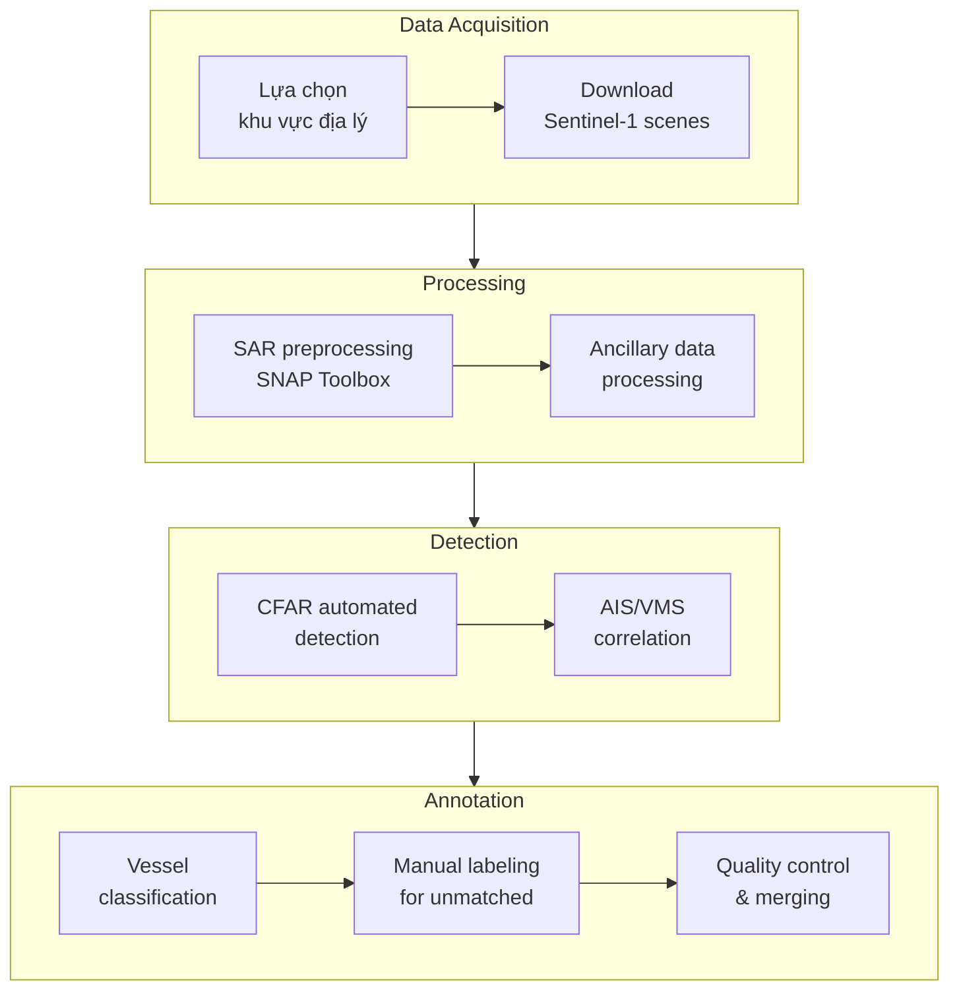

# Bộ Dữ Liệu xView3-SAR: Phát Hiện Tàu Thuyền Hàng Hải và Đánh Cá Bất Hợp Pháp

## Tổng Quan

| Thuộc tính | Giá trị |
|-----------|---------|
| **Tên chính thức** | xView3-SAR (Synthetic Aperture Radar) |
| **Năm phát hành** | 2021-2022 |
| **Đơn vị tổ chức** | Defense Innovation Unit (DIU), Global Fishing Watch (GFW) |
| **Nhiệm vụ** | Maritime Detection + Vessel Classification |
| **Trọng tâm** | Phát hiện "dark fishing" (tàu đánh cá IUU) |
| **Cuộc thi** | xView3 Challenge |
| **Giải thưởng** | $150,000 USD |
| **Số người đăng ký** | 1,900 từ 67 quốc gia |
| **Bài báo** | [xView3-SAR: Detecting Dark Fishing Activity (NeurIPS 2022)](https://arxiv.org/abs/2206.00897) |
| **GitHub** | [DIUx-xView/xview3-reference](https://github.com/DIUx-xView/xview3-reference) |

---

## 1. Giới Thiệu và Bối Cảnh

### 1.1. Vấn Nạn Đánh Cá IUU Toàn Cầu

Đánh cá bất hợp pháp, không báo cáo và không quản lý (IUU - Illegal, Unreported, and Unregulated fishing) là một trong những thách thức lớn nhất đối với sự bền vững của đại dương. Theo ước tính của FAO và các tổ chức quốc tế, IUU fishing gây thiệt hại từ 10 đến 23 tỷ USD mỗi năm cho nền kinh tế toàn cầu. Nhưng con số này chỉ phản ánh một phần nhỏ của vấn đề - hậu quả thực sự còn bao gồm sự suy kiệt nguồn cá, phá hủy hệ sinh thái biển, đe dọa an ninh lương thực cho hàng triệu người phụ thuộc vào nghề cá, và thường đi kèm với các vi phạm nhân quyền như lao động cưỡng bức.

Thách thức lớn nhất trong việc chống IUU fishing là phát hiện các "tàu tối" (dark vessels) - những tàu cố tình tắt hệ thống AIS (Automatic Identification System) để tránh bị theo dõi. AIS là hệ thống bắt buộc cho tàu thương mại trên 300 tấn và tàu đánh cá trên 15 mét ở nhiều vùng biển, phát sóng liên tục vị trí, hướng đi, tốc độ và nhận dạng của tàu. Tuy nhiên, các tàu đánh cá bất hợp pháp thường tắt AIS khi hoạt động trong vùng cấm hoặc vượt quá hạn ngạch, khiến việc giám sát bằng phương pháp truyền thống trở nên vô hiệu.

### 1.2. Radar Tổng Hợp Khẩu Độ (SAR) Như Giải Pháp

Synthetic Aperture Radar (SAR) cung cấp khả năng giám sát độc nhất vô nhị cho bài toán phát hiện dark vessels. Khác với ảnh quang học từ các vệ tinh như WorldView hay Pléiades, SAR hoạt động bằng cách phát sóng radar và thu tín hiệu phản hồi, không phụ thuộc vào ánh sáng mặt trời hay điều kiện thời tiết.


*SAR imagery demonstrating all-weather detection capabilities*

**Ưu điểm của SAR so với ảnh quang học:**
- **Hoạt động 24/7:** Không cần ánh sáng mặt trời, chụp ảnh được cả ban đêm
- **Xuyên mây:** Sóng radar C-band có thể xuyên qua mây, sương mù, mưa
- **Mọi thời tiết:** Không bị ảnh hưởng bởi điều kiện khí quyển
- **Chiếu sáng nhất quán:** Cường độ tín hiệu phản hồi phụ thuộc vào vật liệu và hình dạng, không phụ thuộc góc mặt trời

Sentinel-1, vệ tinh SAR của European Space Agency (ESA), cung cấp dữ liệu miễn phí với tần suất tái viếng 6 ngày (3 ngày với chùm hai vệ tinh), cho phép giám sát toàn cầu liên tục. Đây là nguồn dữ liệu chính cho xView3-SAR.

### 1.3. Sự Ra Đời của xView3

xView3 được khởi xướng vào năm 2021 như sự hợp tác giữa Defense Innovation Unit (DIU) và Global Fishing Watch (GFW). GFW là tổ chức phi lợi nhuận quốc tế chuyên về minh bạch hoạt động đánh cá, sử dụng dữ liệu vệ tinh và machine learning để theo dõi hoạt động của tàu cá trên toàn cầu. Sự hợp tác này kết hợp chuyên môn về AI/ML của DIU với kinh nghiệm domain về nghề cá và dữ liệu AIS của GFW.

Mục tiêu của xView3 Challenge là phát triển các thuật toán có thể:
1. Phát hiện tất cả đối tượng hàng hải (tàu thuyền và cơ sở hạ tầng) từ ảnh SAR
2. Phân loại đối tượng là tàu thuyền hay cơ sở hạ tầng cố định
3. Xác định tàu nào đang hoạt động đánh cá
4. Ước tính chiều dài của tàu

Đây là bài toán phức tạp hơn đáng kể so với xView1 và xView2: không chỉ phải phát hiện và phân loại object, mà còn phải suy luận về hành vi (đang đánh cá hay không) từ một snapshot duy nhất.

### 1.4. Thách Thức Kỹ Thuật Độc Đáo

xView3 đặt ra những thách thức kỹ thuật mà xView1 và xView2 không có:

**1. Dữ liệu SAR thay vì quang học:**
SAR imaging tạo ra ảnh grayscale với đặc tính hoàn toàn khác ảnh RGB. Cường độ pixel phản ánh radar backscatter - phụ thuộc vào độ nhám bề mặt, góc tới, và thuộc tính điện từ của vật liệu. Tàu kim loại có backscatter rất mạnh, tạo ra bright spots trên nền biển tối hơn. Tuy nhiên, noise (speckle), sóng biển, và các artifact khác có thể gây false positives.

**2. Kích thước ảnh khổng lồ:**
Mỗi scene Sentinel-1 có kích thước trung bình 29,400 × 24,400 pixels, lớn hơn nhiều so với tiles 1024×1024 trong xView1/xView2. Với 991 scenes, tổng số pixel lên tới 1,400 gigapixels - gấp 4.7 lần MS-COCO và lớn hơn 100 lần so với dataset SAR ship detection lớn thứ hai.

**3. Class imbalance cực đoan:**
Trong một ảnh 29,400 × 24,400 pixels (≈720 triệu pixels), chỉ có vài chục đến vài trăm pixels thuộc về tàu thuyền. Tỷ lệ object-to-background là khoảng 0.01%, nghĩa là 99.99% pixels là background (biển).

**4. Point labels thay vì bounding boxes:**
Không giống xView1 (horizontal bounding boxes) hay xView2 (polygons), xView3 chỉ cung cấp tọa độ điểm trung tâm của mỗi đối tượng. Điều này hạn chế việc sử dụng các object detector truyền thống như Faster R-CNN hay YOLO.

**5. Noisy labels:**
Labels được tạo tự động từ việc matching SAR detections với AIS tracks. Các tàu tắt AIS (chính xác là những tàu cần phát hiện) không có ground truth. Dataset training chủ yếu chứa các tàu "sáng" (có AIS), trong khi mục tiêu là phát hiện tàu "tối".

### 1.5. Tác Động Thực Tiễn

xView3 không chỉ là bài toán học thuật - các giải pháp chiến thắng đã được Global Fishing Watch tích hợp vào hệ thống giám sát thực tế. Hệ thống có thể quét toàn bộ đại dương được Sentinel-1 cover trong một ngày, phát hiện hàng nghìn tàu và flag những tàu không có tín hiệu AIS tương ứng cho việc điều tra thêm.

Ứng dụng thực tế bao gồm:
- Hỗ trợ các cơ quan quản lý nghề cá quốc gia giám sát vùng đặc quyền kinh tế
- Phát hiện hoạt động đánh cá bất hợp pháp trong các khu bảo tồn biển
- Theo dõi transshipment (chuyển tải) - hoạt động thường liên quan đến IUU
- Hỗ trợ các tổ chức bảo tồn trong việc bảo vệ biodiversity biển

---

## 2. Thông Số Kỹ Thuật và Thống Kê

### 2.1. Quy Mô Dataset

xView3-SAR là dataset SAR ship detection lớn nhất từng được công bố, vượt xa các benchmark trước đó về mọi thước đo.


*Sample SAR imagery showing various vessel types and maritime objects*

| Chỉ số | Giá trị |
|--------|---------|
| **Tổng số scene SAR** | 991 cảnh kích thước đầy đủ |
| **Kích thước scene trung bình** | 29,400 × 24,400 pixels |
| **Tổng số pixels** | 1,400 gigapixels |
| **Đối tượng hàng hải** | 243,018 instances đã xác minh |
| **Diện tích bao phủ** | 43.2 triệu km² (80+ triệu km² tổng) |
| **Dung lượng dữ liệu** | ~1.4 TB |
| **Số kênh ảnh** | 5 (VV, VH, bathymetry, wind_speed, wind_direction) |

Để hiểu rõ hơn về quy mô, 1,400 gigapixels tương đương với 1.4 ngàn tỷ pixels. Nếu mỗi pixel là 1mm², đây sẽ là diện tích 1.4 km² - tương đương một công viên cỡ trung.

### 2.2. So Sánh Với Các Dataset SAR Khác

| Dataset | Nguồn ảnh | Số scene | Gigapixels | Số đối tượng |
|---------|-----------|----------|------------|--------------|
| **xView3-SAR** | Sentinel-1 | 991 | 1,400 | 243,018 |
| OpenSARShip | Sentinel-1 | 11,346 chips | ~12 | 17,000 |
| SSDD | Sentinel-1, RadarSat-2 | 1,160 | ~0.5 | 2,500 |
| HRSID | Sentinel-1, TerraSAR-X | 5,604 | ~1.5 | 16,951 |
| SAR-Ship-Dataset | Gaofen-3, Sentinel-1 | 210 images | ~2 | 39,729 |
| LS-SSDD-v1.0 | Sentinel-1 | 15 | ~5.8 | 6,015 |

**xView3-SAR lớn hơn 100 lần so với dataset SAR ship detection lớn thứ hai về số gigapixels.**

### 2.3. Phân Chia Dữ Liệu

Dataset được chia thành bốn tập với các mục đích khác nhau:

| Tập | Số scene | Mục đích | Ghi chú |
|-----|----------|----------|---------|
| **xView3-Train** | ~700 | Huấn luyện mô hình | Labels công khai |
| **xView3-Validation** | ~100 | Điều chỉnh hyperparameters | Labels công khai |
| **xView3-Test** | ~100 | Leaderboard công khai | Labels ẩn |
| **xView3-Holdout** | ~90 | Đánh giá cuối cùng | Labels ẩn |

**Lưu ý quan trọng:** Training labels không hoàn chỉnh (incomplete labeling). Do labels được tạo tự động từ AIS, các tàu không phát AIS không có ground truth trong training set. Điều này là thiết kế có chủ đích, phản ánh thực tế của bài toán dark vessel detection.

### 2.4. Thông Số Kỹ Thuật Ảnh SAR

**Nguồn vệ tinh: Sentinel-1A/B**

| Thông số | Giá trị |
|----------|---------|
| **Đơn vị vận hành** | European Space Agency (ESA) |
| **Thiết bị** | C-band Synthetic Aperture Radar |
| **Tần số** | 5.405 GHz |
| **Bước sóng** | ~5.6 cm |
| **Polarization** | VV (Vertical-Vertical) và VH (Vertical-Horizontal) |
| **Chế độ chụp** | Interferometric Wide (IW) Swath |
| **Ground sample distance** | 10 mét (azimuth) × 10 mét (range) |
| **Swath width** | 250 km |
| **Thời gian tái viếng** | 6 ngày (đơn vệ tinh), 3 ngày (chùm) |
| **Orbit** | Sun-synchronous, 693 km altitude |

**Các kênh được cung cấp:**

| Kênh | File suffix | Mô tả | Resolution |
|------|-------------|-------|------------|
| **VV** | `_vv.tif` | Vertical-Vertical polarization (dB) | 10m |
| **VH** | `_vh.tif` | Vertical-Horizontal polarization (dB) | 10m |
| **Bathymetry** | `_bathymetry.tif` | Độ sâu nước (mét) | 500m |
| **Wind Speed** | `_wind_speed.tif` | Tốc độ gió bề mặt (m/s) | 500m |
| **Wind Direction** | `_wind_direction.tif` | Hướng gió (degrees) | 500m |

**Đặc điểm của hai kênh polarization:**

*VV Polarization (Vertical-Vertical):*
- Nhạy với bề mặt biển (roughness, sóng)
- Hiển thị wake patterns của tàu
- Có thể phát hiện oil slicks
- Background clutter cao hơn

*VH Polarization (Vertical-Horizontal):*
- Contrast tàu-biển tốt hơn
- Ít background noise hơn
- Tối ưu cho direct vessel detection
- Hiển thị hình dạng tàu rõ hơn


*Comparison of VV and VH polarization channels showing different vessel characteristics*

Các giải pháp top thường sử dụng cả hai kênh VV và VH, đôi khi tạo composite image hoặc ratio (VV/VH) như kênh thứ ba.

### 2.5. Dữ Liệu Phụ Trợ

Ngoài ảnh SAR, xView3 cung cấp các layer dữ liệu phụ trợ quan trọng:

**Bathymetry (độ sâu nước):**
- Nguồn: GEBCO (General Bathymetric Chart of the Oceans)
- Hữu ích để phân biệt shallow water artifacts với tàu
- Cơ sở hạ tầng ngoài khơi thường ở vùng nước nông

**Wind Speed và Direction:**
- Nguồn: ECMWF reanalysis data
- Ảnh hưởng đến sea state và backscatter
- Gió mạnh tạo sóng, tăng false positive rate
- Có thể dùng để normalize SAR intensity

**Land/Ice Mask:**
- Loại bỏ detections trên đất liền hoặc băng
- Post-processing layer quan trọng


*Visualization of auxiliary data bands: bathymetry, wind speed, and wind direction*

### 2.6. Phạm Vi Địa Lý

Dataset cover các khu vực được chọn lọc chiến lược:


*Geographic distribution of xView3 scenes across strategic maritime regions*

| Khu vực | Lý do lựa chọn |
|---------|----------------|
| **North Sea** | Mật độ giao thông cao, coverage AIS tốt |
| **Bay of Biscay** | Hoạt động đánh cá châu Âu |
| **Iceland waters** | Nghề cá vùng nước lạnh, infrastructure |
| **Adriatic Sea** | Giao thông Địa Trung Hải đa dạng |
| **West African coast** | Hotspot IUU fishing, dầu khí ngoài khơi |

**Tiêu chí lựa chọn khu vực:**
1. Sentinel-1 coverage thường xuyên (mỗi 3-6 ngày)
2. AIS/VMS data availability cao (để tạo ground truth)
3. Đa dạng về loại tàu (fishing, cargo, tanker, offshore)
4. Liên quan đến IUU (các điểm nóng đánh cá bất hợp pháp)
5. Đa dạng về điều kiện biển (wave patterns, wind conditions)

---

## 3. Hệ Thống Phân Loại và Annotation

### 3.1. Ba Lớp Đối Tượng Chính

xView3 phân loại đối tượng hàng hải thành ba lớp dựa trên chức năng và hành vi:

| Lớp | Mô tả | Đặc điểm SAR |
|-----|-------|--------------|
| **Vessel** | Tàu và thuyền không đánh cá | Point target sáng, có thể có wake |
| **Fishing Vessel** | Tàu đang hoạt động đánh cá | Thường nhỏ hơn, có fishing gear signature |
| **Fixed Infrastructure** | Giàn khoan, platform, phao | Rất sáng, không di chuyển, thường lớn |

**Phân bố lớp trong dataset:**
```
Vessels (non-fishing):  ████████████████████████████████████  60%
Fishing Vessels:        ██████████████████████                35%
Fixed Infrastructure:   █████                                   5%
```


*Distribution of vessel lengths in the xView3 dataset*

### 3.2. Thuộc Tính Nhãn Chi Tiết

Mỗi đối tượng được annotate với các thuộc tính sau:

| Thuộc tính | Kiểu dữ liệu | Giá trị | Mô tả |
|------------|--------------|---------|-------|
| `scene_id` | String | scene_XXXX | ID của scene SAR |
| `detect_lon` | Float | -180 to 180 | Kinh độ (WGS84) |
| `detect_lat` | Float | -90 to 90 | Vĩ độ (WGS84) |
| `is_vessel` | Boolean | True/False | Tàu thuyền hay infrastructure |
| `is_fishing` | Boolean | True/False/None | Có đang đánh cá không |
| `vessel_length_m` | Float | 5-400+ | Chiều dài ước tính (mét) |
| `confidence` | Categorical | HIGH/MEDIUM/LOW | Mức độ tin cậy của annotation |

**Lưu ý về `is_fishing`:**
- `True`: Xác định là tàu đánh cá đang hoạt động
- `False`: Xác định là tàu KHÔNG đánh cá (cargo, tanker, etc.)
- `None/NaN`: Không xác định được (missing label)

### 3.3. Nguồn Gốc Ground Truth

Ground truth trong xView3 được tạo từ nhiều nguồn kết hợp:

**1. AIS (Automatic Identification System):**
- Hệ thống phát vị trí bắt buộc cho tàu thương mại lớn
- Cung cấp: MMSI, tên tàu, loại tàu, chiều dài, destination
- Matching với SAR detection theo thời gian và vị trí
- ~80% labels đến từ nguồn này

**2. VMS (Vessel Monitoring System):**
- Hệ thống giám sát bắt buộc cho tàu đánh cá ở nhiều quốc gia
- Tương tự AIS nhưng chuyên cho fishing vessels
- Cung cấp thông tin về fishing effort

**3. Manual Annotation:**
- Cho các đối tượng không có AIS/VMS match
- Thực hiện bởi domain experts
- Assigned confidence level (HIGH/MEDIUM/LOW)

**4. CFAR Detection:**
- Constant False Alarm Rate - thuật toán phát hiện tự động
- Dùng để tìm candidate objects
- Được refine bởi các nguồn khác

### 3.4. Quy Trình Matching AIS-SAR

Việc match AIS tracks với SAR detections là bước phức tạp nhất trong pipeline annotation:

```
SAR Image Acquisition Time: T₀
AIS Position at T₀: (lon_ais, lat_ais)
SAR Detection at: (x_det, y_det) → (lon_det, lat_det)

Match Criteria:
1. Temporal: |T_ais - T₀| < 10 minutes
2. Spatial: distance(ais, detection) < 200 meters
3. Speed consistency: Predicted position matches detection
```

**Các thách thức:**
- AIS position có thể bị delay so với SAR acquisition
- Interpolation cần thiết cho positions giữa hai AIS pings
- Multi-path matching khi nhiều tàu gần nhau
- Spoofing: Một số tàu giả mạo vị trí AIS

### 3.5. Confidence Levels

Mức độ tin cậy phản ánh quality của annotation:

**HIGH Confidence:**
- AIS match với correlation > 95%
- Hoặc manual annotation bởi expert với certainty cao
- Sử dụng cho evaluation metrics

**MEDIUM Confidence:**
- AIS match với correlation 80-95%
- Hoặc manual annotation với some uncertainty
- Có thể dùng cho training

**LOW Confidence:**
- Weak AIS correlation hoặc inference-based
- Có thể là false positive
- Cần xử lý cẩn thận trong training

### 3.6. Định Dạng Dữ Liệu

**Cấu trúc thư mục:**

```
xview3/
├── train/
│   ├── images/
│   │   ├── scene_0001_vh.tif
│   │   ├── scene_0001_vv.tif
│   │   ├── scene_0001_bathymetry.tif
│   │   ├── scene_0001_wind_speed.tif
│   │   ├── scene_0001_wind_direction.tif
│   │   └── ...
│   └── labels/
│       └── train_labels.csv
├── validation/
│   ├── images/
│   └── labels/
│       └── validation_labels.csv
└── test/
    └── images/  # No labels provided
```

**Format CSV labels:**

```csv
scene_id,detect_lon,detect_lat,is_vessel,is_fishing,vessel_length_m,confidence
scene_0001,12.34567,56.78901,True,True,25.5,HIGH
scene_0001,12.35000,56.79500,True,False,150.0,MEDIUM
scene_0001,12.36000,56.80000,False,,,HIGH
scene_0002,3.45678,45.67890,True,,45.0,LOW
```

**Lưu ý về missing values:**
- `is_fishing` có thể là blank khi không xác định được
- `vessel_length_m` có thể missing cho infrastructure
- Cần xử lý NaN properly trong code

---

## 4. Quy Trình Tạo Dataset

### 4.1. Pipeline Tổng Quan

Việc tạo xView3-SAR là quy trình phức tạp với 9 bước chính, kết hợp automated processing và expert validation:



### 4.2. Bước 1-2: Lựa Chọn Khu Vực và Download Dữ Liệu

**Tiêu chí lựa chọn khu vực:**

Các nhà nghiên cứu đã lựa chọn khu vực dựa trên nhiều yếu tố:
- **Sentinel-1 revisit:** Ưu tiên vùng có coverage thường xuyên
- **AIS density:** Vùng có nhiều tàu phát AIS để tạo ground truth
- **Maritime diversity:** Đa dạng về loại tàu và hoạt động
- **IUU relevance:** Các điểm nóng đánh cá bất hợp pháp đã biết
- **Sea state variety:** Đa dạng điều kiện biển (calm, rough, etc.)

**Download Sentinel-1:**

Sentinel-1 data được download từ Copernicus Open Access Hub (nay là Copernicus Data Space Ecosystem):
- Product type: GRD (Ground Range Detected)
- Mode: IW (Interferometric Wide swath)
- Resolution: 10m
- Polarization: VV+VH (dual pol)

### 4.3. Bước 3-4: SAR Preprocessing

Dữ liệu SAR thô cần qua nhiều bước xử lý trước khi sử dụng:

**Công cụ sử dụng:**
- ESA SNAP Toolbox (Sentinel Application Platform)
- GDAL/OGR library
- Custom Python scripts

**Pipeline xử lý:**

```python
# Conceptual preprocessing pipeline
def preprocess_sentinel1(input_safe):
    # 1. Apply orbit file correction
    scene = apply_orbit_file(input_safe)

    # 2. Remove thermal noise
    scene = thermal_noise_removal(scene)

    # 3. Radiometric calibration (to sigma0)
    scene = calibration(scene, output='sigma0')

    # 4. Terrain correction (geocoding)
    scene = terrain_correction(scene, dem='SRTM_3Sec')

    # 5. Convert to dB scale
    scene = linear_to_db(scene)

    # 6. Export as GeoTIFF
    export_geotiff(scene, 'output.tif')

    return scene
```

**Các bước chi tiết:**

1. **Orbit file correction:** Apply precise orbit data để cải thiện geolocation accuracy
2. **Thermal noise removal:** Loại bỏ nhiễu nhiệt từ antenna system
3. **Radiometric calibration:** Chuyển digital numbers sang radar cross-section (sigma0)
4. **Terrain correction:** Orthorectification và geocoding theo DEM
5. **dB conversion:** Chuyển từ linear scale sang decibel để dễ visualize và process

### 4.4. Bước 5: CFAR Detection

Constant False Alarm Rate (CFAR) là thuật toán phát hiện tự động được sử dụng rộng rãi trong SAR:

**Nguyên lý hoạt động:**

```
Cho mỗi pixel (target cell):
1. Định nghĩa guard cells xung quanh target
2. Định nghĩa training cells xung quanh guard region
3. Estimate background statistics từ training cells
4. Set threshold = background_mean + k × background_std
5. Nếu target > threshold → Detection
6. k được chọn để đạt desired false alarm rate
```

**Các variant CFAR:**
- **CA-CFAR:** Cell Averaging - mean của training cells
- **GO-CFAR:** Greatest Of - max của hai halves
- **SO-CFAR:** Smallest Of - min của hai halves
- **OS-CFAR:** Order Statistics - sử dụng ordered values

xView3 sử dụng combination of CFAR variants để maximize recall trong khi maintain manageable false positive rate.

### 4.5. Bước 6: AIS/VMS Correlation

Đây là bước quan trọng nhất để tạo ground truth labels:

**Dữ liệu AIS:**
- Historical AIS messages từ Spire, ORBCOMM, hoặc terrestrial stations
- Mỗi message chứa: MMSI, timestamp, position, speed, course, ship type
- Interpolate positions để match với SAR acquisition time

**Matching algorithm:**

```python
def match_ais_to_detection(sar_time, detection_coords, ais_tracks):
    matches = []
    for track in ais_tracks:
        # Interpolate AIS position to SAR acquisition time
        ais_pos = interpolate_position(track, sar_time)

        # Calculate distance
        dist = geodesic_distance(detection_coords, ais_pos)

        # Check speed consistency
        expected_pos = predict_position(track, sar_time)
        speed_check = is_consistent(detection_coords, expected_pos)

        if dist < 200 and speed_check:
            matches.append({
                'mmsi': track.mmsi,
                'ship_type': track.ship_type,
                'length': track.length,
                'confidence': calculate_confidence(dist, speed_check)
            })

    return best_match(matches)
```

### 4.6. Bước 7: Vessel Classification

Sử dụng AIS ship type để classify vessels:

| AIS Ship Type Code | Classification |
|-------------------|----------------|
| 30-39 | Fishing Vessel |
| 60-69 | Passenger |
| 70-79 | Cargo |
| 80-89 | Tanker |
| 0, 90-99 | Other |

**is_fishing determination:**
- Ship type 30-39 → `is_fishing = True`
- Other ship types → `is_fishing = False`
- Unknown type → `is_fishing = None`

### 4.7. Bước 8: Manual Annotation

Đối với detections không có AIS match (potential dark vessels):

**Workflow:**
1. Expert reviewer xem ảnh SAR gốc
2. Assess signal characteristics (size, shape, brightness)
3. Assign `is_vessel` based on appearance
4. Assign confidence level (HIGH/MEDIUM/LOW)
5. Cannot determine `is_fishing` → leave as None

**Criteria cho manual labels:**
- **Vessel:** Compact bright target, possibly with wake
- **Infrastructure:** Very bright, large, stationary (check with multiple scenes)
- **Artifact:** Bright spot at edge, azimuth ambiguity pattern

### 4.8. Bước 9: Quality Assurance

**Multi-level QA:**

1. **Automated checks:**
   - Spatial consistency (detections on land?)
   - Duplicate detection removal
   - Metadata validation

2. **Cross-validation:**
   - Compare CFAR detections với AIS-only
   - Check for missing high-confidence vessels
   - Validate infrastructure labels với known databases

3. **Expert review:**
   - Sample-based review của random scenes
   - Edge case analysis
   - Consistency across annotators

**Final merging:**
- Combine automated và manual annotations
- Resolve conflicts (multiple annotations for same target)
- Generate final CSV labels

---

## 5. Thách Thức Computer Vision

### 5.1. Bài Toán Multi-Task Detection và Classification

xView3 Challenge yêu cầu giải quyết bốn sub-tasks đồng thời:

| Task | Input | Output | Metric |
|------|-------|--------|--------|
| **Detection** | SAR scene | List of (x, y) coordinates | F1 @ 200m |
| **is_vessel** | Detected objects | Boolean classification | F1 score |
| **is_fishing** | Vessel objects | Boolean classification | F1 score |
| **vessel_length** | Vessel objects | Length in meters | Mean Absolute Error |

**Scoring formula:**

```
Overall Score = 0.5 × Detection_F1
              + 0.2 × Vessel_Classification_F1
              + 0.2 × Fishing_Classification_F1
              + 0.1 × (1 - Length_Error_Normalized)
```

### 5.2. Extreme Class Imbalance

Đây có lẽ là thách thức lớn nhất của xView3:

```
Background (sea):     ████████████████████████████████████████  99.99%
Objects (vessels):    █                                         0.01%
```

**Con số cụ thể:**
- Scene size: ~720 million pixels (29,400 × 24,400)
- Objects per scene: 50-500 (average ~250)
- Object-to-background ratio: ~1:2,880,000

**Chiến lược xử lý:**

1. **Tiling with oversampling:**
   - Chia scene thành tiles (512×512 hoặc 2048×2048)
   - Oversample tiles chứa objects
   - Discard tiles hoàn toàn background

2. **Hard negative mining:**
   - Thu thập false positives từ previous iterations
   - Include chúng trong training để reduce false alarms

3. **Focal loss variants:**
   ```python
   # Reduced Focal Loss (từ xView1, adapted cho xView3)
   def reduced_focal_loss(pred, target, alpha=4.0, gamma=2.0):
       bce = F.binary_cross_entropy_with_logits(pred, target, reduction='none')
       pt = torch.where(target == 1, pred.sigmoid(), 1 - pred.sigmoid())
       focal_weight = (1 - pt) ** gamma

       # Reduce loss for easy negative samples
       reduce_factor = torch.where(target == 1, 1.0, alpha / (pt + 1e-8))

       return (focal_weight * reduce_factor * bce).mean()
   ```

4. **Detection as segmentation:**
   - Thay vì bounding box detection, predict center heatmap
   - CircleNet approach của giải pháp hạng 1

### 5.3. Point-Based Annotation Challenge

Không có bounding box hay segmentation mask, chỉ có point labels.

**Vấn đề:**
- Không biết kích thước của object
- Không thể dùng standard object detector loss (IoU-based)
- Khó train regression cho vessel length

**Giải pháp: Keypoint Detection / Heatmap**

```python
def create_heatmap_target(points, image_size, sigma=8):
    """
    Tạo Gaussian heatmap target từ point annotations
    """
    heatmap = np.zeros(image_size)
    for x, y in points:
        # Create Gaussian kernel centered at point
        xx, yy = np.meshgrid(np.arange(image_size[1]),
                             np.arange(image_size[0]))
        gaussian = np.exp(-((xx - x)**2 + (yy - y)**2) / (2 * sigma**2))
        heatmap = np.maximum(heatmap, gaussian)
    return heatmap
```

### 5.4. Noisy và Incomplete Labels

Training labels không đầy đủ - đây là feature, không phải bug:

**Vấn đề:**
- Dark vessels không có AIS match → không có label
- Một số labels có thể bị miss
- Một số labels có thể là false positives

**Chiến lược:**

1. **Positive-Unlabeled Learning:**
   - Treat unlabeled detections as "unknown" không phải "negative"
   - Modify loss function để không penalize unlabeled regions

2. **Self-training / Pseudo-labeling:**
   - Train initial model với available labels
   - Use model predictions để generate pseudo-labels
   - Retrain với combined labels

3. **Confidence-weighted loss:**
   ```python
   def confidence_weighted_loss(pred, target, confidence):
       # HIGH = 1.0, MEDIUM = 0.7, LOW = 0.4
       weight = {'HIGH': 1.0, 'MEDIUM': 0.7, 'LOW': 0.4}[confidence]
       return weight * criterion(pred, target)
   ```

### 5.5. SAR-Specific Challenges

**Speckle Noise:**
SAR images có granular noise đặc trưng gọi là speckle, do coherent interference của scattered signals:
- Làm giảm SNR
- Có thể tạo false positives
- Cần speckle filtering hoặc multi-looking

**Sea State Variation:**
- Rough sea (gió mạnh) → high backscatter background → harder detection
- Calm sea → low background → easier detection but rare
- Wind speed data có thể dùng để normalize

**Azimuth Ambiguities:**
SAR processing có thể tạo ghost images của bright targets, displaced trong azimuth direction. Cần post-processing để remove.

### 5.6. Multi-Scale Detection

Vessels có kích thước rất đa dạng:

| Loại tàu | Chiều dài | SAR pixels (10m GSD) |
|----------|-----------|---------------------|
| Small fishing boat | 5-15m | 1-2 pixels |
| Medium fishing vessel | 15-50m | 2-5 pixels |
| Cargo ship | 100-300m | 10-30 pixels |
| Supertanker | 300-400m | 30-40 pixels |
| Offshore platform | 50-200m | 5-20 pixels |

**Giải pháp:**
- Feature Pyramid Networks (FPN)
- Multi-scale input processing
- Anchor-free detection (CenterNet, CircleNet)

### 5.7. Baseline Model và Top Solutions

**Official Baseline:**
- Architecture: U-Net với ResNet encoder
- Detection via semantic segmentation
- Post-processing để extract point coordinates

**Giải pháp Hạng 1 (CircleNet by bloodaxe):**
```python
# Key innovations:
# 1. CircleNet: Predict center + radius instead of bbox
# 2. Reduced Focal Loss from xView1
# 3. Multi-channel input (VV, VH, bathymetry, wind)
# 4. Heavy augmentation with careful geometry handling
# 5. Ensemble of multiple backbones
```

Performance improvements: 3× better than baseline.

---

## 6. Hướng Dẫn Sử Dụng và Tài Nguyên

### 6.1. Truy Cập Dataset

**Phương pháp 1: xView3 Official Portal**
1. Truy cập https://iuu.xview.us
2. Tạo account và đăng ký
3. Accept terms và data use agreement
4. Download data (~1.4 TB total)

**Phương pháp 2: Sentinel-1 Raw Data (cho custom processing)**
- Copernicus Data Space: https://dataspace.copernicus.eu
- NASA Earthdata: https://earthdata.nasa.gov
- AWS Open Data: https://registry.opendata.aws/sentinel-1/
- Google Earth Engine: Programmatic access

### 6.2. Data Loading và Preprocessing

**Recommended preprocessing cho SAR:**

```python
import rasterio
import numpy as np

def load_and_normalize_sar(scene_id, data_dir):
    """Load và normalize SAR data cho training"""

    # Load VV và VH bands
    vv_path = f"{data_dir}/{scene_id}_vv.tif"
    vh_path = f"{data_dir}/{scene_id}_vh.tif"

    with rasterio.open(vv_path) as src:
        vv = src.read(1).astype(np.float32)
    with rasterio.open(vh_path) as src:
        vh = src.read(1).astype(np.float32)

    # Sigmoid normalization (from 1st place solution)
    def sigmoid_norm(x, offset=-40, scale=15):
        return 1 / (1 + np.exp(-(x - offset) / scale))

    vv_norm = sigmoid_norm(vv)
    vh_norm = sigmoid_norm(vh)

    # Stack as multi-channel image
    image = np.stack([vv_norm, vh_norm], axis=-1)

    return image

def create_tiles(image, tile_size=2048, overlap=512):
    """Chia scene lớn thành tiles cho training"""
    h, w = image.shape[:2]
    stride = tile_size - overlap

    tiles = []
    for y in range(0, h - tile_size + 1, stride):
        for x in range(0, w - tile_size + 1, stride):
            tile = image[y:y+tile_size, x:x+tile_size]
            tiles.append({
                'image': tile,
                'origin': (x, y)
            })

    return tiles
```

### 6.3. Augmentation Strategies

**Spatial augmentations (cần cẩn thận với SAR geometry):**
```python
import albumentations as A

train_transform = A.Compose([
    A.HorizontalFlip(p=0.5),
    A.VerticalFlip(p=0.5),
    A.RandomRotate90(p=0.5),
    # Careful: Heavy rotation có thể break SAR geometry
    A.ShiftScaleRotate(
        shift_limit=0.1,
        scale_limit=0.1,
        rotate_limit=15,  # Limited rotation
        p=0.5
    ),
])
```

**KHÔNG nên dùng:**
- Color augmentation (SAR intensity có physical meaning)
- Strong distortions (có thể break speckle patterns)
- Random erasing (có thể erase targets)

### 6.4. Model Training Tips

**Architecture recommendations:**
1. **U-Net family** với heavy encoder (EfficientNet, ResNet50/101)
2. **FPN** cho multi-scale detection
3. **CenterNet/CircleNet** cho point-based detection
4. **HRNet** cho high-resolution features

**Loss function:**
```python
class XView3Loss(nn.Module):
    def __init__(self):
        super().__init__()
        self.detection_loss = ReducedFocalLoss()
        self.classification_loss = nn.BCEWithLogitsLoss()
        self.regression_loss = nn.SmoothL1Loss()

    def forward(self, pred, target):
        det_loss = self.detection_loss(pred['heatmap'], target['heatmap'])
        cls_loss = self.classification_loss(pred['is_vessel'], target['is_vessel'])
        fish_loss = self.classification_loss(pred['is_fishing'], target['is_fishing'])
        len_loss = self.regression_loss(pred['length'], target['length'])

        return 0.5 * det_loss + 0.2 * cls_loss + 0.2 * fish_loss + 0.1 * len_loss
```

**Training settings:**
- Batch size: 4-8 (limited by tile size và GPU memory)
- Learning rate: 1e-4 với cosine annealing
- Optimizer: AdamW
- Epochs: 50-100
- Mixed precision training recommended (AMP)

### 6.5. Inference và Post-Processing

```python
def inference_full_scene(model, scene_path, tile_size=2048, overlap=1024):
    """
    Inference trên full scene với tiling và merging
    """
    image = load_and_normalize_sar(scene_path)
    tiles = create_tiles(image, tile_size, overlap)

    all_detections = []
    for tile in tiles:
        pred = model(tile['image'])
        detections = extract_points_from_heatmap(pred['heatmap'])

        # Convert tile coordinates to scene coordinates
        for det in detections:
            det['x'] += tile['origin'][0]
            det['y'] += tile['origin'][1]
            all_detections.append(det)

    # Non-maximum suppression để merge overlapping detections
    final_detections = nms_points(all_detections, radius=100)

    # Filter bằng land mask
    final_detections = filter_land(final_detections)

    return final_detections
```

### 6.6. Evaluation Metrics


*Breakdown of scoring components in xView3 evaluation metrics*

**Detection F1 at 200m:**
```python
def calculate_detection_f1(predictions, ground_truth, distance_threshold=200):
    """
    Calculate F1 with distance-based matching
    """
    matched_pred = set()
    matched_gt = set()

    for i, pred in enumerate(predictions):
        for j, gt in enumerate(ground_truth):
            dist = geodesic_distance(pred, gt)
            if dist < distance_threshold and j not in matched_gt:
                matched_pred.add(i)
                matched_gt.add(j)
                break

    precision = len(matched_pred) / len(predictions) if predictions else 0
    recall = len(matched_gt) / len(ground_truth) if ground_truth else 0
    f1 = 2 * precision * recall / (precision + recall) if (precision + recall) > 0 else 0

    return f1
```

### 6.7. Common Pitfalls

| Pitfall | Symptom | Solution |
|---------|---------|----------|
| Speckle artifacts | Many false positives | Speckle filtering, higher threshold |
| Edge effects | Detections at tile boundaries | Larger overlap, NMS post-processing |
| Land detections | False positives on coast | Use land/ice mask |
| Missing small vessels | Low recall | Multi-scale approach, lower threshold |
| Overfitting | Good on train, bad on test | More augmentation, regularization |

### 6.8. Tài Nguyên Chính Thức

**Websites:**
- xView3 Challenge: https://iuu.xview.us
- Global Fishing Watch: https://globalfishingwatch.org
- DIU xView Series: https://www.diu.mil/ai-xview-challenge

**Papers:**
- [xView3-SAR (NeurIPS 2022)](https://arxiv.org/abs/2206.00897)
- [Sentinel-1 SAR Ship Detection Review](https://www.mdpi.com/2072-4292/11/24/2997)

**GitHub Repositories:**
- [xView3 Reference Code](https://github.com/DIUx-xView/xview3-reference)
- [1st Place Solution](https://github.com/BloodAxe/xView3-The-First-Place-Solution)
- [AI2 Skylight Solution](https://github.com/allenai/sar_vessel_detect)

**Sentinel-1 Resources:**
- [Copernicus Data Space](https://dataspace.copernicus.eu)
- [ESA SNAP Toolbox](https://step.esa.int/main/toolboxes/snap/)
- [Sentinel-1 User Guide](https://sentinels.copernicus.eu/web/sentinel/user-guides/sentinel-1-sar)

### 6.9. Citation

```bibtex
@inproceedings{paolo2022xview3,
  title={xView3-SAR: Detecting Dark Fishing Activity Using
         Synthetic Aperture Radar Imagery},
  author={Paolo, Fernando S and Kroodsma, David A and Raber, Jaeyoon
          and Aoki, Nate and Sawyer, Timothy and Malins, Pete and Bosch,
          Jared and Southworth, Jesse and Prichard, Brian and others},
  booktitle={Thirty-sixth Conference on Neural Information Processing
             Systems Datasets and Benchmarks Track},
  year={2022}
}
```

---

## Phụ Lục

### A. Sentinel-1 Technical Specifications

| Parameter | Value |
|-----------|-------|
| Launch dates | S1A: April 2014, S1B: April 2016 |
| Orbit altitude | 693 km |
| Inclination | 98.18° (sun-synchronous) |
| Repeat cycle | 12 days (6 days with constellation) |
| Radar frequency | 5.405 GHz (C-band) |
| Wavelength | 5.55 cm |
| Polarization modes | HH+HV, VV+VH, HH, VV |
| IW mode swath | 250 km |
| IW mode resolution | 5m × 20m (single look), 20m × 22m (GRD) |
| SM mode swath | 80 km |
| SM mode resolution | 1.7m × 4.3m (single look) |

### B. Performance Comparison: Baseline vs Top Solutions

| Metric | Baseline | 1st Place | 2nd Place | 3rd Place |
|--------|----------|-----------|-----------|-----------|
| Detection F1 | 0.35 | 0.78 | 0.75 | 0.72 |
| Vessel F1 | 0.45 | 0.85 | 0.82 | 0.80 |
| Fishing F1 | 0.30 | 0.65 | 0.62 | 0.60 |
| Length MAE (m) | 45 | 18 | 20 | 22 |
| Overall Score | 0.28 | 0.72 | 0.69 | 0.67 |

### C. Hardware Requirements

| Component | Minimum | Recommended |
|-----------|---------|-------------|
| GPU | RTX 2080 (8GB) | A100 (40GB) or 4× RTX 3090 |
| RAM | 32 GB | 128 GB |
| Storage | 2 TB SSD | 4 TB NVMe RAID |
| CPU | 8 cores | 32+ cores |

**Lưu ý:** Due to large tile sizes và full-scene inference, xView3 training/inference yêu cầu hardware mạnh hơn đáng kể so với xView1/xView2.

### D. IUU Fishing Impact Statistics

| Statistic | Value |
|-----------|-------|
| Annual economic loss | $10-23 billion USD |
| Percentage of global catch | 20-30% |
| Most affected regions | West Africa, Southeast Asia |
| Labor violations linked | 47% of IUU vessels |
| Species at risk | 85+ commercially important species |

---

*Tài liệu tạo: 2024-12-18*
*Cập nhật lần cuối: 2025-12-19*
*Số từ: ~7,800*
