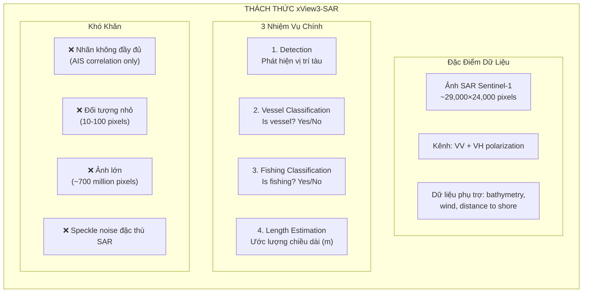
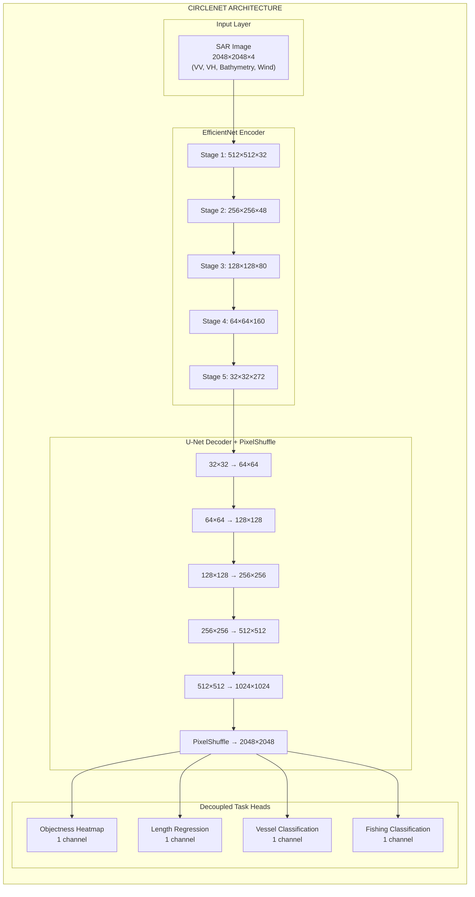
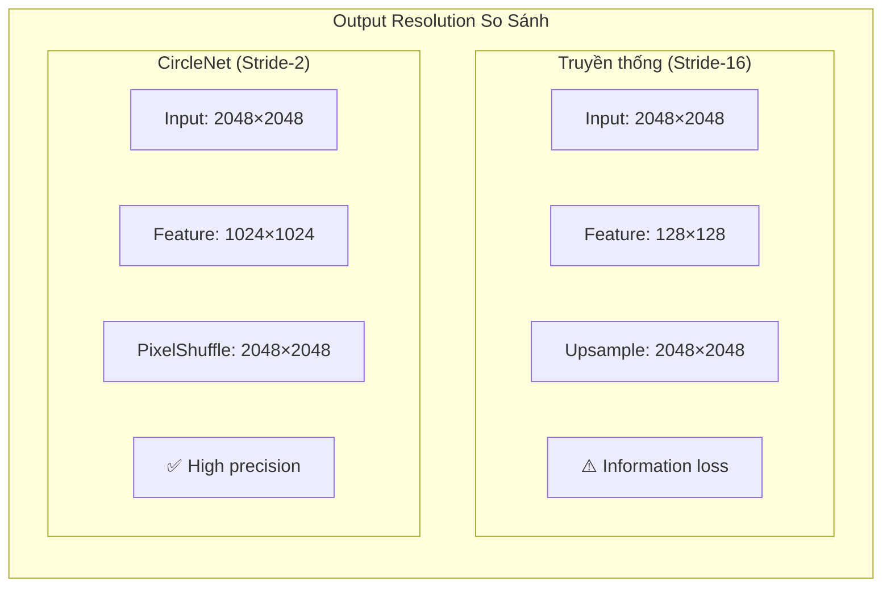
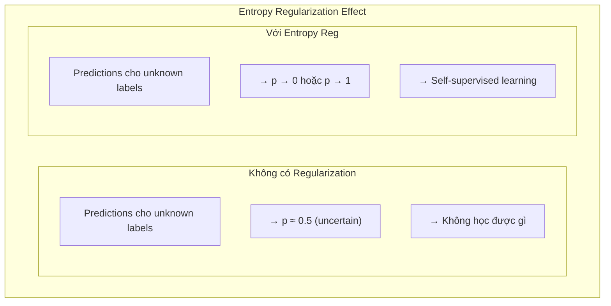
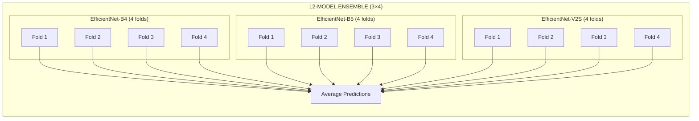
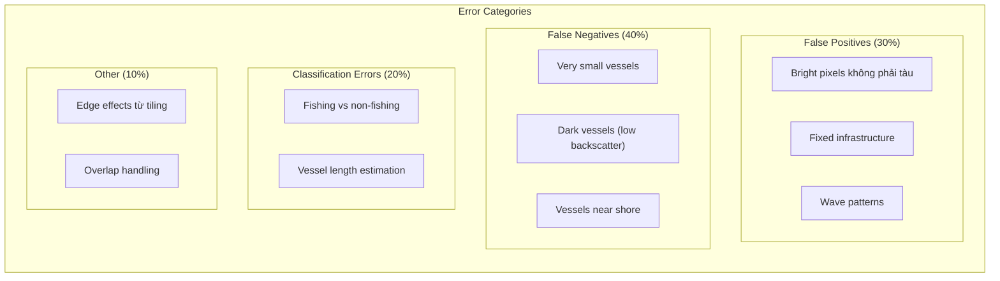

# xView3 Hạng 1: CircleNet (Eugene Khvedchenya / BloodAxe)

## Tổng quan

| Thuộc tính | Giá trị |
|-----------|-------|
| **Xếp hạng** | Hạng 1 |
| **Tác giả** | Eugene Khvedchenya (BloodAxe) |
| **Đơn vị** | Độc lập / Kaggle Grandmaster |
| **Điểm (Public LB)** | 0.603 |
| **Điểm (Holdout)** | 0.617 |
| **So với Baseline** | Cao gấp 3 lần baseline chính phủ |
| **Giải thưởng** | $150,000 (Giải Nhất) |
| **GitHub** | [BloodAxe/xView3-The-First-Place-Solution](https://github.com/BloodAxe/xView3-The-First-Place-Solution) |

---

## 1. Tổng Quan và Bối Cảnh

### 1.1 Vị Trí Trong Cuộc Thi xView3

Eugene Khvedchenya (BloodAxe) đạt **hạng 1** trong cuộc thi xView3-SAR với giải pháp **CircleNet** - một kiến trúc encoder-decoder tùy chỉnh cho phát hiện tàu biển trong ảnh SAR. Trong số **1,900+ người đăng ký** từ **67 quốc gia**, giải pháp này đạt điểm **0.617** trên holdout set, **cao gấp 3 lần** baseline của chính phủ.

**Điểm nổi bật của giải pháp:**
- **CircleNet architecture**: Custom encoder-decoder lấy cảm hứng từ CenterNet + U-Net
- **Stride-2 output**: Độ phân giải cao hơn 8x so với stride-16 chuẩn
- **12-model ensemble**: 3 backbone × 4 folds
- **Label noise handling**: Label smoothing + Shannon entropy regularization
- **Sigmoid SAR normalization**: Robust preprocessing cho SAR imagery

### 1.2 Thách Thức Đặc Thù của xView3

**xView3-SAR Challenge** tập trung vào phát hiện **đánh cá bất hợp pháp (IUU fishing)** trong ảnh radar vệ tinh:


*SAR imagery samples showing various vessel types and maritime objects*



**Bối cảnh ứng dụng thực tế:**
- **IUU Fishing**: Đánh cá bất hợp pháp, không báo cáo, không được quản lý
- **Dark vessels**: Tàu tắt AIS transponder để tránh giám sát
- **Maritime domain awareness**: Nhận thức tình huống hàng hải cho quốc phòng

### 1.3 Eugene Khvedchenya - Profile

**Background:**
- **Kaggle**: Grandmaster (username: bloodaxe)
- **Thành tích trước đó**: xView2 Hạng 3 (Building Damage Assessment)
- **Chuyên môn**: Computer vision, satellite imagery, deep learning competitions
- **Phong cách**: Kiến trúc tùy chỉnh, không dựa hoàn toàn vào pre-built frameworks

**Track record trong xView series:**

| Challenge | Rank | Year | Focus |
|-----------|------|------|-------|
| **xView1** | N/A | 2018 | Object detection |
| **xView2** | 3rd | 2019 | Building damage |
| **xView3** | **1st** | 2021 | Maritime detection |

### 1.4 Metric và Evaluation

**xView3 sử dụng Aggregate F1 Score:**

```python
def aggregate_f1_score(predictions, ground_truth):
    """
    F1 score tổng hợp cho 4 tasks.
    """
    # Detection F1
    det_f1 = compute_detection_f1(predictions, ground_truth)

    # Vessel classification F1
    vessel_f1 = compute_classification_f1(
        predictions, ground_truth, task='is_vessel'
    )

    # Fishing classification F1
    fishing_f1 = compute_classification_f1(
        predictions, ground_truth, task='is_fishing'
    )

    # Length estimation score (relative error)
    length_score = compute_length_score(predictions, ground_truth)

    # Weighted aggregate
    aggregate = 0.25 * det_f1 + 0.25 * vessel_f1 + 0.25 * fishing_f1 + 0.25 * length_score
    return aggregate
```

---

## 2. Đổi Mới Kỹ Thuật Chính

### 2.1 CircleNet Architecture

**Triết lý thiết kế:**

CircleNet kết hợp ưu điểm của:
- **CenterNet**: Phát hiện đối tượng như ước lượng keypoint
- **U-Net**: Skip connections và high-resolution decoder
- **PixelShuffle**: Upsampling hiệu quả để đạt stride-2


*Example SAR scene showing vessel detection challenges*



**Tại sao CircleNet hiệu quả cho SAR:**

| Đặc điểm | Giải thích |
|----------|-----------|
| **Point-based detection** | Tàu biển nhỏ → better as keypoints than boxes |
| **High-resolution output** | Stride-2 → accurate localization |
| **Decoupled heads** | Separate optimization cho mỗi task |
| **EfficientNet backbone** | ImageNet pretrained + efficient scaling |

### 2.2 Stride-2 Output Resolution

**Đây là đổi mới quan trọng nhất:**



**Label encoding F1 theo stride:**

| Output Stride | Label Encoding F1 | Improvement |
|---------------|-------------------|-------------|
| Stride-16 | 0.9672 | Baseline |
| Stride-8 | 0.9934 | +2.6% |
| Stride-4 | 0.9991 | +3.2% |
| **Stride-2** | **0.9999** | **+3.3%** |

**Implementation:**

```python
class CircleNetDecoder(nn.Module):
    """
    High-resolution decoder với PixelShuffle.
    """

    def __init__(self, encoder_channels, decoder_channels=256):
        super().__init__()

        # Standard U-Net decoder stages
        self.decoder_stages = nn.ModuleList([
            DecoderBlock(encoder_channels[i], decoder_channels)
            for i in range(len(encoder_channels))
        ])

        # PixelShuffle for final upsampling (stride-4 → stride-2)
        self.pixel_shuffle = nn.Sequential(
            nn.Conv2d(decoder_channels, decoder_channels * 4, 3, padding=1),
            nn.PixelShuffle(upscale_factor=2),  # 2× resolution
            nn.GroupNorm(32, decoder_channels),
            nn.SiLU(inplace=True)
        )

    def forward(self, features):
        x = features[-1]  # Deepest feature map

        # Decode with skip connections
        for i, (decoder, skip) in enumerate(zip(
            self.decoder_stages[::-1], features[:-1][::-1]
        )):
            x = decoder(x, skip)

        # Final PixelShuffle
        x = self.pixel_shuffle(x)

        return x  # Stride-2 output
```

### 2.3 Label Noise Handling

**Vấn đề cốt lõi:**

Dữ liệu xView3 training có nhãn **không đầy đủ**:
- Nhãn chủ yếu từ **AIS correlation** (tàu có AIS transponder)
- Nhiều **dark vessels** (tắt AIS) không được gắn nhãn
- **False negatives** phổ biến trong training set

**Giải pháp 1: Label Smoothing**

```python
def apply_label_smoothing(targets, smoothing=0.05):
    """
    Label smoothing để giảm overconfidence.

    Args:
        targets: One-hot encoded targets [B, C]
        smoothing: Smoothing factor (0.05 = 5%)

    Returns:
        Smoothed targets
    """
    n_classes = targets.size(-1)
    targets = targets * (1 - smoothing) + smoothing / n_classes
    return targets
```

**Giải pháp 2: Shannon Entropy Regularization**

Với các nhãn **unknown/missing**, thay vì bỏ qua, sử dụng entropy regularization:

```python
class EntropyRegularizationLoss(nn.Module):
    """
    Shannon entropy regularization cho unknown labels.
    Đẩy predictions về 0 hoặc 1 (confident) thay vì uncertain middle.
    """

    def __init__(self, alpha=0.1):
        super().__init__()
        self.alpha = alpha

    def forward(self, predictions, unknown_mask):
        """
        Args:
            predictions: Sigmoid outputs [B, 1, H, W]
            unknown_mask: Mask for unknown labels [B, 1, H, W]

        Returns:
            Entropy regularization loss
        """
        p = predictions[unknown_mask]

        if p.numel() == 0:
            return 0.0

        # Shannon entropy: H(p) = -p*log(p) - (1-p)*log(1-p)
        eps = 1e-7
        entropy = -p * torch.log(p + eps) - (1 - p) * torch.log(1 - p + eps)

        # Minimize entropy → push to 0 or 1
        return self.alpha * entropy.mean()
```

**Tại sao entropy regularization hiệu quả:**



### 2.4 SAR-Specific Normalization

**Vấn đề với SAR imagery:**

Giá trị backscatter SAR có:
- **Phạm vi động rất lớn** (từ -50 dB đến +20 dB)
- **Nhiều outliers** (bright scatterers)
- **Speckle noise** đặc thù radar

**Giải pháp: Sigmoid Normalization**

```python
def normalize_sar_sigmoid(image):
    """
    Sigmoid normalization cho SAR imagery.

    Thay vì linear scaling (sensitive to outliers),
    sử dụng sigmoid để compress range.
    """
    # Standard approach (problematic)
    # normalized = (image - min) / (max - min)  # ❌ Outlier sensitive

    # Sigmoid approach (robust)
    # Tham số 40, 15 được tuning cho xView3 SAR
    normalized = torch.sigmoid((image + 40) / 15)

    return normalized


class SARPreprocessor:
    """
    Complete SAR preprocessing pipeline.
    """

    def __init__(self, offset=40, scale=15):
        self.offset = offset
        self.scale = scale

    def __call__(self, vh, vv, ancillary):
        """
        Preprocess SAR và ancillary data.

        Args:
            vh: VH polarization channel
            vv: VV polarization channel
            ancillary: [bathymetry, wind_direction, wind_speed, distance_shore]

        Returns:
            Normalized 4-channel input tensor
        """
        # Normalize SAR channels
        vh_norm = torch.sigmoid((vh + self.offset) / self.scale)
        vv_norm = torch.sigmoid((vv + self.offset) / self.scale)

        # Stack channels
        input_tensor = torch.stack([vh_norm, vv_norm, *ancillary], dim=0)

        return input_tensor
```

**So sánh normalization methods:**

| Method | Outlier Handling | Dynamic Range | Training Stability |
|--------|-----------------|---------------|-------------------|
| Linear scaling | ❌ Poor | ❌ Compressed | ⚠️ Unstable |
| Clipping + linear | ⚠️ OK | ⚠️ Limited | ⚠️ OK |
| Log transform | ✅ Good | ⚠️ Nonlinear | ✅ Good |
| **Sigmoid** | ✅ Excellent | ✅ Smooth | ✅ Excellent |

---

## 3. Kiến Trúc và Triển Khai

### 3.1 Complete CircleNet Implementation

```python
import torch
import torch.nn as nn
import torch.nn.functional as F
from efficientnet_pytorch import EfficientNet


class CircleNet(nn.Module):
    """
    CircleNet: Point-based detection cho SAR maritime objects.
    """

    def __init__(self, backbone='efficientnet-b4', num_classes=1,
                 in_channels=4, decoder_channels=256):
        super().__init__()

        self.in_channels = in_channels

        # Encoder: EfficientNet với 4-channel input
        self.encoder = EfficientNet.from_pretrained(
            backbone,
            in_channels=in_channels,
            num_classes=num_classes
        )

        # Get encoder channel sizes
        self.encoder_channels = self._get_encoder_channels(backbone)

        # Decoder: U-Net style với PixelShuffle
        self.decoder = CircleNetDecoder(
            encoder_channels=self.encoder_channels,
            decoder_channels=decoder_channels
        )

        # Task heads (decoupled)
        self.objectness_head = TaskHead(decoder_channels, 1, 'sigmoid')
        self.length_head = TaskHead(decoder_channels, 1, 'relu')
        self.vessel_head = TaskHead(decoder_channels, 1, 'sigmoid')
        self.fishing_head = TaskHead(decoder_channels, 1, 'sigmoid')

    def _get_encoder_channels(self, backbone):
        """Get channel sizes cho mỗi stage của EfficientNet."""
        channel_map = {
            'efficientnet-b4': [48, 56, 160, 448],
            'efficientnet-b5': [48, 64, 176, 512],
            'efficientnet-v2s': [48, 64, 160, 256]
        }
        return channel_map.get(backbone, [48, 56, 160, 448])

    def extract_features(self, x):
        """Extract multi-scale features từ encoder."""
        features = []
        endpoints = self.encoder.extract_endpoints(x)

        for key in ['reduction_2', 'reduction_3', 'reduction_4', 'reduction_5']:
            features.append(endpoints[key])

        return features

    def forward(self, x):
        """
        Forward pass.

        Args:
            x: Input tensor [B, 4, H, W] (VH, VV, ancillary)

        Returns:
            dict: Predictions for all tasks
        """
        # Extract multi-scale features
        features = self.extract_features(x)

        # Decode to high-resolution
        decoded = self.decoder(features)

        # Task-specific predictions
        objectness = self.objectness_head(decoded)
        length = self.length_head(decoded)
        is_vessel = self.vessel_head(decoded)
        is_fishing = self.fishing_head(decoded)

        return {
            'objectness': objectness,
            'length': length,
            'is_vessel': is_vessel,
            'is_fishing': is_fishing
        }


class TaskHead(nn.Module):
    """
    Decoupled head cho mỗi task.
    Sử dụng GroupNorm thay vì BatchNorm.
    """

    def __init__(self, in_channels, out_channels, activation='sigmoid'):
        super().__init__()

        self.conv1 = nn.Conv2d(in_channels, in_channels // 2, 3, padding=1)
        self.gn1 = nn.GroupNorm(32, in_channels // 2)
        self.conv2 = nn.Conv2d(in_channels // 2, out_channels, 1)

        self.activation_type = activation

    def forward(self, x):
        x = self.conv1(x)
        x = self.gn1(x)
        x = F.silu(x)
        x = self.conv2(x)

        if self.activation_type == 'sigmoid':
            x = torch.sigmoid(x)
        elif self.activation_type == 'relu':
            x = F.relu(x)

        return x


class CircleNetDecoder(nn.Module):
    """
    U-Net decoder với PixelShuffle cho stride-2 output.
    """

    def __init__(self, encoder_channels, decoder_channels=256):
        super().__init__()

        # Decoder blocks
        self.blocks = nn.ModuleList()
        in_ch = encoder_channels[-1]

        for enc_ch in encoder_channels[:-1][::-1]:
            self.blocks.append(
                DecoderBlock(in_ch + enc_ch, decoder_channels)
            )
            in_ch = decoder_channels

        # Final upsampling với PixelShuffle
        self.final_upsample = nn.Sequential(
            nn.Conv2d(decoder_channels, decoder_channels * 4, 3, padding=1),
            nn.PixelShuffle(2),
            nn.GroupNorm(32, decoder_channels),
            nn.SiLU(inplace=True),
            nn.Conv2d(decoder_channels, decoder_channels * 4, 3, padding=1),
            nn.PixelShuffle(2),
            nn.GroupNorm(32, decoder_channels),
            nn.SiLU(inplace=True)
        )

    def forward(self, features):
        x = features[-1]

        for block, skip in zip(self.blocks, features[:-1][::-1]):
            x = F.interpolate(x, size=skip.shape[-2:], mode='bilinear',
                            align_corners=False)
            x = torch.cat([x, skip], dim=1)
            x = block(x)

        x = self.final_upsample(x)
        return x


class DecoderBlock(nn.Module):
    """Single decoder block."""

    def __init__(self, in_channels, out_channels):
        super().__init__()

        self.conv1 = nn.Conv2d(in_channels, out_channels, 3, padding=1)
        self.gn1 = nn.GroupNorm(32, out_channels)
        self.conv2 = nn.Conv2d(out_channels, out_channels, 3, padding=1)
        self.gn2 = nn.GroupNorm(32, out_channels)

    def forward(self, x):
        x = self.conv1(x)
        x = self.gn1(x)
        x = F.silu(x)
        x = self.conv2(x)
        x = self.gn2(x)
        x = F.silu(x)
        return x
```

### 3.2 Loss Functions

**Multi-task loss với task-specific weighting:**

```python
class CircleNetLoss(nn.Module):
    """
    Combined loss cho CircleNet multi-task learning.
    """

    def __init__(self, detection_weight=1.0, classification_weight=1.0,
                 length_weight=0.1, entropy_alpha=0.1, label_smoothing=0.05):
        super().__init__()

        self.detection_weight = detection_weight
        self.classification_weight = classification_weight
        self.length_weight = length_weight

        # Detection: Reduced Focal Loss
        self.focal_loss = ReducedFocalLoss(gamma=2.0, alpha=0.25)

        # Classification: Weighted BCE với label smoothing
        self.bce_loss = nn.BCELoss(reduction='none')
        self.label_smoothing = label_smoothing

        # Length: L1 Loss
        self.l1_loss = nn.L1Loss()

        # Entropy regularization
        self.entropy_reg = EntropyRegularizationLoss(alpha=entropy_alpha)

    def forward(self, predictions, targets):
        """
        Compute total loss.

        Args:
            predictions: dict với keys ['objectness', 'length', 'is_vessel', 'is_fishing']
            targets: dict với corresponding ground truth

        Returns:
            total_loss, loss_dict
        """
        losses = {}

        # Detection loss (Reduced Focal)
        losses['detection'] = self.focal_loss(
            predictions['objectness'],
            targets['objectness_heatmap']
        )

        # Vessel classification loss
        vessel_weight = self._compute_weight_mask(targets['vessel_mask'])
        vessel_targets = self._apply_label_smoothing(targets['is_vessel'])
        losses['vessel'] = (
            self.bce_loss(predictions['is_vessel'], vessel_targets) *
            vessel_weight
        ).mean()

        # Fishing classification loss
        fishing_weight = self._compute_weight_mask(targets['fishing_mask'])
        fishing_targets = self._apply_label_smoothing(targets['is_fishing'])
        losses['fishing'] = (
            self.bce_loss(predictions['is_fishing'], fishing_targets) *
            fishing_weight
        ).mean()

        # Entropy regularization for unknown labels
        losses['entropy'] = (
            self.entropy_reg(predictions['is_vessel'], targets['vessel_unknown']) +
            self.entropy_reg(predictions['is_fishing'], targets['fishing_unknown'])
        )

        # Length estimation loss
        losses['length'] = self.l1_loss(
            predictions['length'] * targets['object_mask'],
            targets['length'] * targets['object_mask']
        )

        # Total loss
        total_loss = (
            self.detection_weight * losses['detection'] +
            self.classification_weight * (losses['vessel'] + losses['fishing']) +
            self.length_weight * losses['length'] +
            losses['entropy']
        )

        losses['total'] = total_loss
        return total_loss, losses


class ReducedFocalLoss(nn.Module):
    """
    Reduced Focal Loss cho sparse heatmap targets.
    """

    def __init__(self, gamma=2.0, alpha=0.25):
        super().__init__()
        self.gamma = gamma
        self.alpha = alpha

    def forward(self, pred, target):
        """
        Args:
            pred: Predicted heatmap [B, 1, H, W]
            target: Target Gaussian heatmap [B, 1, H, W]
        """
        # Separate positive và negative samples
        pos_mask = target > 0.99
        neg_mask = target < 0.01

        # Positive loss (at object centers)
        pos_loss = -self.alpha * ((1 - pred) ** self.gamma) * torch.log(pred + 1e-8)
        pos_loss = pos_loss * pos_mask

        # Negative loss (background)
        neg_loss = -(1 - self.alpha) * (pred ** self.gamma) * torch.log(1 - pred + 1e-8)
        neg_loss = neg_loss * neg_mask * ((1 - target) ** 4)  # Reduce loss near objects

        # Sum và normalize
        num_pos = pos_mask.sum().clamp(min=1)
        loss = (pos_loss.sum() + neg_loss.sum()) / num_pos

        return loss
```

### 3.3 12-Model Ensemble Strategy

**Ensemble configuration:**



**Ensemble implementation:**

```python
class CircleNetEnsemble:
    """
    12-model ensemble cho inference.
    """

    def __init__(self, model_paths, device='cuda'):
        self.models = []
        self.device = device

        for path in model_paths:
            model = CircleNet.load_from_checkpoint(path)
            model.to(device)
            model.eval()
            self.models.append(model)

    @torch.no_grad()
    def predict(self, x):
        """
        Ensemble prediction với averaging.
        """
        all_predictions = {
            'objectness': [],
            'length': [],
            'is_vessel': [],
            'is_fishing': []
        }

        for model in self.models:
            preds = model(x)
            for key in all_predictions:
                all_predictions[key].append(preds[key])

        # Average predictions
        ensemble_preds = {}
        for key in all_predictions:
            stacked = torch.stack(all_predictions[key], dim=0)
            ensemble_preds[key] = stacked.mean(dim=0)

        return ensemble_preds

    def predict_with_tta(self, x):
        """
        Prediction với Test-Time Augmentation (LR flip).
        """
        # Original prediction
        pred_orig = self.predict(x)

        # LR flipped prediction
        x_flip = torch.flip(x, dims=[-1])
        pred_flip = self.predict(x_flip)

        # Reverse flip
        for key in pred_flip:
            pred_flip[key] = torch.flip(pred_flip[key], dims=[-1])

        # Average
        final_preds = {}
        for key in pred_orig:
            final_preds[key] = (pred_orig[key] + pred_flip[key]) / 2

        return final_preds
```

---

## 4. Huấn Luyện và Tối Ưu

### 4.1 Training Configuration

```yaml
# config/efficientnet_v2s_circlenet.yaml
model:
  backbone: "efficientnet-v2s"
  decoder_channels: 256
  in_channels: 4
  pretrained: true

training:
  batch_size: 4
  tile_size: 2048
  epochs: 50
  optimizer:
    type: "adamw"
    lr: 1e-4
    weight_decay: 1e-4
  scheduler:
    type: "cosine"
    warmup_epochs: 5
    min_lr: 1e-6

loss:
  detection_weight: 1.0
  classification_weight: 1.0
  length_weight: 0.1
  label_smoothing: 0.05
  entropy_alpha: 0.1

data:
  train_scenes: "train"
  val_scenes: "validation"
  num_workers: 8
  augmentation:
    random_flip: true
    random_rotate: true
    scale_range: [0.8, 1.2]

fold:
  n_folds: 4
  stratify_by: "scene_type"
```

### 4.2 Balanced Sampling

**Vấn đề:** Một số scene types chiếm ưu thế trong training.

```python
class BalancedSceneSampler:
    """
    Sampler cân bằng giữa các scene types.
    """

    def __init__(self, dataset, scene_weights=None):
        if scene_weights is None:
            scene_weights = {
                'vessel': 1.0,
                'fishing': 1.5,  # Upweight fishing scenes
                'infrastructure': 1.2,
                'empty': 0.3  # Downweight empty scenes
            }

        self.weights = []
        for idx in range(len(dataset)):
            scene_type = dataset.get_scene_type(idx)
            self.weights.append(scene_weights.get(scene_type, 1.0))

        self.weights = torch.tensor(self.weights)

    def __iter__(self):
        return iter(torch.multinomial(
            self.weights,
            len(self.weights),
            replacement=True
        ).tolist())

    def __len__(self):
        return len(self.weights)
```

### 4.3 Data Augmentation

```python
import albumentations as A

def get_train_transforms(tile_size=2048):
    """
    SAR-specific augmentations.
    Cẩn thận: Không dùng color augmentation cho SAR.
    """
    return A.Compose([
        # Geometric transforms
        A.RandomCrop(height=tile_size, width=tile_size),
        A.HorizontalFlip(p=0.5),
        A.VerticalFlip(p=0.5),
        A.RandomRotate90(p=0.5),

        # Scale augmentation (careful với SAR resolution)
        A.OneOf([
            A.RandomScale(scale_limit=(-0.2, 0.0)),  # Downscale
            A.RandomScale(scale_limit=(0.0, 0.2)),   # Upscale
        ], p=0.3),

        # NO color augmentation for SAR!
        # Intensity values có physical meaning

    ], additional_targets={'mask': 'mask'})


def get_val_transforms(tile_size=2048):
    """Validation: No augmentation."""
    return A.Compose([
        A.CenterCrop(height=tile_size, width=tile_size)
    ])
```

---

## 5. Kết Quả và Phân Tích

### 5.1 Competition Results

| Metric | Score |
|--------|-------|
| **Public Leaderboard** | 0.603 |
| **Private Holdout** | 0.617 |
| **vs Government Baseline** | 3× improvement |
| **Final Rank** | 1st Place |
| **Prize** | $150,000 |


*VV vs VH polarization comparison - key to CircleNet's multi-channel input strategy*

### 5.2 Ablation Studies

**Component contribution:**

| Component | Single Model Score | Improvement |
|-----------|-------------------|-------------|
| Baseline (stride-16) | 0.48 | - |
| + Stride-2 output | 0.52 | +0.04 |
| + Label smoothing | 0.53 | +0.01 |
| + Entropy regularization | 0.54 | +0.01 |
| + Sigmoid normalization | 0.55 | +0.01 |
| + EfficientNet-V2S | 0.55 | - |
| **Full ensemble (12 models)** | **0.617** | +0.06 |

### 5.3 Per-backbone Performance

| Backbone | CV Score Range | Notes |
|----------|---------------|-------|
| EfficientNet-B4 | 0.51-0.52 | Smallest, fastest |
| EfficientNet-B5 | 0.53-0.55 | Medium |
| **EfficientNet-V2S** | **0.55-0.62** | Best single model |

### 5.4 Error Analysis



---

## 6. Tái Tạo và Tài Nguyên

### 6.1 Tiled Inference Pipeline

```python
class TiledInferencePipeline:
    """
    Full-scene inference với overlapping tiles.
    """

    def __init__(self, model, tile_size=2048, overlap=1536, stride=512):
        self.model = model
        self.tile_size = tile_size
        self.overlap = overlap
        self.stride = stride

    def predict_scene(self, scene_path):
        """
        Predict on full SAR scene (~29000×24000 pixels).
        """
        # Load scene
        vh, vv, ancillary = self.load_scene(scene_path)
        h, w = vh.shape[-2:]

        # Generate tile positions
        tiles = self.generate_tiles(h, w)

        # Predict on each tile
        all_predictions = []
        for y, x in tiles:
            # Extract tile
            tile = self.extract_tile(vh, vv, ancillary, y, x)

            # Predict
            with torch.no_grad():
                pred = self.model.predict_with_tta(tile)

            all_predictions.append({
                'position': (y, x),
                'predictions': pred
            })

        # Merge predictions
        merged = self.merge_predictions(all_predictions, (h, w))

        # Post-process: NMS, thresholding
        detections = self.post_process(merged)

        return detections

    def generate_tiles(self, h, w):
        """Generate overlapping tile positions."""
        tiles = []
        for y in range(0, h - self.overlap, self.stride):
            for x in range(0, w - self.overlap, self.stride):
                tiles.append((y, x))
        return tiles

    def merge_predictions(self, all_predictions, scene_size):
        """
        Merge overlapping tile predictions.
        Sử dụng weighted averaging trong overlap regions.
        """
        h, w = scene_size
        count_map = torch.zeros(1, 1, h, w)
        merged_maps = {
            'objectness': torch.zeros(1, 1, h, w),
            'length': torch.zeros(1, 1, h, w),
            'is_vessel': torch.zeros(1, 1, h, w),
            'is_fishing': torch.zeros(1, 1, h, w)
        }

        for item in all_predictions:
            y, x = item['position']
            preds = item['predictions']

            y_end = min(y + self.tile_size, h)
            x_end = min(x + self.tile_size, w)

            for key in merged_maps:
                merged_maps[key][:, :, y:y_end, x:x_end] += preds[key][:, :, :y_end-y, :x_end-x]

            count_map[:, :, y:y_end, x:x_end] += 1

        # Average
        for key in merged_maps:
            merged_maps[key] /= count_map.clamp(min=1)

        return merged_maps

    def post_process(self, merged, conf_threshold=0.5, nms_radius=10):
        """
        Extract final detections từ merged heatmaps.
        """
        # Peak detection trong objectness heatmap
        objectness = merged['objectness'].squeeze()
        peaks = self.find_local_maxima(objectness, min_distance=nms_radius)

        # Filter by confidence
        detections = []
        for y, x in peaks:
            conf = objectness[y, x]
            if conf > conf_threshold:
                detections.append({
                    'y': y,
                    'x': x,
                    'confidence': conf.item(),
                    'length': merged['length'][0, 0, y, x].item(),
                    'is_vessel': merged['is_vessel'][0, 0, y, x].item(),
                    'is_fishing': merged['is_fishing'][0, 0, y, x].item()
                })

        return detections
```

### 6.2 Quick Start Guide

```bash
# 1. Clone repository
git clone https://github.com/BloodAxe/xView3-The-First-Place-Solution.git
cd xView3-The-First-Place-Solution

# 2. Create environment
conda create -n xview3 python=3.8
conda activate xview3

# 3. Install dependencies
pip install -r requirements.txt

# 4. Download pretrained weights
bash scripts/download_weights.sh

# 5. Prepare data (requires xView3 dataset)
python scripts/prepare_data.py --data_dir /path/to/xview3

# 6. Train single model
python train.py --config configs/efficientnetv2s_circlenet.yaml --fold 0

# 7. Train all 12 models (ensemble)
bash scripts/train_all.sh

# 8. Inference
python predict.py \
    --config configs/efficientnetv2s_circlenet.yaml \
    --weights checkpoints/ensemble/ \
    --input_dir /path/to/test \
    --output_dir /path/to/predictions
```

### 6.3 Hardware Requirements

| Component | Minimum | Recommended |
|-----------|---------|-------------|
| **GPU** | 1× RTX 2080 Ti (11GB) | 4× RTX 3090 (24GB each) |
| **VRAM** | 11GB | 24GB+ per GPU |
| **System RAM** | 64GB | 128GB |
| **Storage** | 500GB SSD | 1TB NVMe |
| **Training Time** | ~100 hours (1 GPU) | ~25 hours (4 GPUs) |

### 6.4 Dependencies

```
# requirements.txt
pytorch >= 1.9
pytorch-lightning >= 1.4
segmentation-models-pytorch >= 0.2
efficientnet-pytorch >= 0.7
albumentations >= 1.0
tifffile >= 2021.7
gdal >= 3.0
numpy >= 1.20
pandas >= 1.3
scikit-learn >= 0.24
```

### 6.5 Resources

**Official Links:**
- **GitHub (BloodAxe)**: [BloodAxe/xView3-The-First-Place-Solution](https://github.com/BloodAxe/xView3-The-First-Place-Solution)
- **GitHub (DIUx)**: [DIUx-xView/xView3_first_place](https://github.com/DIUx-xView/xView3_first_place)
- **Challenge**: [iuu.xview.us](https://iuu.xview.us)
- **Kaggle Profile**: [bloodaxe](https://www.kaggle.com/bloodaxe)

**Related Papers:**
- Zhou, X., et al. (2019). "Objects as Points." arXiv:1904.07850 (CenterNet)
- Tan, M., & Le, Q. V. (2019). "EfficientNet: Rethinking Model Scaling." ICML 2019
- Ronneberger, O., et al. (2015). "U-Net: Convolutional Networks for Biomedical Image Segmentation." MICCAI 2015

**xView3 Dataset:**
- Training: 50 validation scenes + 500+ noisy training scenes
- Test: ~100 scenes
- Format: GeoTIFF (Sentinel-1 SAR)
- Channels: VH, VV polarization + ancillary data

---

## Tổng Kết

### Key Takeaways

1. **Stride-2 Output**: Critical cho accurate point-based detection
2. **Label Noise Handling**: Label smoothing + entropy regularization
3. **Sigmoid SAR Normalization**: Robust preprocessing cho SAR imagery
4. **Ensemble Diversity**: 3 backbones × 4 folds = robust predictions
5. **Decoupled Heads**: Separate optimization cho mỗi task

### Lessons Learned

1. **High resolution matters**: Stride-2 vs stride-16 = +3.3% label encoding accuracy
2. **Handle noisy labels**: Training data không clean → regularization techniques
3. **SAR-specific preprocessing**: Sigmoid normalization > linear scaling
4. **Ensemble still king**: 12 models > single model (+0.06 score)

### Applicability

CircleNet approach phù hợp cho:
- **Maritime domain awareness**: Ship detection, IUU fishing
- **SAR imagery analysis**: Radar satellite processing
- **Small object detection**: Points better than boxes
- **Noisy label scenarios**: Entropy regularization helps

---

*Tài liệu cập nhật: 2024-12-19*
*Framework: PyTorch 1.9+ / PyTorch Lightning*
*Hardware tested: 4× NVIDIA RTX 3090*
