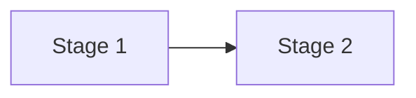

# Brainstorm Report: MD → DOCX + Web Publishing System

## Problem Statement

**Yêu cầu:** Xây dựng hệ thống tự động chuyển đổi tài liệu Markdown thành:
1. **DOCX** - Theo chuẩn luận văn thạc sĩ Việt Nam
2. **Web Viewer** - Host trên GitHub Pages với VitePress

**Constraints:**
- Auto-update khi MD thay đổi
- Hình vẽ/sơ đồ hiển thị cả web và DOCX
- Diagrams chuyển từ ASCII → Mermaid

---

## Decisions Made

| Aspect | Decision |
|--------|----------|
| **Diagram Format** | Mermaid |
| **Web Framework** | VitePress |
| **Hosting** | GitHub Pages (free) |
| **DOCX Template** | Mẫu luận văn thạc sĩ VN |

---

## Solution Architecture

```
┌─────────────────────────────────────────────────────────────────────────┐
│                         SOURCE OF TRUTH                                 │
│                    docs/xview-challenges/*.md                           │
│                    (with Mermaid diagrams)                              │
└─────────────────────────────────────────────────────────────────────────┘
                                   │
                                   │ git push
                                   ▼
┌─────────────────────────────────────────────────────────────────────────┐
│                        GitHub Actions CI/CD                             │
├─────────────────────────────────────────────────────────────────────────┤
│                                                                         │
│  ┌─────────────────────┐              ┌─────────────────────┐          │
│  │   Job 1: Build Web  │              │  Job 2: Build DOCX  │          │
│  ├─────────────────────┤              ├─────────────────────┤          │
│  │  1. Install Node    │              │  1. Install Pandoc  │          │
│  │  2. npm install     │              │  2. Install mermaid │          │
│  │  3. VitePress build │              │     -cli            │          │
│  │  4. Deploy Pages    │              │  3. Run conversion  │          │
│  └──────────┬──────────┘              │  4. Upload artifact │          │
│             │                         └──────────┬──────────┘          │
│             ▼                                    ▼                      │
│  ┌─────────────────────┐              ┌─────────────────────┐          │
│  │   GitHub Pages      │              │   Release Download  │          │
│  │   (Static HTML)     │              │   (DOCX file)       │          │
│  └─────────────────────┘              └─────────────────────┘          │
│                                                                         │
└─────────────────────────────────────────────────────────────────────────┘
```

---

## Component Details

### 1. Mermaid Diagrams

**Current ASCII (cần convert):**
```
┌──────────────┐     ┌──────────────┐
│   Stage 1    │────▶│   Stage 2    │
└──────────────┘     └──────────────┘
```

**Target Mermaid:**


**Benefits:**
- Native VitePress support via [vitepress-plugin-mermaid](https://github.com/emersonbottero/vitepress-plugin-mermaid)
- Pandoc render via [mermaid-filter](https://github.com/raghur/mermaid-filter) hoặc [pandoc-ext/diagram](https://github.com/pandoc-ext/diagram)
- Single source, dual output

### 2. VitePress Configuration

```javascript
// docs/.vitepress/config.mjs
import { withMermaid } from "vitepress-plugin-mermaid";

export default withMermaid({
  title: 'xView Challenge Research',
  description: 'Comprehensive research on xView datasets',
  base: '/sen_doc/',  // GitHub repo name

  themeConfig: {
    sidebar: [
      {
        text: 'xView1',
        items: [
          { text: 'Dataset', link: '/xview-challenges/xview1/dataset-xview1-detection' },
          { text: 'Winners', link: '/xview-challenges/xview1/' }
        ]
      },
      // ... xView2, xView3
    ]
  },

  mermaid: {
    theme: 'default'
  }
});
```

### 3. DOCX Template (Mẫu Luận Văn VN)

**Quy cách theo chuẩn phổ biến:**

| Element | Specification |
|---------|---------------|
| **Font** | Times New Roman |
| **Cỡ chữ** | 13pt (body), 14-18pt (headings) |
| **Lề trái** | 3.5 cm |
| **Lề phải** | 2.0 cm |
| **Lề trên** | 3.0 cm |
| **Lề dưới** | 3.0 cm |
| **Line spacing** | 1.5 lines |
| **Page size** | A4 (210 × 297 mm) |
| **Footnote** | 10pt |

**Pandoc reference.docx template:**
- Cần tạo file `templates/reference.docx` với styles đúng chuẩn
- Pandoc sẽ apply styles từ template vào output

### 4. GitHub Actions Workflow

```yaml
# .github/workflows/deploy.yml
name: Build and Deploy

on:
  push:
    branches: [main]
    paths:
      - 'docs/**'

jobs:
  # Job 1: Deploy VitePress to GitHub Pages
  deploy-web:
    runs-on: ubuntu-latest
    permissions:
      contents: read
      pages: write
      id-token: write
    steps:
      - uses: actions/checkout@v4

      - uses: actions/setup-node@v4
        with:
          node-version: 20
          cache: npm

      - run: npm ci
      - run: npm run docs:build

      - uses: actions/configure-pages@v4
      - uses: actions/upload-pages-artifact@v3
        with:
          path: docs/.vitepress/dist

      - uses: actions/deploy-pages@v4

  # Job 2: Build DOCX and upload as release
  build-docx:
    runs-on: ubuntu-latest
    steps:
      - uses: actions/checkout@v4

      - name: Install Pandoc & Mermaid CLI
        run: |
          sudo apt-get install -y pandoc
          npm install -g @mermaid-js/mermaid-cli
          npm install -g mermaid-filter

      - name: Build DOCX
        run: |
          pandoc docs/xview-challenges/**/*.md \
            -o xview-research.docx \
            --reference-doc=templates/reference.docx \
            --toc --toc-depth=3 \
            -F mermaid-filter \
            --metadata title="Nghiên cứu xView Challenge Series"

      - uses: actions/upload-artifact@v4
        with:
          name: docx-output
          path: xview-research.docx
```

---

## Implementation Plan

### Phase 1: Setup Infrastructure (2-3 hours)
1. Initialize VitePress in `docs/` folder
2. Install `vitepress-plugin-mermaid`
3. Configure GitHub Actions workflow
4. Create DOCX reference template

### Phase 2: Convert Diagrams (4-6 hours)
1. Identify all ASCII diagrams in existing MD files
2. Convert to Mermaid syntax
3. Test rendering in VitePress locally
4. Verify Pandoc DOCX output

### Phase 3: Polish & Deploy (2-3 hours)
1. Fine-tune VitePress theme/sidebar
2. Adjust DOCX template styles
3. Test full CI/CD pipeline
4. Document the process

---

## File Structure

```
sen_doc/
├── .github/
│   └── workflows/
│       └── deploy.yml              # CI/CD workflow
├── docs/
│   ├── .vitepress/
│   │   └── config.mjs              # VitePress config
│   ├── xview-challenges/
│   │   ├── README.md               # Index
│   │   ├── xview1/
│   │   │   ├── dataset-*.md
│   │   │   └── winner-*.md
│   │   ├── xview2/
│   │   └── xview3/
│   └── index.md                    # Home page
├── templates/
│   └── reference.docx              # DOCX template
├── package.json
└── README.md
```

---

## Dependencies

### Node.js packages
```json
{
  "devDependencies": {
    "vitepress": "^1.5.0",
    "vitepress-plugin-mermaid": "^2.0.17",
    "mermaid": "^11.0.0"
  },
  "scripts": {
    "docs:dev": "vitepress dev docs",
    "docs:build": "vitepress build docs",
    "docs:preview": "vitepress preview docs"
  }
}
```

### System tools (CI/CD)
- Pandoc (apt-get install pandoc)
- @mermaid-js/mermaid-cli (npm install -g)
- mermaid-filter (npm install -g)

---

## Risks & Mitigations

| Risk | Probability | Impact | Mitigation |
|------|-------------|--------|------------|
| Mermaid complex diagrams fail render | Medium | Medium | Use simpler diagram syntax, test early |
| VitePress plugin compatibility | Low | High | Pin versions, test before upgrade |
| DOCX formatting inconsistent | Medium | Medium | Create comprehensive reference.docx |
| Large file size (images) | Low | Low | Use SVG format for diagrams |

---

## Success Metrics

| Metric | Target |
|--------|--------|
| Web load time | < 3 seconds |
| DOCX generation time | < 2 minutes |
| Diagram render success rate | 100% |
| Auto-deploy on push | < 5 minutes |

---

## Alternatives Considered

### Web Framework Alternatives

| Option | Pros | Cons | Decision |
|--------|------|------|----------|
| **VitePress** | Fast, Vue-based, native Mermaid | Newer, smaller community | ✅ Selected |
| MkDocs | Python, Material theme beautiful | Mermaid setup more complex | ❌ |
| Docusaurus | React, MDX support | Heavier, slower build | ❌ |

### DOCX Generation Alternatives

| Option | Pros | Cons | Decision |
|--------|------|------|----------|
| **Pandoc + mermaid-filter** | Mature, flexible | Requires CLI tools | ✅ Selected |
| md-to-pdf + libreoffice | Simple | Poor formatting control | ❌ |
| Custom Node.js (docx lib) | Full control | High effort | ❌ |

---

## Next Steps

1. **Immediate:** Initialize VitePress project structure
2. **Short-term:** Convert 2-3 MD files to test Mermaid
3. **Medium-term:** Setup complete CI/CD pipeline
4. **Long-term:** Add more features (search, PDF export)

---

## Unresolved Questions

1. **Mermaid diagram complexity:** Một số ASCII diagrams phức tạp có thể cần đơn giản hóa khi convert sang Mermaid
2. **Table formatting:** Tables trong MD có thể cần điều chỉnh style trong DOCX template
3. **Image assets:** Nếu có hình ảnh thực (không phải diagram), cần quyết định cách quản lý

---

## References

- [VitePress Official Deploy Guide](https://vitepress.dev/guide/deploy)
- [vitepress-plugin-mermaid](https://github.com/emersonbottero/vitepress-plugin-mermaid)
- [mermaid-filter for Pandoc](https://github.com/raghur/mermaid-filter)
- [pandoc-ext/diagram](https://github.com/pandoc-ext/diagram)
- [Quy cách luận văn thạc sĩ](https://tinhocmos.edu.vn/huong-dan-trinh-bay-luan-van-thac-si/)

---

*Report generated: 2024-12-18*
*Status: Ready for implementation*
