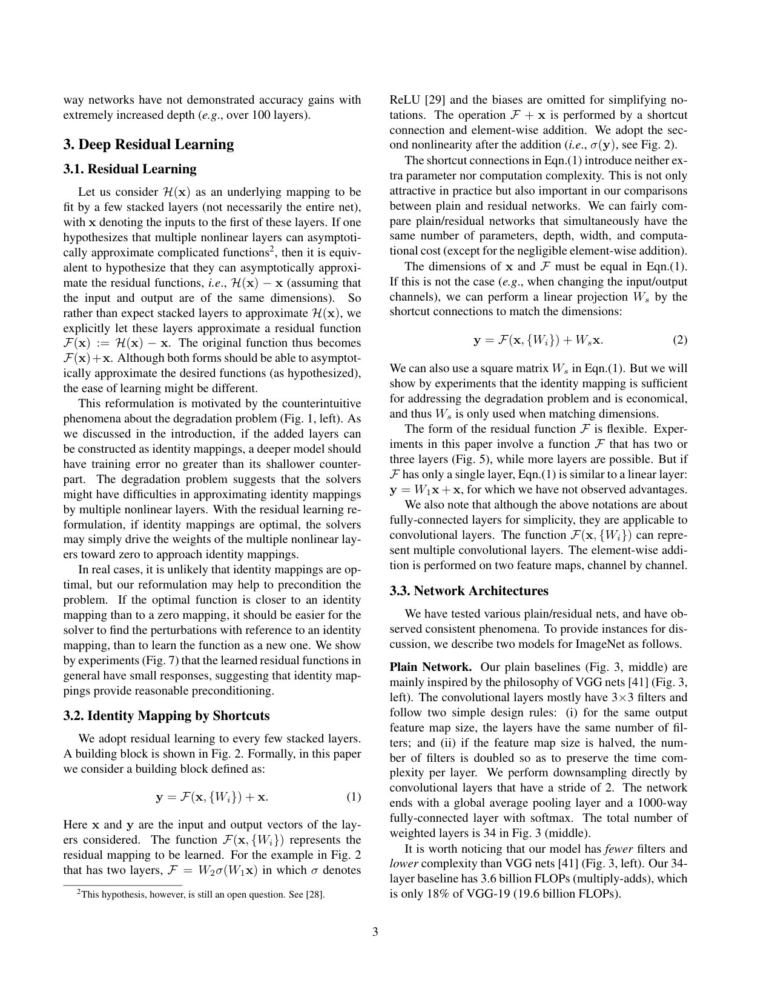
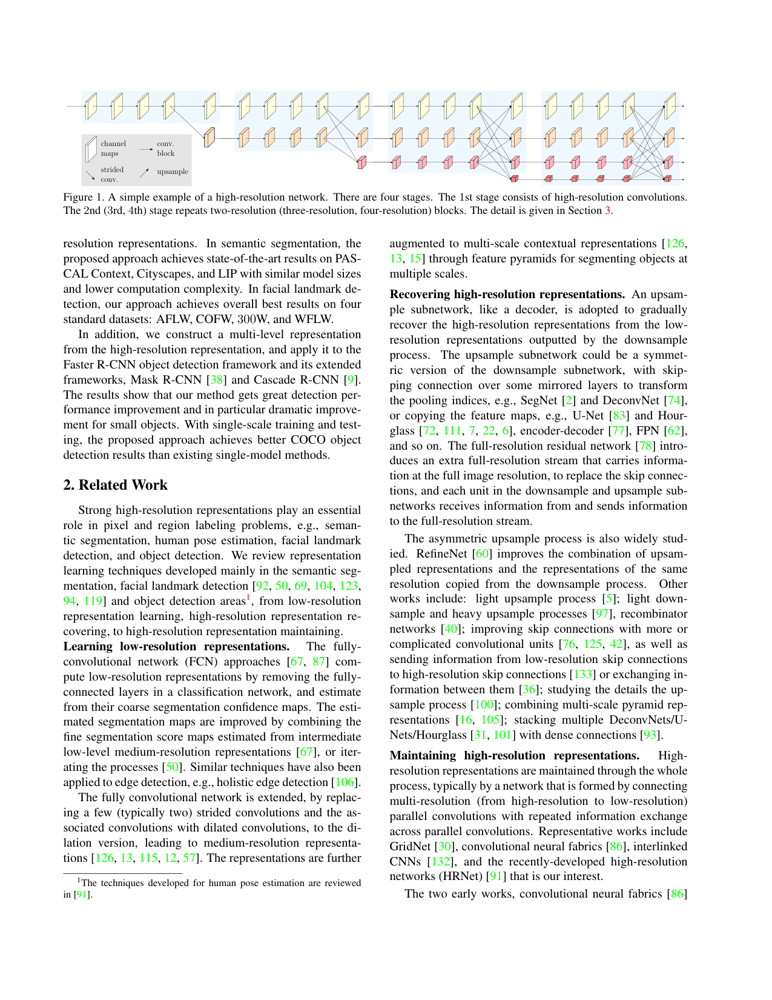

# Báo Cáo Tổng Quan: Deep Learning Models trong TorchGeo

**Ngày nghiên cứu:** 2025-12-20
**Số papers phân tích:** 24 papers
**Số hình ảnh trích xuất:** 157 figures

---

## Tóm Tắt

Báo cáo này tổng hợp nghiên cứu sâu về các mô hình deep learning được sử dụng trong TorchGeo - thư viện PyTorch cho geospatial machine learning. Phân tích bao gồm 5 nhóm chính: Backbone Models, Segmentation Models, Self-Supervised Learning, Change Detection, và Foundation Models.

---

## 1. Backbone Models (Classification)

### 1.1 ResNet (2015)
- **Đổi mới:** Skip connections giải quyết vanishing gradient, cho phép train networks đến 1000+ layers
- **Kiến trúc:** Bottleneck blocks (1×1→3×3→1×1), variants 18/34/50/101/152
- **Benchmark:** ResNet-152 đạt 78.6% Top-1 ImageNet
- **RS Relevance:** Baseline chuẩn cho classification, transfer learning tốt



### 1.2 Vision Transformer - ViT (2020)
- **Đổi mới:** Pure transformer, chia image thành 16×16 patches
- **Kiến trúc:** Patch embedding → Position embedding → Transformer encoder
- **Benchmark:** ViT-H/14 đạt 88.55% (cần JFT-300M pretraining)
- **RS Relevance:** Global context tốt cho satellite scenes, hybrid ResV2ViT đạt 99.91% trên RSI-CB256

### 1.3 Swin Transformer (2021)
- **Đổi mới:** Shifted window attention với O(N) complexity (vs O(N²) của ViT)
- **Kiến trúc:** Hierarchical 4-stage design, progressive downsampling
- **Benchmark:** Swin-B đạt 83.4% ImageNet, 58.7 AP COCO detection
- **RS Relevance:** Linear complexity phù hợp high-res satellite imagery

### 1.4 EfficientNet (2019)
- **Đổi mới:** Compound scaling (depth × width × resolution)
- **Kiến trúc:** MobileNet V2 base + squeeze-and-excitation
- **Benchmark:** EfficientNet-B7 đạt 84.3%, 8.4x smaller, 6.1x faster
- **RS Relevance:** Critical cho edge/drone deployment, B3-B4 optimal cho production

### Bảng So Sánh Backbone

| Model | Params | Top-1 Acc | Global Context | Efficiency | Best Use Case |
|-------|--------|-----------|----------------|------------|---------------|
| ResNet-50 | 25M | 80% | Moderate | Good | Baseline, transfer |
| ViT-B | 86M | 81.2% | Excellent | Moderate | Large-scale scenes |
| Swin-B | 88M | 83.4% | Excellent | Excellent | High-res, multi-task |
| EfficientNet-B4 | 19M | 82.9% | Moderate | Excellent | Edge, real-time |

---

## 2. Segmentation Models

### 2.1 U-Net (2015)
- **Đổi mới:** Encoder-decoder với skip connections
- **Benchmark:** ISBI Cell 92% IoU
- **RS Use:** Precise boundaries, limited labeled data

### 2.2 DeepLabV3+ (2018)
- **Đổi mới:** ASPP + atrous convolution + decoder
- **Benchmark:** PASCAL VOC 89.0%, Cityscapes 82.1% mIoU
- **RS Use:** Multi-scale objects, balanced context+boundaries

### 2.3 FPN (2016)
- **Đổi mới:** Top-down lateral connections cho multi-scale features
- **Benchmark:** COCO +8.0pts AR, +12.9pts small objects
- **RS Use:** Extreme scale variation, vehicle/building detection

### 2.4 PSPNet (2016)
- **Đổi mới:** Pyramid Pooling Module (1×1, 2×2, 3×3, 6×6)
- **Benchmark:** ADE20K 44.94% mIoU (1st place)
- **RS Use:** Complex contextual scenes, land cover disambiguation

### 2.5 HRNet (2019)
- **Đổi mới:** Parallel high-resolution streams throughout
- **Benchmark:** Cityscapes 81.6% mIoU, COCO 41.8% AP
- **RS Use:** **SOTA cho dense high-res tasks**, small object detection



### Bảng So Sánh Segmentation

| Model | Core Innovation | Best For | Small Objects | Efficiency |
|-------|-----------------|----------|---------------|------------|
| U-Net | Skip connections | Boundaries, few samples | Fair | Moderate |
| DeepLabV3+ | ASPP + decoder | General-purpose | Good | High |
| FPN | Top-down fusion | Multi-scale detection | Excellent | High |
| PSPNet | Pyramid pooling | Global context | Fair | Moderate |
| HRNet | Parallel HR streams | Dense high-res | Excellent | High |

---

## 3. Self-Supervised Learning Models

### 3.1 Generic SSL Methods

| Method | Type | Key Innovation | ImageNet Acc |
|--------|------|----------------|--------------|
| MoCo v2 | Contrastive | Momentum encoder + queue | 71.1% |
| DINO | Self-distill | Student-teacher, no labels | Strong k-NN |
| MAE | Reconstruction | 75% masking, asymmetric | Scalable |

### 3.2 Remote Sensing-Specific SSL

| Method | Domain-Adapted | Temporal | Multi-Spectral | Key Advantage |
|--------|----------------|----------|----------------|---------------|
| SSL4EO | Yes | Yes | Yes | Standardized benchmark |
| SatMAE | Yes | Yes | Yes | +14% land cover, spectral encoding |
| GASSL | Yes | Yes | No | +3.77% over supervised on NAIP |

**Khuyến nghị:** Kết hợp GASSL geo-awareness + SatMAE spectral/temporal encoding

---

## 4. Change Detection Models

### 4.1 FC-Siam (2018)
- **Kiến trúc:** Siamese encoder + skip connection fusion
- **Variants:** FC-EF (early fusion), FC-Siam-conc, FC-Siam-diff
- **Benchmark:** OSCD 48.86% F1, Air Change 93.40% F1
- **Speed:** <0.1s/image (500x faster than patch-based)

### 4.2 BIT-Transformer (2021)
- **Kiến trúc:** Token-based space-time context modeling
- **Benchmark:** LEVIR-CD 89.31% F1, WHU-CD 83.98% F1
- **Efficiency:** 3x lower FLOPs than convolutional baselines

### 4.3 STANet (2020)
- **Kiến trúc:** Spatial-Temporal Attention (BAM → PAM)
- **Benchmark:** LEVIR-CD 89.4% F1 (PAM variant)
- **Contribution:** Introduced LEVIR-CD dataset

### Bảng So Sánh Change Detection

| Model | Core Design | Best F1 | Efficiency | Robustness |
|-------|-------------|---------|------------|------------|
| FC-Siam | CNN Siamese | 48.86% (OSCD) | Fastest | Basic |
| BIT | Transformer tokens | 89.31% (LEVIR) | 3x better | High |
| STANet | Self-attention | 89.4% (LEVIR) | Moderate | Illumination |

---

## 5. Benchmark Datasets

| Dataset | Samples | Classes | Resolution | Task |
|---------|---------|---------|------------|------|
| EuroSAT | 27k | 10 | 10m | Classification |
| BigEarthNet | 590k | 43 (ML) | 10-60m | Multi-label |
| LandCover.ai | 41 orthos | 4 | 25-50cm | Segmentation |
| OSCD | 24 pairs | 2 | 10-60m | Change detection |
| LEVIR-CD | 637 pairs | 2 | 0.5m | Building change |
| xView2 | 8,399 pairs | 4 | High-res | Damage assessment |


---

## 6. Foundation Models

### 6.1 TorchGeo
- **Vai trò:** Infrastructure layer - datasets, samplers, transforms, pre-trained models
- **Đặc điểm:** On-the-fly preprocessing, 15+ benchmark datasets, Sentinel multispectral support

### 6.2 Prithvi-EO (IBM/NASA)
- **Vai trò:** Foundation model layer - 100M-600M params
- **Training:** 4.2M time series từ NASA HLS (1TB+ imagery)
- **Method:** MAE self-supervised với temporal + spatial attention
- **Benchmark:** +3.5-6.4pp flood/wildfire detection, 50.7% mIoU crop segmentation

### Workflow Tích Hợp

```
TorchGeo (Data) → Preprocessing → Prithvi (Pre-trained) → TerraTorch (Fine-tune) → Evaluation
```

---

## 7. Key Findings & Recommendations

### Cho Classification
1. **Baseline:** ResNet-50 + SSL4EO MoCo weights
2. **Best performance:** ViT-Base + SSL4EO MAE
3. **Edge deployment:** EfficientNet B3-B4

### Cho Segmentation
1. **Limited data:** U-Net với strong augmentation
2. **General-purpose:** DeepLabV3+ với SSL4EO encoder
3. **High-res SOTA:** HRNet

### Cho Change Detection
1. **Speed priority:** FC-Siam-diff
2. **Accuracy priority:** BIT-Transformer hoặc STANet-PAM

### Cho Pre-training
1. **Sentinel-2:** SSL4EO MoCo/MAE weights
2. **Temporal data:** SatMAE
3. **Geo-aware:** GASSL

---

## 8. Unresolved Questions

1. Optimal resolution/patch size cho optical vs SAR sensors?
2. Performance trên imbalanced RS datasets (common in practice)?
3. Quantitative comparison: domain-specific vs ImageNet pretraining?
4. Computational requirements cho Prithvi fine-tuning?
5. Generalization của CONUS-trained models đến Africa/Asia?
6. Best practices cho aligning irregular temporal acquisitions?

---

## 9. References

### Papers Analyzed
- **Backbones:** ResNet (1512.03385), ViT (2010.11929), Swin (2103.14030), EfficientNet (1905.11946)
- **Segmentation:** U-Net (1505.04597), DeepLabV3+ (1802.02611), FPN (1612.03144), PSPNet (1612.01105), HRNet (1904.04514)
- **SSL:** MoCo v2 (2003.04297), DINO (2104.14294), MAE (2111.06377), SSL4EO (2211.07044), SatMAE (2207.08051), GASSL (2011.09980)
- **Change Detection:** FC-Siam (1810.08462), BIT (2103.00208), STANet (2007.03078)
- **Datasets:** EuroSAT (1709.00029), BigEarthNet (1902.06148), LandCover.ai (2005.02264), OSCD (1810.08452), LEVIR-CD (2012.03588), xView2 (1911.09296)
- **Foundation:** TorchGeo (2111.08872), Prithvi (2310.18660)

### Resources
- TorchGeo: https://github.com/microsoft/torchgeo
- Prithvi: https://huggingface.co/ibm-nasa-geospatial
- SSL4EO: https://github.com/zhu-xlab/SSL4EO-S12

---

## 10. Extracted Figures

Tổng cộng **157 hình ảnh** đã được trích xuất từ 24 papers và lưu tại:
`docs/assets/images/chuong-05-torchgeo/papers/`

### Hình ảnh quan trọng:
- `resnet_page3.png` - ResNet architecture và residual blocks
- `hrnet_page2.png` - HRNet parallel high-resolution streams
- `swin_page1_fig1.png` - Swin Transformer hierarchical features
- `mae_page1_fig1.png` - MAE masked patch visualization
- `torchgeo_page2_fig1.png` - TorchGeo geospatial data sampling
- `fc-siam_page4_*.png` - FC-Siam architecture variants
- `bit-transformer_page3_*.png` - BIT architecture components
