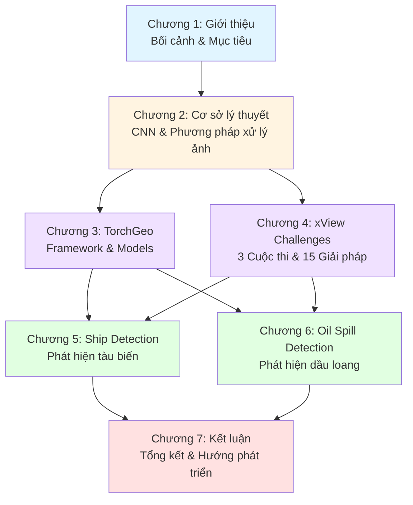

# Chương 1: Giới thiệu

## 1.1. Động cơ nghiên cứu

Trong hai thập kỷ qua, sự bùng nổ của công nghệ vệ tinh quan sát Trái Đất đã tạo ra nguồn dữ liệu ảnh viễn thám khổng lồ với quy mô chưa từng có. Các chương trình vệ tinh như Sentinel của Cơ quan Vũ trụ Châu Âu (ESA), Landsat của NASA, hay các hệ thống thương mại như WorldView và Planet Labs, liên tục thu thập hàng petabyte dữ liệu ảnh mỗi ngày. Khối lượng dữ liệu khổng lồ này đặt ra thách thức lớn: làm thế nào để phân tích, trích xuất thông tin hữu ích một cách tự động, nhanh chóng và chính xác?

Các phương pháp xử lý ảnh viễn thám truyền thống, chủ yếu dựa vào đặc trưng thủ công (handcrafted features) kết hợp với các bộ phân loại cổ điển như Support Vector Machine (SVM) hay Random Forest, đã bộc lộ nhiều hạn chế khi đối mặt với sự đa dạng và phức tạp của dữ liệu thực tế. Các đặc trưng được thiết kế thủ công thường khó tổng quát hóa tốt trên nhiều loại cảnh quan, điều kiện thời tiết, hoặc góc chụp khác nhau. Điều này dẫn đến hiệu suất kém và chi phí nhân công cao trong việc điều chỉnh các tham số cho từng trường hợp cụ thể.

Sự ra đời và phát triển mạnh mẽ của Deep Learning, đặc biệt là mạng Convolutional Neural Network (CNN), đã mang lại bước đột phá quan trọng trong xử lý ảnh viễn thám. Khác với các phương pháp truyền thống, CNN có khả năng tự động học và trích xuất các đặc trưng phân cấp từ dữ liệu thô, từ các đặc trưng cấp thấp như cạnh và góc, đến các đặc trưng cấp cao như hình dạng đối tượng và mối quan hệ không gian. Khả năng học biểu diễn end-to-end này cho phép CNN đạt hiệu suất vượt trội so với các phương pháp truyền thống trong hầu hết các bài toán xử lý ảnh viễn thám, từ phân loại sử dụng đất, phát hiện đối tượng, đến giám sát thay đổi môi trường.

Trong bối cảnh Việt Nam là quốc gia biển với đường bờ biển dài hơn 3,260 km và vùng đặc quyền kinh tế rộng lớn, việc ứng dụng Deep Learning vào giám sát hàng hải và bảo vệ môi trường biển có ý nghĩa đặc biệt quan trọng. Hai bài toán tiêu biểu - phát hiện tàu biển (Ship Detection) và nhận dạng vết dầu loang (Oil Spill Detection) - đóng vai trò then chốt trong việc đảm bảo an ninh biển, chống đánh bắt cá bất hợp pháp (IUU fishing), và phát hiện sớm các sự cố tràn dầu để ứng phó kịp thời, giảm thiểu tác động đến hệ sinh thái biển.

## 1.2. Mục tiêu nghiên cứu

Nghiên cứu này hướng đến ba mục tiêu chính sau:

**Mục tiêu 1: Tổng hợp cơ sở lý thuyết về CNN và các phương pháp xử lý ảnh viễn thám.**
Xây dựng nền tảng kiến thức toàn diện về kiến trúc CNN, các mạng backbone hiện đại (ResNet, EfficientNet, Vision Transformer), và bốn lớp bài toán chính trong xử lý ảnh viễn thám: phân loại hình ảnh (Image Classification), phân đoạn ngữ nghĩa (Semantic Segmentation), phát hiện đối tượng (Object Detection), và giám sát thay đổi (Change Detection). Phần cơ sở lý thuyết này cung cấp nền tảng vững chắc cho việc hiểu và áp dụng các phương pháp Deep Learning vào các bài toán cụ thể.

**Mục tiêu 2: Phân tích chi tiết hai bài toán ứng dụng quan trọng trong lĩnh vực hàng hải.**
Nghiên cứu sâu về phát hiện tàu biển và nhận dạng vết dầu loang từ ảnh viễn thám SAR (Synthetic Aperture Radar). Đối với mỗi bài toán, nội dung sẽ trình bày đặc điểm kỹ thuật, các mô hình state-of-the-art, quy trình xử lý hoàn chỉnh, và các bộ dữ liệu chuẩn được sử dụng trong nghiên cứu và đánh giá. Phần phân tích này giúp hiểu rõ thách thức cụ thể và các giải pháp hiệu quả cho từng bài toán.

**Mục tiêu 3: Giới thiệu các công cụ và phương pháp thực tiễn cho ứng dụng Deep Learning trong viễn thám.**
Tập trung vào thư viện TorchGeo - một framework PyTorch chuyên dụng cho xử lý ảnh địa lý, cung cấp các mô hình pre-trained, datasets chuẩn, và utilities hỗ trợ phát triển nhanh các ứng dụng viễn thám. Đồng thời, phân tích ba cuộc thi xView Challenges (xView1: Object Detection, xView2: Building Damage Assessment, xView3: Maritime Detection) và 15 giải pháp hàng đầu từ các đội thi, rút ra bài học kinh nghiệm và best practices cho việc triển khai thực tế.

## 1.3. Phạm vi và giới hạn

Nội dung tập trung vào ba phạm vi chính:

**Phạm vi về phương pháp:** Tập trung chủ yếu vào Convolutional Neural Network (CNN) và các biến thể hiện đại của nó. Mặc dù Vision Transformer và các kiến trúc mới khác sẽ được đề cập, phân tích chuyên sâu chủ yếu xoay quanh các kiến trúc CNN đã được chứng minh hiệu quả trong xử lý ảnh viễn thám. Các phương pháp Deep Learning khác như Recurrent Neural Network (RNN), Generative Adversarial Network (GAN) nằm ngoài phạm vi nghiên cứu chi tiết.

**Phạm vi về công cụ:** Nội dung tập trung phân tích thư viện TorchGeo và các mô hình có sẵn trong đó. Các framework khác như TensorFlow, Keras, hoặc các thư viện viễn thám chuyên dụng khác (GDAL, Rasterio) sẽ được đề cập nhưng không phân tích chi tiết. Việc lựa chọn TorchGeo dựa trên tính hiện đại, hỗ trợ tốt cho PyTorch ecosystem, và khả năng tích hợp với các mô hình pre-trained từ cộng đồng nghiên cứu.

**Phạm vi về ứng dụng:** Hai bài toán chính được nghiên cứu là phát hiện tàu biển và nhận dạng vết dầu loang, đều sử dụng ảnh SAR làm nguồn dữ liệu chính. Ba cuộc thi xView Challenges được phân tích là xView1 (Object Detection trên ảnh quang học), xView2 (Building Damage Assessment sau thiên tai), và xView3 (Maritime Detection trên ảnh SAR). Các bài toán viễn thám khác như phân loại sử dụng đất, theo dõi thảm thực vật, hay dự báo thời tiết nằm ngoài phạm vi nghiên cứu chuyên sâu.

**Giới hạn:** Nội dung không thực hiện các thử nghiệm mới hoặc đề xuất các kiến trúc mạng mới. Mục tiêu chính là tổng hợp, phân tích và đánh giá các phương pháp hiện có, cung cấp cái nhìn tổng quan và hướng dẫn thực tiễn cho việc áp dụng Deep Learning vào xử lý ảnh viễn thám. Các kết quả thực nghiệm được trích dẫn từ các nghiên cứu đã công bố và các cuộc thi quốc tế.

## 1.4. Cấu trúc nội dung

Nội dung được tổ chức thành bảy chương, với cấu trúc logic từ nền tảng lý thuyết đến ứng dụng thực tiễn:

**Chương 1: Giới thiệu**
Trình bày động cơ nghiên cứu, mục tiêu, phạm vi và cấu trúc tổng thể. Chương này thiết lập bối cảnh và làm rõ tầm quan trọng của việc ứng dụng Deep Learning vào xử lý ảnh viễn thám, đặc biệt trong lĩnh vực giám sát hàng hải và bảo vệ môi trường biển.

**Chương 2: Cơ sở lý thuyết**
Xây dựng nền tảng kiến thức toàn diện về CNN và các phương pháp xử lý ảnh. Chương này bao gồm hai phần chính: (1) Kiến trúc CNN - từ các khối cơ bản (convolution, pooling, activation) đến các mạng backbone hiện đại (ResNet, EfficientNet, Swin Transformer); (2) Phương pháp xử lý ảnh - bao gồm bốn lớp bài toán chính: phân loại hình ảnh, phát hiện đối tượng, phân đoạn ngữ nghĩa, và instance segmentation. Mỗi lớp bài toán được trình bày với định nghĩa, kiến trúc mạng phù hợp, và ứng dụng trong viễn thám.

**Chương 3: TorchGeo - Framework cho Deep Learning trong Viễn thám**
Giới thiệu chi tiết về thư viện TorchGeo, bao gồm: (1) Tổng quan về kiến trúc và tính năng của TorchGeo; (2) Các mô hình classification cho phân loại sử dụng đất; (3) Các mô hình segmentation cho phân đoạn ảnh vệ tinh; (4) Các mô hình change detection cho giám sát thay đổi; (5) Pretrained weights cho các loại cảm biến khác nhau. Chương này cung cấp hướng dẫn thực tiễn về cách sử dụng TorchGeo để phát triển nhanh các ứng dụng viễn thám.

**Chương 4: xView Challenges - Phân tích các cuộc thi quốc tế**
Phân tích chuyên sâu ba cuộc thi xView: (1) xView1 - Object Detection với 60 lớp đối tượng trên ảnh quang học độ phân giải cao; (2) xView2 - Building Damage Assessment sau thiên tai với phân loại 5 mức độ thiệt hại; (3) xView3 - Maritime Detection trên ảnh SAR với nhiệm vụ phát hiện và phân loại tàu biển, bao gồm cả dark vessels không phát tín hiệu AIS. Mỗi cuộc thi được phân tích về đặc điểm dữ liệu, phương pháp đánh giá, và 5 giải pháp hàng đầu với các kỹ thuật đặc trưng.

**Chương 5: Phát hiện tàu biển**
Nghiên cứu chi tiết về bài toán Ship Detection, bao gồm: (1) Đặc điểm bài toán - thách thức về kích thước đa tỷ lệ, nhiễu biển, và phân biệt tàu với các đối tượng giống nhau; (2) Các mô hình state-of-the-art - YOLO, Faster R-CNN, RetinaNet và các biến thể cho ảnh SAR; (3) Quy trình xử lý hoàn chỉnh từ tiền xử lý ảnh SAR đến post-processing kết quả; (4) Các bộ dữ liệu chuẩn như SAR-Ship-Dataset, SSDD, và HRSID.

**Chương 6: Phát hiện vết dầu loang**
Nghiên cứu chi tiết về bài toán Oil Spill Detection, bao gồm: (1) Đặc điểm bài toán - hiện tượng vật lý của vết dầu trên ảnh SAR, phân biệt dầu thật với look-alikes; (2) Các mô hình segmentation - U-Net, DeepLab và các biến thể cho phân đoạn vết dầu; (3) Quy trình xử lý với các bước tiền xử lý đặc biệt cho ảnh SAR biển; (4) Các bộ dữ liệu chuẩn và phương pháp đánh giá phù hợp với đặc thù của bài toán.

**Chương 7: Kết luận**
Tổng kết các nội dung chính, đánh giá tổng quan về tình hình ứng dụng Deep Learning trong viễn thám hiện nay. Chương này cũng chỉ ra các hạn chế còn tồn tại và đề xuất các hướng nghiên cứu tiếp theo, bao gồm việc kết hợp đa nguồn dữ liệu, cải thiện khả năng tổng quát hóa của mô hình, và tối ưu hóa cho triển khai thực tế.

Cấu trúc này được thiết kế để người đọc có thể tiếp cận từ nền tảng lý thuyết (Chương 2), hiểu về công cụ thực tiễn (Chương 3), học hỏi từ các cuộc thi quốc tế (Chương 4), và cuối cùng là áp dụng vào hai bài toán cụ thể (Chương 5 và 6). Sơ đồ dưới đây minh họa mối quan hệ giữa các chương:

## 1.5. Đóng góp chính

Nội dung mang lại những đóng góp chính sau:

**Tổng hợp kiến thức có hệ thống về CNN trong viễn thám.**
Cung cấp một tài liệu tham khảo toàn diện bằng tiếng Việt về ứng dụng CNN và Deep Learning trong xử lý ảnh viễn thám. Nội dung được tổ chức một cách có hệ thống từ cơ sở lý thuyết đến ứng dụng thực tiễn, giúp người đọc - đặc biệt là sinh viên và nghiên cứu viên Việt Nam - dễ dàng tiếp cận và hiểu sâu về lĩnh vực này. Các khái niệm phức tạp được giải thích rõ ràng với thuật ngữ tiếng Việt phù hợp, đồng thời vẫn giữ nguyên các thuật ngữ kỹ thuật tiếng Anh phổ biến.

**Phân tích chuyên sâu TorchGeo và các pretrained weights.**
TorchGeo là một framework tương đối mới (ra mắt năm 2021) nhưng đang phát triển mạnh mẽ trong cộng đồng nghiên cứu viễn thám. Đây là một trong những tài liệu đầu tiên phân tích chi tiết các mô hình, pretrained weights, và utilities của TorchGeo bằng tiếng Việt, giúp giảm thiểu rào cản kỹ thuật cho các nhà nghiên cứu và kỹ sư muốn áp dụng Deep Learning vào xử lý ảnh vệ tinh. Phần phân tích bao gồm so sánh hiệu suất giữa các pretrained weights khác nhau, hướng dẫn lựa chọn mô hình phù hợp cho từng loại dữ liệu.

**Tổng hợp và phân tích 15 giải pháp hàng đầu từ xView Challenges.**
Ba cuộc thi xView đã thu hút hàng nghìn đội thi từ khắp nơi trên thế giới, tạo ra kho tàng giải pháp sáng tạo và hiệu quả. Nội dung tổng hợp và phân tích chi tiết 15 giải pháp hàng đầu (5 giải pháp cho mỗi cuộc thi), rút ra các kỹ thuật, kiến trúc, và chiến lược huấn luyện thành công. Phần phân tích này không chỉ giúp hiểu rõ state-of-the-art hiện tại mà còn cung cấp bài học kinh nghiệm quý báu cho việc thiết kế và triển khai các hệ thống thực tế.

**Hướng dẫn thực tiễn cho hai bài toán ứng dụng quan trọng.**
Đối với phát hiện tàu biển và nhận dạng vết dầu loang, nội dung cung cấp quy trình xử lý chi tiết từng bước, bao gồm tiền xử lý ảnh SAR, lựa chọn và cấu hình mô hình, chiến lược augmentation, và post-processing kết quả. Các quy trình này được xây dựng dựa trên best practices từ các nghiên cứu đã công bố và kinh nghiệm từ các cuộc thi quốc tế, có thể áp dụng trực tiếp hoặc điều chỉnh cho các bài toán tương tự.

**Định hướng nghiên cứu cho cộng đồng viễn thám Việt Nam.**
Thông qua việc tổng hợp các công trình nghiên cứu quốc tế, các cuộc thi lớn, và các công cụ hiện đại, nội dung giúp định hướng hướng nghiên cứu và phát triển cho cộng đồng viễn thám tại Việt Nam. Đặc biệt trong bối cảnh Việt Nam đang đầu tư mạnh vào công nghệ vệ tinh và giám sát biển, các kiến thức và phương pháp được trình bày có thể đóng góp vào việc xây dựng các hệ thống giám sát tự động, phục vụ cho mục tiêu bảo vệ chủ quyền biển đảo và phát triển kinh tế biển bền vững.

## Kết chương

Chương này đã giới thiệu bối cảnh, động cơ, và mục tiêu nghiên cứu về ứng dụng Deep Learning trong xử lý ảnh viễn thám. Sự phát triển vượt bậc của công nghệ vệ tinh quan sát Trái Đất đã tạo ra nguồn dữ liệu khổng lồ, đòi hỏi các phương pháp phân tích tự động hiệu quả. Convolutional Neural Network (CNN) với khả năng học biểu diễn end-to-end đã chứng minh là công cụ mạnh mẽ để giải quyết các bài toán phức tạp trong viễn thám, từ phân loại sử dụng đất đến phát hiện tàu biển và nhận dạng vết dầu loang.

Cấu trúc được thiết kế để dẫn dắt người đọc từ nền tảng lý thuyết vững chắc, thông qua các công cụ và kinh nghiệm thực tiễn từ cộng đồng quốc tế, đến việc áp dụng cụ thể cho hai bài toán quan trọng trong lĩnh vực hàng hải. Mỗi chương đóng góp một góc nhìn khác nhau, bổ trợ lẫn nhau để tạo nên bức tranh toàn cảnh về ứng dụng Deep Learning trong viễn thám.

Để hiểu sâu hơn về các phương pháp và kiến trúc được đề cập trong chương này, **Chương 2** sẽ trình bày chi tiết cơ sở lý thuyết về mạng CNN - từ các khối xây dựng cơ bản như convolution, pooling, và activation, đến các kiến trúc backbone hiện đại như ResNet, EfficientNet, và Vision Transformer. Chương 2 cũng sẽ phân tích bốn lớp bài toán chính trong xử lý ảnh viễn thám với các phương pháp state-of-the-art tương ứng, tạo nền tảng vững chắc cho việc hiểu và áp dụng các kỹ thuật được trình bày trong các chương tiếp theo.