# Chương 2: Kiến trúc Convolutional Neural Network Cơ bản

## Giới thiệu

Sau khi đã nắm được bối cảnh và mục tiêu nghiên cứu ở **Chương 1**, chương này trình bày cơ sở lý thuyết về mạng CNN và các phương pháp xử lý ảnh viễn thám. Đây là nền tảng kiến thức cần thiết để hiểu các kiến trúc mô hình cụ thể được giới thiệu ở **Chương 5** (TorchGeo) và các giải pháp từ cuộc thi **Chương 6** (xView Challenges).

Chương này được chia thành hai mục chính: **Mục 2.1** trình bày kiến trúc CNN cơ bản và các mạng backbone hiện đại, **Mục 2.2** giới thiệu các phương pháp xử lý ảnh bao gồm classification, object detection, semantic segmentation, và instance segmentation.

## 2.1. Tổng quan về Kiến trúc CNN

Convolutional Neural Network (CNN) là một kiến trúc mạng nơ-ron được thiết kế đặc biệt để xử lý dữ liệu có cấu trúc không gian, điển hình là ảnh số. Khác với mạng nơ-ron fully connected truyền thống vốn xử lý đầu vào như một vector phẳng, CNN bảo toàn cấu trúc không gian của dữ liệu thông qua việc sử dụng các phép toán convolution. Điều này cho phép mạng học được các đặc trưng có ý nghĩa về mặt không gian như cạnh, góc, kết cấu, và hình dạng đối tượng.

### 2.1.1. Tại sao cần CNN thay vì mạng Fully Connected?

Việc sử dụng Multilayer Perceptron (MLP) cho xử lý ảnh gặp phải vấn đề nghiêm trọng về số lượng tham số [1]. Xét một ảnh có kích thước khiêm tốn 100×100 pixel với 3 kênh màu RGB, ta có 30,000 giá trị đầu vào. Nếu sử dụng một lớp ẩn với 1,000 nơ-ron, số lượng tham số kết nối đã lên tới 30 triệu.

**Thách thức trong viễn thám:** Ảnh vệ tinh thường có độ phân giải và số kênh phổ cao hơn đáng kể so với ảnh tự nhiên. Ảnh Sentinel-2 có 13 kênh phổ với độ phân giải 10-60m, ảnh WorldView-3 có 16 kênh với độ phân giải 0.3-1.2m. Một tile ảnh Sentinel-2 kích thước 512×512×13 chứa hơn 3 triệu giá trị - việc sử dụng MLP trở nên hoàn toàn không khả thi.

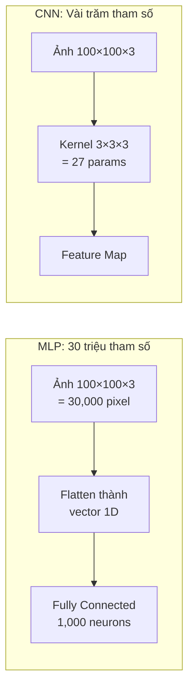

CNN giải quyết vấn đề này dựa trên hai nguyên lý quan trọng:

**Tính bất biến với phép tịnh tiến (Translation Invariance):** Một đặc trưng có ý nghĩa (ví dụ: cạnh của tàu biển) nên được nhận dạng bất kể nó xuất hiện ở vị trí nào trong ảnh. CNN đạt được điều này bằng cách sử dụng cùng một bộ lọc trượt qua toàn bộ ảnh, thay vì học các tham số riêng biệt cho từng vị trí.

**Tính cục bộ (Locality):** Các đặc trưng thị giác cơ bản như cạnh, góc, và kết cấu phụ thuộc vào các pixel lân cận, không phụ thuộc vào các pixel ở xa. CNN khai thác điều này bằng cách hạn chế mỗi nơ-ron chỉ "nhìn thấy" một vùng nhỏ của ảnh đầu vào, gọi là receptive field cục bộ.

### 2.1.2. Cấu trúc phân cấp của CNN

Một mạng CNN điển hình được cấu thành từ nhiều lớp xếp chồng lên nhau, mỗi lớp thực hiện một phép biến đổi cụ thể. Kiến trúc này có thể được hình dung như một pipeline xử lý phân cấp:

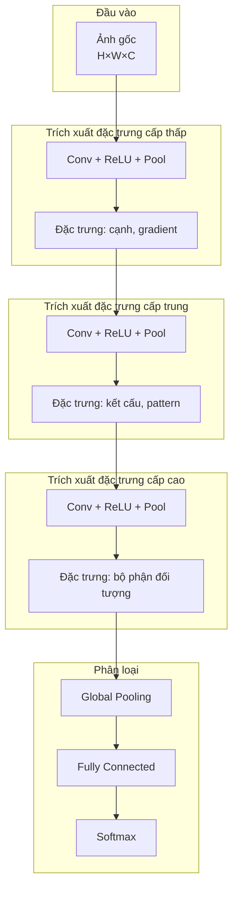

Các lớp đầu học được các đặc trưng cấp thấp như cạnh theo nhiều hướng và thay đổi cường độ sáng. Các lớp giữa kết hợp các đặc trưng cấp thấp để tạo thành các pattern phức tạp hơn như kết cấu bề mặt nước hay góc của công trình. Các lớp sâu hơn học được các đặc trưng ngữ nghĩa cao như hình dạng tàu biển hay vùng dầu loang.

## 2.2. Phép toán Tương quan chéo (Cross-Correlation)

### 2.2.1. Định nghĩa và Công thức

Phép toán cốt lõi trong lớp convolution thực chất là **tương quan chéo (cross-correlation)** chứ không phải tích chập (convolution) theo nghĩa toán học thuần túy [1]. Tuy nhiên, trong lĩnh vực học sâu, hai thuật ngữ này thường được sử dụng thay thế cho nhau do sự khác biệt chỉ nằm ở việc lật kernel, điều không ảnh hưởng đến khả năng học của mạng.

Xét đầu vào là ma trận hai chiều **X** có kích thước n_h × n_w và bộ lọc (kernel) **K** có kích thước k_h × k_w. Phép tương quan chéo tạo ra output **Y** với kích thước:

**(n_h - k_h + 1) × (n_w - k_w + 1)**

Giá trị tại mỗi vị trí (i, j) của output được tính bằng cách:
1. Đặt kernel chồng lên vùng tương ứng của input
2. Nhân từng phần tử (element-wise multiplication)
3. Cộng tất cả các tích lại với nhau

### 2.2.2. Minh họa Phép tính với Kernel 2×2

Dưới đây là ví dụ minh họa phép tương quan chéo với input 3×3 và kernel 2×2:

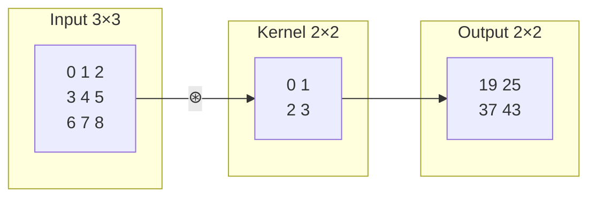

**Tính giá trị đầu tiên (vị trí 0,0):**
- Vùng input được chọn: [[0,1], [3,4]]
- Phép nhân element-wise với kernel: 0×0 + 1×1 + 3×2 + 4×3 = 0 + 1 + 6 + 12 = **19**

**Tính giá trị thứ hai (vị trí 0,1):**
- Kernel trượt sang phải 1 vị trí
- Vùng input được chọn: [[1,2], [4,5]]
- Phép tính: 1×0 + 2×1 + 4×2 + 5×3 = 0 + 2 + 8 + 15 = **25**

Tương tự, ta tính được các giá trị còn lại: 37 và 43.

### 2.2.3. Ứng dụng: Phát hiện cạnh

Một ứng dụng kinh điển của phép convolution là phát hiện cạnh (edge detection). Xét kernel đơn giản [[1, -1]] để phát hiện cạnh dọc:

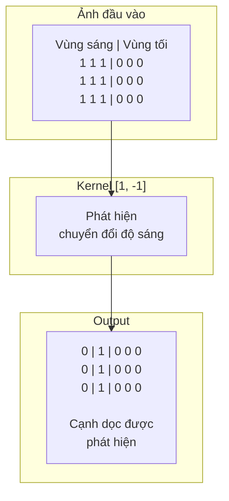

- Tại vùng pixel đồng nhất (đều sáng hoặc đều tối): output = 0
- Tại ranh giới sáng-tối: output = 1 (hoặc -1 nếu từ tối sang sáng)

Điểm mạnh của CNN nằm ở khả năng **học kernel tối ưu từ dữ liệu** thông qua gradient descent, thay vì phải thiết kế thủ công [1]. Các thực nghiệm cho thấy kernel được học tự động có thể hội tụ về giá trị gần với kernel thiết kế thủ công sau một số iterations nhất định.

## 2.3. Lớp Convolution (Convolutional Layer)

### 2.3.1. Các Tham số Quan trọng

**Kích thước bộ lọc (Kernel Size):** Quyết định receptive field cục bộ của mỗi nơ-ron. Các kích thước phổ biến bao gồm 3×3, 5×5, và 7×7. Bộ lọc 3×3 được sử dụng rộng rãi nhất trong các kiến trúc hiện đại vì có thể xếp chồng nhiều lớp 3×3 để đạt được receptive field tương đương bộ lọc lớn hơn, đồng thời giảm số lượng tham số và tăng khả năng biểu diễn phi tuyến [3].

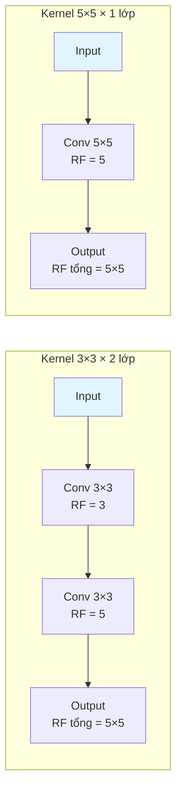

**So sánh số tham số:**
- 2 lớp Conv 3×3: 2 × (3×3) = 18 tham số + thêm 1 ReLU
- 1 lớp Conv 5×5: 5×5 = 25 tham số

Như vậy, việc xếp chồng kernel nhỏ không chỉ tiết kiệm tham số mà còn tăng khả năng biểu diễn phi tuyến nhờ các hàm kích hoạt xen kẽ giữa các lớp.

### 2.3.2. Padding (Đệm)

Khi áp dụng kernel k×k lên input n×n, output có kích thước (n-k+1)×(n-k+1), tức nhỏ hơn input. Sau nhiều lớp convolution liên tiếp, kích thước không gian giảm nhanh chóng và có thể dẫn đến mất thông tin ở biên ảnh.

**Padding** là kỹ thuật thêm các pixel (thường có giá trị 0) vào viền ảnh đầu vào để kiểm soát kích thước output. Với padding p (mỗi bên), kích thước output trở thành:

**(n_h - k_h + 2p + 1) × (n_w - k_w + 2p + 1)**

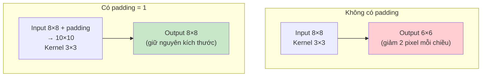

**Quy tắc thực hành:** Để giữ nguyên kích thước không gian, đặt padding = (k-1)/2 với kernel kích thước k (k lẻ). Ví dụ: kernel 3×3 cần padding = 1, kernel 5×5 cần padding = 2.

### 2.3.3. Stride (Bước nhảy)

**Stride** xác định số pixel mà kernel di chuyển sau mỗi bước tính toán. Stride = 1 nghĩa là kernel trượt từng pixel một; stride = 2 nghĩa là kernel nhảy 2 pixel mỗi bước, làm giảm kích thước output xuống còn một nửa theo mỗi chiều.

**Công thức tổng quát với cả padding và stride:**

⌊(n_h - k_h + p_h + s_h) / s_h⌋ × ⌊(n_w - k_w + p_w + s_w) / s_w⌋

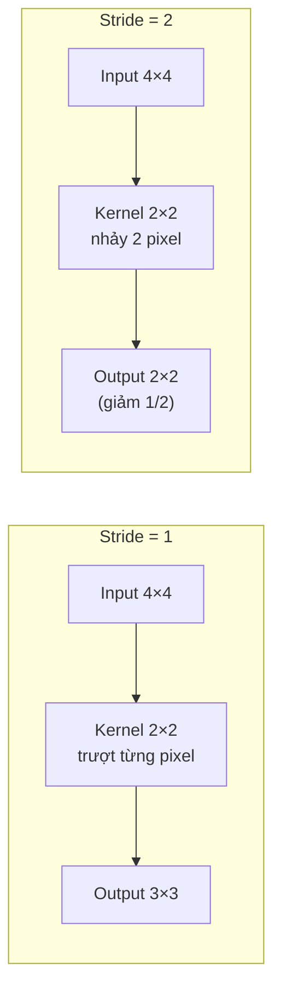

Trong các kiến trúc hiện đại, stride > 1 thường được sử dụng để giảm kích thước không gian thay cho pooling (gọi là strided convolution), cho phép mạng học cách downsampling tối ưu thay vì sử dụng phép toán cố định.

### 2.3.4. Xử lý Đa kênh (Multiple Channels)

Ảnh thực tế thường có nhiều kênh: ảnh RGB có 3 kênh, ảnh vệ tinh đa phổ có thể có từ 4 đến 13 kênh hoặc hơn. Để xử lý input có c_i kênh, kernel phải có cùng số kênh: **c_i × k_h × k_w**.

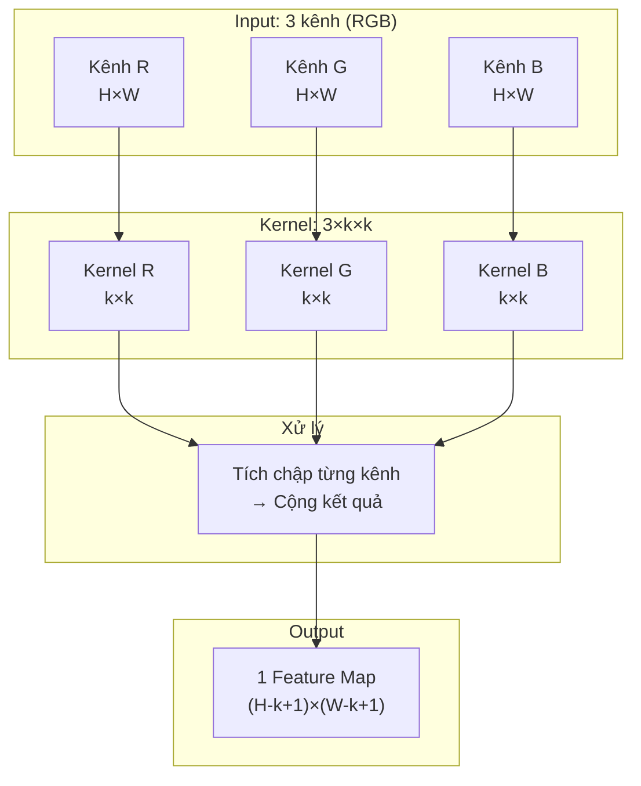

Để tạo nhiều feature map đầu ra (c_o kênh), ta sử dụng c_o bộ kernel riêng biệt. Tổng số tham số của một lớp convolution là: **c_o × c_i × k_h × k_w + c_o** (bao gồm cả bias).

### 2.3.5. Tích chập 1×1

Mặc dù thoạt nhìn có vẻ không có ý nghĩa vì không tổng hợp thông tin không gian, tích chập 1×1 đóng vai trò quan trọng trong các kiến trúc CNN hiện đại [1]:

- **Thay đổi số kênh:** Chuyển từ c_i kênh sang c_o kênh một cách hiệu quả
- **Kết hợp thông tin đa kênh:** Mỗi pixel output là tổ hợp tuyến tính của c_i giá trị từ các kênh input tại cùng vị trí
- **Tương đương fully connected theo pixel:** Áp dụng cùng phép biến đổi tuyến tính cho mọi vị trí không gian, cho phép tăng hoặc giảm chiều biểu diễn

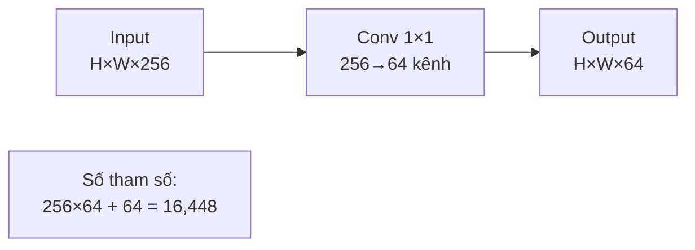

### 2.3.6. Đặc điểm Ảnh Viễn thám và Xử lý Đa kênh

Ảnh viễn thám có những đặc điểm khác biệt so với ảnh tự nhiên, đòi hỏi các điều chỉnh trong kiến trúc CNN:

**Ảnh đa phổ (Multispectral Imagery):** Không giới hạn ở 3 kênh RGB, ảnh vệ tinh thường có nhiều kênh phổ khác nhau. Sentinel-2 cung cấp 13 kênh từ visible (VIS) đến near-infrared (NIR) và shortwave infrared (SWIR). Khi sử dụng pre-trained weights từ ImageNet (3 kênh), có thể mở rộng lớp convolution đầu tiên để nhận C kênh input, hoặc chọn 3 kênh phù hợp nhất (ví dụ: kênh 4-Red, 3-Green, 2-Blue của Sentinel-2).

**Ảnh SAR (Synthetic Aperture Radar):** Sentinel-1 cung cấp ảnh SAR với 2 kênh phân cực VV (vertical-vertical) và VH (vertical-horizontal). Đặc tính của ảnh SAR khác hoàn toàn với ảnh quang học: không phụ thuộc vào ánh sáng mặt trời, xuyên qua mây, và có speckle noise đặc trưng. Các backbone CNN cần được pre-train hoặc fine-tune đặc biệt cho ảnh SAR để đạt hiệu suất tốt.

**Multi-scale objects:** Trong ảnh vệ tinh chụp từ trên cao, cùng một loại đối tượng có thể xuất hiện ở nhiều tỷ lệ rất khác nhau. Một tàu container có thể dài hàng trăm pixel trong ảnh độ phân giải cao, trong khi một tàu đánh cá nhỏ chỉ vài pixel trong ảnh Sentinel-1. Điều này đòi hỏi kiến trúc multi-scale như Feature Pyramid Network (FPN) và các cơ chế attention để xử lý hiệu quả.

## 2.4. Lớp Pooling

### 2.4.1. Mục đích và Nguyên lý

Lớp pooling thực hiện phép giảm mẫu (downsampling), thu nhỏ kích thước không gian của feature map trong khi giữ lại thông tin quan trọng nhất. Pooling phục vụ ba mục đích chính [1]:

1. **Giảm chi phí tính toán:** Giảm số lượng tham số và phép tính cho các lớp tiếp theo
2. **Mở rộng receptive field:** Mỗi nơ-ron ở lớp sâu hơn có thể "nhìn thấy" vùng ảnh lớn hơn
3. **Tăng tính bất biến:** Giảm độ nhạy cảm với các dịch chuyển nhỏ của đối tượng trong ảnh

**Đặc điểm quan trọng:** Khác với lớp convolution, pooling không có tham số học được. Nó áp dụng một phép toán cố định (max hoặc average) lên từng vùng của input. Số kênh output bằng số kênh input vì pooling xử lý từng kênh độc lập.

### 2.4.2. Max Pooling và Average Pooling

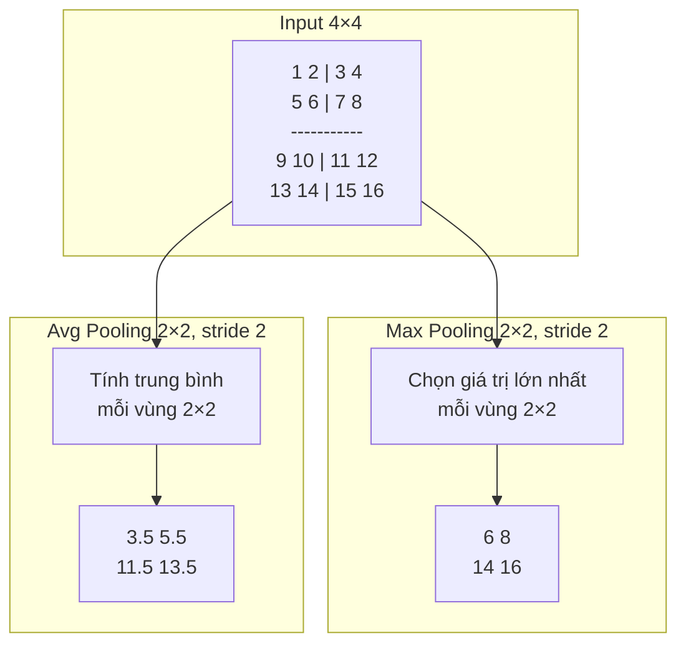

**Max Pooling** chọn giá trị lớn nhất trong mỗi vùng pooling, giữ lại activation mạnh nhất. Phương pháp này phù hợp khi quan tâm đến sự tồn tại của đặc trưng tại một vùng nhất định và tạo tính bất biến với các dịch chuyển nhỏ.

**Average Pooling** tính giá trị trung bình của các phần tử trong vùng pooling, giữ lại thông tin tổng thể về cường độ đặc trưng. Phương pháp này phù hợp cho việc tổng hợp ngữ cảnh và thường được sử dụng ở cuối mạng.

### 2.4.3. Global Average Pooling (GAP)

Global Average Pooling tính trung bình trên toàn bộ feature map cho mỗi kênh, tạo ra output có kích thước 1×1×C (với C là số kênh). Kỹ thuật này được giới thiệu trong Network in Network [6] và được sử dụng rộng rãi trong các kiến trúc hiện đại.

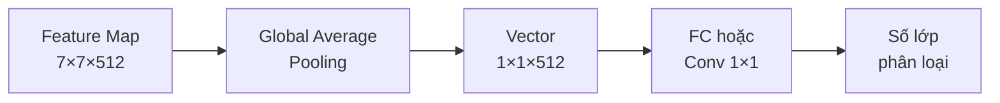

GAP mang lại nhiều lợi ích quan trọng:
- **Giảm đáng kể số tham số** so với việc sử dụng các lớp fully connected lớn
- **Tránh overfitting** nhờ loại bỏ phần lớn tham số ở phần classifier
- **Cho phép xử lý ảnh với kích thước bất kỳ** vì không phụ thuộc vào kích thước không gian cố định

## 2.5. Hàm Kích hoạt (Activation Function)

### 2.5.1. Vai trò của Hàm Kích hoạt

Hàm kích hoạt đóng vai trò thiết yếu trong việc thêm tính phi tuyến vào mạng nơ-ron. Nếu không có hàm kích hoạt phi tuyến, việc xếp chồng nhiều lớp convolution hay fully connected sẽ chỉ tương đương với một phép biến đổi tuyến tính duy nhất:

f(g(x)) = Ax + b (nếu cả f và g đều tuyến tính)

Với hàm kích hoạt phi tuyến, mạng có thể xấp xỉ các hàm phức tạp tùy ý theo định lý universal approximation, mở ra khả năng học các biểu diễn phức tạp từ dữ liệu.

### 2.5.2. ReLU và các biến thể

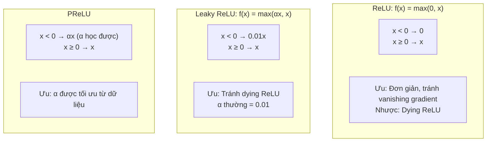

**ReLU (Rectified Linear Unit)** là hàm kích hoạt được sử dụng phổ biến nhất trong các CNN hiện đại [3] nhờ các ưu điểm:
- **Tính toán đơn giản:** Chỉ cần thực hiện phép so sánh với 0
- **Giảm vấn đề vanishing gradient:** Gradient bằng 1 khi x > 0, cho phép gradient truyền ngược hiệu quả
- **Tạo sparse activation:** Nhiều output bằng 0, giúp biểu diễn hiệu quả và tiết kiệm tính toán

**Nhược điểm "Dying ReLU":** Nếu input luôn âm (do khởi tạo trọng số không phù hợp hoặc learning rate quá lớn), gradient sẽ bằng 0 và nơ-ron không thể cập nhật được nữa, dẫn đến hiện tượng nơ-ron "chết" vĩnh viễn.

**Leaky ReLU** và **PReLU** được đề xuất để khắc phục vấn đề này bằng cách cho phép một gradient nhỏ khi x < 0, đảm bảo nơ-ron luôn có thể được cập nhật.

### 2.5.3. Hàm Sigmoid và Softmax

**Sigmoid:** σ(x) = 1 / (1 + e^(-x))
- Output nằm trong khoảng (0, 1), thích hợp cho việc biểu diễn xác suất
- Thường được sử dụng cho bài toán phân loại nhị phân (binary classification)
- Nhược điểm: Gặp vấn đề vanishing gradient khi |x| lớn, làm chậm quá trình học

**Softmax:** Biến đổi vector z thành phân phối xác suất:
- softmax(z_i) = e^(z_i) / Σ e^(z_j)
- Tổng các xác suất bằng 1, cho phép diễn giải output như xác suất thuộc từng lớp
- Được sử dụng ở lớp cuối cùng cho bài toán phân loại đa lớp (multi-class classification)

### 2.5.4. Hàm kích hoạt hiện đại: GELU và Swish

**GELU (Gaussian Error Linear Unit)** kết hợp tính chất của ReLU với một hàm mịn, được sử dụng rộng rãi trong các mô hình Transformer như BERT và Vision Transformer [7]. GELU có thể được xấp xỉ bằng công thức: GELU(x) ≈ 0.5x(1 + tanh(√(2/π)(x + 0.044715x³)))

**Swish** được định nghĩa là f(x) = x × σ(x), tự động điều chỉnh giữa hành vi tuyến tính và phi tuyến tùy thuộc vào giá trị input. Hàm này cho kết quả tốt trên nhiều kiến trúc, đặc biệt là EfficientNet [8].

## 2.6. Batch Normalization

### 2.6.1. Vấn đề Internal Covariate Shift

Trong quá trình huấn luyện mạng sâu, phân phối của input tại mỗi lớp thay đổi liên tục theo sự cập nhật của các lớp trước đó. Hiện tượng này được gọi là **internal covariate shift** [4], gây khó khăn cho quá trình học vì mỗi lớp phải liên tục thích nghi với phân phối input mới thay vì tập trung vào việc học các đặc trưng hữu ích.

### 2.6.2. Cơ chế Batch Normalization

Batch Normalization (BN) được đề xuất bởi Ioffe và Szegedy [4] như một giải pháp cho vấn đề trên. BN chuẩn hóa activation của mỗi lớp theo mean và variance của mini-batch hiện tại, sau đó áp dụng phép biến đổi tuyến tính với các tham số học được:

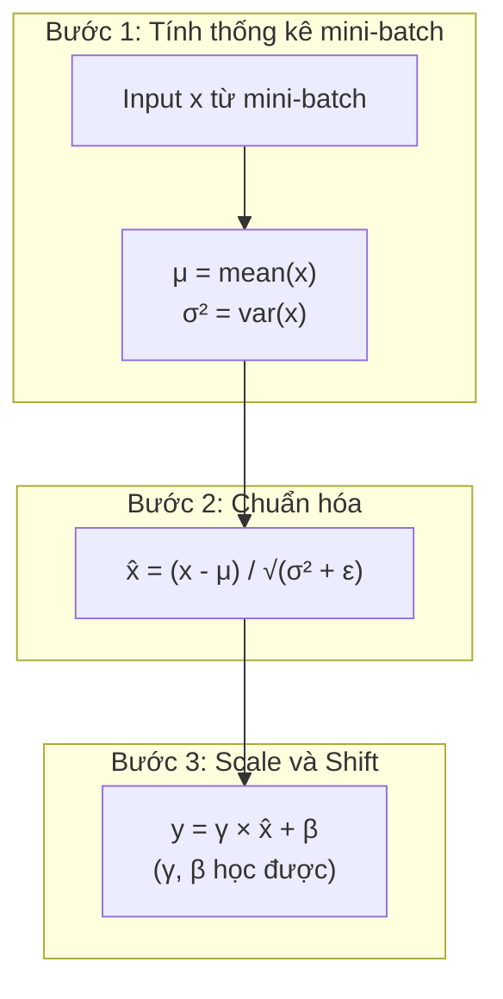

**Công thức tổng quát:** y = γ × (x - μ) / √(σ² + ε) + β

Trong đó:
- **μ, σ²:** Mean và variance của mini-batch (trong training) hoặc running average (trong inference)
- **ε:** Hằng số nhỏ (thường 10⁻⁵) để tránh chia cho 0
- **γ, β:** Tham số scale và shift, được học từ dữ liệu, cho phép mạng khôi phục biểu diễn ban đầu nếu cần thiết

### 2.6.3. Lợi ích của Batch Normalization

Batch Normalization mang lại nhiều lợi ích quan trọng cho quá trình huấn luyện [4]:

1. **Cho phép sử dụng learning rate lớn hơn:** BN ổn định phân phối activation, giảm nguy cơ gradient exploding và cho phép tăng tốc độ học
2. **Giảm phụ thuộc vào khởi tạo trọng số:** Việc chuẩn hóa làm giảm ảnh hưởng của giá trị khởi tạo ban đầu đến quá trình huấn luyện
3. **Đóng vai trò regularization:** Noise từ việc ước lượng mean và variance theo mini-batch có tác dụng tương tự dropout, giúp giảm overfitting
4. **Tăng tốc convergence đáng kể:** Các thực nghiệm cho thấy BN có thể giảm số lượng iterations cần thiết để đạt convergence

**Vị trí trong kiến trúc:** BN thường được đặt sau lớp convolution hoặc fully connected. Có hai cách tiếp cận phổ biến: đặt BN trước hàm kích hoạt (pre-activation, được sử dụng trong ResNet v2) hoặc sau hàm kích hoạt (post-activation, sử dụng trong kiến trúc gốc).

## 2.7. Dropout

### 2.7.1. Cơ chế Hoạt động

Dropout là kỹ thuật regularization được đề xuất bởi Srivastava et al. [5] nhằm giảm overfitting trong mạng nơ-ron sâu. Trong mỗi iteration huấn luyện, dropout ngẫu nhiên "tắt" một tỷ lệ p các nơ-ron bằng cách đặt output của chúng về 0.

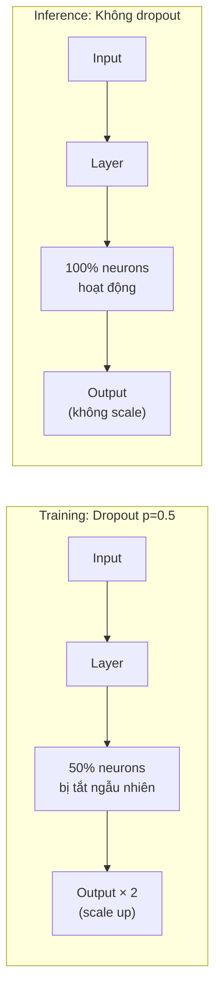

Cơ chế này buộc mạng phải học các biểu diễn robust, không phụ thuộc vào bất kỳ nơ-ron cụ thể nào. Từ góc độ lý thuyết, dropout có thể được hiểu như một hình thức model averaging: mỗi lần training với một tập con nơ-ron khác nhau tương đương với việc training một mạng con khác nhau, và kết quả inference là trung bình của tất cả các mạng con này.

### 2.7.2. Chiến lược sử dụng Dropout

Tỷ lệ dropout được lựa chọn phụ thuộc vào loại lớp và kiến trúc mạng:

- **Lớp fully connected:** Thường sử dụng p = 0.5 (tắt 50% nơ-ron) vì số lượng tham số lớn, dễ overfitting
- **Lớp convolution:** Thường sử dụng p nhỏ hơn (0.1 - 0.3) hoặc không sử dụng do tính chất chia sẻ trọng số đã có tác dụng regularization
- **Kiến trúc hiện đại:** Nhiều kiến trúc như ResNet và EfficientNet thay thế dropout bằng Batch Normalization kết hợp với weight decay, cho kết quả tương đương hoặc tốt hơn

## 2.8. Kiến trúc Tổng thể của CNN

### 2.8.1. Mẫu Kiến trúc Cổ điển

Các kiến trúc CNN cổ điển như LeNet [2] và VGGNet [3] tuân theo một mẫu thiết kế nhất quán: xen kẽ các lớp convolution với pooling, theo sau bởi các lớp fully connected để thực hiện phân loại.

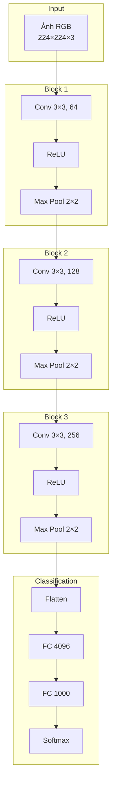

**Quy luật thiết kế chung:**
- **Kích thước không gian giảm dần:** 224 → 112 → 56 → 28 → 14 → 7 (thường giảm một nửa sau mỗi lần pooling)
- **Số kênh tăng dần:** 3 → 64 → 128 → 256 → 512 (thường tăng gấp đôi khi giảm kích thước không gian)
- **Biểu diễn chuyển từ chi tiết không gian sang ngữ nghĩa trừu tượng:** Các lớp đầu biểu diễn đặc trưng cấp thấp (cạnh, góc), các lớp sâu biểu diễn khái niệm ngữ nghĩa cao (đối tượng, bộ phận)

### 2.8.2. Kiến trúc Hiện đại

Các kiến trúc CNN hiện đại như ResNet [9], Inception [10], và EfficientNet [8] đã đưa ra nhiều cải tiến quan trọng so với mẫu cổ điển:

- **Skip connection (Residual connection):** Cho phép gradient chảy trực tiếp qua nhiều lớp, giải quyết vấn đề vanishing gradient và cho phép huấn luyện mạng rất sâu (hàng trăm đến hàng nghìn lớp)
- **Bottleneck block:** Sử dụng Conv 1×1 để giảm số kênh trước khi thực hiện Conv 3×3 tốn kém, sau đó tăng lại số kênh, giảm đáng kể chi phí tính toán
- **Global Average Pooling:** Thay thế các lớp fully connected lớn ở cuối mạng, giảm số tham số và tránh overfitting
- **Compound scaling:** Cân bằng đồng thời ba chiều (độ sâu, độ rộng, và độ phân giải) để đạt hiệu quả tối ưu với một lượng tài nguyên tính toán cho trước

Chi tiết các kiến trúc backbone này được trình bày trong Mục 2.2.

## 2.9. Quá trình Huấn luyện CNN

### 2.9.1. Forward và Backward Propagation

Quá trình huấn luyện CNN bao gồm hai giai đoạn chính được thực hiện lặp đi lặp lại: forward propagation và backward propagation.

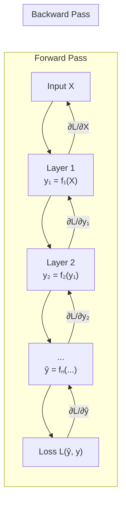

**Forward propagation** là quá trình tính toán output của mạng từ input đầu vào. Dữ liệu được truyền qua từng lớp theo thứ tự, với output của lớp trước trở thành input của lớp sau. Tại mỗi lớp, các phép biến đổi tương ứng (convolution, activation, pooling, v.v.) được thực hiện cho đến khi thu được output cuối cùng.

**Backward propagation** (hay backpropagation) là quá trình tính toán gradient của loss function theo từng tham số trong mạng bằng cách áp dụng chain rule. Gradient được tính toán từ lớp cuối cùng và truyền ngược về lớp đầu tiên, cho phép xác định hướng cập nhật tối ưu cho mỗi tham số.

### 2.9.2. Hàm Loss (Loss Function)

Hàm loss đo lường sự khác biệt giữa output dự đoán của mạng và nhãn thực tế (ground truth), cung cấp tín hiệu để điều chỉnh các tham số trong quá trình học.

**Cross-Entropy Loss** là hàm loss được sử dụng phổ biến nhất cho bài toán phân loại đa lớp:

L = -Σᵢ yᵢ × log(pᵢ)

Trong đó:
- **yᵢ:** One-hot encoding của nhãn thực tế (1 cho lớp đúng, 0 cho các lớp khác)
- **pᵢ:** Xác suất dự đoán cho lớp i (output của softmax)

Cross-Entropy Loss có tính chất phạt nặng các dự đoán sai với độ tin cậy cao, khuyến khích mô hình đưa ra các dự đoán chính xác và đáng tin cậy.

Đối với các bài toán khác trong viễn thám như phát hiện đối tượng và phân đoạn ngữ nghĩa, các hàm loss phức tạp hơn được sử dụng, bao gồm:
- **Focal Loss:** Giải quyết vấn đề mất cân bằng lớp trong object detection
- **Dice Loss và IoU Loss:** Tối ưu trực tiếp các metric đánh giá cho segmentation
- **Smooth L1 Loss:** Sử dụng cho bounding box regression trong object detection

### 2.9.3. Thuật toán Optimization

Sau khi tính được gradient, các thuật toán optimization sử dụng thông tin này để cập nhật tham số theo hướng giảm loss.

**Stochastic Gradient Descent (SGD) với Momentum** là thuật toán cổ điển nhưng vẫn hiệu quả. Momentum giúp tích lũy "đà" từ các bước trước, giúp vượt qua các local minima nhỏ và tăng tốc convergence:

v_t = β × v_{t-1} + η × ∇L
θ_t = θ_{t-1} - v_t

Trong đó β là hệ số momentum (thường 0.9) và η là learning rate.

**Adam (Adaptive Moment Estimation)** kết hợp ưu điểm của momentum với adaptive learning rate cho từng tham số. Adam duy trì ước lượng của cả moment bậc một (mean) và bậc hai (variance) của gradient, cho phép điều chỉnh learning rate phù hợp với từng tham số. Thuật toán này đặc biệt hiệu quả cho các bài toán với gradient thưa hoặc noisy.

**Learning Rate Scheduling** là kỹ thuật quan trọng để đạt convergence tốt. Các chiến lược phổ biến bao gồm:
- **Step decay:** Giảm learning rate theo các bước cố định (ví dụ: giảm 10 lần sau mỗi 30 epochs)
- **Cosine annealing:** Giảm learning rate theo hàm cosine, cho phép "warm restart" để thoát khỏi local minima
- **Warmup:** Bắt đầu với learning rate nhỏ và tăng dần trong một số iterations đầu, giúp ổn định quá trình training ban đầu

**Weight Decay (L2 Regularization)** thêm penalty cho các trọng số có giá trị lớn, giúp tránh overfitting:

L_total = L_data + λ × ||W||²

Trong đó λ là hệ số regularization, kiểm soát độ mạnh của penalty. Weight decay được sử dụng rộng rãi trong hầu hết các kiến trúc CNN hiện đại.

---

## Tài liệu Tham khảo

[1] Zhang, A., Lipton, Z. C., Li, M., & Smola, A. J. (2023). Dive into Deep Learning. Cambridge University Press. https://d2l.ai/

[2] LeCun, Y., Bottou, L., Bengio, Y., & Haffner, P. (1998). Gradient-based learning applied to document recognition. *Proceedings of the IEEE*, 86(11), 2278-2324.

[3] Simonyan, K., & Zisserman, A. (2015). Very Deep Convolutional Networks for Large-Scale Image Recognition. In *Proceedings of ICLR 2015*.

[4] Ioffe, S., & Szegedy, C. (2015). Batch Normalization: Accelerating Deep Network Training by Reducing Internal Covariate Shift. In *Proceedings of ICML 2015*.

[5] Srivastava, N., Hinton, G., Krizhevsky, A., Sutskever, I., & Salakhutdinov, R. (2014). Dropout: A Simple Way to Prevent Neural Networks from Overfitting. *Journal of Machine Learning Research*, 15, 1929-1958.

[6] Lin, M., Chen, Q., & Yan, S. (2014). Network In Network. In *Proceedings of ICLR 2014*.

[7] Hendrycks, D., & Gimpel, K. (2016). Gaussian Error Linear Units (GELUs). *arXiv preprint arXiv:1606.08415*.

[8] Tan, M., & Le, Q. V. (2019). EfficientNet: Rethinking Model Scaling for Convolutional Neural Networks. In *Proceedings of ICML 2019*.

[9] He, K., Zhang, X., Ren, S., & Sun, J. (2016). Deep Residual Learning for Image Recognition. In *Proceedings of CVPR 2016*.

[10] Szegedy, C., et al. (2015). Going Deeper with Convolutions. In *Proceedings of CVPR 2015*.
