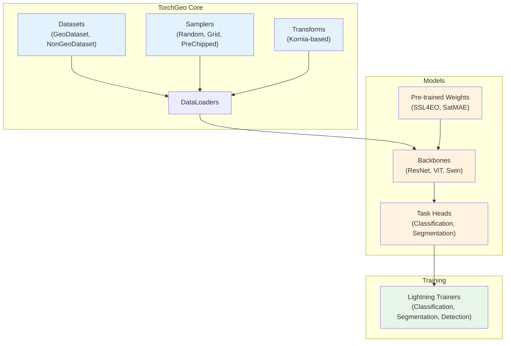
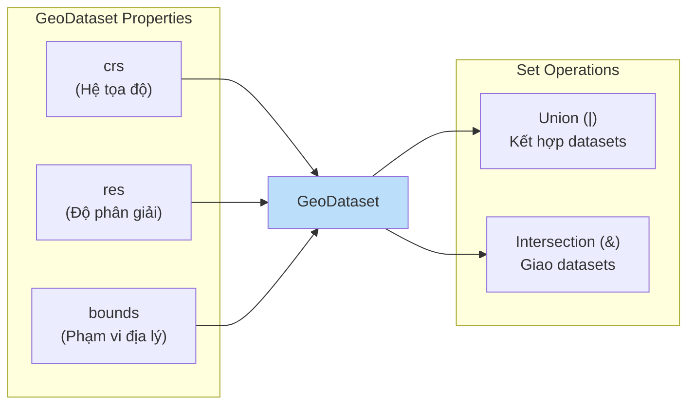

# Chương 3: Kiến Trúc Mô Hình - TorchGeo Framework

## 3.1. Giới Thiệu

Dựa trên nền tảng lý thuyết CNN đã trình bày ở **Chương 2**, chương này giới thiệu các kiến trúc mô hình cụ thể được triển khai trong thư viện TorchGeo - công cụ chuyên biệt cho xử lý ảnh viễn thám. TorchGeo [Stewart et al., 2022] ra đời như một giải pháp toàn diện, cung cấp hệ sinh thái datasets, samplers, transforms và pre-trained models được thiết kế riêng cho các bài toán geospatial machine learning trên nền tảng PyTorch.

Khác với các thư viện deep learning thông thường vốn được phát triển chủ yếu cho natural images, TorchGeo nhận thức rõ những đặc thù riêng biệt của dữ liệu viễn thám: từ số kênh phổ đa dạng (13 bands Sentinel-2), kiểu dữ liệu 16/32-bit, đến hệ tọa độ tham chiếu phức tạp. Thư viện này đóng vai trò cầu nối quan trọng giữa cộng đồng viễn thám và cộng đồng học sâu, giúp các nhà nghiên cứu tập trung vào giải quyết bài toán thay vì xử lý các vấn đề kỹ thuật dữ liệu.

Chương này được tổ chức thành 5 mục chính:
- **Mục 3.1:** Tổng quan TorchGeo framework và đặc thù dữ liệu viễn thám
- **Mục 3.2:** Backbone models cho classification (ResNet, ViT, Swin, EfficientNet)
- **Mục 3.3:** Segmentation architectures (U-Net, DeepLabV3+, FPN, PSPNet, HRNet)
- **Mục 3.4:** Change detection models (FC-Siam, BIT-Transformer, STANet)
- **Mục 3.5:** Pre-trained weights và transfer learning (SSL4EO, SatMAE, Prithvi)

Các kiến trúc mô hình được trình bày trong chương này sẽ là nền tảng cho việc phân tích các giải pháp chiến thắng trong **Chương 4 - xView Challenges**, và ứng dụng thực tế trong **Chương 5** (phát hiện tàu biển) và **Chương 6** (phát hiện dầu loang).

## 5.2. Động Cơ Phát Triển TorchGeo

### 5.2.1. Đặc Điểm Riêng Biệt của Dữ Liệu Địa Không Gian

Dữ liệu viễn thám khác biệt căn bản với natural images ở nhiều khía cạnh, đòi hỏi các phương pháp xử lý chuyên biệt. Những khác biệt này không chỉ mang tính kỹ thuật mà còn ảnh hưởng trực tiếp đến thiết kế kiến trúc mô hình và chiến lược huấn luyện.

**Số lượng kênh phổ (Spectral Bands):** Trong khi ảnh tự nhiên thông thường có 3 kênh RGB với giá trị 8-bit (0-255), ảnh vệ tinh có thể chứa từ vài đến hàng trăm kênh phổ. Sentinel-2 cung cấp 13 kênh phổ bao gồm cả vùng cận hồng ngoại (NIR) và hồng ngoại sóng ngắn (SWIR), trong khi các cảm biến siêu phổ (hyperspectral) có thể ghi nhận hàng trăm kênh. Các mô hình chuẩn như ResNet, VGG được thiết kế cho đầu vào 3 kênh, do đó cần được điều chỉnh đáng kể khi áp dụng cho dữ liệu đa phổ.

**Kiểu dữ liệu và dải giá trị:** Ảnh vệ tinh thường được lưu trữ ở định dạng 16-bit hoặc 32-bit floating point, có thể chứa giá trị âm (như trong dữ liệu phản xạ đã hiệu chỉnh khí quyển hoặc nhiệt độ bề mặt). Dữ liệu radar SAR thường ở dạng số phức hoặc thang logarit (decibel). Sự đa dạng này đòi hỏi các pipeline tiền xử lý linh hoạt hơn so với chuẩn hóa đơn giản 0-255.

**Kích thước không gian và phạm vi phủ:** Một cảnh ảnh vệ tinh có thể bao phủ hàng nghìn km² với hàng tỷ pixel, vượt xa khả năng xử lý của bộ nhớ GPU thông thường. Điều này đặt ra yêu cầu về chiến lược tiling và sampling hiệu quả để chia nhỏ dữ liệu thành các mảnh (patches) có kích thước phù hợp cho huấn luyện.

**Hệ tọa độ tham chiếu (CRS):** Mỗi ảnh viễn thám mang thông tin vị trí địa lý được mã hóa trong các hệ tọa độ khác nhau như UTM, WGS84, hay các CRS địa phương. Việc kết hợp dữ liệu từ nhiều nguồn đòi hỏi phép chiếu và căn chỉnh chính xác (reprojection and alignment).

**Chiều thời gian (Temporal Dimension):** Nhiều ứng dụng viễn thám như giám sát cây trồng, phát hiện thay đổi đô thị, hay theo dõi thiên tai yêu cầu phân tích chuỗi thời gian. Dữ liệu từ các thời điểm khác nhau cần được đồng bộ hóa và xử lý theo trình tự hợp lý.

### 5.2.2. Hạn Chế của Các Công Cụ Hiện Có

Trước khi TorchGeo ra đời, các nhà nghiên cứu viễn thám phải đối mặt với khoảng cách đáng kể giữa các công cụ xử lý dữ liệu địa không gian và các framework deep learning. Bảng 5.1 tổng hợp những hạn chế chính của từng nhóm công cụ.

| Công cụ | Mục đích chính | Hạn chế với Viễn thám |
|---------|---------------|----------------------|
| torchvision | Natural images (RGB, 8-bit) | Không hỗ trợ đa phổ, transforms giả định 3 kênh |
| scikit-learn | ML truyền thống | Không native cho deep learning |
| TensorFlow/Keras | Deep learning tổng quát | Không có geospatial-aware components |
| GDAL/Rasterio | Đọc/ghi dữ liệu địa không gian | Không tích hợp ML, cần bridge sang PyTorch |

**Bảng 5.1:** So sánh hạn chế của các công cụ hiện có trong xử lý dữ liệu viễn thám

TorchGeo được thiết kế để lấp đầy khoảng trống này bằng cách cung cấp: (1) các dataset classes có nhận thức về CRS và bounds, (2) transforms tương thích với dữ liệu đa phổ, (3) samplers cho raster lớn, (4) pre-trained weights được huấn luyện trên dữ liệu vệ tinh, và (5) tích hợp với các công cụ geospatial chuẩn như rasterio và pyproj.

## 5.3. Kiến Trúc Hệ Thống

### 5.3.1. Tổng Quan Các Thành Phần

TorchGeo được tổ chức theo kiến trúc module hóa cao, tuân theo các quy ước thiết kế của PyTorch nhằm giảm thiểu learning curve cho người dùng đã quen thuộc với hệ sinh thái này. Hình 5.1 minh họa kiến trúc tổng thể của thư viện.

**Hình 5.1:** Kiến trúc module hóa của TorchGeo

Các thành phần chính bao gồm:

- **Datasets:** Lớp trừu tượng cho dữ liệu địa không gian với GeoDataset (có CRS và bounds) và NonGeoDataset (wrapper cho datasets chuẩn). Hỗ trợ 15+ benchmark datasets như EuroSAT, BigEarthNet, LEVIR-CD.

- **Samplers:** Các chiến lược lấy mẫu cho raster lớn, bao gồm RandomGeoSampler (lấy mẫu ngẫu nhiên), GridGeoSampler (lấy mẫu có hệ thống), và PreChippedGeoSampler (cho dữ liệu đã chia sẵn).

- **Transforms:** Các phép biến đổi dựa trên Kornia, hỗ trợ GPU-accelerated augmentation cho dữ liệu đa phổ và tính toán các chỉ số phổ như NDVI, NDWI.

- **Models:** Các backbone architectures với pre-trained weights từ self-supervised learning trên dữ liệu vệ tinh, cùng các task-specific heads cho classification, segmentation, và object detection.

- **Trainers:** Các Lightning modules chuẩn hóa quy trình huấn luyện, đánh giá và inference cho các bài toán phổ biến.

### 5.3.2. Abstraction Layer cho Dataset

Lõi của TorchGeo là khái niệm GeoDataset - lớp trừu tượng cơ sở cho mọi dữ liệu có thuộc tính địa không gian. Mỗi GeoDataset chứa các thông tin cốt lõi về CRS, độ phân giải không gian (resolution), và phạm vi địa lý (bounds). Điểm khác biệt quan trọng so với PyTorch Dataset thông thường là phương thức `__getitem__` nhận đầu vào là một BoundingBox thay vì index số nguyên, cho phép truy vấn dữ liệu theo vị trí địa lý.

**Hình 5.2:** Các thuộc tính và phép toán trên GeoDataset

Một tính năng mạnh mẽ của GeoDataset là khả năng kết hợp thông qua phép toán tập hợp. Phép Union (|) cho phép ghép nhiều nguồn dữ liệu, trả về dữ liệu từ nguồn đầu tiên có sẵn. Phép Intersection (&) chỉ trả về dữ liệu tại các vùng mà tất cả các nguồn đều có phủ. Đây là cơ chế quan trọng khi cần kết hợp ảnh quang học với DEM, hoặc ảnh từ nhiều thời điểm khác nhau.

### 5.3.3. Chiến Lược Lấy Mẫu

Với dữ liệu raster có kích thước lớn, việc chọn chiến lược sampling phù hợp là yếu tố quyết định đến hiệu quả huấn luyện. TorchGeo cung cấp ba loại sampler chính, mỗi loại phục vụ các mục đích khác nhau.

| Sampler | Đặc điểm | Trường hợp sử dụng |
|---------|----------|-------------------|
| RandomGeoSampler | Lấy mẫu ngẫu nhiên trong bounds | Huấn luyện, augmentation |
| GridGeoSampler | Lấy mẫu có hệ thống trên lưới | Inference, evaluation |
| PreChippedGeoSampler | Dùng cho dữ liệu đã chia sẵn | Benchmark datasets |

**Bảng 5.2:** So sánh các chiến lược sampling trong TorchGeo

RandomGeoSampler tự động nhận biết vùng có dữ liệu hợp lệ và chỉ lấy mẫu từ những vùng đó, tránh trường hợp lấy phải pixel NoData. GridGeoSampler hỗ trợ configurable stride và overlap, đặc biệt hữu ích khi cần inference trên toàn bộ vùng nghiên cứu với các patch chồng lấn để tránh boundary artifacts.

## 5.4. Datasets và Pre-trained Models

### 5.4.1. Datasets Có Sẵn

TorchGeo tích hợp sẵn nhiều benchmark datasets phổ biến trong cộng đồng viễn thám, được tổ chức theo từng bài toán. Việc chuẩn hóa giao diện truy cập giúp so sánh công bằng giữa các phương pháp và đảm bảo tính tái lập của kết quả nghiên cứu.

Hình 5.3 minh họa cách TorchGeo xử lý việc sampling dữ liệu từ nhiều nguồn (Landsat + Cropland Data Layer) với căn chỉnh CRS tự động.

**Hình 5.3:** Minh họa cơ chế geospatial data sampling của TorchGeo, kết hợp ảnh Landsat với Cropland Data Layer [Stewart et al., 2022]

**Classification Datasets:**
- EuroSAT: 27,000 mẫu, 10 lớp land use, Sentinel-2
- BigEarthNet: 590,000 mẫu multi-label, Sentinel-1 và Sentinel-2
- UC Merced: 21 lớp, aerial imagery 30cm
- PatternNet: 38 lớp, high-resolution satellite

**Segmentation Datasets:**
- LandCover.ai: 41 orthophotos, 4 lớp, 25-50cm
- ChesapeakeCVPR: Land cover, NAIP imagery
- GeoNRW: Germany land cover mapping

**Change Detection Datasets:**
- OSCD: Onera Satellite Change Detection, 24 pairs Sentinel-2
- LEVIR-CD: 637 pairs, building change, 0.5m resolution
- xView2: Damage assessment, 8,399 pairs

### 5.4.2. Pre-trained Weights

Một đóng góp quan trọng của TorchGeo là việc cung cấp pre-trained weights được huấn luyện trực tiếp trên dữ liệu vệ tinh thay vì chỉ dựa vào ImageNet pre-training. Các nghiên cứu [Cong et al., 2022; Wang et al., 2022] đã chứng minh rằng domain-specific pre-training cho kết quả vượt trội trong nhiều downstream tasks.

TorchGeo tích hợp weights từ các dự án SSL nổi bật:

- **SSL4EO-S12:** Pre-trained trên cặp Sentinel-1/Sentinel-2, hỗ trợ nhiều kiến trúc (ResNet, ViT) với các chiến lược MoCo v2, DINO, MAE
- **SatMAE:** Masked autoencoder với temporal encoding, +14% accuracy trên land cover classification
- **GASSL:** Geography-aware SSL, +3.77% improvement trên NAIP so với supervised baseline

Các weights này được tổ chức theo naming convention rõ ràng, ví dụ `ResNet50_Weights.SENTINEL2_ALL_MOCO` cho ResNet-50 với MoCo v2 pre-training trên tất cả 13 bands Sentinel-2.

## 5.5. Tích Hợp với Hệ Sinh Thái PyTorch

### 5.5.1. PyTorch Lightning Integration

TorchGeo cung cấp các Lightning modules chuẩn hóa cho các bài toán phổ biến, giúp giảm thiểu boilerplate code và đảm bảo best practices trong huấn luyện. Các modules này bao gồm:

- **ClassificationTask:** Multi-class và multi-label classification với configurable backbone và loss function
- **SemanticSegmentationTask:** Pixel-wise classification với encoder-decoder architectures
- **ObjectDetectionTask:** Bounding box prediction dựa trên Faster R-CNN

Mỗi task đã tích hợp sẵn các metrics phù hợp (accuracy, F1, IoU, mAP), logging, và checkpointing. Người dùng chỉ cần configure model architecture và hyperparameters để bắt đầu huấn luyện.

### 5.5.2. Kornia Transforms

Các augmentations trong TorchGeo được xây dựng trên Kornia, cho phép:
- **GPU acceleration:** Transforms thực hiện trực tiếp trên tensor, tận dụng parallel processing
- **Differentiability:** Hữu ích cho các kỹ thuật như adversarial training
- **Batch processing:** Áp dụng transforms cho toàn bộ batch thay vì từng sample

Ngoài các augmentations chuẩn (rotation, flip, scale), TorchGeo bổ sung các transforms chuyên biệt như tính toán spectral indices (NDVI = (NIR-Red)/(NIR+Red)) và normalization cho dữ liệu đa phổ.

## 5.6. Ưu Điểm và Hạn Chế

### 5.6.1. Ưu Điểm

**Chuẩn hóa (Standardization):** TorchGeo thiết lập các chuẩn giao diện cho geospatial deep learning, cho phép so sánh công bằng giữa các phương pháp và tái lập kết quả nghiên cứu.

**Domain-specific Pre-training:** Weights huấn luyện trên dữ liệu vệ tinh thường cho kết quả tốt hơn ImageNet pre-training, đặc biệt với dữ liệu đa phổ.

**Ease of Use:** API thiết kế nhất quán với PyTorch conventions, giảm learning curve cho người đã quen hệ sinh thái này.

**Extensibility:** Dễ dàng mở rộng với custom datasets, transforms, và models theo các base classes đã định nghĩa.

### 5.6.2. Hạn Chế

**Learning Curve cho Geospatial Concepts:** Người dùng cần hiểu các khái niệm như CRS, projections, và geospatial data formats để sử dụng hiệu quả.

**Data Access:** Nhiều datasets yêu cầu download thủ công hoặc đăng ký tài khoản (như BigEarthNet), và kích thước dữ liệu có thể rất lớn.

**Performance Overhead:** Việc xử lý on-the-fly và reprojection có thể tạo overhead đáng kể với datasets rất lớn, đôi khi cần cân nhắc pre-processing.

## 3.7. Kết Luận Mục

TorchGeo đại diện cho một bước tiến quan trọng trong việc chuẩn hóa geospatial deep learning trên PyTorch. Bằng cách cung cấp các abstraction layer phù hợp với đặc thù của dữ liệu viễn thám—từ GeoDataset với CRS awareness, samplers cho raster lớn, đến transforms đa phổ—thư viện này cho phép các nhà nghiên cứu tập trung vào phát triển phương pháp thay vì xử lý vấn đề kỹ thuật dữ liệu.

Các mục tiếp theo sẽ đi sâu vào từng nhóm mô hình được hỗ trợ bởi TorchGeo:
- **Mục 3.2:** Backbone models cho classification (ResNet, ViT, Swin, EfficientNet)
- **Mục 3.3:** Segmentation architectures (U-Net, DeepLabV3+, FPN, PSPNet, HRNet)
- **Mục 3.4:** Change detection models (FC-Siam, BIT-Transformer, STANet)
- **Mục 3.5:** Pre-trained weights (SSL4EO, SatMAE, Prithvi)

---

## Tài Liệu Tham Khảo

[1] Stewart, A. J., Robinson, C., Corley, I. A., Ortiz, A., Ferres, J. M. L., & Banber, A. (2022). "TorchGeo: Deep learning with geospatial data." In Proceedings of the 30th International Conference on Advances in Geographic Information Systems (SIGSPATIAL '22). arXiv:2111.08872.

[2] Cong, Y., Khanna, S., Meng, C., Liu, P., Rozi, E., He, Y., ... & Hoyer, P. (2022). "SatMAE: Pre-training Transformers for Temporal and Multi-Spectral Satellite Imagery." Advances in Neural Information Processing Systems, 35. arXiv:2207.08051.

[3] Wang, Y., Braham, N. A. A., Xiong, Z., Liu, C., Albrecht, C. M., & Zhu, X. X. (2022). "SSL4EO-S12: A large-scale multi-modal, multi-temporal dataset for self-supervised learning in Earth observation." arXiv:2211.07044.

[4] Ayush, K., Uzkent, B., Meng, C., Tanmay, K., Burke, M., Lobell, D., & Ermon, S. (2021). "Geography-Aware Self-Supervised Learning." In Proceedings of the IEEE/CVF International Conference on Computer Vision (ICCV). arXiv:2011.09980.
