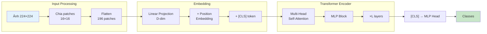
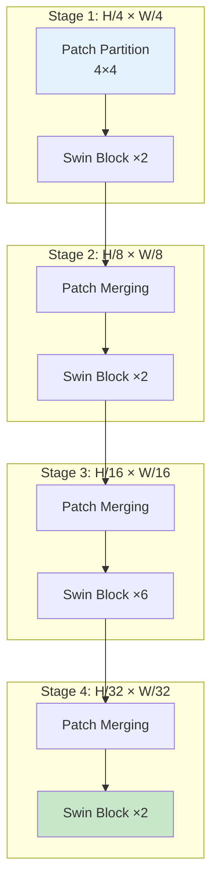

# Mục 3.2: Backbone Models cho Classification

## 3.2.1. Giới Thiệu

Tiếp nối kiến thức về TorchGeo framework từ **Mục 3.1**, phần này trình bày chi tiết các kiến trúc backbone networks - thành phần cốt lõi cho bài toán classification trong viễn thám. Bài toán classification đóng vai trò nền tảng cho nhiều ứng dụng: phân loại lớp phủ/sử dụng đất, nhận dạng loại cây trồng, đánh giá thiệt hại sau thiên tai. Hiệu quả của các hệ thống này phụ thuộc đáng kể vào khả năng trích xuất đặc trưng của backbone network.

Trong thập kỷ qua, các kiến trúc backbone đã phát triển mạnh mẽ: từ Convolutional Neural Networks (CNNs) với residual learning, đến Vision Transformers với self-attention mechanism, và hybrid architectures kết hợp cả hai. TorchGeo tích hợp các kiến trúc tiên tiến nhất cùng với pre-trained weights được huấn luyện trên dữ liệu vệ tinh, tạo điều kiện thuận lợi cho transfer learning.

Mục này phân tích bốn nhóm kiến trúc backbone chính:
1. **ResNet:** Residual learning cho deep networks
2. **Vision Transformer (ViT):** Patch-based self-attention
3. **Swin Transformer:** Hierarchical shifted window attention
4. **EfficientNet:** Compound scaling methodology

Với mỗi kiến trúc, chúng ta phân tích nguyên lý hoạt động, đổi mới kỹ thuật, benchmark performance, và khả năng áp dụng cho dữ liệu đa phổ viễn thám.

## 5.2.2. ResNet: Residual Networks

### 5.2.2.1. Nguyên Lý Residual Learning

ResNet [He et al., 2016] đánh dấu bước đột phá trong deep learning bằng việc giải quyết vấn đề vanishing gradient thông qua kỹ thuật residual learning. Thay vì học trực tiếp ánh xạ mong muốn $\mathcal{H}(x)$, mạng residual học hàm dư (residual function) $\mathcal{F}(x) = \mathcal{H}(x) - x$, với giả thiết rằng việc tối ưu hóa residual dễ dàng hơn so với tối ưu hóa ánh xạ gốc.

$$\mathbf{y} = \mathcal{F}(\mathbf{x}, \{W_i\}) + \mathbf{x}$$

Trong đó $\mathcal{F}(\mathbf{x}, \{W_i\})$ biểu diễn các phép biến đổi residual cần học, và $\mathbf{x}$ là identity mapping thông qua skip connection. Cơ chế này cho phép gradient lan truyền trực tiếp qua các kết nối tắt, giúp huấn luyện thành công các mạng sâu tới 1000+ layers.

### 5.2.2.2. Kiến Trúc

Hình 5.4 minh họa cấu trúc của residual block cơ bản và bottleneck, cùng với các cấu hình mạng khác nhau.


**Hình 5.4:** So sánh kiến trúc mạng: VGG-19 (trái), 34-layer plain network (giữa), 34-layer residual network (phải). Các đường tắt (shortcuts) được biểu thị bằng mũi tên nét liền [He et al., 2016]

ResNet được tổ chức thành các variants với độ sâu khác nhau:

| Variant | Số Block | Parameters | Top-1 ImageNet | Đặc điểm |
|---------|----------|------------|----------------|----------|
| ResNet-18 | 8 basic blocks | 11M | 69.8% | Lightweight, nhanh |
| ResNet-34 | 16 basic blocks | 21M | 73.3% | Cân bằng |
| ResNet-50 | 16 bottleneck | 25M | 76.1% | Phổ biến nhất |
| ResNet-101 | 33 bottleneck | 44M | 77.4% | High capacity |
| ResNet-152 | 50 bottleneck | 60M | 78.3% | Highest accuracy |

**Bảng 5.3:** So sánh các variants của ResNet

### 5.2.2.3. Ứng Dụng trong Viễn Thám

ResNet là baseline chuẩn cho classification trong TorchGeo với nhiều ưu điểm:

- **Transfer learning hiệu quả:** Pre-trained weights từ ImageNet hoặc SSL4EO cho kết quả tốt với ít dữ liệu labeled
- **Điều chỉnh linh hoạt cho đa phổ:** Lớp convolution đầu tiên có thể được mở rộng để nhận input với số kênh tùy ý (13 bands Sentinel-2)
- **Cân bằng accuracy-efficiency:** ResNet-50 đạt ~97% accuracy trên EuroSAT với SSL4EO pre-training

TorchGeo cung cấp các weights pre-trained như `ResNet50_Weights.SENTINEL2_ALL_MOCO` cho 13 bands Sentinel-2 với MoCo v2 self-supervised learning.

## 5.2.3. Vision Transformer (ViT)

### 5.2.3.1. Từ NLP đến Computer Vision

Vision Transformer [Dosovitskiy et al., 2021] mang kiến trúc Transformer từ NLP sang computer vision, chứng minh rằng self-attention thuần túy có thể đạt hiệu quả cao trong xử lý ảnh khi được huấn luyện trên dữ liệu lớn.

### 5.2.3.2. Kiến Trúc Patch-based

ViT chia ảnh đầu vào thành các patches kích thước cố định (thường 16×16 hoặc 14×14), biến đổi mỗi patch thành embedding vector, và xử lý chuỗi embeddings này qua các transformer encoder blocks.



**Hình 5.5:** Pipeline xử lý của Vision Transformer


**Hình 5.5b:** Ví dụ chia ảnh thành 9 patches (3×3) - mỗi patch được xử lý như một token trong Transformer [Dosovitskiy et al., 2021]

Các thành phần chính:

- **Patch Embedding:** Mỗi patch được chiếu tuyến tính thành vector D chiều
- **Position Embedding:** Thêm thông tin vị trí không gian (learnable)
- **Class Token [CLS]:** Token đặc biệt aggregates global information
- **Transformer Encoder:** Gồm L blocks với multi-head self-attention và MLP

### 5.2.3.3. Benchmark và Ứng Dụng RS

| Variant | Parameters | Pre-training | Top-1 ImageNet |
|---------|------------|--------------|----------------|
| ViT-Small | 22M | ImageNet-21k | 79.8% |
| ViT-Base | 86M | ImageNet-21k | 81.2% |
| ViT-Large | 307M | ImageNet-21k | 82.7% |
| ViT-Huge/14 | 632M | JFT-300M | 88.6% |

**Bảng 5.4:** Hiệu suất ViT với pre-training scale khác nhau

**Ưu điểm cho viễn thám:**

- **Global context:** Self-attention nắm bắt quan hệ xa trong ảnh vệ tinh kích thước lớn
- **Khả năng mở rộng:** Hiệu quả tăng theo lượng dữ liệu pre-training
- **Hybrid architectures:** Kết hợp ResNet + ViT (ResV2ViT) đạt 99.91% precision trên RSI-CB256

**Hạn chế:**

- Yêu cầu pre-training scale lớn (ImageNet-21k hoặc JFT-300M)
- Kém hiệu quả hơn CNNs khi train from scratch trên ImageNet

## 5.2.4. Swin Transformer

### 5.2.4.1. Shifted Window Attention

Swin Transformer [Liu et al., 2021] giải quyết vấn đề computational complexity $O(N^2)$ của ViT bằng cơ chế shifted window attention, đạt độ phức tạp tuyến tính $O(N)$ theo kích thước ảnh.

Ý tưởng cốt lõi là thực hiện self-attention trong các cửa sổ cục bộ (local windows) thay vì toàn ảnh, sau đó "shift" các cửa sổ giữa các layers để tạo cross-window connections.


**Hình 5.6:** So sánh hierarchical feature maps của Swin Transformer với linear patch partition của ViT [Liu et al., 2021]


**Hình 5.6b:** Cơ chế shifted window attention - cửa sổ được dịch chuyển giữa các consecutive layers để tạo cross-window connection [Liu et al., 2021]

### 5.2.4.2. Hierarchical Architecture

Swin Transformer tổ chức theo 4 stages với resolution giảm dần và channels tăng dần, tương tự CNN feature pyramid:



**Hình 5.7:** Cấu trúc 4-stage hierarchical của Swin Transformer

### 5.2.4.3. Benchmark và Ứng Dụng

| Variant | Resolution | Params | FLOPs | Top-1 | COCO Box AP |
|---------|------------|--------|-------|-------|-------------|
| Swin-T | 224² | 29M | 4.5G | 81.3% | 50.4 |
| Swin-S | 224² | 50M | 8.7G | 83.0% | 51.9 |
| Swin-B | 224² | 88M | 15.4G | 83.4% | 52.7 |
| Swin-B | 384² | 88M | 47.5G | 84.4% | 53.0 |

**Bảng 5.5:** Benchmark Swin Transformer trên ImageNet và COCO

**Ưu điểm cho viễn thám:**

- **Linear complexity:** Phù hợp với ảnh high-resolution (512×512+) từ vệ tinh
- **Multi-scale features:** Hierarchical design hỗ trợ object detection và segmentation
- **Outperforms ViT:** Tốc độ-accuracy tradeoff tốt hơn vanilla transformer

## 5.2.5. EfficientNet

### 5.2.5.1. Compound Scaling

EfficientNet [Tan & Le, 2019] đề xuất phương pháp compound scaling - mở rộng đồng thời depth, width, và resolution theo tỷ lệ cố định thay vì scale riêng lẻ.

$$\text{depth: } d = \alpha^\phi, \quad \text{width: } w = \beta^\phi, \quad \text{resolution: } r = \gamma^\phi$$

Với constraint $\alpha \cdot \beta^2 \cdot \gamma^2 \approx 2$ để đảm bảo FLOPs tăng gấp đôi khi $\phi$ tăng 1.


**Hình 5.8:** So sánh compound scaling với scaling đơn lẻ trong EfficientNet [Tan & Le, 2019]

### 5.2.5.2. Kiến Trúc và Benchmark

EfficientNet-B0 được thiết kế qua Neural Architecture Search, sau đó scale lên thành B1-B7:

| Variant | Resolution | Params | FLOPs | Top-1 |
|---------|------------|--------|-------|-------|
| B0 | 224² | 5.3M | 0.39G | 77.1% |
| B3 | 300² | 12M | 1.8G | 81.6% |
| B4 | 380² | 19M | 4.2G | 82.9% |
| B7 | 600² | 66M | 37G | 84.3% |

**Bảng 5.6:** EfficientNet variants và hiệu suất

Đáng chú ý, EfficientNet-B7 đạt **8.4× smaller** và **6.1× faster** so với best ConvNet cùng thời (2019) với accuracy tương đương.

### 5.2.5.3. Ứng Dụng Viễn Thám

- **Edge deployment:** B0-B2 phù hợp cho drone/UAV với compute hạn chế
- **Production pipelines:** B3-B4 cân bằng accuracy-efficiency cho hệ thống operational
- **Transfer learning mạnh:** Compression cao mà vẫn giữ feature quality

## 5.2.6. So Sánh Tổng Hợp

Bảng 5.7 tổng hợp đặc điểm của các backbone architectures cho ứng dụng viễn thám:

| Backbone | Global Context | Local Features | Efficiency | Multi-scale | Best Use Case |
|----------|---------------|----------------|------------|-------------|---------------|
| ResNet-50 | Moderate | Strong | Good | No | Baseline, transfer learning |
| ViT-Base | Excellent | Weak | Moderate | No | Large-scale scene, nhiều data |
| Swin-Base | Excellent | Strong | Excellent | Yes | High-res, multi-task |
| EfficientNet-B4 | Moderate | Strong | Excellent | No | Edge, real-time |

**Bảng 5.7:** So sánh backbone architectures cho viễn thám

### Khuyến Nghị Thực Tiễn

1. **Baseline & prototyping:** ResNet-50 với SSL4EO MoCo weights
2. **Highest accuracy cần nhiều data:** ViT-Base với SSL4EO MAE
3. **High-resolution & dense tasks:** Swin Transformer
4. **Edge deployment:** EfficientNet B3-B4

## 5.2.7. Pre-trained Weights trong TorchGeo

### 5.2.7.1. SSL4EO-S12

SSL4EO (Self-Supervised Learning for Earth Observation) cung cấp weights pre-trained trên 200k+ image triplets từ Sentinel-1/2 châu Âu với nhiều phương pháp:

| Method | Backbone | Input | Performance Gain |
|--------|----------|-------|------------------|
| MoCo v2 | ResNet-50 | S2 All 13 bands | +1.7% EuroSAT |
| DINO | ViT-Small | S2 All bands | +2.1% BigEarthNet |
| MAE | ViT-Base | S2 All bands | +2.5% avg tasks |

**Bảng 5.8:** SSL4EO pre-training methods và hiệu quả

### 5.2.7.2. SatMAE

SatMAE [Cong et al., 2022] mở rộng MAE với temporal encoding cho chuỗi thời gian vệ tinh:
- **Temporal awareness:** Học biểu diễn thay đổi theo mùa
- **Multi-spectral:** Tối ưu cho 10+ bands
- **+14% improvement** trên land cover classification so với ImageNet pre-training

### 5.2.7.3. Sử Dụng Weights

TorchGeo cung cấp API thống nhất để load pre-trained weights:

```python
from torchgeo.models import resnet50, ResNet50_Weights

# Load với SSL4EO MoCo weights cho Sentinel-2
weights = ResNet50_Weights.SENTINEL2_ALL_MOCO
model = resnet50(weights=weights)

# Thay classification head cho task cụ thể
model.fc = nn.Linear(2048, num_classes)
```

## 5.2.8. Benchmark Datasets

TorchGeo tích hợp các benchmark datasets phổ biến cho classification:

| Dataset | Source | Classes | Samples | Patch Size | Labels |
|---------|--------|---------|---------|------------|--------|
| EuroSAT | Sentinel-2 | 10 | 27,000 | 64×64 | Single |
| BigEarthNet | Sentinel-1/2 | 43 | 590,326 | 120×120 | Multi |
| UC Merced | Aerial | 21 | 2,100 | 256×256 | Single |
| PatternNet | Satellite | 38 | 30,400 | 256×256 | Single |
| RESISC45 | Google Earth | 45 | 31,500 | 256×256 | Single |

**Bảng 5.9:** Benchmark classification datasets trong TorchGeo

## 3.2.9. Kết Luận Mục

Các backbone architectures trong TorchGeo cung cấp nền tảng vững chắc cho classification tasks trong viễn thám. **ResNet** vẫn là lựa chọn baseline đáng tin cậy với transfer learning hiệu quả. **Vision Transformers** và **Swin Transformer** mang lại hiệu suất cao hơn khi có đủ dữ liệu pre-training, đặc biệt mạnh ở global context modeling. **EfficientNet** là giải pháp tối ưu cho các ứng dụng edge deployment yêu cầu inference efficiency.

**Điểm then chốt:** Domain-specific pre-trained weights (SSL4EO, SatMAE) vượt trội ImageNet pre-training 1.5-2% trên dữ liệu đa phổ, đặc biệt quan trọng cho Sentinel-2 13-band imagery.

Các backbone này không chỉ phục vụ classification mà còn là encoder cho segmentation và change detection. **Mục 3.3** tiếp theo sẽ trình bày cách các backbone được tích hợp vào encoder-decoder architectures cho semantic segmentation.

---

## Tài Liệu Tham Khảo

[1] He, K., Zhang, X., Ren, S., & Sun, J. (2016). "Deep Residual Learning for Image Recognition." In CVPR. arXiv:1512.03385.

[2] Dosovitskiy, A., et al. (2021). "An Image is Worth 16x16 Words: Transformers for Image Recognition at Scale." In ICLR. arXiv:2010.11929.

[3] Liu, Z., et al. (2021). "Swin Transformer: Hierarchical Vision Transformer using Shifted Windows." In ICCV. arXiv:2103.14030.

[4] Tan, M., & Le, Q. (2019). "EfficientNet: Rethinking Model Scaling for Convolutional Neural Networks." In ICML. arXiv:1905.11946.

[5] Cong, Y., et al. (2022). "SatMAE: Pre-training Transformers for Temporal and Multi-Spectral Satellite Imagery." NeurIPS. arXiv:2207.08051.

[6] Wang, Y., et al. (2022). "SSL4EO-S12: A large-scale multi-modal, multi-temporal dataset for self-supervised learning in Earth observation." arXiv:2211.07044.
