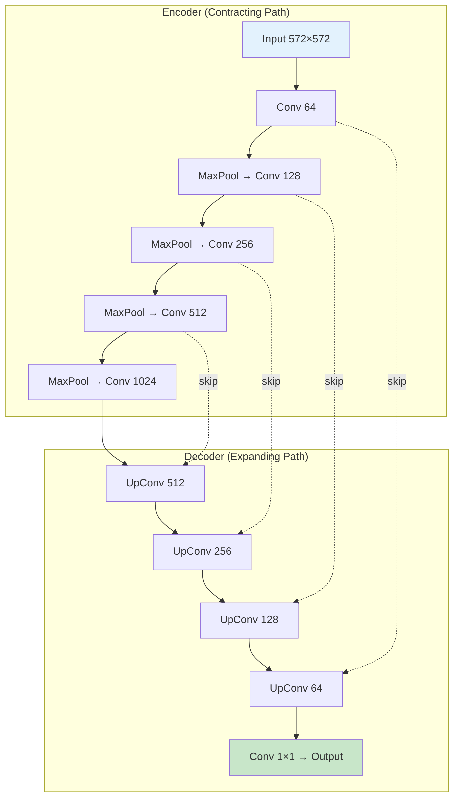
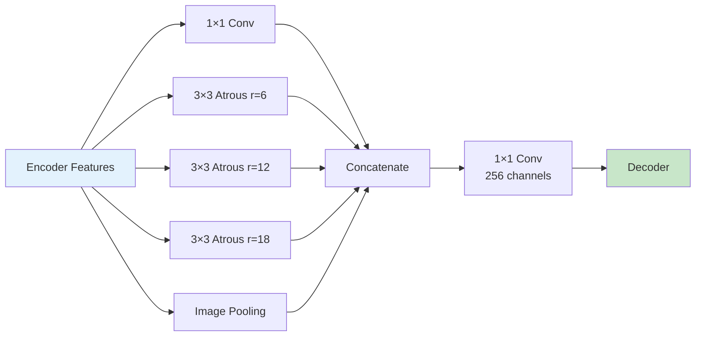
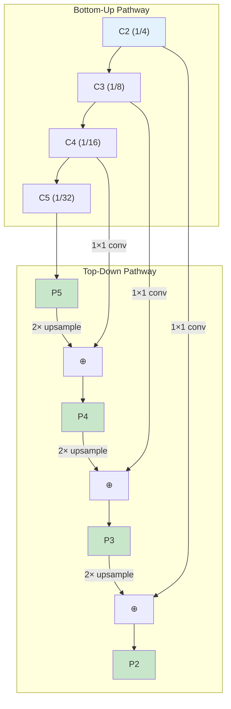
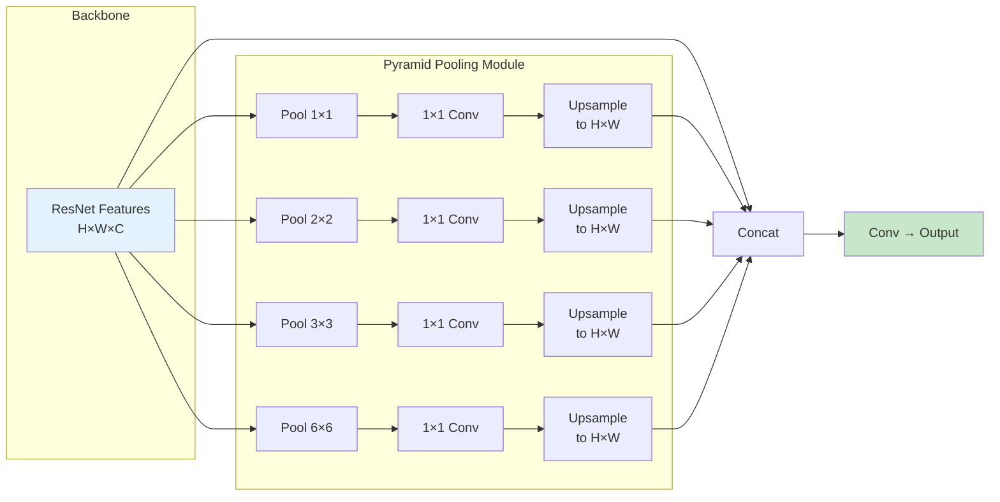
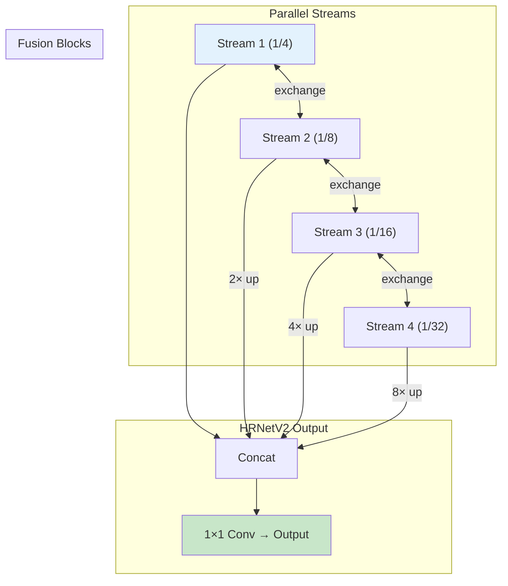

# Mục 3.3: Segmentation Models cho Phân Đoạn Ảnh Viễn Thám

## 3.3.1. Giới Thiệu

Sau khi tìm hiểu các backbone networks cho classification ở **Mục 3.2**, phần này mở rộng sang bài toán phức tạp hơn: semantic segmentation - gán nhãn cho từng pixel trong ảnh. Segmentation đóng vai trò then chốt trong nhiều ứng dụng viễn thám: lập bản đồ lớp phủ mặt đất, chiết xuất footprint công trình, phân vùng ngập lụt, khoanh vùng đất nông nghiệp. Segmentation cung cấp thông tin không gian chi tiết ở mức pixel mà classification ở mức scene không thể đạt được.

Khác với classification chỉ dự đoán một nhãn cho toàn ảnh, segmentation yêu cầu mô hình duy trì thông tin không gian xuyên suốt quá trình xử lý. Điều này đặt ra thách thức về việc cân bằng giữa context (để hiểu "cái gì") và resolution (để biết "ở đâu"). Các kiến trúc segmentation hiện đại giải quyết trade-off này theo nhiều cách tiếp cận khác nhau: encoder-decoder với skip connections (U-Net), atrous convolution với multi-scale pooling (DeepLabV3+), feature pyramid (FPN), hay duy trì high-resolution xuyên suốt (HRNet).

TorchGeo tích hợp các kiến trúc segmentation tiên tiến này thông qua `segmentation_models_pytorch`, cho phép sử dụng các encoder đã được pre-trained trên dữ liệu viễn thám. Chương này phân tích năm kiến trúc segmentation chính và cách áp dụng chúng cho các bài toán geospatial.

## 5.3.2. U-Net: Encoder-Decoder với Skip Connections

### 5.3.2.1. Kiến Trúc Đối Xứng

U-Net [Ronneberger et al., 2015] được thiết kế ban đầu cho segmentation ảnh y sinh với lượng dữ liệu huấn luyện hạn chế. Ý tưởng cốt lõi là kết hợp encoder (contracting path) giảm resolution để nắm bắt context, với decoder (expanding path) tăng resolution để khôi phục chi tiết không gian.

**Hình 5.9:** Kiến trúc U-Net với encoder-decoder đối xứng và skip connections

**Hình 5.9b:** Ví dụ segmentation với U-Net - input image (trái), ground truth (giữa), prediction (phải) [Ronneberger et al., 2015]

Điểm đặc trưng của U-Net là các **skip connections** nối trực tiếp từ encoder sang decoder ở cùng mức resolution. Các feature maps từ encoder (có thông tin chi tiết về vị trí) được concatenate với feature maps từ decoder (có thông tin về context), cho phép decoder khôi phục boundary chính xác.

### 5.3.2.2. Ưu Điểm cho Viễn Thám

U-Net đặc biệt phù hợp với các điều kiện thường gặp trong viễn thám:

- **Dữ liệu labeled hạn chế:** Thiết kế tận dụng tối đa thông tin từ mỗi sample thông qua data augmentation mạnh (elastic deformations, flips, rotations)
- **Boundary chính xác:** Skip connections bảo toàn chi tiết spatial, quan trọng cho extraction building footprints, roads, parcels
- **Ảnh kích thước lớn:** Kiến trúc fully convolutional hỗ trợ seamless tiling - xử lý ảnh lớn bằng cách chia thành patches và merge kết quả

### 5.3.2.3. Benchmark

| Task | Dataset | Metric | Score |
|------|---------|--------|-------|
| Cell Segmentation | ISBI EM Stack | Warping Error | 0.000353 (1st) |
| Cell Tracking | PhC-U373 | IoU | 92% |
| Cell Tracking | DIC-HeLa | IoU | 77.5% |

**Bảng 5.10:** Benchmark U-Net trên các bài toán biomedical

## 5.3.3. DeepLabV3+: Atrous Convolution và ASPP

### 5.3.3.1. Nguyên Lý Atrous Convolution

DeepLabV3+ [Chen et al., 2018] giải quyết vấn đề trade-off resolution-context thông qua **atrous (dilated) convolution** - kỹ thuật chèn "lỗ hổng" vào kernel để mở rộng receptive field mà không tăng số parameters hay giảm resolution.

Với dilation rate $r$, một kernel 3×3 có effective receptive field là $(2r+1) \times (2r+1)$ trong khi vẫn chỉ sử dụng 9 parameters. Điều này cho phép nắm bắt context ở nhiều scale khác nhau.

### 5.3.3.2. Atrous Spatial Pyramid Pooling (ASPP)

ASPP module áp dụng atrous convolution với nhiều dilation rates khác nhau (thường 6, 12, 18) song song, sau đó concatenate kết quả để tạo multi-scale features:

**Hình 5.11:** Cấu trúc ASPP module trong DeepLabV3+

### 5.3.3.3. Decoder và Benchmark

Decoder trong DeepLabV3+ đơn giản nhưng hiệu quả: upsample encoder features 4×, fuse với low-level features từ backbone, refine qua 3×3 convolutions, và final upsample về resolution gốc.

| Dataset | mIoU | Ghi chú |
|---------|------|---------|
| PASCAL VOC 2012 | 89.0% | Test set, no CRF |
| Cityscapes | 82.1% | Test set |

**Bảng 5.11:** Benchmark DeepLabV3+ trên natural image datasets

**Ưu điểm cho viễn thám:**
- Multi-scale pooling phù hợp với objects có kích thước đa dạng (từ xe cộ đến cánh đồng)
- Decoder cải thiện boundary precision
- Depthwise separable convolutions tăng efficiency

## 5.3.4. Feature Pyramid Network (FPN)

### 5.3.4.1. Top-Down Feature Fusion

Feature Pyramid Network [Lin et al., 2017] giải quyết vấn đề multi-scale object detection bằng cách xây dựng feature pyramid có semantic strength đồng đều ở mọi scale.

Trong CNN backbone thông thường, features ở các layers sâu có semantic mạnh nhưng resolution thấp, trong khi layers nông có resolution cao nhưng semantic yếu. FPN kết hợp ưu điểm của cả hai thông qua top-down pathway với lateral connections.

**Hình 5.12:** Cấu trúc bottom-up và top-down pathways của FPN

### 5.3.4.2. Ưu Điểm cho Viễn Thám

FPN đặc biệt hiệu quả trong viễn thám nhờ:

- **Multi-scale detection:** P2-P5 levels xử lý objects từ rất nhỏ (xe, cây) đến rất lớn (cánh đồng, hồ)
- **Small object performance:** +12.9 AR points cho small objects trên COCO
- **Computational efficiency:** Single-scale input, tránh expensive image pyramids
- **Backbone agnostic:** Áp dụng được với bất kỳ CNN backbone nào

| Metric | Baseline | FPN | Improvement |
|--------|----------|-----|-------------|
| AR@1k | 48.3 | 56.3 | +8.0 |
| ARs (small) | 32.5 | 45.4 | +12.9 |
| Inference | 0.32s | 0.148s | 2.2× faster |

**Bảng 5.12:** FPN improvements trên COCO detection

## 5.3.5. PSPNet: Pyramid Pooling Module

### 5.3.5.1. Global Context Aggregation

PSPNet [Zhao et al., 2017] nhận diện rằng nhiều lỗi segmentation xuất phát từ thiếu global context - mô hình không "nhìn" đủ rộng để hiểu scene layout. Pyramid Pooling Module (PPM) giải quyết vấn đề này bằng cách pool features ở nhiều scale (1×1, 2×2, 3×3, 6×6) rồi concatenate với original features.

**Hình 5.13:** Pyramid Pooling Module của PSPNet

### 5.3.5.2. Benchmark và Ứng Dụng RS

| Dataset | mIoU | Rank |
|---------|------|------|
| ADE20K (ImageNet 2016) | 44.94% | 1st place |
| PASCAL VOC 2012 | 85.4% | Top tier |
| Cityscapes | 80.2% | Competitive |

**Bảng 5.13:** Benchmark PSPNet trên semantic segmentation

**Ưu điểm cho viễn thám:**
- Global context giúp disambiguate similar land covers (phân biệt các loại cây trồng)
- Xử lý complex scenes với nhiều class interactions
- Robust với variation về ánh sáng và điều kiện khí quyển

## 5.3.6. HRNet: High-Resolution Networks

### 5.3.6.1. Parallel High-Resolution Streams

HRNet [Wang et al., 2019] đề xuất cách tiếp cận hoàn toàn khác: thay vì downsampling rồi upsampling, duy trì high-resolution representation xuyên suốt network. Các streams với resolution khác nhau chạy song song và liên tục exchange thông tin.

**Hình 5.14:** Kiến trúc HRNet với các parallel high-resolution streams và multi-resolution fusion [Wang et al., 2019]

### 5.3.6.2. Multi-Resolution Fusion

HRNetV2 (cho segmentation) aggregates tất cả parallel streams bằng cách upsample các low-resolution streams về highest resolution, concatenate, và apply final convolution:

**Hình 5.15:** Multi-resolution fusion trong HRNetV2

### 5.3.6.3. Benchmark và Ưu Điểm RS

| Dataset | Model | mIoU | Comparison |
|---------|-------|------|------------|
| Cityscapes | HRNetV2-W48 | 81.6% | > DeepLabV3+ |
| PASCAL Context | HRNetV2-W48 | 54.0% | SOTA |
| COCO (Faster R-CNN) | HRNetV2p-W48 | 41.8 AP | > ResNet-101-FPN |

**Bảng 5.14:** Benchmark HRNet trên segmentation và detection

**Ưu điểm cho viễn thám:**

- **Pixel-level precision:** High-resolution xuyên suốt → ideal cho footprint/road/parcel mapping
- **Dramatic small-object improvement:** Vehicles, buildings appear tiny trong satellite imagery
- **Lower computational cost:** Đạt SOTA với fewer GFLOPs so với alternatives
- **Multi-task capable:** HRNetV2p variant hỗ trợ cả detection

## 5.3.7. So Sánh Tổng Hợp

Bảng 5.15 so sánh các kiến trúc segmentation theo các tiêu chí quan trọng cho viễn thám:

| Model | Core Innovation | Best For | Small Objects | Efficiency | RS Sweet Spot |
|-------|-----------------|----------|---------------|------------|---------------|
| U-Net | Skip connections | Boundaries, ít data | Fair | Moderate | Limited data, precise boundaries |
| DeepLabV3+ | ASPP + decoder | Balance context/detail | Good | High | General-purpose RS |
| FPN | Top-down fusion | Multi-scale | Excellent | High | Scale-diverse detection |
| PSPNet | Pyramid pooling | Global context | Fair | Moderate | Complex contextual scenes |
| HRNet | Parallel HR streams | Dense high-res | Excellent | High | High-resolution dense tasks |

**Bảng 5.15:** So sánh segmentation architectures cho viễn thám

### Khuyến Nghị Thực Tiễn

1. **Limited data + boundary critical:** U-Net với strong augmentation
2. **General-purpose:** DeepLabV3+ với SSL4EO encoder
3. **Multi-scale objects:** FPN-based architectures
4. **Complex scenes:** PSPNet cho global context
5. **High-resolution dense prediction:** HRNet (SOTA)

## 5.3.8. Segmentation Datasets trong TorchGeo

TorchGeo tích hợp nhiều benchmark segmentation datasets:

| Dataset | Source | Classes | Resolution | Coverage |
|---------|--------|---------|------------|----------|
| ChesapeakeCVPR | NAIP + Landsat | 7 | 1m | Chesapeake Bay, USA |
| LandCover.ai | Aerial | 5 | 25-50cm | Poland |
| GeoNRW | Aerial | 10 | 1m | North Rhine-Westphalia |
| Potsdam | Aerial | 6 | 5cm | Germany |
| Vaihingen | Aerial | 6 | 9cm | Germany |

**Bảng 5.16:** Benchmark segmentation datasets trong TorchGeo

## 5.3.9. Best Practices cho Training

### 5.3.9.1. Xử Lý Class Imbalance

Dữ liệu viễn thám thường có class imbalance nghiêm trọng (ví dụ: buildings chỉ chiếm <5% diện tích). Các giải pháp:

- **Class weighting:** Inverse frequency hoặc median frequency balancing
- **Focal Loss:** Giảm weight cho easy examples, focus vào hard cases
- **Dice/IoU Loss:** Optimize directly cho overlap metric
- **Combination:** CE + Dice thường hiệu quả nhất

### 5.3.9.2. Augmentation

**Geometric augmentations** (apply cùng lúc cho image và mask):
- Random horizontal/vertical flip
- Random rotation (90°, 180°, 270°, hoặc arbitrary)
- Random scale và crop

**Photometric augmentations** (chỉ apply cho image):
- Brightness/contrast adjustment
- Gaussian noise
- Blur

**Quan trọng:** Dùng nearest neighbor interpolation cho mask để bảo toàn class labels.

### 5.3.9.3. Inference Strategies

**Sliding Window:** Chia ảnh lớn thành overlapping patches, average predictions trong overlap regions

**Test Time Augmentation (TTA):** Apply flips và rotations tại inference, average predictions → +1-2% mIoU typical

**Post-processing:** Morphological operations (remove small isolated regions, fill holes), CRF refinement, vectorization cho GIS export

## 3.3.10. Kết Luận Mục

Các kiến trúc segmentation trong TorchGeo cung cấp toolkit đa dạng cho pixel-level prediction trong viễn thám. **U-Net** vẫn là lựa chọn robust cho scenarios với ít data và yêu cầu boundary chính xác nhờ skip connections. **DeepLabV3+** cung cấp balance tốt giữa context và detail cho general-purpose applications với ASPP module. **HRNet** đại diện cho SOTA khi cần highest precision với high-resolution data nhờ parallel multi-resolution streams.

**Điểm chung quan trọng:** Việc sử dụng pre-trained encoders (đặc biệt từ SSL4EO) cải thiện đáng kể performance so với training from scratch, tương tự như kết luận từ **Mục 3.2** về classification models.

Các kiến trúc này xử lý ảnh đơn lẻ tại một thời điểm. **Mục 3.4** tiếp theo sẽ chuyển sang Change Detection - ứng dụng đặc thù của viễn thám yêu cầu so sánh ảnh từ nhiều thời điểm để phát hiện biến đổi.

---

## Tài Liệu Tham Khảo

[1] Ronneberger, O., Fischer, P., & Brox, T. (2015). "U-Net: Convolutional Networks for Biomedical Image Segmentation." MICCAI. arXiv:1505.04597.

[2] Chen, L. C., Zhu, Y., Papandreou, G., Schroff, F., & Adam, H. (2018). "Encoder-Decoder with Atrous Separable Convolution for Semantic Image Segmentation." ECCV. arXiv:1802.02611.

[3] Lin, T. Y., Dollár, P., Girshick, R., He, K., Hariharan, B., & Belongie, S. (2017). "Feature Pyramid Networks for Object Detection." CVPR. arXiv:1612.03144.

[4] Zhao, H., Shi, J., Qi, X., Wang, X., & Jia, J. (2017). "Pyramid Scene Parsing Network." CVPR. arXiv:1612.01105.

[5] Wang, J., Sun, K., Cheng, T., et al. (2019). "Deep High-Resolution Representation Learning for Visual Recognition." CVPR. arXiv:1904.04514.
