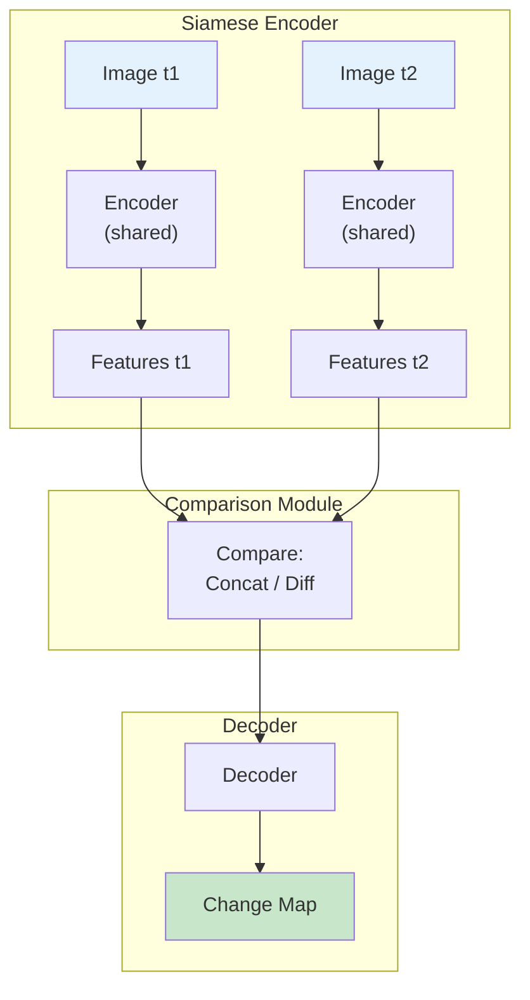
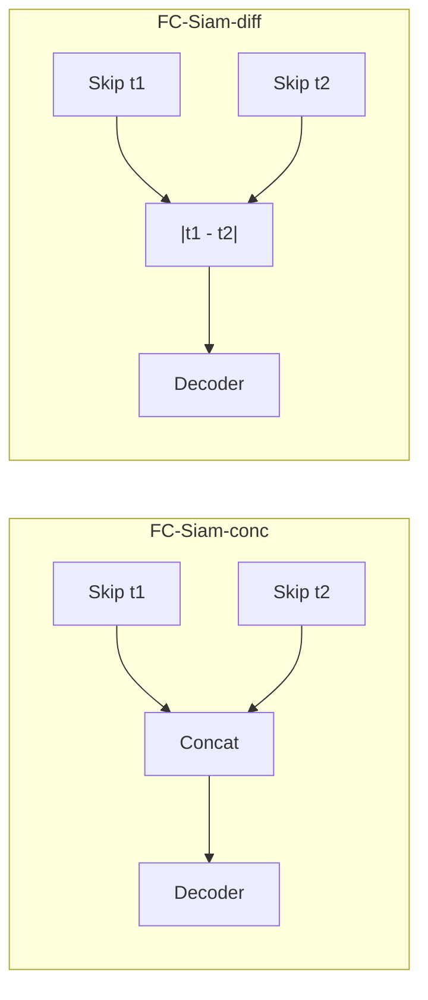
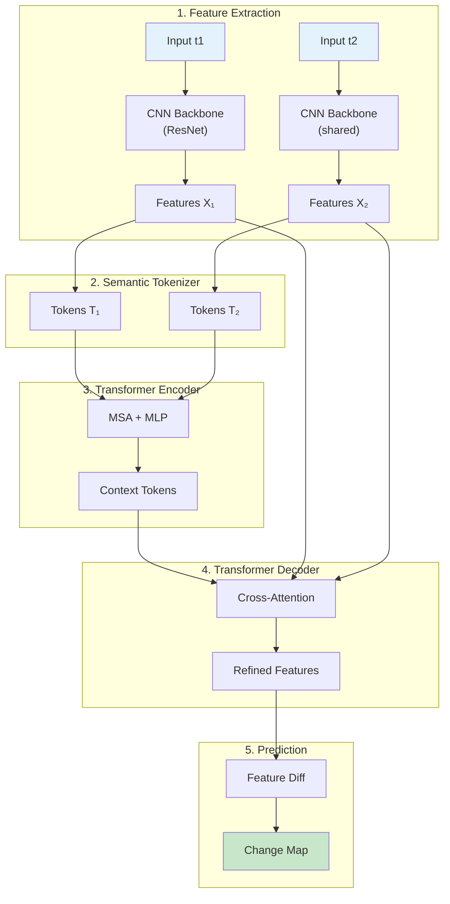
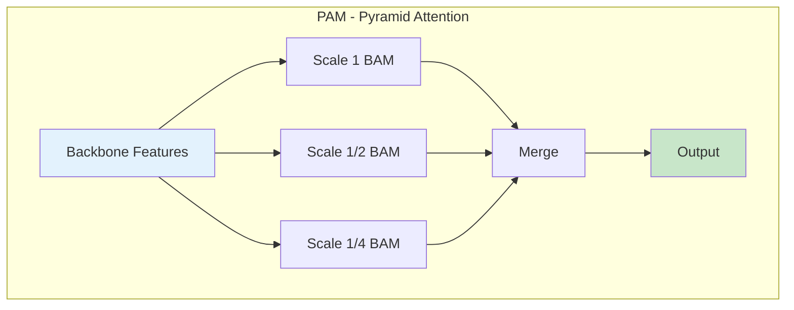

# Mục 3.4: Change Detection Models cho Phát Hiện Thay Đổi

## 3.4.1. Giới Thiệu

Sau khi nghiên cứu classification (**Mục 3.2**) và segmentation (**Mục 3.3**) cho ảnh đơn lẻ, phần này chuyển sang một ứng dụng đặc trưng của viễn thám: Change Detection - xác định và phân tích những thay đổi trên bề mặt Trái Đất qua thời gian. Khác với classification và segmentation chỉ phân tích ảnh đơn lẻ, change detection đòi hỏi so sánh ảnh từ nhiều thời điểm (bi-temporal hoặc multi-temporal) để xác định vùng nào đã thay đổi và trong một số trường hợp, thay đổi như thế nào.

Các ứng dụng của change detection trải rộng từ giám sát mở rộng đô thị, theo dõi phá rừng, đánh giá thiệt hại sau thiên tai, đến giám sát biến động nông nghiệp và xói mòn bờ biển. Điểm chung của các ứng dụng này là nhu cầu phát hiện nhanh và chính xác những biến đổi có ý nghĩa trong môi trường, trong khi loại bỏ những thay đổi giả do sự khác biệt về điều kiện chụp ảnh (góc mặt trời, khí quyển, mùa).

TorchGeo hỗ trợ change detection thông qua các benchmark datasets như OSCD, LEVIR-CD và xView2, cùng khả năng tích hợp với các kiến trúc deep learning chuyên biệt. Chương này trình bày ba kiến trúc change detection tiêu biểu: FC-Siam, BIT-Transformer và STANet.

## 5.4.2. Phân Loại Bài Toán Change Detection

Trước khi đi vào chi tiết các kiến trúc, cần phân biệt các formulations khác nhau của bài toán change detection:

| Formulation | Output | Độ phức tạp | Ứng dụng |
|-------------|--------|-------------|----------|
| Binary CD | Change/No-change mask | Thấp | General monitoring |
| Semantic CD | Multi-class change type | Trung bình | Urban planning |
| From-to CD | Transition matrix | Cao | Land use analysis |
| Multi-temporal CD | Change trajectory | Cao | Continuous monitoring |

**Bảng 5.17:** Các formulations của bài toán change detection

**Binary Change Detection** là formulation phổ biến nhất, xác định đơn giản pixel nào đã thay đổi. **Semantic Change Detection** phân loại thêm loại thay đổi (xây dựng mới, phá hủy, mất rừng...). **From-to Change Detection** xác định transition cụ thể (rừng → đô thị). **Multi-temporal CD** mở rộng sang chuỗi thời gian nhiều thời điểm.

## 5.4.3. FC-Siam: Fully Convolutional Siamese Networks

### 5.4.3.1. Kiến Trúc Siamese cho So Sánh Thời Gian

FC-Siam [Daudt et al., 2018] đề xuất kiến trúc fully convolutional end-to-end cho change detection, không yêu cầu pre-training. Ý tưởng cốt lõi là sử dụng **Siamese encoder** - hai nhánh encoder chia sẻ trọng số (shared weights) xử lý song song ảnh từ hai thời điểm, sau đó so sánh features để tạo change map.

**Hình 5.16:** Kiến trúc chung của Siamese change detection

Ba variants được đề xuất với chiến lược comparison khác nhau:

- **FC-EF (Early Fusion):** Concatenate hai ảnh đầu vào thành 6-channel input, xử lý bởi single encoder-decoder
- **FC-Siam-conc (Concatenation):** Siamese encoder + concatenate skip connections tại decoder
- **FC-Siam-diff (Difference):** Siamese encoder + absolute difference của skip connections

### 5.4.3.2. Skip Connection Strategies

Điểm khác biệt chính giữa FC-Siam-conc và FC-Siam-diff nằm ở cách xử lý skip connections từ encoder:

**Hình 5.17:** So sánh skip connection strategies trong FC-Siam variants

FC-Siam-diff thể hiện performance tốt hơn trên hầu hết benchmarks do **explicit difference** giúp model focus trực tiếp vào vùng có thay đổi.

### 5.4.3.3. Benchmark Performance

| Dataset | Best Variant | F1 Score | Speed |
|---------|--------------|----------|-------|
| OSCD (13 bands) | FC-Siam-diff | 48.86% | <0.1s/image |
| OSCD (RGB) | FC-Siam-diff | 57.92% | <0.1s/image |
| Air Change Szada | FC-Siam-diff | 52.66% | - |
| Air Change Tiszadob | FC-EF | 93.40% | - |

**Bảng 5.18:** Benchmark performance của FC-Siam variants

Điểm mạnh của FC-Siam là **tốc độ inference nhanh** (500× so với patch-based methods) và **đơn giản**, nhưng accuracy còn hạn chế so với các phương pháp attention-based hiện đại.

## 5.4.4. BIT-Transformer: Binary Change Detection Transformer

### 5.4.4.1. Token-based Context Modeling

BIT-Transformer [Chen et al., 2021] mang kiến trúc Transformer vào change detection, đạt SOTA performance với **3× ít FLOPs/parameters** so với convolutional baselines. Đổi mới chính là chuyển từ dense pixel-level processing sang compact **token-based representation**.

### 5.4.4.2. Quy Trình Xử Lý

BIT-Transformer hoạt động theo 5 bước:

**Hình 5.19:** Pipeline xử lý của BIT-Transformer

**Semantic Tokenizer** pool dense features thành compact tokens thông qua learned spatial attention maps. **Transformer Encoder** model long-range context trong token-space. **Transformer Decoder** project tokens trở lại pixel-space qua cross-attention.

### 5.4.4.3. Benchmark và Efficiency

| Dataset | BIT F1 | Previous SOTA | Improvement |
|---------|--------|---------------|-------------|
| LEVIR-CD | 89.31% | 87.26% (STANet) | +2.05pp |
| WHU-CD | 83.98% | 82.32% (STANet) | +1.66pp |
| DSIFN-CD | 69.26% | 64.56% (STANet) | +4.70pp |

**Bảng 5.19:** BIT-Transformer vs previous SOTA trên change detection benchmarks

Đặc biệt, BIT đạt hiệu suất cao hơn với **3× ít FLOPs** so với fully convolutional baselines, chứng minh effectiveness của token-based approach.

## 5.4.5. STANet: Spatial-Temporal Attention Network

### 5.4.5.1. CD Self-Attention Mechanism

STANet [Chen & Shi, 2020] đề xuất **CD self-attention** - cơ chế attention explicitly modeling spatial-temporal relationships giữa hai ảnh. Điểm mạnh là **robustness** với illumination variations và misregistration errors thường gặp trong dữ liệu viễn thám.

### 5.4.5.2. Attention Module Variants

STANet đề xuất hai variants của attention module:

**Basic Attention Module (BAM):**
- Global spatial-temporal self-attention
- Tính weighted sum across tất cả spatio-temporal positions
- Captures long-range dependencies

**Pyramid Attention Module (PAM):**
- Multi-scale BAM trong pyramid structure
- Xử lý objects ở nhiều scales khác nhau
- Performance cao hơn BAM (+1.6%)

**Hình 5.21:** Pyramid Attention Module với multi-scale processing

### 5.4.5.3. Đóng Góp Dataset: LEVIR-CD

Một đóng góp quan trọng của STANet là việc công bố **LEVIR-CD dataset** - benchmark lớn nhất cho building change detection:

| Attribute | Value |
|-----------|-------|
| Số pairs | 637 |
| Resolution | 0.5m |
| Size | 1024×1024 pixels |
| Time span | 5-14 năm |
| Focus | Building changes |

**Bảng 5.20:** LEVIR-CD dataset characteristics

### 5.4.5.4. Benchmark Performance

| Method | F1 Score | Improvement |
|--------|----------|-------------|
| STANet-Base | ~86% | Baseline |
| STANet-BAM | ~87.8% | +1.8pp |
| STANet-PAM | ~89.4% | +3.4pp overall |

**Bảng 5.21:** Comparison of STANet variants trên LEVIR-CD

## 5.4.6. So Sánh Tổng Hợp

Bảng 5.22 so sánh ba kiến trúc change detection chính:

| Aspect | FC-Siam | BIT-Transformer | STANet |
|--------|---------|-----------------|--------|
| **Core Design** | Siamese CNN | Transformer tokens | Siamese + Attention |
| **Feature Fusion** | Skip diff/concat | Token-space context | Spatial-temporal attn |
| **Scale Handling** | Single resolution | Implicit (tokens) | Multi-scale (PAM) |
| **Efficiency** | Fastest (baseline) | 3× fewer FLOPs | Moderate |
| **Best F1 (LEVIR)** | ~75% | 89.31% | 89.4% |
| **Robustness** | Basic | High | High (illumination) |

**Bảng 5.22:** So sánh kiến trúc change detection

### Khuyến Nghị Thực Tiễn

1. **Speed priority:** FC-Siam-diff cho rapid screening
2. **Accuracy + Efficiency:** BIT-Transformer (3× efficiency với SOTA accuracy)
3. **Illumination variations:** STANet-PAM với robustness cao
4. **Limited compute:** FC-EF đơn giản nhất

## 5.4.7. Change Detection Datasets trong TorchGeo

TorchGeo tích hợp các benchmark datasets phổ biến:

| Dataset | Source | Pairs | Resolution | Focus |
|---------|--------|-------|------------|-------|
| OSCD | Sentinel-2 | 24 | 10m | Urban change |
| LEVIR-CD | Google Earth | 637 | 0.5m | Building change |
| WHU-CD | Aerial | 1 (large) | 0.075m | Building change |
| xView2 | WorldView | 8,399 | <1m | Damage assessment |

**Bảng 5.23:** Change detection datasets trong TorchGeo

**OSCD (Onera Satellite Change Detection):** 24 pairs ảnh Sentinel-2 13 bands, urban areas worldwide, binary change labels.

**LEVIR-CD:** 637 pairs high-resolution (0.5m), focus building construction/demolition, 10-year time span.

**xView2:** Damage assessment sau disasters, 4 damage levels (intact → destroyed), multiple disaster events.

## 5.4.8. Training Best Practices

### 5.4.8.1. Paired Augmentation

Điểm đặc biệt của change detection là cần **paired augmentation** - apply cùng geometric transform cho cả hai ảnh để duy trì spatial alignment:

**Geometric (same for both):**
- Random flip (H/V)
- Random rotation (90°, 180°, 270°)
- Random crop

**Photometric (can differ):**
- Brightness/contrast adjustment
- Color jittering
- Mimics different acquisition conditions

### 5.4.8.2. Class Imbalance

Change detection có **extreme class imbalance** - thường <5% pixels thay đổi. Các giải pháp:

- **Focal Loss:** Focus vào hard examples
- **Dice/IoU Loss:** Optimize overlap metric
- **Patch selection:** Bias sampling toward patches có change
- **Combined loss:** $\mathcal{L} = \alpha \cdot BCE + \beta \cdot Dice$

### 5.4.8.3. Evaluation Metrics

| Metric | Formula | Ưu điểm |
|--------|---------|---------|
| F1 Score | $\frac{2 \cdot P \cdot R}{P + R}$ | Balance precision/recall |
| IoU | $\frac{TP}{TP + FP + FN}$ | Overlap-based |
| Kappa | Cohen's Kappa | Accounts for chance |

**Bảng 5.24:** Metrics cho change detection evaluation

## 3.4.9. Kết Luận Mục

Change detection là bài toán đặc trưng của viễn thám với nhiều thách thức riêng: class imbalance nghiêm trọng (<5% pixels thay đổi), biến đổi điều kiện chụp ảnh, và yêu cầu so sánh thời gian hiệu quả. Các kiến trúc hiện đại như **BIT-Transformer** và **STANet** đã đạt hiệu suất ấn tượng (>89% F1 trên LEVIR-CD) thông qua attention mechanisms cho phép model học so sánh features một cách hiệu quả.

**FC-Siam** vẫn là baseline đáng tin cậy cho ứng dụng cần tốc độ (500× nhanh hơn patch-based methods). **BIT-Transformer** cung cấp balance tốt với 3× fewer FLOPs nhưng SOTA accuracy nhờ token-based representation. **STANet** mạnh về robustness với illumination variations và misregistration errors.

Các kiến trúc change detection này tận dụng backbone encoders (ResNet, ViT) đã học từ **Mục 3.2**, và áp dụng skip connection strategies từ segmentation architectures (**Mục 3.3**). **Mục 3.5** tiếp theo sẽ tổng hợp về pre-trained weights và self-supervised learning - yếu tố then chốt giúp cải thiện performance của tất cả các kiến trúc đã trình bày.

---

## Tài Liệu Tham Khảo

[1] Daudt, R. C., Le Saux, B., & Boulch, A. (2018). "Fully Convolutional Siamese Networks for Change Detection." ICIP. arXiv:1810.08462.

[2] Chen, H., Qi, Z., & Shi, Z. (2021). "Remote Sensing Image Change Detection with Transformers." IEEE TGRS. arXiv:2103.00208.

[3] Chen, H., & Shi, Z. (2020). "A Spatial-Temporal Attention-Based Method and a New Dataset for Remote Sensing Image Change Detection." Remote Sensing. arXiv:2007.03078.

[4] Chen, H., Qi, Z., & Shi, Z. (2020). "LEVIR-CD: A Large-Scale Remote Sensing Image Change Detection Dataset." arXiv:2012.03588.
