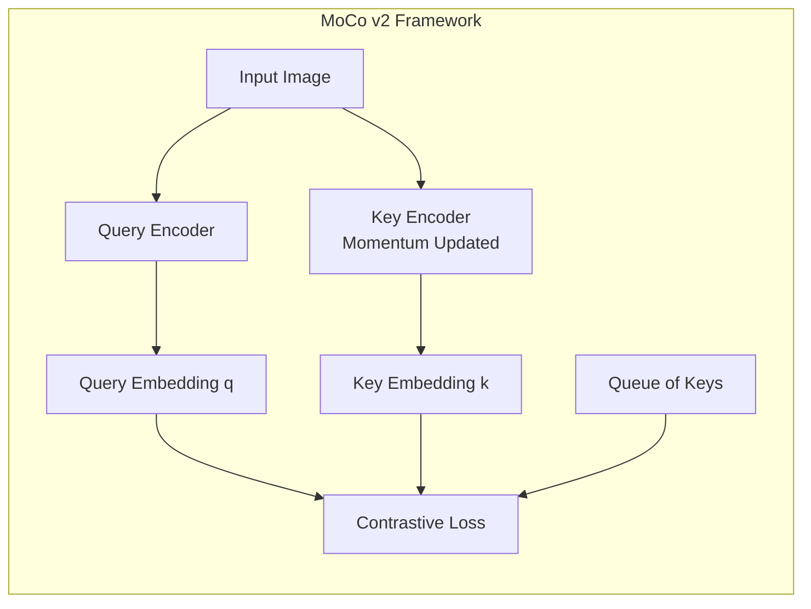
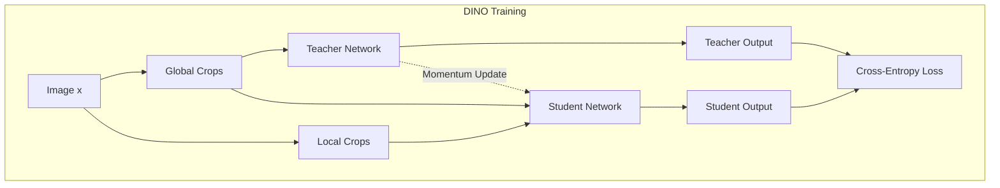
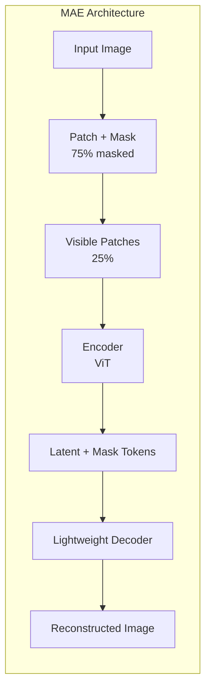
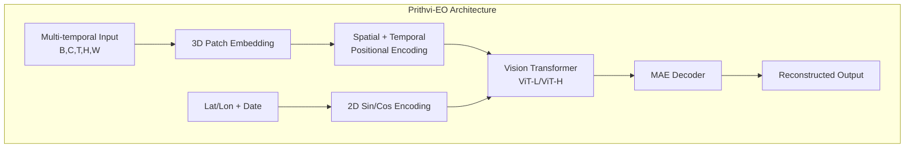
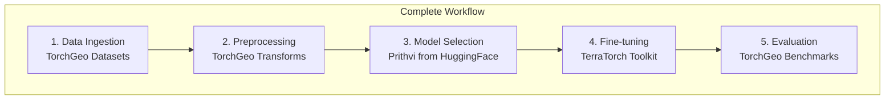

# Mục 3.5: Pre-trained Weights và Transfer Learning trong TorchGeo

## 3.5.1. Giới Thiệu

Sau khi tìm hiểu các kiến trúc mô hình từ **Mục 3.2-3.4** (classification, segmentation, change detection), phần này trình bày yếu tố then chốt giúp các kiến trúc đó đạt hiệu quả cao: pre-trained weights và transfer learning. Trong deep learning cho viễn thám, việc huấn luyện mô hình từ đầu (training from scratch) đối mặt với hai thách thức lớn: (1) thiếu hụt dữ liệu có nhãn quy mô lớn, và (2) chi phí tính toán cao cho các kiến trúc phức tạp. Pre-trained weights - trọng số đã được huấn luyện trước trên các tập dữ liệu quy mô lớn - cung cấp giải pháp hiệu quả cho cả hai vấn đề này.

TorchGeo đóng vai trò tiên phong trong việc cung cấp pre-trained weights được thiết kế đặc biệt cho dữ liệu vệ tinh. Không giống như ImageNet weights—vốn được tối ưu cho ảnh tự nhiên RGB—các weights của TorchGeo được huấn luyện trên dữ liệu đa phổ (multispectral) từ các vệ tinh như Sentinel-1, Sentinel-2, giúp mô hình học được các đặc trưng phù hợp với đặc thù của remote sensing imagery.

Mục này trình bày chi tiết về các pre-trained weights có sẵn trong TorchGeo, phương pháp self-supervised learning được sử dụng để tạo ra chúng, và các foundation models thế hệ mới như Prithvi-EO đang định hình tương lai của lĩnh vực.

---

## 5.5.2. Tại Sao Cần Domain-Specific Pre-training?

### 5.5.2.1. Hạn Chế của ImageNet Pre-training

ImageNet—tập dữ liệu chuẩn cho pre-training trong computer vision—chứa hơn 14 triệu ảnh thuộc 1000 class như chó, mèo, xe cộ. Mặc dù các weights từ ImageNet đã chứng minh khả năng transfer tốt sang nhiều domain, chúng có những hạn chế rõ rệt khi áp dụng cho ảnh vệ tinh:

**Sự khác biệt về modality:**
- ImageNet chỉ có 3 kênh RGB
- Sentinel-2 có 13 băng phổ bao gồm near-infrared, shortwave-infrared
- Sentinel-1 SAR có dữ liệu radar hoàn toàn khác về bản chất

**Sự khác biệt về perspective:**
- ImageNet: ảnh chụp từ mặt đất, góc nhìn ngang
- Satellite imagery: góc nhìn từ trên xuống (nadir view)
- Các đặc trưng hình học hoàn toàn khác biệt

**Sự khác biệt về phân bố pixel:**
- ImageNet: giá trị pixel 0-255, RGB normalized
- Satellite data: giá trị reflectance hoặc backscatter coefficient
- Dynamic range và distribution khác nhau đáng kể

### 5.5.2.2. Lợi Ích của Domain-Specific Weights

Nghiên cứu trên benchmark EuroSAT cho thấy hiệu quả rõ rệt của domain-specific pre-training:

| Phương pháp Pre-training | Accuracy trên EuroSAT |
|--------------------------|----------------------|
| Random Initialization    | 89.2%                |
| ImageNet Pre-trained     | 95.5%                |
| SSL4EO MoCo             | 97.2%                |
| SSL4EO MAE (ViT)        | 97.8%                |

Kết quả cho thấy domain-specific weights cải thiện 1.5-2% so với ImageNet, một mức độ đáng kể trong các bài toán benchmark đã gần đạt trần hiệu năng.

---

## 5.5.3. Self-Supervised Learning cho Remote Sensing

Self-supervised learning (SSL) đã cách mạng hóa việc pre-training bằng cách tận dụng lượng dữ liệu không nhãn khổng lồ. Trong remote sensing, SSL đặc biệt quan trọng vì dữ liệu vệ tinh có sẵn ở quy mô petabyte nhưng việc tạo nhãn lại tốn kém và đòi hỏi chuyên môn.

*Hình 5.5.1: Minh họa khái niệm Masked Autoencoder (MAE) - mask ngẫu nhiên 75% patches và reconstruct lại.*

### 5.5.3.1. Momentum Contrast (MoCo v2)

MoCo v2 là framework contrastive learning sử dụng momentum encoder để tạo large negative sample queue, cho phép học với batch size nhỏ mà vẫn đạt hiệu quả cao.

**Nguyên lý hoạt động:**

**Đặc điểm nổi bật:**
- Dynamic queue với momentum encoder giúp decouple batch size khỏi số negative samples
- MLP projection head + data augmentation mạnh
- Hiệu quả trên setup 8-GPU tiêu chuẩn
- Đạt 71.1% linear eval accuracy trên ImageNet

*Hình 5.5.1b: MoCo v2 improvements so với v1 - thêm MLP head và stronger augmentations [Chen et al., 2020]*

**Ứng dụng trong TorchGeo:**
MoCo v2 là nền tảng cho SSL4EO weights trên cả Sentinel-1 và Sentinel-2, cung cấp các weights ResNet cho các task classification và segmentation.

### 5.5.3.2. Self-Distillation with No Labels (DINO)

DINO sử dụng framework student-teacher với self-distillation, tạo ra các đặc trưng có semantic meaning mà không cần nhãn thủ công.

**Kiến trúc DINO:**

**Điểm mạnh:**
- Multi-crop strategy: 2 global views + nhiều local views
- Student xử lý tất cả crops; teacher chỉ xử lý global views
- Centering và sharpening ngăn collapse
- Learned features có implicit semantic segmentation

*Hình 5.5.1c: DINO self-attention maps - cho thấy model tự động học implicit semantic segmentation mà không cần nhãn [Caron et al., 2021]*

**Biến thể cho Remote Sensing:**
- **DINO-MC:** Xử lý varying object sizes trong ảnh vệ tinh
- **SatDINO:** Thêm Ground Sample Distance (GSD) encoding và adaptive view sampling

### 5.5.3.3. Masked Autoencoder (MAE)

MAE là phương pháp self-supervised reconstruction dựa trên việc mask và reconstruct lại các patches của ảnh. Với tỷ lệ masking cao (75%), MAE buộc mô hình học các đặc trưng có ý nghĩa để có thể dự đoán nội dung bị ẩn.

**Kiến trúc MAE:**

**Hiệu quả:**
- Encoder chỉ xử lý visible patches (25%) → tiết kiệm compute
- Decoder nhẹ để reconstruct full image
- Strong benchmark results trên ImageNet
- Effective transfer to downstream tasks

*Hình 5.5.1d: MAE reconstruction example - từ 25% visible patches reconstruct lại 75% masked patches [He et al., 2022]*

**Relevance cho Remote Sensing:**
MAE đặc biệt phù hợp với RS vì lượng dữ liệu không nhãn khổng lồ. Variants như SatMAE mở rộng thêm temporal và multi-spectral capabilities.

---

## 5.5.4. SSL4EO: Benchmark Dataset và Pre-trained Weights

### 5.5.4.1. Tổng Quan SSL4EO-S12

SSL4EO-S12 (Self-Supervised Learning for Earth Observation on Sentinel-1/2) là initiative quan trọng cung cấp cả dataset và pre-trained weights cho cộng đồng remote sensing.

*Hình 5.5.2: Tổng quan dataset SSL4EO với phạm vi phủ toàn cầu và đa thời điểm.*

**Thành phần chính:**
- **Dataset:** 200,000+ image triplets từ Sentinel-1 và Sentinel-2
- **Coverage:** European và global coverage với seasonal variations
- **Methods:** Benchmarks bốn SSL methods: MoCo-v2, DINO, MAE, data2vec
- **Availability:** Public dataset, code, và pre-trained models

### 5.5.4.2. Các Weights Có Sẵn

**MoCo Pre-trained Weights:**

| Model | Input Sensor | Weight Identifier |
|-------|--------------|-------------------|
| ResNet-18 | Sentinel-2 All Bands | `SENTINEL2_ALL_MOCO` |
| ResNet-50 | Sentinel-2 All Bands | `SENTINEL2_ALL_MOCO` |
| ResNet-50 | Sentinel-2 RGB Only | `SENTINEL2_RGB_MOCO` |
| ResNet-50 | Sentinel-1 All Bands | `SENTINEL1_ALL_MOCO` |

**MAE và DINO Weights:**

| Model | Method | Input Sensor | Weight Identifier |
|-------|--------|--------------|-------------------|
| ViT-Small | MAE | Sentinel-2 | `SENTINEL2_ALL_MAE` |
| ViT-Base | MAE | Sentinel-2 | `SENTINEL2_ALL_MAE` |
| ViT-Small | DINO | Sentinel-2 | `SENTINEL2_ALL_DINO` |
| ViT-Base | DINO | Sentinel-2 | `SENTINEL2_ALL_DINO` |

### 5.5.4.3. Downstream Performance

Kết quả benchmark cho thấy SSL4EO weights đạt hoặc vượt supervised ImageNet baseline:

| Task | Dataset | SSL4EO Performance |
|------|---------|-------------------|
| Scene Classification | EuroSAT | 97.2-97.8% |
| Land Cover | BigEarthNet | Competitive |
| Object Detection | xView | Improved mAP |

**Key Insight:** Generic SSL methods (MoCo, MAE, DINO) transfer effectively to RS domain khi được huấn luyện trên dữ liệu phù hợp.

---

## 5.5.5. SatMAE: Domain-Adapted Masked Autoencoder

### 5.5.5.1. Innovations của SatMAE

SatMAE mở rộng MAE với các adaptation đặc biệt cho satellite imagery:

*Hình 5.5.3: Kiến trúc SatMAE với temporal encoding và multi-spectral handling.*

**Các cải tiến chính:**
1. **Temporal Embedding:** Encode thông tin thời gian cho time-series satellite data
2. **Independent Masking:** Masking độc lập qua temporal dimension
3. **Spectral-aware Positional Encoding:** Xử lý riêng biệt các nhóm băng phổ
4. **Multi-spectral Support:** Hỗ trợ native cho N-band imagery

### 5.5.5.2. Transfer Learning Performance

SatMAE đạt cải thiện đáng kể so với generic MAE:

| Task | Metric | Improvement |
|------|--------|-------------|
| Land Cover Classification | Accuracy | +14% vs baseline |
| Supervised Learning Comparison | Various | +7% vs SOTA |
| Semantic Segmentation | mIoU | Significant gains |

### 5.5.5.3. Temporal Capabilities

SatMAE đặc biệt mạnh cho các task yêu cầu phân tích temporal:
- **Change Detection:** Exploit temporal differences
- **Crop Monitoring:** Track phenological stages
- **Seasonal Analysis:** Capture seasonal patterns

---

## 5.5.6. Foundation Models: Prithvi-EO

### 5.5.6.1. Giới Thiệu Prithvi

Prithvi-EO, được phát triển bởi IBM và NASA, đại diện cho bước tiến lớn trong geospatial AI. Với kiến trúc transformer quy mô lớn (100M-600M parameters) được pre-train trên hơn 1TB dữ liệu multispectral, Prithvi đạt state-of-the-art trên nhiều downstream tasks.

*Hình 5.5.4: Minh họa multi-temporal satellite patches làm input cho Prithvi model [Jakubik et al., 2023]*

**Đặc điểm nổi bật:**
- **Scale:** 300M (ViT-L) và 600M (ViT-H) parameter variants
- **Data:** Pre-trained on NASA Harmonized Landsat-Sentinel (HLS) data
- **Temporal:** Native support cho video format input (B,C,T,H,W)
- **Open Source:** Available via Hugging Face; integrated với TerraTorch

### 5.5.6.2. Kiến Trúc Chi Tiết

**Geospatial Context:**
- Lat/lon và date metadata được encode qua 2D sin/cos encoding
- Weighted sum fusion integrate location và temporal information
- Drop mechanism handles missing data during pre-training

### 5.5.6.3. Benchmark Results

Prithvi-EO đạt kết quả ấn tượng trên GEO-Bench evaluation:

| Task | Dataset | Prithvi-EO v1 | Prithvi-EO 600M |
|------|---------|---------------|-----------------|
| Flood Detection | HLS | 79.6% IoU | 83.1% IoU |
| Wildfire Scars | HLS | 76.8% IoU | 83.2% IoU |
| Crop Segmentation | Various | - | 50.7% mIoU |
| GPP Estimation | MERRA-2 | baseline | +20% R² |

**Kết luận:** Prithvi-EO 600M outperforms 6+ competing foundation models across resolutions 0.1m-15m.

### 5.5.6.4. Multi-modal Capabilities

Prithvi có khả năng mở rộng đa modal:
- **Primary:** Optical HLS (30m resolution, 10-year coverage)
- **SAR Integration:** Demonstrated với Radar Vegetation Index
- **Atmospheric Data:** MERRA-2 variables cho GPP prediction
- **Flexibility:** Adaptable architecture cho various sensor types

---

## 5.5.7. Sensor-Specific Weights và Best Practices

### 5.5.7.1. Sentinel-2 Weights

**Các options có sẵn:**

| Pre-training Method | Model | Use Case |
|---------------------|-------|----------|
| SSL4EO MoCo | ResNet | General classification |
| SSL4EO MAE | ViT | High performance tasks |
| SSL4EO DINO | ViT | Semantic-rich features |
| SatMAE | ViT | Temporal analysis |
| BigEarthNet Supervised | Various | Quick baseline |

**Band Configuration:**
- **All 13 bands:** Complete spectral information
- **RGB only (B4, B3, B2):** 10m resolution, ImageNet-compatible
- **RGB + NIR (B4, B3, B2, B8):** Vegetation analysis

### 5.5.7.2. Sentinel-1 SAR Weights

**Đặc thù của SAR data:**
- Polarization channels: VV, VH
- Log-scale normalization required
- Different value distribution than optical
- Speckle noise considerations

**Recommended:**
- SSL4EO Sentinel-1 MoCo weights
- Match polarization configuration với training data

### 5.5.7.3. High-Resolution Imagery

Cho aerial và very-high-resolution satellite:
- **NAIP-specific:** Domain-adapted weights
- **ImageNet:** Often sufficient cho RGB
- **Million-AID:** Pre-training cho aerial imagery

---

## 5.5.8. Fine-tuning Strategies

### 5.5.8.1. Strategy Selection theo Data Amount

| Data Amount | Recommended Strategy |
|-------------|---------------------|
| < 100 samples | Linear Probing only |
| 100 - 1,000 | Progressive Unfreezing |
| 1,000 - 10,000 | Full Fine-tuning với regularization |
| > 10,000 | Full Fine-tuning |

### 5.5.8.2. Linear Probing

Freeze toàn bộ backbone, chỉ train classifier head:
- Nhanh và stable
- Test feature quality
- Baseline cho so sánh

### 5.5.8.3. Progressive Unfreezing

Dần dần unfreeze từ top layers xuống:
1. Train classifier only (1-2 epochs)
2. Unfreeze last block (2-3 epochs)
3. Unfreeze more blocks progressively
4. Full fine-tuning (remaining epochs)

**Lợi ích:**
- Preserves pre-trained features
- Stable training trajectory
- Phù hợp cho limited data scenarios

### 5.5.8.4. Layer-wise Learning Rates

Áp dụng learning rates khác nhau cho different depths:
- Lower LR cho early layers (pre-trained features)
- Higher LR cho later layers và new heads
- Typical ratio: 10x between groups

---

## 5.5.9. Practical Considerations

### 5.5.9.1. Channel Mismatch Handling

Khi input channels khác với pre-trained weights:

**Fewer channels than pre-training:**
- Select matching weight channels
- Average redundant channel weights

**More channels than pre-training:**
- Duplicate và tile existing weights
- Initialize extra channels với random weights
- TorchGeo `in_chans` parameter tự động handle

### 5.5.9.2. Model Size và Deployment

| Model | Parameters | Memory | Use Case |
|-------|------------|--------|----------|
| ResNet-18 | 11M | ~200MB | Edge deployment |
| ResNet-50 | 25M | ~400MB | Production server |
| ViT-Base | 86M | ~700MB | High accuracy |
| ViT-Large | 307M | ~2.5GB | Research |

### 5.5.9.3. Common Mistakes to Avoid

1. **Sử dụng ImageNet weights** trực tiếp cho multi-spectral data mà không adaptation
2. **Bỏ qua normalization** differences giữa sensors
3. **Full fine-tuning với insufficient data** → overfitting
4. **Wrong channel configuration** không match với weights
5. **Mismatched transforms** giữa pre-training và fine-tuning

---

## 5.5.10. TorchGeo + Prithvi Integration Workflow

Việc kết hợp TorchGeo (infrastructure) với Prithvi (foundation model) tạo thành pipeline hoàn chỉnh:

**Quy trình chi tiết:**
1. **TorchGeo** load và preprocess geospatial data với on-the-fly transforms
2. **Prithvi** cung cấp pre-trained backbone đã học rich representations
3. **TerraTorch** simplifies task-specific adaptation với minimal code
4. **Evaluation** trên standard benchmarks đảm bảo reproducibility

---

## 5.5.11. Tương Lai của Pre-trained Weights

### 5.5.11.1. Xu Hướng Phát Triển

**Mở rộng sensor support:**
- MODIS, VIIRS cho global monitoring
- Pléiades, WorldView cho very-high-resolution
- Commercial SAR: ICEYE, Capella
- Hyperspectral sensors

**Foundation models lớn hơn:**
- Billion-parameter models
- Multi-modal pre-training (optical + SAR + text)
- Zero-shot và few-shot capabilities

**Efficiency improvements:**
- Knowledge distillation cho smaller models
- Efficient architectures (MobileViT, EfficientViT)
- Progressive và curriculum training

### 5.5.11.2. Open Questions

Một số câu hỏi còn mở trong lĩnh vực:
- Optimal masking ratio cho multi-spectral Sentinel data?
- Geo-location clustering scaling cho global high-resolution datasets?
- Transfer performance từ Sentinel sang non-Sentinel sensors?
- Edge deployment strategies cho foundation models?

---

## 3.5.12. Kết Luận Mục và Chương

Pre-trained weights đại diện cho một trong những đóng góp quan trọng nhất của TorchGeo cho cộng đồng remote sensing. Từ **SSL4EO** với các phương pháp MoCo, MAE, DINO đến **foundation models** như Prithvi-EO, các weights này cho phép practitioners đạt được hiệu năng cao với lượng dữ liệu có nhãn hạn chế.

**Những điểm then chốt:**
1. **Domain-specific weights** vượt trội ImageNet weights 1.5-2% trên RS tasks
2. **Self-supervised learning** tận dụng hiệu quả unlabeled satellite data (petabyte-scale)
3. **Foundation models** như Prithvi (600M params) đang mở ra paradigm mới
4. **Fine-tuning strategy** cần phù hợp với data amount và task complexity
5. **TorchGeo ecosystem** cung cấp complete pipeline từ data đến deployment

---

## Kết Chương 3

**Chương 3** đã trình bày toàn diện hệ sinh thái TorchGeo và các kiến trúc mô hình cho remote sensing:

- **Mục 3.1:** TorchGeo framework với GeoDataset, samplers, transforms cho dữ liệu địa không gian
- **Mục 3.2:** Backbone networks (ResNet, ViT, Swin, EfficientNet) cho classification
- **Mục 3.3:** Segmentation architectures (U-Net, DeepLabV3+, FPN, PSPNet, HRNet)
- **Mục 3.4:** Change detection models (FC-Siam, BIT-Transformer, STANet)
- **Mục 3.5:** Pre-trained weights (SSL4EO, SatMAE, Prithvi) và transfer learning strategies

Các kiến trúc mô hình được trình bày trong chương này sẽ được minh họa qua các giải pháp chiến thắng trong **Chương 4 - xView Challenges**, và ứng dụng thực tế trong **Chương 5** (phát hiện tàu biển) và **Chương 6** (phát hiện dầu loang).

---

## Tài Liệu Tham Khảo

[1] Chen, X., et al. "Improved Baselines with Momentum Contrastive Learning." arXiv:2003.04297, 2020.

[2] Caron, M., et al. "Emerging Properties in Self-Supervised Vision Transformers." ICCV, 2021.

[3] He, K., et al. "Masked Autoencoders Are Scalable Vision Learners." CVPR, 2022.

[4] Wang, Y., et al. "SSL4EO-S12: A Large-Scale Multi-Modal, Multi-Temporal Dataset for Self-Supervised Learning in Earth Observation." IEEE GRSM, 2023.

[5] Cong, Y., et al. "SatMAE: Pre-training Transformers for Temporal and Multi-Spectral Satellite Imagery." NeurIPS, 2022.

[6] Ayush, K., et al. "Geography-Aware Self-Supervised Learning." ICCV, 2021.

[7] Jakubik, J., et al. "Foundation Models for Generalist Geospatial Artificial Intelligence." arXiv:2310.18660, 2023.

[8] Stewart, A., et al. "TorchGeo: Deep Learning with Geospatial Data." ACM SIGSPATIAL, 2022.
