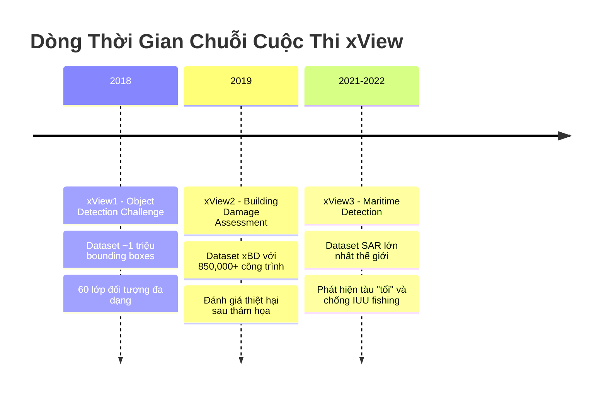

# Chương 4: Chuỗi Cuộc Thi xView - Đẩy Mạnh Giới Hạn Thị Giác Máy Tính Trong Viễn Thám

## Giới thiệu

Các kiến trúc mô hình đã giới thiệu ở **Chương 3** được kiểm chứng qua loạt cuộc thi xView do Defense Innovation Unit tổ chức. Chương này phân tích 3 cuộc thi và 15 giải pháp chiến thắng, minh họa cách áp dụng các kỹ thuật deep learning vào bài toán viễn thám thực tế.

## Lời Mở Đầu

Trong lịch sử phát triển của thị giác máy tính, những cuộc thi benchmark lớn như ImageNet Challenge đã đóng vai trò then chốt trong việc thúc đẩy các đột phá kỹ thuật. Tương tự, lĩnh vực phân tích ảnh viễn thám cũng chứng kiến sự ra đời của chuỗi cuộc thi xView - một sáng kiến mang tính bước ngoặt do Defense Innovation Unit (DIU) thuộc Bộ Quốc phòng Hoa Kỳ khởi xướng từ năm 2018.

Chuỗi cuộc thi xView được thiết kế không chỉ nhằm tạo ra các bộ dữ liệu benchmark chất lượng cao, mà còn hướng tới việc giải quyết những bài toán thực tiễn có ý nghĩa chiến lược: từ phát hiện và phân loại hàng chục nghìn đối tượng trên mặt đất, đánh giá thiệt hại công trình sau thảm họa, đến giám sát hoạt động hàng hải và chống đánh bắt cá bất hợp pháp. Mỗi thử thách đều đặt ra những yêu cầu kỹ thuật đặc thù, buộc cộng đồng nghiên cứu phải phát triển các phương pháp mới phù hợp với đặc điểm riêng của ảnh viễn thám.

## Tổng Quan Chuỗi Cuộc Thi

Chuỗi xView Challenges bao gồm ba cuộc thi chính, mỗi cuộc thi tập trung vào một bài toán cốt lõi khác nhau trong lĩnh vực thị giác máy tính cho viễn thám:

### xView1: Nền Tảng Phát Hiện Đối Tượng Quy Mô Lớn

Cuộc thi xView1 (2018) đánh dấu sự khởi đầu của chuỗi với mục tiêu xây dựng một benchmark toàn diện cho bài toán phát hiện đối tượng trong ảnh vệ tinh quang học độ phân giải cao. Với gần một triệu bounding box annotation trải rộng trên 60 lớp đối tượng - từ phương tiện giao thông, công trình xây dựng đến các cơ sở hạ tầng - xView1 đặt ra những thách thức chưa từng có về quy mô và độ phức tạp. Các giải pháp hàng đầu từ cuộc thi này đã đặt nền móng cho nhiều kỹ thuật quan trọng được áp dụng rộng rãi trong phân tích ảnh viễn thám sau này.

### xView2: Đánh Giá Thiệt Hại Công Trình

Tiếp nối thành công của xView1, cuộc thi xView2 (2019) chuyển hướng sang một ứng dụng mang tính nhân đạo sâu sắc: đánh giá thiệt hại công trình sau các thảm họa tự nhiên và nhân tạo. Bộ dữ liệu xBD (xView Building Damage) được giới thiệu như dataset đánh giá thiệt hại công trình lớn nhất từng được công bố, với hơn 850,000 polygon công trình được gán nhãn theo bốn cấp độ thiệt hại. Cuộc thi không chỉ đòi hỏi khả năng định vị công trình mà còn yêu cầu phân tích sự thay đổi giữa các cặp ảnh trước và sau thảm họa - một bài toán đa nhiệm phức tạp đòi hỏi sự kết hợp tinh tế giữa phát hiện đối tượng và phân tích thay đổi.

### xView3: Giám Sát Hàng Hải và Chống Đánh Bắt Cá Bất Hợp Pháp

Cuộc thi xView3 (2021-2022) đánh dấu một bước chuyển đổi đáng kể khi chuyển từ ảnh quang học sang ảnh radar khẩu độ tổng hợp (SAR - Synthetic Aperture Radar). Được tổ chức hợp tác giữa DIU và Global Fishing Watch, xView3 hướng tới mục tiêu phát hiện "dark vessels" - những tàu cố tình tắt hệ thống nhận dạng tự động (AIS) để trốn tránh giám sát. Dataset xView3-SAR với 1,400 gigapixels dữ liệu trở thành bộ dữ liệu SAR phát hiện tàu lớn nhất thế giới, mở ra một hướng nghiên cứu mới trong việc ứng dụng deep learning cho dữ liệu radar vệ tinh.

## So Sánh Ba Cuộc Thi

| Tiêu chí | xView1 (2018) | xView2 (2019) | xView3 (2021-2022) |
|----------|---------------|---------------|-------------------|
| **Bài toán** | Object Detection | Building Damage Assessment | Maritime Detection |
| **Loại ảnh** | Quang học (RGB) | Quang học (RGB) | SAR (Radar) |
| **Vệ tinh** | WorldView-3 | Maxar satellites | Sentinel-1 |
| **GSD** | 0.3m | 0.3-0.8m | 10m × 10m |
| **Đối tượng** | ~1M bounding boxes | ~850K polygons | ~10K vessels |
| **Số lớp** | 60 lớp | 5 lớp (4 damage + background) | Binary + length |
| **Diện tích** | ~1,400 km² | ~45,000 km² | 43M km² ocean |
| **Task** | Single-stage detection | Multi-task (localization + damage) | Detection + classification |
| **Thách thức chính** | Class imbalance, multi-scale | Change detection, disaster diversity | Dark vessels, SAR noise |
| **Metric** | mAP@0.5 | F1 (localization + damage) | F1 score |
| **Top score** | 31.74% mAP | 0.804 F1 | 0.694 F1 |

## Các Mẫu Hình Chiến Thắng Chung

Phân tích 15 giải pháp hàng đầu từ 3 cuộc thi cho thấy các mẫu hình kỹ thuật được lặp lại:

### 1. Kiến Trúc Backbone
- **xView1**: ResNet, ResNeXt, SENet đa dạng
- **xView2**: Chủ yếu EfficientNet, DenseNet
- **xView3**: ResNet, EfficientNet cho SAR
- **Xu hướng**: Chuyển sang kiến trúc hiệu quả hơn theo thời gian

### 2. Kỹ Thuật Ensemble
- **Tất cả 3 cuộc thi**: Top 5 đều dùng ensemble 5-15 models
- **Chiến lược**: Test-time augmentation + multi-scale inference
- **Trọng số**: Voting có trọng số dựa trên validation performance

### 3. Xử Lý Mất Cân Bằng Dữ Liệu
- **xView1**: Reduced Focal Loss, class-balanced sampling
- **xView2**: Focal Loss cho damage classes
- **xView3**: Weighted loss cho vessel detection
- **Bài học**: Loss function engineering quan trọng hơn architecture

### 4. Data Augmentation
- **xView1/2**: Flip, rotate, color jitter, mosaic
- **xView3**: SAR-specific: speckle noise, intensity normalization
- **Copy-paste**: Hiệu quả cho rare classes (xView1, xView3)

### 5. Post-processing
- **xView1**: Soft-NMS, score thresholding per class
- **xView2**: Morphological operations, polygon refinement
- **xView3**: Confidence calibration, spatial filtering

## Tầm Quan Trọng Khoa Học và Ứng Dụng Thực Tiễn

Chuỗi cuộc thi xView mang lại những đóng góp quan trọng cho cả cộng đồng nghiên cứu và các ứng dụng thực tiễn:

**Về mặt khoa học**, các cuộc thi đã thúc đẩy sự phát triển của nhiều kỹ thuật đột phá:
- Các hàm mất mát chuyên biệt như Reduced Focal Loss được thiết kế riêng cho bài toán mất cân bằng lớp cực độ trong ảnh viễn thám
- Các kiến trúc mạng kết hợp như Siamese-UNet cho bài toán phân tích thay đổi
- Các phương pháp xử lý ảnh SAR và kết hợp dữ liệu đa nguồn
- Các chiến lược huấn luyện tối ưu cho dữ liệu quy mô lớn với nhãn nhiễu

**Về mặt ứng dụng**, các giải pháp từ chuỗi xView đã được triển khai vào thực tế:
- Hỗ trợ các tổ chức cứu trợ nhân đạo trong việc đánh giá nhanh thiệt hại sau thảm họa
- Tích hợp vào hệ thống giám sát hàng hải của Global Fishing Watch để chống đánh bắt cá bất hợp pháp
- Cung cấp nền tảng cho các nghiên cứu về quy hoạch đô thị và giám sát môi trường

## Cấu Trúc Chương

Chương này sẽ trình bày chi tiết về cả ba cuộc thi trong chuỗi xView, tập trung vào ba khía cạnh chính cho mỗi cuộc thi:

1. **Bộ dữ liệu và bài toán**: Phân tích đặc điểm kỹ thuật của dataset, các thách thức đặc thù, và định nghĩa chính xác của bài toán cần giải quyết

2. **Các giải pháp hàng đầu**: Trình bày chi tiết về phương pháp của các đội đạt thành tích cao, tập trung vào những đổi mới kỹ thuật cốt lõi và các bài học rút ra

3. **Tác động và hướng phát triển**: Đánh giá ảnh hưởng của cuộc thi đối với lĩnh vực nghiên cứu và các ứng dụng thực tiễn

Thông qua việc phân tích sâu các giải pháp hàng đầu, chương này không chỉ cung cấp kiến thức về các kỹ thuật tiên tiến mà còn giúp người đọc hiểu được quá trình tư duy và các quyết định thiết kế quan trọng trong việc giải quyết các bài toán phức tạp của thị giác máy tính trong viễn thám.

---

## Kết Chương

Các kỹ thuật và bài học từ xView Challenges sẽ được áp dụng cụ thể vào hai bài toán thực tế: **Chương 5** trình bày phát hiện tàu biển (liên quan đến xView1/xView3), và **Chương 6** trình bày phát hiện dầu loang (ứng dụng kỹ thuật segmentation tương tự xView2).

---

*Các mục tiếp theo sẽ đi sâu vào từng cuộc thi, bắt đầu với xView1 - Object Detection Challenge, cuộc thi đặt nền móng cho toàn bộ chuỗi.*
