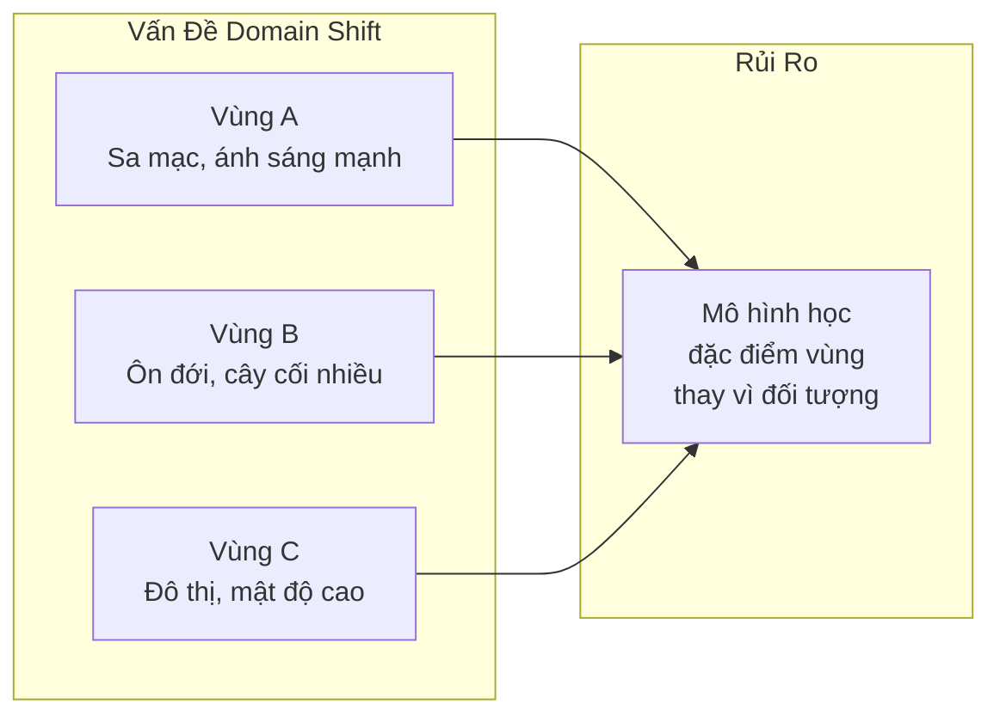
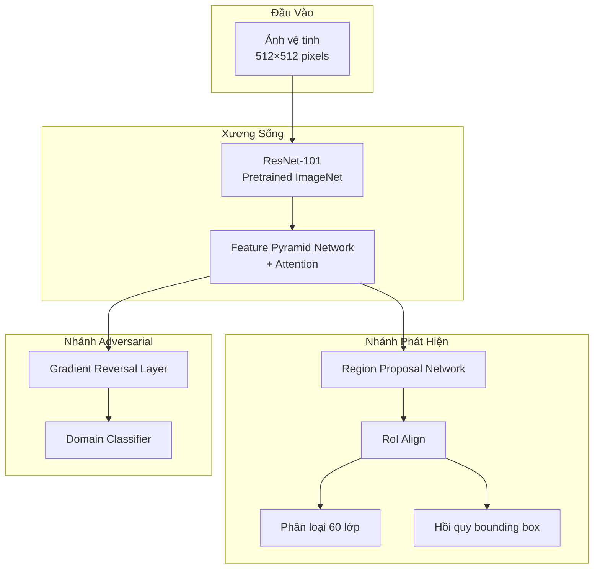
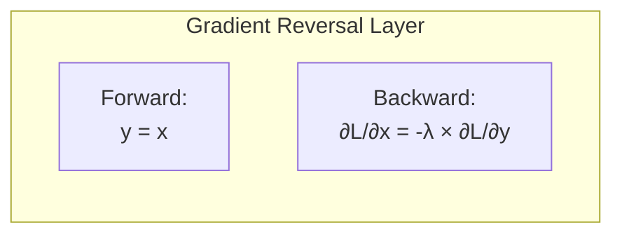
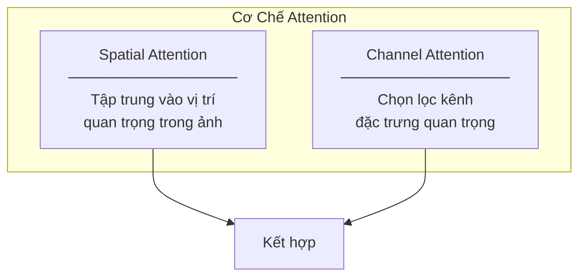
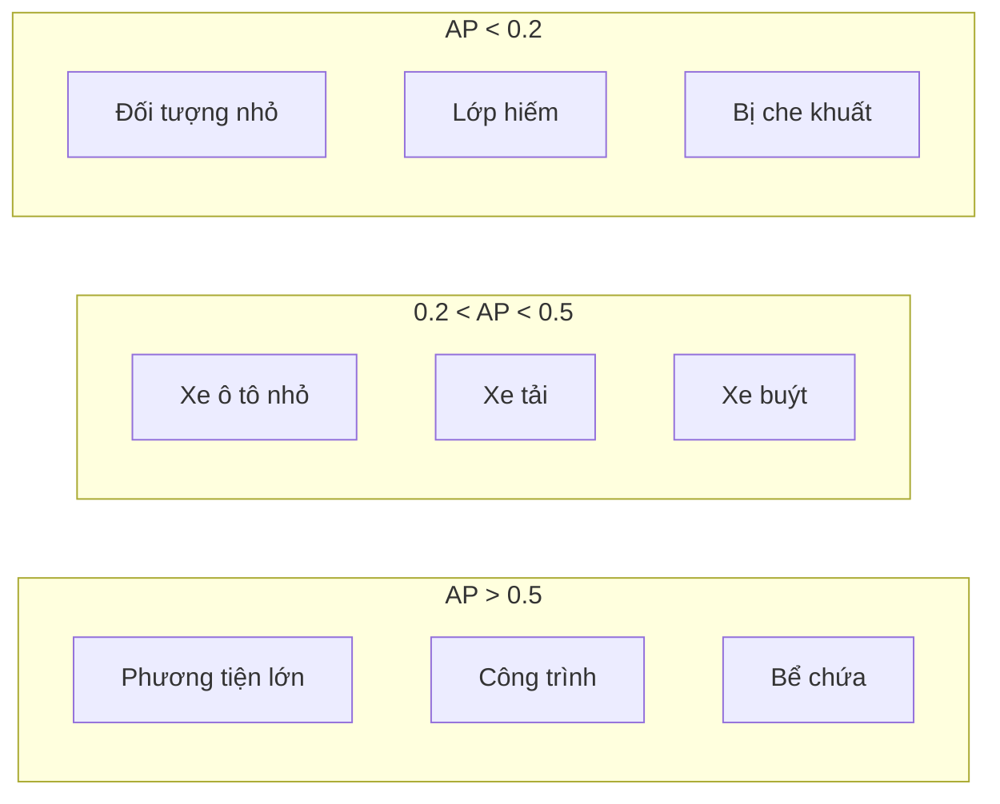

#4.1.3 Giải Pháp Hạng Nhì xView1: Domain Adversarial Training

## Lời Dẫn

Nếu giải pháp hạng nhất tập trung vào việc thiết kế hàm mất mát mới, thì giải pháp hạng nhì của Victor Stamatescu đến từ University of Adelaide lại đi theo hướng khác: làm thế nào để mô hình học được các đặc trưng robust, bất biến với sự thay đổi về điều kiện thu thập ảnh? Câu trả lời nằm ở kỹ thuật Domain Adversarial Training - buộc mô hình "quên" đi những đặc điểm riêng của từng vùng địa lý để tập trung vào đặc điểm bản chất của đối tượng.

| Thuộc tính | Giá trị |
|-----------|---------|
| **Xếp hạng** | 2/2,300+ bài nộp |
| **Tác giả** | Victor Stamatescu |
| **Đơn vị** | University of Adelaide, Australia |
| **Điểm mAP** | ~26 (ước tính) |
| **Đóng góp chính** | Domain Adversarial Training, Attention-Enhanced FPN |

---

## 1. Bối Cảnh và Vấn Đề

### 1.1 Thách Thức Domain Shift

Bộ dữ liệu xView1 chứa ảnh từ nhiều khu vực địa lý khác nhau trên toàn cầu: đô thị châu Âu, vùng sa mạc Trung Đông, khu công nghiệp Đông Á, và nhiều vùng khác. Mỗi khu vực có đặc điểm riêng về:

- **Màu sắc nền**: Cát sa mạc khác với cỏ ôn đới
- **Mật độ công trình**: Đô thị châu Âu khác với vùng nông thôn châu Á
- **Kiểu kiến trúc**: Nhà mái bằng khác với nhà mái dốc
- **Điều kiện ánh sáng**: Góc mặt trời thay đổi theo vĩ độ và mùa

Nếu mô hình học được rằng "xe ô tô thường xuất hiện trên nền cát vàng" (từ ảnh vùng sa mạc), nó sẽ gặp khó khăn khi phát hiện xe ô tô trên nền cỏ xanh (vùng ôn đới).

### 1.2 Ý Tưởng Domain Adversarial

Nhóm Adelaide đề xuất áp dụng Domain Adversarial Neural Network (DANN) - một kỹ thuật từ lĩnh vực domain adaptation - vào bài toán phát hiện đối tượng. Ý tưởng cốt lõi là:

1. **Thêm bộ phân loại domain**: Dự đoán ảnh đến từ vùng địa lý nào
2. **Gradient reversal**: Đảo ngược gradient từ bộ phân loại domain
3. **Học đặc trưng bất biến**: Backbone buộc phải học các đặc trưng không chứa thông tin về domain

---

## 2. Kiến Trúc Mô Hình

### 2.1 Tổng Quan Kiến Trúc

### 2.2 Gradient Reversal Layer

Thành phần then chốt của kiến trúc là Gradient Reversal Layer (GRL). Trong forward pass, GRL hoạt động như identity function (không thay đổi input). Trong backward pass, GRL nhân gradient với hệ số âm.

Kết quả: Backbone được huấn luyện để **tối thiểu hóa** loss phát hiện đối tượng, đồng thời **tối đa hóa** loss phân loại domain. Điều này buộc backbone học các đặc trưng hữu ích cho phát hiện nhưng không chứa thông tin domain.

### 2.3 Attention-Enhanced FPN

Nhóm cũng cải tiến Feature Pyramid Network với cơ chế attention:

| Cấp độ | Kích thước | Mục đích | Attention |
|--------|-----------|----------|-----------|
| P2 | 1/4 | Đối tượng nhỏ (xe ô tô) | Spatial Attention |
| P3 | 1/8 | Đối tượng trung bình | Spatial + Channel |
| P4 | 1/16 | Đối tượng lớn | Channel Attention |
| P5 | 1/32 | Đối tượng rất lớn | Channel Attention |

---

## 3. Chiến Lược Huấn Luyện

### 3.1 Hàm Mất Mát Đa Nhiệm

Tổng loss bao gồm ba thành phần:

$$\mathcal{L}_{total} = \mathcal{L}_{detection} + \lambda_{box} \mathcal{L}_{box} + \lambda_{domain} \mathcal{L}_{domain}$$

| Thành phần | Mô tả | Trọng số |
|------------|-------|----------|
| Detection Loss | Focal Loss cho phân loại | 1.0 |
| Box Loss | Smooth L1 cho hồi quy | 1.0 |
| Domain Loss | Binary CE (gradient reversed) | 0.1 |

### 3.2 Xử Lý Mất Cân Bằng Lớp

Nhóm sử dụng phương pháp "Effective Number of Samples" để tính trọng số cho từng lớp:

| Lớp | Số mẫu | Tỷ lệ | Trọng số |
|-----|--------|-------|----------|
| Xe ô tô nhỏ | 314,884 | 42% | 0.12 |
| Công trình | 127,844 | 17% | 0.29 |
| Xe tải | 29,817 | 4% | 1.25 |
| Bể chứa | 17,000 | 2% | 2.20 |
| ... | ... | ... | ... |
| Cẩu | 153 | 0.02% | 245.0 |

### 3.3 Cấu Hình Huấn Luyện

| Tham số | Giá trị |
|---------|---------|
| **Optimizer** | SGD với momentum 0.9 |
| **Learning rate** | 0.02 (cosine decay) |
| **Warmup** | 3 epochs |
| **Tổng epochs** | 24 |
| **Batch size** | 16 × 4 GPUs = 64 |
| **Kích thước tile** | 512 × 512 |
| **Overlap** | 128 pixels |

---

## 4. Kết Quả Thực Nghiệm

### 4.1 Ablation Study

| Cấu hình | mAP | Δ mAP |
|----------|-----|-------|
| Baseline Faster R-CNN | 0.18 | - |
| + Enhanced FPN | 0.21 | +0.03 |
| + Attention Modules | 0.23 | +0.02 |
| + Domain Adversarial | 0.24 | +0.01 |
| + Class-Balanced Loss | 0.26 | +0.02 |

### 4.2 Hiệu Suất Theo Danh Mục

### 4.3 So Sánh Với Các Giải Pháp Khác

| Hạng | Đội | Đóng góp chính |
|------|-----|----------------|
| 1 | Sergievskiy & Ponamarev | Reduced Focal Loss |
| **2** | **Adelaide** | **Domain Adversarial** |
| 3 | USF | Pattern Recognition |
| 4 | Studio Mapp | Ensemble Methods |
| 5 | CMU SEI | Dual-CNN |

---

## 5. Ý Nghĩa và Bài Học

### 5.1 Đóng Góp Về Mặt Khoa Học

Giải pháp của nhóm Adelaide cho thấy tầm quan trọng của việc học đặc trưng robust trong ảnh viễn thám. Domain Adversarial Training, dù ban đầu được phát triển cho bài toán domain adaptation, có thể được áp dụng hiệu quả cho bài toán trong cùng domain nhưng với dữ liệu đa dạng về địa lý.

### 5.2 Bài Học Rút Ra

1. **Đa dạng địa lý cần được xử lý**: Không thể giả định dữ liệu đồng nhất
2. **Adversarial training có nhiều ứng dụng**: Không chỉ cho domain adaptation
3. **Attention cải thiện đa tỷ lệ**: Đặc biệt quan trọng cho đối tượng nhỏ
4. **Kết hợp nhiều kỹ thuật**: Mỗi thành phần đóng góp một phần cải thiện

---

## 6. Hạn Chế Tài Liệu

Cần lưu ý rằng thông tin chi tiết về giải pháp này có hạn do không có bài báo chính thức được công bố. Nội dung trình bày dựa trên:
- Hướng nghiên cứu của nhóm tại University of Adelaide
- Các phương pháp phổ biến trong các giải pháp top xView1
- Best practices trong lĩnh vực phát hiện đối tượng từ ảnh viễn thám

---

## Tài Liệu Tham Khảo

1. Ganin, Y., & Lempitsky, V. (2015). Unsupervised Domain Adaptation by Backpropagation. ICML.

2. Lin, T. Y., et al. (2017). Feature Pyramid Networks for Object Detection. CVPR.

3. Cui, Y., et al. (2019). Class-Balanced Loss Based on Effective Number of Samples. CVPR.

4. Woo, S., et al. (2018). CBAM: Convolutional Block Attention Module. ECCV.

---

*Mục tiếp theo sẽ trình bày giải pháp hạng ba của cuộc thi, với những đóng góp về Pattern Recognition và Multi-scale Analysis.*
