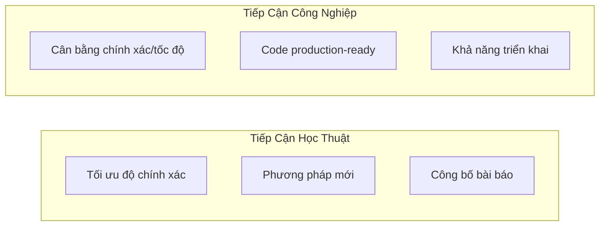
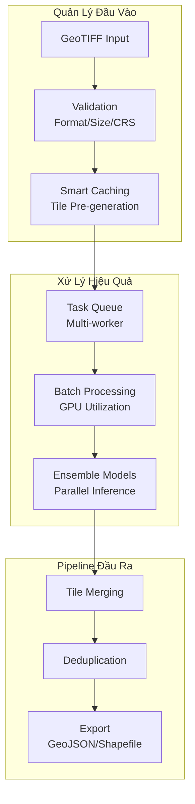
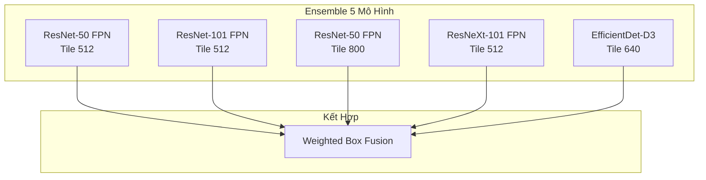
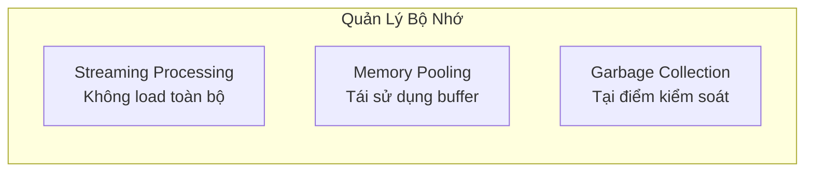
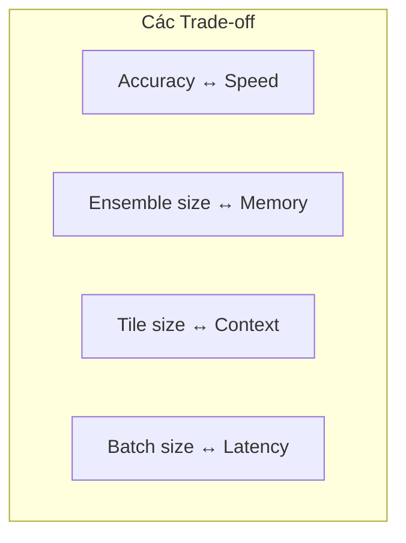

#4.1.5 Giải Pháp Hạng Tư xView1: Production-Ready Pipeline

## Lời Dẫn

Khác với các giải pháp đến từ các trường đại học nghiên cứu, giải pháp hạng tư của Leonardo Dal Zovo từ Studio Mapp mang đến góc nhìn thực tiễn của ngành công nghiệp. Thay vì tập trung vào các đổi mới lý thuyết, giải pháp này nhấn mạnh vào việc xây dựng một pipeline phát hiện đối tượng có thể triển khai trong sản xuất thực tế, với sự cân bằng giữa độ chính xác, tốc độ và khả năng mở rộng.

| Thuộc tính | Giá trị |
|-----------|---------|
| **Xếp hạng** | 4/2,300+ bài nộp |
| **Tác giả** | Leonardo Dal Zovo |
| **Đơn vị** | Studio Mapp (Độc lập) |
| **Điểm mAP** | ~24 (ước tính) |
| **Đóng góp chính** | Production-Ready Pipeline, Efficient Ensemble |

---

## 1. Góc Nhìn Công Nghiệp

### 1.1 Khác Biệt Với Tiếp Cận Học Thuật

| Khía cạnh | Học thuật | Công nghiệp (Studio Mapp) |
|-----------|-----------|---------------------------|
| **Mục tiêu** | Độ chính xác cao nhất | Cân bằng các yếu tố |
| **Code** | Prototype nghiên cứu | Production-ready |
| **Tối ưu** | Tập trung accuracy | Accuracy + Speed + Memory |
| **Triển khai** | Máy cục bộ | Cloud/Edge ready |
| **Khả năng mở rộng** | Single dataset | Đa use case |

### 1.2 Triết Lý Thiết Kế

Studio Mapp tuân theo các nguyên tắc:
1. **Đơn giản hóa**: Ưu tiên giải pháp đơn giản, hiệu quả
2. **Modular**: Các thành phần có thể thay thế
3. **Có thể tái tạo**: Kết quả nhất quán giữa các lần chạy
4. **Có thể mở rộng**: Xử lý từ ảnh đơn đến hàng nghìn ảnh

---

## 2. Kiến Trúc Pipeline

### 2.1 Tổng Quan Luồng Xử Lý

### 2.2 Tối Ưu Từng Giai Đoạn

| Giai đoạn | Tối ưu hóa | Lợi ích |
|-----------|-----------|---------|
| **Input** | Lazy loading, caching | Giảm I/O wait |
| **Tiling** | Pre-computed, overlap management | Tránh duplicate |
| **Inference** | Batching, mixed precision | GPU utilization cao |
| **NMS** | Per-class, threshold tuning | Chính xác hơn |
| **Merge** | Spatial indexing | Nhanh hơn O(n²) → O(n log n) |

---

## 3. Chiến Lược Ensemble

### 3.1 Đa Dạng Mô Hình

### 3.2 Weighted Box Fusion

Thay vì NMS truyền thống, Studio Mapp sử dụng Weighted Box Fusion để kết hợp predictions:

| Phương pháp | Ưu điểm | Nhược điểm |
|-------------|---------|------------|
| **NMS** | Đơn giản, nhanh | Loại bỏ box tốt |
| **Soft-NMS** | Giữ được nhiều box | Vẫn có thể mất |
| **WBF** | Kết hợp thông tin từ tất cả | Chậm hơn |

WBF tạo box mới từ trung bình có trọng số của các box overlap, thay vì chọn một box duy nhất.

---

## 4. Tối Ưu Triển Khai

### 4.1 Memory Management

### 4.2 Cấu Hình Inference

| Tham số | Giá trị | Lý do |
|---------|---------|-------|
| **Batch size** | 8 | Cân bằng speed/memory |
| **Mixed precision** | FP16 | Tăng 1.5x throughput |
| **Num workers** | 4 | Tránh I/O bottleneck |
| **Pin memory** | True | Faster GPU transfer |
| **Prefetch factor** | 2 | Hide latency |

---

## 5. Kết Quả và Phân Tích

### 5.1 So Sánh Hiệu Suất

| Metric | Single Model | Ensemble |
|--------|--------------|----------|
| **mAP** | 0.22 | 0.24 |
| **Inference time/tile** | 50ms | 200ms |
| **GPU memory** | 4GB | 12GB |

### 5.2 Trade-offs

---

## 6. Bài Học Từ Góc Nhìn Công Nghiệp

### 6.1 Những Điều Hoạt Động Tốt

1. **Ensemble đa dạng**: Kết hợp nhiều backbone và tile size
2. **WBF thay vì NMS**: Tận dụng thông tin từ nhiều model
3. **Streaming processing**: Xử lý ảnh lớn không cần RAM lớn
4. **Caching thông minh**: Tránh tính toán lặp lại

### 6.2 Những Điều Cần Cải Thiện

1. **Ensemble chậm**: Cần tối ưu hơn cho real-time
2. **Tile overlap**: Chi phí tính toán tăng 30-50%
3. **Class imbalance**: Vẫn cần giải pháp tốt hơn
4. **Small objects**: Vẫn là thách thức lớn

### 6.3 Khuyến Nghị Cho Triển Khai Thực Tế

| Scenario | Khuyến nghị |
|----------|-------------|
| **Real-time** | Single model, FP16, batch 1 |
| **High accuracy** | Full ensemble, WBF |
| **Edge device** | Quantized model, small backbone |
| **Cloud batch** | Large batch, multiple GPU |

---

## Tài Liệu Tham Khảo

1. Solovyev, R., et al. (2021). Weighted Boxes Fusion: Ensembling boxes from different object detection models. Image and Vision Computing.

2. Mixed Precision Training. NVIDIA Deep Learning Documentation.

3. Best Practices for Model Deployment. TensorRT Documentation.

---

*Mục tiếp theo sẽ trình bày giải pháp hạng năm của cuộc thi, với đóng góp về kiến trúc Dual-CNN từ CMU SEI.*
