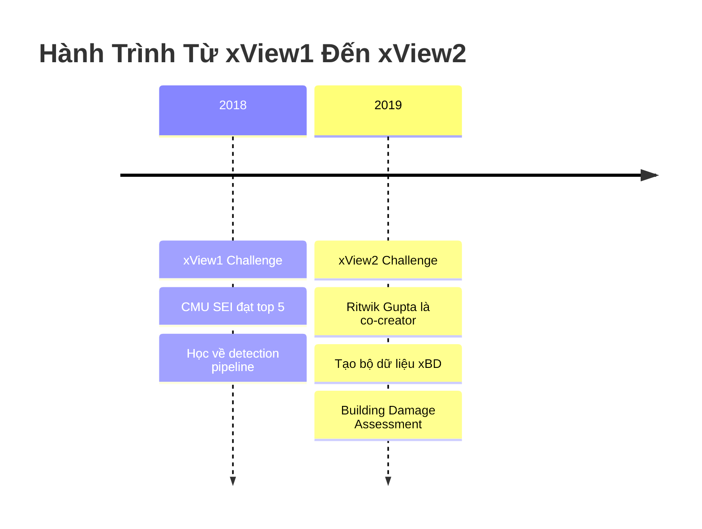
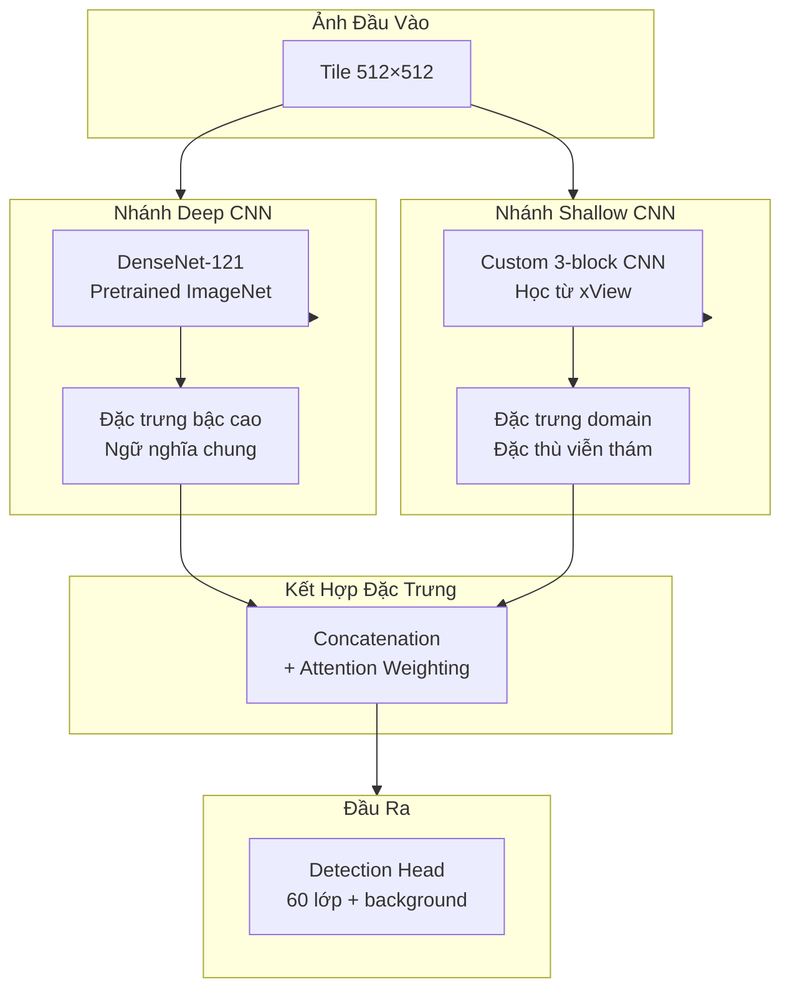
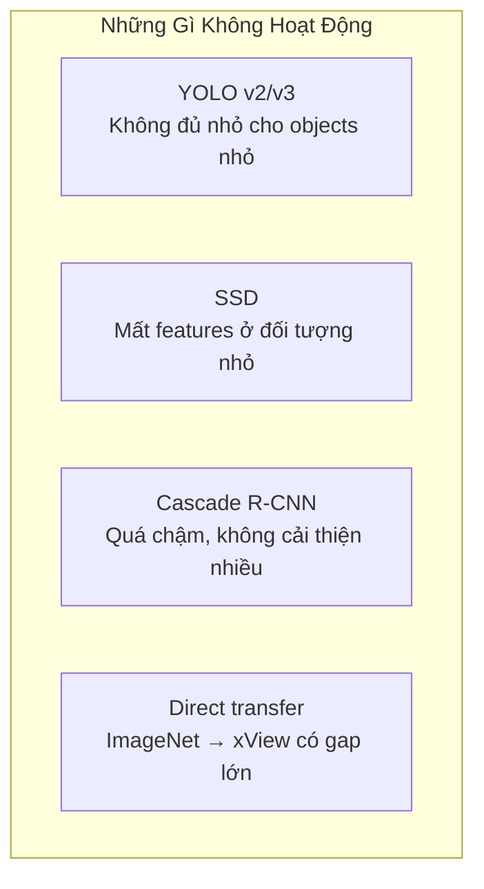
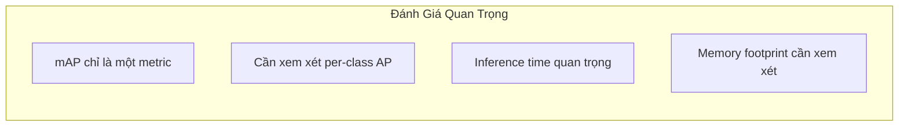

#4.1.6 Giải Pháp Hạng Năm xView1: Dual-CNN Feature Extraction

## Lời Dẫn

Giải pháp hạng năm của nhóm CMU Software Engineering Institute đặc biệt đáng chú ý vì hai lý do. Thứ nhất, đây là giải pháp có tài liệu công khai chi tiết nhất trong top 5, với blog post kỹ thuật chia sẻ những gì hoạt động và không hoạt động. Thứ hai, thành viên chính của nhóm - Ritwik Gupta - sau này trở thành đồng tác giả chính của bộ dữ liệu xView2/xBD, cho thấy kinh nghiệm từ cuộc thi này đã góp phần định hình các nghiên cứu tiếp theo.

| Thuộc tính | Giá trị |
|-----------|---------|
| **Xếp hạng** | 5/2,300+ bài nộp |
| **Tác giả** | Ritwik Gupta, Alex Fulton, Kaylene Stocking |
| **Đơn vị** | CMU SEI, USAF, University of Pittsburgh |
| **Điểm mAP** | ~23 (ước tính) |
| **Đóng góp chính** | Dual-CNN Architecture, Comparative Analysis |
| **Blog** | CMU SEI Insights |

---

## 1. Bối Cảnh Đặc Biệt

### 1.1 Liên Kết Với xView2

Kinh nghiệm tham gia xView1 giúp nhóm hiểu sâu về:
- Thách thức của annotation quy mô lớn
- Vấn đề domain gap trong ảnh viễn thám
- Tầm quan trọng của đánh giá chất lượng
- Cách thiết kế metric phù hợp

### 1.2 Đội Ngũ Đa Dạng

| Thành viên | Đơn vị | Góc nhìn |
|------------|--------|----------|
| Ritwik Gupta | CMU SEI | ML for satellite imagery |
| Alex Fulton | USAF | Ứng dụng quốc phòng |
| Kaylene Stocking | U. Pittsburgh | Computer vision research |

Sự kết hợp giữa nghiên cứu học thuật, ứng dụng quốc phòng, và kỹ thuật phần mềm tạo nên góc nhìn toàn diện.

---

## 2. Kiến Trúc Dual-CNN

### 2.1 Ý Tưởng Cốt Lõi

Nhóm CMU SEI quan sát thấy:
- **Pretrained ImageNet features**: Tốt cho ngữ nghĩa chung nhưng không được tối ưu cho ảnh viễn thám
- **Domain-specific features**: Cần học từ dữ liệu xView nhưng có ít mẫu cho lớp hiếm

Giải pháp là kết hợp cả hai:

### 2.2 Lợi Ích Của Dual-CNN

| Thành phần | Đóng góp |
|------------|----------|
| **Deep branch** | Đặc trưng semantic từ ImageNet |
| **Shallow branch** | Đặc trưng đặc thù viễn thám |
| **Fusion** | Kết hợp ưu điểm cả hai |

---

## 3. Phân Tích So Sánh

### 3.1 Thí Nghiệm Với Nhiều Detector

Nhóm đã thử nghiệm nhiều kiến trúc khác nhau:

| Detector | Backbone | mAP | Ghi chú |
|----------|----------|-----|---------|
| Faster R-CNN | ResNet-50 | 0.18 | Baseline |
| Faster R-CNN | ResNet-101 | 0.19 | Tốt hơn chút |
| RetinaNet | ResNet-50 | 0.17 | Focal Loss |
| **Dual-CNN** | **Custom** | **0.23** | **Kết hợp** |

### 3.2 Những Gì Không Hoạt Động

Blog của CMU SEI chia sẻ những thất bại quan trọng:

### 3.3 Những Gì Hoạt Động

| Kỹ thuật | Lý do hoạt động |
|----------|-----------------|
| **FPN** | Đa tỷ lệ phù hợp với đối tượng đa kích thước |
| **Dual features** | Kết hợp general và domain-specific |
| **Aggressive augmentation** | Tăng đa dạng dữ liệu |
| **Balanced sampling** | Giảm class imbalance |

---

## 4. Bài Học Chia Sẻ

### 4.1 Về Domain Gap

Nhóm nhấn mạnh sự khác biệt lớn giữa ảnh tự nhiên và ảnh viễn thám:

| Khía cạnh | Ảnh tự nhiên | Ảnh viễn thám |
|-----------|--------------|---------------|
| **Góc nhìn** | Ngang | Từ trên xuống |
| **Kích thước đối tượng** | Lớn, rõ ràng | Nhỏ, 3-10 pixels |
| **Texture** | Phong phú | Hạn chế |
| **Mật độ** | Thưa | Dày đặc (bãi đỗ xe) |

### 4.2 Về Đánh Giá Mô Hình

### 4.3 Về Class Imbalance

Nhóm chia sẻ phân tích chi tiết về mất cân bằng lớp:

| Nhóm lớp | Số lượng | Chiến lược |
|----------|----------|------------|
| **Phổ biến** (>50k) | 2 lớp | Undersampling 50% |
| **Trung bình** (5k-50k) | 15 lớp | Giữ nguyên |
| **Hiếm** (1k-5k) | 25 lớp | Oversampling 2x |
| **Rất hiếm** (<1k) | 18 lớp | Oversampling 5x + augmentation |

---

## 5. Tác Động Dài Hạn

### 5.1 Đóng Góp Cho xView2

Kinh nghiệm từ xView1 ảnh hưởng trực tiếp đến thiết kế xView2:

| Bài học từ xView1 | Áp dụng vào xView2 |
|-------------------|-------------------|
| Mất cân bằng lớp | Thiết kế 4 cấp thiệt hại cân bằng hơn |
| Domain gap | Cung cấp cặp ảnh trước/sau rõ ràng |
| Metric phức tạp | Thiết kế localization + classification |
| Annotation quality | Quy trình QC chặt chẽ hơn |

### 5.2 Đóng Góp Cho Cộng Đồng

Blog post của CMU SEI trở thành tài liệu tham khảo quan trọng:
- Chia sẻ thất bại (hiếm trong nghiên cứu)
- Hướng dẫn thực hành
- So sánh nhiều phương pháp
- Góc nhìn từ người thực hành

---

## 6. Ý Nghĩa Khoa Học

### 6.1 Giá Trị Của Việc Chia Sẻ Thất Bại

Cộng đồng nghiên cứu thường chỉ công bố thành công. CMU SEI cho thấy giá trị của việc chia sẻ:
- Những gì không hoạt động
- Tại sao không hoạt động
- Bài học rút ra

### 6.2 Liên Kết Nghiên Cứu Và Ứng Dụng

Giải pháp minh họa:
- Nghiên cứu học thuật có thể dẫn đến tạo dataset mới
- Kinh nghiệm thực hành quan trọng cho thiết kế benchmark
- Collaboration đa dạng tạo góc nhìn toàn diện

---

## Tài Liệu Tham Khảo

1. Gupta, R., et al. (2018). Deep Learning and Satellite Imagery: DIUx xView Challenge. CMU SEI Insights Blog.

2. Gupta, R., et al. (2019). xBD: A Dataset for Assessing Building Damage from Satellite Imagery. arXiv:1911.09296.

3. Huang, G., et al. (2017). Densely Connected Convolutional Networks. CVPR.

---

*Phần tiếp theo sẽ chuyển sang mục 6.2, trình bày cuộc thi xView2 về đánh giá thiệt hại công trình sau thảm họa.*
