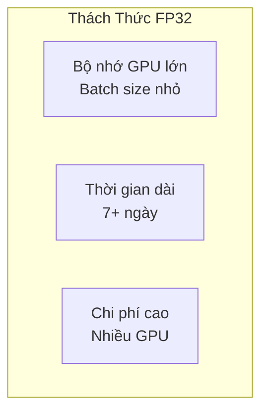
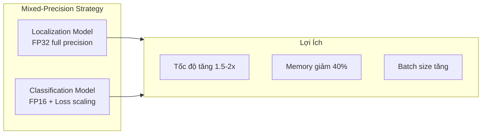
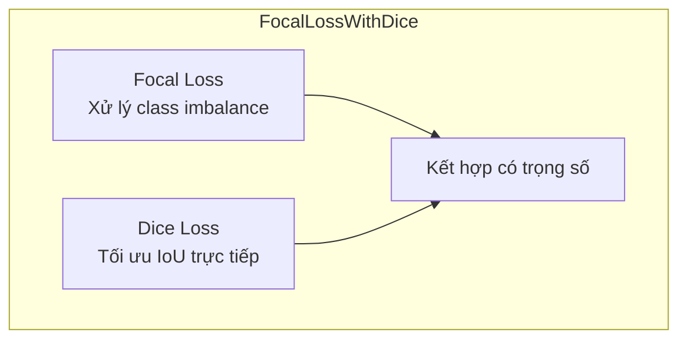
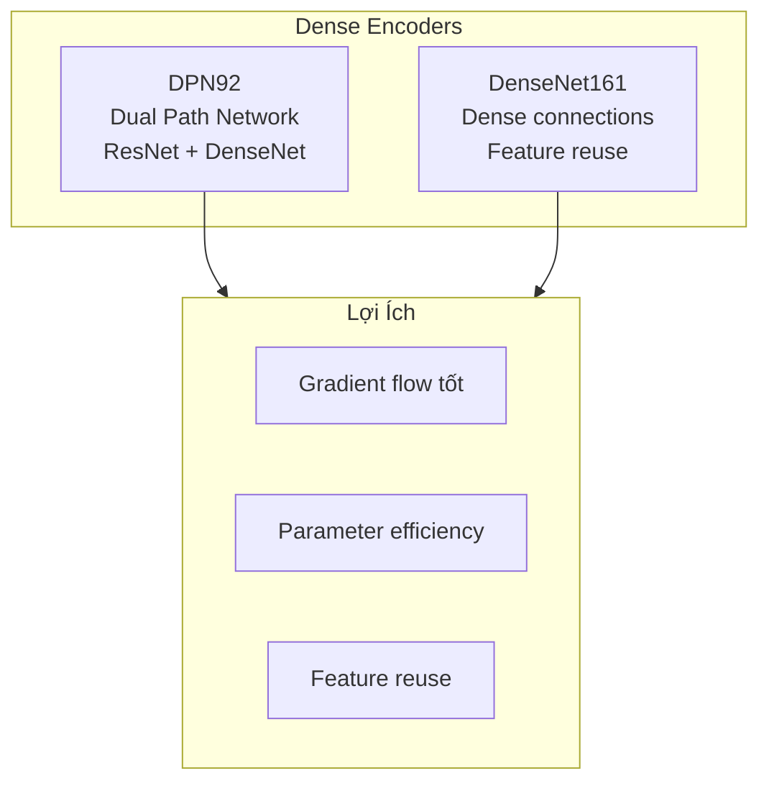

#4.2.3 Giải Pháp Hạng Nhì xView2: Mixed-Precision Training

## Lời Dẫn

Nếu giải pháp hạng nhất tập trung vào kiến trúc Siamese U-Net, thì giải pháp hạng nhì của Selim Sefidov nổi bật với việc tối ưu hóa quá trình huấn luyện. Trong khi nhiều đội khác cần 7 ngày hoặc hơn để huấn luyện mô hình, Sefidov giảm thời gian xuống còn 4-5 ngày nhờ kỹ thuật mixed-precision training có chọn lọc - sử dụng FP32 cho localization và FP16 cho classification. Đây là minh chứng rằng hiệu suất cao có thể đạt được không chỉ qua kiến trúc phức tạp, mà còn qua tối ưu hóa thông minh.

| Thuộc tính | Giá trị |
|-----------|---------|
| **Xếp hạng** | 2/3,500+ bài nộp |
| **Tác giả** | Selim Sefidov (selimsef) |
| **Điểm** | ~0.812 |
| **Đóng góp chính** | Mixed-Precision Training, FocalLossWithDice |
| **Framework** | PyTorch + NVIDIA Apex |

---

## 1. Ý Tưởng Cốt Lõi

### 1.1 Vấn Đề Với Huấn Luyện Tiêu Chuẩn

Huấn luyện mô hình phân đoạn ảnh lớn (1024×1024) với FP32 tiêu chuẩn gặp các hạn chế:

### 1.2 Giải Pháp Mixed-Precision

Sefidov áp dụng mixed-precision có chọn lọc:

| Nhiệm vụ | Precision | Lý do |
|----------|-----------|-------|
| **Localization** | FP32 | Cần độ chính xác cao cho ranh giới |
| **Classification** | FP16 | Ít nhạy cảm với precision |

---

## 2. Thiết Kế Hàm Mất Mát

### 2.1 FocalLossWithDice

Một đóng góp quan trọng là thiết kế hàm mất mát ổn định cho FP16:

### 2.2 Tại Sao Kết Hợp

| Loss | Ưu điểm | Nhược điểm |
|------|---------|------------|
| **Focal** | Xử lý imbalance | Không tối ưu IoU trực tiếp |
| **Dice** | Tối ưu overlap | Không ổn định với imbalance |
| **Kết hợp** | Cả hai ưu điểm | Cần tune trọng số |

---

## 3. Kiến Trúc Mô Hình

### 3.1 Dense Encoder

Sefidov sử dụng các backbone có đặc điểm dense connections:

### 3.2 Pipeline Huấn Luyện Riêng Biệt

| Giai đoạn | Encoder | Mục tiêu |
|-----------|---------|----------|
| **Localization** | DPN92 | Building segmentation |
| **Classification** | DenseNet161 | Damage classification |

---

## 4. Kết Quả và Phân Tích

### 4.1 So Sánh Hiệu Quả

| Metric | FP32 Standard | Mixed-Precision |
|--------|---------------|-----------------|
| **Thời gian** | ~7 ngày | ~4-5 ngày |
| **Memory/GPU** | 16 GB | 10 GB |
| **Batch size** | 4 | 8 |
| **Score** | ~0.81 | ~0.812 |

### 4.2 So Sánh Với Giải Pháp Khác

| Khía cạnh | Hạng 1 | Hạng 2 (Sefidov) |
|-----------|--------|------------------|
| **Precision** | Full FP32 | Mixed FP16/FP32 |
| **Training time** | ~7 ngày | ~4-5 ngày |
| **Encoder** | 4 loại ensemble | DPN92 + DenseNet161 |
| **Loss** | Dice + Focal + CE | FocalLossWithDice |

---

## 5. Bài Học Rút Ra

### 5.1 Tối Ưu Thực Tiễn

1. **Precision phù hợp với nhiệm vụ**: Không cần FP32 cho mọi thứ
2. **Loss design quan trọng**: Ổn định numerical cho FP16
3. **Dense connections hiệu quả**: DPN, DenseNet tốt cho segmentation
4. **Huấn luyện riêng biệt**: Tối ưu từng nhiệm vụ độc lập

### 5.2 Ý Nghĩa Thực Tiễn

Giải pháp cho thấy:
- Hiệu suất cao không đồng nghĩa với chi phí cao
- Tối ưu training có thể quan trọng như kiến trúc
- Mixed-precision sẵn sàng cho production

---

## Tài Liệu Tham Khảo

1. Micikevicius, P., et al. (2018). Mixed Precision Training. ICLR.

2. Chen, Y., et al. (2017). Dual Path Networks. NeurIPS.

3. Lin, T. Y., et al. (2017). Focal Loss for Dense Object Detection. ICCV.

---

*Mục tiếp theo sẽ trình bày giải pháp hạng ba với Ensemble và Pseudo-Labeling.*
