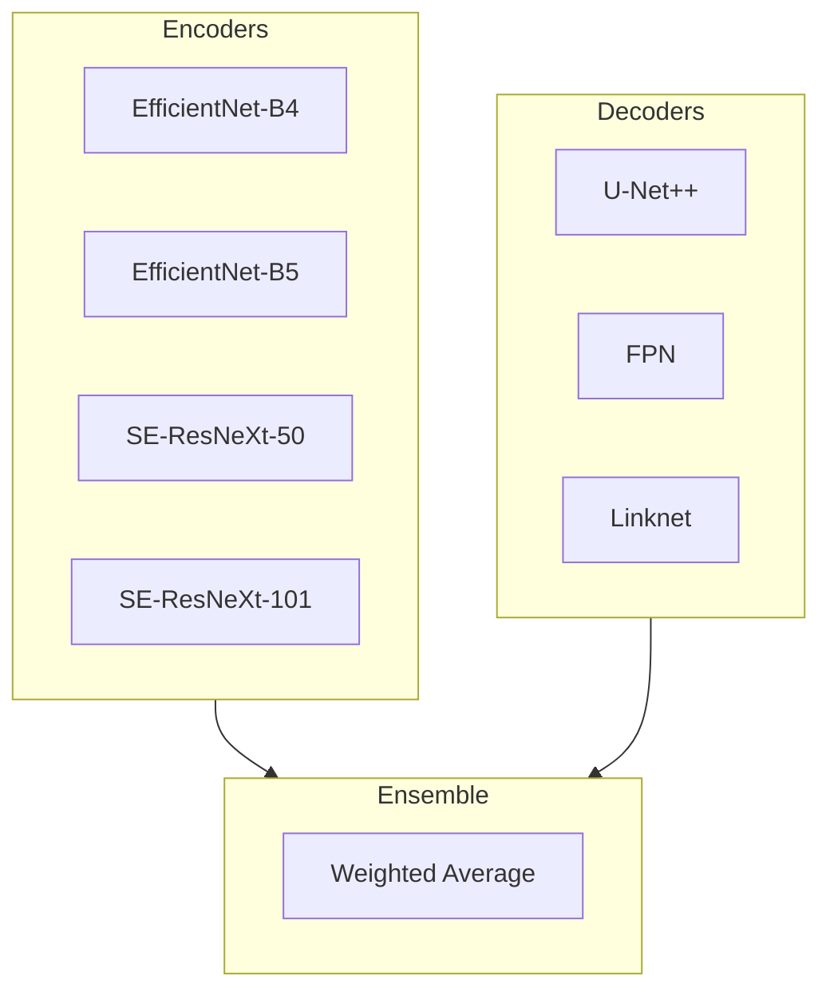
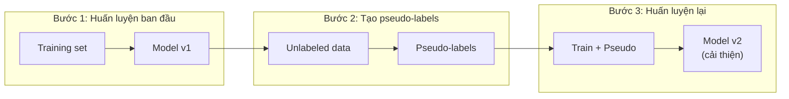
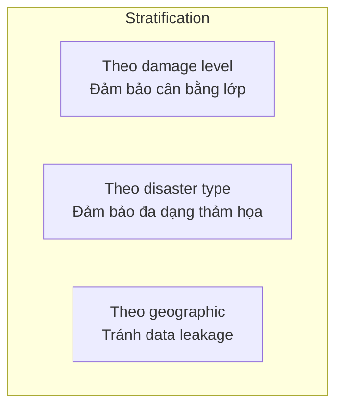
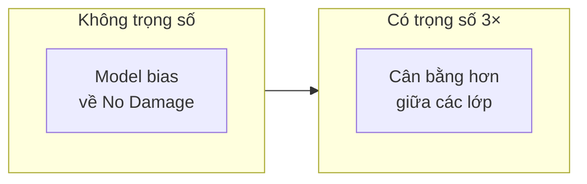
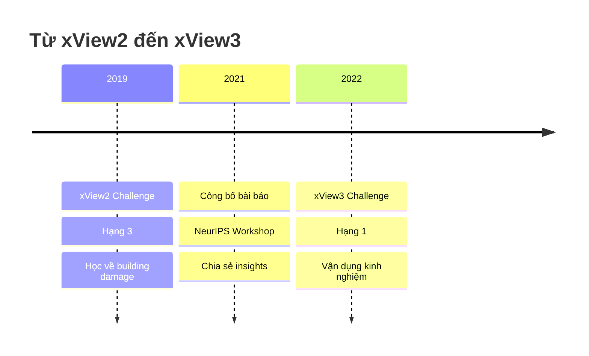

#4.2.4 Giải Pháp Hạng Ba xView2: Ensemble và Pseudo-Labeling

## Lời Dẫn

Giải pháp hạng ba của Eugene Khvedchenya (BloodAxe) đặc biệt đáng chú ý vì hai lý do. Thứ nhất, đây là giải pháp có bài báo khoa học chi tiết được công bố, cung cấp insights sâu về các quyết định thiết kế. Thứ hai, tác giả sau đó đạt hạng nhất trong xView3 Challenge, cho thấy kinh nghiệm từ xView2 đã được vận dụng hiệu quả. Giải pháp nổi bật với chiến lược ensemble đa dạng và kỹ thuật pseudo-labeling có thể tăng 2 điểm.

| Thuộc tính | Giá trị |
|-----------|---------|
| **Xếp hạng** | 3/3,500+ bài nộp |
| **Tác giả** | Eugene Khvedchenya (BloodAxe) |
| **Điểm** | 0.805 (Private LB) |
| **Đóng góp chính** | Ensemble đa dạng, Pseudo-labeling |
| **Bài báo** | arXiv:2111.00508 |

---

## 1. Chiến Lược Ensemble

### 1.1 Đa Dạng Mô Hình

BloodAxe xây dựng ensemble với 8+ mô hình có encoder và decoder khác nhau:

### 1.2 Lợi Ích Của Đa Dạng

| Loại đa dạng | Ví dụ | Đóng góp |
|--------------|-------|----------|
| **Encoder** | EfficientNet vs ResNeXt | Biểu diễn khác nhau |
| **Decoder** | U-Net++ vs FPN | Fusion khác nhau |
| **Scale** | Input 512 vs 1024 | Multi-scale |
| **Augmentation** | Khác nhau mỗi fold | Regularization |

---

## 2. Pseudo-Labeling

### 2.1 Ý Tưởng Cốt Lõi

Pseudo-labeling sử dụng dự đoán của mô hình trên dữ liệu không có nhãn làm "pseudo-labels" để huấn luyện tiếp:

### 2.2 Kết Quả

| Cấu hình | Score |
|----------|-------|
| Không pseudo-label | 0.785 |
| Với pseudo-label | **0.805** |
| **Cải thiện** | **+2.0 điểm** |

---

## 3. Cross-Validation Stratified

### 3.1 Stratification Đa Chiều

BloodAxe sử dụng 5-fold CV với stratification theo nhiều tiêu chí:

### 3.2 Lợi Ích

| Loại stratification | Mục đích |
|---------------------|----------|
| **Damage level** | Mỗi fold có đủ Minor/Major/Destroyed |
| **Disaster type** | Mỗi fold có đủ các loại thảm họa |
| **Geographic** | Tránh ảnh cùng khu vực ở train và val |

---

## 4. Weighted Cross-Entropy

### 4.1 Trọng Số Lớp

Do 80% công trình không thiệt hại, BloodAxe áp dụng trọng số:

| Lớp | Trọng số | Lý do |
|-----|----------|-------|
| No Damage | 1.0 | Baseline |
| Minor | 3.0 | Lớp thiểu số |
| Major | 3.0 | Lớp thiểu số |
| Destroyed | 3.0 | Lớp thiểu số |

### 4.2 Hiệu Quả

---

## 5. Hành Trình Thành Công

### 5.1 Timeline

### 5.2 Bài Học Được Áp Dụng

| Bài học từ xView2 | Áp dụng vào xView3 |
|-------------------|-------------------|
| Ensemble đa dạng | Mở rộng với nhiều modalities |
| Pseudo-labeling | Áp dụng cho SAR data |
| Stratified CV | Stratify theo vùng biển |

---

## 6. Ý Nghĩa Khoa Học

### 6.1 Đóng Góp Cho Cộng Đồng

Bài báo của BloodAxe cung cấp:
- Phân tích chi tiết các thành phần
- Ablation studies đầy đủ
- Code và weights công khai
- Hướng dẫn tái tạo

### 6.2 Bài Học Rút Ra

1. **Ensemble đa dạng quan trọng**: Encoder + Decoder + Scale
2. **Pseudo-labeling hiệu quả**: +2 điểm với one round
3. **Stratification cẩn thận**: Tránh data leakage
4. **Class weighting cần thiết**: 3× cho minority classes

---

## Tài Liệu Tham Khảo

1. Khvedchenya, E. (2021). xView2 Challenge: From Baseline to 3rd Place. NeurIPS Workshop.

2. Lee, D. H. (2013). Pseudo-Label: The Simple and Efficient Semi-Supervised Learning Method. ICML Workshop.

3. Tan, M., & Le, Q. (2019). EfficientNet: Rethinking Model Scaling. ICML.

---

*Mục tiếp theo sẽ trình bày giải pháp hạng tư với thiết kế modular và config-driven.*
