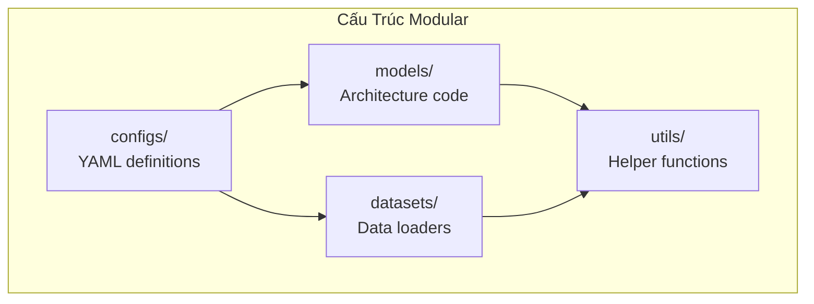
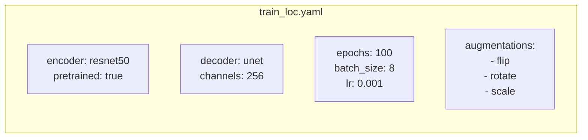
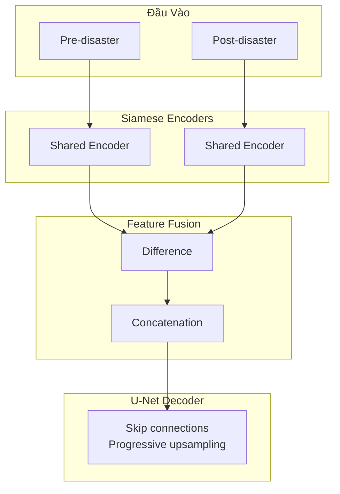
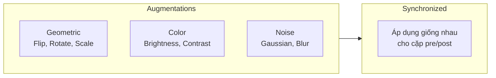

#4.2.5 Giải Pháp Hạng Tư xView2: Config-Driven Architecture

## Lời Dẫn

Giải pháp hạng tư của Z-Zheng tiêu biểu cho xu hướng thiết kế phần mềm hiện đại trong nghiên cứu học máy: tách biệt cấu hình khỏi code. Thay vì hard-code các hyperparameter và cấu trúc mô hình, giải pháp sử dụng file YAML để định nghĩa mọi thứ từ kiến trúc encoder đến chiến lược augmentation. Điều này không chỉ giúp tái tạo kết quả dễ dàng mà còn cho phép thử nghiệm nhanh nhiều cấu hình khác nhau.

| Thuộc tính | Giá trị |
|-----------|---------|
| **Xếp hạng** | 4/3,500+ bài nộp |
| **Tác giả** | Z-Zheng |
| **Điểm** | ~0.798 (ước tính) |
| **Đóng góp chính** | Config-driven design, Modular architecture |
| **License** | Apache-2.0 |

---

## 1. Thiết Kế Modular

### 1.1 Cấu Trúc Dự Án

### 1.2 Lợi Ích Của Modular Design

| Khía cạnh | Lợi ích |
|-----------|---------|
| **Tái tạo** | Chỉ cần share config file |
| **Thử nghiệm** | Đổi config không cần sửa code |
| **Bảo trì** | Mỗi module độc lập |
| **Mở rộng** | Thêm encoder/decoder dễ dàng |

---

## 2. Config-Driven Training

### 2.1 Ví Dụ Config YAML

### 2.2 Tách Biệt Localization và Classification

| Config | Mục đích | Đặc điểm |
|--------|----------|----------|
| **train_loc.yaml** | Định vị công trình | Binary segmentation |
| **train_cls.yaml** | Phân loại thiệt hại | Multi-class |

---

## 3. Kiến Trúc Tiêu Chuẩn

### 3.1 Siamese + U-Net Pattern

### 3.2 Các Encoder Hỗ Trợ

| Encoder | Params | Đặc điểm |
|---------|--------|----------|
| ResNet-50 | 25M | Cân bằng |
| ResNet-101 | 44M | Sâu hơn |
| EfficientNet-B4 | 19M | Hiệu quả |
| SE-ResNeXt-50 | 28M | Attention |

---

## 4. Data Pipeline

### 4.1 Augmentation Strategy

### 4.2 Xử Lý Class Imbalance

| Kỹ thuật | Mô tả |
|----------|-------|
| **Weighted sampling** | Sample nhiều hơn từ damaged buildings |
| **Focal Loss** | Down-weight easy examples |
| **Online hard mining** | Focus vào samples khó |

---

## 5. Ưu Điểm Của Approach

### 5.1 So Sánh Với Hard-coded

| Khía cạnh | Hard-coded | Config-driven |
|-----------|------------|---------------|
| **Thay đổi** | Sửa code, recompile | Sửa YAML |
| **Tái tạo** | Khó đảm bảo | Đảm bảo 100% |
| **Chia sẻ** | Cần share toàn bộ code | Share config file |
| **Version control** | Diff khó đọc | Diff rõ ràng |

### 5.2 Best Practices

1. **Tách config theo mục đích**: train, eval, inference
2. **Default values**: Có giá trị mặc định hợp lý
3. **Validation**: Kiểm tra config hợp lệ trước khi chạy
4. **Logging**: Ghi lại config đã dùng

---

## 6. Bài Học Cho Nghiên Cứu

### 6.1 Reproducibility

Config-driven design cải thiện đáng kể khả năng tái tạo:
- Mọi hyperparameter được ghi lại
- Không có "magic numbers" trong code
- Có thể track changes qua git

### 6.2 Áp Dụng Rộng Rãi

Pattern này phổ biến trong nhiều framework:
- **Detectron2**: YAML configs
- **mmdetection**: Python config files
- **Hydra**: Dynamic config composition

---

## Tài Liệu Tham Khảo

1. Wu, Y., et al. (2019). Detectron2. GitHub repository.

2. Chen, K., et al. (2019). MMDetection: Open MMLab Detection Toolbox. arXiv.

3. Yadan, O. (2019). Hydra - A framework for elegantly configuring complex applications. GitHub.

---

*Mục tiếp theo sẽ trình bày giải pháp hạng năm với kiến trúc Dual-HRNet độc đáo.*
