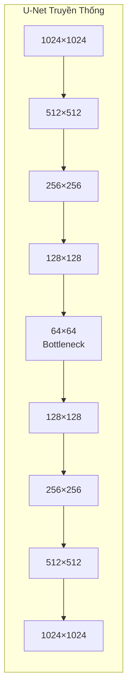
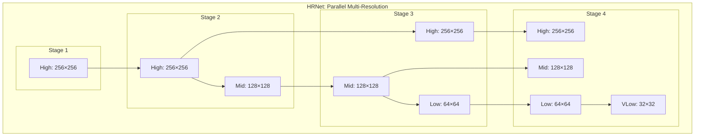
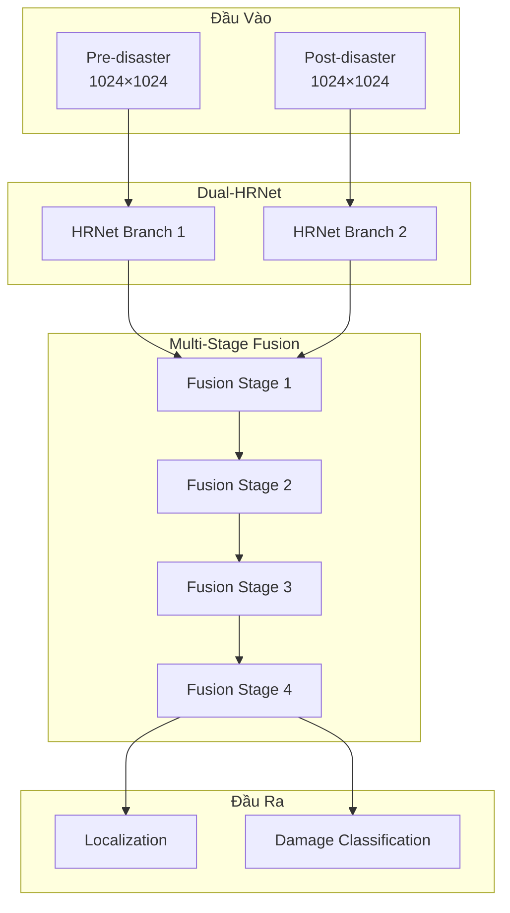
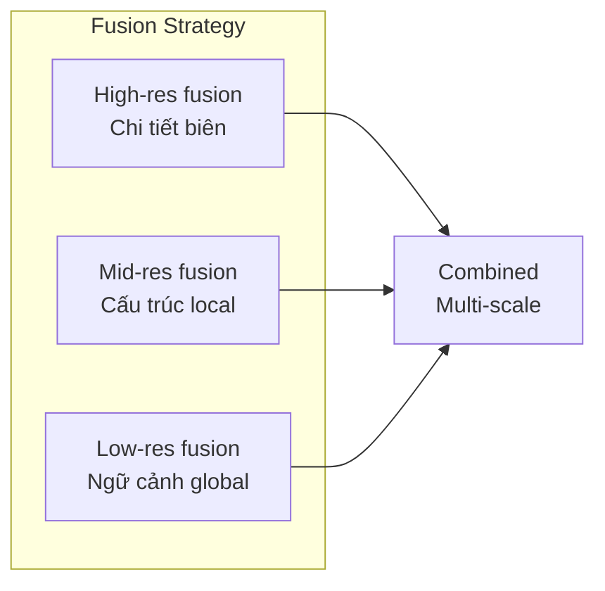
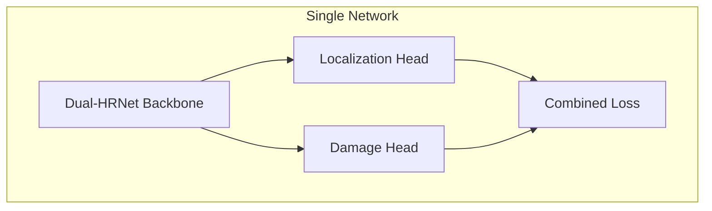

#4.2.6 Giải Pháp Hạng Năm xView2: Dual-HRNet

## Lời Dẫn

Trong khi hầu hết các giải pháp top xView2 đều sử dụng kiến trúc encoder-decoder như U-Net, giải pháp hạng năm của SI Analytics (Korea) đi theo hướng hoàn toàn khác với Dual-HRNet. HRNet (High-Resolution Network) duy trì độ phân giải cao xuyên suốt mạng, không qua bottleneck như U-Net. Điều này đặc biệt phù hợp cho bài toán xác định ranh giới công trình - nơi chi tiết spatial quan trọng. Giải pháp minh họa rằng không phải lúc nào kiến trúc phổ biến nhất cũng là tối ưu.

| Thuộc tính | Giá trị |
|-----------|---------|
| **Xếp hạng** | 5/3,500+ bài nộp |
| **Tác giả** | SI Analytics (Korea) |
| **Điểm** | ~0.792 (ước tính) |
| **Đóng góp chính** | Dual-HRNet, Multi-Stage Fusion |
| **License** | MIT |

---

## 1. Vấn Đề Với Encoder-Decoder

### 1.1 Mất Thông Tin Qua Bottleneck

Mỗi lần downsampling mất thông tin spatial, và skip connections không phục hồi hoàn toàn.

### 1.2 Giải Pháp HRNet

HRNet duy trì nhánh độ phân giải cao song song với các nhánh thấp hơn:

---

## 2. Kiến Trúc Dual-HRNet

### 2.1 Hai Nhánh Song Song

### 2.2 Shared vs Separate Weights

| Cấu hình | Mô tả | Trade-off |
|----------|-------|-----------|
| **Shared** | Cùng weights cho pre/post | Ít parameters, tốt cho similarity |
| **Separate** | Weights riêng | Nhiều parameters, flexible |
| **Dual-HRNet** | Shared với fusion | Cân bằng |

---

## 3. Multi-Stage Fusion

### 3.1 Fusion Ở Mỗi Resolution

Thay vì chỉ fusion ở cuối, Dual-HRNet kết hợp đặc trưng ở mỗi stage:

### 3.2 Lợi Ích

| Level | Đóng góp |
|-------|----------|
| **High-res** | Chi tiết ranh giới chính xác |
| **Mid-res** | Pattern thiệt hại local |
| **Low-res** | Ngữ cảnh và global features |

---

## 4. Single Network

### 4.1 End-to-End Training

Khác với các giải pháp huấn luyện riêng localization và classification, Dual-HRNet train cả hai cùng lúc:

### 4.2 Multi-Task Loss

$$\mathcal{L}_{total} = \lambda_{loc} \mathcal{L}_{loc} + \lambda_{dmg} \mathcal{L}_{dmg}$$

| Thành phần | Loss type | Trọng số |
|------------|-----------|----------|
| Localization | Dice + BCE | 0.5 |
| Damage | Focal | 0.5 |

---

## 5. So Sánh Với U-Net

### 5.1 Kiến Trúc

| Khía cạnh | U-Net | HRNet |
|-----------|-------|-------|
| **Resolution** | Giảm rồi tăng | Duy trì song song |
| **Bottleneck** | Có | Không |
| **Skip connections** | Từ encoder sang decoder | Giữa các branches |
| **Parameters** | Thấp hơn | Cao hơn |

### 5.2 Hiệu Suất

| Metric | U-Net | Dual-HRNet |
|--------|-------|------------|
| **Boundary accuracy** | Tốt | Rất tốt |
| **Speed** | Nhanh | Chậm hơn |
| **Memory** | Thấp | Cao hơn |

---

## 6. Bài Học Rút Ra

### 6.1 Không Phải Lúc Nào Cũng U-Net

Giải pháp cho thấy:
- Kiến trúc khác có thể hiệu quả
- HRNet phù hợp khi cần chi tiết spatial
- Trade-off giữa accuracy và efficiency

### 6.2 Ý Nghĩa Cho Nghiên Cứu

1. **Đa dạng kiến trúc**: Không nên chỉ dùng một pattern
2. **Task-specific design**: HRNet cho boundary-sensitive tasks
3. **Multi-task learning**: Có thể train cùng lúc hiệu quả
4. **Multi-scale fusion**: Quan trọng cho change detection

---

## Tài Liệu Tham Khảo

1. Wang, J., et al. (2020). Deep High-Resolution Representation Learning for Visual Recognition. IEEE PAMI.

2. Sun, K., et al. (2019). High-Resolution Representations for Labeling Pixels and Regions. CVPR.

3. Zhou, Z., et al. (2018). UNet++: A Nested U-Net Architecture. DLMIA.

---

*Phần tiếp theo sẽ chuyển sang mục 6.3, trình bày cuộc thi xView3 về giám sát hàng hải với ảnh SAR.*
