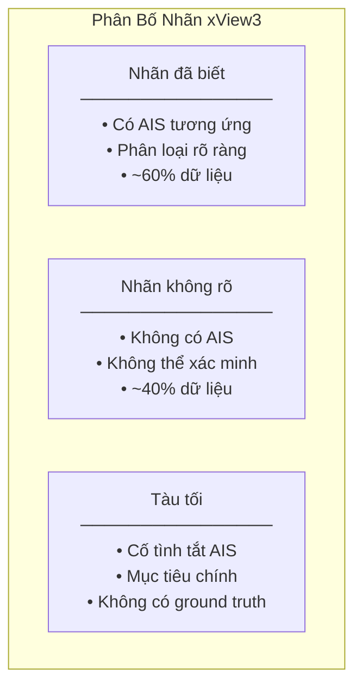
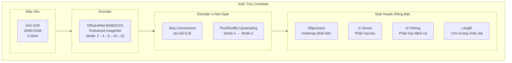
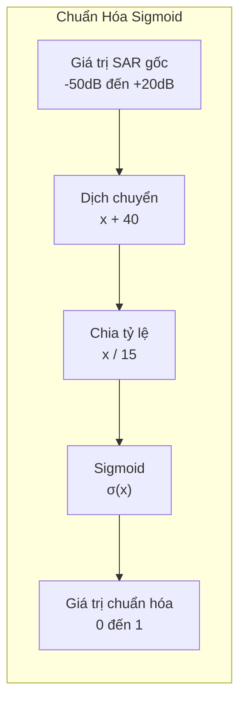
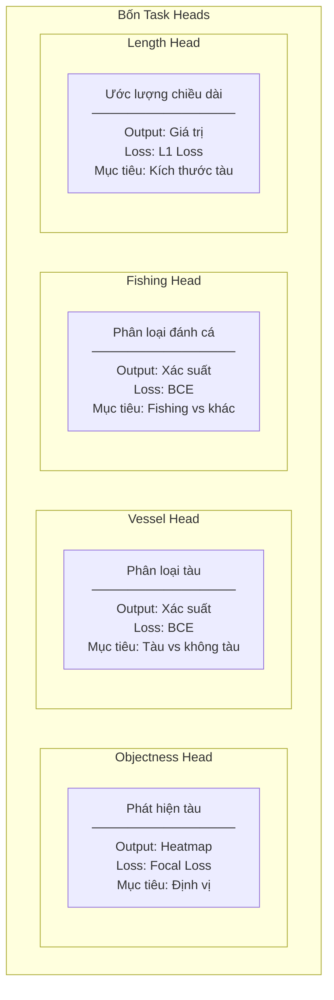

#4.3.2 Giải Pháp Hạng Nhất xView3: Kiến Trúc CircleNet

## Lời Dẫn

Cuộc thi xView3: Dark Vessels Detection Challenge đánh dấu một bước chuyển mình quan trọng trong chuỗi xView khi chuyển từ ảnh quang học sang ảnh radar khẩu độ tổng hợp (SAR). Với dataset SAR phát hiện tàu lớn nhất thế giới và mục tiêu chống đánh bắt cá bất hợp pháp (IUU fishing), cuộc thi thu hút sự tham gia của gần 2,000 đội từ khắp toàn cầu. Giải pháp CircleNet của Eugene Khvedchenya - một Kaggle Grandmaster - đã giành chiến thắng với điểm số vượt trội gấp ba lần baseline, mở ra những hướng tiếp cận mới cho bài toán phát hiện đối tượng nhỏ trong ảnh radar.

| Thuộc tính | Giá trị |
|-----------|---------|
| **Xếp hạng** | 1/1,900+ đội |
| **Tác giả** | Eugene Khvedchenya (BloodAxe) |
| **Điểm holdout** | 0.617 (gấp 3× baseline) |
| **Giải thưởng** | $150,000 |
| **Đóng góp chính** | CircleNet, Stride-2 output, Entropy regularization |

---

## 1. Bối Cảnh và Phân Tích Bài Toán

### 1.1 Đặc Thù của Dữ Liệu SAR

Khác biệt căn bản với xView1 và xView2 - vốn sử dụng ảnh quang học - xView3 làm việc với ảnh SAR (Synthetic Aperture Radar). Sự khác biệt này tạo ra những thách thức kỹ thuật hoàn toàn mới:

**Dải động cực lớn**: Giá trị pixel trong ảnh SAR có thể dao động từ -50dB đến +20dB, với nhiều giá trị ngoại lai (outliers) gây khó khăn cho việc chuẩn hóa dữ liệu.

**Nhiễu speckle đặc trưng**: Ảnh SAR có loại nhiễu multiplicative đặc thù, khác biệt hoàn toàn với nhiễu Gaussian trong ảnh quang học.

**Kích thước đối tượng nhỏ**: Các tàu thuyền trong ảnh SAR chỉ chiếm 10-100 pixels, đòi hỏi phương pháp phát hiện có độ phân giải cao.

### 1.2 Thách Thức về Nhãn Dữ Liệu

Một trong những thách thức lớn nhất của xView3 là chất lượng nhãn. Phần lớn nhãn được tạo ra bằng cách đối chiếu với dữ liệu AIS (Automatic Identification System), nhưng:

- Tàu "tối" (dark vessels) cố tình tắt AIS nên không được gán nhãn
- Nhiều tàu nhỏ không có thiết bị AIS
- Một số nhãn được đánh dấu là "unknown" thay vì có giá trị xác định

### 1.3 Insight Quan Trọng: Tàu Như Điểm

Nhóm tác giả nhận ra rằng với kích thước tàu nhỏ (10-100 pixels), phương pháp phát hiện dựa trên bounding box truyền thống không phải lựa chọn tối ưu. Thay vào đó, coi mỗi tàu như một **điểm trung tâm** trên heatmap mang lại nhiều ưu điểm:

- Không cần ước lượng kích thước bounding box
- Phù hợp với đặc điểm đối tượng nhỏ và đẳng hướng
- Cho phép sử dụng heatmap regression thay vì anchor-based detection

---

## 2. Kiến Trúc CircleNet

### 2.1 Ý Tưởng Cốt Lõi

CircleNet kết hợp hai ý tưởng mạnh mẽ: phát hiện dựa trên điểm từ CenterNet và skip connections độ phân giải cao từ U-Net. Tên gọi "CircleNet" xuất phát từ việc biểu diễn mỗi tàu như một điểm tròn trên heatmap.

> **Tham khảo Chương 3**: Kiến trúc EfficientNet được trình bày tại [Mục 3.2 - Classification Models](/chuong-03-kien-truc-model/muc-02-classification/01-classification-models), và U-Net decoder với skip connections được giới thiệu trong [Mục 3.3 - Segmentation Models](/chuong-03-kien-truc-model/muc-03-segmentation/01-segmentation-models).

### 2.2 Đột Phá: Output Stride-2

Điểm sáng tạo quan trọng nhất của CircleNet là sử dụng output stride-2 thay vì stride-16 như các mô hình thông thường. Với ảnh đầu vào 2048×2048, output stride-2 cho ra feature map 1024×1024, trong khi stride-16 chỉ cho 128×128.

| Output Stride | Kích thước Feature Map | Label Encoding F1 |
|---------------|------------------------|-------------------|
| Stride-16 | 128×128 | 0.9672 |
| Stride-8 | 256×256 | 0.9934 |
| Stride-4 | 512×512 | 0.9991 |
| **Stride-2** | 1024×1024 | **0.9999** |

Sự cải thiện 3.3% trong label encoding accuracy từ stride-16 đến stride-2 có vẻ nhỏ nhưng có ý nghĩa quyết định: với tàu chỉ 10 pixels, việc định vị sai 8 pixels (stride-16) có thể khiến hoàn toàn bỏ lỡ đối tượng.

### 2.3 Xử Lý Đầu Vào Đa Kênh

Thay vì chỉ sử dụng ảnh SAR thuần túy, giải pháp kết hợp bốn kênh đầu vào:

| Kênh | Mô tả | Vai trò |
|------|-------|---------|
| **VH Polarization** | Vertical-Horizontal | Phát hiện cấu trúc kim loại |
| **VV Polarization** | Vertical-Vertical | Bổ sung thông tin tán xạ |
| **Bathymetry** | Độ sâu đáy biển | Loại bỏ false positive từ đáy nông |
| **Wind Speed** | Tốc độ gió | Hiệu chỉnh nhiễu sóng biển |

---

## 3. Xử Lý Các Thách Thức Kỹ Thuật

### 3.1 Chuẩn Hóa SAR Bằng Sigmoid

Dải động cực lớn của ảnh SAR (-50dB đến +20dB) đòi hỏi phương pháp chuẩn hóa đặc biệt. Thay vì linear scaling truyền thống, CircleNet sử dụng Sigmoid normalization:

Ưu điểm của Sigmoid normalization:
- Nén dải động mượt mà
- Robust với outliers (giá trị cực trị không gây vấn đề)
- Tự động tập trung vào vùng tín hiệu quan trọng

### 3.2 Xử Lý Nhãn Nhiễu

Vấn đề nhãn không đầy đủ được giải quyết thông qua hai kỹ thuật:

**Label Smoothing (5%)**: Thay vì dùng nhãn cứng 0/1, sử dụng 0.025/0.975 để giảm overconfidence và tăng khả năng tổng quát hóa.

**Shannon Entropy Regularization**: Với các nhãn "unknown", thêm một thành phần loss khuyến khích mô hình đưa ra dự đoán xác định (gần 0 hoặc gần 1) thay vì không chắc chắn (gần 0.5). Điều này cho phép mô hình tự học từ dữ liệu không có nhãn.

### 3.3 Thiết Kế Multi-Head Output

CircleNet sử dụng bốn heads riêng biệt, mỗi head tối ưu cho một nhiệm vụ:

Việc tách riêng các heads cho phép tối ưu từng nhiệm vụ một cách độc lập, đồng thời chia sẻ biểu diễn đặc trưng chung từ encoder-decoder.

---

## 4. Chiến Lược Ensemble

### 4.1 Đa Dạng Backbone

Giải pháp cuối cùng sử dụng ensemble của 12 mô hình, kết hợp ba loại backbone khác nhau với bốn fold cross-validation:

| Backbone | Đặc điểm | Số mô hình | CV Score |
|----------|----------|------------|----------|
| EfficientNet-B4 | Nhẹ, nhanh | 4 folds | 0.51-0.52 |
| EfficientNet-B5 | Cân bằng | 4 folds | 0.53-0.55 |
| EfficientNet-V2S | Mạnh nhất | 4 folds | 0.55-0.62 |
| **Ensemble** | Kết hợp | **12 total** | **0.617** |

### 4.2 Phương Pháp Kết Hợp

Dự đoán từ 12 mô hình được kết hợp thông qua:
- Trung bình heatmap objectness
- Voting có trọng số cho classification
- Trung bình có trọng số cho length estimation

Test-Time Augmentation với horizontal flip được áp dụng, mang lại cải thiện 0.5-1% điểm số.

---

## 5. Kết Quả và Phân Tích

### 5.1 Đóng Góp Từng Thành Phần

| Thành phần | Thay đổi điểm |
|------------|---------------|
| Baseline (stride-16) | - |
| + Stride-2 output | +0.04 |
| + Label smoothing | +0.01 |
| + Entropy regularization | +0.01 |
| + Sigmoid normalization | +0.01 |
| + 12-model ensemble | +0.06 |
| **Tổng cải thiện** | **+0.13** |

Có thể thấy Stride-2 output đóng góp lớn nhất (+0.04), tiếp theo là ensemble (+0.06). Các kỹ thuật xử lý nhãn và chuẩn hóa mỗi cái đóng góp +0.01 nhưng khi kết hợp tạo ra hiệu quả cộng hưởng.

### 5.2 Phân Tích Các Loại Lỗi

| Loại lỗi | Tỷ lệ | Nguyên nhân |
|----------|-------|-------------|
| **False Negatives** | 40% | Tàu nhỏ, dark vessels, gần bờ |
| **False Positives** | 30% | Cơ sở hạ tầng cố định, sóng biển |
| **Classification errors** | 20% | Khó phân biệt fishing vs non-fishing |
| **Edge effects** | 10% | Artifacts từ việc chia tile |

False negatives chiếm tỷ lệ cao nhất, đặc biệt với các tàu "tối" - chính xác là mục tiêu quan trọng nhất của cuộc thi. Điều này cho thấy vẫn còn nhiều dư địa cải thiện cho các nghiên cứu tương lai.

---

## 6. Ý Nghĩa và Bài Học

### 6.1 Đóng Góp Cho Lĩnh Vực

Giải pháp CircleNet mang lại nhiều đóng góp quan trọng:

**Về phương pháp luận**: Chứng minh hiệu quả của phát hiện dựa trên điểm cho đối tượng nhỏ trong ảnh SAR, mở ra hướng tiếp cận mới cho các bài toán tương tự.

**Về kỹ thuật**: Các kỹ thuật như Sigmoid normalization và Entropy regularization có thể áp dụng rộng rãi cho các bài toán khác với dữ liệu SAR hoặc nhãn không đầy đủ.

**Về ứng dụng**: Mô hình đã được Global Fishing Watch tích hợp để giám sát hoạt động đánh bắt cá trên toàn cầu, góp phần vào nỗ lực chống IUU fishing.

### 6.2 Bài Học Rút Ra

1. **Độ phân giải output quan trọng**: Với đối tượng nhỏ, stride-2 vượt trội stride-16

2. **Xử lý đặc thù dữ liệu**: SAR cần chuẩn hóa khác biệt so với ảnh quang học

3. **Làm việc với nhãn nhiễu**: Entropy regularization cho phép học từ dữ liệu không có nhãn

4. **Ensemble vẫn hiệu quả**: 12 mô hình đa dạng tạo ra cải thiện đáng kể

---

## 7. Yêu Cầu Tái Tạo

### 7.1 Phần Cứng

| Tài nguyên | Thông số |
|------------|----------|
| **GPU** | 4× RTX 3090 (24GB VRAM mỗi card) |
| **RAM** | 128GB |
| **Storage** | 500GB SSD |
| **Thời gian huấn luyện** | ~25 giờ (4 GPUs) |

### 7.2 Phần Mềm

Giải pháp sử dụng PyTorch với các thư viện hỗ trợ:
- pytorch-toolbelt (của cùng tác giả)
- segmentation-models-pytorch
- albumentations cho augmentation

---

## Tài Liệu Tham Khảo

1. Zhou, X., Wang, D., & Krähenbühl, P. (2019). Objects as Points. arXiv:1904.07850.

2. Tan, M., & Le, Q. (2019). EfficientNet: Rethinking Model Scaling for Convolutional Neural Networks. ICML.

3. Ronneberger, O., Fischer, P., & Brox, T. (2015). U-Net: Convolutional Networks for Biomedical Image Segmentation. MICCAI.

4. Paolo, F. S., et al. (2022). xView3-SAR: Detecting Dark Fishing Activity Using Synthetic Aperture Radar Imagery. NeurIPS 2022 Datasets and Benchmarks Track.

5. Khvedchenya, E. (2022). xView3 First Place Solution. GitHub Repository.

---

*Phần tiếp theo sẽ trình bày giải pháp hạng nhì của cuộc thi, với những đóng góp về Multi-Scale Feature Fusion và Attention Mechanisms.*
