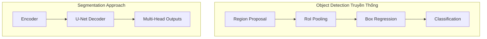
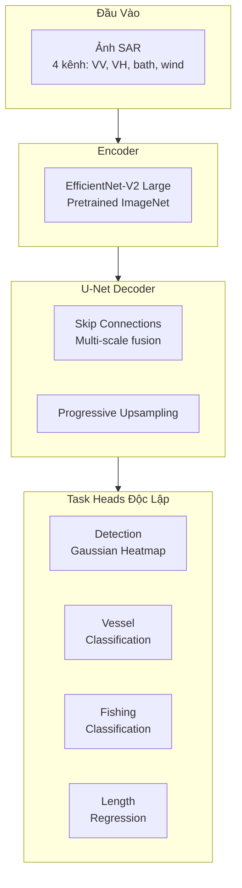
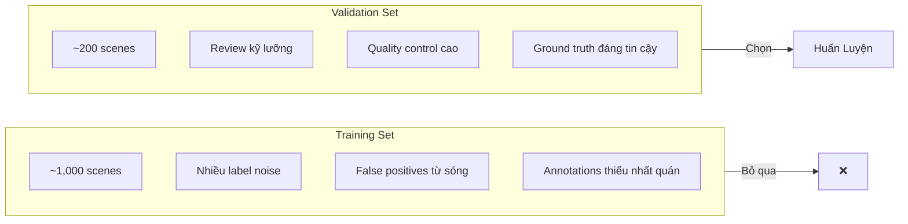
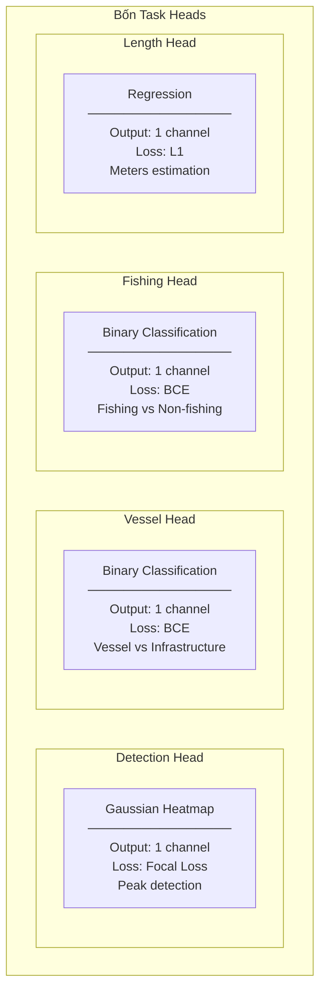
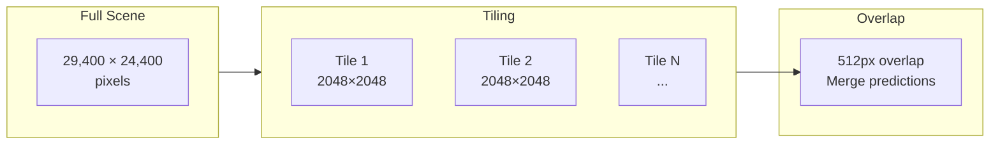
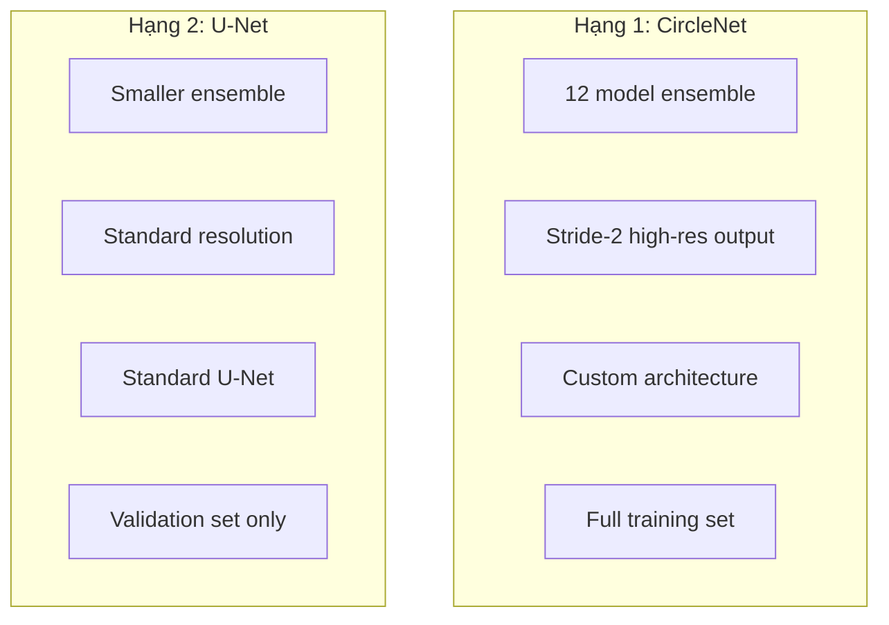

#4.3.3 Giải Pháp Hạng Nhì xView3: Multi-Task Segmentation

## Lời Dẫn

Trong khi giải pháp hạng nhất CircleNet sử dụng kiến trúc tùy biến phức tạp với stride-2 output, giải pháp hạng nhì của Selim Sefidov - người đã đạt hạng nhì trong xView2 trước đó - đi theo hướng đơn giản và thực dụng hơn. Thay vì coi bài toán như object detection truyền thống, Sefidov reformulate thành multi-task segmentation, tận dụng kiến trúc U-Net quen thuộc. Đặc biệt, ông đưa ra quyết định táo bạo: chỉ train trên validation set chất lượng cao thay vì training set lớn nhưng nhiều noise.

| Thuộc tính | Giá trị |
|-----------|---------|
| **Xếp hạng** | 2/1,900+ đội |
| **Tác giả** | Selim Sefidov (selimsef) |
| **Điểm holdout** | 0.604 |
| **Đóng góp chính** | Segmentation paradigm, Data quality > quantity |
| **Kiến trúc** | EfficientNet-V2 + U-Net Decoder |

---

## 1. Paradigm Shift: Detection → Segmentation

### 1.1 Quan Sát Then Chốt

Sefidov nhận ra rằng maritime object detection có thể được reformulate thành bài toán segmentation với dense predictions:

### 1.2 Lợi Ích Của Segmentation

| Khía cạnh | Object Detection | Segmentation |
|-----------|------------------|--------------|
| **Localization** | Box-level | Pixel-level |
| **Multi-task** | Shared head | Independent heads |
| **Context** | Anchor-dependent | Full spatial info |
| **Inference** | Phức tạp | Đơn giản |

---

## 2. Kiến Trúc Mô Hình

### 2.1 Thiết Kế Tổng Thể

### 2.2 Tại Sao EfficientNet-V2

| Backbone | Params | ImageNet Acc | Phù hợp SAR |
|----------|--------|--------------|-------------|
| ResNet-50 | 25M | 76.1% | Tốt |
| EfficientNet-B5 | 30M | 83.6% | Rất tốt |
| **EfficientNet-V2 L** | 118M | **85.7%** | **Xuất sắc** |

EfficientNet-V2 cải thiện đáng kể so với phiên bản gốc nhờ:
- Fused-MBConv trong các stage đầu
- Progressive learning với kích thước ảnh tăng dần
- Regularization scaling

---

## 3. Quyết Định Dữ Liệu Táo Bạo

### 3.1 Data Quality > Quantity

Đây là đóng góp quan trọng nhất của giải pháp. Thay vì dùng toàn bộ training set (~1,000 scenes), Sefidov chỉ train trên validation set (~200 scenes) chất lượng cao:

### 3.2 Lý Do và Kết Quả

| Khía cạnh | Train trên Training Set | Train trên Validation Set |
|-----------|-------------------------|---------------------------|
| **Số lượng** | ~1,000 scenes | ~200 scenes |
| **Chất lượng** | Noise cao | Sạch |
| **Overfitting** | Fit vào noise | Fit vào signal |
| **Generalization** | Kém hơn | **Tốt hơn** |

Kết quả thực nghiệm cho thấy mô hình train trên validation set generalize tốt hơn đáng kể.

---

## 4. Multi-Task Learning

### 4.1 Bốn Task Heads

### 4.2 Loss Weighting

Mỗi task có trọng số loss khác nhau dựa trên độ quan trọng trong scoring:

| Task | Weight | Lý do |
|------|--------|-------|
| Detection | 1.0 | Quan trọng nhất (50% score) |
| Vessel | 0.5 | 20% score |
| Fishing | 0.5 | 20% score |
| Length | 0.2 | 10% score |

---

## 5. Processing Pipeline

### 5.1 Tiling Strategy

Do scene SAR quá lớn (~700M pixels), cần chia thành tiles:

### 5.2 Augmentation

Do đặc thù của SAR, augmentation cần cẩn thận:

| Augmentation | Áp dụng | Lý do |
|--------------|---------|-------|
| Horizontal Flip | ✅ | SAR invariant |
| Vertical Flip | ✅ | SAR invariant |
| Rotation 90° | ✅ | SAR invariant |
| Color jitter | ❌ | SAR có ý nghĩa vật lý |
| Random erasing | ❌ | Có thể xóa targets |

---

## 6. So Sánh Với Hạng Nhất

### 6.1 Kiến Trúc

| Khía cạnh | Hạng 1 (CircleNet) | Hạng 2 (U-Net) |
|-----------|-------------------|----------------|
| **Architecture** | Custom CircleNet | Standard U-Net |
| **Output stride** | Stride-2 | Standard |
| **Complexity** | Cao | Thấp hơn |
| **Reproducibility** | Khó hơn | Dễ hơn |

### 6.2 Chiến Lược

### 6.3 Kết Quả

| Metric | Hạng 1 | Hạng 2 | Gap |
|--------|--------|--------|-----|
| **Holdout Score** | 0.617 | 0.604 | -2.1% |
| **Training Time** | Dài | Ngắn hơn | ~40% |
| **Code Complexity** | Cao | Thấp | Đáng kể |

Với gap chỉ 2.1%, giải pháp đơn giản hơn của Sefidov có trade-off rất tốt giữa performance và complexity.

---

## 7. Bài Học Rút Ra

### 7.1 Cho Nghiên Cứu

1. **Data quality quan trọng hơn quantity**: Validation set nhỏ nhưng sạch tốt hơn training set lớn nhưng nhiễu

2. **Đơn giản có thể hiệu quả**: U-Net tiêu chuẩn với encoder mạnh vẫn competitive

3. **Task-specific heads**: Tách riêng các heads cho phép optimize từng task độc lập

4. **Paradigm shift giúp ích**: Chuyển từ detection sang segmentation mang lại góc nhìn mới

### 7.2 Cho Thực Hành

1. Khi dữ liệu có noise cao, consider train trên subset chất lượng cao

2. U-Net vẫn là lựa chọn baseline rất mạnh cho dense prediction

3. Pretrained ImageNet weights vẫn hữu ích cho SAR dù domain khác biệt

---

## Tài Liệu Tham Khảo

1. Ronneberger, O., Fischer, P., & Brox, T. (2015). U-Net: Convolutional Networks for Biomedical Image Segmentation. MICCAI.

2. Tan, M., & Le, Q. (2021). EfficientNetV2: Smaller Models and Faster Training. ICML.

3. Lin, T. Y., et al. (2017). Focal Loss for Dense Object Detection. ICCV.

---

*Mục tiếp theo sẽ trình bày giải pháp hạng ba với kiến trúc Dual-Model Pipeline và HRNet backbone.*
