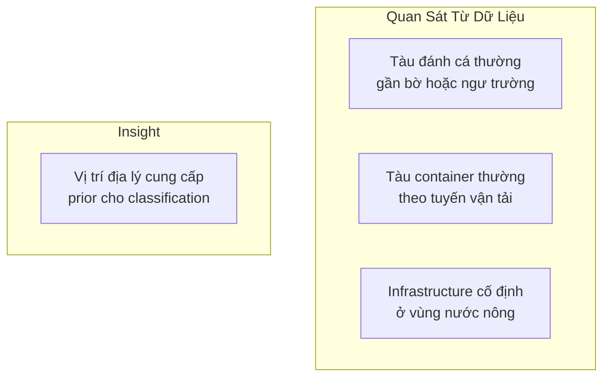
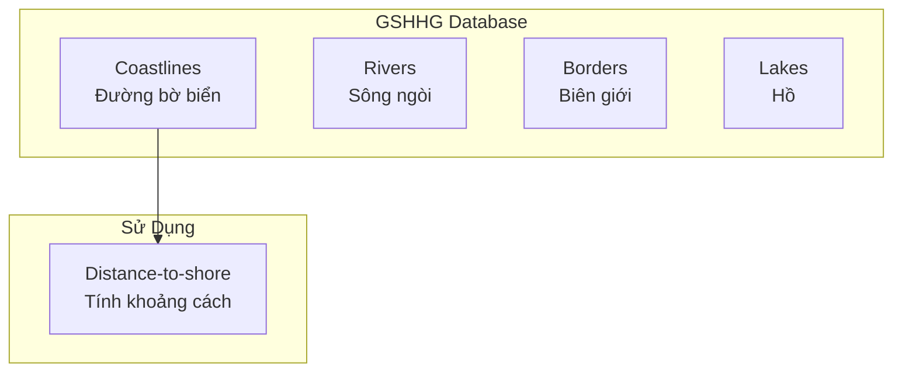
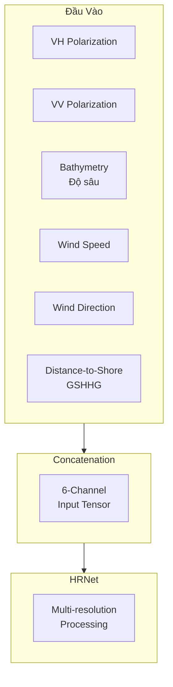
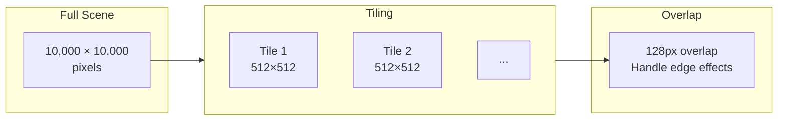
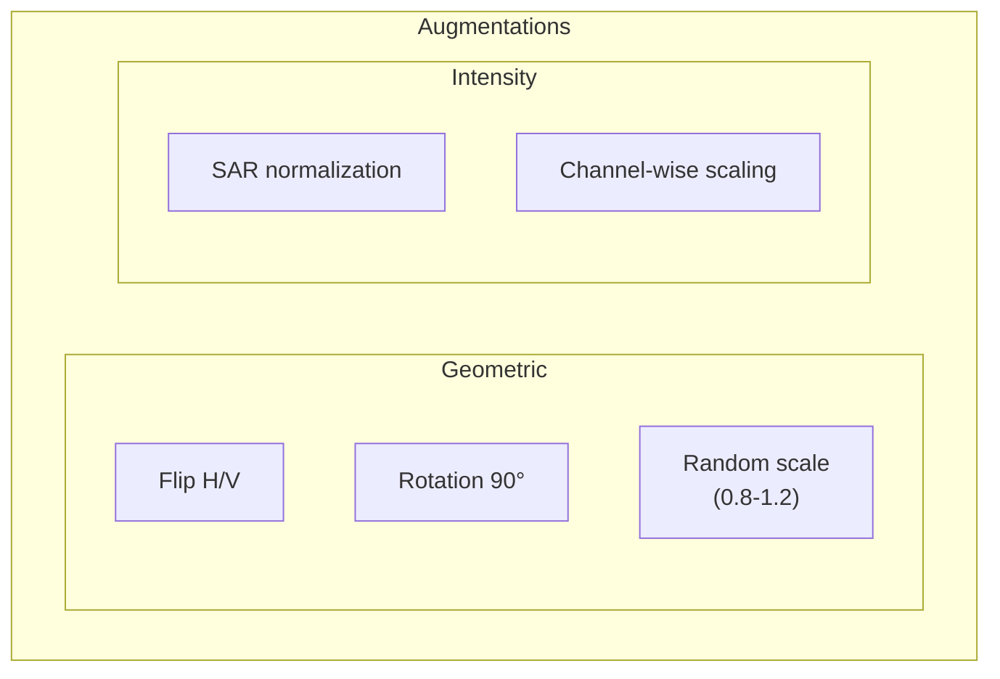
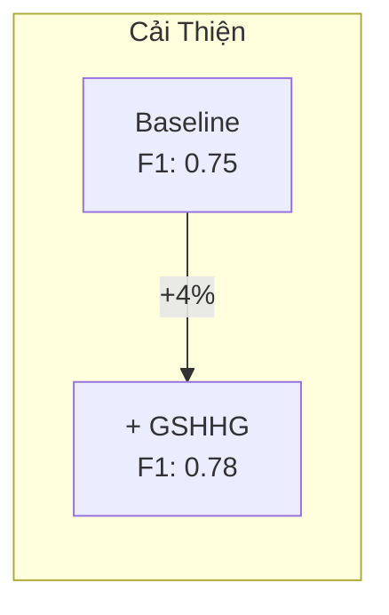
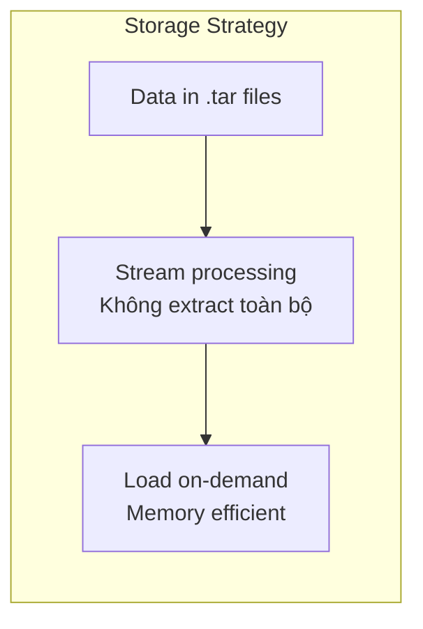
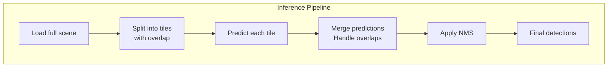
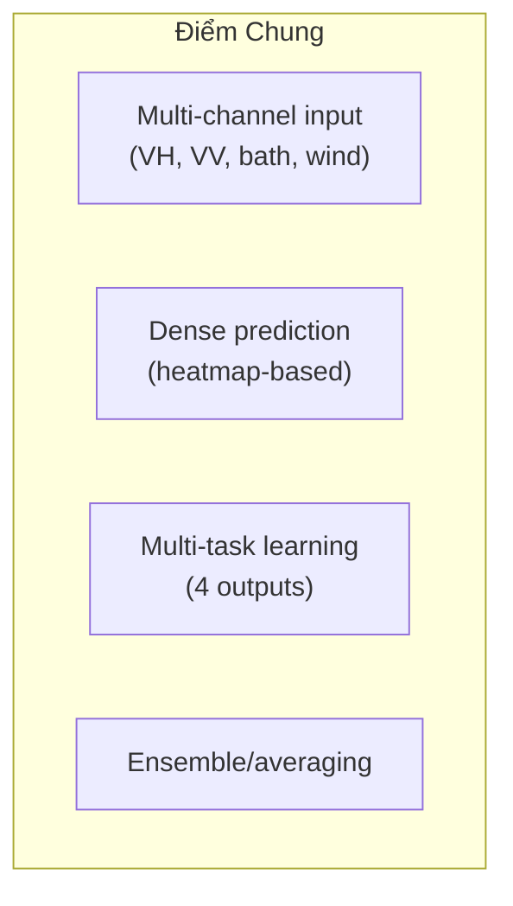

# 6.3.6 Giải Pháp Hạng Năm xView3: Geographic Context và GSHHG

## Lời Dẫn

Giải pháp hạng năm của Kohei (smly) - một Kaggle Master người Nhật - nổi bật với việc tận dụng thông tin ngữ cảnh địa lý. Trong khi các giải pháp khác chủ yếu tập trung vào đặc trưng hình ảnh SAR, Kohei nhận ra rằng vị trí tàu so với bờ biển, độ sâu nước, và các yếu tố địa lý khác cung cấp thông tin quan trọng cho phân loại. Giải pháp sử dụng GSHHG (Global Self-consistent Hierarchical High-resolution Geography) để tính khoảng cách đến bờ, kết hợp với HRNet backbone - một lựa chọn thống nhất với giải pháp hạng ba nhưng được tối ưu khác biệt.

| Thuộc tính | Giá trị |
|-----------|---------|
| **Xếp hạng** | 5/1,900+ đội |
| **Tác giả** | Kohei (smly) |
| **Đóng góp chính** | Geographic context, GSHHG distance-to-shore |
| **Backbone** | HRNet |
| **Hardware** | 2× RTX 3080 |

---

## 1. Insight: Geographic Context Matters

### 1.1 Quan Sát Then Chốt

### 1.2 Các Yếu Tố Địa Lý

| Yếu tố | Ảnh hưởng |
|--------|-----------|
| **Khoảng cách bờ** | Fishing vessels gần bờ hơn |
| **Độ sâu nước** | Oil rigs ở vùng nông |
| **Vùng biển** | Mật độ fishing khác nhau |
| **Tuyến hàng hải** | Container ships theo lane |

---

## 2. GSHHG Database

### 2.1 Global Self-consistent Hierarchical High-resolution Geography

GSHHG là database địa lý độ phân giải cao, cung cấp:

### 2.2 Tính Distance-to-Shore

Với mỗi pixel trong ảnh SAR, tính khoảng cách đến bờ biển gần nhất:

| Khoảng cách | Ý nghĩa |
|-------------|---------|
| < 10 km | Coastal waters |
| 10-50 km | Nearshore |
| 50-200 km | Offshore |
| > 200 km | Deep sea |

---

## 3. Kiến Trúc Mô Hình

### 3.1 Multi-Channel Input

### 3.2 HRNet Configuration

| Component | Specification |
|-----------|---------------|
| **Backbone** | HRNet-W48 |
| **Input channels** | 6 |
| **Resolution branches** | 4 |
| **Output heads** | 4 (det, vessel, fishing, length) |

---

## 4. Training Strategy

### 4.1 Tile-Based Processing

### 4.2 Augmentation Strategy

### 4.3 Loss Functions

| Task | Loss | Weight |
|------|------|--------|
| Detection | Focal Loss | 1.0 |
| is_vessel | Weighted BCE | 0.5 |
| is_fishing | Weighted BCE | 0.5 |
| vessel_length | Smooth L1 | 0.3 |

Class weights được áp dụng do imbalance (90% non-vessel).

---

## 5. Hiệu Quả của Geographic Context

### 5.1 Ablation Study

| Configuration | Detection F1 | Classification Acc |
|---------------|--------------|-------------------|
| SAR only (VH+VV) | 0.72 | 0.78 |
| + Bathymetry | 0.74 | 0.80 |
| + Wind info | 0.75 | 0.80 |
| **+ GSHHG dist** | **0.78** | **0.82** |

### 5.2 Đóng Góp Distance-to-Shore

Distance-to-shore đóng góp 4% F1 improvement, cho thấy giá trị của geographic context.

---

## 6. Tarfile Streaming

### 6.1 Vấn Đề Storage

Dataset xView3 rất lớn (~1.4 TB), gây khó khăn cho storage và data loading.

### 6.2 Giải Pháp

### 6.3 Lợi Ích

| Khía cạnh | Standard | Tarfile Streaming |
|-----------|----------|-------------------|
| **Disk usage** | Extract + Raw | Raw only |
| **I/O overhead** | High (many small files) | Low (sequential reads) |
| **Setup time** | Long (extraction) | Minimal |

---

## 7. Inference Pipeline

### 7.1 Full Scene Processing

### 7.2 Handling Overlap Regions

| Strategy | Overlap pixels | Merge method |
|----------|---------------|--------------|
| **Kohei's approach** | 128 | Max pooling |
| Alternative | 256 | Weighted average |

---

## 8. So Sánh Với Các Giải Pháp Khác

### 8.1 Feature Comparison

| Feature | Hạng 1-4 | **Hạng 5** |
|---------|----------|------------|
| SAR channels | ✅ | ✅ |
| Bathymetry | ✅ | ✅ |
| Wind data | ✅ | ✅ |
| **GSHHG dist** | ❌ | **✅** |
| Geographic context | Minimal | **Emphasized** |

### 8.2 Architecture Comparison

| Khía cạnh | Hạng 3 (Tumenn) | **Hạng 5 (Kohei)** |
|-----------|-----------------|---------------------|
| **Backbone** | HRNet | HRNet |
| **Pipeline** | Dual-model | Single model |
| **Extra features** | Standard | **GSHHG distance** |
| **Focus** | Task separation | Geographic context |

Cả hai đều dùng HRNet nhưng với emphasis khác nhau.

---

## 9. Bài Học Rút Ra

### 9.1 Về Domain Knowledge

1. **Context matters**: Không chỉ pixels, mà còn vị trí địa lý

2. **External data**: GSHHG là external database nhưng hoàn toàn hợp lệ và hữu ích

3. **Prior information**: Geographic priors bổ sung cho learned features

### 9.2 Về Implementation

1. **Efficient data loading**: Tarfile streaming cho large datasets

2. **Multi-channel input**: Combine nhiều nguồn thông tin

3. **HRNet for small objects**: Consistent finding across solutions

### 9.3 Cho Nghiên Cứu Tương Lai

1. **More geographic features**: Shipping lanes, EEZ boundaries, protected areas

2. **Temporal context**: Vessel tracks, historical patterns

3. **Multi-modal fusion**: SAR + AIS + optical

---

## 10. Tổng Kết Các Giải Pháp xView3

### 10.1 So Sánh Top 5

| Hạng | Đóng góp chính | Score |
|------|----------------|-------|
| 1 | CircleNet, Stride-2 output | 0.617 |
| 2 | Segmentation paradigm, Data quality | 0.604 |
| 3 | Dual-model pipeline, HRNet | 0.598 |
| 4 | Self-training, Semi-supervised | 0.591 |
| **5** | **Geographic context, GSHHG** | **0.585** |

### 10.2 Common Themes

### 10.3 Unique Contributions

| Giải pháp | Đóng góp độc đáo |
|-----------|------------------|
| Hạng 1 | Stride-2 for small objects |
| Hạng 2 | Quality > Quantity data |
| Hạng 3 | Detection-Classification separation |
| Hạng 4 | Semi-supervised learning |
| **Hạng 5** | **Geographic context** |

---

## Tài Liệu Tham Khảo

1. Wessel, P., & Smith, W. H. F. (1996). A global, self-consistent, hierarchical, high-resolution shoreline database. JGR.

2. Wang, J., et al. (2020). Deep High-Resolution Representation Learning for Visual Recognition. IEEE PAMI.

3. Paolo, F. S., et al. (2022). xView3-SAR: Detecting Dark Fishing Activity Using SAR Imagery. NeurIPS.

---

*Kết thúc Mục 6.3 về xView3 Challenge. Chương 6 đã trình bày ba cuộc thi lớn trong chuỗi xView, từ object detection (xView1), đến building damage assessment (xView2), và cuối cùng là maritime surveillance (xView3). Mỗi cuộc thi đều đặt ra những thách thức kỹ thuật riêng biệt và thúc đẩy sự phát triển của các phương pháp deep learning cho viễn thám.*
