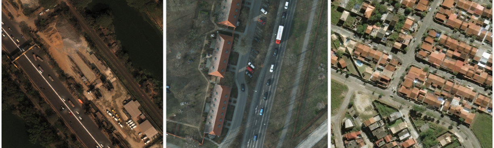
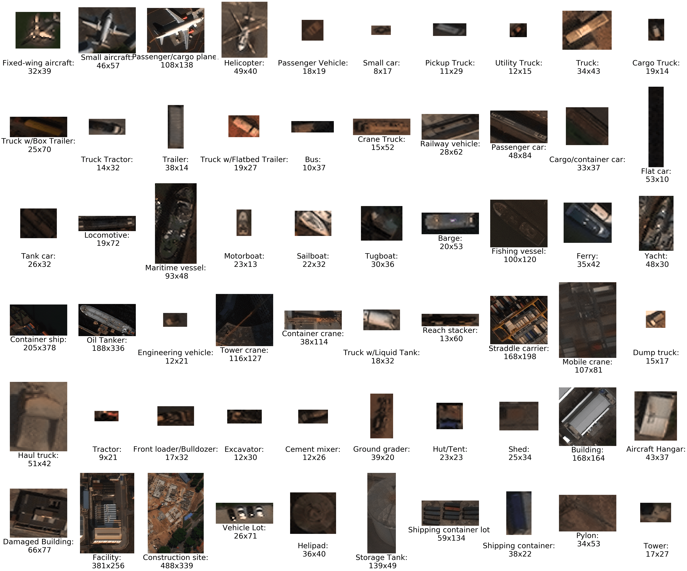
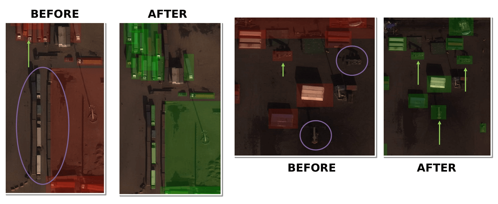
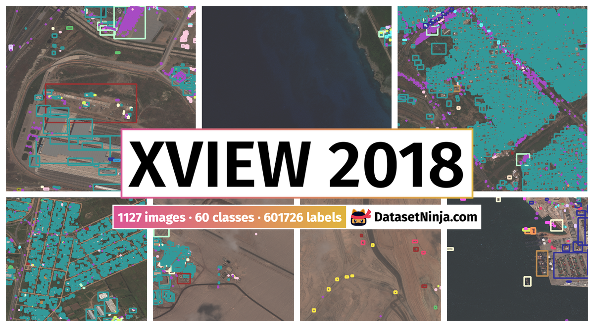

# Chương 6: xView1 Dataset: Phát hiện Đối tượng trong Ảnh Vệ tinh

## Mục lục

1. [Giới thiệu và Bối cảnh](#1-giới-thiệu-và-bối-cảnh)
2. [Thông số Kỹ thuật và Thống kê](#2-thông-số-kỹ-thuật-và-thống-kê)
3. [Hệ thống Phân loại và Annotation](#3-hệ-thống-phân-loại-và-annotation)
4. [Quy trình Tạo Dataset](#4-quy-trình-tạo-dataset)
5. [Thách thức Computer Vision](#5-thách-thức-computer-vision)
6. [Hướng dẫn Sử dụng và Tài nguyên](#6-hướng-dẫn-sử-dụng-và-tài-nguyên)

---

## 1. Giới thiệu và Bối cảnh

### 1.1 Lịch sử Ra đời

xView Dataset được phát triển và công bố vào năm 2018 bởi Defense Innovation Unit (DIU), một tổ chức thuộc Bộ Quốc phòng Hoa Kỳ, phối hợp với National Geospatial-Intelligence Agency (NGA). Sự hợp tác này nhằm giải quyết một vấn đề cấp bách trong lĩnh vực phân tích ảnh vệ tinh: làm thế nào để tự động hóa quá trình phát hiện và phân loại hàng triệu đối tượng trong dữ liệu imagery thu thập mỗi ngày từ các vệ tinh quan sát Trái đất.


*Hình 1: Mẫu ảnh vệ tinh từ WorldView-3 với các đối tượng được phát hiện*

Trước khi xView ra đời, cộng đồng computer vision đã có một số dataset cho object detection trong ảnh tự nhiên như COCO, ImageNet và Pascal VOC. Tuy nhiên, những dataset này được thiết kế cho ảnh chụp từ mặt đất với góc nhìn ngang (ground-level perspective), hoàn toàn khác biệt so với ảnh vệ tinh nhìn từ trên xuống (overhead imagery). Sự khác biệt về góc nhìn này tạo ra những thách thức riêng biệt: đối tượng trong ảnh vệ tinh thường có kích thước rất nhỏ (chỉ vài pixel), xuất hiện với mật độ dày đặc, và thiếu các đặc điểm về texture mà các mô hình deep learning đã học được từ ảnh thông thường.

Nhận thức được khoảng trống này, DIU đã khởi xướng xView Challenge như một cuộc thi công khai với tổng giải thưởng 100,000 USD, thu hút hơn 2,000 người đăng ký từ khắp nơi trên thế giới. Mục tiêu của cuộc thi không chỉ đơn thuần là tìm ra giải pháp kỹ thuật tốt nhất, mà còn thúc đẩy sự phát triển của toàn bộ lĩnh vực overhead imagery analysis thông qua việc cung cấp một benchmark dataset chất lượng cao và miễn phí cho nghiên cứu.

### 1.2 Bối cảnh Ngành Công nghiệp

Ngành công nghiệp quan sát Trái đất (Earth observation) đang trải qua giai đoạn tăng trưởng chưa từng có. Theo các ước tính, khối lượng dữ liệu imagery thu thập từ vệ tinh tăng gấp đôi sau mỗi 18-24 tháng. Các công ty như Maxar Technologies (trước đây là DigitalGlobe), Planet Labs và Airbus Defence and Space vận hành hàng trăm vệ tinh, thu thập hàng petabyte dữ liệu mỗi ngày. Thách thức không còn là việc thu thập dữ liệu mà là làm thế nào để xử lý và phân tích khối lượng thông tin khổng lồ này.

Trong bối cảnh đó, nhu cầu về các giải pháp tự động hóa dựa trên machine learning trở nên cấp thiết. Các ứng dụng tiềm năng bao gồm:

**Giám sát cơ sở hạ tầng:** Theo dõi sự phát triển của đô thị, phát hiện xây dựng trái phép, đánh giá tình trạng đường sá và cầu cống. Với khả năng phát hiện tự động hàng triệu tòa nhà và phương tiện, các chính phủ và doanh nghiệp có thể giám sát những thay đổi trong cơ sở hạ tầng theo thời gian gần thực (near-real-time).

**Ứng phó thảm họa:** Trong các tình huống khẩn cấp như động đất, lũ lụt hay bão, việc nhanh chóng đánh giá thiệt hại là yếu tố sống còn. Object detection có thể giúp xác định các tòa nhà bị hư hại, đường giao thông bị chia cắt, và các khu vực cần hỗ trợ ưu tiên. Đây chính là động lực dẫn đến sự ra đời của xView2 Challenge sau này.

**Nông nghiệp thông minh:** Phát hiện và đếm các thiết bị nông nghiệp, theo dõi hoạt động canh tác, ước tính sản lượng dựa trên phân tích ảnh đa thời gian. Các object như xe tải vận chuyển, máy gặt đập, và kho chứa đều có thể được nhận dạng tự động.

**An ninh hàng hải:** Giám sát hoạt động tàu thuyền, phát hiện đánh bắt bất hợp pháp (IUU fishing), theo dõi vận chuyển container quốc tế. Ứng dụng này được phát triển sâu hơn trong xView3 Challenge.

### 1.3 Tại sao Cần một Dataset Mới

Trước xView, các dataset satellite imagery chủ yếu tập trung vào các nhiệm vụ đơn giản hơn. COWC (Cars Overhead With Context) chỉ có một lớp duy nhất là xe ô tô. DOTA (Dataset for Object Detection in Aerial Images) có 15 lớp nhưng chủ yếu sử dụng ảnh aerial (từ máy bay) thay vì satellite. Các dataset này, mặc dù có giá trị, không phản ánh được độ phức tạp thực sự của việc phân tích imagery vệ tinh trong các ứng dụng thực tế.


*Hình 2: So sánh xView với các dataset khác (COWC, Pascal VOC)*

xView được thiết kế để vượt qua những hạn chế này thông qua bốn đặc điểm chính:

**Quy mô chưa từng có:** Với hơn 1 triệu đối tượng được annotate, xView là dataset object detection lớn nhất trong lĩnh vực overhead imagery tại thời điểm ra mắt. Quy mô này cho phép huấn luyện các mô hình deep learning phức tạp mà không lo vấn đề overfitting.

**Đa dạng về lớp:** 60 lớp đối tượng bao phủ nhiều domain khác nhau từ phương tiện giao thông, tàu thủy, máy bay đến cơ sở hạ tầng và công trình xây dựng. Sự đa dạng này tạo ra thách thức fine-grained classification thực sự, yêu cầu mô hình phải phân biệt được những object có hình dạng và kích thước tương tự nhau.

**Độ phân giải cao:** Ảnh từ vệ tinh WorldView-3 với Ground Sample Distance (GSD) 0.3 mét nghĩa là mỗi pixel đại diện cho 30 cm × 30 cm trên mặt đất. Độ phân giải này cho phép phát hiện các đối tượng nhỏ như xe ô tô, container vận chuyển, và thậm chí các chi tiết nhỏ của máy bay.

**Phủ địa lý đa dạng:** Dataset bao gồm ảnh từ nhiều khu vực địa lý khác nhau trên toàn cầu, đảm bảo mô hình được huấn luyện có khả năng generalize tốt thay vì chỉ học được các đặc điểm cụ thể của một vùng.

### 1.4 Cuộc thi xView Detection Challenge

DIUx xView 2018 Detection Challenge được tổ chức từ tháng 3 đến tháng 8 năm 2018. Cuộc thi thu hút 2,000+ bài đăng ký từ các nhà nghiên cứu, công ty công nghệ, và các đội ngũ học thuật từ khắp nơi trên thế giới. Đây là một trong những cuộc thi computer vision quy mô lớn đầu tiên tập trung vào overhead imagery.

**Cấu trúc giải thưởng:**
- Giải nhất: 40,000 USD
- Giải nhì: 25,000 USD
- Giải ba: 15,000 USD
- Giải tư: 12,000 USD
- Giải năm: 8,000 USD

Ngoài giải thưởng tiền mặt, những người chiến thắng còn được mời trình bày tại các hội nghị và có cơ hội hợp tác với các tổ chức quốc phòng và tình báo.

Metric đánh giá chính của cuộc thi là mean Average Precision (mAP) với IoU threshold 0.5, tính trung bình trên tất cả 60 lớp. Điều này đặt ra thách thức đặc biệt vì các lớp hiếm (rare classes) có ảnh hưởng bằng các lớp phổ biến trong điểm số cuối cùng, buộc các đội phải cân bằng giữa việc tối ưu cho các lớp dễ và khó.

### 1.5 Tác động đến Cộng đồng Nghiên cứu

Kể từ khi phát hành, xView đã trở thành benchmark tiêu chuẩn cho nghiên cứu object detection trong overhead imagery. Bài báo gốc "xView: Objects in Context in Overhead Imagery" đã được trích dẫn hàng trăm lần, và dataset được sử dụng trong vô số nghiên cứu học thuật cũng như ứng dụng công nghiệp.

Một số đóng góp quan trọng từ xView Challenge bao gồm:

**Reduced Focal Loss:** Giải pháp chiến thắng của Nikolay Sergievskiy đã giới thiệu một biến thể cải tiến của Focal Loss, giải quyết vấn đề class imbalance một cách hiệu quả hơn. Kỹ thuật này sau đó được áp dụng rộng rãi trong các bài toán detection với phân bố lớp không đều.

**Multi-scale Detection Strategies:** Các giải pháp top đã phát triển nhiều chiến lược tinh vi để phát hiện đối tượng ở nhiều tỷ lệ khác nhau trong cùng một ảnh, từ xe ô tô nhỏ vài pixel đến các tòa nhà công nghiệp lớn.

**Ensemble Methods:** Việc kết hợp nhiều mô hình với các backbone và cấu hình khác nhau đã chứng minh là cách tiếp cận hiệu quả để đạt được performance cao nhất, một bài học được áp dụng trong nhiều cuộc thi computer vision sau này.

### 1.6 Các Công trình Khoa học Liên quan

xView dataset đã được sử dụng làm benchmark trong nhiều nghiên cứu quan trọng:

**YOLT (You Only Look Twice):** Một trong những framework đầu tiên được thiết kế đặc biệt cho object detection trong satellite imagery, sử dụng xView làm test bed chính.

**DOTA-based Methods:** Nhiều phương pháp phát triển cho DOTA dataset đã được evaluate trên xView để chứng minh khả năng generalization.

**Transfer Learning Studies:** xView thường được sử dụng để nghiên cứu khả năng transfer learning từ các mô hình pretrained trên ImageNet sang domain overhead imagery.

---

## 2. Thông số Kỹ thuật và Thống kê

### 2.1 Nguồn Ảnh Vệ tinh

Toàn bộ ảnh trong xView dataset được thu thập từ vệ tinh WorldView-3, một trong những vệ tinh quan sát Trái đất thương mại tiên tiến nhất thế giới, được vận hành bởi Maxar Technologies (trước đây là DigitalGlobe).

**Thông số kỹ thuật của WorldView-3:**

WorldView-3 được phóng vào ngày 13 tháng 8 năm 2014 từ căn cứ không quân Vandenberg, California. Vệ tinh bay ở độ cao 617 km trong quỹ đạo đồng bộ mặt trời (sun-synchronous orbit), cho phép thu thập ảnh với điều kiện chiếu sáng nhất quán trên toàn cầu.

Khả năng chụp ảnh của WorldView-3 bao gồm ba loại sensor khác nhau:

**Panchromatic sensor:** Cung cấp ảnh đen trắng với độ phân giải 0.31 mét tại nadir (góc nhìn thẳng đứng). Đây là loại ảnh có độ phân giải cao nhất, được sử dụng chủ yếu trong xView.

**Multispectral sensor:** Thu thập ảnh trong 8 băng phổ (coastal, blue, green, yellow, red, red edge, NIR1, NIR2) với độ phân giải 1.24 mét. Thông tin đa phổ này hữu ích cho việc phân loại land cover và phân tích thực vật.

**SWIR sensor:** Đây là tính năng độc đáo của WorldView-3, cung cấp 8 băng shortwave infrared với độ phân giải 3.7 mét. SWIR đặc biệt hữu ích cho việc phát hiện khoáng sản và phân tích địa chất.

Trong xView dataset, chủ yếu sử dụng ảnh panchromatic và multispectral. Độ phân giải 0.3 mét GSD có nghĩa là mỗi pixel trong ảnh đại diện cho một diện tích 30 cm × 30 cm trên mặt đất. Với độ phân giải này, một chiếc xe ô tô tiêu chuẩn dài khoảng 4.5 mét sẽ có kích thước khoảng 15 × 5 pixel trong ảnh.

### 2.2 Ground Sample Distance và Ý nghĩa

Ground Sample Distance (GSD) là một khái niệm quan trọng trong remote sensing, chỉ khoảng cách trên mặt đất giữa tâm của hai pixel liền kề. GSD phụ thuộc vào nhiều yếu tố: độ cao bay của vệ tinh, đặc tính sensor, và góc chụp.

GSD 0.3 mét của xView dataset đặt nó vào nhóm Very High Resolution (VHR) imagery, cho phép phát hiện các đối tượng nhỏ nhất trong các ứng dụng dân sự. Để so sánh:

- **Sentinel-2 (ESA):** 10-60 mét GSD - phù hợp cho monitoring land cover ở quy mô lớn
- **Landsat-8 (NASA):** 15-30 mét GSD - tiêu chuẩn cho nghiên cứu môi trường
- **Planet SkySat:** 0.5-0.8 mét GSD - high resolution nhưng kém hơn WorldView-3
- **WorldView-3:** 0.31 mét GSD - highest commercial resolution tại thời điểm xView ra mắt

Độ phân giải cao của xView cho phép nhận diện các object nhỏ như:
- Xe ô tô cá nhân (3-5 mét): ~10-15 pixels
- Xe container/truck (10-20 mét): ~30-60 pixels
- Máy bay nhỏ (15-20 mét): ~50-70 pixels
- Container vận chuyển (12 mét): ~40 pixels

### 2.3 Phân bố Địa lý

xView dataset bao gồm ảnh từ nhiều khu vực địa lý khác nhau trên toàn cầu, được lựa chọn có chủ đích để đảm bảo tính đa dạng về:


*Hình 3: Bản đồ phân bố địa lý của xView dataset*

**Khí hậu và môi trường:** Dataset bao gồm các khu vực đô thị, ngoại ô, nông thôn, công nghiệp, hàng hải, và sa mạc. Sự đa dạng này đảm bảo mô hình học được các đặc điểm invariant với background thay vì chỉ nhớ các pattern cụ thể của một loại địa hình.

**Điều kiện ánh sáng:** Ảnh được thu thập ở nhiều thời điểm khác nhau trong ngày, với góc mặt trời và điều kiện bóng đổ khác nhau. Điều này quan trọng vì bóng của object có thể chiếm diện tích lớn hơn cả object đó trong ảnh vệ tinh.

**Mật độ object:** Một số ảnh chứa hàng nghìn object (ví dụ: bãi đỗ xe, cảng container), trong khi những ảnh khác chỉ có vài chục object (khu vực nông thôn). Sự biến thiên này yêu cầu mô hình phải hoạt động tốt trong cả hai scenario.

Tổng diện tích phủ của dataset là khoảng 1,400 km², một con số ấn tượng cho một dataset với annotation chi tiết ở mức instance. Để so sánh, diện tích này tương đương với một thành phố lớn như London hoặc Los Angeles.

### 2.4 Thống kê Chi tiết về Đối tượng

Dataset chứa hơn 1,000,000 object instances được annotate thủ công, phân bố trên 60 lớp khác nhau. Tuy nhiên, phân bố này rất không đều, tạo ra một trong những thách thức chính của bài toán.


*Hình 4a: Phân bố số lượng đối tượng theo từng lớp*


*Hình 4b: Phân bố kích thước pixel của các đối tượng*

**Phân tích class distribution:**

Hai lớp chiếm ưu thế là "Small Car" và "Building", mỗi lớp có khoảng 200,000-300,000 instances, chiếm tổng cộng khoảng 50% toàn bộ dataset. Đây là điều dễ hiểu vì xe ô tô và tòa nhà là những object phổ biến nhất trong môi trường đô thị.

Ở cực đối lập, các lớp như "Railway Locomotive", "Tower", và một số loại máy bay quân sự chỉ có vài chục đến vài trăm instances. Tỷ lệ chênh lệch giữa lớp lớn nhất và nhỏ nhất có thể lên đến 3000:1, tạo ra thách thức class imbalance nghiêm trọng.

**Phân tích kích thước object:**

Kích thước object trong xView có sự biến thiên rất lớn:
- **Smallest objects (3-10 pixels):** Xe ô tô nhỏ, một số container
- **Small objects (10-30 pixels):** Phần lớn phương tiện, thuyền nhỏ
- **Medium objects (30-100 pixels):** Máy bay, xe tải lớn, tòa nhà nhỏ
- **Large objects (100+ pixels):** Tàu container, nhà máy, hangar

Sự biến thiên kích thước này yêu cầu các mô hình phải có khả năng multi-scale detection, một thách thức mà các kiến trúc như Feature Pyramid Network (FPN) được thiết kế để giải quyết.

### 2.5 So sánh với Các Dataset Khác

Để hiểu rõ vị thế của xView trong hệ sinh thái các dataset overhead imagery, cần so sánh với các dataset quan trọng khác:


*Hình 5: So sánh xView với COWC và SpaceNet về quy mô và đa dạng*

**DOTA (Dataset for Object Detection in Aerial Images):**
DOTA có 2,806 ảnh với 188,000 instances trong 15 lớp. Mặc dù có số lượng ảnh lớn hơn, tổng số object và độ đa dạng lớp đều kém hơn xView. DOTA sử dụng oriented bounding box (OBB) thay vì horizontal bounding box (HBB) như xView, phù hợp hơn cho các object dài và hẹp như tàu và máy bay.

**DIOR (Object Detection in Optical Remote Sensing Images):**
DIOR có 23,463 ảnh với 192,000 instances trong 20 lớp. Dataset này có độ phân giải đa dạng hơn (0.5-30 mét GSD) nhưng mật độ object thấp hơn nhiều so với xView.

**iSAID (Instance Segmentation in Aerial Images Dataset):**
iSAID cung cấp instance segmentation masks thay vì chỉ bounding box, là bước tiến về độ chi tiết annotation. Tuy nhiên, quy mô nhỏ hơn xView đáng kể.

**FAIR1M (Fine-grained Object Recognition in Aerial Images):**
FAIR1M tập trung vào fine-grained recognition với 37 lớp, phù hợp cho các bài toán yêu cầu phân biệt chi tiết giữa các subclass.

xView vẫn giữ vị trí độc đáo với sự kết hợp của: số lượng object lớn nhất, độ phân giải cao nhất, và số lớp đa dạng nhất trong các dataset công khai tại thời điểm phát hành.

---

## 3. Hệ thống Phân loại và Annotation

### 3.1 Taxonomy và Thiết kế Phân loại

Hệ thống phân loại của xView được thiết kế cẩn thận với 60 lớp, tổ chức thành 7 danh mục cha (parent categories). Cấu trúc phân cấp này không chỉ giúp tổ chức dữ liệu mà còn phản ánh các mối quan hệ ngữ nghĩa giữa các object.


*Hình 6: Ví dụ về tất cả 60 lớp đối tượng trong xView dataset*

**Fixed-Wing Aircraft (7 lớp):**
Danh mục máy bay bao gồm các lớp: Small Aircraft, Cargo Plane, Helicopter, Passenger/Cargo Plane, Fighter Jet, Bomber, và Other Aircraft. Việc phân biệt giữa các loại máy bay là một thách thức fine-grained classification điển hình vì chúng có hình dạng tương tự nhau khi nhìn từ trên xuống.

**Passenger Vehicle (5 lớp):**
Bao gồm Small Car, Bus, Pickup Truck, Utility Truck, và Van. Đây là danh mục có số lượng instance lớn nhất trong dataset, đặc biệt là lớp Small Car. Thách thức chính là phân biệt giữa các loại xe có kích thước tương đương.

**Truck (8 lớp):**
Danh mục này bao gồm các loại xe tải và thiết bị vận chuyển: Cargo Truck, Truck with Box, Truck with Flatbed, Truck with Liquid Tank, Crane Truck, Railway Locomotive, Railway Car, và Freight Car. Việc bao gồm cả railway vehicle trong danh mục truck là một quyết định thiết kế thú vị.

**Maritime Vessel (10 lớp):**
Với 10 lớp khác nhau, danh mục tàu thủy là một trong những phức tạp nhất: Motorboat, Sailboat, Tugboat, Barge, Fishing Vessel, Ferry, Yacht, Container Ship, Oil Tanker, và Engineering Vessel. Các tàu có thể có kích thước từ vài mét (motorboat) đến hàng trăm mét (container ship).

**Engineering Vehicle (10 lớp):**
Bao gồm các thiết bị xây dựng và cơ sở hạ tầng: Tower, Cooling Tower, Solar Panel, Storage Tank, Shipping Container, Shipping Container Lot, Pylon, Tower Crane, Container Crane, và Reach Stacker. Nhiều object trong danh mục này có hình dạng đặc trưng rõ ràng.

**Building/Facility (15 lớp):**
Đây là danh mục đa dạng nhất với các loại công trình và cơ sở: Damaged Building, Facility, Construction Site, Vehicle Lot, Helipad, Runway, Taxiway, và Hangar. Lớp "Damaged Building" đặc biệt thú vị vì nó đặt nền móng cho xView2 Challenge sau này.

### 3.2 Định dạng Annotation

xView sử dụng horizontal bounding box (HBB) làm định dạng annotation chính. Mỗi object được biểu diễn bằng bốn tọa độ (xmin, ymin, xmax, ymax) trong hệ tọa độ ảnh, với origin ở góc trên bên trái.


*Hình 7: Ví dụ về định dạng annotation với bounding boxes*

**Ưu điểm của HBB:**
Horizontal bounding box là định dạng đơn giản nhất, dễ annotate và dễ sử dụng trong training. Hầu hết các framework object detection đều hỗ trợ HBB một cách native, từ YOLO đến Faster R-CNN.

**Nhược điểm của HBB:**
Với các object dài và hẹp có orientation nghiêng so với trục ảnh (như máy bay, tàu, xe đầu kéo), HBB không bao quát chính xác hình dạng object. Một chiếc máy bay nghiêng 45 độ sẽ có HBB chứa nhiều background pixels hơn object pixels thực sự.

Đây là lý do tại sao một số dataset khác như DOTA chọn sử dụng oriented bounding box (OBB), cho phép box xoay theo hướng của object. Tuy nhiên, OBB làm tăng độ phức tạp của annotation và training.

**Cấu trúc file annotation:**

xView sử dụng định dạng GeoJSON, một chuẩn mở cho dữ liệu địa lý. Mỗi object là một Feature với các properties sau:

- `bounds_imcoords`: Tọa độ bounding box dưới dạng string "xmin,ymin,xmax,ymax"
- `type_id`: ID số nguyên xác định lớp object (từ 11 đến 94)
- `image_id`: Tên file ảnh chứa object này
- `geometry`: Polygon coordinates (5 điểm tạo thành hình chữ nhật đóng)

Việc sử dụng GeoJSON thay vì các định dạng như COCO JSON hoặc Pascal VOC XML là một lựa chọn phù hợp với bản chất geospatial của dữ liệu, cho phép tích hợp dễ dàng với các công cụ GIS như QGIS.

### 3.3 Class ID Mapping

Hệ thống Class ID trong xView được thiết kế với các dải số riêng biệt cho từng danh mục:

| Dải ID | Danh mục | Số lớp |
|--------|----------|--------|
| 11-17 | Fixed-Wing Aircraft | 7 |
| 18-23 | Passenger Vehicle | 5 |
| 24-28 | Truck | 5 |
| 29-34 | Railway Vehicle | 6 |
| 35-49 | Maritime Vessel | 15 |
| 50-59 | Engineering Vehicle | 10 |
| 60-94 | Building/Facility | 35 |

Lưu ý rằng các ID không bắt đầu từ 0 hoặc 1, và có một số gap trong dải số. Điều này có thể do quá trình phát triển taxonomy hoặc để dự phòng cho việc mở rộng trong tương lai.

Khi preprocessing data cho training, thông thường cần remap các ID này về dải liên tục 0-59 để phù hợp với các framework deep learning.

### 3.4 Các Trường hợp Khó Phân loại

Quá trình annotation gặp nhiều tình huống mơ hồ cần có hướng dẫn rõ ràng:

**Occlusion (che khuất):**
Khi một object bị che một phần bởi object khác (ví dụ: xe đỗ dưới mái che), chỉ phần visible được annotate. Điều này dẫn đến một số bounding box có kích thước nhỏ bất thường so với kích thước thực của object.

**Shadow handling:**
Bóng của object không được bao gồm trong bounding box. Tuy nhiên, đối với các object cao như tower hoặc crane, bóng có thể dài hơn nhiều so với chiều cao của object trong ảnh, gây khó khăn cho việc xác định ranh giới chính xác.

**Partially visible objects:**
Các object bị cắt bởi edge của ảnh được annotate nếu ít nhất 50% diện tích visible. Quy tắc này đảm bảo mô hình học được cách xử lý các object không hoàn chỉnh.

**Fine-grained ambiguity:**
Phân biệt giữa "Cargo Plane" và "Passenger/Cargo Plane" hoặc giữa "Fishing Vessel" và "Motorboat" đôi khi không thể xác định chỉ từ ảnh overhead. Trong những trường hợp này, annotator được hướng dẫn sử dụng context (vị trí, khu vực xung quanh) hoặc chọn lớp general hơn.

---

## 4. Quy trình Tạo Dataset

### 4.1 Thu thập và Lựa chọn Ảnh

Quy trình tạo xView dataset bắt đầu với việc thu thập và lựa chọn ảnh từ archive của WorldView-3. Đây là một bước quan trọng vì chất lượng và đa dạng của ảnh gốc sẽ quyết định giá trị của dataset cuối cùng.

**Tiêu chí lựa chọn ảnh:**

Chất lượng kỹ thuật là yếu tố đầu tiên được xem xét. Ảnh phải đạt các tiêu chuẩn sau: không có cloud cover vượt quá ngưỡng cho phép (thường là dưới 10%), không bị haze hay atmospheric interference nghiêm trọng, không có các artifact kỹ thuật như striping hay sensor noise.

Độ đa dạng địa lý được đảm bảo thông qua việc lựa chọn có chủ đích các khu vực đại diện cho nhiều loại môi trường: đô thị mật độ cao, ngoại ô, khu công nghiệp, cảng biển, sân bay, và khu vực nông thôn. Sự đa dạng này giúp mô hình học được các pattern invariant với background.

Mật độ object là một tiêu chí quan trọng khác. Dataset cần bao gồm cả các scene có mật độ object rất cao (bãi đỗ xe, cảng container) và các scene thưa thớt hơn. Điều này đảm bảo mô hình hoạt động tốt trong nhiều scenario khác nhau.

**Preprocessing ảnh:**

Sau khi được lựa chọn, ảnh gốc trải qua nhiều bước preprocessing. Orthorectification được thực hiện để hiệu chỉnh biến dạng do góc chụp và địa hình. Atmospheric correction giúp loại bỏ ảnh hưởng của khí quyển đến giá trị pixel. Pansharpening kết hợp độ phân giải cao của panchromatic band với thông tin màu từ multispectral bands.

### 4.2 Công cụ và Quy trình Annotation

xView sử dụng QGIS (Quantum Geographic Information System) làm công cụ annotation chính. QGIS là phần mềm mã nguồn mở mạnh mẽ cho GIS, cho phép làm việc với các định dạng geospatial và tích hợp tốt với workflow annotation.


*Hình 8: Quy trình annotation sử dụng QGIS*

**Tại sao chọn QGIS:**

QGIS hỗ trợ native các định dạng ảnh GeoTIFF và metadata geospatial, cho phép annotator làm việc trực tiếp với dữ liệu gốc mà không cần chuyển đổi. Khả năng zoom mượt mà và pan nhanh chóng trên ảnh lớn (hàng chục nghìn pixel mỗi chiều) là yếu tố quan trọng cho efficiency của annotator.

Plugin ecosystem của QGIS cho phép customize workflow annotation. Các plugin như Semi-Automatic Classification Plugin và custom scripts có thể hỗ trợ annotator trong việc phát hiện object tiềm năng.

**Quy trình annotation step-by-step:**

Annotator bắt đầu bằng việc load ảnh cần annotate vào QGIS project. Một layer vector mới được tạo để chứa các polygon bounding box. Annotator sử dụng công cụ vẽ polygon để tạo hình chữ nhật xung quanh mỗi object nhìn thấy được.

Sau khi vẽ bounding box, annotator gán class label từ dropdown menu hoặc nhập class ID. Metadata bổ sung như confidence level và notes cũng có thể được ghi lại.

Quá trình này được lặp lại cho tất cả các object trong ảnh. Với mật độ object cao trong nhiều scene, một ảnh đơn lẻ có thể chứa hàng nghìn object cần annotate, đòi hỏi nhiều giờ làm việc tập trung.

### 4.3 Quality Control Ba Giai đoạn

Để đảm bảo chất lượng annotation, xView triển khai hệ thống quality control ba giai đoạn nghiêm ngặt.


*Hình 9: Quy trình kiểm soát chất lượng ba giai đoạn*

**Giai đoạn 1: Supervisor Review**

Trong giai đoạn đầu tiên, supervisor sẽ review ngẫu nhiên một phần công việc của mỗi annotator. Tỷ lệ review thường là 10-20% tổng số object được annotate. Supervisor kiểm tra các lỗi phổ biến như: bounding box quá loose hoặc quá tight, miss-classification, bỏ sót object, và annotation các object không thuộc taxonomy.

Kết quả review được feedback trực tiếp cho annotator để cải thiện. Annotator có performance thấp có thể được yêu cầu retrain hoặc reassign sang các task đơn giản hơn.

**Giai đoạn 2: Cross-validation**

Giai đoạn này tận dụng sức mạnh của crowd-sourcing để phát hiện lỗi. Mỗi ảnh được annotate độc lập bởi nhiều annotator (thường là 2-3 người). Các annotation được so sánh để tìm inconsistency.

Khi hai annotator có disagreement về class của một object hoặc về việc object có tồn tại hay không, case đó được flag để review bởi senior annotator. Inter-annotator agreement (IOU) được tính toán và theo dõi để đánh giá consistency của annotation guidelines.

**Giai đoạn 3: Gold Standard Validation**

Một subset nhỏ của dataset được annotate bởi các domain expert với độ chính xác cao nhất có thể, tạo thành gold standard. Gold standard này được sử dụng để:
- Đo lường accuracy của annotator thông thường
- Training và calibrating annotator mới
- Benchmark cho các experiment về annotation quality

Expert annotator là những người có kinh nghiệm trong việc phân tích ảnh vệ tinh, thường có background trong remote sensing hoặc geospatial intelligence. Họ có thể sử dụng context và domain knowledge để resolve các ambiguous cases mà annotator thông thường gặp khó khăn.

### 4.4 Xử lý Edge Cases

Quá trình annotation gặp nhiều edge cases cần xử lý cẩn thận:

**Dense clusters:** Trong các khu vực như bãi đỗ xe hoặc cảng container, các object có thể touching hoặc overlapping. Annotation guidelines quy định rằng mỗi individual object phải có bounding box riêng, không gộp các object liền kề.

**Partially visible objects:** Đối với các object bị cắt bởi image boundary, chỉ annotate nếu có thể xác định được class với độ tin cậy cao. Bounding box chỉ bao gồm phần visible trong ảnh.

**Ambiguous objects:** Khi không thể xác định class cụ thể (ví dụ: phân biệt sedan và SUV), annotator được hướng dẫn sử dụng lớp general hơn trong hierarchy (sử dụng "Small Car" thay vì cố gắng phân biệt sub-type).

**Construction and temporary objects:** Các object đang trong quá trình xây dựng hoặc temporary (như xe cẩu tại construction site) được annotate với class phù hợp nhất dựa trên trạng thái hiện tại.

### 4.5 Resources và Timeline

Việc tạo xView dataset đòi hỏi resources đáng kể về nhân lực và thời gian:

**Nhân lực:**
- Đội ngũ annotator chuyên nghiệp (ước tính 20-50 người)
- Supervisors và senior annotators
- Domain experts cho gold standard
- Kỹ sư phần mềm cho tool development
- Project managers để coordinate

**Thời gian ước tính:**
- Setup và training: 2-4 tuần
- Annotation chính: 3-6 tháng
- Quality control và revision: 1-2 tháng
- Finalization và release: 2-4 tuần

Tổng thời gian từ khi bắt đầu đến khi release dataset có thể lên đến 8-12 tháng, không tính thời gian thu thập và preprocessing ảnh.

---

## 5. Thách thức Computer Vision

### 5.1 Multi-scale Object Detection

Một trong những thách thức đặc trưng nhất của xView là sự biến thiên cực lớn về kích thước object. Trong cùng một ảnh, mô hình phải phát hiện được cả những chiếc xe ô tô chỉ 3-5 pixel và những con tàu container dài hàng trăm pixel.

**Phân tích kỹ thuật:**

Các detector truyền thống như SSD và YOLO gốc được thiết kế với assumption rằng object có kích thước tương đối đồng nhất. Feature maps ở các resolution khác nhau được sử dụng để detect object ở các scale khác nhau, nhưng thường chỉ cover một dải kích thước hạn chế.

Trong xView, dải kích thước này span hơn 2 bậc magnitude (từ 3 đến 300+ pixel), vượt quá khả năng xử lý hiệu quả của một feature map đơn lẻ. Object nhỏ như xe ô tô có thể hoàn toàn biến mất sau vài lớp pooling trong deep network.

**Các giải pháp đã được áp dụng:**

Feature Pyramid Network (FPN) trở thành thành phần tiêu chuẩn trong các giải pháp top. FPN xây dựng một pyramid của feature maps với semantic information được propagate từ deep layers xuống shallow layers thông qua lateral connections. Điều này cho phép detect object ở nhiều scale trong khi vẫn preserve high-resolution features.

Multi-scale training và inference cũng được sử dụng rộng rãi. Ảnh được resize đến nhiều scale khác nhau trong training để mô hình học được scale-invariant features. Trong inference, prediction từ nhiều scale được aggregate để cải thiện recall.

Image tiling là một kỹ thuật practical khác. Thay vì xử lý toàn bộ ảnh lớn (thường vượt quá memory GPU), ảnh được chia thành các tile nhỏ hơn với overlap. Detection được chạy trên từng tile và kết quả được merge bằng Non-Maximum Suppression (NMS).

### 5.2 Class Imbalance

Vấn đề class imbalance trong xView là một trong những nghiêm trọng nhất trong các dataset object detection công khai. Với tỷ lệ 3000:1 giữa lớp phổ biến nhất và hiếm nhất, các phương pháp training tiêu chuẩn gần như chắc chắn thất bại.

**Tại sao class imbalance là vấn đề:**

Trong training với standard cross-entropy loss, gradient được dominated bởi các lớp có nhiều sample. Mô hình học được pattern của "Small Car" và "Building" rất tốt, nhưng hầu như không học được gì về "Railway Locomotive" hay "Fighter Jet" vì contribution của chúng vào tổng loss quá nhỏ.

Vấn đề càng trầm trọng khi evaluation metric là mean Average Precision (mAP), tính trung bình AP của tất cả các lớp với weight bằng nhau. Một mô hình đạt 95% AP trên hai lớp lớn nhất nhưng 0% trên tất cả các lớp còn lại sẽ có mAP rất thấp.

**Các giải pháp được sử dụng:**

Focal Loss, được giới thiệu ban đầu cho object detection trong paper RetinaNet, là một giải pháp phổ biến. Focal Loss down-weight các easy examples (thường là negative samples và các lớp phổ biến) để mô hình focus vào hard examples và rare classes.

Reduced Focal Loss, giải pháp của người chiến thắng xView Challenge, là một variant cải tiến của Focal Loss. Ý tưởng là giảm thêm weight của các samples đã được classify đúng với high confidence, cho phép mô hình tập trung hơn vào các challenging cases.

Class weighting trong loss function là approach trực tiếp hơn: weight của mỗi class được set inversely proportional với frequency của nó. Lớp hiếm nhận weight cao hơn để contribution vào loss tương đương với lớp phổ biến.

Oversampling và undersampling là các kỹ thuật data-level. Oversampling tạo thêm training examples cho rare classes (thông qua augmentation hoặc copy), trong khi undersampling giảm số lượng examples của common classes.

### 5.3 Fine-grained Classification

80% các lớp trong xView được coi là fine-grained, nghĩa là chúng yêu cầu phân biệt giữa các object có visual appearance rất tương tự nhau.

**Các ví dụ điển hình:**

Trong danh mục Aircraft: phân biệt "Cargo Plane" và "Passenger/Cargo Plane" đòi hỏi nhận dạng các chi tiết nhỏ như số lượng cửa sổ, vị trí cargo door, hoặc shape của fuselage. Những chi tiết này có thể không visible ở resolution 0.3m.

Trong danh mục Maritime Vessel: "Fishing Vessel" và "Motorboat" có thể có size tương tự và shape không khác biệt rõ ràng khi nhìn từ trên xuống. Context như vị trí (gần bờ hay ngoài khơi), presence của fishing equipment, có thể giúp phân biệt nhưng không phải lúc nào cũng available.

Trong danh mục Vehicle: "Pickup Truck" và "Utility Truck" hay "Van" và "Bus" nhỏ có visual characteristics overlap đáng kể.

**Các approach được sử dụng:**

Hierarchical classification là một approach phổ biến: thay vì predict trực tiếp 60 lớp, mô hình predict parent category trước, sau đó refine thành sub-class. Điều này cho phép leverage structure của taxonomy và có thể fallback sang parent class khi sub-class prediction không confident.

Attention mechanisms giúp mô hình focus vào các discriminative regions của object thay vì dựa hoàn toàn vào global features. Self-attention trong Vision Transformers đã cho thấy hiệu quả đặc biệt cho fine-grained recognition.

Transfer learning từ các dataset có liên quan (như aircraft recognition datasets hoặc ship classification datasets) có thể cung cấp useful inductive bias cho các lớp cụ thể.

### 5.4 Varying Imaging Conditions

Ảnh trong xView được thu thập ở nhiều điều kiện khác nhau về lighting, weather, và season, tạo ra thách thức về robustness.

**Lighting và shadows:**

Góc mặt trời ảnh hưởng trực tiếp đến appearance của object. Cùng một chiếc xe sẽ trông khác nhau đáng kể khi được chụp lúc mid-day (shadow ngắn, under the car) so với morning/evening (shadow dài, có thể che phủ object khác).

Shadow của các object cao như building, tower, crane có thể che khuất các object nhỏ hơn trên mặt đất. Mô hình phải học được cách phân biệt object thực với shadow của nó.

**Atmospheric conditions:**

Mặc dù ảnh được lựa chọn có cloud cover thấp, atmospheric haze vẫn có thể ảnh hưởng đến contrast và color fidelity. Điều này đặc biệt noticeable trong các ảnh chụp ở altitude cao hoặc trong điều kiện humidity cao.

**Seasonal variations:**

Vegetation thay đổi theo mùa có thể ảnh hưởng đến việc detect object. Cây có lá trong mùa hè có thể che khuất các object bên dưới mà sẽ visible trong mùa đông. Tuyết phủ tạo background uniformly white, có thể làm tăng contrast với một số object nhưng giảm với những object màu sáng.

**Data augmentation strategies:**

Để address variability này, aggressive data augmentation là essential. Các augmentation phổ biến bao gồm: random brightness và contrast adjustment, random saturation và hue shift (trong giới hạn hợp lý cho satellite imagery), random rotation (0°, 90°, 180°, 270°), và random flip.

### 5.5 Dense Object Clustering

Trong nhiều scene, các object xuất hiện với mật độ rất cao, tạo ra các cluster dày đặc.

**Ví dụ điển hình:**

Bãi đỗ xe có thể chứa hàng trăm xe với khoảng cách giữa các xe chỉ vài pixel. Container yard tại cảng có hàng nghìn container xếp chồng và liền kề nhau. Khu vực đậu máy bay tại sân bay có nhiều máy bay với khoảng cách gần nhau.

**Thách thức kỹ thuật:**

Non-Maximum Suppression (NMS) standard có thể suppress các true positives khi IoU threshold quá aggressive. Với các object liền kề, bounding boxes tự nhiên có IoU cao, dẫn đến việc loại bỏ nhầm detection chính xác.

Anchor-based detectors có thể struggle khi multiple objects fall vào cùng một anchor. Class-agnostic NMS có thể suppress object của class khác nếu boxes overlap.

**Các giải pháp:**

Soft-NMS thay vì hard threshold, giảm confidence score của overlapping boxes thay vì remove hoàn toàn. Điều này cho phép preserve multiple detections trong dense clusters.

Class-aware NMS thực hiện NMS separately cho mỗi class, tránh việc object của class này suppress object của class khác.

Anchor-free detectors như CenterNet hoặc FCOS có thể handle dense clusters tốt hơn vì không bị ràng buộc bởi pre-defined anchor assignment.

---

## 6. Hướng dẫn Sử dụng và Tài nguyên

### 6.1 Download và Chuẩn bị Data

**Truy cập dataset:**

xView dataset có thể được download từ website chính thức tại [xviewdataset.org](https://xviewdataset.org/). Người dùng cần đăng ký tài khoản và đồng ý với terms of use trước khi được cấp quyền download.

Dataset được cung cấp dưới dạng các file zip lớn, bao gồm training images, validation images, và annotation files. Tổng dung lượng download có thể lên đến 30-40 GB, đòi hỏi bandwidth ổn định và storage space đủ lớn.

**Cấu trúc thư mục sau khi giải nén:**

```
xview/
├── train/
│   ├── images/
│   │   ├── 0.tif
│   │   ├── 1.tif
│   │   └── ... (847 files)
│   └── labels/
│       └── xView_train.geojson
├── val/
│   ├── images/
│   └── labels/
└── test/
    └── images/
```

Ảnh được lưu dưới định dạng GeoTIFF, một định dạng chuẩn trong remote sensing cho phép embed geospatial metadata. Annotation được lưu trong một file GeoJSON duy nhất cho toàn bộ training set.

### 6.2 Preprocessing Khuyến nghị

**Image tiling:**

Do kích thước ảnh lớn (trung bình 3,316 × 2,911 pixels), preprocessing thường bắt đầu với việc chia ảnh thành các tile nhỏ hơn. Kích thước tile phổ biến là 512×512 hoặc 700×700 pixels.

Overlap giữa các tile (thường 80-100 pixels) là cần thiết để tránh cắt ngang object ở boundary. Object bị cắt sẽ được annotate trong multiple tiles và cần được merge lại trong post-processing.

Script tiling cần handle các object straddling tile boundaries: hoặc duplicate annotation trong cả hai tile, hoặc assign về tile nào chứa center của object.

**Normalization:**

Giá trị pixel trong ảnh GeoTIFF có thể không nằm trong range 0-255 tiêu chuẩn. Normalization về [0, 1] hoặc standardization (zero mean, unit variance) là bước cần thiết trước khi đưa vào neural network.

Channel statistics có thể được compute trên toàn bộ dataset hoặc per-image. Dataset-wide statistics giúp mô hình robust hơn với variation giữa các ảnh.

**Data augmentation:**

Rotation là augmentation quan trọng nhất cho overhead imagery, vì object có thể xuất hiện ở bất kỳ orientation nào. Các góc 90° (0°, 90°, 180°, 270°) có thể được implement hiệu quả thông qua transpose và flip operations.

Horizontal và vertical flip có thể được apply independently, tạo thêm 4x training examples.

Scale augmentation (±20%) giúp mô hình robust với variation về GSD và object size.

Color augmentation nên được apply cẩn thận vì satellite imagery có semantic meaning trong color values (vegetation index, water detection). Chỉ nên apply mild brightness và contrast adjustments.

### 6.3 Train/Val/Test Splits

xView cung cấp official train/val split, nhưng test set labels không được public (chỉ có thể evaluate thông qua challenge submission khi challenge còn active).

**Strategies cho evaluation:**

Với test labels không available, researchers thường split training set thành train/val portions cho local evaluation. Split ratio phổ biến là 80/20 hoặc 90/10.

Geographic-based split đảm bảo train và val không share ảnh từ cùng một khu vực địa lý, testing true generalization ability.

Stratified split đảm bảo distribution của rare classes được maintain trong cả train và val sets.

K-fold cross-validation có thể được sử dụng để get more reliable performance estimates, đặc biệt quan trọng cho các lớp có ít samples.

### 6.4 Licensing và Ethical Considerations

**Terms of use:**

xView dataset được release cho research và educational purposes. Commercial use may require additional permissions.

Redistribution của raw data không được phép. Researchers có thể share derived products (models, code) nhưng không được share dataset itself.

**Ethical considerations:**

Mặc dù xView không chứa personally identifiable information (ảnh ở resolution không đủ để nhận dạng individual), việc sử dụng trong surveillance applications cần được consider carefully.

Geographic diversity của dataset có thể không representative cho tất cả regions of interest. Models trained trên xView có thể perform differently trên ảnh từ regions không được represent trong training data.

### 6.5 Baseline Models và Pretrained Weights

Một số baseline và pretrained models available cho xView:

**Official baselines:**
- DIUx-xView/xView1_baseline: Basic Faster R-CNN implementation
- DIUx-xView/data_utilities: Tools cho preprocessing và visualization

**Community implementations:**
- ultralytics/xview-yolov3: YOLOv3 adapted cho xView
- Detectron2 configurations cho xView

**Pretrained backbones:**
ImageNet pretrained weights cho ResNet, VGG, EfficientNet có thể được sử dụng để initialize encoder. Transfer learning từ ImageNet đã được chứng minh effective cho satellite imagery mặc dù domain gap.

### 6.6 Tutorials và Learning Resources

**Official documentation:**
- [xView Paper on ArXiv](https://arxiv.org/abs/1802.07856): Technical details về dataset creation và benchmark experiments
- [Ultralytics xView Guide](https://docs.ultralytics.com/datasets/detect/xview/): Practical guide for using xView with YOLO

**Community resources:**
- [Dataset Ninja](https://datasetninja.com/xview): Interactive visualization và statistics
- GitHub repositories của winning solutions: Code và write-ups

### 6.7 Citation

Khi sử dụng xView trong publications, vui lòng cite:

```bibtex
@article{lam2018xview,
  title={xView: Objects in Context in Overhead Imagery},
  author={Lam, Darius and Kuzma, Richard and McGee, Kevin and
          Dooley, Samuel and Laielli, Michael and Klaric, Matthew and
          Bulatov, Yaroslav and McCord, Brendan},
  journal={arXiv preprint arXiv:1802.07856},
  year={2018}
}
```

---

## Tài nguyên Bổ sung


*Hình 10: Poster tổng quan về xView Dataset*


*Hình 11: Heatmaps phân bố các lớp đối tượng trên toàn dataset*

### Official Links
- [xView Dataset Website](https://xviewdataset.org/)
- [DIU xView Challenge Series](https://www.diu.mil/ai-xview-challenge)
- [xView Paper (arXiv)](https://arxiv.org/abs/1802.07856)

### Code Repositories
- [DIUx-xView Baseline](https://github.com/DIUx-xView/xView1_baseline)
- [Data Utilities](https://github.com/DIUx-xView/data_utilities)
- [Ultralytics xView-YOLOv3](https://github.com/ultralytics/xview-yolov3)

### Related Datasets
- [DOTA Dataset](https://captain-whu.github.io/DOTA/)
- [DIOR Dataset](https://gcheng-nwpu.github.io/)
- [iSAID Dataset](https://captain-whu.github.io/iSAID/)

---

*Tài liệu cập nhật: 2024-12-19*
*Phiên bản: 2.0 (Nâng cấp theo template mới)*
