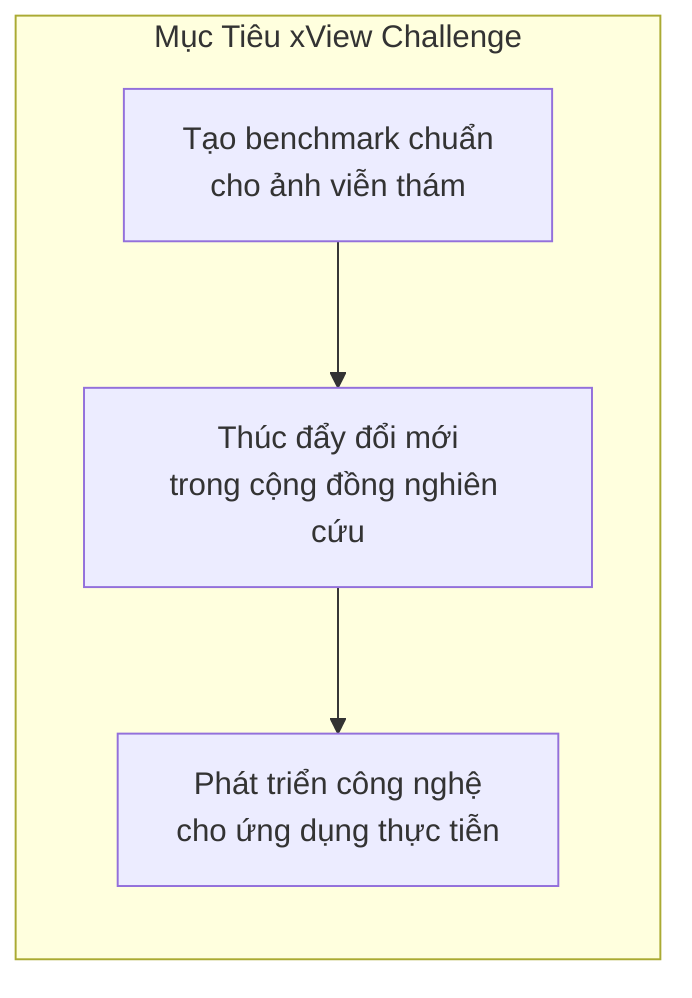
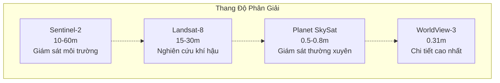
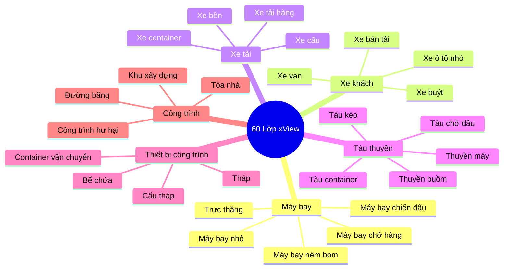
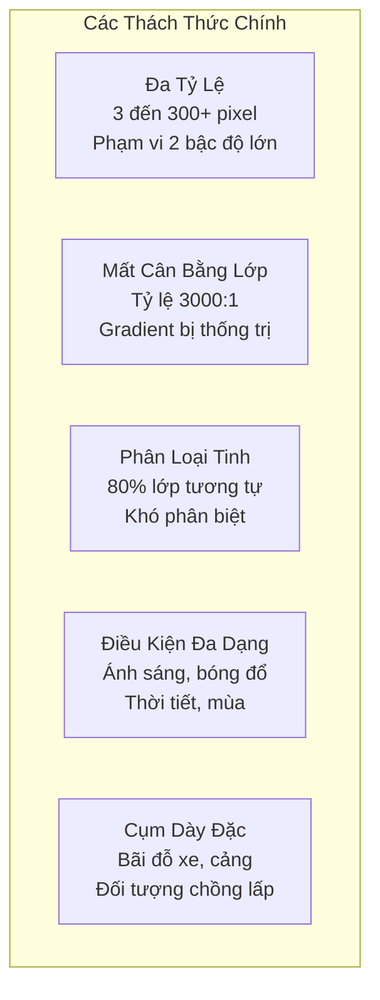
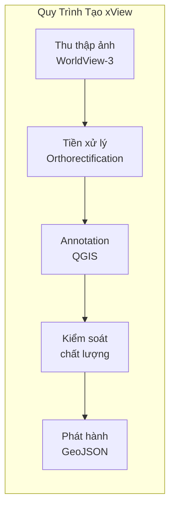

# 6.1.1 Bộ Dữ Liệu xView1: Nền Tảng Cho Phát Hiện Đối Tượng Quy Mô Lớn

## Lời Dẫn

Trước khi đi sâu vào các giải pháp kỹ thuật của xView1 Challenge, cần hiểu rõ bộ dữ liệu đã tạo nên cuộc thi này. xView1 không chỉ là một tập hợp ảnh vệ tinh thông thường, mà là nỗ lực có hệ thống nhằm tạo ra benchmark chuẩn mực cho bài toán phát hiện đối tượng trong ảnh viễn thám. Với hơn một triệu đối tượng được gán nhãn thủ công trải rộng trên 60 lớp, xView1 đặt ra những thách thức chưa từng có về quy mô và độ phức tạp.

| Thuộc tính | Giá trị |
|-----------|---------|
| **Năm phát hành** | 2018 |
| **Tổ chức** | Defense Innovation Unit (DIU) - Bộ Quốc phòng Hoa Kỳ |
| **Nguồn ảnh** | Vệ tinh WorldView-3 (Maxar Technologies) |
| **Độ phân giải** | 0.3 mét GSD |
| **Số lượng đối tượng** | ~1,000,000 |
| **Số lớp** | 60 lớp trong 7 danh mục |
| **Diện tích phủ** | ~1,400 km² |
| **Định dạng annotation** | GeoJSON với bounding box ngang |

---

## 1. Bối Cảnh Ra Đời

### 1.1 Khoảng Trống Trong Lĩnh Vực

Khi xView được công bố, cộng đồng thị giác máy tính đã có nhiều bộ dữ liệu benchmark nổi tiếng như COCO, ImageNet và Pascal VOC. Tuy nhiên, những bộ dữ liệu này được thiết kế cho ảnh chụp từ mặt đất với góc nhìn ngang, hoàn toàn khác biệt so với ảnh vệ tinh nhìn từ trên xuống. Sự khác biệt về góc nhìn tạo ra những thách thức riêng biệt: đối tượng trong ảnh vệ tinh thường có kích thước rất nhỏ, xuất hiện với mật độ dày đặc, và thiếu các đặc điểm về kết cấu mà mô hình học sâu đã quen thuộc.

Các bộ dữ liệu ảnh viễn thám trước đó như COWC (chỉ phát hiện xe ô tô) hay DOTA (chủ yếu ảnh từ máy bay) không phản ánh đầy đủ độ phức tạp của các ứng dụng thực tiễn. xView được thiết kế để lấp đầy khoảng trống này.

### 1.2 Mục Tiêu Của DIU

Defense Innovation Unit khởi xướng xView Challenge với ba mục tiêu chiến lược:



---

## 2. Đặc Điểm Kỹ Thuật

### 2.1 Nguồn Ảnh WorldView-3

Toàn bộ ảnh trong xView được thu thập từ vệ tinh WorldView-3, một trong những vệ tinh quan sát Trái đất thương mại tiên tiến nhất thế giới.

| Đặc điểm | Thông số |
|----------|----------|
| **Năm phóng** | 2014 |
| **Độ cao quỹ đạo** | 617 km |
| **GSD Panchromatic** | 0.31 mét |
| **GSD Multispectral** | 1.24 mét |
| **Băng phổ** | 8 VNIR + 8 SWIR |

Độ phân giải 0.3 mét GSD có nghĩa là mỗi pixel đại diện cho diện tích 30 × 30 cm trên mặt đất. Với độ phân giải này, một chiếc xe ô tô dài khoảng 4.5 mét sẽ có kích thước khoảng 15 × 5 pixel trong ảnh - đủ để nhận dạng nhưng vẫn là thách thức lớn cho các thuật toán.

### 2.2 So Sánh Với Các Nguồn Ảnh Khác



### 2.3 Phạm Vi Địa Lý

Bộ dữ liệu bao gồm ảnh từ nhiều khu vực địa lý khác nhau trên toàn cầu, đảm bảo tính đa dạng về môi trường (đô thị, nông thôn, công nghiệp, hàng hải, sa mạc), điều kiện ánh sáng, và mùa trong năm. Tổng diện tích phủ khoảng 1,400 km², tương đương diện tích một thành phố lớn như London.

---

## 3. Hệ Thống Phân Loại

### 3.1 Cấu Trúc 60 Lớp

xView sử dụng hệ thống phân loại hai cấp với 60 lớp được tổ chức thành 7 danh mục cha:



### 3.2 Vấn Đề Mất Cân Bằng Lớp

Sự phân bố đối tượng giữa các lớp cực kỳ không đồng đều, tạo ra một trong những thách thức lớn nhất của bộ dữ liệu:

| Lớp | Số lượng mẫu | Tỷ lệ |
|-----|--------------|-------|
| Xe ô tô nhỏ | ~300,000 | 30% |
| Công trình | ~200,000 | 20% |
| Container | ~80,000 | 8% |
| ... | ... | ... |
| Đầu máy tàu | ~100 | 0.01% |

Tỷ lệ chênh lệch giữa lớp phổ biến nhất và hiếm nhất lên đến **3000:1**. Đây là lý do tại sao các giải pháp chiến thắng như Reduced Focal Loss tập trung mạnh vào việc xử lý mất cân bằng lớp.

---

## 4. Thách Thức Kỹ Thuật

### 4.1 Năm Thách Thức Cốt Lõi



### 4.2 Ảnh Hưởng Đến Thiết Kế Mô Hình

Mỗi thách thức đòi hỏi giải pháp kỹ thuật riêng, và các đội đạt thành tích cao thường phải kết hợp nhiều kỹ thuật:

| Thách thức | Giải pháp phổ biến |
|------------|-------------------|
| Đa tỷ lệ | Feature Pyramid Network, Multi-scale training |
| Mất cân bằng | Focal Loss, Reduced Focal Loss, Class weighting |
| Phân loại tinh | Attention mechanisms, Hierarchical classification |
| Điều kiện đa dạng | Data augmentation mạnh |
| Cụm dày đặc | Soft-NMS, Anchor-free detectors |

---

## 5. Quy Trình Tạo Dữ Liệu

### 5.1 Tổng Quan Quy Trình



### 5.2 Kiểm Soát Chất Lượng Ba Giai Đoạn

Để đảm bảo chất lượng annotation, xView triển khai hệ thống kiểm tra nghiêm ngặt:

1. **Supervisor Review**: Kiểm tra ngẫu nhiên 10-20% công việc của mỗi annotator
2. **Cross-validation**: Mỗi ảnh được annotate độc lập bởi 2-3 người, so sánh tìm bất nhất quán
3. **Gold Standard**: Subset được expert domain gán nhãn với độ chính xác cao nhất

---

## 6. Cấu Trúc Cuộc Thi

### 6.1 Metric Đánh Giá

Cuộc thi sử dụng **mean Average Precision (mAP)** với ngưỡng IoU 0.5, tính trung bình trên tất cả 60 lớp với trọng số bằng nhau. Điều này đặt ra thách thức đặc biệt vì các lớp hiếm có ảnh hưởng bằng các lớp phổ biến trong điểm số cuối cùng.

### 6.2 Phân Chia Dữ Liệu

| Tập | Số ảnh | Đối tượng | Mục đích |
|-----|--------|-----------|----------|
| Training | ~847 | ~650,000 | Huấn luyện mô hình |
| Validation | ~282 | ~200,000 | Điều chỉnh hyperparameter |
| Test | ~350 | ~150,000 | Đánh giá cuối (nhãn không công khai) |

### 6.3 Kết Quả Cuộc Thi

| Hạng | Đội | mAP |
|------|-----|-----|
| 1 | Sergievskiy & Ponamarev | 31.74 |
| 2 | [Đội 2] | 28.9 |
| 3 | [Đội 3] | 27.5 |
| 4 | [Đội 4] | 26.8 |
| 5 | [Đội 5] | 25.9 |
| Baseline | DIU | ~15.0 |

---

## 7. So Sánh Với Các Bộ Dữ Liệu Khác

| Bộ dữ liệu | Năm | Đối tượng | Lớp | Loại BB | GSD |
|------------|-----|-----------|-----|---------|-----|
| **xView** | 2018 | 1,000,000 | 60 | Ngang | 0.3m |
| DOTA | 2018 | 188,000 | 15 | Xoay | Đa dạng |
| DIOR | 2020 | 192,000 | 20 | Ngang | 0.5-30m |
| iSAID | 2019 | 655,000 | 15 | Instance | Đa dạng |
| FAIR1M | 2021 | 1,000,000+ | 37 | Xoay | 0.3-0.8m |

xView nổi bật với số lượng lớp nhiều nhất (60) và độ phân giải cao nhất (0.3m) trong số các bộ dữ liệu công khai tại thời điểm phát hành.

---

## 8. Tài Nguyên và Truy Cập

### 8.1 Tải Về

- **Website chính thức**: [xviewdataset.org](https://xviewdataset.org/)
- **Dung lượng**: ~30-40 GB
- **Định dạng ảnh**: GeoTIFF
- **Định dạng nhãn**: GeoJSON

### 8.2 Bài Báo Gốc

```
@article{lam2018xview,
  title={xView: Objects in Context in Overhead Imagery},
  author={Lam, Darius and Kuzma, Richard and McGee, Kevin and others},
  journal={arXiv preprint arXiv:1802.07856},
  year={2018}
}
```

---

## Tài Liệu Tham Khảo

1. Lam, D., et al. (2018). xView: Objects in Context in Overhead Imagery. arXiv:1802.07856.

2. DIU xView Challenge Series. Defense Innovation Unit.

3. Maxar Technologies. WorldView-3 Satellite Specifications.

---

*Mục tiếp theo sẽ trình bày giải pháp hạng nhất của cuộc thi xView1, với đóng góp quan trọng về Reduced Focal Loss - một kỹ thuật đột phá trong xử lý mất cân bằng lớp.*
