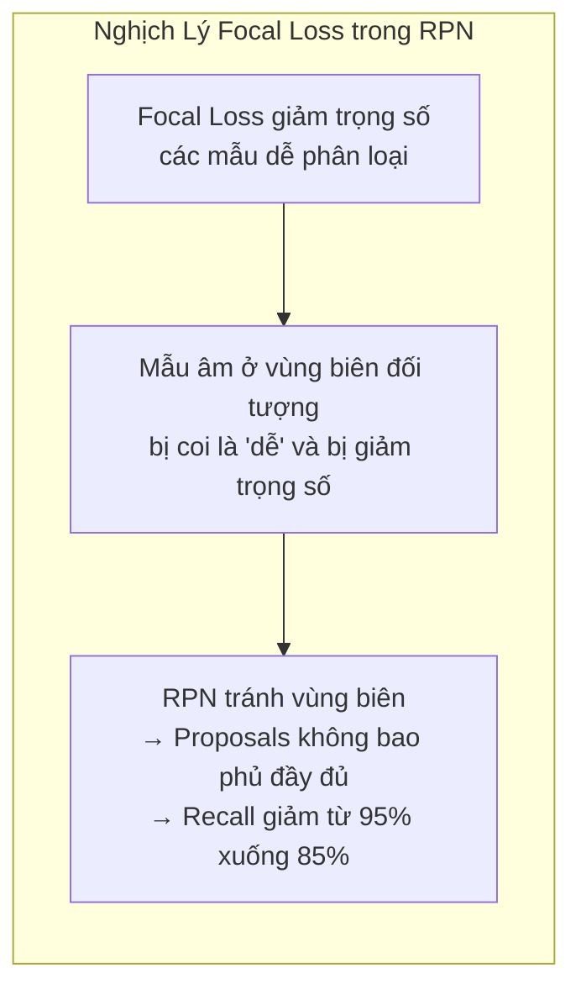
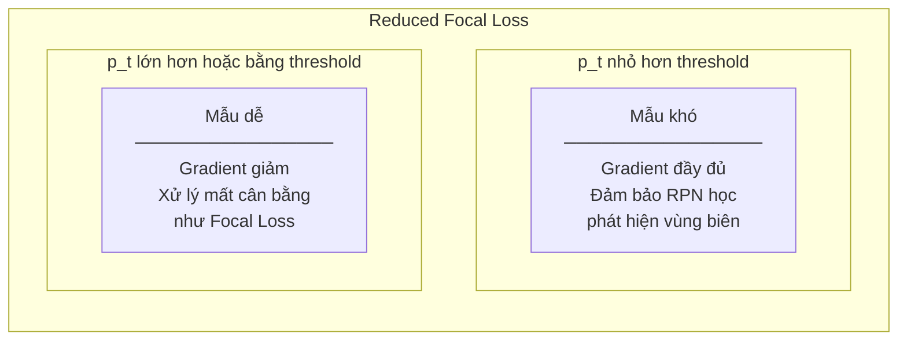
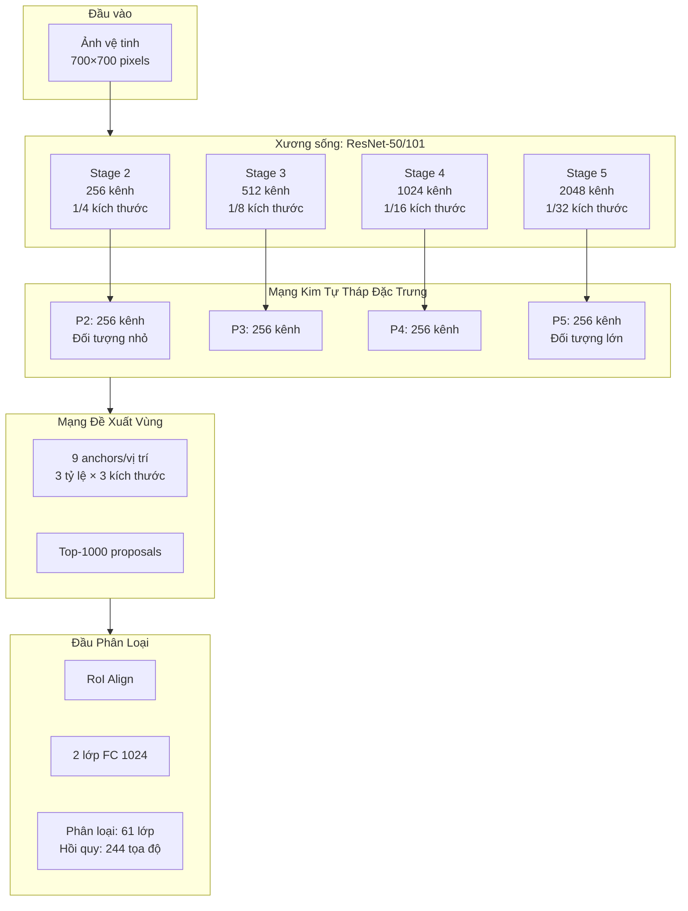
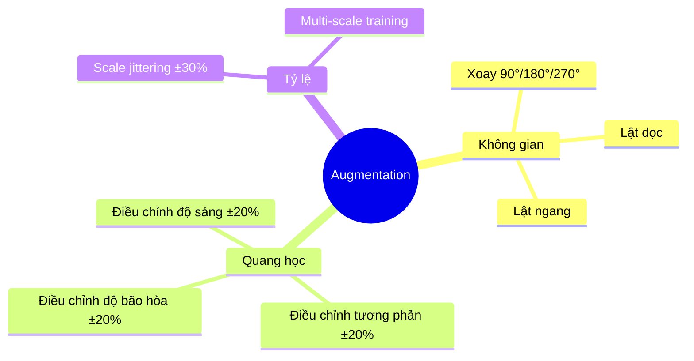

# 6.1.2 Giải Pháp Hạng Nhất xView1: Reduced Focal Loss

## Tổng Quan Giải Pháp

Giải pháp đạt hạng nhất trong cuộc thi xView1 Detection Challenge 2018 được phát triển bởi Nikolay Sergievskiy và Alexander Ponamarev, hai nhà nghiên cứu độc lập đến từ Nga. Với điểm mAP 31.74 trên public leaderboard và 29.32 trên private leaderboard, giải pháp này vượt trội hơn 111% so với baseline do ban tổ chức cung cấp, đánh dấu một bước tiến đáng kể trong lĩnh vực phát hiện đối tượng từ ảnh viễn thám.

| Thuộc tính | Giá trị |
|-----------|---------|
| **Xếp hạng** | 1/2,300+ bài nộp |
| **Tác giả** | Nikolay Sergievskiy, Alexander Ponamarev |
| **Điểm mAP** | 31.74 (public) / 29.32 (private) |
| **Đóng góp chính** | Reduced Focal Loss |
| **Bài báo** | arXiv:1903.01347 |

---

## 1. Bối Cảnh và Vấn Đề Cần Giải Quyết

### 1.1 Thách Thức Mất Cân Bằng Lớp Cực Độ

Bộ dữ liệu xView1 chứa hơn một triệu đối tượng được gán nhãn, nhưng sự phân bố giữa các lớp cực kỳ không đồng đều. Hai lớp phổ biến nhất - xe ô tô nhỏ và công trình - chiếm tới 60% tổng số mẫu, trong khi các lớp hiếm như đầu máy tàu hỏa chỉ có vài trăm mẫu. Tỷ lệ chênh lệch giữa lớp lớn nhất và nhỏ nhất lên tới 3000:1.

Sự mất cân bằng này tạo ra một thách thức nghiêm trọng cho việc huấn luyện mô hình: các gradient từ lớp phổ biến thống trị quá trình học, khiến mô hình hầu như không học được gì về các lớp hiếm. Khi metric đánh giá là trung bình AP của tất cả các lớp với trọng số bằng nhau, hiệu suất kém trên các lớp hiếm sẽ kéo điểm tổng thể xuống đáng kể.

### 1.2 Nghịch Lý Focal Loss Trong Mạng Đề Xuất Vùng

Focal Loss, được Lin và cộng sự đề xuất năm 2017, là một giải pháp phổ biến cho vấn đề mất cân bằng lớp. Ý tưởng cốt lõi của Focal Loss là giảm trọng số của các mẫu dễ phân loại để mô hình tập trung vào các mẫu khó.

Tuy nhiên, nhóm tác giả phát hiện một nghịch lý thú vị: khi áp dụng Focal Loss cho Mạng Đề Xuất Vùng (Region Proposal Network - RPN) trong kiến trúc Faster R-CNN, thay vì cải thiện, hiệu suất lại giảm đáng kể.

Nguyên nhân của hiện tượng này nằm ở vai trò đặc biệt của RPN trong kiến trúc hai giai đoạn. RPN có nhiệm vụ tạo ra các vùng đề xuất chất lượng cao để gửi cho bộ phân loại ở giai đoạn sau. Khi Focal Loss giảm trọng số các mẫu âm dễ phân loại, nó vô tình cũng giảm trọng số các mẫu âm quan trọng ở vùng biên của đối tượng - chính xác là những vùng mà RPN cần học để tạo proposals chính xác.

---

## 2. Đổi Mới Kỹ Thuật: Reduced Focal Loss

### 2.1 Ý Tưởng Cốt Lõi

Để giải quyết nghịch lý trên, Sergievskiy và Ponamarev đề xuất Reduced Focal Loss - một biến thể của Focal Loss với cơ chế trọng số thích ứng dựa trên ngưỡng xác suất.

Ý tưởng chính là chia không gian xác suất thành hai vùng:
- **Dưới ngưỡng** (mặc định 0.5): Sử dụng cross-entropy tiêu chuẩn với trọng số đầy đủ
- **Trên ngưỡng**: Áp dụng trọng số focal đã được điều chỉnh

### 2.2 So Sánh Các Hàm Mất Mát

Bảng so sánh đặc tính của ba hàm mất mát:

| Hàm mất mát | Đặc điểm | Ưu điểm | Nhược điểm |
|-------------|----------|---------|------------|
| **Cross-Entropy** | Gradient đều cho mọi mẫu | Học đầy đủ mọi vùng | Không xử lý mất cân bằng |
| **Focal Loss** | Giảm gradient mẫu dễ | Tập trung mẫu khó | Có thể bỏ qua mẫu quan trọng ở biên |
| **Reduced Focal Loss** | Ngưỡng phân vùng | Kết hợp ưu điểm cả hai | Thêm hyperparameter (threshold) |

### 2.3 Kết Quả Thực Nghiệm

Bảng so sánh hiệu suất của các hàm mất mát trên xView1:

| Hàm mất mát | Recall RPN @1000 | mAP cuối |
|-------------|------------------|----------|
| Cross-Entropy tiêu chuẩn | 94.2% | 24.1 |
| Focal Loss (γ=2) | 86.5% | 22.8 |
| **Reduced Focal Loss** | **93.8%** | **28.5** |

Reduced Focal Loss gần như khôi phục lại recall của RPN (93.8% so với 94.2%) trong khi vẫn đạt được lợi ích của việc xử lý mất cân bằng lớp, dẫn đến cải thiện +4.4 mAP so với baseline.

---

## 3. Kiến Trúc Mô Hình

### 3.1 Tổng Quan Kiến Trúc

Giải pháp sử dụng kiến trúc Faster R-CNN với Feature Pyramid Network (FPN), một lựa chọn phổ biến cho các bài toán phát hiện đối tượng đa tỷ lệ.

### 3.2 Chiến Lược Xử Lý Ảnh Lớn

Ảnh xView1 có kích thước rất lớn (trung bình 3,000 × 3,000 pixels), vượt quá khả năng xử lý trực tiếp của GPU. Giải pháp sử dụng chiến lược chia nhỏ (tiling) với các tham số được tối ưu cẩn thận:

| Tham số | Giá trị | Ý nghĩa |
|---------|---------|---------|
| Kích thước tile | 700 × 700 | Cân bằng giữa ngữ cảnh và bộ nhớ |
| Độ chồng lấp | 80 pixels | Tránh cắt ngang đối tượng |
| Tổng số crops | ~63,000 | Sau khi xoay và augmentation |

### 3.3 Chiến Lược Ensemble

Giải pháp cuối cùng sử dụng ensemble của 7 mô hình với các cấu hình khác nhau:

| Mô hình | Backbone | Kích thước crop | mAP đơn |
|---------|----------|-----------------|---------|
| M1 | ResNet-50 | 700×700 | 28.5 |
| M2 | ResNet-50 | 800×800 | 29.1 |
| M3 | ResNet-101 | 700×700 | 29.8 |
| M4 | ResNeXt-101 | 700×700 | 30.2 |
| M5 | ResNet-50 | 600×600 | 27.8 |
| M6 | ResNet-101 | 800×800 | 30.0 |
| M7 | ResNeXt-101 | 800×800 | 30.5 |
| **Ensemble** | - | - | **31.74** |

Việc sử dụng ensemble đa dạng về cả backbone (ResNet-50, ResNet-101, ResNeXt-101) và kích thước đầu vào (600, 700, 800) giúp mô hình bao phủ được nhiều tỷ lệ đối tượng khác nhau và giảm thiểu overfitting.

---

## 4. Các Kỹ Thuật Bổ Sung

### 4.1 Lấy Mẫu Cân Bằng Lớp

Ngoài Reduced Focal Loss, giải pháp còn áp dụng kỹ thuật undersampling cho các lớp phổ biến:

- **Lớp mục tiêu**: Xe ô tô nhỏ, Công trình
- **Xác suất loại bỏ**: 50%
- **Hiệu quả**: Cải thiện mAP cho lớp hiếm từ ~5% lên ~18%

### 4.2 Augmentation Đa Dạng

Chiến lược augmentation được thiết kế phù hợp với đặc thù ảnh viễn thám:

### 4.3 Quy Trình Huấn Luyện Hai Giai Đoạn

**Giai đoạn 1** (200K iterations): Huấn luyện cơ bản với learning rate 0.005

**Giai đoạn 2** (100K iterations): Tinh chỉnh với learning rate giảm 10 lần và bật undersampling

---

## 5. Phân Tích Kết Quả

### 5.1 Đóng Góp Của Từng Thành Phần

| Cấu hình | mAP | Thay đổi |
|----------|-----|----------|
| Baseline (Cross-Entropy) | 24.1 | - |
| + Focal Loss (γ=2) | 22.8 | -1.3 |
| + Reduced Focal Loss | 28.5 | +4.4 |
| + Undersampling | 29.8 | +1.3 |
| + Ensemble (7 mô hình) | 31.74 | +1.94 |

Phát hiện quan trọng: Focal Loss tiêu chuẩn thực sự *làm giảm* hiệu suất (-1.3 mAP), trong khi Reduced Focal Loss đem lại cải thiện đáng kể (+4.4 mAP).

### 5.2 Hiệu Suất Theo Danh Mục Đối Tượng

| Danh mục | mAP | Nhận xét |
|----------|-----|----------|
| Máy bay | ~45 | Hình dạng rõ ràng, tương phản cao |
| Tàu thuyền | ~40 | Tương phản tốt với nền nước |
| Xe lớn | ~30 | Đa dạng về hình dạng |
| Xe nhỏ | ~25 | Thách thức về kích thước |
| Công trình | ~28 | Đa dạng kiến trúc |
| Đầu máy tàu | ~12 | Lớp rất hiếm |

Có thể thấy các đối tượng có hình dạng đặc trưng và tương phản cao (máy bay, tàu thuyền) đạt hiệu suất cao nhất, trong khi các lớp hiếm vẫn còn khó khăn dù đã được cải thiện đáng kể.

---

## 6. Ý Nghĩa và Tác Động

### 6.1 Đóng Góp Cho Cộng Đồng Nghiên Cứu

Reduced Focal Loss đã trở thành một kỹ thuật được tham khảo rộng rãi trong cộng đồng nghiên cứu phát hiện đối tượng. Ý tưởng về việc duy trì gradient đầy đủ cho các mẫu khó trong khi vẫn xử lý mất cân bằng lớp đã mở ra hướng nghiên cứu mới về thiết kế hàm mất mát thích ứng.

### 6.2 Bài Học Rút Ra

1. **Không áp dụng máy móc**: Focal Loss hiệu quả cho detector một giai đoạn nhưng có thể gây hại cho detector hai giai đoạn

2. **Hiểu vai trò của mỗi thành phần**: RPN và classifier head có mục tiêu khác nhau, cần hàm mất mát phù hợp

3. **Kết hợp nhiều kỹ thuật**: Reduced Focal Loss + undersampling + ensemble tạo hiệu quả cộng hưởng

4. **Đa dạng ensemble**: Sử dụng nhiều backbone và kích thước khác nhau giúp bao phủ đa tỷ lệ

---

## Tài Liệu Tham Khảo

1. Sergievskiy, N., & Ponamarev, A. (2019). Reduced Focal Loss: 1st Place Solution to xView object detection in Satellite Imagery. arXiv:1903.01347.

2. Lin, T. Y., Goyal, P., Girshick, R., He, K., & Dollár, P. (2017). Focal Loss for Dense Object Detection. IEEE ICCV.

3. Lin, T. Y., Dollár, P., Girshick, R., He, K., Hariharan, B., & Belongie, S. (2017). Feature Pyramid Networks for Object Detection. IEEE CVPR.

---

*Mục tiếp theo sẽ trình bày giải pháp hạng nhì của cuộc thi, với những đóng góp về Domain Adversarial Training và Feature Enhancement.*
