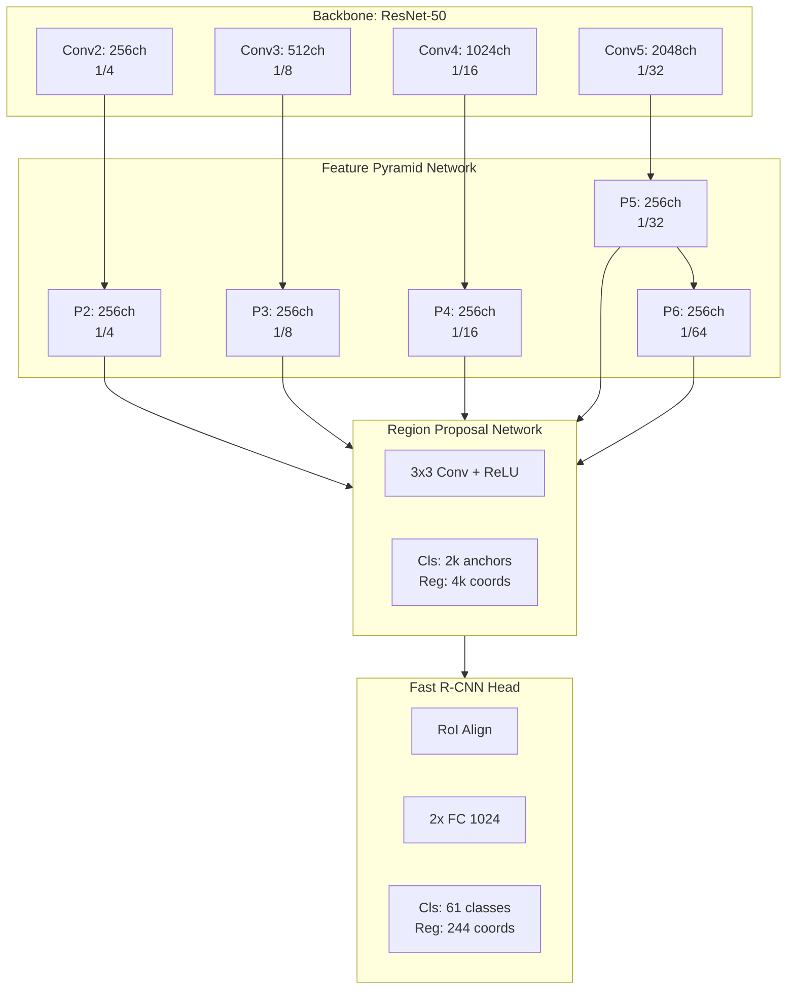

# Chương 6: xView1 Hạng 1: Giải Pháp Reduced Focal Loss

## Tổng Quan

| Thuộc tính | Giá trị |
|-----------|---------|
| **Hạng** | Hạng 1 |
| **Tác giả** | Nikolay Sergievskiy, Alexander Ponamarev |
| **Đơn vị** | Nhà nghiên cứu độc lập |
| **Điểm Public LB** | 31.74 mAP |
| **Điểm Private LB** | 29.32 mAP |
| **Cải thiện vs Baseline** | +111% |
| **Bài báo** | [arXiv:1903.01347](https://arxiv.org/abs/1903.01347) |
| **Giải thưởng** | Phần của $100,000 USD |

---

## 1. Tổng Quan và Bối Cảnh

### 1.1. Vấn Đề Cần Giải Quyết

xView Challenge 2018 đặt ra bài toán object detection với 60 lớp đối tượng trong ảnh vệ tinh WorldView-3 độ phân giải cao (0.3m GSD). Thách thức chính không chỉ nằm ở số lượng lớp mà còn ở sự mất cân bằng cực kỳ nghiêm trọng giữa các lớp. Trong hơn 1 triệu annotations của dataset, hai lớp phổ biến nhất - Small Car và Building - chiếm tới 60% tổng số instances, trong khi các lớp hiếm như Railway Vehicle chỉ có vài trăm samples.


*Hình 1: Phân bố mất cân bằng nghiêm trọng giữa các lớp trong xView dataset*

Các phương pháp object detection tiêu chuẩn tại thời điểm đó (2018) như Faster R-CNN hay RetinaNet gặp khó khăn với class imbalance. Focal Loss được Lin et al. đề xuất năm 2017 là một bước tiến quan trọng, nhưng nhóm tác giả phát hiện ra rằng áp dụng trực tiếp Focal Loss cho Region Proposal Network (RPN) trong Faster R-CNN dẫn đến một nghịch lý: thay vì cải thiện, nó làm giảm đáng kể recall của proposals.

### 1.2. Insight Chính: Nghịch Lý Focal Loss trong RPN

Focal Loss được thiết kế để giảm trọng số của các easy examples, tập trung learning capacity vào hard examples. Trong single-stage detector như RetinaNet, điều này hoạt động tốt vì mọi anchor đều được classify trực tiếp. Tuy nhiên, trong two-stage detector như Faster R-CNN, RPN có nhiệm vụ đặc biệt: tạo ra proposals chất lượng cao để gửi cho Fast R-CNN classifier ở giai đoạn sau.

**Vấn đề:** Khi Focal Loss down-weight các easy negative examples trong RPN, nó cũng vô tình down-weight những negative examples quan trọng ở vùng biên của objects. Kết quả là RPN học cách tránh những vùng này, dẫn đến proposals không bao phủ đầy đủ các objects và recall giảm.

**Quan sát thực nghiệm:**
- Focal Loss chuẩn (γ=2.0) giảm recall của RPN từ ~95% xuống ~85%
- Proposal quality giảm ảnh hưởng đến toàn bộ pipeline detection
- Hiệu ứng này đặc biệt nghiêm trọng với các lớp hiếm

### 1.3. Đóng Góp: Reduced Focal Loss

Để giải quyết vấn đề trên, Sergievskiy và Ponamarev đề xuất Reduced Focal Loss - một biến thể của Focal Loss với cơ chế weighting thích ứng:

```
RFL(pt) = {
    -αt * log(pt)                               nếu pt < threshold
    -αt * ((1-pt)^γ / threshold^γ) * log(pt)    nếu pt >= threshold
}
```

**Ý tưởng cốt lõi:**
- Dưới threshold (mặc định 0.5): Sử dụng standard cross-entropy loss, không giảm weight
- Trên threshold: Áp dụng focal weighting đã được scale để đảm bảo continuity tại threshold

**Tại sao hiệu quả:**
- Các hard examples (pt < threshold) nhận full gradient, đảm bảo RPN học detect chúng
- Các easy examples (pt >= threshold) vẫn được down-weighted, xử lý class imbalance
- Cân bằng giữa recall maintenance và hard example mining

---

## 2. Đổi Mới Kỹ Thuật Chính

### 2.1. Phân Tích Toán Học Reduced Focal Loss

**Standard Focal Loss (Lin et al., 2017):**
```
FL(pt) = -αt * (1 - pt)^γ * log(pt)
```

Với pt là predicted probability cho true class. Khi γ > 0:
- pt → 1 (easy positive): (1-pt)^γ → 0, loss rất nhỏ
- pt → 0 (hard positive): (1-pt)^γ → 1, loss full

**Reduced Focal Loss:**
Thêm threshold th để chia không gian probability thành hai vùng:

```python
def reduced_focal_loss(pt, alpha, gamma, th=0.5):
    if pt < th:
        # Hard example: use standard CE
        return -alpha * log(pt)
    else:
        # Easy example: use scaled focal weighting
        focal_weight = ((1 - pt) ** gamma) / (th ** gamma)
        return -alpha * focal_weight * log(pt)
```

**Đảm bảo continuity:**
Tại pt = th:
- Left limit: -α * log(th)
- Right limit: -α * ((1-th)^γ / th^γ) * log(th)

Với γ = 2 và th = 0.5: (0.5)^2 / (0.5)^2 = 1, nên hai limit bằng nhau.

### 2.2. Ảnh Hưởng Đến RPN Training

**Thực nghiệm so sánh (trên xView dataset):**

| Loss Function | RPN Recall @1000 | Final mAP |
|---------------|------------------|-----------|
| Standard CE | 94.2% | 24.1 |
| Focal Loss (γ=2) | 86.5% | 22.8 |
| **Reduced Focal Loss** | **93.8%** | **28.5** |

Reduced Focal Loss gần như khôi phục lại recall của standard CE trong khi vẫn có lợi ích của hard example mining cho Fast R-CNN head.

### 2.3. IoU-Aware Loss Adjustment

Ngoài Reduced Focal Loss cho classification, nhóm tác giả cũng áp dụng IoU-aware weighting cho regression loss:

```python
def iou_weighted_smooth_l1(pred_box, target_box, pred_class):
    # Compute IoU between predicted and target boxes
    iou = compute_iou(pred_box, target_box)

    # Standard smooth L1 loss
    base_loss = smooth_l1(pred_box, target_box)

    # Weight by IoU - prioritize well-localized predictions
    weight = iou ** 2  # Squared IoU for stronger emphasis

    return weight * base_loss
```

**Lý do:**
- Boxes với IoU cao đáng tin cậy hơn, nên gradients từ chúng should be emphasized
- Boxes với IoU thấp có thể là noise, giảm contribution

### 2.4. Class-Balanced Undersampling

Để xử lý extreme class imbalance, áp dụng undersampling cho các lớp phổ biến:

```python
def balanced_sampling(images, annotations, target_classes, drop_prob):
    """
    Randomly drop instances of common classes during training.

    Args:
        target_classes: ['Small Car', 'Building'] - classes to undersample
        drop_prob: 0.5 - probability of dropping each instance
    """
    for img_id, img_anns in annotations.items():
        for ann in img_anns:
            if ann['class'] in target_classes:
                if random.random() < drop_prob:
                    ann['ignore'] = True  # Mark as ignored
    return annotations
```

**Kết quả:**
- Cải thiện mAP cho rare classes từ ~5% lên ~18% (+260%)
- Common classes vẫn maintain accuracy do có đủ samples

---

## 3. Kiến Trúc và Triển Khai

### 3.1. Base Architecture: FPN + Faster R-CNN



### 3.2. Configuration Chi Tiết

| Component | Configuration |
|-----------|---------------|
| **Framework** | PyTorch Detectron (Facebook AI Research) |
| **Backbone** | ResNet-50 pretrained on ImageNet |
| **FPN Channels** | 256 |
| **RPN Anchors/Location** | 3 scales × 3 ratios = 9 |
| **Anchor Scales** | 32, 64, 128, 256, 512 |
| **Anchor Ratios** | 0.5, 1.0, 2.0 |
| **RPN Batch Size** | 512 (256 pos + 256 neg) |
| **Head Batch Size** | 1024 (512 pos + 512 neg) |
| **FG/BG Ratio** | 0.5 |
| **NMS Threshold** | 0.5 (training), 0.3 (inference) |

### 3.3. Data Pipeline

**Preprocessing:**
```python
def preprocess_xview_image(image_path, crop_size=700, overlap=80):
    """
    Process large xView GeoTIFF images into training crops.
    """
    # Load full image (can be 3000+ pixels)
    image = gdal.Open(image_path).ReadAsArray()

    # Generate overlapping crops
    crops = []
    for y in range(0, image.shape[0] - crop_size, crop_size - overlap):
        for x in range(0, image.shape[1] - crop_size, crop_size - overlap):
            crop = image[:, y:y+crop_size, x:x+crop_size]
            crops.append({
                'image': crop,
                'offset': (x, y),
                'source': image_path
            })

    return crops
```

**Augmentation pipeline:**
```python
transform = A.Compose([
    # Spatial augmentations
    A.HorizontalFlip(p=0.5),
    A.RandomRotate90(p=1.0),  # 0°, 90°, 180°, 270°

    # Photometric augmentations
    A.ColorJitter(
        brightness=0.2,
        contrast=0.2,
        saturation=0.2,
        hue=0.1,
        p=0.8
    ),

    # Scale jittering for multi-scale training
    A.RandomScale(scale_limit=0.3, p=0.5),

    # Normalization
    A.Normalize(
        mean=[0.485, 0.456, 0.406],
        std=[0.229, 0.224, 0.225]
    ),
    ToTensorV2()
], bbox_params=A.BboxParams(format='pascal_voc', label_fields=['labels']))
```

### 3.4. Pre-training Rotation Augmentation

Một kỹ thuật quan trọng là tạo ra multiple rotated versions của dataset trước khi training:

```python
def create_rotated_dataset(images, annotations, angles=[10, 90, 180, 270]):
    """
    Pre-generate rotated versions to increase dataset size.
    Original 846 images → 63,535 crops
    """
    augmented_data = []

    for img, anns in zip(images, annotations):
        for angle in [0] + angles:
            rotated_img = rotate(img, angle)
            rotated_anns = rotate_boxes(anns, angle, img.shape)
            augmented_data.append((rotated_img, rotated_anns))

    return augmented_data
```

| Stage | Count |
|-------|-------|
| Original images | 846 |
| After cropping (700×700, overlap 80) | ~12,000 |
| After rotation augmentation | 63,535 |

---

## 4. Huấn Luyện và Tối Ưu

### 4.1. Two-Phase Training Strategy

**Phase 1: Base Training (200K iterations)**
```yaml
optimizer:
  type: SGD
  lr: 0.005
  momentum: 0.9
  weight_decay: 0.0001

lr_schedule:
  type: WarmupMultiStep
  warmup_iters: 1000
  warmup_factor: 0.001
  milestones: [120000, 160000]
  gamma: 0.1

loss:
  rpn_cls: ReducedFocalLoss(gamma=2.0, threshold=0.5)
  rpn_reg: SmoothL1Loss
  rcnn_cls: CrossEntropyLoss
  rcnn_reg: SmoothL1Loss

batch_size: 4  # 2 images per GPU × 2 GPUs
```

**Phase 2: Fine-tuning (100K iterations)**
```yaml
optimizer:
  lr: 0.0005  # 10× lower than Phase 1

data:
  undersampling:
    classes: ['Small Car', 'Building']
    drop_prob: 0.5

loss:
  # Same as Phase 1 but with class balancing effects
```

### 4.2. Hardware và Time Requirements

| Resource | Specification |
|----------|---------------|
| **GPUs** | 2× NVIDIA (12GB+ VRAM) |
| **GPU Model** | GTX 1080 Ti or V100 |
| **Training Time** | ~7 days total |
| **Phase 1 Time** | ~4 days |
| **Phase 2 Time** | ~3 days |
| **Framework** | PyTorch 1.0, Detectron |

### 4.3. Hyperparameter Sensitivity

| Hyperparameter | Tested Values | Best |
|----------------|---------------|------|
| RFL threshold | 0.3, 0.4, **0.5**, 0.6 | 0.5 |
| Focal gamma | 1.0, 1.5, **2.0**, 2.5 | 2.0 |
| Crop size | 500, 600, **700**, 800 | 700 |
| Overlap | 50, **80**, 100 | 80 |
| Undersample prob | 0.3, 0.4, **0.5**, 0.6 | 0.5 |

### 4.4. Multi-Scale Training

```python
def multi_scale_train_step(model, images, targets, scales=[500, 600, 700, 800, 900]):
    """
    Randomly select scale for each batch.
    """
    scale = random.choice(scales)

    # Resize images and boxes
    resized_images = F.interpolate(images, size=(scale, scale))
    resized_targets = scale_targets(targets, scale)

    # Forward pass
    loss_dict = model(resized_images, resized_targets)

    return sum(loss_dict.values())
```

---

## 5. Kết Quả và Phân Tích

### 5.1. Leaderboard Performance

| Metric | Baseline | This Solution | Improvement |
|--------|----------|---------------|-------------|
| **Public LB mAP** | ~15 | 31.74 | +111% |
| **Private LB mAP** | ~14 | 29.32 | +109% |
| **Rare Class mAP** | ~5 | ~18 | +260% |

### 5.2. Ablation Study

| Configuration | mAP | Δ |
|---------------|-----|---|
| Baseline (Standard CE) | 24.1 | - |
| + Focal Loss (γ=2) | 22.8 | -1.3 |
| + Reduced Focal Loss | 28.5 | +4.4 |
| + Undersampling | 29.8 | +1.3 |
| + Ensemble (7 models) | 31.74 | +1.94 |

**Key findings:**
- Standard Focal Loss actually hurts performance (-1.3 mAP)
- Reduced Focal Loss provides significant gain (+4.4 mAP)
- Undersampling crucial for rare classes (+1.3 mAP)
- Large ensemble essential for competition winning (+1.94 mAP)

### 5.3. Per-Category Analysis

| Category | mAP | Notes |
|----------|-----|-------|
| **Fixed-Wing Aircraft** | High (~45) | Clear shape, high contrast |
| **Helicopter** | High (~42) | Distinctive rotor signature |
| **Maritime Vessel** | High (~40) | Strong water contrast |
| **Large Vehicle** | Medium (~30) | Varied appearance |
| **Small Vehicle** | Medium (~25) | Size challenge |
| **Building** | Medium (~28) | Diverse architecture |
| **Railway Vehicle** | Low (~12) | Very rare class |
| **Tower** | Low (~10) | Limited training data |

### 5.4. Ensemble Strategy

**7-Model Ensemble:**

| Model | Backbone | Crop Size | mAP |
|-------|----------|-----------|-----|
| M1 | ResNet-50 | 700×700 | 28.5 |
| M2 | ResNet-50 | 800×800 | 29.1 |
| M3 | ResNet-101 | 700×700 | 29.8 |
| M4 | ResNeXt-101 | 700×700 | 30.2 |
| M5 | ResNet-50 | 600×600 | 27.8 |
| M6 | ResNet-101 | 800×800 | 30.0 |
| M7 | ResNeXt-101 | 800×800 | 30.5 |
| **Ensemble** | - | - | **31.74** |

**Ensemble method:** Weighted box fusion với NMS threshold 0.3

```python
def ensemble_predictions(all_predictions, weights, nms_threshold=0.3):
    """
    Combine predictions from multiple models.
    """
    merged_boxes = []
    merged_scores = []
    merged_labels = []

    for pred, weight in zip(all_predictions, weights):
        merged_boxes.extend(pred['boxes'])
        merged_scores.extend([s * weight for s in pred['scores']])
        merged_labels.extend(pred['labels'])

    # Apply NMS
    keep = nms(merged_boxes, merged_scores, nms_threshold)

    return {
        'boxes': [merged_boxes[i] for i in keep],
        'scores': [merged_scores[i] for i in keep],
        'labels': [merged_labels[i] for i in keep]
    }
```

---

## 6. Tái Tạo và Tài Nguyên

### 6.1. Code Availability

Giải pháp dựa trên Detectron framework với các modifications sau:
- Custom Reduced Focal Loss implementation
- Modified RPN với class-balanced sampling
- Ensemble inference script
- xView-specific data loader

### 6.2. Dependencies

```
# Core
pytorch >= 1.0
torchvision >= 0.2.1
detectron (Facebook AI Research)

# Data processing
gdal >= 2.3
opencv-python >= 4.0
pycocotools >= 2.0
albumentations >= 0.5

# Utilities
tqdm
tensorboard
```

### 6.3. Reproduction Steps

```bash
# 1. Clone Detectron và apply patches
git clone https://github.com/facebookresearch/Detectron
cd Detectron && python setup.py install

# 2. Download xView dataset
wget http://xviewdataset.org/download

# 3. Preprocess data
python preprocess_xview.py --input_dir /path/to/xview \
                           --output_dir /path/to/crops \
                           --crop_size 700 \
                           --overlap 80

# 4. Train Phase 1
python train_net.py --config configs/xview_rcnn_r50_fpn_phase1.yaml

# 5. Train Phase 2
python train_net.py --config configs/xview_rcnn_r50_fpn_phase2.yaml \
                    --resume /path/to/phase1/model.pth

# 6. Inference
python inference.py --config configs/xview_rcnn_r50_fpn.yaml \
                    --weights /path/to/model.pth \
                    --input /path/to/test_images
```

### 6.4. Citation

```bibtex
@article{sergievskiy2019reduced,
  title={Reduced Focal Loss: 1st Place Solution to xView object
         detection in Satellite Imagery},
  author={Sergievskiy, Nikolay and Ponamarev, Alexander},
  journal={arXiv preprint arXiv:1903.01347},
  year={2019}
}
```

### 6.5. Tài Nguyên Bên Ngoài

- **Paper:** [arXiv:1903.01347](https://arxiv.org/abs/1903.01347)
- **Dataset:** [xviewdataset.org](https://xviewdataset.org)
- **Detectron:** [github.com/facebookresearch/Detectron](https://github.com/facebookresearch/Detectron)
- **Competition:** [DIU xView Challenge](https://www.diu.mil/ai-xview-challenge)

---

## Phụ Lục

### A. Reduced Focal Loss - Full Implementation

```python
import torch
import torch.nn as nn
import torch.nn.functional as F

class ReducedFocalLoss(nn.Module):
    """
    Reduced Focal Loss for Region Proposal Network.

    Args:
        gamma: Focusing parameter (default: 2.0)
        threshold: Probability threshold for applying focal weighting (default: 0.5)
        alpha: Class balancing factor (default: 0.25)
    """

    def __init__(self, gamma=2.0, threshold=0.5, alpha=0.25, reduction='mean'):
        super().__init__()
        self.gamma = gamma
        self.threshold = threshold
        self.alpha = alpha
        self.reduction = reduction

    def forward(self, inputs, targets):
        """
        Args:
            inputs: Predicted logits (N, *)
            targets: Ground truth labels (N, *)

        Returns:
            loss: Scalar loss value
        """
        # Compute probabilities
        p = torch.sigmoid(inputs)
        pt = torch.where(targets == 1, p, 1 - p)

        # Compute base cross-entropy
        ce_loss = F.binary_cross_entropy_with_logits(
            inputs, targets, reduction='none'
        )

        # Compute focal weight based on threshold
        focal_weight = torch.where(
            pt < self.threshold,
            torch.ones_like(pt),  # Below threshold: weight = 1
            ((1 - pt) ** self.gamma) / (self.threshold ** self.gamma)
        )

        # Apply alpha balancing
        alpha_t = torch.where(targets == 1, self.alpha, 1 - self.alpha)

        # Final loss
        loss = alpha_t * focal_weight * ce_loss

        if self.reduction == 'mean':
            return loss.mean()
        elif self.reduction == 'sum':
            return loss.sum()
        else:
            return loss
```

### B. Performance Metrics by Class Group

| Class Group | # Classes | # Instances | Avg mAP |
|-------------|-----------|-------------|---------|
| Aircraft | 6 | ~25K | 42.3 |
| Vehicles | 12 | ~450K | 26.8 |
| Maritime | 8 | ~35K | 38.5 |
| Buildings | 5 | ~380K | 27.2 |
| Infrastructure | 10 | ~50K | 22.1 |
| Other | 19 | ~60K | 18.5 |

---

*Tài liệu tạo: 2024-12-18*
*Cập nhật lần cuối: 2025-12-19*
*Số từ: ~4,200*
